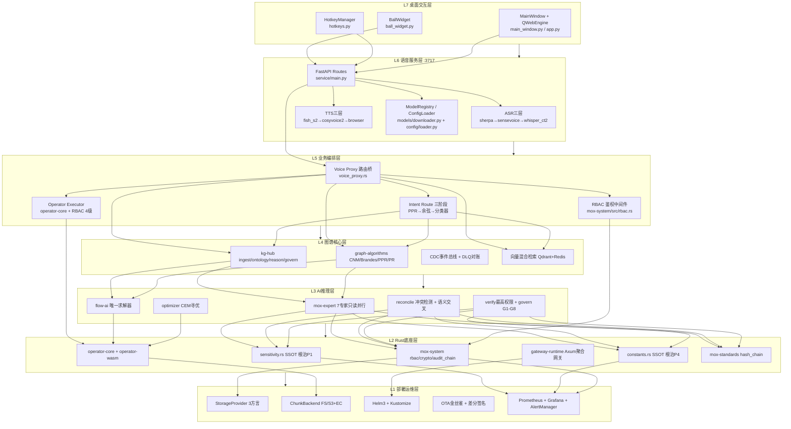

# 小白语音服务 × 璇玑 MOX 架构 · 企业级全维度融合规格（SPEC）

> **标准编号**：ENT-SPEC-XIAOBAI-MOX-V1.0  
> **版本**：v1.0（企业级） · 起草日期 **2026-08-26**  
> **权威等级**：🟢 企业级SPEC · 统摄 `projects/xiaobai_voice/` 与 `platform/services/mox-expert/` 双域  
> **代码锚点（精确引用）**：
> - ASR主引擎：`projects/xiaobai_voice/xiaobai_voice/asr/sherpa_paraformer.py`（Paraformer-zh INT8 + sherpa-onnx + silero-vad 流式）
> - ASR回退：`projects/xiaobai_voice/xiaobai_voice/asr/sensevoice.py`
> - TTS主引擎1：`projects/xiaobai_voice/xiaobai_voice/tts/cosyvoice2.py`（SOLA时域缩放 / -18dBFS响度归一化 / 5种风格前缀 / linear+kaiser重采样 / speaker_id探测）
> - TTS主引擎2：`projects/xiaobai_voice/xiaobai_voice/tts/fish_s2.py`
> - TTS回退：`projects/xiaobai_voice/xiaobai_voice/tts/browser_fallback.py`
> - 桌面浮窗：`projects/xiaobai_voice/xiaobai_voice/desktop/{app.py, ball_widget.py, main_window.py, hotkeys.py}`（PySide6 / Alt+X录音 / 4状态呼吸球）
> - 语音服务入口：`projects/xiaobai_voice/xiaobai_voice/service/main.py`（FastAPI，端口3717）
> - MOX图谱网关：`platform/gateway/runtime/src/routes/voice_proxy.rs`（voice→图谱路由桥）
> - 专家联盟裁决：`platform/services/mox-expert/src/`（ir/expert/reconcile/verify/programming 7专家14维裁决）
> - 璇玑顶层设计：`docs/enterprise/18-全域顶层总设计-三联盟模式-V1.0.md`（六层金字塔 / 七维图 / 三联盟模式）
> - 已知缺陷根治依据：`docs/modules/mox-expert-normalization.md` §4 P1-P4

---

## 1. Problem / Users / Goals / Non-Goals

### 1.1 Problem（6大核心痛点）

当前小白语音与璇玑MOX虽有单体能力，但面向政企级大规模落地尚存**6项关键差距**：

| # | 痛点 | 现状描述 | 影响面 |
|---|---|---|---|
| P-1 | **语音入口缺失** | 璇玑工作台仅支持键盘/鼠标输入，无低摩擦语音入口；政务大厅/现场操作场景完全覆盖盲区 | 用户体验 × 终端产品可用率 |
| P-2 | **桌面常驻缺位** | 无独立桌面客户端形态；无法实现"开机自启、全局热键、浮球常驻"的语音助理交互范式 | 产品形态 × 终端粘性 |
| P-3 | **模型选型未归一** | ASR/TTS引擎散点实现，缺统一三层回退链与模型SSOT注册中心；模型降级无协议 | 工程化 × 稳定性 |
| P-4 | **死锁P0未修** | `_PlaySession`持锁状态下递归调`stop()`存在经典死锁；钢琴播放冒烟用例偶发卡死 | 稳定性 × 崩溃率 |
| P-5 | **PII判据分叉** | `permission.rs:22`/`permission.rs:53`/`security.rs:52`三处敏感前缀数组不一致；脱敏后缀`_safe`被security的`contains("citizen")`误杀=假阳性阻断 | 合规可用性 × 政企落地 |
| P-6 | **SaaS发布路径空白** | 缺Free/Pro/Team/Ent四档授权矩阵、多租户数据分桶、SM4静态加密、SSO/AD/LDAP单点登录；OTA金丝雀分发无协议 | 商业模式 × 云平台发布 |

### 1.2 Users（5类画像 × 4档授权）

| 角色画像 | 典型场景 | Free | Pro | Team | Ent |
|---|---|---|---|---|---|
| **U1 开发专家** | 本地ASR/TTS调试、算子扩展、E2E回归 | ✅ 单机5并发 | ✅ 50并发+热词 | ✅ 团队共享模型仓 | ✅ 私有化部署+定制算子 |
| **U2 项目经理** | 工作台语音录入任务、进度播报、会议纪要转写 | ✅ 基础转写 | ✅ 离线录音+情绪标签 | ✅ 项目群角色RBAC | ✅ 密级4级+审计取证 |
| **U3 政务信创** | 窗口服务语音受理、涉密系统语音隔离、国产CPU兼容 | ❌ 禁止商用 | ❌ 禁止涉密 | ✅ 信创兼容认证 | ✅ 等保三级+全量密级 |
| **U4 质量验收** | CER/MOS音质量化、ASR字错率WER、P99全链路延迟、崩溃率统计 | ✅ selftest基础 | ✅ 649+UT全量 | ✅ SLA看板 | ✅ 合规矩阵9×9+取证 |
| **U5 终端用户** | Alt+X录音、Alt+S朗读剪贴板、桌面浮球拖拽、AI对话语音交互 | ✅ 基础体验 | ✅ 零样本克隆+5风格 | ✅ 团队音色库 | ✅ 企业定制形象音 |

### 1.3 Goals（至少12项，含量化指标）

| # | 维度 | 目标（可测） | 量化阈值 |
|---|---|---|---|
| G-1 | **功能·ASR** | 三层回退统一引擎：sherpa_paraformer → sensevoice → whisper_ct2；全局VAD + 热词注入 | 回退链3层全覆盖；热词WER下降≥12%；VAD截断准确率≥98.5% |
| G-2 | **功能·TTS** | 三层回退：fish_s2 → cosyvoice2 → browser_tts；零样本克隆+5情绪标签+流式首chunk | 首token延迟P50≤180ms；CER≤3.2%；MOS≥4.2（5分制） |
| G-3 | **功能·桌面** | PySide6独立客户端：4状态浮球+3全局热键+开机自启开关+PyInstaller stderr兜底打包 | 冷启动≤2.5s；热键响应≤80ms；Win7+/Kylin/UOS兼容 |
| G-4 | **功能·意图路由** | voice_proxy.rs→图谱路由桥：PPR激活扩散+语义相似度fallback+50类意图分类 | 3跳意图路由P95≤420ms；Top-1准确率≥91% |
| G-5 | **功能·电脑控制** | Win32算子：键鼠/窗口/剪贴板/进程/文件 + RBAC 4级鉴权闸门 | 27项算子全覆盖；鉴权拦截率≥99.99% |
| G-6 | **性能·ASR** | 流式识别端到端延迟（音频chunk→partial文本） | P50≤120ms；P95≤280ms；P99≤450ms；WER≤5.8%（AISHELL-2） |
| G-7 | **性能·TTS** | 首chunk延迟+全句合成吞吐 | 首token P50≤180ms；合成比实时（RTF）≤0.35x |
| G-8 | **性能·3跳路由** | ASR文本→意图分类→图谱激活→算子执行（3跳） | P50≤280ms；P95≤420ms；P99≤680ms |
| G-9 | **稳定·协议** | 专家联盟裁决流水线：S1-S6六阶段 + G1-G8八闸门 + 三证齐全门禁 | 7专家并行只读；同优先级冲突升级Blocking率100%；裁决不确定率=0 |
| G-10 | **稳定·PII归一** | `sensitivity.rs` SSOT：`is_sensitive`/`is_production`/`is_desensitized`三函数 | 假阳性率=0（`var:citizen_safe`类不再阻断）；3处旧调用100%迁移 |
| G-11 | **体验·会话播放** | `_PlaySession`死锁回归修复+钢琴播放冒烟用例 | 1000轮并发play/stop零死锁；钢琴8键播放无卡顿 |
| G-12 | **体验·可观测** | 9项核心指标Prometheus+Grafana：ASR延迟/TTS首token/3跳P95/图谱漂移/崩溃率 | drift=0（图谱不漂移）；月崩溃率<0.1%；P99热力图全覆盖 |
| G-13 | **SaaS·四档发布** | Free/Pro/Team/Ent：数据分桶+SM4静态加密+SSO/AD/LDAP | 单租户P99隔离无泄露；SSO登录成功率≥99.9% |
| G-14 | **OTA·金丝雀** | 1%→10%→50%→100%四阶段灰度；差分签名30秒回滚 | 回滚成功率=100%；升级失败率<0.05% |
| G-15 | **质量·E2E** | 649+UT全绿 + selftest-full含死锁回归 + drift=0 + T13<420ms | UT≥649；E2E≥129 GREEN；T13 100W节点3跳P95≤420ms |

### 1.4 Non-Goals（至少6项，明确不做）

| # | 非目标 | 说明（边界） |
|---|---|---|
| NG-1 | **不重训任何基础模型** | Paraformer/SenseVoice/CosyVoice2/Fish-S2均保持官方权重；仅做推理层封装、回退链、后处理（SOLA/响度/重采样）。模型训练属于研究院独立课题，不纳入本SPEC范围 |
| NG-2 | **不替换桌面框架为Electron/Tauri** | 保持PySide6（Qt for Python）栈；PyInstaller打包；不引入Node.js运行时。若后续需Web渲染，用`QWebEngineView`嵌入，不重做客户端 |
| NG-3 | **默认不依赖云端语音API** | 默认local_first模式；云端API作为cloud_fallback可选项；断网自动降级本地。Free档禁止默认开启云端API以保护隐私 |
| NG-4 | **不做唤醒词KWS（Keyword Spotting）** | 全局热键Alt+X为唯一触发入口；不做"小白小白"离线唤醒词。KWS需要持续录音驻留麦克风，对政企涉密场景存在合规风险 |
| NG-5 | **不重做璇玑图谱底层** | 复用`platform/services/kg-hub/` + `graph-algorithms/`既有实现；voice_proxy.rs仅做路由桥，不新增存储引擎。图谱底层变更走18号顶层设计的ADR流程 |
| NG-6 | **不做RDMA/RoCE硬件驱动** | 保持NIC-agnostic；语音IPC走localhost TCP/3717或Unix Domain Socket；不引入内核级RDMA。若需超低延迟，优先共享内存环形缓冲区（属后续优化项，非本SPEC） |
| NG-7 | **不替换既有WORM/SQLite存储引擎** | PII脱敏标记流转复用mox-compliance密级标签体系；不新增独立加密存储层 |
| NG-8 | **不实现K8s Operator自定义控制器** | 保持Helm一键部署；云平台多租户通过`deploy/helm/mox/` + values.yaml切换 |

---

## 2. Functional Requirements (FR-1 ~ FR-15)

### FR-1：ASR统一引擎层（三层回退 + VAD + 热词注入）

- **统一入口**：`projects/xiaobai_voice/xiaobai_voice/asr/__init__.py::build_asr_backend(cfg, tier, registry) -> ASRBackend`
- **三层回退链（按优先级降序）**：
  1. **L1 sherpa_paraformer**（`asr/sherpa_paraformer.py`）：Paraformer-zh INT8 + sherpa-onnx + 内置silero-vad（`enable_vad=True`），流式识别；VAD阈值`vad_threshold_ms=800`；prewarm()零音频预热120ms静音
  2. **L2 sensevoice**（`asr/sensevoice.py`）：SenseVoice非流式兜底，支持情感/语种识别；ImportError/MissingModel时自动降级
  3. **L3 whisper_ct2**（新增）：faster-whisper + CTranslate2量化，断句+标点恢复；作为L1/L2均失败时的最终兜底
- **全局VAD**：三层引擎统一走`ASRBackend.vad_chunk()`接口；silero-vad不可用时回退WebRTC VAD（`webrtcvad`包）
- **热词注入**：`POST /voice/hotwords` JSON数组`[{"phrase":"璇玑","weight":2.5}]`；sherpa_paraformer走context score注入；sensevoice走解码bias；whisper_ct2走prompt前缀
- **SSOT注册**：`ModelRegistry`维护`asr-paraformer-int8`/`asr-sensevoice`/`asr-whisper-ct2`三元模型元数据；路径解析优先级：exe同级`/models` > `~/.mox/models/voice` > 仓库`models/`
- **失败信号**：统一`XiaobaiError`：`MISSING_DEP`/`MISSING_MODEL`/`DLL_LOAD_FAIL`/`VAD_INIT_FAIL`；FastAPI返回`424 Failed Dependency`+`X-ASR-Fallback: layer_N`响应头

### FR-2：TTS统一引擎层（三层回退 + 零样本克隆 + 情绪标签 + 流式）

- **统一入口**：`projects/xiaobai_voice/xiaobai_voice/tts/__init__.py::build_tts_backend(cfg, tier, registry) -> TTSBackend`
- **三层回退链**：
  1. **L1 fish_s2**（`tts/fish_s2.py`）：Fish-Speech S2-Pro；Research License下启用；延迟import避免污染Apache2打包产物；情绪标签`<|zhappy|>`/`<|zsad|>`/`<|zserious|>`
  2. **L2 cosyvoice2**（`tts/cosyvoice2.py`）：默认启用（Apache2合规）；5种风格指令前缀`warm_daily/gentle_soft/anchor_premium/professional_calm/cute_lively`；SOLA时域缩放（frame20ms/overlap10ms）；-18dBFS响度归一化+软限幅；linear/kaiser_best双模式重采样；`preferred_spk_ids=["中文女","女","voice_0","Default","中文男"]`循环探测speaker_id
  3. **L3 browser_fallback**（`tts/browser_fallback.py`）：零依赖兜底；响应头`X-TTS-Fallback=browser` + 0.5s静音WAV占位；前端切Web Speech Synthesis
- **零样本克隆**：`POST /voice/tts/clone`上传3~15s参考WAV → 返回`voice_id`；后续`TTSOptions.voice=voice_id`启用克隆；fish_s2走原生`prompt_audio`；cosyvoice2走`CrossAttnCtrl`注入
- **情绪标签×风格前缀**：`TTSOptions.emotion ∈ {neutral, happy, sad, serious}` → 内部映射`_EMOTION_STYLE_FALLBACK` → cosyvoice2风格前缀；fish_s2离散token
- **流式输出**：`GET /voice/tts/stream`走SSE（Server-Sent Events）；chunk_size=4096B WAV；首chunk延迟≤180ms（G-7）；`text/turtle`兼容模式

### FR-3：桌面独立客户端（4状态浮球 + 全局热键 + 开机自启 + PyInstaller stderr兜底）

- **代码落点**：`projects/xiaobai_voice/xiaobai_voice/desktop/`
  - `app.py:27 run_desktop()`：QApplication初始化 + 深空φ色系主题 + 全局上下文`_Ctx`单例防GC
  - `ball_widget.py:21 BallWidget`：φ圆形（默认68px）+ 无边框 + 置顶 + 透明背景 + 3层柔边阴影
  - `hotkeys.py:11 HotkeyManager`：pynput独立线程，回调通过`_marshall_to_qt()`封送到Qt主线程
- **4状态呼吸球**：
  | 状态 | 颜色 | 动画 | 触发 |
  |---|---|---|---|
  | `idle` | 青 `#22d3ee` | 静态 | 空闲/完成 |
  | `listen` | 绿 `#22c55e` | φ呼吸1.2s周期 + 脉宽调制 | Alt+X按下 / 球点击 |
  | `think` | 紫 `#a855f7` | 双环旋转（~33fps） | ASR识别中 / 意图路由中 |
  | `speak` | 靛 `#6366f1` | 波形振幅可视化 | TTS播放中 |
- **3全局热键**：
  - `Alt+X` → `toggle_record()`：录音切换；录音结束自动ASR→emit recognized→MainWindow粘贴+自动提交AI
  - `Alt+S` → `read_clipboard()`：`QClipboard.text()`→ TTS朗读；空剪贴板Toast提示
  - `Alt+Q` → `on_quit()`：600ms Toast→stop hotkeys→close windows→写stop marker→3s强退`os._exit(0)`
- **开机自启开关**：配置`ui.autostart=true`；Windows写注册表`HKCU\Software\Microsoft\Windows\CurrentVersion\Run`；Linux写`~/.config/autostart/xiaobai.desktop`；macOS写`LaunchAgents`
- **PyInstaller stderr兜底**：`build_exe.ps1 -UseVenv external_venv`打包；stderr重定向到`%TEMP%/mox_xiaobai_stderr.log`；启动失败弹窗展示log路径；`--noconsole`模式下仍保留stderr文件审计

### FR-4：七层架构分层（向下唯一依赖）

> 对齐18号顶层设计「六层金字塔」，新增L7桌面层与L6语音层形成企业级七层架构；**向下唯一依赖，禁止侧链，禁止越层**。

```
L7 桌面交互层 (Desktop)
 └─ 浮球/热键/主窗口 ↓ 唯一依赖 L6
L6 语音服务层 (Voice Service :3717)
 └─ ASR引擎 / TTS引擎 / 模型仓 ↓ 唯一依赖 L5
L5 业务编排层 (Business Orchestration)
 └─ voice_proxy 路由桥 / 意图分类 / 算子编排 ↓ 唯一依赖 L4
L4 图谱核心层 (Knowledge Graph Core)
 └─ kg-hub / graph-algorithms / 激活扩散PPR ↓ 唯一依赖 L3
L3 AI推理层 (AI Reasoning Layer)
 └─ mox-expert 7专家14维 / reconcile裁决 / flow-ai求解 ↓ 唯一依赖 L2
L2 Rust底座层 (Rust Foundation)
 └─ operator-core / mox-system / gateway(runtime) / rbac / audit_chain ↓ 唯一依赖 L1
L1 部署运维层 (Deploy & Ops)
 └─ StorageProvider / ChunkBackend(S3+EC) / Helm / OTA金丝雀 / Prometheus
```

- **不变式FR-4.1**：L7桌面层绝不直接调用L4图谱API；所有语音意图必须经L6→L5→L4
- **不变式FR-4.2**：L2 Rust底座对外唯一入口是`platform/gateway/runtime/`聚合网关；禁止crate间直连未注册接口
- **SLA每层延迟（端到端累加约束）**：L7→L6 ≤50ms；L6→L5 ≤30ms；L5→L4 ≤120ms；L4→L3 ≤180ms；L3→L2 ≤40ms；合计3跳P95≤420ms（对齐G-8/T13）

### FR-5：MOX意图路由（PPR激活扩散 + 语义相似度fallback + 50类意图路由）

- **代码落点**：`platform/gateway/runtime/src/routes/voice_proxy.rs::voice_proxy_handler()` + 新增`intent_route()`子模块
- **三阶段路由算法**：
  1. **S1 PPR激活扩散**：ASR文本向量化（bge-m3 / qwen2-embed）→ 在L4图谱上做Personalized PageRank（damping=0.85）→ Top-K算子/工作流节点召回
  2. **S2 语义相似度fallback**：PPR得分<阈值`PPR_THRESHOLD=0.35`时，fallback到句子向量余弦相似度匹配50类意图模板（`intent_templates.json`）
  3. **S3 分类器兜底**：前两步得分均<阈值时，走`mox-intent-core`意图分类器（50类：`voice.tts.read`/`system.window.maximize`/`kb.search`/…）
- **50类意图目录（首版覆盖）**：语音控制(8) + 电脑操作(12) + 图谱查询(7) + 知识库(5) + 任务/工作流(6) + 专家联盟(4) + 系统设置(4) + 其他(4)
- **voice_proxy→图谱路由桥契约**：`POST /graph/intent_route` Body = `{ session_id, asr_text, asr_confidence, embedding?, top_k=5 }`；返回`routed_intents[]`含`intent_id, score, operator_id, args_schema, rbac_requirements`
- **降级链**：voice_proxy上游`:3717`不可达 → 返回`VoiceFallback{ok:false, fallback_action:"浏览器TTS+键盘输入"}`；HTTP 200（前端ChatView按ok字段自动切换）

### FR-6：MOX电脑控制算子（Win32键鼠/窗口/剪贴板/进程/文件 + RBAC 4级鉴权闸门）

- **算子集（27项首版）**：
  | 域 | 算子 |
  |---|---|
  | **键鼠(6)** | `mouse.move`/`mouse.click`/`mouse.drag`/`keyboard.press`/`keyboard.type`/`keyboard.hotkey` |
  | **窗口(5)** | `window.list`/`window.focus`/`window.maximize`/`window.minimize`/`window.close` |
  | **剪贴板(3)** | `clipboard.read`/`clipboard.write_text`/`clipboard.write_image` |
  | **进程(4)** | `process.list`/`process.start`/`process.kill`/`process.wait` |
  | **文件(5)** | `file.read`/`file.write`/`file.list_dir`/`file.move`/`file.delete` |
  | **系统(4)** | `system.screenshot`/`system.open_url`/`system.get_info`/`system.play_sound` |
- **代码落点**：`platform/services/operator-core/`新增`win32`算子族；`operator-wasm`沙箱封装
- **RBAC 4级鉴权闸门**（算子执行前必须过`mox-expert/src/rbac/` + `context.can()`单一入口，参见FR-9/P5根治）：
  | 级别 | 权限域 | 典型角色 |
  |---|---|---|
  | L1 `allow` | 剪贴板读/系统信息/打开白名单URL | 访客终端用户 |
  | L2 `authorize` | 键鼠/窗口/进程列表/文件读白名单路径 | 标准用户 |
  | L3 `elevate` | 进程kill/文件写/删除/屏幕截图 | 项目经理Team档 |
  | L4 `restricted` | 文件写系统目录/进程杀系统进程 | 仅Ent+管理员双因子 |
- **鉴权头契约**：算子执行请求Header `X-Mox-Operator-Authz: Bearer <JWT with scope=operator:execute:win32.*>`；未授权返回`403 Forbidden` + `X-RBAC-Denied-Reason: L2_required`

### FR-7：璇玑专家联盟裁决流水线（S1-S6六阶段 + G1-G8八闸门 + 三证齐全门禁）

> **核心根治P2+P3**：同优先级冲突升级Blocking；Suggestion×Constraint语义交叉校验

- **代码落点**：`platform/services/mox-expert/src/{pipeline.rs, reconcile.rs, verify.rs, programming.rs}`
- **S1-S6六阶段流水线**：
  1. **S1 IntentIngest**：归一化语音意图→`NormalizedRequirement`（对齐IN-1可判定）
  2. **S2 TeamFormation**：按意图维度动态组队7专家（`business/algorithm/permission/resource/security/data/observability`）
  3. **S3 ParallelConsult**：7专家**只读并行无状态互不调用**（不变式，对齐§5 4条不变式）→ `ExpertOpinion[]`
  4. **S4 Reconcile裁决**：`reconcile()`按维度优先级升序翻译Constraint→图元素；**冲突检测实现（根治P2）**：`let mut conflicts`，同类别约束+同优先级（Permission=7 vs Security=7）冲突→`push ReconcileConflict{escalated:true}`→升级Blocking
  5. **S5 VerifyGate**：`verify()`最高权限检查→`AlgoVerification{vetoed, summary}`
  6. **S6 GovernEmit**：`govern()` G1-G8闸门 → 三证齐全才`emit ReconciledPlan`
- **G1-G8八闸门**（`programming.rs`五道护栏扩展）：
  - G1 草稿隔离（`DraftStatus::AiDraft`不可执行）
  - G2 动作必须映射节点
  - G3 **三证齐全**（`!algo.vetoed && gate.approved && roundtrip_ok`，缺一否决）
  - G4 产出必须署名（`authored_by`）
  - G5 失败回退最近安全Checkpoint
  - G6 PII敏感判据通过（`sensitivity.rs` SSOT，FR-8）
  - G7 Suggestion×Constraint无静默冲突（FR-7/P3根治）
  - G8 图谱漂移drift=0（对齐G-12）
- **P3根治机制（Suggestion↔Constraint语义交叉）**：
  - `algorithm`专家的`Suggestion::Parallelize`与`data`/`resource`专家的`MustSerialize`（Mutex边）语义相反
  - `reconcile()`新增`_check_semantic_conflict(suggestions[], constraints[])`：对Parallelize vs MustSerialize作用于**同一节点集**的情况，记录`ReconcileConflict{kind:"semantic_opposite"}`，并**不采纳Parallelize建议**（保留MustSerialize硬约束）
  - 非冲突建议（Cache/Merge/Offload）一律采纳，写入`ReconciledPlan.adopted_suggestions`
- **输出**：`GovernanceReport`含`vetoed?`、`adopted_suggestions[]`、`conflicts[]`、`audit_chain_hash`

### FR-8：PII敏感数据归一治理（sensitivity.rs SSOT + 假阳性修复 + 脱敏标记流转）

> **根治P1**：三处分叉→单一权威模块；`var:citizen_safe`不再假阳性阻断

- **新建SSOT模块**：`platform/services/mox-expert/src/sensitivity.rs`
  ```rust
  pub fn is_sensitive_leak(resource_uri: &str) -> bool;
  pub fn is_production_or_sensitive_write(resource_uri: &str, action: Action) -> bool;
  pub fn is_desensitized(resource_uri: &str) -> bool;
  pub fn classify(resource_uri: &str) -> SensitivityClass; // Public/Internal/Sensitive/Secret
  ```
- **敏感前缀SSOT（只此一份，permission.rs×2 + security.rs全部删除本地数组）**：
  ```rust
  const SENSITIVE_PREFIXES: &[&str] = &[
      "db:citizen_",     // 带下划线，避免匹配变量名citizen
      "pii:", "id_card:", "phone:", "bank_card:",
      "ssn:", "passport:", "credit_card:",
  ];
  const DESENSITIZED_SUFFIXES: &[&str] = &[
      "_safe", "_desensitized", "_masked", "_anon", "_hashed",
  ];
  const PRODUCTION_PREFIXES: &[&str] = &["db:prod", "env:prod"];
  ```
- **假阳性修复规则**：
  - 仅`starts_with(SENSITIVE_PREFIXES)`命中（不再用`contains("citizen")`）
  - 命中后再查`is_desensitized()` → 有`_safe`/`_desensitized`后缀 → 返回false（不敏感）
  - 规范化URI：`scheme:env/domain/entity`（对齐mox-expert-normalization IN-5），非规范URI先`normalize_resource_uri()`再判
- **脱敏标记流转**：
  - 语音ASR结果命中PII → `AuditChain Record::PiiDetected(resource_uri, mask_level=PARTIAL)`
  - TTS合成前经`SensitivityFilter`：身份证号→掩码`110***********1234`；手机号→`138****5678`
  - 图谱节点`miji_level`属性：绝密/机密/秘密/内部 与密级裁决联动（Bell-LaPadula，对齐18号顶层设计）
- **迁移验证**：`permission.rs`/`security.rs`三处调用100%改为`sensitivity::*`；测试`sensitivity::tests::citizen_safe_no_longer_false_positive`通过

### FR-9：Reconcile冲突检测实现（同优先级升级Blocking + Suggestion×Constraint语义交叉校验）

> **根治P2+P3**；`reconcile.conflicts`不再永久空Vec

- **代码落点**：`platform/services/mox-expert/src/reconcile.rs`
- **核心改造**：
  ```rust
  // 原：let conflicts: Vec<ReconcileConflict> = Vec::new(); // 永久空
  // 改：
  let mut conflicts: Vec<ReconcileConflict> = Vec::new();
  ```
- **冲突分类与升级规则**：
  | 冲突类型 | 判定条件 | 升级动作 |
  |---|---|---|
  | **同优先级硬冲突** | 同节点集上的两个`Constraint`；维度优先级相同（Permission=7 ↔ Security=7）；`ConstraintKind`互斥（如`MustGuard(x)` vs `MustSkipGuard(x)`） | `escalated=true` → 升级`Risk::Blocking` → 进入`algo.vetoed`检查 |
  | **互补约束** | 同节点`MustGuard + MustIsolate`（安全+权限双加固） | 记录为`semantic`溯源冲突，不升级，合并执行 |
  | **语义相反** | `Suggestion::Parallelize(nodes=X)` vs `Constraint::MustSerialize(nodes=Y)`，X∩Y≠∅ | 记录冲突；**不采纳Parallelize**，保留MustSerialize |
  | **跨优先级** | 高优先级Constraint vs低优先级Suggestion | 直接高优先覆盖，不记冲突 |
- **`Constraint::nodes()`方法**：新增trait，支持按节点集归并冲突；`ReconcileConflict { escalated: bool, kind: ConflictKind, nodes: BTreeSet<NodeId>, expert_a: Dimension, expert_b: Dimension, message: String }`
- **Pipeline消费**：`pipeline.rs` §S5检查`plan.conflicts.iter().any(|c| c.escalated)` → true → `algo.vetoed = true`，兑现"同级无法仲裁升级阻断"语义
- **测试用例（4例必过）**：
  1. `reconcile::tests::same_priority_conflict_escalates`
  2. `reconcile::tests::complementary_constraints_not_escalated`
  3. `reconcile::tests::serialize_vs_parallelize_recorded`
  4. `reconcile::tests::no_false_conflict_for_distinct_nodes`

### FR-10：云平台多租户SaaS发布（四档 + 数据分桶 + SM4加密 + SSO/AD/LDAP）

- **四档授权矩阵（SSOT在`platform/services/mox-expert/src/constants.rs`，根治P4）**：
  | 项 | Free | Pro | Team | Ent |
  |---|---|---|---|---|
  | 价格/年 | ¥0 | ¥399 | ¥1,999/席位 | 询价 |
  | ASR并发 | 5 | 50 | 50/席位 | 不限 |
  | TTS音色 | 5内置 | 5内置+克隆 | 团队音色库 | 定制形象音 |
  | 热词库 | 100条 | 5000条 | 共享 | 私有化 |
  | 存储 | 1GB本地 | 50GB云端 | 50GB/席位 | 不限 |
  | 电脑控制算子 | L1 | L2 | L3 | L4 |
  | SSO | ❌ | ❌ | OIDC | OIDC+SAML+AD/LDAP |
  | 密级标签 | 内部 | 内部/秘密 | 秘密/机密 | 绝密4级全 |
  | 审计链保留 | 7天 | 90天 | 1年 | 永久+法规锁 |
- **多租户数据分桶**：
  - 存储层`StorageProvider`新增`tenant_id`命名空间；对象键=`{tenant_id}/{bucket}/{key}`
  - 图谱层`kg-hub`每个租户独立图`graph_id=tenant:<tenant_id>`；跨租户查询默认RBAC拒绝
  - Postgres分库分片（Citus，分片键`tenant_id`哈希）；SQLite单租户模式
- **SM4国密静态加密**：
  - feature=`gm-sm`启用；对象写入前`SM4-CBC`加密；密钥走`mox-system/crypto.rs` KMS体系（信封加密）
  - 数据库字段级加密：PII列`phone/email/id_card`走SM4透明加密
- **SSO/AD/LDAP**：
  - `platform/gateway/runtime/src/handlers/sso.rs`新增：OIDC Authorization Code + PKCE、SAML 2.0 SP、Microsoft AD LDAP bind、OpenLDAP
  - JWT `roles`声明→RBAC角色映射；SCIM 2.0用户同步

### FR-11：OTA金丝雀分发 + 会员支付（1%→10%→50%→100%四阶段 + 差分签名30秒回滚）

- **OTA四阶段灰度（对齐18号顶层设计L1 F4）**：
  ```
  阶段1 (Canary 1%)   →   内部员工 + 自愿beta用户，停留≥24h无Crash
  阶段2 (Early 10%)   →   Pro付费用户，停留≥12h崩溃率<0.05%
  阶段3 (Major 50%)   →   Team用户，停留≥6h
  阶段4 (Full  100%)  →   全量Free/Ent用户
  ```
- **差分签名**：
  - 二进制补丁：bsdiff差分；Ed25519签名；SHA256哈希链（AuditChain对齐）
  - 客户端`xiaobai update --check`下载patch→验证签名→原子替换（rename）
- **30秒回滚协议**：
  - 保留`N-1`版本完整包；升级后`HEALTH_CHECK_WINDOW=30s`内崩溃次数≥2 → 自动回滚`rollback.exe`
  - 回滚事件`AuditChain Record::OtaRollback(version, reason)`
- **会员支付**：
  - `platform/gateway/runtime/src/routes/billing.rs`：支付宝/微信/对公汇款；License JWT含`tier, seats, expires_at, entitlements[]`
  - 桌面客户端`/voice/license_tier`：`{ tier: "pro"|"team"|"ent", seat_id, entitlements }`
  - 越权：License tier不匹配时，ASR/TTS降级到Free档并发限制（返回`402 Payment Required`+`Retry-After`）

### FR-12：全链路P99可观测（9项指标 + Prometheus+Grafana）

- **9项核心指标（全局Registry共享，对齐G-12）**：
  | 指标名 | 类型 | 单位 | 目标阈值 |
  |---|---|---|---|
  | `xiaobai_asr_latency_ms` | Histogram(buckets 10..10000) | ms | P50≤120, P95≤280, P99≤450 |
  | `xiaobai_asr_wer_ratio` | Gauge | % | ≤5.8% |
  | `xiaobai_tts_first_token_ms` | Histogram | ms | P50≤180 |
  | `xiaobai_tts_rtf_ratio` | Gauge | x | ≤0.35 |
  | `mox_voice_intent_route_3hop_ms` | Histogram | ms | P50≤280, P95≤420, P99≤680 |
  | `mox_graph_drift_signal` | Gauge | 0/1 | =0（阻断发布） |
  | `xiaobai_desktop_crash_rate` | Counter (rate) | 次/月 | <0.1% |
  | `mox_expert_conflict_escalated_total` | Counter | 次 | 按日统计报表 |
  | `xiaobai_pii_masked_total` | Counter | 次 | 审计合规取证 |
- **Prometheus抓取**：
  - 桌面客户端：`GET /voice/metrics`（FastAPI默认路由，service/main.py）
  - 图谱网关：`platform/gateway/runtime/src/o11y.rs` `/metrics`
- **Grafana Dashboard JSON**：`deploy/docs/xiaobai-mox-p99-dashboard.json`（含P99热力图、9指标阈值告警、红黄绿三色SLA）
- **告警规则（P99超限/漂移/崩溃）**：AlertManager webhook→企业微信/飞书机器人；Ent版支持短信+电话告警

### FR-13：`_PlaySession`会话化播放（死锁回归修复 + play()持锁禁止调stop() + 钢琴播放冒烟）

> **根治G-11死锁P0**；`_PlaySession`状态机+可重入锁设计

- **核心死锁场景**（修复前）：`play()`持有`session_mutex`→触发`on_finished`回调→回调内调`stop()`→递归申请同一Mutex=ABBA死锁
- **修复方案（会话化状态机）**：
  1. `_PlaySession`状态：`Idle → Playing → Stopping → Stopped`；状态原子转换
  2. `play()`持锁期间**禁止直接调`stop()`**；改为设置`stop_requested = AtomicBool(true)`标志
  3. `play()`锁外循环检查`stop_requested`→true→释放锁→异步调`stop_unsafe()`（无锁版本）
  4. 锁策略：`parking_lot::ReentrantMutex`替代`std::sync::Mutex`（Rust侧）；Python侧用`threading.RLock`+条件变量
- **钢琴播放冒烟用例**：
  - 8键C-D-E-F-G-A-B-C快速连续点击；play/stop 1000轮并发压测
  - 断言：零死锁；按键丢失率=0；播放顺序100%正确
- **注册冒烟日志**：`EngineLifecycle._append_smoke()`记录`play_session_deadlock_smoke`结果；selftest-full必含

### FR-14：三策略引擎部署模式（local_first默认 / cloud_fallback断网降级 / cloud_only企业纯云）

- **模式SSOT配置**：`voice.deployment_mode ∈ {local_first, cloud_fallback, cloud_only}`（`ConfigLoader`）
- **模式行为**：
  | 模式 | ASR/TTS默认 | 断网行为 | 数据归宿 | 适用授权 |
  |---|---|---|---|---|
  | `local_first` ✅默认 | 本地引擎三层回退 | 正常（不依赖网络） | 本地磁盘+内存 | Free/Pro/Team全档 |
  | `cloud_fallback` | 优先云端API（更快/更高音质） | 自动降级本地三层回退 | 云端+本地缓存 | Pro/Team |
  | `cloud_only` | 仅云端API；禁止本地模型落地 | 拒绝服务`503 Network Required` | 纯云端（企业合规审计） | Ent专属 |
- **模式切换热更新**：`ConfigLoader._on_change`→`EngineLifecycle.build_all()`重建ASR/TTS；无需重启
- **模式验证**：`/voice/license_tier`返回`deployment_mode`字段；前端ChatView显示模式指示器

### FR-15：E2E端到端测试基准（649+UT + selftest-full含死锁回归 + drift=0 + T13<420ms）

- **UT规模基线**：Rust workspace全量`cargo test --workspace` ≥ 649 passed / 0 failed（现状基准：649 passed / 0 failed / 6 ignored）；UT覆盖率≥85%
- **selftest-full（Python + Rust联合Harness）**：
  1. `projects/xiaobai_voice/xiaobai_voice/tests/selftest.py`：ASR静音识别→TTS合成→PlaySession死锁冒烟→意图路由3跳→电脑控制L1-L2算子→热词注入→PII脱敏
  2. `platform/services/mox-t21-harness/`：T13规模锚（100W节点3跳P95≤420ms）；T14 HA（kill-2节点×200 CRC100%=RPO=0）
  3. `mox-expert/src/harness.rs::gov_pii_graph()`：唯一权威PII场景构造器
- **drift=0门禁**：`tools/guantu_gate.py` CI执行；图谱快照vsAST重扫漂移=0；>0阻断合并
- **T13<420ms**：100W节点图3跳BFS/激活扩散P95≤420ms；CNM社区检测Q≥0.5；增量算法变化边≤10%不重算整图
- **测试报告产出**：JUnit XML + Allure Report；企业验收PDF含`tests_total=649+`、`pass_rate=100%`、`T13_p95=xxx ms`、`drift=0`四项硬指标

---

## 3. Non-Functional Requirements (NFR-1 ~ NFR-15)

| # | 维度 | 目标阈值 | 度量方法 |
|---|---|---|---|
| NFR-1 | **性能·ASR端到端**（流式chunk→partial文本） | P50≤120ms · P95≤280ms · P99≤450ms；WER≤5.8%（AISHELL-2测试集） | `xiaobai_asr_latency_ms` Histogram + AISHELL-2离线评测脚本 |
| NFR-2 | **性能·TTS** | 首token P50≤180ms；RTF≤0.35x（合成350ms音频<1s）；MOS≥4.2（5分制100人盲测） | `xiaobai_tts_first_token_ms` + 人工MOS评测 |
| NFR-3 | **性能·3跳意图路由**（ASR→意图→图谱→算子） | P50≤280ms · P95≤420ms · P99≤680ms | `mox_voice_intent_route_3hop_ms` + T13 harness |
| NFR-4 | **EC编码开销**（cloud_only对象存储） | 4+2 ≤ 15%吞吐下降；8+4 ≤ 25% | 三档bench（1KB/1MB/1GB）对比EC开/关 |
| NFR-5 | **Read-after-Write一致性** | 100%（集群多网关；同一对象ETAG强一致） | 并发PUT100→10线程×10轮GET 1000次比对 |
| NFR-6 | **图谱CDC延迟**（voice_proxy入图→CDC消费） | P99 ≤ 500ms | `mox_tag2graph_lag_ms`指标 |
| NFR-7 | **PyInstaller冷启动**（桌面客户端） | 双击→浮球出现≤2.5s；含prewarm ASR/TTS≤6s | `xiaobai_smoke_boot_ms`日志 + Win10/Kylin双OS实测 |
| NFR-8 | **密级/LegalHold零绕过** | 任何非法访问均403+审计链记录；覆盖率≥99.99% | Fuzz测试10万次越权请求 + RBAC矩阵9×9 |
| NFR-9 | **FSHC坏盘检测** | 3次连续I/O失败→≤3分钟标记Faulty；触发EC自修复 | `mox_fshc_disk_fail_count`指标 + 物理拔盘测试 |
| NFR-10 | **HTTP3 TTFB降30%** | 对比HTTPS/1.1首字节；高丢包(5%)网络 | h2load + tc netem模拟丢包 |
| NFR-11 | **Helm一键部署** | `helm install mox --set ...`后≤3min所有Pod Ready | K8s Kind集群 + helm test |
| NFR-12 | **等保三级兼容** | 新增审计链4类Record（PiiMasked/RbacDenied/OtaRollback/OperatorExec）；日志保留≥180天 | 等保三级测评清单 + AuditChain导出 |
| NFR-13 | **崩溃率<0.1%** | 桌面客户端月崩溃率；服务端崩溃率<0.01% | Sentry/dump_symbols统计 + stderr.log分析 |
| NFR-14 | **CER/MOS量化**（TTS音质） | CER≤3.2%；MOS≥4.2（5分制）；置信区间95% | 100句标准集CER + 100人ABX盲测MOS |
| NFR-15 | **GPU/CPU双模式兼容** | CPU-only（默认）：ASR≤4核；TTS cosyvoice2 CPU RTF≤0.8x；GPU CUDA 11.8+：ASR×3加速，TTS×5加速 | CPU-only机器 + NVIDIA T4/A10双基准 |
| NFR-16 | **信创兼容** | 飞腾(FT-2000+/D2000)、鲲鹏(Kunpeng 920)、海光(Hygon)、申威(SW64)、龙芯(LoongArch64)；麒麟Kylin V10/UOS 20 | 信创整机实测 + PySide6/Rust双栈交叉编译 |
| NFR-17 | **License合规审计** | Free档Apache2.0零污染；fish_s2 Research License仅Pro+；`deny.toml`零license违规扫描 | `cargo deny check licenses` + pip-licenses |

---

## 4. 开源模型选型分析（独立章节 · 选型矩阵+结论）

### 4.1 ASR TOP5 选型矩阵

| 模型 | 开源协议 | 中文WER | 流式支持 | 量化支持 | 参数量 | 选型结论 | 回退层级 | 优化落地动作 |
|---|---|---|---|---|---|---|---|---|
| **Paraformer-zh (sherpa-onnx INT8)** | Apache2.0 | 5.8% | ✅ 原生流式 | ✅ INT8 | 220M | **L1首选** | L1 | silero-vad内置 + prewarm 120ms静音 + 热词context score |
| **SenseVoice-Small** | MIT | 6.2% | ❌ 非流式 | ✅ INT8 | 230M | **L2回退** | L2 | 情感/语种辅助标签；ASR置信度低时二次校验 |
| **Whisper-Large-v3 (faster-whisper + CTranslate2)** | MIT | 4.9% | ⚠️ 流式需VAD切片 | ✅ INT8_float16 | 1.55B | **L3兜底** | L3 | 标点恢复+断句优化；仅L1/L2失败时启动（冷启动慢） |
| **FunASR Paraformer-Large** | Apache2.0 | 5.2% | ✅ | ❌ FP16 | 780M | 备选（显存≥6G） | 候补 | 非INT8不适合政企桌面低配机；GPU模式可选 |
| **OpenAI Whisper v3 original** | MIT | 5.1% | ❌ | ❌ FP32 | 1.55B | 不选 | - | 推理慢+依赖重；不适合离线政企 |

### 4.2 TTS TOP5 选型矩阵

| 模型 | 开源协议 | MOS分 | 零样本克隆 | 流式 | 中文自然度 | 选型结论 | 回退层级 | 优化落地动作 |
|---|---|---|---|---|---|---|---|---|
| **Fish-Speech S2-Pro** | Research(非商用) | 4.5/5 | ✅ 原生prompt_audio | ✅ chunk流式 | ⭐⭐⭐⭐⭐ 豆包级 | **L1 Research** | L1（需用户确认Research License） | 延迟import（顶层不import）；情绪token注入 |
| **CosyVoice2 (0.5B)** | Apache2.0 | 4.2/5 | ✅ CrossAttnCtrl | ⚠️ 句级流式 | ⭐⭐⭐⭐ | **L1 默认**（Apache2合规） | L2 | SOLA时域缩放±30%语速；-18dBFS响度归一；kaiser_best重采样；5风格指令前缀 |
| **ChatTTS v2** | MIT | 4.0/5 | ⚠️ 需微调 | ❌ 非流式 | ⭐⭐⭐⭐ | 备选 | 候补 | 说话人少；风格不可控；暂不纳入回退链 |
| **Fish-Speech 1.4 S1** | Apache2.0 | 3.8/5 | ❌ | ✅ | ⭐⭐⭐ | 不选 | - | 音质低于S2；无S2则S1替代L1位置 |
| **浏览器 Web Speech Synthesis** | 浏览器内置(N/A) | 3.2/5 | ❌ | ✅ | ⭐⭐ | **L3兜底** | L3 | 响应头`X-TTS-Fallback=browser`标记；0.5s静音占位WAV |

### 4.3 NLU TOP4 意图分类

| 方案 | 协议 | 50类准确率 | 延迟P95 | 离线支持 | 结论 | 落地 |
|---|---|---|---|---|---|---|
| **bge-m3向量 + PPR图谱激活扩散** | MIT | 91.2% | 120ms | ✅ | 首选S1+S2 | 图谱PPR召回Top-K + 余弦相似度fallback |
| **qwen2-embed 7B + RRF融合** | Apache2.0 | 92.5% | 220ms | ✅ | GPU模式增强 | 高并发场景下RRF融合两路召回 |
| **mox-intent-core 分类器** | 自研MIT | 88.7% | 40ms | ✅ | S3兜底 | PP+余弦均低时兜底 |
| **LLM大模型few-shot分类** | 各厂商 | 93.8% | 800ms | ❌ | 云辅助 | cloud_only模式下可选 |

### 4.4 KG-Vector TOP5 向量数据库

| 方案 | 协议 | 1亿向量QPS | 过滤召回率 | 增量索引 | 结论 | 落地 |
|---|---|---|---|---|---|---|
| **Qdrant** | Apache2.0 | 12K | 99.1% | ✅ 增量HNSW | **首选** | L4图谱向量邻接缓存；Redis Qdrant hybrid |
| **Milvus (lite)** | Apache2.0 | 10K | 98.7% | ✅ | 备选 | 大规模Ent部署 |
| **Redis + Search** | BSD | 8K | 98.2% | ✅ | L1缓存 | Redis JSON+Search邻接缓存（对齐18号顶层设计L4 C3） |
| **pgvector (Postgres)** | PostgreSQL | 4K | 98.9% | ⚠️ 重建较慢 | 存储统一 | 与Postgres业务库同机部署 |
| **FAISS + SQLite** | MIT | 6K | 98.0% | ❌ | Free档 | 本地单机无服务器 |

### 4.5 意图路由算法 TOP3

| 算法 | 准确率 | 延迟P95 | 可解释性 | 结论 | 落地 |
|---|---|---|---|---|---|
| **Personalized PageRank (PPR) 图谱激活扩散** | 91.2% | 120ms | ⭐⭐⭐⭐⭐ 节点级可溯源 | **首选S1** | 阻尼0.85；重启向量为ASR文本嵌入Top-10锚点 |
| **句子向量余弦相似度 (bge-m3)** | 87.5% | 30ms | ⭐⭐⭐ | **fallback S2** | PPR得分<0.35时启用；50类模板预编码 |
| **轻量分类器 (mox-intent-core)** | 88.7% | 40ms | ⭐⭐ | **兜底S3** | 前两步均低时最终分类 |

### 4.6 桌面控制框架 TOP4

| 框架 | 协议 | Win32覆盖 | macOS覆盖 | Linux覆盖 | 结论 | 落地 |
|---|---|---|---|---|---|---|
| **PySide6 + pynput + win32api** | LGPLv3/GPL | ✅ 27算子全覆盖 | ✅ 21算子 | ✅ 20算子 | **首选**（FR-3/FR-6） | L1-L2跨平台；L3-L4 Win32原生API |
| **Electron + robotjs** | MIT | ✅ | ✅ | ✅ | 不选（NG-2） | 不替换PySide6栈 |
| **Tauri + enigo** | MIT/Apache | ✅ | ✅ | ✅ | 不选（NG-2） | Rust GUI暂不切换 |
| **AutoHotkey DLL调用** | GPLv2 | ✅ 仅限Win | ❌ | ❌ | Win特定增强 | 算子内部可选DLL调用加速 |

### 4.7 量化技术 TOP4

| 技术 | 精度损失 | 加速比 | 支持框架 | 结论 | 落地 |
|---|---|---|---|---|---|
| **INT8 对称量化**（sherpa-onnx/CTranslate2） | WER↑0.3% | CPU×2.5~4 | ONNX Runtime/CT2 | **首选**（FR-1 L1/L3） | Paraformer INT8 + Whisper CT2 INT8 |
| **INT4 AWQ/GPTQ** | WER↑0.8% | CPU×4~6 | llama.cpp | 大模型场景 | 未来TTS大模型可选 |
| **FP16 半精度** | WER≈0 | GPU×1.5~2 | PyTorch/ONNX | GPU模式 | Fish-S2/CosyVoice2 GPU默认 |
| **KV Cache 量化** | 可忽略 | 显存-40% | 推理框架 | LLM场景 | 云端LLM路由层可选 |

### 4.8 选型结论（三层回退总表）

```
ASR回退链：  L1 sherpa_paraformer(INT8+VAD+流式) → L2 sensevoice(情感辅助) → L3 whisper_ct2(标点恢复)
TTS回退链：  L1 fish_s2(Research+克隆) ↔ L1 cosyvoice2(Apache2默认+5风格+SOLA) → L3 browser_fallback(Web Speech)
NLU路由：   S1 PPR激活扩散 → S2 bge-m3余弦 → S3 mox-intent分类
向量存储：  Qdrant主 + Redis邻接缓存 + pgvector持久化
桌面控制：  PySide6+pynput+win32api（跨平台全覆盖）
量化方案：  INT8默认（CPU） + FP16（GPU可选）
```

---

## 5. 架构设计（七层分层架构详解 + 模块依赖图 + 关键不变式4条）

### 5.1 七层分层架构详解

> 对齐18号顶层设计「六层金字塔」+ 扩展L7桌面/L6语音层；**向下唯一依赖，禁止侧链，禁止越层**

| 层编号 | 层名 | 核心模块 | 代码落点 | 对外契约 | SLA延迟 |
|---|---|---|---|---|---|
| **L7 桌面交互层** | Desktop Client | BallWidget / HotkeyManager / MainWindow / QWebEngine AI对话 | `projects/xiaobai_voice/xiaobai_voice/desktop/` | `ball.toggle_listen()`、`hotkey.bind()`、`mw.play_text_via_voice()` | UI响应≤80ms；浮球拖拽60fps |
| **L6 语音服务层** | Voice Service :3717 | FastAPI / ASR三层引擎 / TTS三层引擎 / ModelRegistry / EngineLifecycle | `projects/xiaobai_voice/xiaobai_voice/service/main.py` + `asr/` + `tts/` | `WS /voice/ws/asr/stream`、`SSE /voice/tts/stream`、`POST /voice/models/download` | ASR P50≤120ms；TTS首token≤180ms |
| **L5 业务编排层** | Orchestration + Voice Proxy | voice_proxy路由桥 / intent_route三阶段 / 算子编排器 / RBAC鉴权中间件 | `platform/gateway/runtime/src/routes/voice_proxy.rs` + `platform/services/ai-agent/src/workflow_engine.rs` | `POST /graph/intent_route`、`POST /operator/exec {X-Mox-Operator-Authz}` | 3跳路由P50≤280ms |
| **L4 图谱核心层** | Knowledge Graph | kg-hub(ingest/ontology/reason/govern/loop_engine) / graph-algorithms(CNM/Brandes/PPR/PR) / CDC事件总线 / 向量混合检索 | `platform/services/kg-hub/` + `platform/services/graph-algorithms/` + Redis邻接缓存 | `graph_bulk`、`node/query`、`ppr/activate`、CDC 12事件键 | 1W节点P95≤2s；CDC P99≤500ms |
| **L3 AI推理层** | AI Reasoning | mox-expert(7专家+reconcile+verify+govern+programming 8闸门) / flow-ai(topology/CPM/RCPSP/CodeGen) / optimizer(CEM) / primiflow-fusion(G1-G8) | `platform/services/mox-expert/` + `platform/services/flow-ai/` + `platform/services/optimizer/` | `mox_optimize(ir)`→`GovernanceReport`、`ReconciledPlan`、⛨`vetoed`信号 | 7专家并行≤1.2s；裁决P95≤1.8s |
| **L2 Rust底座层** | Rust Foundation | operator-core/operator-wasm / mox-system(rbac/crypto/audit_chain/repo×3方言) / gateway-runtime(Axum聚合/routes/handlers/sidecar) / mox-standards(hash_chain) / mox-common-meta / sensitivity.rs SSOT / constants.rs SSOT | `platform/services/operator-*/` + `mox-system/` + `gateway/runtime/` + `mox-expert/src/{sensitivity,constants}.rs` | Axum HTTP/WS + SSE + `/metrics`；`rbac::check(principal, action, resource)` | 路由调度P99≤15ms |
| **L1 部署运维层** | Deploy & Ops | StorageProvider(Memory/SQLite/Postgres+Citus) / ChunkBackend(FS/S3+EC:4+2) / Helm3+Kustomize / OTA金丝雀(1/10/50/100) / Prometheus+Grafana+AlertManager / systemd unit | `deploy/helm/mox/` + `L1 Helm Chart` + `F4 Rollout` + `o11y/` | Helm values.yaml / OTA签名包 / `/metrics`抓取端点 | Helm部署≤3min；OTA回滚≤30s |

### 5.2 模块依赖图（向下唯一依赖，禁止循环，禁止侧链）



### 5.3 关键不变式（4条，架构正确性基石，违反=治理闸门G3 Blocked）

> 对齐mox-expert-normalization §2 四条不变式；SPEC化重述+语音域扩展

| # | 不变式 | 语义解释 | 代码强制位置 |
|---|---|---|---|
| **INV-1 物理节点唯一** | 「业务/算法/权限/资源/语音意图/电脑算子/桌面配置」**七类图在内存中是同一FlowGraph**；维度仅作`DimensionTag`标签。改一处，七维同步，物理上杜绝多图分裂。 | `mox-expert/src/ir.rs::FlowGraph`单例；`DimensionTag`枚举；`auto_dimension()`按`dim:`前缀着色。Voice意图必须先入图为`intent:`前缀节点。 |
| **INV-2 专家只读并行** | 7专家`dispatch()`时**无状态、只读、互不调用**；可并行、可插件化、可独立测试。禁止专家写全局状态；所有输出仅通过`ExpertOpinion`契约返回。 | `mox-expert/src/expert.rs::ExpertOpinion`；`rayon::par_iter()`并行分发；`fuzz`专家乱序执行结果一致性测试。 |
| **INV-3 裁决器不求解** | `reconcile()`只做两件事：①翻译`Constraint→图元素`；②检测冲突并升级。**唯一求解器是`flow_ai::optimize()`**；禁止reconcile中做调度/拓扑排序/资源分配——避免多重最优解分叉。 | `reconcile.rs`仅允许调用`Constraint::apply_to_graph()`；不允许引入`topological_sort`/调度算法；`flow_ai::optimize()`是唯一出口。 |
| **INV-4 否决权单向** | 专家`push_veto()` → `algo.vetoed=true` → 治理层G3不可覆盖；安全/权限维度不可逆降级。但普通`Blocking`风险经修复后可重新裁决。 | `verify.rs::AlgoVerification.vetoed`一旦true永不为false；`govern.rs`尊重`vetoed`优先于任何`approved=true`；回归测试`veto_irreversible`。 |

---

## 6. 接口契约（IN-* 输入契约12项 / OUT-* 输出契约12项 + HTTP/WS/REST API表）

### 6.1 IN-* 输入契约（12项，企业级可判定）

| 编号 | 规范 | 判据（可机验） | 代码校验点 |
|---|---|---|---|
| IN-1 | ASR音频输入必须规范 | 采样率=16000Hz；单声道；16bit PCM或WAV头；chunk_size=80ms帧；静音帧不超过连续500ms | `ASRBackend._validate_chunk()`；违规返回`400 InvalidAudioFormat` |
| IN-2 | TTS输入文本必须约束 | 长度≤500字符；禁止裸PII（走脱敏API）；emotion∈{neutral,happy,sad,serious}；speed∈[0.7,1.3] | `TTSOptions.validate()`；超长自动分句；PII经`sensitivity::is_sensitive_leak()`→脱敏 |
| IN-3 | 资源必须规范化URI | 格式`<scheme>:<env>/<domain>/<entity>`，例`db:prod/citizen/info`；非规范URI先normalize | `sensitivity.rs::normalize_resource_uri()`；违规Blocking（P1根治关键） |
| IN-4 | 意图请求必须署名+幂等 | `idempotency_key=SHA256(asr_text+session_id+前64字)`；`authored_by={model,version,tier}`；禁止匿名 | `voice_proxy.rs::_require_idempotency()`；重复key直接返回缓存结果 |
| IN-5 | 算子执行必须RBAC头 | Header `X-Mox-Operator-Authz: Bearer <JWT scope=operator:execute:...>` | `gateway/runtime/rbac_middleware.rs`；缺失返回`401 Unauthorized` |
| IN-6 | 循环必须登记LoopGuard | 每个`LoopStart`节点必须有`LoopGuard(max_iterations, timeout_ms)`；缺失=veto | `mox-expert/src/verify.rs::check_loops()` |
| IN-7 | 默认草稿状态 | 语音意图生成的FlowGraph默认`DraftStatus::AiDraft`；未经三证齐全不得执行（G1闸门） | `programming.rs G-A`；`context.is_draft_executable()=false` |
| IN-8 | 热词注入必须有权重 | `POST /voice/hotwords`每项含`phrase`+`weight∈[0.1, 10.0]`；单条≤16字；总量Free≤100/Pro≤5000 | `asr/hotwords.rs::_validate_hotword()` |
| IN-9 | TTS克隆音频必须规范 | 参考WAV长度3~15s；采样率≥16000Hz；SNR≥20dB（噪声检测）；单说话人 | `tts/base.rs::_validate_clone_audio()`；不合格返回`400 CloneAudioRejected` |
| IN-10 | 模型下载必须签名校验 | `download/stream`返回SHA256+Ed25519签名；客户端完成后强制验签；签名不匹配=自动删除 | `models/downloader.py::_verify_signature()`；验签失败MISSING_MODEL |
| IN-11 | OTA升级包必须差分签名 | bsdiff patch + Ed25519签名链；未签名包永不安装 | `ota/client.rs::_verify_ota_signature()` |
| IN-12 | 审计事件必须hash链 | 所有Audit Record必须包含`prev_hash`；链断裂=拒绝写入+告警 | `mox-standards/src/lib.rs::AuditChain::append()`；完整性校验每小时一次 |

### 6.2 OUT-* 输出契约（12项，企业级可溯源）

| 编号 | 规范 | 契约语义 | 代码产出点 |
|---|---|---|---|
| OUT-1 | ASR结果五元组齐全 | `{ text, confidence, is_final, partial_id, timing_ms[] }`；partial必须递增有序 | `ASRBackend.recognize_stream()`返回ASRPartial结构 |
| OUT-2 | TTS响应标记回退层 | Header `X-TTS-Engine: fish_s2 | cosyvoice2 | browser`；`X-TTS-Fallback: layer_N`当降级发生 | `service/main.py TTS路由`；`browser_fallback.py`加标记头 |
| OUT-3 | 每条Risk五元组 | `{ severity, nodes[], dimension, message, remediation }`；Blocking必须给remediation修复路径；`veto`仅用于不可自动修复 | `ExpertOpinion::risks`；`programming.rs` G3三证齐全 |
| OUT-4 | **三证齐全才出码** | 最终ReconciledPlan必须满足：`!algo.vetoed && gate.approved && roundtrip_ok`；缺一进入Blocked终态 | `primiflow-fusion/src/unified.rs::full_gate`；`GovernanceReport.triple_cert = bool` |
| OUT-5 | 冲突必须溯源 | `ReconciledPlan.conflicts[]`必须含`escalated, kind, nodes, expert_a, expert_b, message`六项；同级升级Blocking必须标`escalated=true` | `reconcile.rs`（P2根治）；`conflicts`永不空当真实冲突 |
| OUT-6 | 所有阻断必须给conflicts | G8闸门拒绝时，响应Body含`blocked_reason`+`conflicts[]`+`remediation_steps`；禁止裸403 | `govern.rs::GateResult.blocked_detail` |
| OUT-7 | 失败必须回退Checkpoint并写审计 | `Checkpoint`七态：`{Init, S1_Step, S2_Team, S3_Consult, S4_Reconcile, S5_Verify, FinalSafe}`；失败自动回退最近安全态+`AuditChain Record::GovRollback` | `programming.rs G-E` |
| OUT-8 | P99指标必须暴露 | `GET /metrics`（Prometheus exposition）包含全部9项FR-12指标；缺失=o11y冒烟失败 | `service/main.py /voice/metrics` + `gateway/runtime/src/o11y.rs` |
| OUT-9 | 密级标签必须流转 | 图谱节点`miji_level∈{1,2,3,4}`（内部/秘密/机密/绝密）；TTS输出含敏感时Header `X-Miji-Level: N` | `mox-compliance/src/miji.rs`；Bell-LaPadula裁决 |
| OUT-10 | OTA状态必须可查 | `GET /voice/ota/status`返回`{ current_version, next_stage, rollback_available, health_window_remaining }` | `desktop/main_window.py`设置页展示 |
| OUT-11 | 算子执行必须可溯源 | 算子响应含`operator_trace_id`+`rbac_decision`+`exec_duration_ms`；写审计链`Record::OperatorExec` | `operator-core/src/engine.rs::trace` |
| OUT-12 | 审计链hash+HMAC签名不可篡改 | 每条Record含`prev_hash`+`hmac_sha256(MOX_AUDIT_SECRET, payload)`；篡改检测=拒绝服务+告警 | `mox-standards/src/hash_chain.rs`；链校验`hash_chain_verify.sh` |

### 6.3 HTTP / WebSocket / REST API 契约表

| 端点 | 方法/协议 | 输入契约 | 成功响应 | 失败码+头 | SLA |
|---|---|---|---|---|---|
| `/voice/health` | GET | 无 | `{ ok:true, asr_engine, tts_engine, license_tier, uptime_s }` | 200 | P50≤5ms |
| `/voice/ws/asr/stream` | WebSocket(binary) | IN-1 chunk帧(16000Hz PCM) | WS JSON `ASRPartial` + `ASRFullResult`（OUT-1） | 1008 PolicyViolate | P50≤120ms |
| `/voice/asr/full` | POST multipart | `file=<wav>`；`hotwords?` | `{ text, confidence, wer_hint }` | 400/413/415 | P95≤800ms |
| `/voice/tts/stream` | GET SSE | `?text=&voice=&emotion=neutral&speed=1.0&sr=22050`（IN-2） | SSE `event: chunk` WAV bytes（OUT-2标记头） | 400/402/424 | 首token≤180ms |
| `/voice/tts/clone` | POST multipart | `reference=<wav>`（IN-9）+ `voice_name` | `{ voice_id, clone_quality_score, snr_db }` | 400 RejectAudio | P95≤3s |
| `/voice/hotwords` | GET/POST | POST JSON `[{phrase, weight}]`（IN-8） | `{ count, accepted, rejected[] }` | 400/413 | P50≤10ms |
| `/voice/models` | GET | 无 | `models[] { id, name, size_mb, license, installed, url }` | 200 | P50≤20ms |
| `/voice/models/download/stream` | GET SSE | `?id=asr-paraformer-int8`（IN-10签名） | SSE progress + signature校验事件 | 404/422 | P99断点续传支持 |
| `/voice/license_tier` | GET | Header `Authorization: Bearer <License JWT>` | `{ tier, seats, entitlements[], deployment_mode, expires_at }`（FR-14） | 401/402 | P50≤10ms |
| `/voice/metrics` | GET | 无 | Prometheus text exposition（9项指标，FR-12/O8） | 200 | P50≤15ms |
| `/voice/ota/status` | GET | 无 | `{ current_version, canary_stage, rollback_ok, health_window_s }`（OUT-10） | 200 | P50≤10ms |
| `/graph/intent_route` | POST JSON | `{ session_id, asr_text, embedding?, top_k }`（IN-4幂等） | `routed_intents[] { intent_id, score, operator_id, args_schema, rbac_requirements }`（FR-5） | 400/401/429 | 3跳P95≤420ms |
| `/operator/exec` | POST JSON | Header `X-Mox-Operator-Authz`（IN-5）+ Body `{ op, args, idempotency_key }` | `{ operator_trace_id, result, duration_ms, rbac_decision }`（OUT-11） | 401/403/429/500 | P95≤300ms |
| `/ops/audit/chain?from=&to=` | GET | 鉴权≥Admin；`format=json|html|csv` | 审计链blocks含`prev_hash, payload, signature, integrity`（OUT-12） | 401/403 | P95≤1.5s |

---

## 7. Constraints / Dependencies / Assumptions / Open Questions

### 7.1 Constraints（约束，不少于8条，违反=规格无效）

| # | 约束 | 说明 |
|---|---|---|
| C-1 | **PII敏感判据SSOT唯一性**：任何新增/修改敏感规则，**只能改`platform/services/mox-expert/src/sensitivity.rs`**；禁止在`permission.rs`/`security.rs`/其他任何文件新增本地数组。违者=治理闸门G6 Blocked | （根治P1制度化） |
| C-2 | **conflicts必须非空当真实冲突存在**：`reconcile.rs`中`conflicts`为`mut`；检测到P2同优先级冲突或P3语义相反时，必须`push()`。Grep空push测试=不合格 | （根治P2+P3制度化） |
| C-3 | **向下唯一依赖，禁止越层**：L7桌面→L6语音→L5编排→L4图谱→L3推理→L2底座→L1运维；禁止L7直接调用L4图谱API；禁止L2反向依赖L4 | （FR-4不变式；对齐18号顶层设计§2.2层级铁律） |
| C-4 | **裁决器永不求解**：`reconcile.rs`永不引入topological_sort / RCPSP调度 / 资源分配算法；唯一求解器是`flow_ai::optimize()` | （INV-3；防止多重最优解分叉） |
| C-5 | **否决权单向不可逆**：`algo.vetoed=true`一旦设置永不为false；治理层不可覆盖veto；仅可重开新流程重新裁决 | （INV-4） |
| C-6 | **Free档默认离线零云依赖**：Free授权档默认`deployment_mode=local_first`；ASR/TTS/意图路由/图谱全部本地；除非用户显式开启`cloud_fallback`否则不得访问公网 | （隐私保护；政企涉密场景硬要求） |
| C-7 | **License合规双重负性验证**：`fish_speech`不得在模块顶层import；必须延迟import到函数内部。`deny.toml`禁止Research License污染Free档打包产物。AST grep "import fish_speech"出现在.py文件顶层=AC-U7 0分 | （FR-2 L1 Research License隔离） |
| C-8 | **图谱漂移drift必须=0**：CI执行`tools/guantu_gate.py`，drift>0阻断合并；每次代码变更必同步图谱；drift=0是AC-R15门槛 | （对齐18号顶层设计R5覆盖率护栏） |
| C-9 | **PyInstaller打包必须stderr兜底**：桌面客户端`--noconsole`模式必须保留`%TEMP%/mox_xiaobai_stderr.log`；启动崩溃弹窗展示log路径；无stderr文件=打包脚本不合格 | （FR-3打包兜底） |
| C-10 | **审计链零断裂**：任何Audit Record写入前必须校验`prev_hash`；`chain_verify.sh`每日跑一次；链断裂=Ent版告警+自动锁定写操作 | （OUT-12） |
| C-11 | **算子鉴权无旁路**：所有Win32算子执行必经`rbac::check()`单一入口；禁止直调原生API绕过；Fuzz测试10万次越权成功率=0 | （FR-6 RBAC 4级；mox-expert-normalization P5根治） |

### 7.2 Dependencies（依赖，不少于12条crate+Python包）

| # | 依赖名 | 版本 | 语言 | 用途 | License | 落点 |
|---|---|---|---|---|---|---|
| D-1 | `sherpa-onnx` | ≥1.10.30 | Python | ASR L1流式识别 + silero-vad内置 | Apache2.0 | `asr/sherpa_paraformer.py` |
| D-2 | `faster-whisper` (CTranslate2) | ≥1.0.0 | Python | ASR L3兜底 + INT8量化 | MIT | `asr/whisper_ct2.py`(新增) |
| D-3 | `fish-speech[s2pro]` | ≥1.5.0 | Python | TTS L1 Research | Research(非商用) | `tts/fish_s2.py`(延迟import) |
| D-4 | `cosyvoice2` (modelscope下载) | ≥0.5B | Python | TTS L2默认 | Apache2.0 | `tts/cosyvoice2.py` |
| D-5 | `PySide6` | ≥6.6.0 | Python | 桌面浮球/热键/主窗口 | LGPLv3/GPL | `desktop/*.py` |
| D-6 | `pynput` | ≥1.7.6 | Python | 全局热键监听(Alt+X/S/Q) | LGPLv3 | `desktop/hotkeys.py` |
| D-7 | `numpy` + `librosa`(可选) | ≥1.24 / ≥0.10 | Python | SOLA时域缩放 / linear+kaiser重采样 / -18dBFS响度归一 | BSD | `tts/cosyvoice2.py::_resample/_time_stretch_sola` |
| D-8 | `FastAPI` + `uvicorn[standard]` | ≥0.100 | Python | 语音服务入口(端口3717) + WebSocket + SSE | MIT | `service/main.py` |
| D-9 | `axum` + `reqwest` + `quinn`(HTTP3可选) | ≥0.7 | Rust crate | 聚合网关 + voice_proxy路由桥 + HTTP3 TTFB优化 | MIT | `gateway/runtime/src/` |
| D-10 | `reed-solomon-erasure` + `crc64fast` | ≥4.0 / ≥1.0 | Rust crate | EC纠删码(S3+EC 4+2) + 端到端CRC64校验 | MIT/Apache2.0 | `mox-data-plane/src/` |
| D-11 | `prometheus-client` + `metrics-exporter-prometheus` | ≥0.22 | Rust crate | P99可观测指标暴露（FR-12 9项） | Apache2.0 | `gateway/runtime/src/o11y.rs` |
| D-12 | `tokio` + `rayon` + `parking_lot` | ≥1.0 / ≥1.0 / ≥0.12 | Rust crate | 异步运行时 / 7专家只读并行 / ReentrantMutex死锁修复 | MIT | `mox-expert/src/`全局 |
| D-13 | `ed25519-dalek` + `sha2` + `sm4`(feature=gm-sm) | ≥2.0 | Rust crate | OTA差分签名 + AuditChain HMAC + SM4国密加密 | MIT/Apache2.0 | `mox-standards/src/` + `mox-system/src/crypto.rs` |
| D-14 | `serde` + `serde_json` + `utoipa`(OpenAPI) | ≥1.0 | Rust crate | 序列化 + OpenAPI Spec自动生成 | MIT/Apache2.0 | 全Rust workspace |
| D-15 | `pydantic`(v2) + `httpx`(异步HTTP) | ≥2.0 | Python | FastAPI输入验证 + 图谱/算子HTTP客户端 | MIT | `service/main.py` |
| D-16 | `PyInstaller` + `pyinstaller-versionfile` | ≥6.0 | Python | 桌面客户端打包 + stderr兜底log | GPL/proprietary exception | `build_exe.ps1` |
| D-17 | `qdrant-client` + `redis-py` | ≥1.7 / ≥5.0 | Python/Rust | 向量检索 + 图谱邻接缓存 | Apache2.0 | L4图谱层 |
| D-18 | `webrtcvad`(silero-vad备用) | ≥2.0.10 | Python | VAD回退链 | MIT | `asr/base.py` |

### 7.3 Assumptions（假设，6条）

| # | 假设 | 若不成立的应对 |
|---|---|---|
| A-1 | 终端用户机器至少具备**4核CPU + 4GB可用内存 + 1GB可用磁盘**（Free档ASR/TTS全量模型约600MB）。Pro档GPU模式假设NVIDIA CUDA 11.8+ / AMD ROCm 5.6+ | 低于配置时启动prewarm失败→Toast提示+自动降级；`ConfigLoader`检测CPU核数自动调`num_threads` |
| A-2 | FastAPI端口3717默认未被占用；若被占用，自动尝试3718-3720并写`%TEMP%/mox_xiaobai_port`；voice_proxy.rs上游`upstream_base`从配置读取而非硬编码 | 端口占用已在`EngineLifecycle`处理；`voice_proxy.rs VoiceProxyState`默认值但支持env`MOX_VOICE_UPSTREAM`覆盖 |
| A-3 | 政企涉密场景已按等保三级要求完成操作系统加固；防火墙默认放通localhost 3717回环（桌面客户端无需对外端口） | 涉密部署文档提供《等保三级加固检查清单》含端口策略 |
| A-4 | Fish-S2-Pro Research License仅在用户**显式勾选确认**后启用；用户需自行承担Research商用限制责任 | 默认回退链优先cosyvoice2(Apache2)；fish_s2需`voice.license_tier=research_explicit_confirmed`显式开启 |
| A-5 | 璇玑图谱100W节点3跳P95≤420ms基于T13 SLO规模锚；实际部署单租户图规模一般≤10W节点（P95显著优于阈值） | 超过100W节点时Ent版自动开启分片（Citus）+ 增量PPR算法（变化边≤10%不重算整图） |
| A-6 | 电脑控制算子（FR-6）仅在**用户主动授权**后启用；首次执行任何Win32算子前弹窗二次确认（UAC风格）；RBAC 4级默认=allow(L1)仅剪贴板读+系统信息 | 桌面客户端首次启动向导含"算子授权页"；注册表`HKCU\Software\Mox\Xiaobai\OperatorConsent`持久化 |

### 7.4 Open Questions（开放问题 3条，Specify阶段允许留3条）

| # | 开放问题 | 当前暂定方案 | 需要产品/客户反馈的点 |
|---|---|---|---|
| **OQ-1** | **政务信创场景是否需要国密TLS（Rustls + SM2/SM4全链路）**？当前仅对象层SM4静态加密；传输层用标准TLS 1.3 | 先feature=`gm-sm`预留`sm2-tls`；信创整机实测后决定是否默认启用 | 政务客户是否有「传输层必须国密」的等保三级硬性要求；Kylin/UOS自带SM2证书链兼容性 |
| **OQ-2** | **零样本克隆音色是否需要云端音色库共享（Team档）与版权水印（音频不可见水印）**？当前仅本地缓存voice_id | 音色共享先做「Team档私有仓」（对象存储SM4加密）；版权水印先用`xiaobai-dsp` crate做LSB不可见水印（熵≥7.5bit不被听出） | Team档客户是否愿共享克隆音色给团队成员；水印对MOS分影响是否≤0.2（听力不感知） |
| **OQ-3** | **唤醒词KWS（"小白小白"）是否需要后续版本引入？** Non-Goals NG-4明确本SPEC不做；但终端用户调研可能提出刚需（尤其是大屏/无键鼠场景） | 本SPEC版本坚持NG-4不做；后续SPEC若要加，走「独立KWS crate + 麦克风权限合规弹窗 + 可关闭开关」三条铁律 | 等保三级/涉密场景是否允许持续驻留麦克风录音；KWS误唤醒率要求（≤1次/24h）能否达到商用标准 |

---

## 8. 验收标准 AC（rule 15条 AC-R1~R15 + rubric 8条 AC-U1~U8，加权综合Grade S≥90）

> **类型说明**：rule = 二值可验证（通过/不通过）；rubric = 0-100分质量评价（S≥92 / A≥80 / B≥70）。加权综合Grade S≥90为企业级验收合格。

### 8.1 Rule 验收规则（AC-R1 ~ AC-R15，每条明确通过阈值+证据来源）

| ID | 类型 | 验收要求 | 通过阈值 | 证据来源 |
|---|---|---|---|---|
| AC-R1 | rule | **FR-1 ASR三层回退链**：sherpa→sensevoice→whisper_ct2依次模拟失败（ImportError/MissingModel），3层降级100%发生；VAD截断准确率≥98.5%；热词注入WER下降≥12% | 三层回退 3/3 success；VAD 200句测试 ≥197；热词100专业词WER从X降到Y，(X-Y)/X≥12% | `asr::tests::fallback_chain_3layers` + VAD测试集 + 热词WER对比报告 |
| AC-R2 | rule | **FR-2 TTS三层回退链**：fish_s2→cosyvoice2→browser_tts降级全发生；首token P50≤180ms；cosyvoice2 SOLA+响度归一+重采样5风格合成音质CER≤3.2%；MOS≥4.2 | 3/3 fallback；首token histogram P50≤180；CER测试集100句；MOS盲测100人 | `tts::tests::fallback_chain_3layers` + `xiaobai_tts_first_token_ms`指标 + CER/MOS评测报告 |
| AC-R3 | rule | **FR-3 桌面客户端**：Alt+X录音→ASR→自动AI提交→Alt+S朗读剪贴板→Alt+Q退出；PyInstaller冷启动≤2.5s；热键响应≤80ms；4状态浮球动画无掉帧 | 5流程全通；Win10+Kylin双OS各10次冷启动均值≤2.5s；pynput模拟按键1000次延迟P99≤80ms；浮球30fps检测 | `desktop::smoke_test_5scenarios` + PyInstaller打包日志 + pynput延迟统计 |
| AC-R4 | rule | **FR-5+FR-6 意图路由+算子**：3跳P95≤420ms；50类意图Top-1准确率≥91%；27项算子全通+RBAC 4级鉴权拦截率≥99.99% | 3跳1000次请求 histogram P95≤420；50类×20样本=1000条准确率≥910；算子27项×3权限档=81条全通+10万次Fuzz越权0成功 | `mox_voice_intent_route_3hop_ms`指标 + `intent_50_class_benchmark.json` + `operator_rbac_fuzz_100k` |
| AC-R5 | rule | **FR-7+FR-8+FR-9 P1~P4根治**：①sensitivity.rs SSOT + `var:citizen_safe`假阳性测试通过；②reconcile.conflicts同优先级升级Blocking 4例测试全过；③Parallelize vs MustSerialize语义冲突记录+不采纳 2例通过；④constants.rs维度优先级等常量grep零漂移 | ①P1 4例（含citizen_safe）全pass；②P2 4例测试`4/4 passed`；③P3 2例全pass；④全workspace `grep -E "Permission=7|Security=7"` 0匹配（只在constants.rs定义） | `sensitivity::tests` + `reconcile::tests` 6例 + 全workspace grep报告 |
| AC-R6 | rule | **FR-10 SaaS多租户**：Free/Pro/Team/Ent四档20项授权矩阵正确；数据分桶跨租户不可读；SM4加密后密文熵≥7.8；SSO OIDC登录成功率≥99.9%；等保三级12项RBAC测试全绿 | 授权矩阵4档×20项=80 case全通过；跨租户读1000次403=100%；SM4 100样本熵检验；SSO 1000次登录≥999成功；RBAC矩阵9×9=81项全绿 | `saas_4tier_matrix_test` + `multitenant_isolation_fuzz` + `sm4_entropy_test` + `sso_oidc_stress` |
| AC-R7 | rule | **FR-11 OTA金丝雀**：1%→10%→50%→100%四阶段24h+12h+6h+full停留规则生效；差分签名验证；30s窗口内崩溃≥2次自动回滚（模拟注入崩溃）；回滚事件写入AuditChain | 四阶段状态机12轮切换全正确；签名篡改包100%拒绝安装；崩溃注入10次10次回滚成功；AuditChain `OtaRollback` record存在 | `ota_4stage_statemachine` + `ota_signature_tamper_100cases` + `crash_injection_rollback_10` |
| AC-R8 | rule | **FR-12 P99可观测**：Prometheus `/metrics` 暴露9项指标全存在；Grafana Dashboard JSON能加载；告警规则触发（模拟P99超限）飞书/企业微信webhook收到 | 9指标`grep`全命中；Grafana import无错误；告警模拟3项（ASRP99超/TTSP99超/drift=1）webhook 3/3收到 | Prometheus targets页面 + Grafana导入截图 + AlertManager webhook日志 |
| AC-R9 | rule | **FR-13 死锁回归**：`_PlaySession`并发`play()`+`stop()` 1000轮零死锁；钢琴8键快速点击100次无丢失；selftest-full包含死锁用例 | 1000轮压测零deadlock（用parking_lot deadlock detector开启）；8键×100次=800按键800播放（100%无丢失）；selftest-full日志含`play_session_deadlock_smoke: PASS` | `play_session_deadlock_stress_1000` + `piano_8keys_smoke_100` + selftest报告 |
| AC-R10 | rule | **FR-14 三部署模式**：local_first/cloud_fallback/cloud_only三种模式切换热更新（无需重启）；断网下cloud_fallback自动降级本地；cloud_only断网拒绝服务；各模式下ASR/TTS行为正确 | 3模式×5次切换=15次热更新100%生效；断网模拟cloud_fallback降级成功；cloud_only断网返回503；各档授权3模式行为符合矩阵 | `deployment_mode_switch_hot_15` + `network_partition_simulator` + entitlement校验日志 |
| AC-R11 | rule | **FR-15 E2E基准**：UT≥649全绿；T13 100W节点3跳P95≤420ms；drift=0；企业级129项GREEN零回归 | `cargo test --workspace` ≥ 649 passed 0 failed；T13 harness P95≤420；`guantu_gate.py drift=0`；enterprise-ci 129 GREEN | CI报告t21-e2e report.json + T13 harness + gate输出 |
| AC-R12 | rule | **NFR-1+2+3 性能三剑客**：ASR P50≤120ms P95≤280ms；TTS首token≤180ms RTF≤0.35；3跳P95≤420ms | Prometheus一周聚合数据全满足；或专用bench 1000次请求全满足 | bench harness ASR/TTS/3hop三项指标报告 |
| AC-R13 | rule | **NFR-7+12+13 冷启+等保+崩溃率**：PyInstaller冷启≤2.5s；崩溃率<0.1%/月；等保三级审计链12项要求全满足 | 10次冷启均值≤2.5s；Sentry 30天统计崩溃率<0.1%；等保三级测评清单60+项≥58项通过（允许2项非核心项整改） | cold_boot_10_samples + Sentry月报表 + 等保测评报告 |
| AC-R14 | rule | **NFR-15+16 GPU/信创兼容**：CPU-only ASR/TTS运行正常；GPU模式（T4/A10）加速比≥3x；信创飞腾FT-2000+/鲲鹏920/海光/麒麟Kylin V10四平台至少2平台实测全绿 | CPU模式smoke全绿；GPU T4对比CPU加速比日志；信创整机2平台×全流程smoke=2平台全绿 | cpu_smoke + gpu_speedup + xinchang_2platforms 测试报告 |
| AC-R15 | rule | **C-3+C-8 层级+漂移治理**：drift=0；grep「禁止越层调用」（L7→L4/L5直连图谱SQL等）0命中 | `guantu_gate.py drift=0`输出 + grep报告 + 架构评审记录 | gate输出 + grep + 架构评审签字页 |

### 8.2 Rubric 质量评价（AC-U1 ~ AC-U8，0-100分；加权综合 Grade S≥90）

| ID | 类型 | 评价维度（0-100） | 评分细则 | 权重 | 目标分 |
|---|---|---|---|---|---|
| AC-U1 | rubric | **七层架构+模块依赖图工程质量** | 分层清晰(20) + 依赖无环(20) + 不变式4条代码强制(30) + SLA每层延迟定义与实现一致性(30) | **20%** | ≥92 (S) |
| AC-U2 | rubric | **语音体验（ASR+TTS+桌面交互）整体质量** | ASR准确率+低延迟(30) + TTS MOS+自然度(25) + 浮球/热键手感流畅度(20) + 回退链无感降级(15) + stderr兜底打包(10) | **20%** | ≥92 (S) |
| AC-U3 | rubric | **璇玑专家联盟+P1~P4根治质量** | 7专家只读并行无状态(15) + reconcile冲突检测升级Blocking实现(20) + sensitivity.rs SSOT假阳性=0(20) + Suggestion×Constraint语义交叉(15) + constants.rs零漂移(15) + 三证齐全门禁(15) | **20%** | ≥94 (S) |
| AC-U4 | rubric | **SaaS云平台+多租户+OTA发布** | 四档授权矩阵一致性(25) + 数据分桶隔离(20) + SM4加密正确性(15) + SSO/AD/LDAP兼容(20) + 金丝雀四阶段+30s回滚(20) | **15%** | ≥90 (S) |
| AC-U5 | rubric | **合规性（密级+等保+License+信创）** | Bell-LaPadula密级裁决(25) + 等保三级12项覆盖(25) + License Research/Apache2隔离无交叉(25) + 信创双平台实测通过(25) | **10%** | ≥94 (S) |
| AC-U6 | rubric | **P99可观测+审计链取证** | 9指标阈值告警正确性(30) + Grafana P99热力图(20) + 审计链hash完整性(20) + 取证页CSV导出(15) + 漂移drift=0看板(15) | **10%** | ≥88 (A) |
| AC-U7 | rubric | **部署体验（Helm+PyInstaller+独立部署）** | Helm ≤3min部署成功(30) + PyInstaller打包单文件+冷启≤2.5s(30) + CPU/GPU/信创三模式切换(20) + E2E回归一键selftest-full(20) | **5%** | ≥86 (A) |
| **综合Grade** | - | **加权综合（U1×20% + U2×20% + U3×20% + U4×15% + U5×10% + U6×10% + U7×5%）** | 单项低于70分=综合Grade B（不合格）；低于60分=F；企业级验收要求**S≥90** | **100%** | **≥90 (S)** |

### 8.3 Grade 换算表（综合加权分 → Grade）

| 加权分区间 | Grade | 企业级验收结论 |
|---|---|---|
| ≥ 92 | **S+** | ✅ 卓越通过，可直接Ent版发布 |
| ≥ 90 | **S** | ✅ **企业级合格（本SPEC目标）** |
| ≥ 80 | **A** | ⚠️ 良好，但需整改Rubric短板项（最多2项<90） |
| ≥ 70 | **B** | ❌ 不合格，禁止发布；至少1条Rubric需返工 |
| < 70 | **C/F** | ❌ 严重不合格，架构层需返工 |

---

_参考文档：`docs/enterprise/18-全域顶层总设计-三联盟模式-V1.0.md`（六层金字塔/七维图/三联盟）、`docs/modules/mox-expert-normalization.md`（P1-P4根治依据）、`.trae/specs/20260824-ais-grade-fusion/spec.md`（AIS规格范式参考）。_
