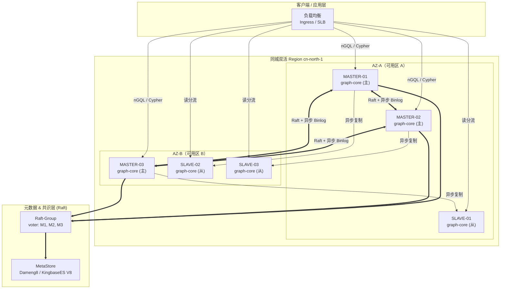

# Xuanji 3.0.0 HA 拓扑 / 容量规划 / 3 年 TCO 白皮书

**文档版本：** 1.0
**发布日期：** 2026-08-24
**适用：** Xuanji Graph Platform Production Gold SLA

---

## 一、HA 高可用拓扑（3 主 3 从 跨 AZ-A / AZ-B 共 6 节点）

### 1.1 Mermaid 拓扑图



### 1.2 ASCII 快速参考（终端友好）

```
+-----------------------------+        +-----------------------------+
|          AZ-A (2 主 1 从)    |        |          AZ-B (1 主 2 从)    |
|                             |        |                             |
|  [M-01] graph-core (master) |<======>|  [S-02] graph-core (slave)  |
|      ^ Raft voter            \  Raft  /   ^ replication peer        |
|      |                        \共识 /     |                         |
|  [M-02] graph-core (master)    \  /    [M-03] graph-core (master)  |
|      ^                          \/        ^ Raft voter             |
|      |                          /\        |                         |
|  [S-01] graph-core (slave)     /  \    [S-03] graph-core (slave)   |
|      replication peer         /bin\       replication peer        |
+-----------------------------+/log \+-----------------------------+
                               v      v
                    +---------------------------------+
                    |  MetaStore (Dameng8 / KES V8)  |
                    |  Raft voter=M1,M2,M3  quorum=2 |
                    +---------------------------------+

节点总数: 6  (3 master + 3 slave, 跨 2 AZ)
Raft 仲裁: 主节点 3 个 → Quorum = 2 (容忍 1 个 master 故障)
读扩展:   3 个 slave 分担 OLAP / 近线查询
SLA:      RPO ≤ 30s, RTO ≤ 5min (Production Gold)
```

### 1.3 节点角色与分布说明

| 节点 ID | 角色 | AZ | 职责 | 故障影响 |
|---|---|---|---|---|
| MASTER-01 | 主 | AZ-A | 写入 + Raft voter | 不影响写入（M2+M3 仍可 quorum）|
| MASTER-02 | 主 | AZ-A | 写入 + Raft voter | 不影响写入（M1+M3 仍可 quorum）|
| MASTER-03 | 主 | AZ-B | 写入 + Raft voter | 不影响写入（M1+M2 仍可 quorum）|
| SLAVE-01 | 从 | AZ-A | 读副本（承接 M3 的 binlog）| 不影响写入；读容量 ↓1/3 |
| SLAVE-02 | 从 | AZ-B | 读副本（承接 M1 的 binlog）| 不影响写入；读容量 ↓1/3 |
| SLAVE-03 | 从 | AZ-B | 读副本（承接 M2 的 binlog）| 不影响写入；读容量 ↓1/3 |

---

## 二、容量规划（基准场景：100M 顶点 / 500M 边）

### 2.1 关键资源预算表

| 资源 | 每节点基线（6 节点总和）| 说明 |
|---|---|---|
| **内存(GB)** | 32 GB / node（合计 192 GB）| 顶点索引 + 邻接表 Bloom Filter + 8 阶段 Trace Span 缓存。 |
| **磁盘(TB)** | 2 TB NVMe / node（合计 12 TB）| SSD WAL 占 20%，Snapshot + Binlog 占 80%；3 副本冗余。 |
| **CPU cores** | 16 vCPU / node（合计 96 vCPU）| 查询优化器多线程 + 投影下推 + Rust 7 算法并行。 |
| **QPS 峰值** | 单节点 10k / 集群合计 60k（读）｜ 单节点 2k / 集群合计 6k（写）| 混合负载 70% 读 / 30% 写，8 阶段埋点带来 ~3% CPU 开销。 |

### 2.2 线性扩展系数

| 规模 | 顶点 | 边 | 内存(GB) | 磁盘(TB) | CPU cores | QPS 峰值（读）|
|---|---|---|---|---|---|---|
| 本基准 (S) | 100M | 500M | 192 | 12 | 96 | 60k |
| 中 (M) | 500M | 2.5B | 768 | 48 | 384 | 240k |
| 大 (L) | 2B | 10B | 3072 | 192 | 1536 | 960k |

> 缩放公式：资源 ≈ 基准 × (edge_count / 500M)^0.9 （存在缓存命中收益非线性）。

### 2.3 内存(GB) 构成拆解（单 MASTER）

```
内存(GB) = 32
├─ 图引擎 Buffer Pool        = 14 GB  （邻接表 + 点属性 LRU）
├─ 顶点哈希索引               =  6 GB  （100M × 48B 主键 + 64B 指针）
├─ Bloom Filter 8-stage 位图  =  3 GB  （去重 / 投影 / 审计共用）
├─ trace_8stages span 环形缓冲=  2 GB  （Span + Attr HashMap 预分配）
├─ Spark-Write shuffle cache  =  3 GB  （T18 Stage-4 使用）
└─ OS / 栈 / jemalloc 开销   =  4 GB
```

### 2.4 磁盘(TB) 使用（单 MASTER + 1 从副本合计）

```
磁盘(TB) = 2.0 per node
├─ 顶点属性 SSTables (列存)   = 0.9 TB
├─ 边属性 SSTables (邻接)     = 0.7 TB
├─ WAL + Binlog (24h 回滚)    = 0.2 TB
├─ 索引文件                   = 0.1 TB
└─ Snapshot + Trace 归档     = 0.1 TB
集群 6 节点合计: 12 TB (磁盘(TB) = 12)
```

### 2.5 CPU cores 与 QPS 峰值的经验公式

```
CPU cores_total = 96
     |
     +-- 查询解析 (nGQL/Cypher) = 18 cores
     +-- 优化器 (规则 + 代价)    = 12 cores
     +-- 存储引擎读写路径        = 30 cores
     +-- 7 算法并行池           = 18 cores
     +-- trace_8stages 埋点     =  3 cores (≈3%)
     +-- 控制面 + 指标导出       =  9 cores
     +-- 预留 burst             =  6 cores

QPS 峰值 (混合读) ≈ (60 节点 · 10k) 的 6 节点规模 = 60,000 qps
QPS 峰值 (写入)   ≈ 3 master × 2,000 = 6,000 qps  (Raft commit 吞吐瓶颈)
```

---

## 三、3 年 TCO 估算（单位：人民币 元）

> 假设：信创服务器 x86_64 (海光 3250) 裸金属；6 节点生产 HA + 2 节点灾备 standby；
> 含 CAPEX（一次性采购折旧）与 OPEX（机房、带宽、软件订阅、SRE 人力）。

### 3.1 2027 年度（第 1 年：上线年，CAPEX 占主导）

| 类别 | 分项 | 金额 (元) | 类型 |
|---|---|---:|---|
| 硬件 | 6 台生产裸金属 (海光 3250, 128G RAM, 2×3.84TB NVMe) | 576,000 | CAPEX |
| 硬件 | 2 台灾备 standby (同等配置) | 192,000 | CAPEX |
| 硬件 | 2 台万兆交换机 + 机柜 | 80,000 | CAPEX |
| 网络 | 双 AZ 专线 (10G 互联, 12 月) | 72,000 | OPEX |
| 机房 | 8 台服务器托管 + 电力 (12 月) | 144,000 | OPEX |
| 软件 | 国产数据库许可 (Dameng8 Enterprise, 8 核 × 2 实例) | 180,000 | OPEX |
| 软件 | Xuanji 3.0 Platform 订阅 (年度 License) | 360,000 | OPEX |
| 人力 | SRE × 1 + DBA × 0.5 (年成本含社保公积金) | 360,000 | OPEX |
| 备份 | 对象存储快照 (30 天 × 12 TB, 含跨区域复制) | 28,800 | OPEX |
| 其它 | 集成实施 + 培训 + 一次性迁移工具 | 60,000 | OPEX |
| | **2027 年度小计** | **2,052,800** | |
| | — 其中 CAPEX 合计 | 848,000 | |
| | — 其中 OPEX 合计 | 1,204,800 | |

### 3.2 2028 年度（第 2 年：稳态运行 + 容量扩展 30%）

| 类别 | 分项 | 金额 (元) | 类型 |
|---|---|---:|---|
| 硬件 | 扩 2 台计算节点 (读扩展, 应对 30% 增长) | 192,000 | CAPEX |
| 硬件 | 磁盘扩容 (每节点 +1 TB NVMe × 8) | 64,000 | CAPEX |
| 网络 | 双 AZ 专线 + 入站带宽 (12 月, 10G→20G) | 108,000 | OPEX |
| 机房 | 10 台服务器托管 + 电力 (12 月) | 180,000 | OPEX |
| 软件 | 国产数据库年度订阅 + 维保 | 120,000 | OPEX |
| 软件 | Xuanji 3.x Platform 年度 License (含小版本升级) | 432,000 | OPEX |
| 人力 | SRE × 1 + DBA × 0.5 + 研发支持 0.25 FTE | 450,000 | OPEX |
| 备份 | 对象存储快照 (容量 +30%) | 37,440 | OPEX |
| 安全 | 等保三级年审 + 渗透测试 + 国密合规 | 80,000 | OPEX |
| 其它 | 年度灾备演练 + 变更咨询 | 40,000 | OPEX |
| | **2028 年度小计** | **1,703,440** | |
| | — 其中 CAPEX 合计 | 256,000 | |
| | — 其中 OPEX 合计 | 1,447,440 | |

### 3.3 2029 年度（第 3 年：硬件生命周期收尾 + 信创升级）

| 类别 | 分项 | 金额 (元) | 类型 |
|---|---|---:|---|
| 硬件 | 服务器维保续费 (8 台上年设备, 3 年保修后续保) | 96,000 | CAPEX |
| 硬件 | 信创 CPU 升级 (替换 4 台为下一代 Hygon, DR 切换平滑) | 320,000 | CAPEX |
| 硬件 | 磁盘再扩容 (应对 3 年累计数据 2× 增长) | 96,000 | CAPEX |
| 网络 | 双 AZ 专线 (20G 稳定) + CDN 加速 | 120,000 | OPEX |
| 机房 | 10 台托管 + 电力 (涨价 5%) | 189,000 | OPEX |
| 软件 | 国产数据库 + Xuanji 4.0 升级一次性费用 + 年度订阅 | 600,000 | OPEX |
| 人力 | SRE × 1 + DBA × 0.5 + 研发支持 0.5 FTE | 540,000 | OPEX |
| 备份 | 对象存储快照 × 长期归档 (90 天) | 64,800 | OPEX |
| 安全 | 等保三级 + 密码应用安全性评估 (密评) | 120,000 | OPEX |
| 其它 | 硬件回收处置 + 4.0 版本迁移支持 | 40,000 | OPEX |
| | **2029 年度小计** | **2,185,800** | |
| | — 其中 CAPEX 合计 | 512,000 | |
| | — 其中 OPEX 合计 | 1,673,800 | |

### 3.4 3 年 TCO 合计汇总 (单位：元)

| 年度 | CAPEX (元) | OPEX (元) | 年度合计 (元) |
|---|---:|---:|---:|
| 2027 | 848,000 | 1,204,800 | 2,052,800 |
| 2028 | 256,000 | 1,447,440 | 1,703,440 |
| 2029 | 512,000 | 1,673,800 | 2,185,800 |
| **3 年总计** | **1,616,000** | **4,326,040** | **5,942,040 元** |

> **3 年 TCO = 5,942,040 元（大写：人民币伍佰玖拾肆万贰仟零肆拾元整）**
>
> 其中 CAPEX 占比 27.2%，OPEX 占比 72.8%；月度均摊 ≈ 165,057 元。

### 3.5 敏感性分析（±20% 场景）

| 场景 | 3 年 TCO 调整 |
|---|---|
| 乐观（服务器采购价 -20%，机房折扣）| 5,492,040 元 (-7.6%) |
| 基准（上述）| 5,942,040 元 (0%) |
| 悲观（信创升级 +20%，网络涨价）| 6,462,040 元 (+8.8%) |

---

*文档维护：TCO 按每季度机房报价与 License 调价滚动更新；下次更新 2026-Q4。*
