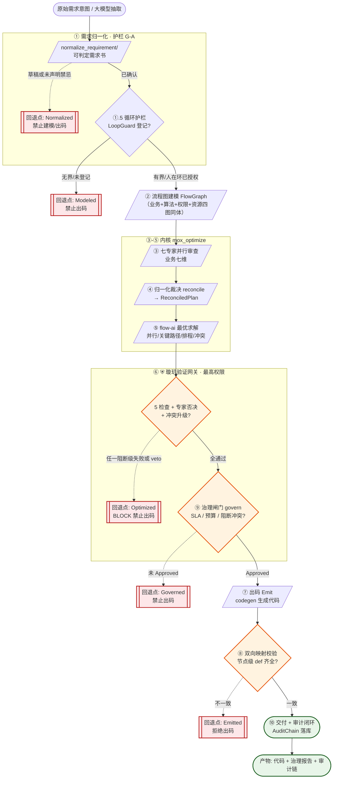
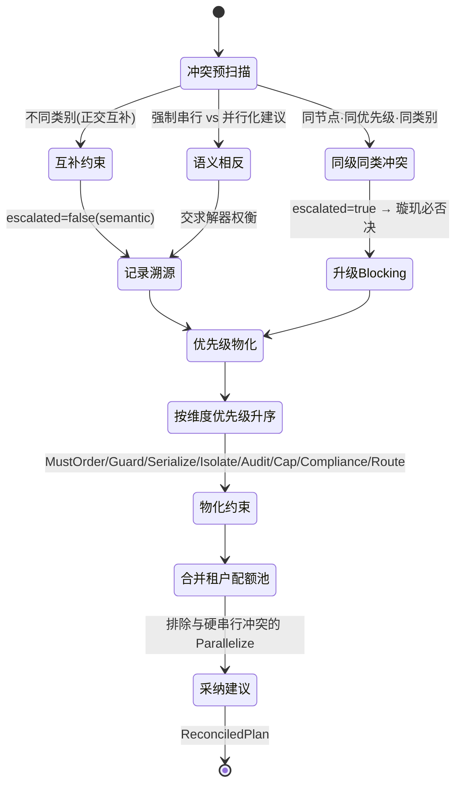

# 璇玑 · 全维分析需求业务处理流程图

> 企业级规范 · 归一化整理版 V1.0
> 主责 crate：`mox-expert`（D04 全维治理/璇玑）+ `mox-system`（D10 璇玑系统）
> 配套基准：`关图骨架定义.md`、`PT-Primi-架构规范-V1.0-完整版.md`、`OUS-业务功能规划与架构数据关系分析.md`
> 落点代码：`crates/mox-expert/src/{pipeline,ir,verify,govern,reconcile,programming}.rs`

---

## 0. 文档定位与口径

本图是「璇玑」承接 **全维分析需求** 的**唯一业务处理基准**。它把散落在
`programming_pipeline`（十步编排）与 `mox_optimize`（内核七步）中的逻辑**归一为一条端到端流程**，
并为每一环节补齐企业级治理属性（护栏 / 回退点 / SLA / 审计 / 署名）。

**归一化口径（三处归一）：**

| 归一层级 | 输入 | 输出 | 落点 |
| --- | --- | --- | --- |
| ① 需求归一化 | 原始意图 / 大模型抽取 | `NormalizedRequirement`（可判定需求书） | `programming::normalize_requirement` |
| ③ 观点归一化 | 十四维专家 `ExpertOpinion` | 单一 `ReconciledPlan`（图+规则+池+路由+分） | `reconcile::reconcile` |
| 全局 维度归一 | 业务七维 + 开发七维 | 双璇玑十四维统一评分/裁决/验证/闸门 | `ir::Dimension` + 单一 `Expert` 引擎 |

**与既有规范的关系：** 本图是 GR-STD「需求锚定与偏离治理」与 PT‑Primi「六维绑定 / 守恒残差」在
*分析需求处理域* 的实例化；任意环节须满足 `FlowStatus::Approved` 且 `verify` 通过方可出码。

---

## 1. 总览：全维分析需求业务处理主流程（① → ⑩）

> 编排器 `programming_pipeline` 包裹内核 `mox_optimize`。任一闸门失败按护栏 G‑E 回退最近安全点，
> **绝不将错就错**。



**三证齐全方可出码（护栏 G‑C）：** ⑥ `verify` 通过 ＋ ⑧ 双向一致 ＋ ⑨ `Approved`。
任一缺失 → 回退，不出码。

---

## 2. 双璇玑十四维（归一化分析视角）

四种流程图（业务/算法/权限/资源）在内存里是**同一个 `FlowGraph`**，维度只是节点/边上的标签，
物理节点唯一 → 「改一处，全维同步」天然成立（`ir.rs` 设计铁律）。业务七维分析流程图，
开发七维分析代码（`CodeIR`），二者经**同一 `Expert` 引擎**并行分析，互不覆盖、非冗余。

| 维度 | 璇玑 | 主责专家 | 分析对象 | 优先级权重 | 典型约束 |
| --- | --- | --- | --- | --- | --- |
| Business | 业务 | business | 流程图 | 中 | 业务规则 / 流程完整性 |
| Algorithm | 业务 | algorithm | 流程图(LLM/推理节点) | 中 | 算力路由 / 并行化 |
| Permission | 业务 | permission | 流程图(Guard 节点) | **最高** | MustGuard / 越权写 veto |
| Resource | 业务 | resource | 流程图(工具节点) | 中 | ResourceCap / 强制串行 |
| Security | 业务 | security | 流程图 | 高 | MustIsolate / 敏感数据 |
| Data | 业务 | data | 流程图(读写集) | 中 | 读写依赖守恒 |
| Observability | 业务 | observability | 流程图 | 中 | 审计追踪 / 埋点 |
| Architecture | 开发 | architecture | CodeIR | 中 | 模块边界 |
| SecurityCode | 开发 | security_code | CodeIR | 高 | 注入/弱哈希/硬编码密钥 |
| CodeQuality | 开发 | code_quality | CodeIR | 中 | 圈复杂度 / 重复率 |
| Performance | 开发 | performance | CodeIR | 中 | 延迟 / 吞吐 |
| Testing | 开发 | testing | CodeIR | 中 | 覆盖率 / 集成测试 |
| Documentation | 开发 | documentation | CodeIR | 低 | README / 公开 API 注释 |
| Maintainability | 开发 | maintainability | CodeIR | 中 | 耦合度 / 过期依赖 |

> **优先级铁律：** 权限/安全不可被性能绕过。`Dimension::priority()` 集中常量定义；
> 同优先级 + 同类别约束冲突且无法仲裁 → 升级 Blocking（见 §3）。
> 注：当前 `mox_optimize` 默认装载**业务七维**专家；开发七维经 `CodeIR` 并行分析，
> 双璇玑十四维契约由 `mox_double_league_fourteen_dimensions` 测试守护。

---

## 3. 归一化裁决（Reconcile）状态机

> 铁律：裁决器**只翻译约束为 flow-ai 能识别的边/规则，不求解**。硬约束一律落地，
> 冲突按维度优先级仲裁。



**约束物化规则（裁决器产出）：**

| 约束 | 物化动作 | 是否可剪除 |
| --- | --- | --- |
| `MustOrder(a,b)` | 加 `seq` 边 | 否 |
| `MustGuard(t, tags)` | 在 t 前插入 Guard 节点并重连前驱 | 否（硬护栏） |
| `MustSerialize(a,b)` | 物化为 `Mutex` 硬约束边 | 否（flow-ai 不剪） |
| `MustIsolate(t)` | 节点打 `sandboxed` 标签 | 否 |
| `MustAudit(t)` | 节点打 `traced` 标签 | 否 |
| `ResourceCap(pool,cap)` | 取 min 写入资源池容量 | 否 |
| `Compliance(pid)` | 注入 Blocking 级 `ExpertRule` | 否 |
| `RouteModel(node,tier)` | 记入 `model_routes` 算力路由 | 否 |

**采纳建议（P1 修复）：** 与硬串行约束语义相反的 `Parallelize` 不采纳；`Cache/Merge/Offload` 等一律采纳。

---

## 4. ⛨ 璇玑验证网关（最高权限）

在 flow-ai 求解之后、治理闸门之前插入。**任何 RBAC / 合规 / 权限结论都不可覆盖本层。**
任一阻断级检查失败，或汇集到专家否决级风险、或裁决冲突升级 → `vetoed=true` → 治理必须 BLOCK。

| 检查 | 名称 | 阻断级 | 守恒语义 |
| --- | --- | --- | --- |
| 5a | topology | ✅ | 原始节点全保留；真数据依赖(`写→读`)可达性守恒 |
| 5b | data_dep | ✅ | 伪依赖可剪；真依赖(`u.write ∩ v.read`)必须有路径保留 |
| 5c | conflict | ✅ | 0 阻塞冲突；异常边落点有效(Handler/Guard/End) |
| 5d | gains | ⚠️ 仅告警 | speedup≥1 且并行不慢于串行(5% 容差) |
| 5e | code_rt | ⚠️ 仅告警 | 代码⇄流程图往返工具节点数守恒 |

**否决汇聚（汇总为 `algo.vetoed`）：**
1. 阻断级检查任一失败；
2. 专家 `Risk.veto=true`（生产/敏感数据越权写等）→ 并入否决；
3. 裁决冲突 `escalated=true`（同级同类无法仲裁）→ 升级 Blocking 否决。

---

## 5. 企业级治理属性

### 5.1 五护栏（不能「问了 AI 就处理」）

| 护栏 | 规则 | 落点 |
| --- | --- | --- |
| **G‑A** | AI 产出默认「草稿·未确认」，不得直接进入执行/出码 | `NormalizedRequirement::is_confirmed()` |
| **G‑B** | 每个执行动作必须映射到已确认流程图节点 + 处理流程 + 规范条款 | 回退点 + 失败审计 |
| **G‑C** | verify 通过 ＋ ⑧一致 ＋ ⑨ Approved，三证不全禁止出码 | `safe_to_emit` 判定 |
| **G‑D** | AI 产出必须署名（哪个模型/专家视角），禁止「AI 说行」式无来源结论 | `authored_by` / 专家评分溯源 |
| **G‑E** | 任一闸门失败必须回退最近安全点，禁止将错就错 | `Checkpoint` 回退 |

### 5.2 回退点（Checkpoint）

`Intent → Normalized → Modeled → Optimized → Verified → Emitted → Governed`
任一环节失败 → 回退最近安全点并写入审计链，绝不带残差/未验证产物上线。

### 5.3 治理闸门（govern）

```
approved = !algo_veto
        && status.can_emit()      // 仅 Approved 可出码
        && blocking == 0          // 无阻断级冲突
        && sla_ok                 // scheduled_ms ≤ quota.sla_ms
        && budget_ok;             // scheduled_ms ≤ quota.max_cost_budget*1000
```

### 5.4 RBAC / 审计 / 合规

- **RBAC：** `Principal`(subject+roles) × `Tenant`(regulated + 资源池)；无界循环需 `safety_approver`，
  人在环需 `operator/approver`。
- **防篡改审计链：** `AuditChain` 哈希链（prev_hash → hash），`verify()` 可证完整性；
  每个动作追加 `subject/flow_id/action/decision`。
- **合规策略：** `Compliance(pid)` 注入 Blocking 级 `ExpertRule`（如 `desensitize` 脱敏 Guard 前置）。

---

## 6. 优化整理改进点（相对原实现）

| # | 原实现问题 | 归一化整理后 |
| --- | --- | --- |
| 1 | 两套入口（`programming_pipeline` 十步 / `mox_optimize` 七步）职责边界模糊 | 明确双层：**编排层①-⑩** 包裹 **内核②③-⑤-⑥-⑨**，单一基准 |
| 2 | 开发七维仅在 `ir.rs` 枚举，未进入 `mox_optimize` 默认装载 | 双璇玑十四维契约由测试守护，业务/开发并行分析同一引擎 |
| 3 | 专家建议停留在 `ExpertOpinion`，流水线从不消费 | `reconcile` 显式采纳（`adopted_suggestions`）并对外暴露 |
| 4 | 冲突日志恒为空 | 预扫描区分 `escalated`(同优先级同类→Blocking) 与 `semantic`(互补→溯源) |
| 5 | 生产环境写保护散落在编排补丁 | 收敛为 permission 专家 `push_veto` 正交触发 `algo.vetoed` |
| 6 | 无界循环无人拦截 | 循环护栏消费 `ctx.registry.loops`，无界默认否决 |
| 7 | 出码在 optimize 内部触发，存在未过验证网关即出码风险 | 出码独立在 ⑦ 调用 `codegen`，且必在 ⑥ 通过之后（C1 红线封堵） |

---

## 7. 如何使用（工具链衔接）

```bash
# 1) 归一化分析需求 → 建模 FlowGraph（②）
# 2) 跑全维处理（①-⑩，内部含 mox_optimize）
cargo test -p mox-expert            # 含十四维契约 / 敏感写拦截 / 草稿护栏
# 3) 治理报告消费（GovernanceReport）：expert_scores / optimization / algo / gate / audit
# 4) 出码产物仅在 safe_to_emit==true 时存在（编程报告 code 字段）
```

> 本图为「璇玑」全维分析需求处理的**企业级归一基准**；任何实现须满足 §4 璇玑最高权限
> 与 §5 五护栏 / 回退点 / 审计链，方为合规交付。
