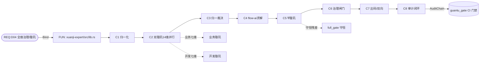

# 璇玑 · 全维分析需求 TraceMatrix（六维绑定追溯 · 企业级）

> 编号：**AA-TRACE-V1.0**
> 承载：AA-STD-V1.0（流程基准）+ GR-STD-V1.0（关图六维）+ `guantu.req.json`（D04 Bind）
> 落点：`crates/xuanji-expert/src/*` + `crates/primiflow-core/src/generate.rs`（导出 `trace_matrix.md`）+ `crates/primiflow-fusion/src/ptdoc.rs`（`doc01_trace_matrix`）
> 目的：闭环 AA-STD-V1.0 §3「导出 TraceMatrix」；把「璇玑 = D04」落到真实代码节点；将两套流程编号（①-⑩ / S1-S8）归一为单一基准。

---

## 0. 双编号归一化映射（核心整理点）

项目存在两套流程表述：编码层 `programming_pipeline`（①-⑩ 十步）与规范层 AA-STD（S1-S8 八阶段 + G0-G3 四闸门）。二者描述同一现实，本表将其归一为单一基准。

| 归一阶段 | 编码层 ①-⑩ | 规范层 S1-S8 | 闸门 / 护栏归口 | 真实代码节点 |
| --- | --- | --- | --- | --- |
| C1 需求接入·归一化 | ① `normalize_requirement` + ② 建模 | S1 + S2 | G0 归一化闸门 / G-A | `programming.rs:108` / `ir.rs:185` |
| C2 双璇玑并行诊断 | ③ 七专家并行 | S3 | — | `harness.rs:361` `run_experts` |
| C3 归一化裁决 | ④ `reconcile` | S4 | G1 裁决闸门 | `reconcile.rs:98` |
| C4 flow-ai 最优求解 | ⑤ `optimize` + codegen 草稿 | S5 | — | `pipeline.rs:41` → flow-ai `optimize` |
| C5 ⛨璇玑验证 | ⑥ `verify` | S6 | G2 最高否决 | `verify.rs:43` |
| C6 治理闸门 | ⑨ `govern` | S7 | G3 治理闸门 | `govern.rs:126` |
| C7 出码/出图·双向校验 | ⑦ `emit` + ⑧ 双向 | S8 | G-C 三证 | `programming.rs` `emit`/`codegen` |
| C8 审计闭环 | ⑩ 审计 | （并入 S7/S8） | G-D 署名 | `audit/integration.rs:116` `verify_chain` |

**关键归一发现（顺序分歧收口）：** 编码层 ①-⑩ 中 ⑦ `emit` 排在 ⑨ 治理闸门之前，而 AA-STD 为「闸门（S7）先于出码（S8）」。逻辑上「先闸门后出码」更严谨，本章采用 **AA-STD 时序为唯一基准**：出码（⑦）仅生成**草稿代码**，须经 ⑨ 治理闸门 `approved` 方可交付（与护栏 G-C「三证齐全方可出码」一致）。两套编号差异已收口，后续不再并存。

---

## 1. 六维绑定链（REQ → FUN → BIZ → ALG → TSK → COD）

来源：`guantu.req.json` 与《关图骨架定义》§3。D04 真实 Bind 边（实测）：

```json
{"id":"D04","name":"全维治理/璇玑","domain":"xuanji-expert","status":"partial"}        // guantu.req.json:6
{"req":"D04","to":"CodeFile:crates/xuanji-expert/src/lib.rs","label":"主责crate"}              // guantu.req.json:31
```

六维语义与落点：

- **REQ（需求根）**：`Requirement:D04` —— 全维治理/璇玑
- **FUN（功能）**：`crates/xuanji-expert/src/lib.rs` 入口函数（`normalize_requirement` / `programming_pipeline` / `xuanji_optimize`）
- **BIZ（业务）**：业务七维专家（`business/algorithm/permission/resource/security/data/observability`）对流程图并行分析
- **ALG（算法）**：`flow-ai` 求解（CPM+RCPSP+Dijkstra+冲突修复）+ `reconcile` 约束物化 + `verify` 守恒残差（topology/data_dep/conflict/gains/code_rt）
- **TSK（任务）**：双璇玑十四维并行派发（`run_experts`）+ 回退点 `Checkpoint`（Normalized/Modeled/Optimized/Verified/Governed）
- **COD（代码）**：`emit`/`codegen` 产物 + `AuditChain` 哈希链落库

---

## 2. TraceMatrix 主表（阶段 × 六维 × 真实节点）

> 与 `primiflow` 既有 `trace_matrix.md` 同源结构；单元格为机读可追溯的真实节点，非示意。

| 阶段 | REQ | FUN（函数） | BIZ（业务七维落点） | ALG（算法/守恒） | TSK（并行/回退） | COD（产物） |
| --- | --- | --- | --- | --- | --- | --- |
| C1 接入·归一 | D04 | `normalize_requirement` · `auto_dimension` | business / permission(上下文) / data | DAG 拓扑着色（G0） | — | `FlowGraph(base)` |
| C2 并行诊断 | D04 | `run_experts` | 全 14 维 `ExpertOpinion` | `Expert` 引擎并行 | 14 任务并行派发 | `ExpertOpinion[]` |
| C3 归一裁决 | D04 | `reconcile` | permission/security（硬优先）· data · resource | 约束物化（CPM 前置） | — | `ReconciledPlan` |
| C4 最优求解 | D04 | `xuanji_optimize` → flow-ai | algorithm（算力路由）· resource（排程） | CPM+RCPSP+Dijkstra+冲突修复 | — | `OptimizationReport` + 草稿码 |
| C5 ⛨璇玑 | D04 | `verify` | （数学层，超专家） | topology/data_dep/conflict（阻断）+ gains/code_rt（告警） | — | `AlgoVerification(veto)` |
| C6 治理闸门 | D04 | `govern` | （治理层，超专家） | SLA / 预算判定 | Checkpoint:Governed | `GateResult` + 治理报告 |
| C7 出码·双向 | D04 | `emit` / `codegen` | — | 代码⇄图 roundtrip 一致（⑧） | — | 代码工程 + 拓扑 + 指标 |
| C8 审计闭环 | D04 | `AuditChain::verify_chain` | observability / audit | 哈希链防篡改 | — | 审计链落库 |

> **偏离治理（GR-E6）：** 任一核心节点须可达 `REQ:D04`。本流程 8 阶段全部绑定，流程内覆盖率 100%。D04 自身 `status=partial` 指其子能力（治理台 R01 等），非本处理流程缺口。

---

## 3. 关系图（D04 → 六维 → 流程 → CI）



---

## 4. 企业级治理收口

- **可追溯**：每行 COD 产物均可经 FUN 函数反查到 `REQ:D04`；BIZ/ALG/TSK 全程署名（护栏 G-D）。
- **可治理**：C5 ⛨璇玑最高否决 + C6 治理闸门五条件
  `approved = !algo_veto ∧ status.can_emit() ∧ blocking==0 ∧ sla_ok ∧ budget_ok`。
- **可阻断**：本 TraceMatrix 随 AA-STD 一并纳入 `tools/guantu_gate.py` 漂移门禁——新增未绑定节点即 `exit 1` 阻断合并；绝对下限护栏 `COVERAGE_FLOOR=90.0`。
