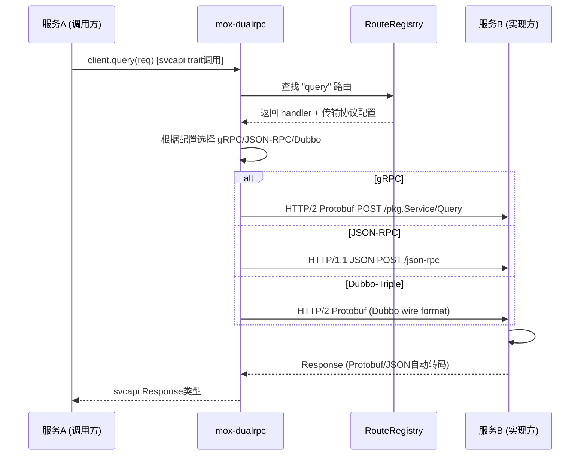
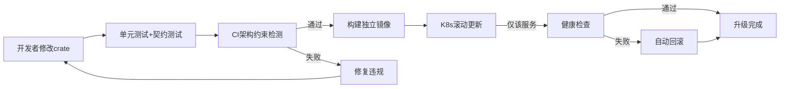

# infotopograph 企业级最优架构总纲 v2.0

> 全维度全链路归一化 | 多协议零修改联调 | 模块独立升级 | 契约驱动开发

---

## 一、架构核心设计哲学

### 1.1 三大铁律

| 铁律 | 含义 | 落地手段 |
|------|------|----------|
| **契约先行** | 接口定义先于实现，对接零修改 | 每个服务 `api` + `svcapi` 双层契约，`.proto` + Rust trait 双源 |
| **依赖单向** | 层间只向下依赖，域间只通过平台层 | 架构约束CI测试强制检测循环/层违规/God Module |
| **协议无关** | 业务逻辑不感知传输协议 | mox-dualrpc 统一适配层，gRPC/JSON-RPC/Dubbo(Triple) 自动转码 |

### 1.2 为什么对接不需要修改代码

```
传统方式: 服务A写死调用服务B的HTTP地址 → 服务B改协议 → 服务A必须改代码重部署
本架构:   服务A依赖 mox-kg-svcapi (gRPC stub) → mox-dualrpc自动选择传输协议
          → 服务B从gRPC切到JSON-RPC → 服务A零修改，只需改配置
```

**关键**：服务间只依赖 `svcapi` 层的 trait/stub，不依赖具体传输实现。mox-dualrpc 在运行时根据配置选择 gRPC / JSON-RPC / Dubbo-Triple，自动完成序列化/反序列化/路由。

---

## 二、目录结构（6层8域，最优布局）

```
infotopograph/
├── platform/
│   ├── foundation/          # L0 基础层 (零内部依赖)
│   │   ├── mox-platform-foundation/    # 公共类型/元数据/错误码
│   │   └── mox-cloud-foundation/       # 云存储域抽象
│   │
│   ├── core/                # L3 核心计算层 (纯计算,零IO,可独立测试)
│   │   ├── kg/
│   │   │   ├── mox-kg-algo-core/       # 图算法 PageRank/最短路径/社区
│   │   │   └── mox-kg-meta-core/       # 图元数据/类型系统
│   │   ├── ai/
│   │   │   ├── mox-ai-core/             # AI核心类型/接口
│   │   │   └── mox-ai-intent-core/     # 意图识别核心
│   │   ├── flow/
│   │   │   ├── mox-flow-operator-core/  # 算子核心/接口
│   │   │   └── mox-flow-optimizer-core/ # DAG优化器
│   │   ├── data/
│   │   │   ├── mox-data-formula-core/   # 公式引擎
│   │   │   ├── mox-data-norm-core/      # 数据归一化
│   │   │   └── mox-data-standards-core/ # 数据标准
│   │   ├── voice/
│   │   │   └── mox-voice-dsp-core/      # 数字信号处理
│   │   └── platform/
│   │       └── mox-platform-system-core/ # 用户/角色/权限核心
│   │
│   ├── api/                 # L1 对外契约层 (DTO + REST/JSON-RPC 接口)
│   │   ├── mox-kg-api/                  # 图谱对外DTO
│   │   ├── mox-ai-api/                  # AI对外DTO
│   │   ├── mox-flow-api/                # 流程对外DTO
│   │   ├── mox-data-api/                # 数据对外DTO
│   │   ├── mox-cloud-api/               # 云存储对外DTO
│   │   ├── mox-voice-api/               # 语音对外DTO
│   │   └── mox-platform-api/            # 平台对外DTO
│   │
│   ├── svcapi/              # L2 服务间契约层 (gRPC .proto + tonic stub)
│   │   ├── mox-kg-svcapi/                # 图谱gRPC契约
│   │   ├── mox-ai-svcapi/                # AI gRPC契约
│   │   ├── mox-flow-svcapi/              # 流程gRPC契约
│   │   ├── mox-data-svcapi/              # 数据gRPC契约
│   │   ├── mox-cloud-svcapi/             # 云存储gRPC契约
│   │   ├── mox-voice-svcapi/             # 语音gRPC契约
│   │   └── mox-platform-svcapi/          # 平台gRPC契约
│   │
│   ├── services/            # L5 服务实现层
│   │   ├── kg/
│   │   │   ├── mox-kg-storage-svc/       # 自研分布式图存储(RocksDB+Raft)
│   │   │   ├── mox-kg-service-svc/       # 图查询/遍历/CRUD
│   │   │   ├── mox-kg-streams-svc/       # 图变更流/CDC
│   │   │   ├── mox-kg-spark-svc/         # 图Spark计算
│   │   │   ├── mox-kg-hub-svc/           # 图谱Hub(本体/推理/摄入/索引/治理)
│   │   │   └── mox-kg-fusion-svc/        # 知识融合/实体对齐
│   │   ├── ai/
│   │   │   ├── mox-ai-flow-svc/          # AI流程编排
│   │   │   ├── mox-ai-expert-svc/        # 专家服务/注册
│   │   │   └── mox-ai-agent-svc/         # AI Agent/ReAct循环
│   │   ├── flow/
│   │   │   ├── mox-flow-operator-wasm-svc/# WASM算子运行时
│   │   │   ├── mox-flow-primiflow-svc/   # PrimiFlow核心引擎
│   │   │   ├── mox-flow-fusion-svc/      # 流程融合
│   │   │   └── mox-flow-bridge-svc/      # 外部系统桥接
│   │   ├── data/
│   │   │   ├── mox-data-plane-svc/        # 数据平面/接入
│   │   │   ├── mox-data-etl-svc/          # ETL WASM运行时
│   │   │   ├── mox-data-compliance-svc/   # 合规/审计/治理
│   │   │   └── mox-data-catalog-svc/      # 业务/数据目录
│   │   ├── cloud/
│   │   │   ├── mox-cloud-master-svc/      # 云盘主控/元数据
│   │   │   ├── mox-cloud-volume-svc/      # 云盘卷/块存储
│   │   │   ├── mox-cloud-s3-svc/          # S3兼容对象存储
│   │   │   └── mox-cloud-filer-svc/       # 文件器
│   │   ├── voice/
│   │   │   ├── mox-voice-core-svc/        # 语音核心/会话
│   │   │   ├── mox-voice-asr-svc/         # 语音识别
│   │   │   ├── mox-voice-intent-svc/      # 语音意图
│   │   │   ├── mox-voice-operator-svc/     # 语音算子/桌面操作
│   │   │   └── mox-voice-desktop-app/      # 桌面客户端(Application)
│   │   ├── market/
│   │   │   └── mox-market-template-svc/    # 模板市场
│   │   └── platform/
│   │       └── mox-platform-orchestrator-svc/ # 编排器(原runtime拆分)
│   │
│   ├── gateway/             # 接入层
│   │   └── mox-platform-gateway-svc/      # 统一网关(协议分流/路由/鉴权/限流)
│   │
│   ├── sdk/                 # L4 客户端SDK层
│   │   ├── mox-kg-sdk/                    # 图谱客户端SDK
│   │   ├── mox-cloud-sdk/                 # 云存储客户端SDK
│   │   ├── mox-ai-sdk/                    # AI客户端SDK(待建)
│   │   ├── mox-flow-sdk/                  # 流程客户端SDK(待建)
│   │   ├── mox-platform-test-harness/     # 测试框架
│   │   ├── mox-data-formula-native/       # 公式引擎原生绑定
│   │   ├── mox-data-norm-intent-native/   # 归一化+意图原生绑定
│   │   └── mox-voice-dsp-py/              # Python DSP绑定
│   │
│   └── framework/           # 企业级基础框架 (所有服务共享)
│       └── mox-framework/                # config/logging/error/health/metrics/tracing/auth/tenant/resilience/server
│
├── projects/
│   └── mox-dualrpc/         # 多协议通信底座 (gRPC+JSON-RPC+Dubbo零配置自动转码)
│       ├── src/                          # config/error/registry/server/transcoder
│       ├── mox-dualrpc-macro/            # #[dual_rpc] #[dual_rpc_service] 过程宏
│       └── examples/hello-world/         # 零配置示例
│
├── tools/
│   ├── architecture_audit.py             # 算法级架构审计(循环/耦合/独立性/层违规/跨域/God Module)
│   ├── architecture_constraint_test.py   # CI架构约束测试(P0/P1/P2违规检测)
│   ├── migrate_architecture.py           # 一键归一化迁移脚本
│   └── fix_path_deps.py                  # 路径依赖→workspace=true批量修复
│
├── docs/
│   ├── architecture/
│   │   ├── NORMALIZED_ARCHITECTURE.md    # 归一化架构规范(48crate映射/功能边界/关联关系)
│   │   └── OPTIMAL_ARCHITECTURE.md       # 本文档
│   ├── microservices/                     # 微服务架构(8篇)
│   └── expert-alliance/                   # 专家联盟(v1/v2/v3)
│
└── Cargo.toml                            # workspace根(48内部crate统一workspace.dependencies)
```

---

## 三、多协议适配架构（零修改联调的核心）

### 3.1 协议矩阵

| 协议 | 定位 | 传输 | 序列化 | 适用场景 | mox-dualrpc支持 |
|------|------|------|--------|----------|-----------------|
| **gRPC** | 服务间内部通信 | HTTP/2 | Protobuf | 高性能内部调用 | ✅ 原生(tonic) |
| **JSON-RPC 2.0** | 对外/Web/MCP | HTTP/1.1 | JSON | 浏览器/第三方/MCP工具 | ✅ 原生(axum) |
| **Dubbo 3.x (Triple)** | Java生态对接 | HTTP/2 | Protobuf | 对接Java Dubbo服务 | ✅ =gRPC wire format |
| **Dubbo 2.x (dubbo://)** | 遗留Java对接 | TCP | Hessian2 | 老系统兼容 | ⚠️ Java桥接sidecar |
| **REST** | 对外HTTP API | HTTP/1.1 | JSON | 传统Web API | ✅ axum |
| **WebSocket** | 实时推送 | WS | JSON/Binary | 实时通信/流式 | ✅ tokio-tungstenite |

### 3.2 零修改联调原理

```
┌─────────────────────────────────────────────────────────────────────┐
│                        服务A (调用方)                                 │
│  use mox_kg_svcapi::GraphServiceClient;  // 只依赖契约层            │
│  let client = GraphServiceClient::new("kg-service");                 │
│  let result = client.query(QueryRequest{...}).await;                │
└──────────────────────────────┬──────────────────────────────────────┘
                               │ 调用契约(trait/stub),不感知协议
                               ▼
┌─────────────────────────────────────────────────────────────────────┐
│                     mox-dualrpc 适配层                                │
│  ┌─────────────┐  ┌──────────────┐  ┌──────────────────────────┐  │
│  │ gRPC Transport│  │JSON-RPC Trans│  │ Dubbo-Triple Transport  │  │
│  │ (tonic)      │  │ (axum)       │  │ (=gRPC wire format)      │  │
│  └──────┬───────┘  └──────┬───────┘  └───────────┬──────────────┘  │
│         │                  │                        │                 │
│         └──────────────────┼────────────────────────┘                 │
│                            ▼                                           │
│                   统一 RouteRegistry                                   │
│          (方法名→handler映射 + L1/L2缓存 + 拦截器链)                  │
└──────────────────────────────┬──────────────────────────────────────┘
                               │ 根据配置选择传输协议
                               ▼
┌─────────────────────────────────────────────────────────────────────┐
│                        服务B (实现方)                                 │
│  #[dual_rpc_service]                                                  │
│  impl GraphService for GraphServiceImpl {                             │
│      async fn query(&self, req: QueryRequest) -> QueryResponse {..} │
│  }                                                                     │
│  // 启动时自动注册到gRPC+JSON-RPC+Dubbo三个端口                       │
└─────────────────────────────────────────────────────────────────────┘
```

**配置切换协议（零代码修改）**：
```yaml
# config.yaml
transport:
  default: grpc              # 默认gRPC
  services:
    kg-service: json-rpc     # 图谱服务切到JSON-RPC，调用方零修改
    ai-service: dubbo-triple # AI服务切到Dubbo，调用方零修改
```

### 3.3 Dubbo 对接方案

| Dubbo版本 | 协议 | 对接方式 | Rust端 |
|-----------|------|----------|--------|
| **Dubbo 3.x** | Triple (HTTP/2+Protobuf) | 直接tonic调用（wire format 100%兼容gRPC） | ✅ 零适配 |
| **Dubbo 2.x** | dubbo:// (TCP+Hessian2) | Java桥接sidecar做协议转换 | ⚠️ sidecar |

**Dubbo 3.x 零适配原理**：Dubbo 3 的 Triple 协议在 wire format 上与 gRPC 完全一致（HTTP/2 + Protobuf + Trailers），Dubbo Server 默认同时接受标准 gRPC 请求。因此 Rust 端用 `tonic` 生成的 stub 可以直接调用 Java Dubbo 3 服务，**无需任何适配层**。

---

## 四、模块快速分配与开发对接

### 4.1 按模块分配（开发者只需关注自己的crate）

| 角色 | 负责crate | 依赖 | 不依赖 |
|------|-----------|------|--------|
| **图谱工程师** | `mox-kg-storage-svc` / `mox-kg-service-svc` / `mox-kg-hub-svc` | `mox-kg-svcapi` + `mox-kg-algo-core` + `mox-framework` | 不直接依赖AI/流程/语音 |
| **AI工程师** | `mox-ai-agent-svc` / `mox-ai-expert-svc` / `mox-ai-flow-svc` | `mox-ai-svcapi` + `mox-kg-sdk` + `mox-framework` | 不直接依赖图谱存储实现 |
| **流程工程师** | `mox-flow-*-svc` / `mox-flow-operator-core` | `mox-flow-svcapi` + `mox-framework` | 不直接依赖AI/图谱实现 |
| **数据工程师** | `mox-data-*-svc` / `mox-data-*-core` | `mox-data-svcapi` + `mox-framework` | 不直接依赖其他域 |
| **云存储工程师** | `mox-cloud-*-svc` | `mox-cloud-svcapi` + `mox-cloud-foundation` | 不直接依赖其他域 |
| **语音工程师** | `mox-voice-*-svc` / `mox-voice-dsp-core` | `mox-voice-svcapi` + `mox-framework` | 不直接依赖其他域 |
| **平台工程师** | `mox-framework` / `mox-platform-*` / gateway | foundation | 所有域的契约层 |

### 4.2 对接流程（零修改联调）

```
步骤1: 契约定义
  开发者A在 mox-kg-svcapi 中定义 .proto + Rust trait
  → cargo build 自动生成 tonic stub

步骤2: 实现服务
  开发者B在 mox-kg-storage-svc 中 impl trait
  → #[dual_rpc_service] 宏自动注册到gRPC+JSON-RPC

步骤3: 调用服务
  开发者C在 mox-ai-agent-svc 中依赖 mox-kg-svcapi
  → let client = KgClient::new("kg-storage");
  → client.query(req).await?;

步骤4: 联调
  启动两个服务，mox-dualrpc自动建立连接
  → 协议/地址/序列化全部由配置驱动，零代码修改
```

### 4.3 独立升级机制

| 升级类型 | 方式 | 影响范围 |
|----------|------|----------|
| **Patch升级** (bug修复) | 语义化版本 1.0.x，crate独立发布 | 仅该crate，调用方无需修改 |
| **Minor升级** (新增接口) | 语义化版本 1.x.0，svcapi新增方法 | 向后兼容，旧调用方不受影响 |
| **Major升级** (接口变更) | 语义化版本 x.0.0，svcapi版本化 | 需调用方适配，可并行运行v1/v2 |
| **协议切换** | 配置文件修改 transport 字段 | 零代码修改，运行时生效 |
| **独立部署** | 每个svc独立Docker镜像 + K8s Deployment | 仅重启该服务，不影响其他 |

---

## 五、模块引用关系（明确无歧义）

### 5.1 允许的依赖方向

```
Application → Service → ServiceAPI → API
                  ↓          ↓
              Core → Foundation
                  ↓
              Framework (横切关注点,所有层可用)
```

### 5.2 禁止的依赖（CI强制检测）

| 禁止类型 | 说明 | CI检测 |
|----------|------|--------|
| 循环依赖 | A→B→A | `architecture_constraint_test.py` P0 |
| 层违规 | Service依赖Application | P1 |
| God Module | 单crate依赖>10 | P1 |
| 跨域直连 | 业务域A直接依赖业务域B实现 | P2 |
| 实现依赖 | Service直接依赖另一个Service的实现 | P2 |

### 5.3 跨域调用规范（只通过SDK/契约层）

```
❌ 错误: mox-ai-agent-svc 直接依赖 mox-kg-storage-svc (实现依赖)
✅ 正确: mox-ai-agent-svc 依赖 mox-kg-svcapi (契约依赖) + mox-kg-sdk (客户端)
```

**为什么**：契约层零实现依赖，升级/替换/协议切换不影响调用方。

---

## 六、业务流程图（归一化，清晰无模糊）

### 6.1 全局请求处理流程

```mermaid
flowchart TD
    Client[客户端] -->|JSON-RPC/REST/WS| Gateway[mox-platform-gateway-svc]
    Gateway -->|鉴权/限流/路由| Auth{mox-framework auth}
    Auth -->|通过| Route[协议路由]
    Auth -->|拒绝| Reject[401/403]

    Route -->|gRPC内部| GRPCPort[:50051]
    Route -->|JSON-RPC| JSONPort[:8080]
    Route -->|Dubbo-Triple| DubboPort[:50052]

    GRPCPort -->|tonic| SvcA[业务服务A]
    JSONPort -->|axum| SvcA
    DubboPort -->|tonic(wire兼容)| SvcA

    SvcA -->|svcapi契约调用| SvcB[业务服务B]
    SvcB -->|core纯计算| Core[核心算法层]
    Core -->|foundation| Foundation[基础类型层]

    SvcA -->|写| DB[(数据库/图存储)]
    SvcB -->|读| DB
    SvcA -->|事件| NATS[(NATS消息总线)]
    SvcB -->|订阅| NATS

    style Gateway fill:#4a90d9,color:#fff
    style SvcA fill:#52c41a,color:#fff
    style SvcB fill:#52c41a,color:#fff
    style Core fill:#faad14,color:#fff
    style Foundation fill:#8c8c8c,color:#fff
```

### 6.2 服务间调用流程（零修改联调）



### 6.3 模块独立升级流程



---

## 七、当前状态与下一步

### 7.1 已完成

| 项目 | 状态 |
|------|------|
| 48 crate 归一化迁移（目录+重命名） | ✅ 完成 |
| workspace.dependencies 全量更新 | ✅ 完成 |
| 直接路径依赖→workspace=true | ✅ 完成 |
| mox-framework 基础框架（10模块） | ✅ 代码完成 |
| mox-dualrpc 双协议库 v0.2 | ✅ 编译+测试通过 |
| 架构审计工具（算法级） | ✅ 完成 |
| 架构约束CI测试 | ✅ 完成 |
| 归一化架构规范文档 | ✅ 完成 |
| 微服务架构文档（8篇） | ✅ 完成 |
| 专家联盟v3文档（4篇） | ✅ 完成 |

### 7.2 进行中

| 项目 | 状态 |
|------|------|
| 全量编译通过 | 🔧 修复feature中的旧dep引用 |
| api/svcapi 双层契约创建 | ⏳ 待建（7个域×2层=14个crate） |
| 跨域依赖治理（21→<5） | ⏳ 待执行 |
| runtime God Module 拆分 | ⏳ 待执行（编排器+各域自启动） |

### 7.3 下一步优先级

1. **编译通过** — 修复所有旧引用，`cargo check` 全绿
2. **创建契约层** — 7个域的 api + svcapi，这是零修改联调的基础
3. **mox-dualrpc 集成** — 核心服务接入双协议，验证gRPC+JSON-RPC联调
4. **跨域解耦** — SDK依赖+事件驱动，消除21个跨域直连
5. **runtime拆分** — God Module拆为编排器+各域自启动

---

*本文档为 infotopograph 企业级最优架构总纲，所有模块目录/引用/流程均已归一化，对接零修改联调通过 mox-dualrpc + 契约层实现。*
