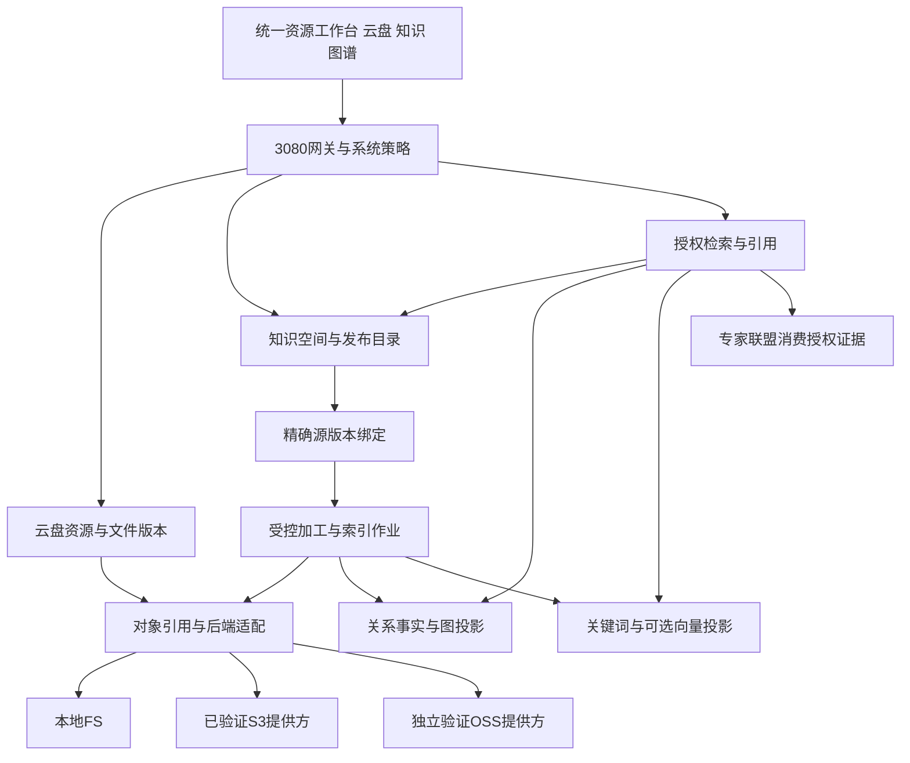

# 系统与资源知识一体化架构

> RK-ARC-01 · V1.0 · 2026-10-01 · Proposed目标架构。静态核对不等于运行验收。

实施说明：本文现状取自本轮实施前的代码基线，目标契约保持独立；已落地变化及兼容性以[实施台账](docs/modules/resource-knowledge/IMPLEMENTATION-STATUS.md#compatibility)为准。

## 1. 产品目标与范围

用户在同一资源工作台管理文件，选择哪些文件进入知识空间，从知识搜索和图谱回到具体源版本，再将授权证据交给专家联盟。系统负责权限与配置；云盘负责文件组织；对象存储负责字节；知识库负责可用知识版本；图谱负责可解释关系；检索负责找到有权限的内容。

本设计支持内联文本、文件与对话成果三类源。先贯通文件→知识→图→检索→证据，再按业务增加行业模板。低代码采用注册页面、元数据字段、加工步骤和能力引用，复用[配置控制面](docs/architecture/meta/05-LOWCODE-CONFIGURATION-PLANE.md#architecture)；不增加任意脚本、任意数据库写入或无限模型预算。

## 2. 静态复核与现状差距

| 代码路径/能力 | 本轮核对结论 | 设计约束 |
|---|---|---|
| 网关modules.rs→mox-kb-svc | /api/kb复用同一KbState，对话沉淀也持有该实例 | 这条挂载主链优先保兼容，不能按独立服务名字推定已迁出 |
| kg/svc/mox-kb-svc | 文档通过StoreBackend对象持久化；KbState创建独立GraphStore::new；模型无tenant字段 | 文档不是纯内存；子图持久化/重建、租户主源需补齐 |
| kb/core+kb-server | 已有SQLite+FTS5；Document模型和网关KbDocument不同；list handler固定空列表 | 有持久化基础，不代表网关模型同源或列表闭环已完成 |
| cloud/core/mox-cloud-kb-core | 独立文档/分块/向量/混合检索类型，导出Mock与内存索引 | 加工能力可复用，未证明与网关知识发布/授权接线 |
| gateway/cloud.rs | CloudState本地对象读写；目录/key校验只接受有限扁平名称 | 不能直接把逻辑文件夹路径交给这个key函数 |
| gateway/storage_backend+admin_storage | local与可选S3注册；switch探测可达但无active指针，业务CloudState仍独立 | 当前不是持久化提供方切换或对象迁移 |
| gateway/file_storage | 上传写本地目录，文件元数据内存+样例初始化，上传tenant_id为None | 不能当企业云盘元数据/租户闭环已完成 |
| dialogue_sediment | 文档→分析→挂图→文档状态保存→本地Markdown，逐步写入 | 中途失败可留下部分结果；需要幂等接纳与阶段回执 |
| 多条KG/联盟图路径 | KB子图、平台图与联盟协作图承担不同内容 | 统一身份/查询协议与来源，不假设同实例或同一物理图 |

代码位置与SHA-256快照记录于reports/data/20261001-resource-knowledge-source-evidence.json。以上只针对列出的装配/模型/handler，不是全系统安全审计，也未启动服务或连接外部存储。

## 3. 模块化架构与六层映射

foundation提供身份、日志、审计与基础存储契约；api定义业务操作；proto承载资源/版本/作业类型；core负责模型规则、分块和查询组合；svc装配授权、数据库、对象客户端和worker；gateway统一入口与兼容适配。每个域只写自己主源；派生投影可通过事件更新。

图谱的来源事实归原领域；KG拥有关系断言、审核状态、来源与投影，不将AI抽取的关系自动升级为业务审批事实。专家协作DAG继续由联盟拥有，图谱只引用任务/制品，不承担调度。

## 4. 全维配置与运行边界

| 配置 | owner与版本 | 生效边界 |
|---|---|---|
| 提供方、endpoint、地址模式、秘密引用 | 存储/运维；backend配置revision | 新对象位置绑定；旧对象按原定位读取 |
| 空间/目录、配额、共享、保留与锁定 | 云盘/IAM | 服务端授权与约束交集；撤权实时生效 |
| 文档类型、分类、标签、页面与动作 | meta/知识/前端 | 已注册字段/组件/命令；UI可见不代替授权 |
| MIME允许、解析器、OCR、分块与抽取 | 加工owner；pipeline release | 新作业绑定版本；旧作业不得覆盖新版 |
| 本体、关系类型、审核与合并策略 | KG；ontology revision | 人工确认与抽取推断分开；保留来源 |
| 模型、向量维度、检索渠道与重排 | AI/检索；index generation | 换模型/维度重建索引，不混查不同空间 |
| 成本、并发、失败重试、缓存与发布 | 宿主/知识发布 | 受宿主上限约束，不能配置关闭安全门禁 |

统一信封、继承、白名单、发布快照遵循[LC-STD-001](docs/standards/lowcode-dynamic-configuration.md#dimensions)。配置完整性、提供方已装配、探测成功、往返通过、数据迁移完成为不同状态；页面分别显示，禁止一个ready布尔值掩盖差距。

后端类型、能力或认证配置错误应明确拒绝，不能悄悄退回另一数据目录并显示正常。临时故障降级仅允许事先配置、受权且已对账的副本，记录实际读取位置；旧对象不能按当前“默认提供方”猜地址。秘密解析与endpoint网络允许范围由受控系统策略执行。

## 5. 产品体验与效率

云盘展示目录/文件/版本/空间占用，知识区展示“源已保存、加工中、可发布、已发布、加工失败”，图谱区展示来源与断言状态，存储后台展示提供方能力、健康及迁移进度。动作统一为上传、导入知识、查看来源、重新加工、发布、撤回、回收和恢复；操作名称不同于底层bucket/kv/embedding。

标准页面用低代码注册组件；文件预览/大图编辑可使用专用组件。容量分页、流式上传/Range下载、按源版本增量加工和批量投影优先；现有Vec整对象接口不据此宣称流式已实现。先测解析CPU、向量成本、图遍历量和对象吞吐，再引入独立服务/新数据库。

## 6. 企业级质量出口

| ID | 验收场景 |
|---|---|
| RK-Q01 | 目录/对象/知识/图/检索/分享各链路跨租户负向用例通过 |
| RK-Q02 | 同幂等键同内容返回原接纳；异内容冲突；完成超时可对账 |
| RK-Q03 | 对象完成但元数据失败、加工中崩溃可恢复，无假发布 |
| RK-Q04 | 文档源升级与旧作业并发，新版不被旧结果覆盖 |
| RK-Q05 | 引用精确文档版本/片段/出处；撤权后检索与下载立即拒绝 |
| RK-Q06 | 文件移动不搬对象；删除/回收/保留锁/共享引用正确对账 |
| RK-Q07 | 每提供方覆盖真实写读删、Range、校验、分页与不支持能力拒绝 |
| RK-Q08 | 图/关键词/向量可按源版本重建；失败恢复不改变业务主源 |
| RK-Q09 | 多源关系有证据与审核；无证据关系不会以确认事实展示 |
| RK-Q10 | 恶意文件/巨型压缩包/文档提示注入被隔离，成本与超时有界 |
| RK-Q11 | 上传进度、错误、权限、键盘操作与图谱列表替代可用 |
| RK-Q12 | 给定硬件/数据集测容量、延迟、资源、检索质量与恢复时间 |

阈值由业务样例与部署档确认后记录，不沿用旧文档Top-5≥90%、≤5分钟等未测承诺。本轮无业务E2E，所有RK-Q均为待验收目标。
