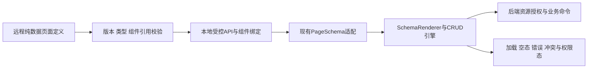

# 低代码页面配置与渲染架构

> LC-FE-01 · V1.0 · 2026-10-01 · 目标设计。前端目录边界继续遵循 `docs/architecture/frontend/FRONTEND-MODULE-GOVERNANCE-v1.0.md`。

## 1. 两类Schema与宿主职责

当前admin-lowcode的PageSchema是本地JavaScript对象：api.list/create/update/remove必须为函数，部分label/handler/buildPayload为函数；widgetRegistry为本地Vue渲染实现。这是**代码内声明式页面**，不能直接序列化成数据库JSON，也不能把远端字符串eval成函数。

目标远程PageDefinition只含数据：page_id/schema_version/entity_ref/query_ref/command_refs、字段/布局/字典/控件ID、类型化条件和动作ID。宿主适配器验证后，把引用绑定到现有API和注册控件，转换为本地PageSchema；复杂页面可注册专用组件。未知引用/类型拒绝，原始配置永不取得代码执行权。

## 2. 目录内模块边界

contract拥有PageDefinition/版本/验证与capability映射；engine拥有渲染和通用状态；pages只声明业务页面；composables管理分页/加载/写动作；宿主拥有布局/导航/认证。组件注册只从受信构建产物加载，不从配置远程import任意地址。

页面写操作由command能力执行，不把字段可编辑直接推导成有写权限。动态菜单只选已注册route/page；用菜单配置切租户时必须重新获得受权资源上下文，不能复用上一租户的页面缓存。

## 3. 交互与配置约束

表单区分字段不存在、null和未修改；服务端默认值由接口契约定义。分页/排序经稳定query能力，拒绝任意SQL排序字符串。条件表达式只做显示/本地校验，后端仍核验业务与数据范围。

默认展示业务字段，调试面板才显示有效配置来源、release、错误field_path。版本不支持显示“需要升级/只读”，不是空白页面。冲突提示保留用户输入并提供刷新对比，不自动丢弃更改。

日期/金额/单位/语言使用中央字典和项目格式出口，禁止组件各自无参toLocaleString；代码现状还需逐调用点门禁，不因写规范冒认已迁完。键盘焦点、标签、错误关联、响应式表单、图表列表替代纳入验收。

## 4. 性能与验收

配置一次校验与绑定，缓存按tenant/page/release/权限摘要；权限变化或切租户失效。页面只取可见字段，列表服务端分页，大量表格按测量决定虚拟化。配置大小/控件数量与依赖深度限制前置；不为简单CRUD引入通用运行时脚本。

出口LC-Q02/03/06/09/10/11，覆盖函数注入、未知widget、跨租户缓存、版本冲突、空态/加载失败与键盘操作。现有PageSchema测试和CRUD smoke作为起点，远程JSON版本适配与发布尚待实现。
