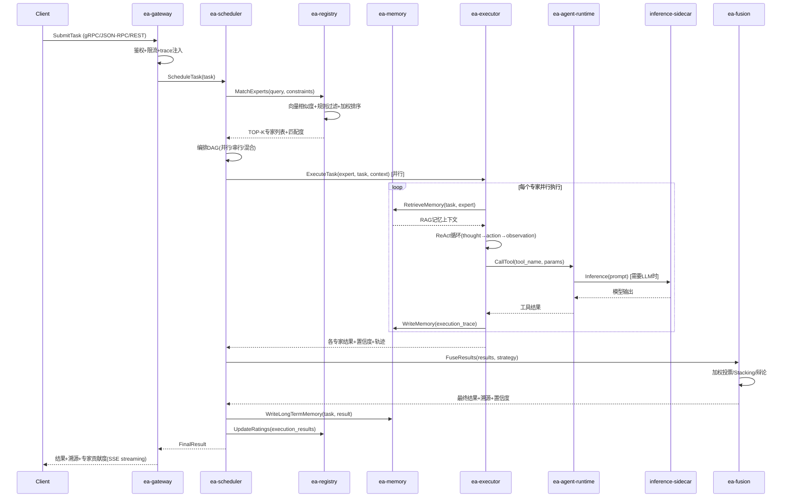

---
title: 专家联盟架构 v3.0 — 全维模块化与归一化
version: V3.0
authority: 🟡参考
doc_id: EA-DOC-041
last_updated: 2026-08-31
source_of_truth: 参考（宇宙架构视角）
---
# 专家联盟架构 v3.0 — 全维模块化与归一化

> 从两个 God Module（mox-ai-expert-svc 60+文件/500KB+、mox-ai-agent-svc 23+文件/700KB+）
> 拆解为 7 个独立微服务 + 3 个共享库 + 1 个推理 Sidecar。
> 每个服务独立部署、独立扩展、独立升级，服务间通过 gRPC/JSON-RPC 通信，零代码修改联调。


> 📌 **视角声明**  
> 本文档从"宇宙架构"哲学视角解读专家联盟架构。技术事实与精确数据以 `docs/expert-alliance/` 下文档及代码实现为准。

---

## 一、现状全维诊断

### 1.1 现有代码结构

```
domains/ai/
├── core/
│   ├── mox-ai-core/              # AI核心类型
│   └── mox-ai-intent-core/       # 意图识别核心
├── svc/
│   ├── mox-ai-agent-svc/         # ⚠️ God Module #1 (700KB+, 23文件)
│   │   ├── workflow_engine.rs    # 90KB 工作流引擎
│   │   ├── algorithm.rs          # 54KB 算法
│   │   ├── browser_automation.rs # 51KB 浏览器自动化
│   │   ├── conversation.rs       # 42KB 对话管理
│   │   ├── flow_engine.rs        # 53KB 流程引擎(与workflow_engine重复!)
│   │   ├── lib.rs                # 42KB 入口
│   │   ├── requirement_compiler.rs # 28KB 需求编译器
│   │   ├── plugin_bus.rs         # 25KB 插件总线
│   │   ├── parallel_executor.rs  # 19KB 并行执行器
│   │   ├── provider.rs           # 15KB 模型Provider
│   │   ├── resource_manager.rs   # 15KB 资源管理
│   │   ├── types.rs              # 18KB 类型定义
│   │   └── engine/               # 120KB 引擎子模块
│   │       ├── engine_loop.rs    # 43KB ReAct循环
│   │       ├── tools.rs          # 37KB 工具系统
│   │       ├── multi_agent.rs    # 18KB 多Agent
│   │       ├── guards.rs         # 12KB 守卫
│   │       └── state_machine.rs  # 10KB 状态机
│   ├── mox-ai-expert-svc/        # ⚠️ God Module #2 (500KB+, 60+文件)
│   │   ├── server.rs             # 31KB HTTP服务器
│   │   ├── programming.rs        # 21KB 编程专家
│   │   ├── reconcile.rs          # 22KB 冲突调和
│   │   ├── services.rs           # 21KB 服务实现
│   │   ├── tenant_policy.rs      # 17KB 租户策略
│   │   ├── harness.rs            # 17KB 插件运行时
│   │   ├── context.rs            # 12KB 上下文
│   │   ├── executor.rs           # 14KB 执行器
│   │   ├── pipeline.rs           # 14KB 管线
│   │   ├── ir.rs                 # 11KB 中间表示
│   │   ├── govern.rs             # 12KB 治理
│   │   ├── alliance/             # 120KB 联盟子模块(核心!)
│   │   │   ├── gate.rs           # 24KB 质量门禁+全管线
│   │   │   ├── team.rs           # 20KB 专家组队
│   │   │   ├── intent.rs         # 19KB 意图识别
│   │   │   ├── kg_connector.rs   # 18KG知识图谱连接
│   │   │   ├── debate.rs         # 18KB 辩论融合
│   │   │   ├── constants.rs      # 4KB 常量
│   │   │   └── mod.rs            # 9KB 类型+引擎入口
│   │   ├── audit/                # 45KB 审计(7文件)
│   │   ├── experts/              # 60KB 17个预置专家
│   │   ├── verify/               # 55KB 验证(8文件)
│   │   ├── rbac/                 # 14KB 权限(4文件)
│   │   ├── flow_loader/          # 25KB 流程加载(3文件)
│   │   └── domain/               # 7KB 领域抽象
│   └── mox-ai-flow-svc/          # 半成品(仅src目录)
```

### 1.2 八大架构问题

| # | 问题 | 严重度 | 具体表现 |
|---|------|--------|----------|
| P1 | **God Module** | 🔴致命 | expert-svc 60+文件/500KB+，agent-svc 23文件/700KB+，单crate承担10+职责 |
| P2 | **职责混乱** | 🔴致命 | expert-svc同时做: 专家注册/联盟调度/执行/融合/审计/RBAC/流程加载/验证/治理/编程 |
| P3 | **重复实现** | 🟠严重 | agent-svc内 workflow_engine.rs(90KB) + flow_engine.rs(53KB) 两套流程引擎；expert-svc内 pipeline.rs + alliance/gate.rs 两套管线 |
| P4 | **无法独立部署** | 🟠严重 | 所有功能耦合在一个二进制，无法单独扩展专家匹配(CPU密集)或推理(IO密集) |
| P5 | **命名不统一** | 🟡中等 | expert/agent/alliance/harness/pipeline 边界模糊，同一概念多个名字 |
| P6 | **缺少共享库** | 🟡中等 | 通用类型(AllianceEvent/Expert/Task)散落在各crate，协议定义不统一 |
| P7 | **状态管理混乱** | 🟡中等 | 会话状态/执行轨迹/记忆 混在内存中，无持久化，重启丢失 |
| P8 | **可观测性缺失** | 🟡中等 | 无统一trace/metrics/logging，6阶段管线的SSE事件是唯一观测手段 |

### 1.3 耦合度分析

```
mox-ai-expert-svc 内部耦合:
  alliance/gate.rs → 调用 intent.rs + team.rs + debate.rs + kg_connector.rs
  alliance/gate.rs → 调用 audit/ + rbac/ + experts/ + verify/
  server.rs → 调用几乎所有模块
  services.rs → 调用 expert_traits + domain + context + executor

mox-ai-agent-svc 内部耦合:
  engine/engine_loop.rs → 调用 tools.rs + multi_agent.rs + guards.rs + state_machine.rs
  workflow_engine.rs → 调用 flow_engine.rs + algorithm.rs + conversation.rs
  lib.rs → 调用所有模块

跨crate耦合:
  expert-svc/lib.rs → mox_ai_flow_svc (flow重导出)
  expert-svc/alliance/kg_connector.rs → 知识图谱服务
  agent-svc/provider.rs → 外部LLM API
```

**结论**: 两个crate都是典型的"分布式单体"反模式——代码在一个crate里，但逻辑上已经是多个系统硬塞在一起。

---

## 二、模块化归一化目标架构

### 2.1 7服务 + 3共享库 + 1Sidecar

```
┌─────────────────────────────────────────────────────────────────────┐
│                        接入层 (Gateway)                               │
│              ea-gateway-svc (协议分流/路由/鉴权/限流)                │
│         gRPC / JSON-RPC / REST / WebSocket / MCP                    │
└──────────────────────────────┬──────────────────────────────────────┘
                               │
        ┌──────────────────────┼──────────────────────┐
        │                      │                      │
┌───────▼───────┐    ┌────────▼────────┐    ┌──────▼────────┐
│  调度层         │    │  执行层          │    │  融合层        │
│ ea-scheduler-  │    │ ea-executor-    │    │ ea-fusion-    │
│ svc            │    │ svc             │    │ svc           │
│ 专家匹配       │    │ ReAct循环       │    │ 加权投票      │
│ 任务编排DAG    │    │ 工具调用        │    │ Stacking      │
│ 资源调度       │    │ 上下文管理      │    │ 辩论融合      │
│ SLA监控        │    │ 流式输出        │    │ 置信度校准    │
└───────┬───────┘    └────────┬────────┘    └──────┬────────┘
        │                      │                      │
┌───────▼───────┐    ┌────────▼────────┐    ┌──────▼────────┐
│  注册层         │    │  记忆层          │    │  运行时层      │
│ ea-registry-   │    │ ea-memory-      │    │ ea-agent-      │
│ svc            │    │ svc             │    │ runtime       │
│ 专家注册       │    │ 短期记忆        │    │ 无状态Agent   │
│ 能力标签       │    │ 长期记忆        │    │ 工具适配      │
│ 评分体系       │    │ 语义记忆(RAG)   │    │ 协议转换      │
│ 版本管理       │    │ 情景记忆        │    │ 水平扩展      │
│ 健康监控       │    │ 向量检索        │    │ 故障转移      │
└───────────────┘    └────────┬────────┘    └──────┬────────┘
                               │                      │
                        ┌──────▼──────────────────────▼──────┐
                        │     推理 Sidecar (Python)            │
                        │     ea-inference-sidecar             │
                        │     vLLM / 模型加载 / GPU推理        │
                        └─────────────────────────────────────┘

┌─────────────────────────────────────────────────────────────────────┐
│                        共享库 (3个)                                   │
│  ea-core     — 统一数据模型/错误类型/事件定义/常量                  │
│  ea-proto    — gRPC/JSON-RPC protobuf协议定义 (.proto + 生成代码)  │
│  ea-sdk      — Rust/TypeScript/Python客户端SDK                      │
└─────────────────────────────────────────────────────────────────────┘
```

### 2.2 服务职责与边界（归一化映射表）

| 新服务 | 职责 | 从现有代码迁移 | 独立部署 | 扩展方式 |
|--------|------|---------------|----------|----------|
| **ea-gateway-svc** | 协议分流/路由/鉴权/限流/追踪 | expert-svc/server.rs(31KB) + 网关半成品 | ✅ | 水平扩展(无状态) |
| **ea-scheduler-svc** | 专家匹配/任务编排DAG/资源调度/SLA | expert-svc/alliance/intent.rs(19KB) + team.rs(20KB) + gate.rs(24KB调度部分) | ✅ | 水平扩展+匹配缓存 |
| **ea-executor-svc** | ReAct循环/工具调用/上下文/流式输出 | agent-svc/engine/engine_loop.rs(43KB) + tools.rs(37KB) + conversation.rs(42KB) | ✅ | 水平扩展(无状态) |
| **ea-fusion-svc** | 加权投票/Stacking/辩论/置信度 | expert-svc/alliance/debate.rs(18KB) + reconcile.rs(22KB) | ✅ | 水平扩展(无状态) |
| **ea-registry-svc** | 专家注册/能力标签/评分/版本/健康 | expert-svc/expert.rs(7KB) + experts/(60KB,17专家) + expert_traits.rs(6KB) | ✅ | 读多写少，缓存 |
| **ea-memory-svc** | 短期/长期/语义(RAG)/情景记忆 | agent-svc/knowledge.rs(5KB) + dialogue_graph.rs(32KB) + 新增持久化 | ✅ | 向量检索分片 |
| **ea-agent-runtime** | 无状态Agent运行时/工具适配/协议转换 | agent-svc/provider.rs(15KB) + plugin_bus.rs(25KB) + browser_automation.rs(51KB) | ✅ | 水平扩展(无状态) |
| **ea-inference-sidecar** | Python/vLLM/GPU推理 | agent-svc/llm_client.rs(5KB) → 独立Python进程 | ✅ | GPU池化 |

### 2.3 共享库设计

#### ea-core（核心类型库）

```
ea-core/
├── src/
│   ├── lib.rs              # 统一导出
│   ├── types/              # 数据模型
│   │   ├── expert.rs       # Expert/ExpertConfig/ExpertRating
│   │   ├── task.rs         # AllianceTask/TaskStatus/TaskConstraints
│   │   ├── execution.rs    # ExpertExecution/ReasoningTrace/ToolCall
│   │   ├── memory.rs       # Memory/MemoryType/MemoryMetadata
│   │   ├── fusion.rs       # FusionResult/FusionStrategy/Confidence
│   │   └── event.rs        # AllianceEvent/EventPhase/SSE事件
│   ├── error.rs            # 统一错误枚举(EAError)
│   ├── constants.rs        # 全局常量(维度优先级/阈值/质量公式)
│   └── traits.rs           # 统一trait定义(Expert/Matcher/Executor/Fusion)
```

**关键设计**: 
- 所有服务只依赖 ea-core 的类型，不互相依赖具体实现
- 错误类型统一，`?` 操作符全链路可用
- 常量单一权威源(SSOT)，消除 expert-svc/lib.rs 中 DIM_PRIORITY 散落问题

#### ea-proto（协议定义库）

```
ea-proto/
├── proto/
│   ├── expert.proto        # 专家注册/查询/评分
│   ├── scheduler.proto     # 任务提交/匹配/编排
│   ├── executor.proto      # 执行/ReAct/工具调用(streaming)
│   ├── fusion.proto        # 融合/投票/辩论
│   ├── memory.proto        # 记忆存储/检索(RAG)
│   └── common.proto        # 公共类型(空/状态/分页)
├── src/
│   └── lib.rs              # prost生成代码 + 服务端trait
└── build.rs                # tonic-build编译.proto
```

**关键设计**:
- 单一协议定义，gRPC和JSON-RPC共用同一套.proto
- mox-dualrpc 自动 JSON↔Protobuf 转码，零配置
- 版本化: proto包名带版本号(ea.v1)，向后兼容

#### ea-sdk（客户端SDK）

```
ea-sdk/
├── rust/                   # Rust客户端
│   └── src/
│       ├── client.rs       # 统一客户端(自动选gRPC/JSON-RPC)
│       ├── expert.rs       # 专家注册客户端
│       ├── scheduler.rs    # 任务调度客户端
│       ├── executor.rs     # 执行客户端(streaming)
│       └── memory.rs       # 记忆客户端
├── typescript/             # TypeScript客户端(前端用)
└── python/                 # Python客户端(Sidecar用)
```

---

## 三、服务间通信与调用链

### 3.1 核心调用链（任务提交→结果返回）



### 3.2 服务间协议矩阵

| 调用方 → 被调方 | 协议 | 模式 | 说明 |
|-----------------|------|------|------|
| gateway → scheduler | gRPC | Unary | 任务提交 |
| gateway → executor | gRPC | Server streaming | 流式执行(SSE) |
| gateway → registry | gRPC | Unary | 专家查询 |
| scheduler → registry | gRPC | Unary | 专家匹配(高频,缓存) |
| scheduler → executor | gRPC | Server streaming | 任务执行 |
| scheduler → fusion | gRPC | Unary | 结果融合 |
| scheduler → memory | gRPC | Unary | 记忆读写 |
| executor → memory | gRPC | Unary | RAG检索+记忆写入 |
| executor → agent-runtime | gRPC | Unary | 工具调用 |
| agent-runtime → inference | HTTP/JSON | Unary | Python推理(Sidecar) |
| registry → memory | gRPC | Unary | 专家embedding存储 |

**JSON-RPC 支持**: 所有 gRPC 服务同时通过 mox-dualrpc 暴露 JSON-RPC 端点，外部系统(Java Dubbo/Node.js/Python)可直接 JSON-RPC 调用，自动转 Protobuf。

### 3.3 事件驱动（异步解耦）

| 事件 | 发布方 | 订阅方 | 用途 |
|------|--------|--------|------|
| `task.completed` | scheduler | registry, memory | 更新评分+写入长期记忆 |
| `expert.updated` | registry | scheduler | 失效匹配缓存 |
| `execution.failed` | executor | scheduler | 重试/降级/告警 |
| `memory.written` | memory | scheduler | 记忆索引更新 |
| `rating.changed` | registry | scheduler | 匹配权重更新 |

事件通过 RabbitMQ(lapin) 或 Redis Streams 传递，服务间完全解耦。

---

## 四、数据架构归一化

### 4.1 数据所有权（每服务独占数据）

| 服务 | 拥有的表 | 说明 |
|------|----------|------|
| ea-registry-svc | `ea_expert`, `ea_expert_embedding` | 专家注册+向量 |
| ea-scheduler-svc | `ea_alliance_task` | 联盟任务 |
| ea-executor-svc | `ea_expert_execution` | 执行记录(按月分区) |
| ea-memory-svc | `ea_expert_memory` | 记忆(向量索引) |
| ea-fusion-svc | 无独立表(无状态) | 融合结果写入task表 |
| ea-gateway-svc | 无独立表(无状态) | — |
| ea-agent-runtime | 无独立表(无状态) | — |

**铁律**: 服务只能读写自己拥有的表，禁止跨服务直接访问数据库。跨服务数据获取必须通过 API 调用。

### 4.2 数据库表设计（5张核心表，已在01-DATABASE-DDL.sql中定义）

```
ea_expert              — 专家注册/能力/评分/版本 (registry拥有)
ea_expert_embedding    — 专家能力向量 pgvector(1536) (registry拥有)
ea_alliance_task       — 联盟任务/状态/结果 (scheduler拥有)
ea_expert_execution    — 专家执行记录/轨迹/工具调用 (executor拥有, 按月分区)
ea_expert_memory       — 专家记忆/短期/长期/语义/情景 (memory拥有, 向量索引)
```

### 4.3 缓存策略

| 缓存内容 | 存储 | TTL | 失效策略 |
|----------|------|-----|----------|
| 专家匹配结果 | Redis | 5min | expert.updated事件主动失效 |
| 专家列表(活跃) | Redis | 1min | 定时刷新 |
| 专家embedding | 内存(moka) | 永久 | 变更通知 |
| RAG检索结果 | Redis | 10min | 记忆写入主动失效 |
| 用户会话 | Redis | 会话有效期 | 登出主动失效 |

---

## 五、部署架构

### 5.1 独立部署单元

每个服务 = 一个独立 Cargo crate + 独立 Docker 镜像 + 独立 K8s Deployment：

```
ea-gateway-svc/       → Docker镜像 → K8s Deployment + HPA + Service
ea-scheduler-svc/     → Docker镜像 → K8s Deployment + HPA + Service
ea-executor-svc/      → Docker镜像 → K8s Deployment + HPA + Service
ea-fusion-svc/        → Docker镜像 → K8s Deployment + HPA + Service
ea-registry-svc/      → Docker镜像 → K8s Deployment + HPA + Service
ea-memory-svc/        → Docker镜像 → K8s Deployment + HPA + Service
ea-agent-runtime/     → Docker镜像 → K8s Deployment + HPA + Service
ea-inference-sidecar/ → Docker镜像 → K8s Deployment(GPU节点) + Service
```

### 5.2 扩缩容策略

| 服务 | 扩容指标 | 最小副本 | 最大副本 | 说明 |
|------|----------|----------|----------|------|
| ea-gateway | CPU>60% / QPS | 2 | 20 | 无状态，线性扩展 |
| ea-scheduler | CPU>70% / 队列长度 | 2 | 10 | 匹配计算密集 |
| ea-executor | CPU>60% / 并发任务 | 3 | 50 | 无状态，ReAct循环IO密集 |
| ea-fusion | CPU>70% | 2 | 10 | 无状态 |
| ea-registry | CPU>50% / 内存 | 2 | 5 | 读多写少，重缓存 |
| ea-memory | CPU>60% / 向量查询延迟 | 3 | 20 | 向量检索，可分片 |
| ea-agent-runtime | CPU>60% | 2 | 20 | 无状态，工具执行 |
| ea-inference | GPU利用率>70% | 1 | 10 | GPU池化，按模型分组 |

### 5.3 服务网格与通信

- **服务发现**: K8s Service + DNS（内部）
- **负载均衡**: gRPC 客户端侧负载均衡（tonic-load-balancer）
- **熔断降级**: mox-framework resilience 模块（Hystrix模式）
- **链路追踪**: OpenTelemetry → Jaeger，trace_id 全链路透传
- **服务间认证**: mTLS（服务网格自动注入）

---

## 六、迁移路径（从God Module到微服务）

### 6.1 六阶段迁移

```
阶段1: 提取共享库 (Week 1-2)
  ├── 从 expert-svc/lib.rs 提取常量/类型 → ea-core
  ├── 从 alliance/mod.rs 提取 AllianceEvent/AllianceRequest → ea-core
  ├── 定义 .proto 文件 → ea-proto
  └── 验证: 两个crate都依赖ea-core，编译通过

阶段2: 提取注册中心 (Week 3-4)
  ├── expert.rs + experts/ + expert_traits.rs → ea-registry-svc
  ├── 增加 gRPC server (tonic)
  ├── 增加 PostgreSQL 持久化(ea_expert表)
  ├── 增加 pgvector 向量存储
  └── 验证: expert-svc 通过gRPC调用registry，功能不变

阶段3: 提取记忆系统 (Week 5-6)
  ├── knowledge.rs + dialogue_graph.rs → ea-memory-svc
  ├── 增加 RAG 检索(向量相似度+重排序)
  ├── 增加记忆重要度评分/TTL/遗忘
  └── 验证: executor通过gRPC调用memory做RAG

阶段4: 提取执行器+运行时 (Week 7-9)
  ├── engine/engine_loop.rs + tools.rs → ea-executor-svc
  ├── provider.rs + plugin_bus.rs + browser_automation.rs → ea-agent-runtime
  ├── 增加 ReAct 循环 + 流式输出(SSE)
  ├── 增加 Python inference sidecar 对接
  └── 验证: 独立执行任务，结果与原系统一致

阶段5: 提取调度器+融合器 (Week 10-12)
  ├── alliance/intent.rs + team.rs + gate.rs(调度部分) → ea-scheduler-svc
  ├── alliance/debate.rs + reconcile.rs → ea-fusion-svc
  ├── 增加 DAG 编排(并行/串行/混合)
  ├── 增加 SLA 监控/超时/重试
  └── 验证: 完整6阶段管线，结果与原系统一致

阶段6: 提取网关+清理 (Week 13-14)
  ├── server.rs → ea-gateway-svc
  ├── 增加协议分流(gRPC/JSON-RPC/REST/WS/MCP)
  ├── 增加鉴权/限流/追踪
  ├── 删除 expert-svc 和 agent-svc 中已迁移的代码
  └── 验证: 端到端全链路，性能不低于原系统
```

### 6.2 迁移原则

1. **绞杀者模式**: 新服务逐步接管流量，旧代码保留到完全迁移
2. **双跑验证**: 每个阶段新旧系统并行运行，对比结果一致性
3. **零停机**: 滚动更新，流量灰度切换
4. **向后兼容**: API版本化(v1)，旧客户端不中断
5. **可回滚**: 每个阶段可独立回滚到上一阶段

---

## 七、性能与可观测性

### 7.1 性能指标目标

| 指标 | 目标 | 测量方式 |
|------|------|----------|
| 专家匹配延迟 | P99 < 50ms | scheduler → registry 调用 |
| 任务提交到首Token | P95 < 2s | gateway → 首个SSE事件 |
| 单专家执行延迟 | P95 < 30s | executor 完整ReAct循环 |
| 融合延迟 | P99 < 1s | fusion 服务 |
| 端到端延迟(3专家并行) | P95 < 35s | 任务提交→最终结果 |
| 系统吞吐量 | > 1000 任务/秒 | 全链路压测 |
| 可用性 | 99.95% | 月度统计 |

### 7.2 可观测性三位一体

| 维度 | 工具 | 关键指标 |
|------|------|----------|
| **Metrics** | Prometheus + Grafana | QPS/延迟P50/P95/P99/错误率/队列长度/GPU利用率 |
| **Traces** | OpenTelemetry + Jaeger | 全链路trace_id，6阶段每阶段耗时，跨服务调用链 |
| **Logs** | Loki + structured logging | JSON格式日志，trace_id关联，租户ID过滤 |

**每个服务必须暴露**:
- `/health` — 健康检查(liveness/readiness)
- `/metrics` — Prometheus指标
- `/version` — 版本信息

---

## 八、目录结构（最终归一化布局）

```
platform/domains/ea/                          # 专家联盟域(独立域)
├── core/                                      # 共享核心库
│   ├── ea-core/                               # 统一类型/错误/常量/trait
│   └── ea-proto/                              # protobuf协议定义+生成代码
├── svc/                                       # 微服务
│   ├── ea-gateway-svc/                        # 网关(协议分流)
│   ├── ea-scheduler-svc/                      # 调度器(匹配+编排)
│   ├── ea-executor-svc/                       # 执行器(ReAct+工具)
│   ├── ea-fusion-svc/                         # 融合器(投票+辩论)
│   ├── ea-registry-svc/                       # 注册中心(专家+评分)
│   ├── ea-memory-svc/                         # 记忆系统(RAG+向量)
│   └── ea-agent-runtime/                      # Agent运行时(无状态)
├── sdk/                                       # 客户端SDK
│   ├── ea-sdk-rust/                           # Rust客户端
│   ├── ea-sdk-ts/                             # TypeScript客户端
│   └── ea-sdk-python/                         # Python客户端
└── sidecar/                                   # Sidecar
    └── ea-inference-sidecar/                  # Python推理(vLLM+GPU)
```

**域内分层规范**（与 DOMAIN_FIRST_LAYOUT.md 一致）:
- `core/` — 纯逻辑，无IO，可被所有svc依赖
- `svc/` — 独立部署单元，每个svc有自己的main.rs
- `sdk/` — 客户端库，供外部系统调用
- `sidecar/` — 辅助进程，与主服务同Pod部署

---

## 九、与现有系统的关系

| 现有crate | 去向 | 处理方式 |
|-----------|------|----------|
| mox-ai-expert-svc | 拆解到7个新服务 | 绞杀者模式逐步迁移，最终删除 |
| mox-ai-agent-svc | 拆解到executor+agent-runtime+memory | 同上 |
| mox-ai-flow-svc | 合并到scheduler(DAG编排) | 功能吸收后删除 |
| mox-ai-core | 合并到ea-core | 类型统一后删除 |
| mox-ai-intent-core | 合并到scheduler(意图识别) | 功能吸收后删除 |
| flow域5个服务 | 保持独立，与ea域平级 | 流程引擎(BPMN)与专家联盟(AI协作)是不同域 |

**关键区分**:
- **flow域** = 业务流程引擎(BPMN/状态机/审批)，面向业务人员
- **ea域** = AI专家协作系统(多Agent/ReAct/RAG/融合)，面向AI任务
- 两者通过 gRPC 互通：flow 可调用 ea 执行AI任务，ea 可调用 flow 执行业务流程

---

## 十、总结

### 10.1 优化前后对比

| 维度 | 优化前(God Module) | 优化后(7微服务) |
|------|-------------------|-----------------|
| 服务数量 | 2个巨型crate | 7服务+3库+1Sidecar |
| 最大文件 | 90KB(workflow_engine.rs) | <15KB(按职责拆分) |
| 独立部署 | ❌ 全部耦合 | ✅ 每个服务独立 |
| 独立扩展 | ❌ 只能整体扩容 | ✅ 按服务特性扩缩容 |
| 独立升级 | ❌ 改一处全量发布 | ✅ 单服务滚动更新 |
| 故障隔离 | ❌ 一处崩溃全挂 | ✅ 熔断降级不影响其他 |
| 团队协作 | ❌ 代码冲突严重 | ✅ 按服务分工 |
| 技术栈统一 | ❌ 类型/协议散落 | ✅ ea-core+ea-proto单一权威源 |
| 可观测性 | ❌ 仅SSE事件 | ✅ Metrics+Traces+Logs三位一体 |
| 多协议支持 | ❌ 仅HTTP | ✅ gRPC+JSON-RPC+REST+WS+MCP |

### 10.2 核心收益

1. **独立部署**: 每个服务独立Docker镜像+K8s Deployment，按需扩缩容
2. **独立升级**: 单服务滚动更新，不影响其他服务，回滚粒度小
3. **故障隔离**: 熔断降级，单个服务故障不拖垮整个系统
4. **技术灵活**: 推理Sidecar用Python，核心服务用Rust，各取所长
5. **团队自治**: 按服务划分团队，代码冲突最小化
6. **协议统一**: ea-proto单一权威源，gRPC/JSON-RPC自动转码，零配置联调
7. **性能最优**: CPU密集(匹配)和IO密集(推理)独立扩容，资源利用率最大化

---

*专家联盟架构 v3.0 — 从2个God Module到7个独立微服务，全维模块化归一化，每个服务独立部署/扩展/升级，服务间gRPC+JSON-RPC零配置联调*
