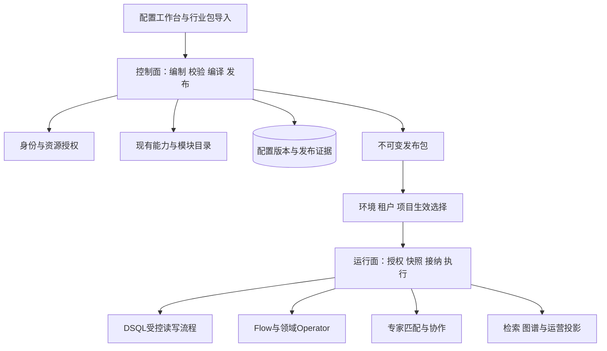
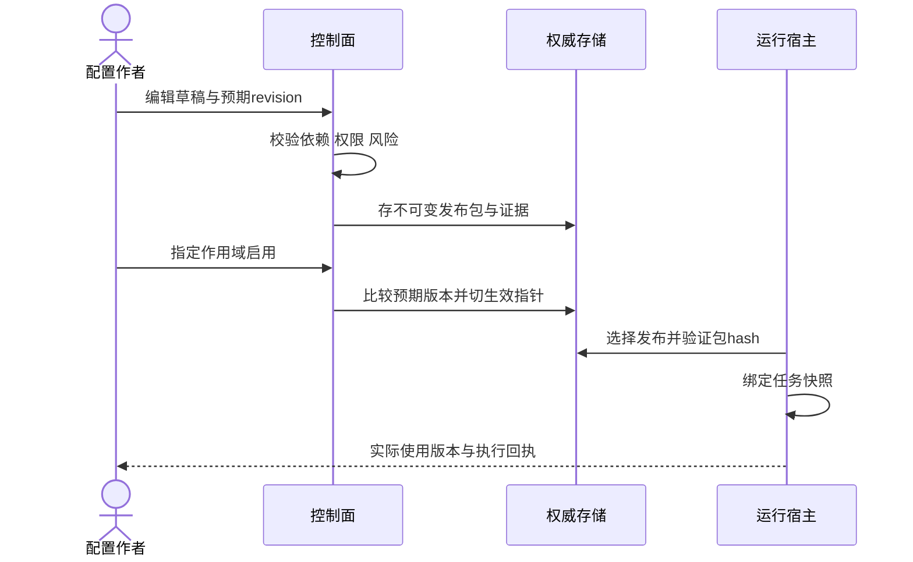

# 05 低代码配置控制面与运行面架构

> LC-ARC-META-05 · V1.0 · 2026-10-01 · 目标设计。规范语义唯一来源：`docs/standards/lowcode-dynamic-configuration.md#scope`。

## 1. 两类职责与模块映射

控制面为逻辑职责，可先内嵌现有平台服务，不要求新建服务。meta负责实体/字段与模板，module-core负责装配合法性，DSQL负责其语言内受控读写，flow负责执行能力，IAM负责授权，宿主负责资源接纳，alliance负责多专家业务。

编译器分三步：解析配置语法→生成类型化中间模型→转换为目标引擎受支持的模型。每个适配器声明支持的kind/schema版本和节点集合；不支持的人审、补偿、循环不能通过转换悄悄成为成功空节点。版本变化附转换结果摘要。

## 2. 目录责任边界

本目录负责控制面设计、编译和发布模型；API字段语义由api目录维护，存储物理布局由database目录维护，页面渲染由frontend目录维护，具体业务配方由modules/alliance维护。总图引用各源，不复制其接口列表、DDL或状态字典。

现有证据：meta-core的model/repo/codegen、DSQL的process/storage、module-core装配；这些模块存在不能证明跨模块原子配置发布已完成。既有 `00-COSMIC-META-ARCHITECTURE.md` 的7服务/秒级行业生成等描述是早期目标，不作新设计的已实现前提。

## 3. 编制与编译流水线

输入：版本化配置、能力目录、作用域政策、当前发布引用。处理：结构检查→语义/字典检查→依赖环及版本检查→数据权限/字段路径校验→预算约束合成→转换→风险分级→质量样例→差异预览。输出：有效配置、字段来源、依赖闭包、引擎执行模型、包摘要和验证证据。

所有可执行步骤通过稳定能力ID映射到注册实现；模板只声明参数与组合，不取得宿主代码加载权限。表达式需限定运算符、引用路径、类型、深度、成本；选择现有表达式能力，不在不同引擎复制一套独立语法。

## 4. 发布一致性与故障

包写入失败不切指针；指针冲突返回需刷新，不覆盖他人发布；包无法加载、缺秘密引用或能力不兼容时拒绝新任务。已有任务继续其快照，是否能继续外部调用仍受当前安全撤权政策限制，快照不能永久绕过撤权。

## 5. 容量与分阶段实现

先做少量内嵌类型化配置+发布引用，验证CRUD/流程/联盟一个组合；再加入版本包、作用域来源和缓存；最终按多租户并发需求增加灰度与分布式事件。配置大小/依赖数/编译时间超限提前拒绝，不把解析负载带进每次业务请求。

出口：LC-Q01/02/04/05/06/09，依赖闭包与有效配置可重算；运维可观察发布选择、失败编译和版本命中。架构拆分遵循已有ADR-17，不以“配置控制面”命名自动新建微服务。
