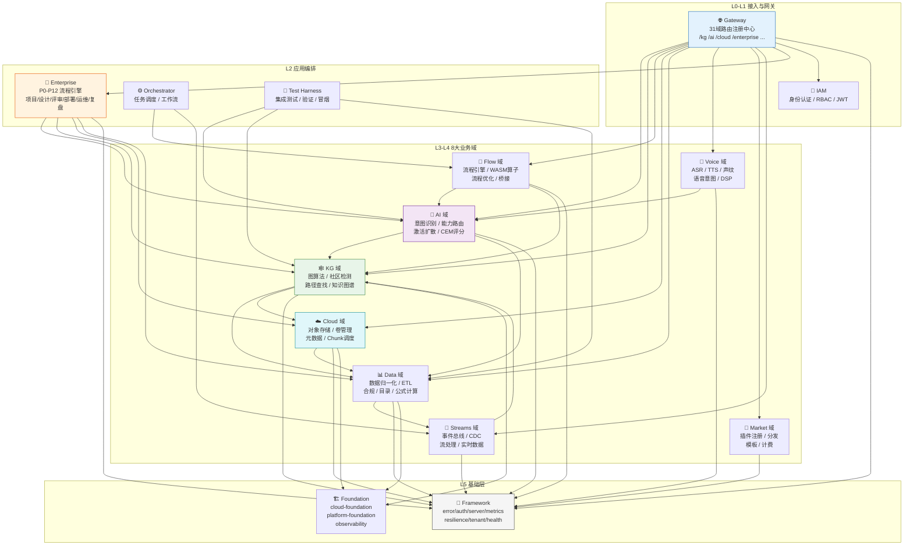
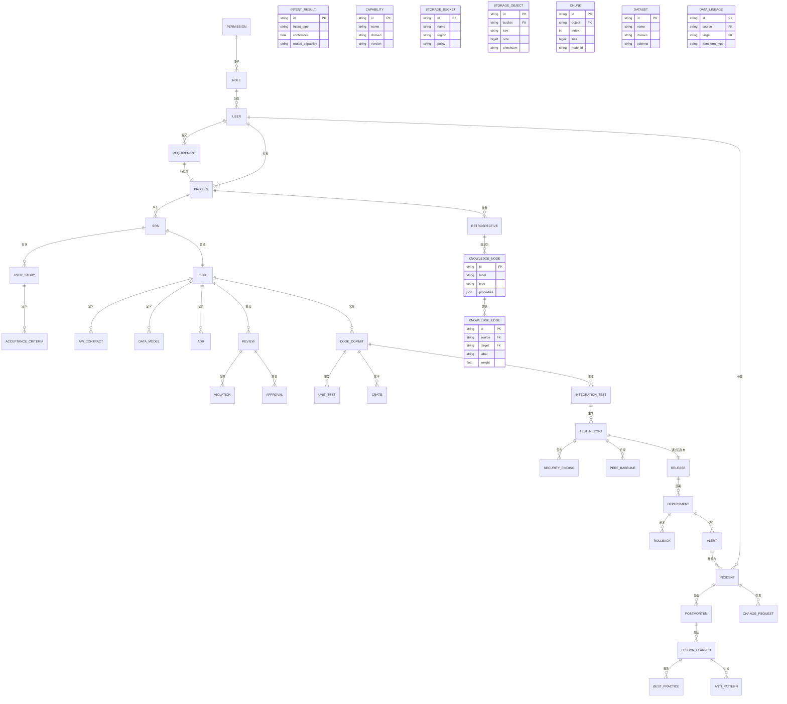
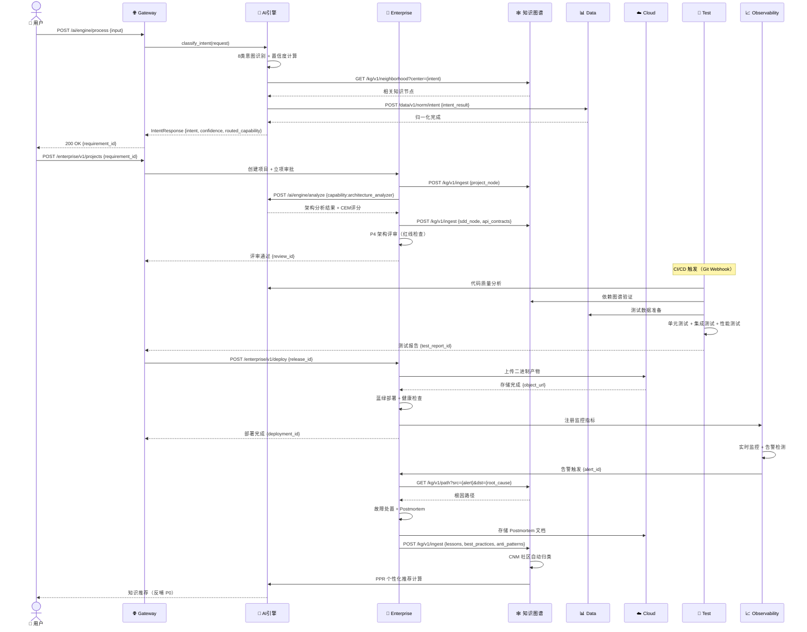
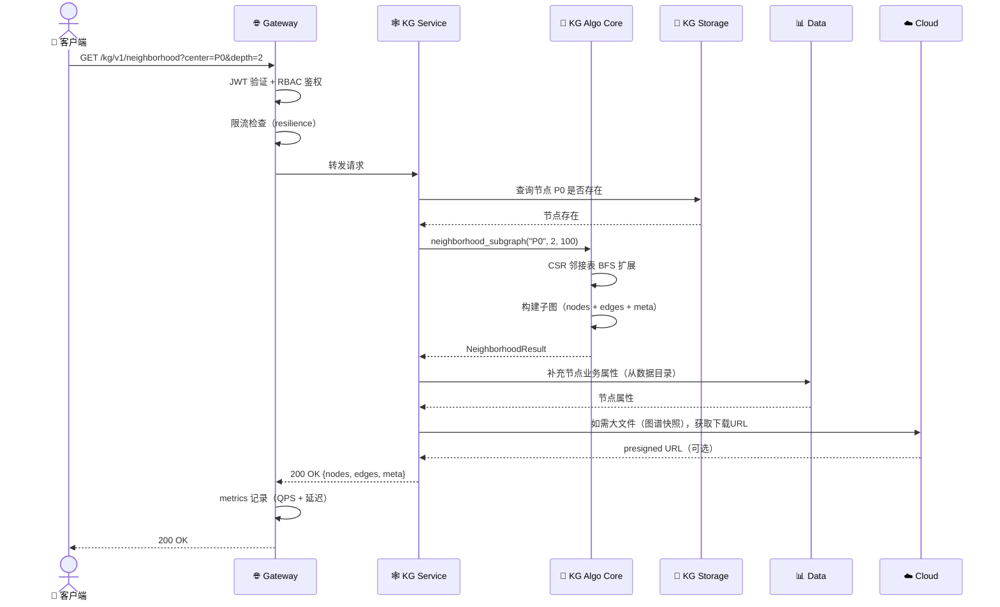
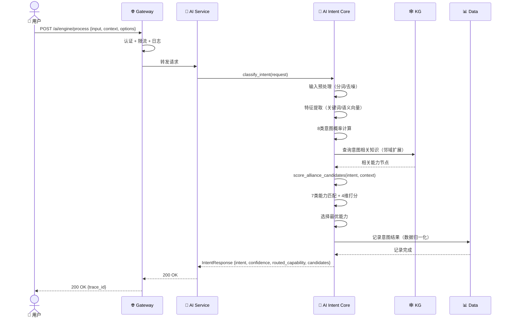
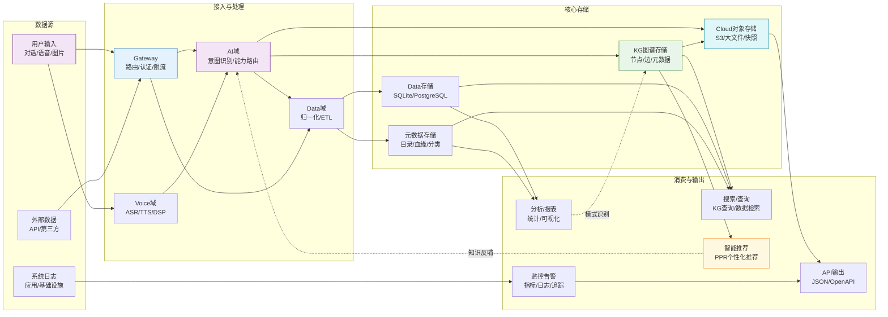
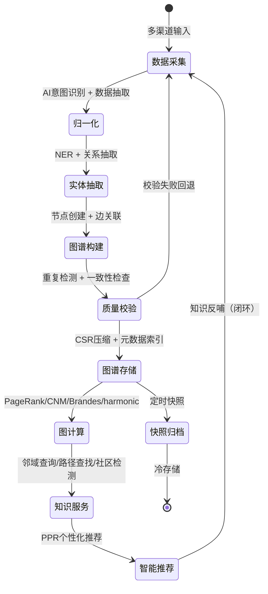

# 08 · 业务功能关联关系图

> **版本**: v1.0 · **日期**: 2026-08-27
> **说明**: 本文档定义 8 大业务域之间的功能关联、实体关系、调用链路和数据流向，是模块化架构的核心关联图谱。

---

## 一、8 域功能关联总图

### 1.1 域间依赖关系图



### 1.2 域间调用关系说明

| 源域 | 目标域 | 调用场景 | 关键 API |
|---|---|---|---|
| Gateway | 全部 8 域 | 路由分发 | `/kg/v1/*`, `/ai/engine/*`, ... |
| Enterprise | AI | 需求分析辅助 | `POST /ai/engine/analyze` |
| Enterprise | KG | 设计图谱/复盘知识 | `POST /kg/v1/ingest`, `GET /kg/v1/neighborhood` |
| Enterprise | Cloud | 部署产物存储 | `POST /cloud/v1/objects` |
| Enterprise | Data | 项目数据查询 | `GET /data/v1/query` |
| AI | KG | 意图相关知识推荐 | `GET /kg/v1/neighborhood?center={intent}` |
| AI | Data | 意图归一化数据 | `POST /data/v1/norm/intent` |
| KG | Data | 图谱数据持久化 | `POST /data/v1/store` |
| KG | Cloud | 图谱大文件存储 | `POST /cloud/s3/{bucket}/{key}` |
| Flow | AI | 流程节点智能决策 | `POST /ai/engine/process` |
| Flow | KG | 流程依赖图谱查询 | `GET /kg/v1/path?src={nodeA}&dst={nodeB}` |
| Cloud | Data | 存储元数据管理 | `POST /data/v1/catalog` |
| Data | Streams | 数据变更事件推送 | `POST /streams/v1/events` |
| Voice | AI | 语音转文字后意图识别 | `POST /ai/engine/process` |
| Streams | KG | 实时事件入图 | `POST /kg/v1/ingest` |
| Test | AI/KG/Data | 集成测试验证 | `POST /test-harness/v1/integration` |

---

## 二、核心业务实体关系图（ER）

### 2.1 mox 模块化系统架构实体 ER 图



### 2.2 核心实体关联说明

| 实体 | 关联实体 | 关系类型 | 说明 |
|---|---|---|---|
| Requirement | Project | 1:1 | 需求转化为项目 |
| Project | SRS | 1:N | 一个项目产生多份需求规格 |
| SRS | SDD | 1:1 | 需求驱动系统设计 |
| SDD | CodeCommit | 1:N | 设计文档对应多次代码提交 |
| CodeCommit | TestReport | N:1 | 多次提交汇总为一次测试报告 |
| TestReport | Release | 1:1 | 测试通过后发布 |
| Release | Deployment | 1:N | 一次发布可部署到多环境 |
| Deployment | Alert | 1:N | 部署后产生监控告警 |
| Alert | Incident | N:1 | 多个告警可升级为一个事件 |
| Incident | Postmortem | 1:1 | 每个事件有一份复盘 |
| Postmortem | KnowledgeNode | 1:N | 复盘沉淀为多个知识节点 |
| KnowledgeNode | KnowledgeEdge | N:N | 知识节点间通过边关联 |

---

## 三、跨域调用链路图

### 3.1 典型场景：需求输入到知识沉淀（全链路）



### 3.2 典型场景：KG 图查询跨域调用



### 3.3 典型场景：AI 意图识别跨域调用



---

## 四、数据流向图

### 4.1 全域数据流向总览



### 4.2 KG 图谱数据生命周期



---

## 五、域间依赖矩阵

### 5.1 编译期依赖矩阵

| 源域 \ 目标域 | AI | KG | Flow | Cloud | Data | Voice | Market | Streams | Platform | Framework |
|---|---|---|---|---|---|---|---|---|---|---|
| **AI** | - | ✅ | - | - | ✅ | - | - | - | - | ✅ |
| **KG** | - | - | - | ✅ | ✅ | - | - | - | - | ✅ |
| **Flow** | ✅ | ✅ | - | - | - | - | - | - | - | ✅ |
| **Cloud** | - | - | - | - | ✅ | - | - | - | - | ✅ |
| **Data** | - | - | - | - | - | - | - | ✅ | - | ✅ |
| **Voice** | ✅ | - | - | - | - | - | - | - | - | ✅ |
| **Market** | - | - | - | ✅ | ✅ | - | - | - | - | ✅ |
| **Streams** | - | ✅ | - | - | ✅ | - | - | - | - | ✅ |
| **Platform** | ✅ | ✅ | ✅ | ✅ | ✅ | ✅ | ✅ | ✅ | - | ✅ |
| **Gateway** | ✅ | ✅ | ✅ | ✅ | ✅ | ✅ | ✅ | ✅ | ✅ | ✅ |

> ✅ = 编译期依赖（Cargo.toml 中声明）；- = 无直接依赖

### 5.2 运行期调用矩阵

| 源域 \ 目标域 | AI | KG | Flow | Cloud | Data | Voice | Market | Streams | Platform | Observability |
|---|---|---|---|---|---|---|---|---|---|---|
| **AI** | - | 🔄 | - | - | 🔄 | - | - | - | - | 📊 |
| **KG** | - | - | - | 🔄 | 🔄 | - | - | - | - | 📊 |
| **Flow** | 🔄 | 🔄 | - | - | - | - | - | 🔄 | - | 📊 |
| **Cloud** | - | - | - | - | 🔄 | - | - | 🔄 | - | 📊 |
| **Data** | - | - | - | - | - | - | - | 🔄 | - | 📊 |
| **Voice** | 🔄 | - | - | - | - | - | - | - | - | 📊 |
| **Market** | - | - | - | 🔄 | 🔄 | - | - | - | - | 📊 |
| **Streams** | - | 🔄 | - | - | 🔄 | - | - | - | - | 📊 |
| **Platform** | 🔄 | 🔄 | 🔄 | 🔄 | 🔄 | 🔄 | 🔄 | 🔄 | - | 📊 |
| **Gateway** | 🔄 | 🔄 | 🔄 | 🔄 | 🔄 | 🔄 | 🔄 | 🔄 | 🔄 | 📊 |

> 🔄 = 运行期 HTTP/gRPC 调用；📊 = 指标/日志/追踪上报

---

## 六、模块化边界规则

### 6.1 域间通信规则

1. **必须通过 trait 接口**：域间通信必须通过定义在 foundation 层的 trait，禁止直接引用其他域的 impl
2. **禁止循环依赖**：A→B 且 B→A 为循环依赖，必须通过第三方域或事件总线解耦
3. **数据传输用 DTO**：跨域数据传输必须使用 DTO（Data Transfer Object），禁止直接传递内部实体
4. **错误码域隔离**：每个域有独立的错误码前缀（AI=4xxx, KG=5xxx, ...），便于问题定位

### 6.2 分层依赖规则

```
L0 接入层 → L1 网关 → L2 编排 → L3 服务 → L4 内核 → L5 基础
    ↑ 禁止反向依赖 ↑
```

- 上层可依赖下层，下层不可依赖上层
- L4 算法内核仅依赖 L5 基础层，不依赖任何业务服务
- L3 服务域间通过 L5 foundation trait 通信

### 6.3 模块拆分原则

| 原则 | 说明 |
|---|---|
| 单一职责 | 每个 crate 只负责一个明确的业务能力 |
| 高内聚 | 相关功能放在同一个 crate |
| 低耦合 | 域间通过 trait 接口，不直接依赖实现 |
| 可独立测试 | 每个 crate 可独立编写单元测试 |
| 可独立部署 | 模块化单体可按域拆分为微服务（ADR-16） |

---

*详见 [01-architecture-overview.md](./01-architecture-overview.md) 获取分层架构详解，[02-business-flow.md](./02-business-flow.md) 获取 P0-P12 业务流程图。*
