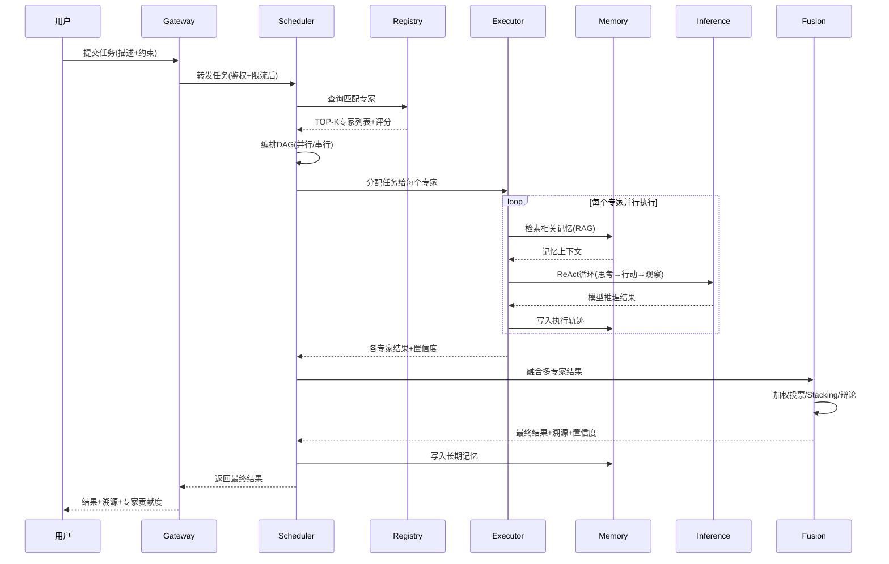

# 专家联盟架构设计 v2.0
## ——多AI专家协作系统，匹配/执行/融合/记忆全链路

---

## 一、架构总览

```
┌─────────────────────────────────────────────────────────────────────┐
│                        接入层 (Gateway)                               │
│              gateway-http (JSON-RPC/REST/WS)                        │
│              gateway-grpc  (gRPC/Dubbo-Triple)                      │
│              协议自动分流 + 鉴权 + 限流 + 追踪                       │
└──────────────────────────────┬──────────────────────────────────────┘
                               │
┌──────────────────────────────▼──────────────────────────────────────┐
│                     调度层 (Scheduler)                                │
│              alliance-scheduler                                       │
│  ┌─────────────┐ ┌──────────────┐ ┌──────────────────────────────┐ │
│  │ 专家匹配引擎  │ │ 任务编排DAG  │ │ 资源调度(预算/时间/质量)     │ │
│  │ 向量相似度   │ │ 并行/串行/混合│ │ 优先级/抢占/超时             │ │
│  │ +规则过滤    │ │ +依赖解析     │ │ +SLA监控                     │ │
│  └─────────────┘ └──────────────┘ └──────────────────────────────┘ │
└──────────────────────────────┬──────────────────────────────────────┘
                               │
        ┌──────────────────────┼──────────────────────┐
        │                      │                      │
┌───────▼───────┐    ┌────────▼────────┐    ┌──────▼────────┐
│  执行层         │    │  融合层          │    │  记忆层        │
│ alliance-       │    │ alliance-       │    │ expert-memory  │
│ executor        │    │ fusion          │    │                │
│ ReAct循环       │    │ 加权投票        │    │ 短期记忆       │
│ 工具调用        │    │ Stacking        │    │ 长期记忆       │
│ 上下文管理      │    │ 辩论融合        │    │ 语义记忆(RAG)  │
│ 流式输出        │    │ 置信度校准      │    │ 情景记忆       │
└───────┬───────┘    └────────┬────────┘    └──────┬────────┘
        │                      │                      │
┌───────▼───────┐    ┌────────▼────────┐    ┌──────▼────────┐
│  代理层         │    │  注册层          │    │  推理Sidecar   │
│ expert-agent    │    │ expert-registry │    │ ai-inference   │
│ 无状态Agent     │    │ 专家注册/能力   │    │ Python         │
│ 工具适配        │    │ 评分/版本       │    │ vLLM/模型加载  │
│ 协议转换        │    │ 健康监控        │    │ GPU推理        │
└───────────────┘    └─────────────────┘    └───────────────┘
```

---

## 二、7个服务职责

### 2.1 alliance-scheduler（调度器）

**核心职责**：专家匹配 + 任务编排 + 资源调度

**专家匹配算法**：
```
输入: 任务描述 + 上下文 + 约束(预算/时间/质量)
步骤:
  1. 任务描述 → embedding (1536维向量)
  2. 向量相似度检索: 与所有专家的能力描述embedding做cosine相似度
  3. 规则过滤: 按领域标签/能力标签/成本/延迟过滤
  4. 加权排序: score = 0.4*相似度 + 0.3*评分 + 0.2*成功率 - 0.1*成本
  5. TOP-K返回 (默认K=3, 可配置)
输出: 专家列表 + 匹配度 + 预估成本/时间
```

**任务编排DAG**：
- 支持并行/串行/混合执行模式
- 支持任务依赖（DAG有向无环图）
- 支持条件分支（基于前序任务结果）
- 支持循环/重试/超时

**数据库表**：`ea_alliance_task`

### 2.2 alliance-executor（执行器）

**核心职责**：ReAct循环 + 工具调用 + 上下文管理 + 流式输出

**ReAct循环**：
```
循环:
  1. Thought: 分析当前状态，决定下一步行动
  2. Action: 调用工具/查询记忆/请求人类输入
  3. Observation: 获取行动结果
  4. 判断: 是否完成? 是→输出最终答案; 否→继续循环
```

**工具调用**：
- 内置工具：搜索/计算/代码执行/文件读写/API调用
- 自定义工具：通过expert-registry注册的专家工具
- 工具适配：统一工具接口，自动参数校验/结果格式化

**流式输出**：
- SSE (Server-Sent Events) 实时推送思考过程
- 支持中断/恢复/取消

**数据库表**：`ea_expert_execution`

### 2.3 alliance-fusion（融合器）

**核心职责**：多专家结果融合 + 置信度校准 + 溯源

**融合策略**：

| 策略 | 适用场景 | 算法 |
|------|----------|------|
| **加权投票** | 分类/选择类任务 | 按专家评分加权，多数决 |
| **Stacking** | 回归/生成类任务 | 元学习器融合多专家输出 |
| **辩论融合** | 复杂推理/决策类 | 专家互相辩论，最终收敛 |
| **置信度加权** | 通用 | 按专家置信度加权平均 |

**溯源**：
- 最终结果标注每个专家的贡献度
- 支持追溯到每个专家的完整思考轨迹
- 支持对比不同专家的结果差异

### 2.4 expert-registry（注册中心）

**核心职责**：专家注册 + 能力标签 + 评分体系 + 版本管理 + 健康监控

**专家注册**（全维页面配置）：
```
基本信息: 名称/描述/头像/领域标签
能力定义: 输入Schema/输出Schema/工具列表/提示词模板
模型配置: 模型名称/温度/最大Token/API端点
评分体系: 准确率/响应速度/成本/用户评分
版本管理: 多版本并行/灰度发布/回滚
协作规则: 可协作专家/冲突解决策略/融合权重
```

**评分更新**：
- 每次任务执行后自动更新评分
- 评分算法: ELO等级分 + 指数移动平均
- 支持人工评分修正

**数据库表**：`ea_expert` / `ea_expert_embedding`

### 2.5 expert-agent（代理层）

**核心职责**：无状态Agent运行时 + 工具适配 + 协议转换

**无状态设计**：
- 所有状态存在expert-memory中
- Agent本身可水平扩展
- 支持故障转移/无缝恢复

**工具适配**：
- 统一工具接口规范
- 自动参数转换/校验
- 工具调用超时/重试/熔断

**协议转换**：
- 对外：gRPC/JSON-RPC/REST
- 对内：统一内部协议
- 自动序列化/反序列化

### 2.6 expert-memory（记忆系统）

**核心职责**：短期记忆 + 长期记忆 + 语义记忆(RAG) + 情景记忆

**记忆类型**：

| 类型 | 存储 | 检索 | 过期 |
|------|------|------|------|
| **短期记忆** | Redis/内存 | 精确匹配 | 会话结束/TTL |
| **长期记忆** | PostgreSQL | 精确/模糊 | 永不过期 |
| **语义记忆** | pgvector | 向量相似度 | 永不过期 |
| **情景记忆** | PostgreSQL+图 | 时间/实体关联 | 永不过期 |

**RAG检索**：
- 查询 → embedding → 向量相似度检索TOP-K
- 重排序: 交叉编码器重排序
- 上下文组装: 检索结果+任务描述→提示词

**记忆写入**：
- 每次任务完成后自动提取关键信息
- 重要度评分: 0-1，低于阈值不写入长期记忆
- 去重: 语义去重，避免重复记忆

**数据库表**：`ea_expert_memory`

### 2.7 gateway（接入层）

**核心职责**：协议分流 + 路由 + 鉴权 + 限流 + 追踪

**协议分流**：
- HTTP/1.1 + JSON → JSON-RPC/REST
- HTTP/2 + Protobuf → gRPC
- HTTP/2 + Protobuf (Dubbo header) → Dubbo-Triple
- WebSocket → 实时流式

**通过mox-dualrpc实现零配置多协议**。

---

## 三、核心业务流程

### 3.1 任务提交→结果返回全链路



### 3.2 专家注册流程

```
用户在页面配置专家
    ↓
1. 基本信息: 名称/描述/领域标签
2. 能力定义: 输入Schema/输出Schema/工具列表
3. 模型配置: 模型/温度/API端点
4. 提示词模板: 系统提示词/少样本示例
5. 协作规则: 可协作专家/融合权重
    ↓
生成专家embedding(能力描述→向量)
    ↓
注册到expert-registry + 健康检查
    ↓
上线(可被匹配调度)
```

---

## 四、数据库设计（专家联盟6张表）

详见 [01-DATABASE-DDL.sql](./01-DATABASE-DDL.sql) 中第七组：

| 表名 | 职责 |
|------|------|
| `ea_expert` | 专家注册/能力/评分/配置 |
| `ea_expert_embedding` | 专家能力向量(pgvector) |
| `ea_alliance_task` | 联盟任务/状态/结果 |
| `ea_expert_execution` | 专家执行记录/轨迹/工具调用 |
| `ea_expert_memory` | 专家记忆(短期/长期/语义/情景) |

---

## 五、性能与扩展

### 5.1 性能指标目标

| 指标 | 目标 |
|------|------|
| 专家匹配延迟 | <50ms (TOP-10) |
| 单专家执行延迟 | <30s (P95) |
| 融合延迟 | <1s |
| 系统吞吐量 | >1000 任务/秒 |
| 可用性 | 99.95% |

### 5.2 扩展策略

- **无状态服务水平扩展**：executor/agent/gateway 可无限水平扩展
- **记忆系统分片**：按租户/专家分片，pgvector分区
- **推理Sidecar池化**：GPU资源池化，按模型类型分组
- **专家匹配缓存**：相似任务缓存匹配结果，TTL=5min
- **结果缓存**：相同输入+相同专家版本缓存结果

---

## 六、与现有系统集成

| 现有模块 | 集成方式 |
|----------|----------|
| **mox-graph-storage** | 作为知识图谱存储，专家记忆的图关系存储 |
| **kg-hub** | 本体/推理/摄入，专家领域知识构建 |
| **mox-ai-agent** | 升级为alliance-executor的ReAct引擎 |
| **mox-expert** | 升级为expert-registry |
| **flow-ai/primiflow** | 升级为alliance-scheduler的DAG编排引擎 |
| **mox-framework** | 所有服务的基础设施(配置/日志/认证/弹性) |
| **mox-dualrpc** | 所有服务通信底座(gRPC/JSON-RPC/Dubbo) |

---

*专家联盟架构 v2.0 — 7服务+1Sidecar，匹配/执行/融合/记忆/注册全链路，支持任意数量AI专家协作*
