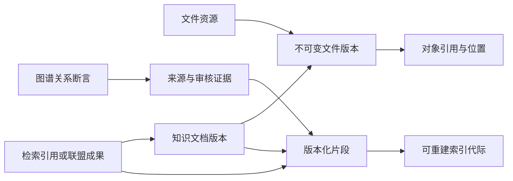

# 资源与知识数据归属、版本与一致性契约

> RK-DATA-01 · V1.0 · 2026-10-01 · 逻辑目标模型；当前已实现表结构及兼容迁移以实施台账为准。

实施说明：本文现状取自本轮实施前的代码基线，目标契约保持独立；已落地变化及兼容性以[实施台账](docs/modules/resource-knowledge/IMPLEMENTATION-STATUS.md#compatibility)为准。

## 1. 一个事实一个主源

| 逻辑对象 | 主源owner | 核心引用/规则 |
|---|---|---|
| Resource/Folder/File | cloud-drive | tenant/resource/parent/owner/policy；目录树是业务元数据，不是bucket key |
| FileVersion | cloud-drive | file_id、version_id、blob_ref、size、MIME、digest、created_by；发布后不可变 |
| Blob与BlobLocation | object-storage | blob_id、backend_id、bucket/key、provider_version、checksum、状态；对象字节与物理位置 |
| KnowledgeSpace/Document | knowledge-catalog | tenant/space/document、默认权限、current published revision |
| DocumentRevision/SourceBinding | knowledge-catalog | 精确file_version或inline来源、文本/结构制品、source checksum、来源范围 |
| ProcessingJob/Attempt | processing | source revision、pipeline/model版本、stage/result、预算、幂等、尝试 |
| Chunk/IndexGeneration | processing/retrieval | document revision、解析版本、offset/page、chunk checksum、模型/维度、索引代际 |
| Entity/Assertion/Evidence | knowledge-graph | namespace、主体关系客体、来源片段、置信度、审核、ontology版本 |
| ShareGrant/ResourcePolicy | IAM/资源owner | 受权范围、期限、可执行动作、撤回版本；令牌秘密不进图 |
| ProjectionCheckpoint/Tombstone | 各投影owner | 源版本、事件游标、删除代际；可重建派生状态 |

这些是逻辑聚合，不是一对象一新表。实现前核对现有文档JSON、KV、SQLite与对象索引，选择最小迁移，禁止整库换引擎。文档/版本关系引用本文，物理库现状由[DATABASE-ARCHITECTURE](docs/database/DATABASE-ARCHITECTURE.md#resource-knowledge-20261001)裁决。

## 2. 标识与来源归一

目标资源引用包含tenant_id、resource_type、resource_id、version_ref；内部映射表保留旧doc.id、字符串v1、数字version、UUIDv7以及kb-图节点命名。不同模型的version不得按字符串相等自动合并。tenant从受信身份取得，旧无tenant对象必须登记来源与归属，不能默认全租户可见。

blob_id是逻辑内容标识，BlobLocation是可迁移物理定位；文件ID/目录/显示名不作为对象地址。新接口引用受权resource，不向客户端返回本机绝对路径或长期签名URL。现有cloud key限制由兼容适配器处理，新backend自行生成受控key。

### 生命周期归一化

文件资源、知识发布、加工作业与投影分别维护状态，不用一个linked/ready值推导全链路完成。以下是逻辑目标语义，实施时通过明确映射接入旧状态字典：

| 对象 | 目标状态与守卫 |
|---|---|
| 文件/上传 | uploading→available→trashed→purging→deleted；上传失败或隔离不能下载；恢复仅从trashed，重新检查配额与授权 |
| 知识版本 | draft→processing→review_ready→published→withdrawn/archived；审核失败回到可修订状态；撤回不抹掉来源审计 |
| 加工尝试 | queued→running→succeeded/failed/cancelled/effect_unknown；未知回执先对账，重试生成attempt而不更换源版本 |
| 索引代际 | building→ready→stale/failed→retired；发布绑定实际可用代际，构建失败不假冒ready |
| 删除/迁移 | planned→running→verifying→completed或blocked/failed；完成需要所有必要回执，保留锁阻塞可解释 |

目录parent变更需防环、同租户检查与预期版本冲突保护。去重引用计数/位置指针在所属主源事务内更新，不能仅靠客户端先查后减保证安全。

去重默认限于租户/保护域；跨租户复用仅在专门隔离设计与授权通过后启用，不能泄露“其他租户已上传”的存在信息。digest记录算法，ETag仅作为提供方元数据，不能统一当作完整文件MD5。AWS说明分段上传ETag可能不是整对象MD5：[官方完整性说明](https://docs.aws.amazon.com/AmazonS3/latest/userguide/checking-object-integrity-upload.html)。

## 3. 写入、发布与投影一致性

上传会话接纳/对象完成/文件版本提交分别留回执；对象完成后才能提交可读取文件版本。元数据失败留下孤儿候选，不马上盲删，待超时、在途与引用检查后清理。对象写入回执未知时先按upload/key/digest核对，不重复创建新业务资源。

加工结果先进入候选版本，在一个知识主源事务中提交发布版本与必要事件意图；图/全文/向量消费者幂等更新。作业提交带expected source revision，旧作业完成只成为旧版制品，不更新新版发布指针。先本地事务+持久化事件意图，容量需要时再外置消息系统。

权限由主源实时判断，索引ACL是过滤加速投影，不能成为唯一权限源。候选召回前限制租户/空间，模型重排前复验资源与版本授权，响应/对象读取再确认。撤权/删除主源优先阻断访问，投影异步清理；延迟必须观测而非依赖缓存自然过期。

图关系必须保留证据、源版本、抽取/人工类型。源过期不抹掉审计证据；标失效/待复核，不再用于最新有效检索。人工确认关系属于KG事实，不能因重建抽取投影被覆盖或删除。

## 4. 删除、迁移、恢复

回收站是可恢复资源状态；物理删除必须考虑在用文件版本、知识引用、锁定保留、合法保留与其他资源共享引用。删除请求记录manifest：元数据、对象位置、片段、索引、图、缓存各自回执；全部符合政策后才能宣称彻底删除。

提供方切换只影响新对象默认定位；旧版本继续引用原backend。迁移逐对象复制→size/digest验证→切位置引用→观察与对账→保留期后清理旧副本。回退恢复位置指针，不将复制当作迁移成功，不因远端故障偷偷读取另一租户或未经确认的旧副本。

恢复集至少包含业务元数据、对象清单、策略与配置版本、发布指针、加工/删除任务及证据。可重建索引不是备份业务事实。RPO/RTO、保留期限和对象锁支持按部署档与提供方实测，当前不承诺具体数值。
