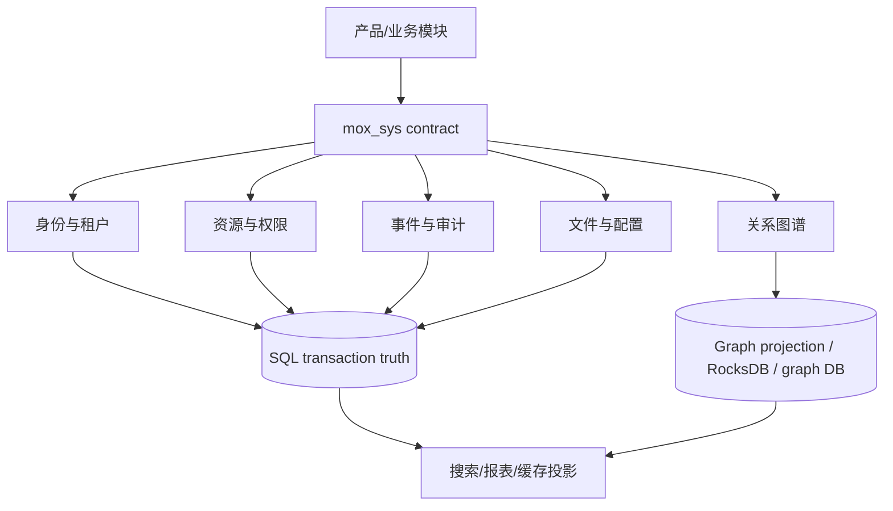

# mox_sys：通用系统数据库母版

`mox_sys` 是 MOX 的稳定平台内核模块，不是某一个业务系统的数据库。所有后续系统都应把它作为“系统能力母版”，再按领域安装扩展包：业务模块拥有自己的表和迁移，但通过 `mox_sys` 的身份、租户、组织、资源、事件、文件、配置和知识关系协议互操作。

## 设计目标

- 一套模型覆盖模块化单体、微服务、SaaS、私有化和离线单机。
- 同时支持逻辑隔离、独立库/Schema 隔离和混合隔离，不把隔离策略写死在业务表名里。
- 关系型数据库保存事务真相；知识图谱保存跨模块语义关系、推理索引和来源，不替代交易表。
- 允许 PostgreSQL、MySQL 8.3+、SQLite、RocksDB/图数据库通过 adapter 接入，核心契约不绑定某一种数据库。
- 所有模块可以独立升级、导出、安装、禁用和迁移，保持 API/事件向后兼容。

## 目录

- [`mox_sys-universal-template.sql`](mox_sys-universal-template.sql)：**唯一权威归一化母版 DDL**（56 张表，含模块注册与知识图谱）；一键安装见 `install.ps1` / `install.sh`。
- [`mox_sys-fk.sql`](mox_sys-fk.sql)：可选外键强化层（单体 MySQL 8.0.16+ 强一致部署专用，81 条物理外键；多态/溯源列除外，全部 RESTRICT）。
- [`mox_sys-seed.sql`](mox_sys-seed.sql)：可选平台引导种子——平台内建字典 30 类 108 项（与 DDL COMMENT/CHECK 逐字一致）+ platform 租户 / admin 用户 / sys_admin 角色（`INSERT IGNORE` 幂等，确定性保留段 ID），装完即用。
- [`module-contract.md`](module-contract.md)：所有系统模块必须遵守的表、租户、事务和事件契约。
- [`relation-model.md`](relation-model.md)：实体、关系、证据、权限和知识图谱投影规范。
- [`cross-database.md`](cross-database.md)：MySQL/PostgreSQL/SQLite/图存储兼容矩阵。
- [`module-registry.yml`](module-registry.yml)：可开源模块注册清单模板（含 owner/company/contact 治理字段）。
- [`governance.md`](governance.md)：**多公司/多团队治理规范**——命名空间认领、所有权 RACI、多公司部署隔离、环境晋级矩阵、模块贡献全链路 Checklist、冲突仲裁与原创性声明。

## 分层



## 安装原则

1. 新系统先安装 `mox_sys` core，再安装领域模块；领域模块不得复制 `sys_user`、`sys_tenant`、`sys_role` 等核心表。
2. 每个模块拥有唯一 `module_code`、SemVer 版本和迁移 checksum；升级使用增量 migration，禁止重建生产库。
3. 每张租户业务表必须有 `tenant_id`；企业/部门字段必须明确是 `enterprise_id` 或 `org_unit_id`，禁止使用含义不明的 `org_id`。
4. 跨模块只引用稳定 ID、发布事件或图谱关系，不直接依赖对方私有表；跨模块查询使用 read model/materialized projection。
5. 所有状态、类型、关系代码都是英文短码并有版本化字典；二值字段为 `Y/N`。
6. 核心交易数据使用 InnoDB/事务数据库；图谱、向量、全文检索和缓存是可重建投影，不能成为唯一业务真相。

## 安装顺序（一键）

```text
1. 直接进入 mox_sys/ 目录，运行 install.ps1（Windows）或 install.sh（Linux/macOS）
   —— 它把唯一权威母版 mox_sys-universal-template.sql（含模块注册+知识图谱，共 56 张表）
      灌入 MySQL（自动 CREATE DATABASE IF NOT EXISTS mox_v3）。
2. （可选，单库单体强一致部署）执行 `mox_sys-fk.sql`，为实体图追加 81 条物理外键；
   多态/溯源列不加 FK，全库软删除故全部 RESTRICT。分布式/分库部署跳过此步。
3. 如需把现有 mox_v3 现状库对齐到本母版，先按 ../mox-v3.0-migration-plan.md 迁移。
4. 按 module-registry.yml 选择安装 iam/meta/flow/rpa/ea/kg/ai 等领域模块。
5. 执行目标后端 migration smoke test 和 ../mox-v3.0-verification.sql 验证。
```

`mox_sys-universal-template.sql` 是单一归一化母版（已合并原 P17 模块注册与知识图谱），全目录无第二份并行 DDL。

## 三种隔离模式

| 模式 | 适用 | 强制要求 |
|---|---|---|
| `L` logical | 公有 SaaS、共享实例 | 每条租户数据带 `tenant_id`；repository 自动注入租户谓词；跨租户查询必须显式平台权限 |
| `P` physical | 政务、强合规、客户独立部署 | `tenant_id` 仍保留作审计和迁移键；连接路由到独立 DB/Schema |
| `H` hybrid | 大客户独立、小客户共享 | 租户路由表在 control plane；数据面可按租户迁移，ID 不变 |

## 开源发布定位

本模板随仓库 MIT License 发布。发布时必须同时提供 DDL、迁移、验证 SQL、模块契约、示例数据和变更日志；不得将真实租户数据、密钥、连接串或内部生产配置提交到模板仓库。提交新模块必须通过租户泄露、幂等、迁移回滚和多数据库兼容检查。
