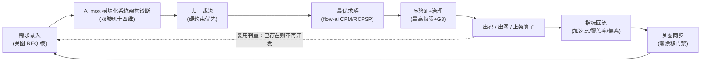

# 璇玑 RelGraph · mox 模块化系统架构愿景 · 核心架构与业务流程总纲（Enterprise Charter · 对齐 18 TOP-MASTER）

> **文档定位**：北极星总纲（North-Star Charter）。本文是 enterprise 文档集 **L1 第二级权威**——方法论总纲层：负责把 18 TOP-MASTER（L0 第一级）的 12 章总设计，**提炼为 7 原则 + 4 大主线收敛**，再向下统摄 `00~13`。与 18 冲突时，以 18 为准；与 01/02/04 冲突时以本文为准。
>
> **标准编号**：`ENT-CHARTER-V1.1`
> **版本**：v1.1 (ENT) · 最后更新 **2026-08-23**
> **权威链**：🟢 L0 第一级 → [`18-全域顶层总设计-三联盟模式-V1.0.md`](18-全域顶层总设计-三联盟模式-V1.0.md)（TOP-MASTER）；本文为 L1 第二级（北极星方法论总纲 + 三联盟世界观对齐）。
> **主责联盟**：产品联盟（世界观定义 & 原则提炼） + 算法联盟（图谱/算法原则） + 开发联盟（工程化落地原则）
> **承载底座**：`GR-STD-V1.0` 关图（高维需求关系图）＋ `PT-STD-V1.0` 六维绑定（物理底座）＋ `AA-STD-V1.0` mox 模块化系统架构需求流程（业务事实基准）
> **编写原则**：每条结论均可溯到 18 TOP-MASTER 章节编号；本文不重复造轮子，只做「总纲式收敛 + 愿景式拔高 + 三联盟对齐」。

---

## 0 · 北极星：一段话的方法论（用户原始愿景整理）

用户给出的原始愿景，逐句整理如下：

| # | 原始表述 | 工程语义 |
|---|----------|----------|
| ① | 在高维将系统所有的需求关系图设计好 | **高维需求关系图**：一切皆是信息，需求及其全部关系在高维被一次性设计清楚 |
| ② | 每个接口写最详细的描述，且描述可以关联另外的描述 | **描述即关联（Description-as-Link）**：节点带详尽描述，描述之间可互链，形成可导航知识网 |
| ③ | 所有功能的关联关系都明确了 | **关联关系全明确**：输入/输出/依赖/约束均被显式建模，无隐性依赖、无信息孤岛 |
| ④ | 这样可以快速知道是否已经有类似的系统了，不要在开发的 | **快速判重（Reuse-before-Build）**：以关系图为"系统指纹库"，新需求先查图，已存在则复用、不重复造轮子 |
| ⑤ | mox 模块化系统架构通过 AI 整理，不断地优化架构与算法 | **AI mox 模块化系统架构整理**：双璇玑十四维并行诊断＋归一化裁决＋已验证最优求解，持续打磨架构与算法 |
| ⑥ | 人类进入真正以创新与开发有价值的事情，而不是在原地一直重复 | **人类聚焦创新**：把重复劳动交给机器，人类只做价值判断与创新设计 |

### 0.1 mox 模块化系统架构工程方法论（七原则）

> **M1 · 高维需求关系图**：一切皆是信息。把业务、数据、功能、接口、代码、配置、任务、第三方依赖等全部抽象为节点，关系抽象为边，构建可机读、可校验、可同步的**唯一事实基准（关图）**。
>
> **M2 · 描述即关联**：每个接口/节点都写最详尽描述，描述之间可互链（Doc→Doc、REQ→CODE、ALG→TSK）。描述链即溯源链，画布中可点击钻取关联子图。
>
> **M3 · 关联关系全明确**：所有功能的输入/输出/依赖/约束均被显式建模；强制规则消灭孤儿、悬空边、缺证据、孤岛、隐性依赖、失效引用（GR-E1~E8）。
>
> **M4 · 快速判重**：把关系图当作组织的能力指纹库。新需求接入时先在图上做子图匹配——已存在→复用，局部缺失→增量补全，全无匹配→才立项。从"凭经验问有没有做过"升级为"图上秒级判重"。
>
> **M5 · AI mox 模块化系统架构整理**：双璇玑十四维（业务七维＋开发七维）并行诊断，归一化裁决（硬约束优先），flow-ai 已验证最优求解（CPM/RCPSP/Dijkstra/冲突修复/CodeGen）。
>
> **M6 · 持续优化闭环**：⛨璇玑验证网关（最高权限）＋治理闸门 G3（审计链/版本机/SLA/预算/RBAC）＋关图 sync 漂移门禁，驱动架构与算法持续进化。
>
> **M7 · 人类聚焦创新**：机器承担抽取、判重、诊断、消解、求解、验证、留痕；人类只做需求定义、价值判断、创新设计与 Blocking 冲突的最终裁决。

### 0.2 一句话北极星

> **用一张高维、可机读、全关联的需求关系图作为系统的唯一事实基准，让 AI 在mox 模块化系统架构约束下持续整理与优化架构算法，把人类从"原地重复"中解放出来，只做真正的创新。**

---

## 1 · mox 模块化系统架构工程方法论落地（How We Engineer）

### 1.1 高维需求关系图 = 关图 `GR-STD-V1.0`

- 图模型：`G=(N,E)`；节点 `N=(id,kind,name,path,summary,source,created_at,updated_at)`，边 `E=(id,from,to,kind,label,evidence)`。
- **12 类节点**：Business / Data / Function / Interface / CodeFile / Script / ScheduleTask / Config / Dependency / ThirdParty / Doc / Runtime（＋扩展 `Requirement`）。
- **7 类边**：Call / ReadWrite / Reference / Dependency / Inheritance / ConfigRef / Deploy（＋扩展 `Bind` 六维绑定边）。
- 每条边必须带 `evidence`（可定位出处），无出处视为未证实关系、校验标红。
- **第一性步骤**：项目启动即搭骨架；后续一切开发/对接/迭代/重构都以图为准。
- **CI 门禁 8 项**（非零即阻断）：图纳入版本管理且非空 ／ 无悬空边(GR-E2) ／ 无重复 id(GR-E4) ／ 所有边带 evidence(GR-E3) ／ 核心节点无孤儿(GR-E1) ／ 无未建模隐性依赖(GR-E6) ／ 文档引用全部有效(GR-E7) ／ 新变更 sync 漂移=0(GR-E8)。
- 现状基线：企业版图 `graph.enterprise.json` = **372 节点 / 751 边**；需求对齐覆盖率 **96.6%**（绝对下限护栏 `COVERAGE_FLOOR=90.0`）。

### 1.2 描述即关联（接口描述互链）

- 每个节点带 `summary`＋`description`＋`evidence`；`Doc` 节点经 `Reference` 边引用 `Doc` 节点，实现"描述关联描述"。
- 需求根 `REQ` 经 `Bind` 边跨域追溯：`REQ→FUN→BIZ→ALG→TSK→COD`，描述链即溯源链（导出 TraceMatrix）。
- 可视化画布中点击任意节点即可 `info-graph query` 钻取其关联子图，知识网可导航、可影响面分析。

### 1.3 关联关系全明确 → 偏离治理

- 强制规则 `GR-E1~E8`：孤儿节点 / 悬空边 / 未证实关系 / 重复 id / 信息孤岛 / 隐性依赖 / 失效引用 / 同步漂移。
- **GR-E6 偏离检测**：以 REQ 根为根做无向可达性 BFS，核心实现节点不可达任何 REQ 根 → 视为无需求溯源（偏离信号）；REQ 根无任何出边 → 需求悬空。
- 报告输出：需求根数、核心节点数、已对齐数、偏离数、覆盖率(%)，供 CI 告警与清零。

### 1.4 快速判重（避免重复造系统）

新需求接入 `S1` 时，在关图上执行**子图匹配**三步决策：

```text
新诉求 → 在关图做子图匹配
  ├─ 能力/接口/算法子图已存在  → 直接复用（bind 到既有 REQ 根），不新开发
  ├─ 仅局部缺失               → 增量补全（新增节点/边），不重建
  └─ 完全无匹配               → 才立项新 REQ 根（Dxx / Rxx）
```

效果：从"凭经验问有没有做过"升级为"在图上秒级判重"，**根治重复造轮子**——这正是愿景 ④ 的核心诉求。

### 1.5 AI mox 模块化系统架构整理 = 双璇玑十四维

- **业务璇玑（七维）**：Business / Algorithm / Permission / Resource / Security / Data / Observability。
- **开发璇玑（七维）**：Architecture / Security_Code / Code_Quality / Performance / Testing / Documentation / Maintainability。
- 优先级仲裁：`Permission/Security > Resource > Data > Business > Observability > Algorithm`（开发七维参与同优先级仲裁）。
- `reconcile` 归一化裁决：硬约束（Blocking）一律优先落地，不可被性能优化绕过；同优先级平手升级为 `Risk(Blocking)` 交人工/审批。
- `flow-ai optimize`：CPM 关键路径 ＋ RCPSP 资源调度 ＋ 伪依赖剪除 ＋ 冲突自动修复 ＋ 代码生成 ＋ LLM 算力路由（已验证算法栈）。

### 1.6 持续优化闭环

- ⛨璇玑验证网关（**最高权限**）：5 项阻断级数学/语义检查，任一失败→`vetoed=true`→治理闸门强制 `Blocked`，任何 RBAC/合规结论不可覆盖。
- 治理闸门 `G3`：审计哈希链 ＋ 版本状态机 ＋ SLA ＋ 成本预算 ＋ RBAC 审批，五条件任一不满足即拒。
- 关图 `sync` 漂移门禁：每次变更须零漂移，图随代码持续同步、不腐化。
- **飞轮**：开发→出码→指标回流→关图同步→下一轮更优（详见 §6）。

### 1.7 人类聚焦创新

| 机器承担（交给 AI/流水线） | 人类承担（只做高价值） |
|---|---|
| 关系抽取、CI 校验、子图判重 | 需求定义、价值判断 |
| 双璇玑并行诊断、冲突消解 | 创新设计、架构取舍 |
| 最优求解、⛨验证、治理留痕 | Blocking 冲突的最终裁决 |

收益：把"在原地重复"的时间，腾给"创造有价值的新东西"——愿景 ⑥ 的终点。

---

## 2 · 系统需求（企业级 SRS 全景）

> 完整结构化需求见 `01-requirements.md`（IEEE 830 风格，每条需求可验证）。本节为**收敛摘要**。

### 2.1 两大业务主线

- **璇玑（协作治理域 · `mox-system`）**：组建璇玑 → 专家入璇玑 → 任务派发 → 协同推进 → 全程留痕。
- **璇玑融合（算子融合域 · `mox-expert`）**：归一化 → 双璇玑十四维会诊 → 冲突消解 → 治理裁决 → 产出可复用优化算子并上架。

### 2.2 功能需求全景（P0 摘要）

| 域 | 关键需求 | 状态 |
|----|----------|:--:|
| `FR-MEM` 成员管理 | 创建/邀请/激活/生命周期状态机（Left 终态不可复活）/ 最小权限 | ✅ |
| `FR-TASK` 任务协作 | 派发三重校验 / DoD 门禁 / 依赖图须 DAG / 终态不可迁出 | ✅ |
| `FR-PERM` 权限 | 5 角色＋继承 / 14 原子权限含 `*Own` / 三级作用域 / 统一 `require()` 鉴权 | ✅ |
| `FR-COMM` 通信 | 三类频道 / 事件→系统消息＋通知 / WebSocket 实时推送 / 反应器幂等 | ✅ |
| `FR-AUDIT` 审计 | 9 类领域事件 / `audit:view` 约束 / 融合一票否决 / 不变式验证发布 | ✅ |
| `FR-FUSE` 融合 | 双璇玑十四维 / 归一化 IR→会诊→裁决 / ⛨最高权限校验 / 可解释优化 | ✅ |

### 2.3 非功能需求（可度量 · 节选）

| ID | 类别 | 目标值 | 现状 |
|----|------|--------|------|
| NFR-01 | 多租户隔离 | 100% 拦截跨璇玑引用 | ✅ |
| NFR-03 | 可移植性 | SQLite/PostgreSQL/MySQL 零代码切换 | ✅ 三后端已落地 |
| NFR-05 | 代码质量 | `cargo clippy` 0 warning | ✅ |
| NFR-06 | 可回归 | 一键全量回归 | ✅ **644 passed / 0 failed / 6 ignored** |
| NFR-07 | 性能 | 融合加速比 ≥2.32× | ✅ 实测 2.32× |
| NFR-10 | 可用性 | `/api/health` 探针 | ✅ |
| NFR-11 | 一致性 | 事件反应器幂等 | ✅ |
| NFR-08/09 | 可观测性/配额 | 指标可采集 / 可配置 | 📋 路线图中 |

### 2.4 验收标准（四条铁律）

1. 功能验收：标记 ✅ 的 FR 均有正向＋负向测试。
2. 回归验收：`cargo test -p mox-system -p mox-expert -p flow-ai` 全绿。
3. 静态验收：相关 crate `cargo clippy` 零告警。
4. 安全验收：跨租户提升路径被阻断；鉴权失败可审计；`mox bench` 加速比 ≥2.32×。

---

## 3 · 核心架构（多视图摘要）

> 完整七视图＋ADR 见 `02-architecture.md`。本节为**收敛摘要**。

### 3.1 七视图一句话

| 视图 | 一句话 |
|------|--------|
| 业务 Business | 两大主线（协作治理 / 算子融合），价值流＝需求→融合→上架→复用 |
| 信息 Information | 领域模型以"领域事件"为不可变事实源；数据流闭环＝事件→反应器→消息/审计 |
| 应用 Application | OUS 五层映射；模块单一职责；`mox-system`/`mox-expert`/`flow-ai` 为核心 |
| 技术 Technology | Rust  workspace（15 crate）；trait `Repository` 存储解耦；事件总线解耦 |
| 安全 Security | STRIDE 威胁模型；RBAC 六角色双模式；安全护栏（最小权限/fail-closed） |
| 集成 Integration | REST/WebSocket 对外；领域事件契约；MCP/Skill/Loop/LLM 归一为 IR 第一类公民 |
| 部署 Deployment | 多后端持久化（`MOX_PERSIST=true`＋`STRICT` fail-fast）；可观测性/灾备入路线图 |

### 3.2 核心骨架（四梁八柱）

```text
            ┌──────────────────────── 高维需求关系图（关图 GR-STD, G=(N,E)）────────────────────────┐
            │  12 类节点 / 7 类边(+Bind) ｜ CI 门禁 8 项 ｜ 偏离治理 GR-E6 ｜ 覆盖率 96.6%            │
            └───────────────────────────────┬─────────────────────────────────────────────────────┘
                                             │ REQ 根（D01~D13 / R01~R08）经 Bind 六维骨架接入
                                             ▼
   六维绑定 REQ → FUN → BIZ → ALG → TSK → COD （唯一可追溯链，导出 TraceMatrix）
                                             │
              ┌────────── 双璇玑十四维并行诊断（业务七维+开发七维）──────────┐
              │  Permission/Security > Resource > Data > Business > ...      │
              └───────────────────────────┬─────────────────────────────────┘
                                           ▼
                        reconcile 归一化裁决（硬约束优先）→ ReconciledPlan
                                           ▼
                        flow-ai optimize（CPM/RCPSP/Dijkstra/CodeGen）
                                           ▼
                    ⛨ 璇玑验证网关（最高权限，5 项阻断检查）
                                           ▼
                    治理闸门 G3（审计链/版本机/SLA/预算/RBAC）→ 出码/出图
```

### 3.3 主要模块一览（路径零老化 · 15 独立子项目 + 聚合网关 + 前端单应用 · 对齐 ADR-DOC-005）

| 组别 | 模块域 | 路径 / 主要 crate（职责 1 句） |
|------|--------|-------------------------------|
| 1 | 璇玑主核（协作治理 + 融合治理） | `platform/domains/mox-system`（成员/任务/权限/通信/RBAC/多后端 SQLite+PG+MySQL repo）；`platform/domains/mox-expert`（双璇玑十四维治理 / 归一化 / 裁决 / ⛨璇玑验证 / 审计三汇 / RBAC） |
| 2 | 算子内核与执行 | `platform/domains/operator-core`（算子代数/守恒律/类型核心）；`platform/domains/operator-wasm`（WASM 字节码沙箱） |
| 3 | 图与知识 / AI | `platform/domains/graph-algorithms`（**八大算法家族 A1~A8**：CNM/Brandes/Harmonic/PageRank/激活扩散/RRF/CEM/CPM·RCPSP）；`platform/domains/kg-hub`（混合索引+URN+本体/摄入/推理/治理/影响/热点/闭环8段/5连接器）；`platform/domains/ai-agent`（多阶段 Engine/LLMClient 路由/浏览器自动化/需求编译器/BPMN/MultiAgent/ProviderRegistry）；`platform/domains/optimizer`（CPM/RCPSP 调度）；`platform/domains/flow-ai`（9 模块：冒险/CPM/冲突/调度/拓扑/代码gen/流水线/原语/可视化） |
| 4 | 归一化 / 融合 / 编排 / 市场 / 桥接 / 目录 | `platform/domains/primiflow-core`（PrimiFlow 解析/代码生成/8 类骨架模板/执行/持久化）；`platform/domains/primiflow-fusion`（六维融合/守恒闸门/Registry/平台编排/12Factor+可观测）；`platform/domains/template-market`（市场发布/列表/加载/评分/排序/Fork/2 种子）；`platform/domains/hermes-flow-bridge`（Hermes Agent 桥接：normalize/recorder/router/拦截注入）；`platform/domains/business-catalog`（6 预置 FlowGraph + TopologyGraph：政务/财务/客服/ETL/MCP/螺旋） |
| 5 | 聚合网关 & 前端（统一入口） | `platform/gateway/runtime/`（15 crate 聚合网关：routes/handlers/Cordis5 子模块/RBAC 中间件/市场 DSL/迁移/治理/OpenAPI/operator-server + 统一 AI 四端点 /ai/engine/{process,analyze,capabilities,metrics}）；`frontend-ui/`（用户端单应用 28 视图 + `/admin` 系统管理 5 面板：融合工作台 MoxFusionView、监控台 MonitorView、AdminView 访问/审计/HITL/存储/总览） |
| 6 | 专题能力 | `platform/tools/info-graph`（P9 判重 dedup）+ `tools/guantu_gate.py`（CI 门禁）；`melody2score`（旋律自动简谱/五线谱） |

### 3.4 ADR 要点（节选）

- **ADR-01** 关图作为唯一事实基准，拒"文档滞后于代码"的传统模式。
- **ADR-02** 归一化 IR 承载四类流程图（业务/算法/权限/资源）为同一 `FlowGraph`，维度仅作标签。
- **ADR-03** ⛨璇玑验证网关为最高权限，治理/合规结论不可覆盖其否决。
- **ADR-04** 存储层 `trait Repository` 接口/实现分离，三后端零代码切换。

---

## 4 · 文档架构（文档即产品）

> 完整治理见 `00-INDEX.md`（唯一治理入口）与 `docs/README.md`（关图/mox 模块化系统架构专题分区索引）。本节为其**总纲式映射**。

### 4.1 `docs/` 归一化布局

| 分区 | 等级 | 内容 |
|------|------|------|
| `enterprise/` | 🟢 权威治理中心（本文集 `00~14`） | 需求/架构/设计/业务/路线图/映射/mox 模块化系统架构/归档/交付 |
| `specs/` | 🟢 权威规范 | `GR-STD`（关图）/ `PT-STD`（六维绑定）/ `OUS`（业务规划） |
| `full-dimensional/` | 🟡 mox 模块化系统架构专题 | AA-STD 流程基准 / 关图骨架 / 治理台 API / 过程稿归档 |
| `graph/` | 🟡 机读产物 | `graph.json` / `graph.enterprise.json` / `guantu.req.json` |
| 根级 `*.md` | 🟢/🟡 | AA-STD（融合域权威）、`mox-expert-*`、过程稿、可视化 `*.html`/`*.mmd` |

### 4.2 编号归一基准

- mox 模块化系统架构流程阶段 **S1~S8**；闸门 **G0~G3**；护栏 **G-A~G-E**；规范 **GR-STD / PT-STD / AA-STD**。
- 本文档编号 `ENT-CHARTER-V1.0`，在 `00-INDEX` 中登记为文档 `14`（顶层总纲）。

### 4.3 权威等级与 RACI（摘要）

- 🟢 权威（以之为准）：AA-STD、BR 业务规则、`docs/architecture.md`、`enterprise-architecture-analysis.md`、各 `specs/`、`docs/full-dimensional/guantu-skeleton.md`。
- 🟡 过程稿/可视化：`*-20260816*`、原始四份文档、`*.html`/`*.mmd`（以同名 `.md` 为源）。
- RACI：需求变更评审（架构师 A／模块 Owner R）、ADR（架构师 R）、文档发布 ENT（文档维护者 R／架构师 A）、安全合规（安全 A）。

---

## 5 · mox 模块化系统架构业务流程图（归一化 · 企业级）

> 本流程图以 `AA-STD-V1.0` 为唯一事实基准（融合域）。8 阶段、4 道强制闸门，任意闸门拒绝即阻断出码，无降级旁路。

### 5.1 主流程（S1~S8 ＋ 四闸门）

```mermaid
flowchart TD
    S1[["S1 需求接入<br/>关图 REQ 根 D01~D13/R01~R08<br/>Bind 六维骨架 + 租户/RBAC 上下文"]]
    G0{{"G0 归一化闸门<br/>IR 可拓扑排序·着色完整·孤儿/悬空边=0"}}
    S2[["S2 归一化<br/>auto_dimension 维度着色<br/>→ 唯一 FlowGraph(base)"]]
    S3[["S3 双璇玑并行诊断<br/>14 位专家 run_experts 并行<br/>各出 ExpertOpinion"]]
    G1{{"G1 裁决闸门<br/>硬约束优先·冲突升级 Blocking"}}
    S4[["S4 归一化裁决<br/>reconcile → ReconciledPlan<br/>注入 Guard/Mutex + ExpertRule"]]
    S5[["S5 flow-ai 最优求解<br/>CPM+RCPSP+伪依赖剪除<br/>+冲突修复+CodeGen"]]
    S6[["S6 ⛨ 璇玑验证网关<br/>verify 5 项阻断检查<br/>最高权限"]]
    G2{{"G2 ⛨ 璇玑否决（最高）<br/>vetoed → 强制 Blocked"}}
    S7[["S7 治理闸门 Govern<br/>审计哈希链+版本机+SLA+预算+RBAC"]}
    G3{{"G3 治理闸门<br/>五条件任一不满足即拒"}}
    S8[["S8 出码 / 出图<br/>代码工程+拓扑快路径+可视化+指标"]}

    S1 --> G0 --> S2 --> S3 --> G1 --> S4 --> S5 --> S6 --> G2 --> S7 --> G3 --> S8
    G0 -- 拒绝 --> X1[["阻断：拒绝进入诊断"]]
    G1 -- 平手 --> H[["人工/审批裁决"]]
    G2 -- 否决 --> X2[["强制 Blocked"]]
    G3 -- 未批准 --> X3[["仅 dry-run"]]
```

### 5.2 双璇玑十四维专家矩阵（节选）

| 维度 | 璇玑 | 专家 | 属性 | 典型产出 |
|------|------|------|:--:|----------|
| Business | 业务 | 业务专家 | 软 | 分支完整性、失败兜底 |
| Algorithm | 业务 | 算法专家 | 软 | 缓存/拆分建议 |
| Permission | 业务 | 权限专家 | **硬** | `MustGuard(desensitize)`、`Risk(Blocking)` |
| Resource | 业务 | 资源专家 | **硬** | `ResourceCap`、`MustSerialize` |
| Security | 业务 | 安全专家 | **硬** | `MustIsolate`、`Risk(Blocking)` 泄露 |
| Data | 业务 | 数据专家 | **硬** | `MustOrder`（血缘保序） |
| Observability | 业务 | 可观测专家 | 软 | `MustAudit`、关键路径埋点 |
| Architecture | 开发 | 架构专家 | 软 | 架构偏离、绑定断链告警 |
| Security_Code | 开发 | 安全代码专家 | **硬** | `Risk(Blocking)` 源码漏洞 |
| Code_Quality | 开发 | 代码质量专家 | 软 | 质量分、重构建议 |
| Performance | 开发 | 性能专家 | 软 | 热点、瓶颈标记 |
| Testing | 开发 | 测试专家 | 软 | 测试缺口、强制单测 |
| Documentation | 开发 | 文档专家 | 软 | 文档缺口（PT-DOC） |
| Maintainability | 开发 | 可维护性专家 | 软 | 可维护性分、重构优先级 |

### 5.3 ⛨ 璇玑 5 项检查（任一阻断级失败即否决）

1. `topology`（阻断）：原始节点全保留 ＋ 真数据依赖可达性守恒
2. `data_dep`（阻断）：剪除伪依赖不破坏真数据依赖；并行层无 RAW 冒险
3. `conflict`（阻断）：0 阻塞冲突 ＋ 异常边落点有效
4. `gains`（软）：speedup≥1 且并行不慢于串行
5. `code_rt`（软）：代码⇄流程图往返一致（仅告警）

### 5.4 闭环总结

> 需求有根（REQ）→ 处理有归一化 IR → 优化有已验证引擎 → 正确性有 ⛨ 璇玑最高权限否决 → 出码有治理闸门与审计链 → 演进有关图同步漂移门禁。任一层均可机读、可复核、可阻断。

---

## 6 · mox 模块化系统架构分析优化飞轮（持续演进）

> 愿景 ⑤⑥ 的落地形态：不是一次性优化，而是**持续飞轮**。每一轮产出的指标与算子都回流，使下一轮架构与算法更优，同时每一步都在关图上沉淀为可复用资产。



**飞轮如何兑现愿景：**

- **消灭重复（M4）**：`F` 上架的算子与 `A` 录入的需求都落在同一张关图上；新需求先判重，已存在即复用，不重复造系统。
- **持续提升架构与算法（M5/M6）**：每轮 `D` 的求解经验沉淀为可复用算子，`G` 的指标（加速比/覆盖率/偏离）驱动下一轮更优；关图 `H` 同步保证图随代码进化、不腐化。
- **人类聚焦创新（M7）**：重复劳动在飞轮内自动化闭环，人类只在 `C` 的 Blocking 冲突与需求定义处做高价值判断。

---

## 7 · 企业级交付与质量证据

> 完整证据见 `09-企业级mox 模块化系统架构维度完成归档` / `10-企业级交付清单` / `11-mox 模块化系统架构测试验证优化修复报告` / `12-RBAC审计全链路闭环验收报告` / `13-禁伪代码真并行零死代码闭环验收报告`。

| 维度 | 证据 | 数值 |
|------|------|------|
| 测试基线 | workspace 全量回归（实测 2026-08-18） | **644 passed / 0 failed / 6 ignored**（58 测试二进制） |
| 静态质量 | `cargo clippy` | 零告警，workspace 0 warning |
| 性能 | `mox bench` 融合加速比 | ≥ **2.32×**（实测 2.32×） |
| 安全 | RBAC 六角色矩阵双模式（兼容/严格） | 11 探针 ＋ 5 E2E 全过；双向签名审计可查询 |
| 代码质量 | 伪代码清零 / `allow(dead_code)` | 29→8；rayon 真并行 |
| 关图 | 企业版图 | 372 节点 / 751 边；覆盖率 96.6%（下限 90.0） |
| 交付清单 | 文档/能力/质量证据/边界/签署 | 10 类对照表，供客户与审计验收 |

---

## 8 · 阅读路径 · 变更记录 · 术语 · 交叉索引

### 8.1 推荐阅读路径

- **先读人话版**：本文 `§0 北极星` → `07-mox 模块化系统架构需求明确书`（铁律）→ `08-mox 模块化系统架构自动化处理明确书`（铁律怎么自动跑）。
- **再读落地**：`01-requirements` → `06-需求-架构映射` → `02-architecture` → `03-design` → `04-business-processing`。
- **对外/审计**：`00-INDEX` → `10-企业级交付清单` → `09-归档` → `11/12/13 验收报告`。
- **架构评审**：`02-architecture` → `06` → `05-iteration-roadmap`。

### 8.2 变更记录

| 版本 | 说明 |
|------|------|
| v1.0 (ENT) | 首版顶层总纲：把"高维需求关系图/描述互链/关联关系全明确/快速判重/AI mox 模块化系统架构整理/持续优化/人类聚焦创新"七原则整理为方法论，并向下收敛到 `01/02/00-INDEX/AA-STD`；含 mermaid 业务流程图与优化飞轮。 |

### 8.3 术语词典

- **关图（InfoGraph）**：GR-STD 定义的信息关联关系图实例，`G=(N,E)`，系统唯一事实基准。
- **六维绑定**：`REQ→FUN→BIZ→ALG→TSK→COD` 的可追溯链（Bind 边），导出 TraceMatrix。
- **双璇玑十四维**：业务七维＋开发七维并行诊断的归一化 IR 镜头。
- **⛨ 璇玑验证网关**：融合治理的最高权限校验，不可被治理/合规结论覆盖。
- **偏离（GR-E6）**：核心节点不可达任何 REQ 根，即无需求溯源。

### 8.4 交叉引用索引

| 本节 | 权威落点 |
|------|----------|
| 高维需求关系图 | `specs/GR-STD-信息关联关系图开发规范-V1.0.md` ＋ `docs/full-dimensional/guantu-skeleton.md` |
| 六维绑定 / TraceMatrix | `specs/PT-Primi-架构规范-V1.0-完整版.md` ＋ `crates/primiflow-core/trace_matrix.md` |
| 双璇玑 / 四闸门 / 主流程 | `璇玑-mox 模块化系统架构需求业务处理流程图-归一化企业级.md`（AA-STD-V1.0） |
| 需求 / 架构 / 设计 / 业务 | `enterprise/01` `02` `03` `04` |
| 文档治理 | `enterprise/00-INDEX.md` ＋ `docs/README.md` |
| 质量证据 | `enterprise/09` `10` `11` `12` `13` |

---

*本文为活文档（North-Star Charter），随系统演进持续迭代；任何结构变更须在 `00-INDEX` 变更记录留痕。*
