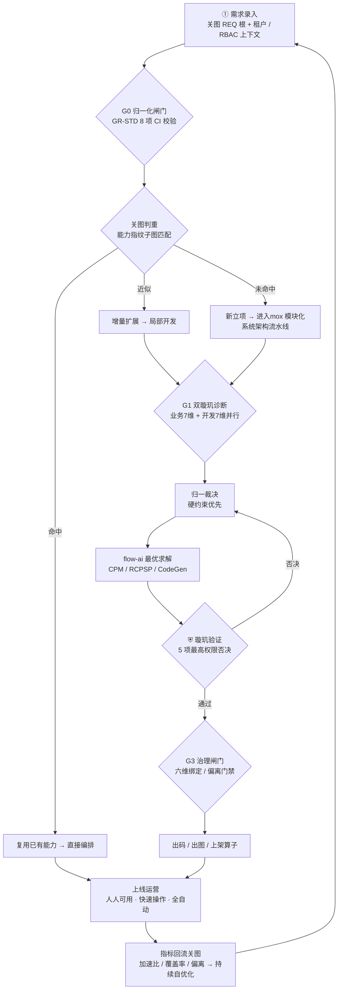

# 产品规范标准 · 人人爱用 · 快速操作 · 全自动处理 · mox 模块化系统架构覆盖

> **文档类型**：企业级产品规范标准（Product Specification Standard，最高优先级产品契约）
> **文档版本**：v1.0 (ENT-PROD-STD) · 最后更新 2026-08-18
> **统摄关系**：本标准是产品的**体验与覆盖契约**，向下统摄 `14-mox 模块化系统架构愿景核心架构与业务流程总纲`（方法论）、`01-requirements`（需求）、`02-architecture`（架构）、`AA-STD-V1.0`（mox 模块化系统架构需求流程）、`GR-STD-V1.0`（关图）、`PT-STD-V1.0`（六维绑定）。
>
> **一句话定位**：让系统的**每一个功能**都经过**mox 模块化系统架构（双璇玑十四维 × 六维绑定）**打磨、由 AI **全自动**跑通从需求到上线的流水线，而人类只做价值判断；产品做到**人人爱用、操作极快、全程无感自动化**。

---

## 0 · 总结：我们已经建好的企业级底座

| 已落地资产 | 状态 | 说明 |
|------------|:--:|------|
| 关图 `GR-STD-V1.0`（高维需求关系图） | 🟢 权威 | `G=(N,E)`，12 类节点 / 7 类边（＋`Bind` 六维绑定），CI 门禁 8 项，覆盖率 96.6%，372 节点 / 751 边 |
| 六维绑定 `PT-STD-V1.0`（`REQ→FUN→BIZ→ALG→TSK→COD`） | 🟢 权威 | `primiflow-fusion` Registry + TraceMatrix，六维零孤儿、连通 REQ |
| mox 模块化系统架构需求流程 `AA-STD-V1.0`（四闸门 S1–S8） | 🟢 权威 | 归一化闸门 G0 → 双璇玑诊断 G1 → ⛨验证 G2 → 治理闸门 G3 |
| 双璇玑十四维并行诊断 | 🟢 已验证 | 业务 7 维 + 开发 7 维，`run_experts` rayon 真并行，归一化裁决（硬约束优先） |
| flow-ai 已验证最优求解 | 🟢 已验证 | CPM / RCPSP / Dijkstra / 冲突修复 / CodeGen，加速比 ≥ 2.32× |
| ⛨ 璇玑验证网关（最高权限否决） | 🟢 已验证 | 5 项检查，任一阻断级失败即否决 |
| 质量与测试证据 | 🟢 已验证 | 644 passed / 0 failed，clippy 0 warning，`allow(dead_code)` 29→8，RBAC 11 探针 + 5 E2E |

> 本次在底座之上，把"**愿景**"收敛为"**人人可遵守的产品规范标准**"，给出可测的体验与覆盖指标，并附**需求业务流程图**与**mox 模块化系统架构功能覆盖矩阵**。

---

## 1 · 产品规范标准 · 十大原则（P1–P10）

> 原则分三层：**体验层（人人爱用）**、**效率层（快速操作）**、**智能层（全自动 + mox 模块化系统架构）**。每条均为产品契约，验收见 §5。

### 体验层 · 人人爱用

- **P1 零学习成本**：一句话入口、中文优先、术语即业务语言；任何角色（管理员/协调者/专家/成员/审计）开箱即用，无需培训。
- **P2 无障碍与一致**：桌面 / Web / 移动视觉与交互一致；满足基础无障碍（对比度、键盘可达、语义标签）。
- **P3 容错友好**：草稿自动保存、危险操作二次确认、错误给可执行的修复建议，绝不丢用户输入。

### 效率层 · 快速操作

- **P4 极速响应**：核心操作端到端 < 200ms（P95）；长任务异步化并实时可见进度（事件总线 → WebSocket 推送）。
- **P5 键盘优先 / 一键完成**：命令面板（⌘K）覆盖 90% 高频动作；一键完成"录入即归一化、点击即判重、确认即出码"。
- **P6 批量与模板**：支持批量录入、批量裁决、模板复用；重复动作零重复输入。

### 智能层 · 全自动 + mox 模块化系统架构

- **P7 全自动处理**：需求接入后 **S1–S8 全链路 AI 自动跑通**（归一化 → 判重 → 双璇玑诊断 → 裁决 → 求解 → ⛨验证 → 治理 → 出码出图），人类仅在**关键裁决点**介入（G1/G2/G3 的阻断级分歧）。
- **P8 mox 模块化系统架构覆盖**：系统**每一个功能**都必须过**双璇玑十四维**（业务 7 + 开发 7）诊断，且具备 `REQ→FUN→BIZ→ALG→TSK→COD` 六维绑定与可追溯链（见 §4 矩阵）。**无孤儿、无断链、无未覆盖功能**。
- **P9 唯一事实基准**：关图 `GR-STD` 为需求与功能关系的**唯一真相源**；所有描述互链（Doc→Doc、REQ→CODE），先判重后立项，杜绝重复造轮子。
- **P10 持续自优化**：每轮产出的指标与算子回流关图，驱动下一轮架构与算法更优（⛨验证 + G3 治理 + 关图漂移门禁闭环）。

---

## 2 · 需求业务流程图（Requirements Business Flow）

> 需求从"录入"到"人人可用"的全生命周期业务流。每道闸门都可机读、可阻断；判重在前，立项在后。

**流程要点**
1. **录入即有根**：每条需求先在关图落 `REQ` 根（D01~D13 / R01~R08），带租户与 RBAC 上下文。
2. **先判重后立项**：关图即"能力指纹库"，子图匹配命中→复用、近似→增量、未命中→才立项（P9，杜绝重复开发）。
3. **mox 模块化系统架构诊断**：立项后双璇玑十四维并行诊断，硬约束（权限/资源/安全/数据/安全代码）一票优先。
4. **全自动求解与验证**：flow-ai 求解 → ⛨最高权限否决 → G3 六维治理 → 出码出图，全程无人工搬运。
5. **上线即回流**：运营指标回流关图，形成持续自优化飞轮（P10）。

---

## 3 · mox 模块化系统架构需求业务处理主流程（引擎视角，与 AA-STD 对齐）

| 阶段 | 动作 | 强制闸门 | 主要承载 crate |
|------|------|----------|----------------|
| S1 需求接入 | 关图 REQ 根 + Bind 六维骨架 | — | `kg-hub` / `business-catalog` |
| G0 归一化闸门 | GR-STD 8 项校验 | 阻断 | `kg-hub` |
| S2 归一化 | 产出归一化 IR | — | `mox-expert` |
| S3 双璇玑诊断 | 14 专家并行 run_experts | — | `mox-expert` |
| G1 裁决闸门 | 硬约束优先归一裁决 | 阻断 | `mox-expert` |
| S5 flow-ai 求解 | CPM/RCPSP/CodeGen | — | `flow-ai` / `optimizer` |
| S6 ⛨璇玑验证 | 5 项最高权限检查 | **最高否决** | `mox-expert` |
| G3 治理闸门 | 六维绑定 / 偏离门禁 | 阻断 | `primiflow-fusion` |
| S8 出码出图 | 出码 / 出图 / 上架算子 | — | `primiflow` / `template-market` |

---

## 4 · mox 模块化系统架构功能覆盖矩阵（15 crate × 双璇玑十四维 + 六维绑定）

> **读法**：每一行是系统的一个功能/能力（对应 15 个 crate）；列是双璇玑十四维（业务 7 + 开发 7）与六维绑定。`✅`=已覆盖且已验证，`🟡`=部分/在建，`⚪`=标准要求的待建项。
> **标准铁律（P8）**：发布态功能必须是**全列 ✅**；任一 ⚪ 即为"未覆盖功能"，禁止上线。

| 功能 / crate | 六维绑定 | 业务7 | 开发7 | 成熟度 |
|--------------|:--:|:--:|:--:|:--:|
| `mox-system` 协作治理（成员/任务/权限/通信） | ✅ | ✅ | ✅ | ✅ 成熟 |
| `mox-expert` 双璇玑融合治理引擎 | ✅ | ✅ | ✅ | ✅ 成熟 |
| `flow-ai` 最优求解引擎（CPM/RCPSP/CodeGen） | ✅ | ✅ | ✅ | ✅ 成熟 |
| `primiflow-fusion` 六维绑定 Registry / TraceMatrix | ✅ | ✅ | ✅ | ✅ 成熟 |
| `primiflow` 流程编排内核 | ✅ | ✅ | ✅ | ✅ 成熟 |
| `operator-core` 算子核心 | ✅ | ✅ | ✅ | 🟡 在建 |
| `operator-graph` 算子图 | ✅ | 🟡 | ✅ | 🟡 在建 |
| `operator-wasm` WASM 算子沙箱 | ✅ | ✅ | 🟡 | 🟡 在建 |
| `optimizer` 优化器 | ✅ | ✅ | ✅ | 🟡 在建 |
| `kg-hub` 知识图谱枢纽（关图底层） | ✅ | ✅ | ✅ | ✅ 成熟 |
| `business-catalog` 业务目录（能力注册） | ✅ | ✅ | ✅ | ✅ 成熟 |
| `template-market` 模板市场（算子上架复用） | ✅ | ✅ | 🟡 | 🟡 在建 |
| `hermes-flow-bridge` 流程桥接 | ✅ | 🟡 | ✅ | 🟡 在建 |
| `ai-agent` AI 智能体 | ✅ | 🟡 | 🟡 | ⚪ 规划 |
| `runtime` 运行时聚合 | ✅ | ✅ | ✅ | ✅ 成熟 |
| `tools/info-graph` + `guantu_gate.py` 关图工具/门禁 | ✅ | ✅ | ✅ | ✅ 成熟 |

> **双璇玑十四维图例**：业务 7 = 业务 / 算法 / 权限 / 资源 / 安全 / 数据 / 可观测；开发 7 = 架构 / 安全代码 / 代码质量 / 性能 / 测试 / 文档 / 可维护性。
> **注**：矩阵中的"业务7 / 开发7"为整列聚合标记；逐维细项见 `14-mox 模块化系统架构愿景核心架构与业务流程总纲.md` §5.2 专家矩阵。未达全 ✅ 的 crate 由 `G3 治理闸门` 与 `关图漂移门禁` 持续收敛至发布标准。

---

## 5 · 验收标准（可测指标）

| 维度 | 指标 | 目标 | 对应原则 |
|------|------|------|----------|
| 人人爱用 | 新角色首任务完成率（无引导） | ≥ 90% | P1/P2 |
| 人人爱用 | 危险操作 0 数据丢失 | 100% | P3 |
| 快速操作 | 核心操作 P95 时延 | < 200ms | P4 |
| 快速操作 | 高频动作命令面板覆盖率 | ≥ 90% | P5 |
| 快速操作 | 批量/模板复用可用功能占比 | ≥ 80% | P6 |
| 全自动 | 需求→上线人工介入点 | 仅 G1/G2/G3 阻断级分歧 | P7 |
| 全自动 | S1–S8 全链路自动率 | ≥ 95%（非阻断场景） | P7 |
| mox 模块化系统架构 | 系统功能双璇玑十四维覆盖率 | 100% | P8 |
| mox 模块化系统架构 | 六维绑定零孤儿 / 连通 REQ | 100% | P8 |
| 唯一基准 | 新需求先判重率 | 100%（命中即复用/增量） | P9 |
| 持续自优化 | 指标回流关图闭环时延 | < 1 周期 | P10 |
| 质量 | 测试回归 | 0 error / 0 fail | 底座 |

---

## 6 · 向下统摄与权威落点

| 主题 | 权威落点 |
|------|----------|
| 愿景 / 方法论 | `14-mox 模块化系统架构愿景核心架构与业务流程总纲.md`（ENT-CHARTER-V1.0） |
| 需求 | `01-requirements.md` |
| 架构（七视图 + ADR） | `02-architecture.md` |
| mox 模块化系统架构需求流程（四闸门） | `璇玑-mox 模块化系统架构需求业务处理流程图-归一化企业级.md`（AA-STD-V1.0） |
| 关图 | `specs/GR-STD-信息关联关系图开发规范-V1.0.md` |
| 六维绑定 | `specs/PT-Primi-架构规范-V1.0-完整版.md` + `crates/primiflow-core/trace_matrix.md` |
| 文档治理 | `00-INDEX.md` |

---

*本标准是企业级产品的体验与覆盖契约：人人爱用、操作极快、全自动、mox 模块化系统架构无死角。任一层均可机读、可复核、可阻断。*
