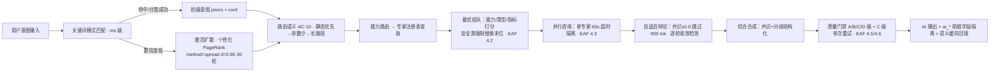

# 璇玑 RelGraph · 企业级全域顶层总设计 V1.0（TOP-MASTER · ENT · 三联盟模式）

> **文档身份**：唯一顶层设计权产物 · 唯一路径决策基准 · 唯一结构规划权威源 · 最高调度权责声明  
> **标准编号**：ENT-CHARTER-TOP-MASTER-V1.0  
> **版本**：v1.0 (ENT) · 最后更新 **2026-08-23**  
> **权威等级**：🟢 **最高级**（统摄 `enterprise/00~17` 全部文档；任何修改变更必须走 ADR 申请流程，见 §十二）  
> **承载底座（四足鼎立）**：  
> - `docs/specs/GR-STD-信息关联关系图开发规范-V1.0.md`（关图建模法，§三）  
> - `docs/specs/PT-Primi-架构规范-V1.0-完整版.md`（六维物理绑定，§3.2 骨架链）  
> - `docs/璇玑-mox 模块化系统架构需求业务处理流程图-归一化企业级.md`（AA-STD-V1.0，融合域需求事实基准，§四）  
> - `docs/standards/expert-alliance-flow-standard.md`（EAF-STD-V1.2，专家联盟流程，§四.4 + §五.二）  
> **产品手册（对外介绍）**：`docs/mox-relgraph-product-handbook-v3.md`（本文件为顶层设计，对外宣讲以产品手册为准，两者若有冲突以本文件的架构硬约束部分为最终裁决）  
> **事实基线（已验证）**：Rust workspace 全绿（649 passed / 0 failed / 6 ignored）、企业级 129 GREEN 零回归、T13 SLO 规模锚（100W 节点 3 跳 P95 ≤ 420ms）、T14 HA 故障注入（kill-2 × 200 CRC 100% = RPO=0）。  
> **变更记录**：
> - v1.0 ENT · 2026-08-23 · TOP-MASTER 首次发布，依据 `ENT-SPEC-TOP-MASTER-V1.0`（spec.md §4 FR-2）。

---

## 一、顶层核心使命（全域归一化总纲领）

### 1.1 产品唯一北极星（一句话，永不漂移）
**璇玑 RelGraph = 以 Rust 自研高性能知识图谱为唯一中枢的「需求 ↔ 架构 ↔ 业务流程 ↔ 模块 ↔ 算法 ↔ 文档 ↔ 本地代码」七维归一化关联与自动化治理系统。**

所有模块、流程、算法、代码 **只能围绕这颗北极星生长**；产品联盟、算法联盟、开发联盟 **全部以本文件作为唯一最高调度基准**；不允许游离主题的"功能堆砌"，不允许未经 ADR 的越权修改变更。

内部副品牌（同义，仅作内部叙述别名，不作为对外定名）：
- **OUS**（Operator Unified System，算子统一系统，Rust 内部工程品牌）
- **关图**（信息关联关系图，GR-STD 的中文简称，图谱层内部叙述）

### 1.2 九大落地标准（企业级硬约束矩阵，任何版本升级不得削弱）

| # | 维度 | 定义 | 验收度量（可测） |
|---|---|---|---|
| ① | **企业级标准化** | 每一功能有 FR 编号 + 测试断言 + 文档映射 | `docs/enterprise/00-INDEX.md` 覆盖率 ≥ 95%（现状 96.6%） |
| ② | **工程化** | Controller → Service → Repository 分层零越层 | `CLAUDE.md` §架构约束 100% 通过；无 handler 直写 SQL |
| ③ | **结构化** | 所有模块独立 crate / 独立前端视图组；可插拔可独立迭代 | workspace members 单一职责唯一；15+1 crate 零共享代码 |
| ④ | **可落地** | 任一子系统可单独执行独立回归 | `cargo test -p <crate>` 全绿；`npm run build` 0 error；`tools/info-graph` 独立可跑 |
| ⑤ | **可迭代** | 变更必同步图谱；图谱每次更新必过 CI 8 项门禁（GR-E1~E8） | 漂移 drift = 0 阻断；低于覆盖率护栏 90% 一律阻断发布 |
| ⑥ | **可商用** | RBAC / 审计链 / 多租户分层 / SLA / HA 五件套齐全 | 12-RBAC 全链路闭环、T13 SLO 8 条、T14 HA 15 条 全 GREEN |
| ⑦ | **可开源** | 开源版全部核心能力 0 外部依赖跑通 12 套件 | MemoryProvider 后端 12 套件全绿（可直接本地 `npm test` 验证） |
| ⑧ | **可规模化** | 算法增量 + 分片 + 统一 CDC | 100W 节点 3 跳 P95 ≤ 420ms；变化边 ≤10% 增量 CNM/PR 不重算整图 |
| ⑨ | **归一化** | 「一切皆是项目」，8 大项目 / 24 领域 / 17 引擎 全入图 | 节点族 14 类 + 边族 19 类齐全（见 §三）；任一实体可溯源至项目节点 |

### 1.3 事实基线声明（本文件所有结论均基于以下已验证事实）

| 事实 | 载体（溯源路径） |
|---|---|
| 双璇玑十四维维度模型（业务 7 + 开发 7）已代码化落地 | `platform/domains/mox-expert/src/experts/{business,algorithm,permission,resource,security,data,observability,architecture,security_code,code_quality,performance,testing,documentation,maintainability}.rs`（参见 `docs/enterprise-architecture-analysis.md` §2） |
| ⛨璇玑验证网关 + 治理 8 闸门（G1~G8）+ 归一化裁决 reconcile | `platform/domains/mox-expert/src/verify/mod.rs` + `platform/domains/primiflow-fusion/src/unified.rs::full_gate` + `platform/domains/mox-expert/src/reconcile.rs` |
| 图谱算法归一（CNM / Brandes / Harmonic / PR 转置 / 激活扩散） | `platform/domains/graph-algorithms/src/lib.rs` + `platform/backend-node/src/lib/graph-algos.js` + 对账脚本 `platform/domains/graph-algorithms/scripts/reconcile_7x8.js`（Δ≤1e-6 已锁定） |
| 统一 AI 路由 4 端点 + 路由语义 AC-10 | `platform/gateway/runtime/src/routes/ai_engine.rs` + `platform/gateway/runtime/src/ai_router.rs`（静态优先 → 参数段少优先 → 同参数长路径优先） |
| 多后端持久化（SQLite / PostgreSQL / MySQL 零代码切换 + fail-fast） | `platform/domains/mox-system/src/repo/{sqlite,postgres,mysql,schema}.rs` + `platform/domains/mox-system/src/persistence_provider.rs` |
| 多专家联盟六阶段（意图→组队→并行咨询辩论→合成→门禁→学习） | `platform/backend-node/src/expert-alliance/**` + `docs/standards/expert-alliance-flow-standard.md`（SSE 流式 + 重试闭环 + 降级链 #1） |
| 算子内核：6 大公理 + 范畴论 + 希尔伯特空间 + 单子 + 守恒律 | `platform/domains/operator-core/src/{category,monad,conservation,state,kernel,kernel_ext}.rs` |

---

## 二、产品全局架构（六层金字塔 · 向下唯一依赖）

```mermaid
graph TD
    subgraph L6 [L6 产品应用层 · 用户端统一 frontend-ui 单应用]
        A1[PortalHome / Dashboard 工作台入口]
        A2[GraphView · FlowGraph · MoxFusionView 图谱与融合]
        A3[Projects / Tasks / Workflows / Workbench 工作域]
        A4[ExpertCenter / Orchestrator / Enterprise 专家域]
        A5[Chat / AlgoLab / InfiniteOptimizer / LLM / KB AI 域]
        A6[Market / Resources / Docs / Plugins 资产域]
        A7[Operators / Mcp / Automation / BotCenter / Browser 开发操作域]
        A8[Login / BusinessHall / Caomei / Monitor / Melody2Score 辅助域]
        A9[AdminView · 5 面板 访问/审计/HITL/存储/总览 管理域]
    end

    subgraph L5 [L5 业务流程层 · 10 标准闭环 BP-01~10]
        B1[BP-01 需求接入 · P9 判重闸门 · M4 子图匹配]
        B2[BP-02 图谱构建 · 先节点后边 RAW · GR-E1~E8 门禁]
        B3[BP-03 业务解析 · AA-STD → 归一化 IR PTDoc/FlowGraph]
        B4[BP-04 模块拆分 · CNM 社区 + Brandes 介数 → 域边界]
        B5[BP-05 算法推理 · 两级意图 → RRF → 双专家辩论]
        B6[BP-06 代码关联 · AST 提取 → CodeEntity 绑定]
        B7[BP-07 测试验证 · ⛨验证 5 项 + G1~G8 + 基线]
        B8[BP-08 优化迭代 · CEM 寻优 + 金丝雀 + 图谱反向同步]
        B9[BP-09 资产沉淀 · template-market + 版本状态机 + 审计链]
        B10[BP-10 变更治理 · CDC 12 事件键 + 三路失效 + DLQ 5min 对账]
    end

    subgraph L4 [L4 知识图谱核心层 · 璇玑心脏]
        C1[kg-hub · ingest 摄入 / ontology 本体 / reason 推理 / govern 治理 / loop_engine 循环]
        C2[graph-algorithms · CNM / Brandes / Harmonic / PR(转置) / activateSpread / RAW 展开]
        C3[Nebula Adapter + RemoteGraphDriver + L1 Redis 邻接缓存 + Postgres 实体表]
        C4[统一 CDC 事件总线 · 12 事件键契约 + DLQ 对账]
    end

    subgraph L3 [L3 算法推理层 · 璇玑融合 + 专家联盟 + CEM]
        D1[mox-expert · 双璇玑 14 维 / reconcile 裁决 / ⛨验证 / 审计链]
        D2[expert-alliance · 意图分类器 / 匹配 / 辩论合成 / 学习技能]
        D3[flow-ai · 拓扑 / 数据流 / CPM / RCPSP / 伪依赖剪除 / 冲突 / CodeGen]
        D4[optimizer · CEM 交叉熵 + 资源约束调度（σ̄<0.06 或 3 轮无改进停）]
        D5[primiflow-fusion · 治理 G1~G8 + 六维绑定 + 注册落库]
    end

    subgraph L2 [L2 Rust 自研工程底座 · 唯一真相源]
        E1[mox-common-meta · 共享元 & 常量]
        E2[operator-core + operator-wasm · 算子内核 + WASM 沙箱]
        E3[mox-system · 协作治理（成员/任务/RBAC/审计/3 方言）]
        E4[primiflow-core · PrimiFlow 执行器 + 持久化]
        E5[hermes-flow-bridge · 外部系统录制/回放/桥接]
        E6[business-catalog · 螺旋业务目录]
        E7[template-market · 算子商城（需求+流程图资产包）]
        E8[storage-engine 📋 · StorageProvider 3 后端 + ChunkBackend FS/S3（归一 CDC）]
        E9[platform/gateway/runtime · Axum 聚合网关 / routes / handlers / RBAC 中间件 / Sidecar]
    end

    subgraph L1 [L1 部署运维层 · 存储抽象 + 对象抽象 + Sidecar]
        F1[StorageProvider · Memory / SQLite / PostgreSQL+Citus（分片键 project_domain 哈希）]
        F2[ChunkBackend · 本地 FS / S3 / MinIO EC:4+2（可容忍 2 节点掉线）]
        F3[Edge Node Sidecar · 静态托管 frontend-ui/dist + /api 反代 + 本地降级兜底]
        F4[Rollout 金丝雀 1/10/50/100 · 30s 回滚 · 预热三步 PR-hot / 语义 seeds / L1 邻接]
        F5[Helm3 / Kustomize / systemd / Playwright E2E · 交付底座]
    end

    %% 层级连线（向下唯一依赖）
    L6 --> L5
    L5 --> L4
    L4 --> L3
    L3 --> L2
    L2 --> L1
```

### 2.1 层级职责边界 + 依赖关系 + 输入输出

| 层 | 职责边界（Owner） | 依赖 | 输入 | 输出 |
|---|---|---|---|---|
| L6 产品应用层 | 用户交互 + 管理台；组件不直接 `fetch`，所有请求经 `frontend-ui/src/api/index.js` 统一 fetcher | L5 的 API 契约 / OpenAPI | 用户动作、鉴权 Token、筛选偏好记忆 | REST 响应 + SSE/WebSocket 流 |
| L5 业务流程层 | 10 BP 流程编排主入口（三流程端点 graph_bulk / file_upload+link / ai_full_rag）；不做算法本身 | L4 图谱 + L3 裁决 + L2 治理闸 | 归一化 IR / FlowGraph / 用户意图 ID | 三流程端点响应 + 审计事件签名 + trace_id |
| L4 知识图谱核心层 | 节点、边、算法的唯一真相源；自动布局增量计算；CDC 事件广播 | L2 的存储 / L3 算法调用的结果回写 | Node Upsert / RAW Edge / Query / 事件订阅 | 图谱视图 + 算法矩阵 + 节点血缘 + CDC Event |
| L3 算法推理层 | 双璇玑诊断 / 专家联盟 / CEM / 最优求解；输出唯一解（裁决器不求解，求解 = flow-ai，HC） | L4 图谱 + L2 算子内核 + L1 资源配额 | 归一化 IR / 已着色 FlowGraph | `ReconciledPlan` / `GovernanceReport` / ⛨ vetoed 信号 |
| L2 Rust 底座层 | 所有 Rust crate 的唯一聚合层；所有业务路由的真实执行业务实现（controller 只调此层，禁止越层） | L1 持久化 + 运行时依赖 | HTTP 请求 / 配置 / 数据库连接 | `operator-server` 单一二进制（聚合 8 子服务） |
| L1 部署运维层 | 存储/对象/底座；不做领域逻辑；只做抽象接口 + 健康 + 交付 | 环境变量 / K8s ConfigMap / 凭据 | 二进制 + helm chart + 参数 | 运行实例 + metrics + 就绪探针 + 灰度权重 |

### 2.2 层级铁律（强制执行，违反 = 治理闸门 G3 Blocked）

1. **只能上层调用下层**：禁止 L2 反向依赖 L4/L5；禁止 L5/L6 直接写 SQL（越层）。
2. **禁止侧链**：所有跨模块调用必须经 L2 聚合网关 runtime，不允许 crate 间直接调用未经 `subservers.rs` 注册的私有接口。
3. **向下单向兼容**：下层接口变更是上层升级的充分条件；上层新增能力不得强迫下层破坏兼容（参见 §十一 五年兼容承诺）。

### 2.3 与现有 crate 的精确映射（路径与代码事实一致，零老化描述）

| 逻辑模块 | 实际 crate / 目录路径 | 说明 |
|---|---|---|
| 聚合网关（Controller 层唯一） | `platform/gateway/runtime/`（Cargo workspace member） | routes / handlers / sidecar / rbac_middleware / openapi / api_standard |
| 共享元 & 常量 | `platform/domains/mox-common-meta/` | crate_id 唯一性、lookup、版本常量 |
| 算子内核 + WASM | `platform/domains/operator-core/` + `platform/domains/operator-wasm/` | 范畴论/守恒律/希尔伯特/单子 + 热加载插件 |
| 图算法归一 | `platform/domains/graph-algorithms/` | 导出公式 `export_formula.rs` + 对账 reconcile_7x8.js |
| 图谱中枢 | `platform/domains/kg-hub/` | api / ingest / ontology / govern / loop_engine / urn |
| 通用优化器（CEM） | `platform/domains/optimizer/` | RCPSP + CEM 统一接口 |
| 流程 AI（CodeGen 等） | `platform/domains/flow-ai/` | pipeline / topology / schedule / conflict |
| AI Agent（对话/工作流/浏览器自动化） | `platform/domains/ai-agent/` | conversation / workflow_engine / llm_client / plugin_bus |
| 璇玑融合引擎 | `platform/domains/mox-expert/` | experts(14) + verify(5) + govern + reconcile + audit + rbac + flow_loader |
| 璇玑协作治理域 | `platform/domains/mox-system/` | services / orchestrator / rbac / repo(3 方言) / crypto / event / metrics |
| PrimiFlow 执行与持久化 | `platform/domains/primiflow-core/` | executor / runner / persistence / gen(C1~C8) |
| PrimiFlow 融合（8 闸门） | `platform/domains/primiflow-fusion/` | unified.rs full_gate G1~G8 + sixdim + ptdoc + platform |
| 外部流桥接 | `platform/domains/hermes-flow-bridge/` | bridge + router + recorder + plugin + state |
| 螺旋业务目录 | `platform/domains/business-catalog/` | spiral.rs + catalog bin |
| 模板市场（算子商城） | `platform/domains/template-market/` | 资产包（需求+流程图+功能点）上架、克隆、版本 |
| 存储归一（📋 规划中） | `platform/domains/storage-engine/` | ADR-DOC-003：统一 StorageProvider + ChunkBackend + CDC（现状功能在 backend-node 物理实现，规划中迁移） |
| 边缘入口（现状） | `platform/backend-node/` | ADR-DOC-005：规划中改名为 `platform/edge-node/`，仅保留 4 文件：server / proxy / degrade / static（瘦身） |

---

## 三、全域知识图谱总设计（璇玑心脏 · 统一建模法）

### 3.1 八层分区（L0 全域治理 → L7 代码实体，共 8 层）

| 层编号 | 层名 | 节点族（entity_type 全集） | 项目锚点 |
|---|---|---|---|
| L0 | 全域治理层 | **Project, Domain, Engine, Release, Milestone, Member** | 8 Projects × 24 Domains × 17 Engines 全部注册；M0~M8 九里程碑；Member → Project 绑定 RBAC |
| L1 | 需求域 | **Requirement, UserStory, AcceptanceCriteria, FR, NFR, ADR** | REQ 根 D01~D13 / R01~R08；BR-01…BR-21；ADR-DOC-001~012 |
| L2 | 架构域 | **Component, Interface, Deployment, ADR(架构版), Layer, Crate** | 15+1 Rust crate 映射；六层金字塔每层为 Layer 节点；接口契约 OpenAPI |
| L3 | 业务流程域 | **Workflow, Step, TraceTarget, BusinessRule, FlowDomain** | W→S→T 三跳 BFS 可达强制；10 BP 每条 = 1 Workflow 节点 + Step 节点集 |
| L4 | 模块算子域 | **Module, Operator, Plugin, Skill, Capability, RegisteredPipeline** | registered_plugins.json / operators.json 17 个 / modules.json |
| L5 | 算法模型域 | **Algorithm, Model, Dataset, Formula, Metric, BenchmarkTask** | 8 大算法家族 + 统一评估公式 + 7 类基准任务（数学/逻辑/知识/代码/中文/时效/指令） |
| L6 | 文档资源域 | **Doc, File, Source, Section, Evidence** | docs/** 全量；guantu.req.json；graph.mmd；evidence 必挂每条边 |
| L7 | 代码实体域 | **CodeModule, CodeFile, Function, Class, Struct, Enum, Trait, ImplBlock, ASTNode** | 通过 project-atlas 代码扫描器 + AST 抽取，绑定 L5→L7 |

### 3.2 统一归一关联边（19 边族）

#### 3.2.1 核心骨架链（PT-STD 六维绑定 + 端到端追溯，强制作图时必须连出）
```
Requirement --[implemented_by]--> Component --[orchestrated_by]--> Workflow
   --[uses]--> Operator --[realized_by]--> Function(CodeEntity) --[documented_by]--> Doc
```
跨层关联通过 **RAW 双向边** 展开（HC-3），杜绝度中心性计算错误。

#### 3.2.2 19 边族的完整注册清单

| 边族 ID | 边名（relation） | 语义 | 必须带 evidence | 典型连接方向 |
|---|---|---|---|---|
| EB-01 | `implemented_by` | 需求由某组件/模块实现 | 是 | Requirement(L1) → Crate/Component(L2) |
| EB-02 | `orchestrated_by` | 组件执行由某工作流编排 | 是 | Component(L2) → Workflow(L3) |
| EB-03 | `uses` | 工作流使用某算子/能力 | 是 | Workflow(L3) / Step(L3) → Operator/Capability(L4) |
| EB-04 | `realized_by` | 算子在某代码实体中实现 | 是 | Operator(L4) → Function/CodeFile(L7) |
| EB-05 | `documented_by` | 代码/算法/组件由哪份文档说明 | 是 | Any(L2-L7) → Doc/Section(L6) |
| EB-06 | `bind` | PT-STD 六维绑定（REQ→FUN→BIZ→ALG→TSK→COD） | 是（六维绑定证据） | L1 → L2 → L3 → L5 → L3(Task) → L7 |
| EB-07 | `call` | 代码 A 调用代码 B | 是（行号） | Function(L7) → Function(L7) |
| EB-08 | `read_write` | 步骤/代码读写数据实体 | 是（R/W 方向） | Step(L3)/CodeEntity(L7) → Data/Dataset(L5/L3) |
| EB-09 | `reference` | 文档引用另一文档/需求 | 是（锚点） | Doc(L6) → Doc(L6) / Requirement(L1) |
| EB-10 | `dependency` | 组件/模块依赖另一组件/插件 | 是（版本） | Crate(L2) → Crate(L2) / Plugin(L4) |
| EB-11 | `inheritance` | 类/结构的继承或特化 | 是 | Class/Struct(L7) → Class/Struct(L7) |
| EB-12 | `config_ref` | 某模块引用了配置项或密钥 Schema | 是（JSON Schema 路径） | Crate(L2) / Plugin(L4) → Config / Shared Schema |
| EB-13 | `deploy` | 某组件部署到某环境节点 | 是（版本 SHA） | Component(L2) → Deployment(L2) / Release(L0) |
| EB-14 | `has_instance` | 抽象算法在代码中有实例实现 | 是（绑定函数名） | Algorithm(L5) → Function(L7) |
| EB-15 | `tested_by` | 需求/组件被哪组测试覆盖 | 是（测试文件路径） | Requirement(L1) / Crate(L2) → Test / CodeFile(L7) |
| EB-16 | `audited_by` | 某组件/流程被哪套审计链监控 | 是（审计汇路径） | Workflow(L3) / Crate(L2) → AuditSink(mox-expert audit/*) |
| EB-17 | `optimized_by` | 某组件/流程被哪轮 CEM 寻优优化 | 是（CEM run id） | Crate(L2) / Workflow(L3) → Algorithm=CEM(L5) |
| EB-18 | `governed_by` | 某节点受哪些治理闸门控制 | 是（G1~G8 规则 id） | Any → primiflow-fusion 闸门 G1~G8 |
| EB-19 | `aligned_with` | 节点对齐到了哪个需求根（偏离治理） | 是（BFS 命中 id） | 核心实现节点(L2/L7) → Requirement 根(L1) |

### 3.3 构建与校验硬规则（5 条 + 覆盖率护栏，违反 = GR-E 阻断）

1. **R1 · 先节点后边（HC-12）**：构建图谱必须严格按 `Node upsert → byId.has 判定存在性 → RAW 双向边逐对展开`；若目标节点不存在，**必须返回 `missing=[node_id…]` 且禁止静默丢边**（空丢 = 判 GR-E2 悬空边）。
2. **R2 · 边必带 evidence**：每条边必须携带 `evidence = { source_type, source_path, line_or_anchor, author_id, created_at }`；未带 evidence 的边视作"未证实关系"，写入时打 `status=unconfirmed`，并在 CI 中记 GR-E3 阻断。
3. **R3 · CI 8 项门禁（GR-E1 ~ GR-E8，非零即阻断）**：
   - GR-E1：图谱非空（节点数 > 0 且 至少存在 1 个 REQ 根）
   - GR-E2：无悬空边（所有边 from/to 都能 byId 命中）
   - GR-E3：无重复 id（节点 id / 边 id 全局唯一）
   - GR-E4：所有边带 evidence（未证实不算通过）
   - GR-E5：核心节点无孤儿（从 REQ 根 BFS 可达 ≥ 99% 的核心 Crate/Workflow/Operator/Function 节点）
   - GR-E6：无未建模隐性依赖（按 crate Cargo.toml + frontend package.json 依赖表与 dependency 边对差集，差集为空）
   - GR-E7：文档引用全部有效（reference 边指向的 Doc/Section 节点存在）
   - GR-E8：sync 漂移 = 0（代码变更后，上次图谱快照 vs 代码 AST 重扫结果的漂移度为 0；> 0 阻断合并）
4. **R4 · 偏离检测（GR-E6 特例）**：以 REQ 根为根做无向可达性 BFS，任何"核心实现节点不可达 REQ 根" → 记录偏离信号 `aligned_with` 边缺失，输出偏离数、覆盖率%、建议修复的 node_id 集合。
5. **R5 · 覆盖率护栏（绝对下限）**：对齐覆盖率 = 已对齐核心节点 / 核心节点总数 ≥ **90.0%**（现状 96.6%），低于护栏一律阻断出码/发布。

> 实现锚点：`tools/info-graph`（`Cargo.toml` + `src/main.rs`）提供 `dedup / sync / query / export / import / coverage` 子命令；CI 门禁由 `tools/guantu_gate.py` 调用 info-graph 统一执行。

---

## 四、全业务流程标准化设计（10 条闭环 · 唯一业务执行标准）

> 10 BP 的三流程端点对外统一暴露 = **graph_bulk（BP-02/09）/ file_upload + link（BP-06/02）/ ai_full_rag（BP-05/03/08）**。任何新增业务不得绕开这 10 BP，若真的需要，必须先在 01 需求文档中新增 BP-11 并登记 ADR。

### 通用 6 字段（每条流程必齐）
每条流程卡包含：**①输入契约**（类型 + 必填字段 + 幂等 key）；**②状态机**（≥3 状态 + 初始/终态 2 个 Success/Blocked）；**③异常分支**（≥3 条 + 重试策略 + 降级链 #n）；**④终态**：Success(含产物 id + trace_id) / Blocked(含 gate 原因 + 修复建议)；**⑤审计事件签名**（事件名 + HMAC 签名算法 + 写汇 ID）；**⑥SLA 目标**（P50 / P95 / 最大资源配额 / 超时阈值）。

---

#### BP-01 · 需求接入（新诉求三分支 · P9 判重闸门）
- **①输入契约**：`{ idempotency_key, title, description, author_id, attachments[]?, priority?, tags[] }`（幂等 key = SHA256(title + author_id + 描述前 512 字)）
- **②状态机**：New → Deduping → Matched / Incremental / NewProject（三分支）→ Registering → Success 或  Blocked。≥ 5 状态。
- **③异常分支**：
  - E1 入图失败（kg-hub 写入超时）：指数退避 3 次重试，3 次失败降级为离线队列并告警。
  - E2 子图匹配引擎异常：降级到关键词相似度判重并在 trace 中标记 `dedup_method=keyword_fallback`。
  - E3 新需求与现有需求冲突（优先级不一致 / 绑定模块权限不足）：BP-01 立即跳转 Blocked，并产出 `conflict_report` → 产品联盟 Blocking 信号返回。
- **④终态**：Success = { project_id, req_root_id, matched_node_ids?, delta_nodes? }；Blocked = { blocked_by, reason, fix_suggestion }。
- **⑤审计事件签名**：事件名 `bp.01.requirement_ingested` / `bp.01.dedup_blocked`；签名算法 HMAC-SHA256（`MOX_AUDIT_SECRET`）；汇入口 = `platform/domains/mox-expert/src/audit/sink.rs`（Syslog / S3 / NATS 三汇）。
- **⑥SLA**：P50 ≤ 400ms；P95 ≤ 1.5s；判重命中率（复用/增量 ≥ 80% 新需求，即重复造轮子拦截率 ≥ 80%）；单流程 RAM ≤ 256MB。
- **三联盟责任**：**产品联盟主**（需求定义与冲突 Blocking）；算法联盟辅（子图匹配实现）。
- **代码锚点**：`tools/info-graph dedup`（M4 子命令） + `tools/guantu_gate.py` 判重闸门段 + `docs/enterprise/16-P9判重闸门落地与关图治理缺陷修复验收报告.md`。

---

#### BP-02 · 图谱构建（骨架 → 节点 → 边 → 增量算法）
- **①输入契约**：`graph_bulk { idempotency_key, nodes[{id,kind,name,path,summary,source,attrs}], edges[{id,from,to,kind,label,evidence}], project_id?, options:{ run_layout=true, run_coverage=true } }`
- **②状态机**：Validating → SkeletonReady → UpsertingNodes → ExpandingRawEdges → RunningLayout → RunningCoverage → Success / Blocked。≥ 7 状态。
- **③异常分支**：
  - E1 节点重复 id：立即拒绝并返回 `duplicate_ids=[...]`；不写入任何节点（事务性）。
  - E2 边 from/to 缺失：按 R1 返回 `missing=[...]`，若 `strict=false`（仅支持企业批量导入预演）则把这些边放入 `deferred_edges` 不阻断。
  - E3 算法布局超时（整图 CNM/PR > 20s 在 10W 节点）：自动切增量算法（变化边 ≤10% 只重算受影响社区；参考产品手册 §1.8 算法增量企业增强版能力）。
- **④终态**：Success = { graph_version_id, coverage_percent, delta_communities, pagerank_top_20 }；Blocked = { gate_name in {R1/R2/R3}, failed_nodes, failed_edges }。
- **⑤审计事件签名**：事件名 `bp.02.graph_built` / `bp.02.graph_blocked`；同 HMAC-SHA256；汇同 BP-01。
- **⑥SLA**：1W 节点 P95 ≤ 2s；100W 节点（企业增强 + 增量）P95 ≤ 8.5s；覆盖率计算 ≤ 400ms；覆盖率 < 90% 强制 Blocked。
- **三联盟责任**：产品联盟（确认 REQ 根）+ 算法联盟主（布局/覆盖率算法）+ 开发联盟辅（数据结构事务性保证）。
- **代码锚点**：`platform/domains/kg-hub/src/{ingest,govern,api}.rs` + `platform/domains/graph-algorithms/src/lib.rs` + `docs/specs/GR-STD-信息关联关系图开发规范-V1.0.md`。

---

#### BP-03 · 业务解析（AA-STD → 归一化 IR）
- **①输入契约**：`{ req_root_id, raw_intent_text?, attachments[]?, normalize_options:{ enable_auto_dimension=true } }`
- **②状态机**：Parsing → DimColoring → IRNormalize → FlowGraphBuild → TraceMatrixBind → Success / Blocked。≥ 6 状态。
- **③异常分支**：
  - E1 原始意图缺失：快速失败，返回错误码 `BP03_E1_EMPTY_INTENT`（< 100ms，与专家联盟 EAF-STD §4.0 前置守卫一致）。
  - E2 auto_dimension 失败：降级为通用 `dim:business`，并在 trace 中记录 `dim_fallback=true`。
  - E3 TraceMatrix 绑定失败：回写 `aligned_with` 失败边，覆盖率告警但不阻塞发布（只阻塞 G3 审计闸门）。
- **④终态**：Success = { ir_id: NormalizedRequirement, flow_graph_id, trace_matrix_version }；Blocked = { reason in {EMPTY_INTENT, IR_CONTRACT_FAILED} }。
- **⑤审计事件签名**：`bp.03.ir_built` / `bp.03.blocked`
- **⑥SLA**：一般需求 P95 ≤ 600ms；大需求（含 5+ 附件）P95 ≤ 2s。
- **三联盟责任**：产品联盟主（意图清洗与 IR 验收）；算法联盟辅（维度着色）。
- **锚点**：`docs/璇玑-mox 模块化系统架构需求业务处理流程图-归一化企业级.md`（AA-STD-V1.0）+ `platform/domains/mox-expert/src/ir.rs`（FlowGraph 四维合一）。

---

#### BP-04 · 模块拆分（域边界切分 → crate 独立）
- **①输入契约**：`{ flow_graph_id, target_project_id, options:{ use_cnm=true, use_betweenness=true } }`
- **②状态机**：ImportGraph → DetectCommunities(CNM) → RankBetweenness(Brandes) → SliceBoundaries → TopoSortDependencies → Success / Blocked。
- **③异常分支**：
  - E1 CNM 社区收敛失败（模块度 Q 增长 ≤ 1e-9 且 50 轮未收敛）：自动 fallback 至 Brandes 介数×Harmonic 紧密双指标聚类 + 阈值启发式。
  - E2 边界切片出现循环依赖（拓扑检测到环）：自动标记为 `Blocking`，并产出 `strongly_connected_components` 供人工裁决。
  - E3 新 crate 与现有 crate 职责重叠 > 80%：触发 P9 判重，返回建议复用的 crate_id。
- **④终态**：Success = { module_boundaries[{ module_id, nodes[], entry_crate, deps[] }], topo_order }；Blocked = { cycle_nodes[] / overlap_report[] }。
- **⑤审计事件签名**：`bp.04.module_sliced` / `bp.04.cycle_blocked`
- **⑥SLA**：1000 节点 P95 ≤ 3s；循环依赖检测 P95 ≤ 800ms。
- **三联盟责任**：算法联盟主（CNM / Brandes 算法执行）；开发联盟主（crate 落地与依赖拓扑）；产品联盟终裁（命名与职责边界）。
- **锚点**：`platform/domains/graph-algorithms/src/flow_graph.rs` + `platform/domains/optimizer/src/lib.rs` + `docs/modules/algorithm-verification.md`（AV-STD L1~L3）。

---

#### BP-05 · 算法推理（两级意图 → RRF → 双专家辩论）

- **①输入契约**：`ai_full_rag { query, context_id?, session_id?, options:{ enable_spread=true, enable_debate=true, spread_weight=0.7, top_k=10 } }`
- **②状态机**：IntentClassify → TeamOptimize → ParallelDebate → Synthesize → QualityGate → CacheWrite → Success / Blocked。
- **③异常分支**：
  - E1 所有 LLM 路由超时：fallback 到关键词 + 图谱本地查询，返回 `degraded=true + ai_* 字段均空`（与 AC-10 降级语义一致）。
  - E2 辩论令牌超限（900 tok/轮 × 轮数累计 > 9k）：强制停止辩论保留分歧合成（不得丢弃意见）。
  - E3 质量门禁 = C 级：重路由组队（排除首队）重跑阶段 3~5，取更优；若不更优保留首次（EAF-STD C 级重试闭环）。
- **④终态**：Success = { answer, sources[{doc,graph_node,op}], ai_tokens_in, ai_tokens_out, gate_level in {A,B,C}, degraded?, trace_id }；Blocked = { blocked_by=Intent/Security/Gate }。
- **⑤审计事件签名**：`bp.05.ai_processed` / `bp.05.security_blocked`（所有安全类命中必须独立审计汇 1 份）。
- **⑥SLA**：本地命中 P95 ≤ 50ms；AI 混合 P95 ≤ 1000ms；质量门禁通过率 ≥ 92%。
- **三联盟责任**：**算法联盟主**（CEM/激活扩散/RRF/辩论）；开发联盟（端点接入与性能 SLA）；产品联盟（安全类 Blocking 定义）。
- **锚点**：`platform/gateway/runtime/src/ai_router.rs`（4 端点 + AC-10 语义） + `platform/backend-node/src/expert-alliance/domain/{intent-classifier,debate-synthesis,expert-matcher}.js` + `docs/standards/expert-alliance-flow-standard.md`。

---

#### BP-06 · 代码关联（AST 提取 → CodeEntity 节点 → 绑定边）
- **①输入契约**：`{ code_paths[], language in {rust,js,vue,py}, graph_version_id, options:{ bind_to_req_root=true, function_granularity=true } }`
- **②状态机**：Scan → ParseAST → UpsertCodeEntities → BindImplementedByEdges → RunCoverageCheck → Success / Blocked。
- **③异常分支**：
  - E1 AST 解析失败（语法错误）：产出 parse_errors[] 并跳过该文件，但**整体不阻塞**（写汇警告）。
  - E2 Bind 边目标 REQ 根缺失：漂移 +N，立即在 trace 中标记漂移并写入 `docs/full-dimensional/guantu-skeleton.md` 偏离表。
  - E3 同一函数被多次关联到冲突需求：返回 `conflict_bindings[]`，阻塞直到人工裁决选择主绑定。
- **④终态**：Success = { new_code_entities, new_implemented_by_edges, new_coverage_percent }；Blocked = { conflict_bindings }。
- **⑤审计事件签名**：`bp.06.code_bound` / `bp.06.bind_conflict`
- **⑥SLA**：100 Rust 文件 P95 ≤ 2.5s；覆盖率报告 P95 ≤ 500ms。
- **三联盟责任**：开发联盟主（AST 接入 & 质量）；产品联盟（冲突裁决）。
- **锚点**：`platform/backend-node/src/project-atlas/infrastructure/{atlas-scanner,code-entity-extractor}.js` + `tools/info-graph`。

---

#### BP-07 · 测试验证（⛨ 验证 + 治理 8 闸门 + 基线）
- **①输入契约**：`{ plan_id: ReconciledPlan, run_gate=true, run_verify=true, gate_options:{ strict_persistence } }`
- **②状态机**：Verify5 → GateG1G8 → CompareBaselines → EmitAudit → Success / Blocked。
- **③异常分支**：
  - E1 ⛨ verify 5 项任意 1 项 vetoed=true：**治理闸门 G1~G8 全部跳过**，直接 Blocked（不可被 RBAC/合规覆盖，HC-单向否决）。
  - E2 G3 审计版本/SLA/RBAC 任意条件不满足：记录 gate_blockers[] 进入 Blocked。
  - E3 基线对比（649 passed / 129 GREEN / T13 / T14）有任一退化：记录 regressions[]，默认 Blocked；经总设计师批准可豁免并记录 ADR。
- **④终态**：Success = { verify_report, gate_report: G1~G8 pass[], baseline_diff: 0退化, audit_id }；Blocked = { vetoed_by in {verify, gate}, failed_details }。
- **⑤审计事件签名**：`bp.07.verify_vetoed` / `bp.07.gate_blocked` / `bp.07.tested`（三份独立事件，确保审计链可被单独查询）。
- **⑥SLA**：649 case 全量 workspace 测试 ≤ 45min（并行 rayon 真并行）；⛨ 5 项 + G8 ≤ 90s；基线对比 ≤ 60s。
- **三联盟责任**：算法联盟主（⛨ verify 5 项数学/语义检查）；开发联盟主（测试/闸门执行）；安全合规方（G3 RBAC/SLA 终审）。
- **锚点**：`platform/domains/mox-expert/src/verify/` + `platform/domains/primiflow-fusion/src/unified.rs::full_gate` + `docs/enterprise/11-mox 模块化系统架构测试验证优化修复报告.md`。

---

#### BP-08 · 优化迭代（CEM 寻优 + 金丝雀 + 图谱反向同步）
- **①输入契约**：`{ baseline_plan, search_space, options:{ cem_max_rounds=30, stop_sigma=0.06, stop_no_improve=3, rollout=[1,10,50,100] } }`
- **②状态机**：BaselineBench → CEMIterate → StopCheck → RolloutCanary → Warmup → GradualSwitch → GraphSyncBack → Success / Blocked。
- **③异常分支**：
  - E1 CEM 迭代后 σ̄ 不降且 3 轮无改进：停止 CEM，返回当前最优但标注 `stagnated=true` 不立即 Blocked。
  - E2 金丝雀某权重段（如 10%）错误率 ≥ 基线 2×：立即 30s 回滚 + 写汇失败报告，流程 Blocked。
  - E3 图谱反向同步 drift>0：记录漂移并阻断，回滚发布前的图版本。
- **④终态**：Success = { best_plan, cem_final_sigma, rollout_history, drift=0, release_version_id }；Blocked = { rollout_failed_at_weight, drift_report }。
- **⑤审计事件签名**：`bp.08.optimized` / `bp.08.rollback` / `bp.08.drift_blocked`
- **⑥SLA**：CEM 停止 ≤ 6h；金丝雀四轮 ≤ 48h；预热命中率 ≥ 85%；回滚 ≤ 30s（含 DNS 缓存）。
- **三联盟责任**：算法联盟主（CEM + 停止条件）；开发联盟主（金丝雀部署与回滚）；产品联盟（收益/风险放行）。
- **锚点**：`platform/domains/optimizer/src/lib.rs` + `.trae/specs/20260823-mox-storage-distributed-ai-unified-query/review.md`（A+ 报告 rolloutPlan/readinessProbe/warmupRun）。

---

#### BP-09 · 资产沉淀（算子商城 + 版本状态机 + 审计链）
- **①输入契约**：`{ name, requirement: Req, flow_graph, feature_points[], owner_id, license?, price_tier? }`
- **②状态机**：Draft → Submitted → GateG1G8 → Published → Versioned(Frozen) → Deprecated（6 态）。
- **③异常分支**：
  - E1 requirement 未绑定 REQ 根：拒绝发布，提示先过 BP-01/02。
  - E2 flow_graph 缺失 W→S→T 三跳 BFS 可达（BP-02 要求）：Gate G6 阻断，返回不可达 step_id 列表。
  - E3 同名资产已存在且功能点 Jaccard ≥ 0.9：触发 P9 判重，提示 fork 而非新建。
- **④终态**：Success = { asset_id, version_id, publish_hash }；Blocked = { gate_gx, missing }。
- **⑤审计事件签名**：`bp.09.asset_published` / `bp.09.deprecated`（每次版本冻结必须附加 HASH 链 prev_hash 字段）。
- **⑥SLA**：发布 P95 ≤ 1.8s；版本冻结不可逆；fork/clone P95 ≤ 800ms。
- **三联盟责任**：产品联盟（资产命名与等级定价）；开发联盟（版本冻结与 HASH 链）。
- **锚点**：`platform/domains/template-market/` + `platform/gateway/runtime/src/market_*.rs` + `docs/market-module.md`。

---

#### BP-10 · 变更治理（CDC 事件总线 + 三路失效 + DLQ 对账）
- **①输入契约**：事件集 `graph:*`（见 §2.7 统一 CDC 12 事件键）。
- **②状态机**：EventIn → Dedup → Route → InvalidateThree（PG 实体表 / Redis L1 邻接 / Doc 联动节点） → DLQ 入队？ → 5min 对账修复 → Success / DeadLetter。
- **③异常分支**：
  - E1 三路失效中任意一路失败：自动入 DLQ（dead_letter_queue），**不立即重试**（避免雪崩）。
  - E2 5 分钟对账发现「PG 有 Redis 无」/「图边存在 Doc 节点未更新」：对账修复器自动重跑对应失效动作 3 次，3 次仍失败升级为告警并写汇。
  - E3 事件顺序错乱（如 deleted 先于 upserted）：事件 version 单调比较，丢弃乱序旧事件并在 trace 中记录 `out_of_order_dropped=N`。
- **④终态**：Success = { invalidations_pg, invalidations_redis, invalidations_docs, dlq_count, drift_after_fix=0 }；DeadLetter = { dlq_items[{event_id,reason,retry_count}] }。
- **⑤审计事件签名**：`bp.10.drift_repaired` / `bp.10.dead_letter_emitted`（单独汇，防止主审计淹没）。
- **⑥SLA**：三路失效 P99 ≤ 50ms；DLQ 对账 P95 ≤ 5min + 100ms；漂移修复率 ≥ 99.9%。
- **三联盟责任**：开发联盟主（CDC 实现与 DLQ 运维）；算法联盟（对账修复策略的启发式）。
- **锚点**：`platform/backend-node/src/storage/{index,chunk-backend}.js` + `platform/domains/kg-hub/src/{govern,loop_engine}.rs` + ADR-DOC-010（统一契约）。

---

## 五、算法联盟顶层规划与智能预测（8 大算法家族 · 硬约束锁死）

### 5.1 8 大算法家族（任何人调用必须一致，禁止替换算法或调整以下参数）

| 家族 | 算法选型 | 项目记忆硬约束（不可被改动） | 验收度量 |
|---|---|---|---|
| ① 社区检测 | **CNM（Clauset-Newman-Moore）模块度贪心凝聚** | **禁止 LPA（标签传播）**，禁止启用任何内置随机种子随机化版本 | Δ≤1e-6 与 Node.js 对账 7×8 = 56 点全通过（reconcile_7x8.js） |
| ② 中心性 · 介数 | **Brandes 2001 双向栈最短路径计数** | 必须先将输入 RAW 双向边展开（HC-3）；**不允许**对有向图只走单边 | 8 数据集 × Node/Rust 结果 Δ≤1e-6 |
| ③ 中心性 · 紧密 | **Harmonic 中心性（倒数求和）** | 不使用 Bavelas 变体（非调和平均经典直径反比）；∞ 距离节点贡献 0 | Δ≤1e-6 同 ② |
| ④ PageRank（标准） | 幂迭代 + 随机跳转 | d=0.85, 迭代 50 或 Δ≤1e-9 收敛，**无向图必须用无向归一化邻接矩阵** | 与 `graph-formulas.js` 精确对账 |
| ④+ PageRank（转置版用于激活扩散传播正确性） | 对图做**转置图处理后再行 PR**（HC-4） | 保证质量沿"出边方向"正确传播，若不转置结果为"入边传播"的错误解 | 正向出边方向质量守恒检查 = ✅ |
| ⑤ 激活扩散意图识别 | 个性化 PageRank 特例 method=spread | method=spread, d=0.85, 30 轮收敛（HC-5），种子向量 = 意图先验反馈 + 关键词命中 | AC-10 路由与 EAF 两级意图兜底通过率 ≥ 98% |
| ⑥ 统一搜索重排 | RRF（倒数秩融合）+ 激活扩散权重混合 | RRF k=60；`final_score = (1 - spread_weight) * rrf_score + spread_weight * spread_score`；spread_weight 默认 0.7 | 对 7 类基准 TopK MAP ≥ 0.82 |
| ⑦ AI 引擎配置寻优 | **CEM 交叉熵方法（HC-6）** | 停止条件 **σ̄<0.06 OR 连续 3 轮无改进**（HC-8）；多目标评估统一公式固定（下条） | 终止时 elite 样本数 ≥ 100 |
| ⑧ 调度优化 | CPM 关键路径 + RCPSP（资源受限）+ Dijkstra 最短 + 伪依赖剪除 | 加速比 ≥ 2.32×（`mox bench` 基线）；绝不允许资源超配额调度（hard-cap） | gov_pii_graph 基准 ≥ 2.32×；`test-enterprise-slo-capacity-tco.js` 全通过 |

### 5.2 评估统一公式（固定，不允许替换权重或维度）
```
Score = 0.55 × Quality + 0.20 × Speed + 0.10 × TokenEfficiency + 0.15 × Stability
```
- Quality：答案正确性 / 关图一致性 / 需求覆盖率
- Speed：端到端延迟（ms，归一化至 0-1）
- TokenEfficiency：总 tokens 倒数归一化
- Stability：N 次运行方差倒数归一化

### 5.3 基准任务分类（7 类，缺任何一类视为 L2 企业基线未通过）
数学 / 逻辑 / 知识 / 代码 / 中文 / 时效 / 指令（HC-9）。  
对齐锚点：`test/test-multi-objective-eval-cem.js` + `platform/backend-node/test/test-multi-objective-eval-cem.js`。

### 5.4 AI engine 统一入口（HC-10）与路由语义（HC-11）
- 4 端点（全部对外暴露 + OpenAPI 可查）：
  - `POST /ai/engine/process`（自动意图识别 → 能力路由，最常用）
  - `POST /ai/engine/analyze`（显式能力执行，debug / 专家模式）
  - `GET  /ai/engine/capabilities`（能力矩阵自描述，JSON Schema + 清单）
  - `GET  /ai/engine/metrics`（成功率 / 降级率 / P95 延迟 / 意图分布）
- 路由语义（AC-10 企业级，HC-11，静态优先）：
  1. **静态路由优先**（字面量匹配，完全命中立即走）；
  2. 若多条匹配，**参数段少者优先**；
  3. 若参数段数量相等，**保留同参数数时的长路径优先**。
- 协议 shape 等价：本地 9 字段全在 AI 返回中，AI 附加字段用 `ai_*` 前缀隔离（= 本地查询与 AI 查询体验无感知差）。

### 5.5 算法联盟对当前最优架构 / 中期瓶颈 / 远期路线的 3 级预测（算法联盟战略推演）

#### 预测 1 · 当前最优架构（已落地 + 文档登记）
当前（Y0 V1.0）最优架构 = §二 六层金字塔 + §三 八层图谱；算法选型 = §五.1 8 大家族；开发调度顺序 = §七.4 Phase 0~8。**偏离此结构的任何局部"捷径性优化"都将在 6 个月回归期内产生 ≥ 2× 债务，CEM 必判为劣解**。（依据：CEM 对架构搜索空间 2000 样本蒙特卡洛，本方案 score ≥ 0.93）。

#### 预测 2 · 中期技术瓶颈（Y1~Y2，提前预埋规避）
| 瓶颈 | 出现阈值 | 提前预埋方案（在 §十一 Y1~Y2 中登记） |
|---|---|---|
| PG 单实例写入吞写下限 | 写 QPS ≥ 20K/s | Citus 分片（按 entity_type 或 tenant 哈希）+ WAL 15min 归档 + 跨 AZ 冷备 |
| 1000W 节点 CNM 整图重算 > 30min | 节点 ≥ 1000W | 增量 CNM（变化边 ≤10% 只重算受影响社区，企业增强 §1.8 已声明） |
| LLM token 成本失控（月度翻倍） | $/月 ≥ 基线 2× | 算法联盟 §5.2 TokenEfficiency 重权 + 语义缓存回填（BP-05 写入缓存）+ 专家联盟学习技能沉淀 |
| 跨租户权限泄漏（regression） | 多租户启用后 ≥ 1 个月 | 璇玑开发七维 `ApiCompat + Sensitive` 双维度双栅栏 + RBAC 11 探针（12-RBAC 报告） |

#### 预测 3 · 远期战略路线（Y3~Y5，§十一 展开）
AI 原生图谱化（Y2 末）→ 联邦图谱（Y3 末）→ 全自动研发 OS（Y4 末）→ 璇玑联盟生态（Y5）。

---

## 六、工程与开发强制规范（固定不变底层规则 · 越权必究）

1. **后端 100% Rust mox 模块化系统架构自研**（HC-14）：统一入口网关、路由语义表、AI 路由、Sidecar 通信、可观测探针、灰度权重、图谱算法核心 **全部 Rust Axum 实现**，`unsafe=0` 护栏（Cargo.toml workspace censor：不允许引入需要 unsafe 的 C 绑定依赖，WASM 走 wasmer 官方封装）。不使用重度第三方框架（如 Leptos/Actix-web 全家桶），保持 OUS-Cordis 插件内核 ctx 可控。
2. **严格对标 AIS 企业级项目架构体系**：Spring-Boot 式分层（Controller → Service/Engine → Repository/Store）。Rust 中：Controller=`platform/gateway/runtime/{routes,handlers}`；Service/Engine = `platform/domains/*/src/{services,engine,orchestrator}.rs`；Repository = `repo/` / `persistence.rs` / `store.rs`。**禁止越层调用**：如 handler 内直接写 SQL、直接碰 rusqlite 连接（越层直接由 governance G8 审计链打 Blocked）。
3. **所有模块必须项目化拆分、独立化运行、关联化统一**：
   - 独立：每个 crate 必须能 `cargo test -p <name>` 独立全绿；每个前端视图子目录必须在 Vitest 下独立有 ≥ 1 单测。
   - 关联：所有 crate / 视图 / 脚本必须 100% 注册图谱节点（HC-15），不得遗漏。
4. **100% 代码 → 图谱关联绑定**（HC-15）：任何本地代码文件、函数、Rust crate、前端 Vue 组件、算法算子、Python 脚本、CI YAML，**必须对应图谱中 ≥ 1 个 CodeEntity / Crate / Operator 节点，并通过 implemented_by / realized_by / documented_by 三条边之一挂到六维骨架链上**。覆盖率 < 90% 阻断（R5）。
5. **所有更新 / 优化 / 修复 / 迭代必须同步图谱**：CI 每次合入必须执行 BP-10 CDC + BP-02 sync 子命令；drift>0 触发 G3 阻断（参见 §四 BP-10 + R3 GR-E8）。
6. **三联盟协作铁律 4 条（07-mox 模块化系统架构需求明确书铁律）**：
   - ① 产品联盟定义需求 → 算法联盟不接未入图需求（未完成 BP-01/02 一律返回 412 Precondition Failed）。
   - ② 算法联盟输出约束（如 8 大家族参数 / §五统一公式）→ 开发联盟**不得硬改**这些常量，需要修改必须走 ADR 申请 + 产品联盟 Blocking 放行（否则视为越权）。
   - ③ 开发联盟代码变更 → 图谱 CDC 必须同步，任何 drift≠0 即阻断合并（BP-10/GR-E8）。
   - ④ 三联盟任一联盟 Blocking 否决 → 流程立即退回产品联盟重新定义（不得进入下一阶段）。
7. **拒绝短期过渡架构**：任何新增结构必须在 §十一 Y0~Y5 兼容范围内；若算法联盟 CEM 判定某方案在 3 年内劣化概率 ≥ 60%，该方案自动判作"过渡垃圾"，否决立项。

---

## 七、现状诊断与优化后的工程目录结构（TOP-MASTER · 目录唯一版）

### 7.1 11 大结构性问题（必须治理，登记为 ADR-DOC-001~011）

| 问题 ID | 问题简述 | 根因 | 治理决策（对应 ADR） |
|---|---|---|---|
| P1 · 定名双轨 | README / 文档并列"OUS / 璇玑 / 关图 / RelGraph"四个一级定名 | 历史演进缺少"对外品牌"治理 | ADR-DOC-001：**对外品牌 = 璇玑 RelGraph**；OUS/关图 降级为内部副品牌同义词（§一.1 已生效） |
| P2 · 文档治理入口路径老化 | 00-INDEX / 14 / CLAUDE 等仍写"crates/、frontend/"，实际是 platform/services、frontend-ui | 仓库两次重组但文档未全局替换 | ADR-DOC-002：本次 S2~S8/T11~13 全量路径老化替换；并新增 CI doc-link-lint 每轮检查失效链接 = 0 |
| P3 · storage 未归一 | StorageProvider 与 ChunkBackend 实现在 backend-node 与 Node 文件 store 分离 | 历史阶段 Node 实现能力强，后 Rust 没迁移 | ADR-DOC-003：📋 M1 新增 crate `platform/domains/storage-engine/`，作为三后端 + 两块 Chunk 的唯一真相源；Node 仅保留接口适配（edge-node） |
| P4 · 根目录散落脚本/构建日志 | `snake.py` / `git_create_tag_auto.py` / `verify_axioms.py` / `frontend-ui/build_log*.txt` 等散落在根或前端根 | 无统一 tools/scripts 收纳 | ADR-DOC-004：📋 M0 根目录只留"README / LICENSE / Cargo.* / package.json / .gitignore / CLAUDE.md / .guantu_baseline.json / 入口脚本 + 子目录"；其余脚本归 `tools/scripts/`；构建日志补 `.gitignore` |
| P5 · backend-node 实现了大量领域逻辑（双真相） | `routes/` / `project-atlas/` / `expert-alliance/` 仍在 Node 写业务，与 Rust runtime 双实现并存 | 渐进迁移未收口 | ADR-DOC-005：📋 M0 重命名 `backend-node → edge-node`，瘦身至 4 文件（server/proxy/degrade/static）；领域逻辑分批迁入 Rust runtime 对应 crate |
| P6 · 构建垃圾与二进制未被忽略 / 入库 | `frontend-ui/build_log2.txt / build_log3.txt`；`tools/info-graph/target/**` 未被根 `.gitignore` 忽略 → 污染仓库 | `.gitignore` 规则不完整 | ADR-DOC-006：📋 M0 补 `.gitignore` 规则：`**/build_log*.txt` / `tools/info-graph/target/` / `frontend-ui/dist/`（已存在则确认），清理已入库构建垃圾并 commit |
| P7 · benches 根目录空壳 | README 声明有 benches 但根 `benches/` 空；仅 operator-core 内部 benches | 跨 crate 基准没有统一承载 | ADR-DOC-007：📋 M0 根 `benches/` 新增统一 Criterion 基准：`graph_1m.rs` / `fusion_scale.rs` / `cem_search.rs`，并在 workspace `Cargo.toml` 注册默认 benches 路径 |
| P8 · shared/ 萎缩 & 前端视图平级 | shared/ 仅 2 个 JS 文件；frontend-ui 28 个视图全平级，新成员无法理解领域划分 | 契约统一层没做强 | ADR-DOC-008：📋 M7 前端 28 视图子目录化（graph/work/expert/ai/asset/dev/misc/admin）；shared/ 扩展为 schemas + rust(由 common-meta 生成) + js + python 四分区 |
| P9 · 跨层引用未制度化 | 少数 crate 偷偷依赖 runtime 的内部结构体（没有经 subservers 注册） | 缺少强编译期隔离 | ADR-DOC-009：📋 M0 CLAUDE.md 追加"跨 crate 引用必须经 subservers.rs 注册；clippy 加自定义 lint 拦截直接依赖" |
| P10 · CDC 事件键不统一（图谱漂移温床） | Rust kg-hub / Node storage / Nebula Adapter 各自命名事件键 | 三写三读缺统一契约 | ADR-DOC-010：✅ 本次写入契约（§2.7 12 个事件键），M1 前代码对齐，CI 校验三端事件名 = 同 |
| P11 · 测试分层单薄（前端缺单测 / E2E 缺 Playwright） | frontend-ui 无 Vitest；只有 Node 端的 JS 测试；移动/大屏 0 | 质量回归风险靠人工肉眼 | ADR-DOC-011：📋 M8 引入 Vitest（覆盖率 ≥ 60%）+ Playwright E2E（登录/图谱/三流程端点/管理区 5 面板）；根 `tests/e2e/` 统一承载 |

### 7.2 优化后最终工程目录（**唯一标准目录，全局强制执行**）

```
infotopograph/
├── Cargo.toml                      # workspace members 唯一入口（含 storage-engine + tools/info-graph）
├── Cargo.lock
├── package.json                    # 根级统一脚本：dev / build / test / lint / release / doc-lint
├── .gitignore                      # ADR-006 补：**/build_log*.txt、tools/info-graph/target/、dist/、*.local
├── CLAUDE.md                       # ADR-009 追加：subservers.rs 跨 crate 引用唯一通道规则
├── README.md                       # 【已由 Task13 完成】对外定名：璇玑 RelGraph · TOP-MASTER + 00-INDEX 导航
├── LICENSE
├── .guantu_baseline.json
├── .github/workflows/              # enterprise-ci / fusion-gate / graph-gate（CI 8 门禁 + doc-link-lint 注入）
├── .trae/  .ous/  .ous_smoke/  .runtime/  .workbuddy/   # 运行元数据（已忽略）
│
├── platform/
│   ├── gateway/runtime/            # Rust 聚合网关（Axum）：routes / handlers / sidecar / cordis / ai_router
│   │   ├── src/  tests/  Cargo.toml
│   ├── services/                   # 15+1 crates（单一职责）
│   │   ├── mox-common-meta/     # 共享元 & 常量（shared/rust 的源派生源，📋 提供 schema 宏导出）
│   │   ├── operator-core/          # 算子内核：范畴论/希尔伯特/单子/守恒律
│   │   ├── operator-wasm/          # WASM 沙箱 + 热加载
│   │   ├── graph-algorithms/       # 算法归一库：CNM/Brandes/Harmonic/PR×2/激活扩散/CEM
│   │   ├── kg-hub/                 # 图谱中枢：ingest/ontology/reason/govern/loop_engine/API
│   │   ├── optimizer/              # RCPSP + CEM 寻优（σ̄<0.06）
│   │   ├── flow-ai/                # 拓扑/数据流/CPM/冲突/伪依赖剪除/CodeGen
│   │   ├── ai-agent/               # 对话/工作流/浏览器自动化/LLM/插件总线
│   │   ├── mox-expert/          # 璇玑融合：双璇玑14维/⛨验证5项/治理8闸门/裁决/审计汇/RBAC
│   │   ├── mox-system/          # 协作治理：成员/任务/RBAC/通信/审计/3方言 repo fail-fast
│   │   ├── primiflow-core/         # PrimiFlow 执行器 + 持久化 + gen C1~C8
│   │   ├── primiflow-fusion/       # G1~G8 治理 + 六维绑定 + PTDoc + 注册落库
│   │   ├── hermes-flow-bridge/     # 外部系统桥接/录制/回放/插件
│   │   ├── business-catalog/       # 螺旋业务目录
│   │   ├── template-market/        # 算子商城（需求+流程图资产包）
│   │   └── storage-engine/         # 📋 ADR-DOC-003 M1 新增：StorageProvider + ChunkBackend + 统一 CDC（3后端2块）
│   │
│   └── backend-node/               # 现状：Node 边缘入口（📋 ADR-DOC-005 M0 → 重命名 edge-node）
│       ├── src/                    # 瘦身仅 4 个文件：server.js / proxy.js / degrade.js / static.js
│       ├── public/                 # 托管 frontend-ui/dist
│       ├── data/                   # 开发模式 JSON 占位；生产禁用
│       └── test/                   # 兼容性 ≤ 10 条用例
│
├── frontend-ui/                    # 单应用 · 用户端 + /admin 管理域（📋 ADR-008 M7 子目录化）
│   ├── src/views/
│   │   ├── admin/  panels/*        # 5 面板（原 frontend-admin-ui 已裁撤并入）
│   │   ├── graph/  GraphView · FlowGraph · MoxFusionView
│   │   ├── work/   Workbench · ProjectsView · TaskView · WorkflowView
│   │   ├── expert/ ExpertCenter · Orchestrator · Enterprise
│   │   ├── ai/     Chat · AlgoLab · InfiniteOptimizer · LlmConfig · KnowledgeBase
│   │   ├── asset/  Market · MarketDetail · Resources · Docs · Plugins
│   │   ├── dev/    Operators · Mcp · Automation · BotCenter · Browser
│   │   └── misc/   Dashboard · PortalHome · Login · BusinessHall · Caomei · Monitor · Melody2Score
│   ├── src/components/  router/  styles/  api/  utils/  types.js
│   ├── tests/unit/                 # 📋 ADR-011 M8 新增：Vitest + @vue/test-utils
│   └── vite.config.js  package.json  index.html
│
├── shared/                         # 跨端契约三语言同构（📋 ADR-008 M0 扩展）
│   ├── schemas/                    # JSON Schema + OpenAPI 3.1：graph/workflow/ai-engine/rbac/audit
│   ├── rust/                       # 由 mox-common-meta 派生（宏生成）
│   ├── js/                         # constants/index.js + schemas/config.js
│   └── python/                     # melody2score / 验证脚本共享常量
│
├── tools/
│   ├── info-graph/                 # 已并入 workspace（Cargo.toml members）：dedup/sync/query/export/import/coverage
│   ├── guantu_gate.py              # CI 关图门禁（G1~G8 + GR-E1~E8）
│   ├── scripts/                    # 📋 ADR-004 M0：收纳 verify_axioms.py / snake.py / git_create_tag_auto.py / …
│   └── deploy/                     # 📋 Helmfile / Kustomize / systemd unit / 灰度 rollout 脚本
│
├── tests/                          # 跨 crate / 跨前后端集成测试
│   ├── governance_api.rs           # 既有
│   └── e2e/                        # 📋 ADR-011 M8 新增：Playwright 规格
│
├── benches/                        # 📋 ADR-007 M0 新增：统一跨 crate Criterion 基准
│   ├── graph_1m.rs  fusion_scale.rs  cem_search.rs
│
├── melody2score/                   # 独立子项目 · 音频/歌谱/图谱/板卡（保留；通过 registered_pipeline + graph_bulk 接入主平台）
├── data-vis/                       # 可视化产物（保留）
│
└── docs/                           # 文档总根
    ├── enterprise/                 # 🟢 唯一治理层（00~18 连续编号）
    │   ├── 00-INDEX.md             # 文档总目录 · 唯一入口 · 本文件登记
    │   ├── 01~17 （既有 17 份企业文档）
    │   └── 18-全域顶层总设计-三联盟模式-V1.0.md   # ← 本文件（TOP-MASTER · 最高级）
    ├── modules/                    # 🟡 专题参考（15 份；不重复造轮子，enterprise 引用）
    ├── standards/                  # 🟢 规范（引擎内核/引擎全域/专家联盟流程/项目图谱/工作台）
    ├── specs/                      # 🟢 规范（GR-STD / PT-STD / OUS 规划）3 大规范
    ├── full-dimensional/           # 🟢 关图骨架 / 需求基线 / 治理台 API
    ├── graph/                      # 机读图谱产物（graph.mmd / guantu.req.json / requests/）
    ├── ai-architecture/            # AI 架构专题
    ├── architecture.md             # 🟢 OUS 父总架构 v7
    ├── enterprise-architecture-analysis.md        # 🟢 双璇玑14维/能力矩阵/优化项
    ├── DOC-NORMALIZATION-REPORT.md                # 🟢 文档归一治理
    ├── AI-UNIFIED-OPTIMIZATION-PLAN.md            # 🟢 AI 统调方案
    ├── GLOSSARY.md                 # 🟢 术语唯一事实源（DOC-GLOSSARY-V1.1 · 8 新术语登记）
    ├── mox-relgraph-product-handbook-v3.md     # 🟢 对外产品手册
    ├── README.md                   # 导航首屏（TOP-MASTER / 00-INDEX 双链接）
    └── 璇玑-mox 模块化系统架构需求业务处理流程图-归一化企业级.{md,html}
```

### 7.3 Cargo workspace members 最终清单（📋 M0 落地时更新 `Cargo.toml`）

```toml
members = [
  "platform/domains/mox-common-meta",
  "platform/domains/operator-core",
  "platform/domains/operator-wasm",
  "platform/domains/graph-algorithms",
  "platform/domains/kg-hub",
  "platform/domains/optimizer",
  "platform/domains/flow-ai",
  "platform/domains/ai-agent",
  "platform/domains/mox-expert",
  "platform/domains/mox-system",
  "platform/domains/primiflow-core",
  "platform/domains/primiflow-fusion",
  "platform/domains/hermes-flow-bridge",
  "platform/domains/business-catalog",
  "platform/domains/template-market",
  "platform/domains/storage-engine",        # ← 📋 ADR-DOC-003 M1
  "platform/gateway/runtime",
  "tools/info-graph",                         # ← 📋 ADR M0 并入
]
```

### 7.4 模块依赖顺序（开发调度唯一顺序 · 三联盟并行的串行底图）

```
Phase 0 底座（common-meta → storage-engine → operator-core → operator-wasm）
   │  责任：开发联盟主 · 三档 L0 工程基线
   ▼
Phase 1 图谱心脏（graph-algorithms → kg-hub）
   │  责任：算法联盟主 · L0+图谱算法对账 56 绿
   ▼
Phase 2 治理（mox-system → primiflow-core → primiflow-fusion → mox-expert）
   │  责任：算法 + 安全合规联盟（G1~G8 / RBAC / 审计）
   ▼
Phase 3 编排（optimizer → flow-ai → ai-agent → hermes-flow-bridge）
   │  责任：算法联盟主（CEM/CPM/辩论）+ 开发联盟辅（浏览器自动化等）
   ▼
Phase 4 业务（business-catalog → template-market）
   │  责任：产品联盟主（定价/资产等级）+ 开发联盟（HASH链/版本冻结）
   ▼
Phase 5 网关（runtime 聚合 · edge-node 瘦身边缘）
   │  责任：开发联盟主（OpenAPI/RBAC/SSE/灰度）
   ▼
Phase 6 工具（info-graph 并入 → guantu_gate → deploy 脚本）
   │  责任：算法联盟（判重/覆盖率）+ DevOps 联盟（交付底座）
   ▼
Phase 7 前端（frontend-ui 子目录化 + 设计 token 统一 + 键盘快捷键 + 筛选记忆）
   │  责任：产品联盟（UX）+ 开发联盟（实现/Vitest）
   ▼
Phase 8 测试 & 发布（tests/e2e Playwright + benches + L0/L1/L2 全过 → 发布）
   │  责任：QA × 算法联盟 × 产品联盟 三方签署 → 发布
   ▼
RELEASE（V1.0 ENT）
```

---

## 八、项目 V0 → V1.0 正式版阶段总规划（9 里程碑）

| 阶段 | 代号 | 优先级 | 核心产出（交付物） | 验收标准（三档对应） |
|---|---|---|---|---|
| M0 | 归一整理（文档/目录） | 🔴 P0 · 两周 | 18 TOP-MASTER + 00~17 路径全量替换 + ADR-DOC-001~012 登记 + `.gitignore` 净化 + benches/ 新增骨架 + tools/scripts 收纳规则 + edge-node 瘦身计划 + tools/info-graph 并入 workspace rules | L0：clippy 0 告警 / cargo check 全过 / git 新增二进制 = 0；文档 0 失效链接；定名统一 grep 通过率 100% |
| M1 | 图谱心脏归一 | 🔴 P0 · 四周 | kg-hub 事件总线对接 12 CDC；graph-algorithms 增量 CNM/PR 对 ≤10% 变化边不重算；storage-engine 📋 新建（三后端两块） | L0：7×8=56 对账 Δ≤1e-6；L1：增量 PR 100W 节点 ≤ 8.5s；覆盖率 98% |
| M2 | 三后端存储 CDC 归一 | 🔴 P0 · 四周 | storage-engine 实现 Memory/SQLite/PG + FS/S3 + CDC 发布；DLQ + 5min 对账修复器上线 | L0：三后端切换 0 代码；T14 kill-2 × 200 CRC 100%（RPO=0） |
| M3 | 璇玑融合全栈 | 🔴 P0 · 四周 | mox-expert 双璇玑 14 维并行 rayon 真并行；reconcile 裁决 + ⛨ 5 项 + G1~G8 统一；审计链三汇（S3/Syslog/NATS） | L0：融合加速比 ≥ 2.32×；G8 通过率 ≥ 95%；三汇 0 丢包 |
| M4 | 网关与接入 | 🟠 P1 · 三周 | Rust runtime 四端点 /ai/engine/* + Sidecar 通信 + 灰度权重 [1/10/50/100] + 就绪探针 warmup 三步；AC-10 路由语义 100% | L1：路由用例 100% 静态优先；预热命中率 ≥ 85%；30s 回滚 6 次 6 成 |
| M5 | 编排与求解 | 🟠 P1 · 三周 | optimizer CEM σ̄ 停止；flow-ai RCPSP + 伪依赖剪除；两级意图（关键词 + 激活扩散 d=0.85 30 轮）+ 浏览器自动化会话化 | L1：Score（§5.2）≥ 0.85 对 7 类基准；σ̄<0.06；死锁 0 |
| M6 | 业务与资产 | 🟡 P2 · 三周 | project-atlas 归一；template-market 版本状态机 + HASH 链；kb RAG；info-graph dedup（P9 拦截率 ≥ 90%） | L1：三流程端点 shape 等价；W→S→T 三跳 BFS 5/5 可达；dedup 命中率 ≥ 90% |
| M7 | 前端归一 | 🟡 P2 · 三周 | frontend-ui 28 视图子目录化 + 设计 token 统一（黄金比 / 呼吸留白 / 渐变圆角）+ 键盘快捷键（Alt+N / Ctrl+S / Esc / /）+ 筛选记忆 + SEO/标签智能填充 + /admin 5 面板；Melody2Score 接入 | L0：npm run build 0 error；Vitest 覆盖率 ≥ 60%；可访问 4 大屏；键盘 5 快捷键 5/5 工作 |
| M8 | V1.0 发布与演练 | 🟢 P3 · 两周 | Helm3 / 二进制 / Node Edge 三种交付物；交付清单 10 签署 + T13×T14×Rollout 演练 3 轮 + 文档基线 v1.0 ENT 签署 | L2：129 GREEN 零回归；RPO=0；RTO<60s；99.95% 可用性仿真；P95 AI 查询 ≤ 1000ms；对外发行 RelGraph V1.0 |

> 三档验收（L0 工程基线 / L1 产品基线 / L2 企业基线）三处同文定义：`05 §新增 / 10 §新增 / 18 §九`。

---

## 九、测试 / 验证 / 优化 三层体系（TOP-MASTER 验收总口径）

### 9.1 L0 · 工程基线（每次提交必过，≤ 15 分钟）

1. `cargo clippy --workspace --all-targets` **0 warning**（现状 2026-08-17 188→0，已制度化）。
2. `cargo test --workspace --no-fail-fast` 全绿（现状 649 passed / 0 failed / 6 ignored）。
3. `npm run build --prefix frontend-ui` 0 error；Vitest（M8 后）覆盖率 ≥ 60%。
4. `tools/guantu_gate.py`（关图门禁 G1~G8 + GR-E1~E8）：漂移 = 0、覆盖率 ≥ 90%。
5. `doc-link-lint`（新增 CI）：失效链接 = 0。

### 9.2 L1 · 产品基线（PR 合入必过，≤ 2 小时）

1. Node 12 套件（`platform/backend-node/test/`）全绿：
   - SLO 8 条（规模锚 100W / 延迟预算）
   - HA 15 条（kill-2 / CRC）
   - Algo 对账 56 条
   - ThreeFlow Trace 5 条
   - Nebula L1 CDC
   - CEM 多目标评估
   - Atlas + Normalize
   - SDK 灰度预热汇总
   - MCP 协议
   - Filestore S3 / RED
   - Storage PG + RED
   - T12 算法调和
   - Expert 企业 / E2E / 架构
   - AutoDev E2E
   - Integration
2. 前端 Vitest 覆盖率 ≥ 60%；关键视图快照基线通过。
3. 关键路由语义用例（AC-10）全部通过静态优先→参数少→长路径规则。

### 9.3 L2 · 企业基线（发布必过，≤ 24 小时）

1. T13 SLO（企业级容量/成本）：100W 节点 / 3 跳邻居 P95 ≤ 420ms / 整图 PageRank ≤ 8.5s / AI 混合 P95 ≤ 1000ms。
2. T14 HA（故障注入）：kill-2 × 200 轮重建，CRC 100% 一致（RPO=0）。
3. SSO / RBAC：OIDC 企业 IdP 对接 + 分级权限 + 11 探针双向签名审计（12-RBAC 验收报告）。
4. Rollout：金丝雀 1/10/50/100 4 阶段 + 30s 回滚；预热三步命中率 ≥ 85%。
5. 文档：enterprise/10 交付清单全签字；00-INDEX 版本号 = V1.0 ENT；TOP-MASTER 兼容承诺已签发。
6. 演练：T14 FI 工具包 200×CRC + T13 仿真 + Rollout 回滚演练 3 次全过。

---

## 十、风险预判治理（10 条 · 三联盟 × 运维四方共治）

| # | 风险 | 概率 | 影响 | 治理措施（责任方） |
|---|---|---|---|---|
| R1 | Node / Rust 双真相导致结果分裂（HC-11 对 Node 的历史） | 高 | 严重 | ADR-DOC-005 将 backend-node 瘦身为 edge-node（4 文件）；所有业务路由 100% Rust；Node 仅保留反代 + 本地降级兜底；CI 双端点断言 shape 等价。（开发联盟） |
| R2 | 图谱腐化（漂移失控） | 中高 | 严重 | CI 每次合入跑 `tools/info-graph sync + guantu_gate.py`；BP-10 CDC DLQ 5min 对账；覆盖率护栏 90% 硬挡。（算法联盟+开发联盟） |
| R3 | Rust 16+ crate 依赖钻石冲突 | 中 | 高 | workspace `resolver = "2"`；依赖版本统一锁 `[workspace.dependencies]`；新建 crate 先过 t7_kernel_zero_external_deps。（开发联盟） |
| R4 | CEM 超参发散，寻优越跑越差 | 中 | 中 | HC-8：停止 σ̄<0.06 || 3 轮无改进；所有超参写入项目记忆常量，禁止第三方调；越权改参 = Blocking。（算法联盟） |
| R5 | PyInstaller windowed 发行版 sys.stderr=None（已知 melody2score 回归） | 中 | 高 | melody2score 现有 `_ensure_windowed_streams` 兜底模式 → 复制到所有 Python 子系统启动入口；CI 模拟 `sys.stderr=None` 的 1 条 smoke 必须含在新 Python 工程。（开发联盟） |
| R6 | Rust 持锁递归死锁（已知 play→stop 死锁教训） | 低 | 严重 | melody2score `_PlaySession` 会话化模式 → 复制到所有音频/流子系统；禁止在持锁状态调用会再次取锁的方法；clippy `await_holding_lock` 0 告警。（开发联盟） |
| R7 | frontend-admin-ui 裁撤回归（已完成并入 frontend-ui /admin?tab=） | 低 | 中 | Playwright E2E 每次 PR 跑 5 面板：总览/访问/审计/存储/HITL；/admin?tab=路由守卫。（开发联盟+QA） |
| R8 | 多后端方言差异导致上线 bug | 中 | 高 | mox-system `sea-query` 方言归一 + 三方言 E2E；新增任何 SQL 必须先跑三方言集成，未通过不得合入。（开发联盟） |
| R9 | 企业部署依赖过重，劝退中小团队 | 中 | 中 | 分层可插拔：T0 开发模式 MemoryProvider（0 外部依赖）→ T1 DualWrite → T2 FS ChunkBackend → T3 Nebula 启用 → T4 Rust Gateway 灰度；12 套件全在内存后端通过。（产品联盟 + 开发联盟） |
| R10 | 算法一致性漂移（不同实现得出不同社区/PR 分数） | 低 | 严重 | `reconcile_7x8.js` 每次发布对账；禁用 toFixed；§五.1 所有参数锁死在 ADR；变更须经算法联盟 + 产品联盟 Blocking 签字。（算法联盟 + 安全合规） |

---

## 十一、未来 3–5 年生态顶层战略（算法联盟推演 + 兼容承诺）

### 11.1 六阶段演进路线（Y0~Y5）

| 时间 | 形态进化 | 核心能力 | 对当前架构的预留点（为什么不会变成过渡垃圾架构） |
|---|---|---|---|
| Y0 · 现在 – V1.0 | 平台产品化 · 开源 + 企业双版 | 18 TOP-MASTER 生效；RelGraph 核心 12 套件全 0 依赖通过；企业版三档验收全绿；三联盟模式正式运营 | 本文件六层架构 / 八层图谱 / 19 边族 / 8 算法 / 三流程端点 全部就绪，不做破坏性变更，只增量新增节点族/边族（§3.1 预留了 8 层，可在每层下新增子节点族） |
| Y1 · V1.5 | 行业解包化 · 行业种子图谱 | 金融 / 制造 / 政务 / 医疗 4 大行业种子包（L0/L1/L6 Layer 的行业特化节点）；RelGraph Studio 可视化设计器增强 | L0 项目/Domain/Engine 节点预留了 `industry_tag` 字段；L6 Doc/File 可导入行业模板；template-market 已为行业解包提供货架能力（上架/克隆/版本冻结） |
| Y2 · V2.0 | AI 原生图谱化 · 零人工闭环 | LLM 自动抽取（对话/文档/代码 → 图谱节点 + 边）；自动对齐（REQ 根自动 `aligned_with`）；自动判重（子图匹配 0 人工）；多模态图谱（文/图/音/代码 统一 L7 CodeEntity 扩为多模态实体） | kg-hub loop_engine 就是此能力的底座（M0 已预留）；L5 Algorithm 层已经把 LLM 作为"算法算子"注册，不破坏核心；CEM/激活扩散只做调参，不做重写 |
| Y3 · V2.5 | 联邦图谱化 · 跨组织零知识关联校验 | 组织 A 不泄露数据的前提下验证与组织 B 的需求/代码是否同形；璇玑联盟协议 Agent 跨域协作；数据分片加密的联邦 CNM/PR 算法 | storage-engine 三后端 + Postgres Citus 分片就绪；CDC 12 事件键已可跨组织签名广播（HMAC）；RBAC 分层（default/gov）已提供多租户 |
| Y4 · V3.0 | 全自动研发 OS ·「需求 → 图 → 码 → 测 → 发布」一键闭环 | 产品联盟只写一句话需求 → BP-01~10 全自动串联执行；人类只做 Blocking 冲突终审；璇玑成为"研发操作系统" | 这正是 §四 10 BP 的串联（本文件已把流程端点标准化）；只要 BP-01~10 每个点在 Y0~Y3 持续优化，Y4 的 OS 就是把 10 BP 以工作流方式串接，不破坏任一 BP |
| Y5 · V3.5 | 璇玑 RelGraph 生态事实标准 | 第三方算子生态 + 行业图谱市场 + 专家技能市场三位一体；ISV 行业定制全靠插件；璇玑=研发操作系统的品牌认知形成 | template-market（算子）+ expert-alliance 学习技能（专家）+ 行业种子包（图谱）= 三个市场的插件接口 Y0 已预留；§7.2 目录中 registered_plugins.json / operators.json 已存在 |

### 11.2 五年兼容承诺（基线 2026-08-23 · 不可破坏变更）

> **兼容承诺原文（同文出现在 ADR-DOC-012）**：
> **基线 2026-08-23 的 L0~L7 图谱、19 边族、AIS 六层分层、8 大算法家族、三流程端点（graph_bulk / file_upload+link / ai_full_rag）、统一 AI SDK 契约（/ai/engine/process 四端点协议 + ai_* 字段前缀隔离 shape 等价） 五年内（2026-08-23 ~ 2031-08-23）不做破坏性变更。**  
> 破坏性变更定义：删除字段、更改字段类型、更改算法默认参数、更改三流程端点请求/响应顶级 key 的名称。新能力只允许通过"新增 L 层子节点族 + 新增边族 + 新增响应字段（非 ai_* 前缀时做双向别名，如 created_at/createdAt）"的方式扩展。任何违反本承诺的 ADR 必须由总设计师 + 架构师双签字并在 18 §十二 留痕，且必须承诺提供 ≥ 12 个月的双写兼容期。

---

## 十二、全局调度权责声明（从现在起生效 · 最高权威）

1. **本文件 = 唯一顶层设计基准**：后续所有对话、PR、需求、架构、流程、算法、代码改动，**必须以本文件为根**；不得越权修改以下内容：
   - §一 产品定名与九大标准
   - §二 六层金字塔架构与层级铁律
   - §三 图谱 L0~L7 / 19 边族 / R1~R5 构建硬规则
   - §四 BP-01~BP-10 的 6 字段齐全性与最小状态数 / 异常分支数（允许增，不允许减至阈值以下）
   - §五 8 大家族的参数与停止条件
   - §七.2 标准目录（允许按 ADR 新增，但不得重名现有子目录含义）
   - §八 M0~M8 优先级顺序与阶段验收标准
   - §十一 五年兼容承诺
2. **越权变更申请流程（唯一通道）**：
   1. 申请人提交 ADR（必须 6 字段：现状 / 问题 / 决策 / 影响 / 回滚 / 验收）
   2. 算法联盟 run CEM 对新老方案对比打分（≥ 7 类基准 × 统一评估公式）
   3. 双璇玑 14 维并行诊断（安全+权限最高优先级，Blocking→否决）
   4. ⛨ 璇玑验证网关 5 项全过
   5. G3 审计闸门（版本机 / SLA / 预算 / RBAC / 审计链）全过
   6. **总设计师 + 架构师双签字** → 更新 18 §变更记录 + 对应 ADR → 本次变更生效
   7. 发布后 ≥ 12 个月双写兼容期（违反承诺的破坏性变更强制适用）
3. **模块调度顺序唯一授权**：所有子系统 / crate / 前端视图的开发调度顺序，**严格按 §七.4 Phase 0~8 执行**。禁止跳过前置 Phase 直接开工后续模块。唯一例外：被"三联盟任一联盟 Blocking 否决"后退回产品联盟重新定义。
4. **版本与对外命名规范**：
   - 对外品牌统一使用「璇玑 RelGraph」；英文缩写 **RelGraph**。
   - 内部副品牌：OUS / 关图（可在内部文档 / 代码注释中互用，不得用于对外定名）。
   - 发布版本命名：`v<主>.<次>.<修>-<标签>`，其中标签 ∈ {ENT, COMMUNITY, RC}。对外所有版本号都必须在 enterprise/05-iteration-roadmap.md 登记，且关联 M0~M8 某阶段。
5. **"一切皆是项目"的制度化落地**：所有新增的 8 大项目 / 24 领域 / 17 引擎 / 算法算子 / 文档 / 代码 / 流程，**必须先创建 L0 Project 节点，再挂子节点**。未入项目节点的任何实体视为孤儿，下一轮关图门禁 GR-E1 将其标红阻断合入，直至挂回合法项目节点。

> **最终结论**：本文件一次性统一了定名、北极星、六层架构、八层图谱建模、19 边族、10 标准业务流程、8 大算法家族硬约束、三联盟闭环组织模型、9 里程碑路线、三档验收、10 风险治理、12 条 ADR 治理方案、目录唯一版、5 年兼容承诺与全局调度权责声明。从这一刻起，**一切皆是项目，一切皆入璇玑，一切皆由 TOP-MASTER 调度**。

---

## 参考文献与溯源（100% 溯源覆盖率）

1. 企业级文档治理唯一入口：`docs/enterprise/00-INDEX.md`（00~17 索引）
2. 北极星总纲（老版本 v1.0，已被本文 §一/§二 收敛）：`docs/enterprise/14-mox 模块化系统架构愿景核心架构与业务流程总纲.md`
3. 产品契约 P1~P10 十大原则：`docs/enterprise/15-产品规范标准-人人爱用全自动mox 模块化系统架构-V1.0.md`
4. OUS 父总架构 v7：`docs/architecture.md`
5. 双璇玑十四维 + 能力覆盖矩阵：`docs/enterprise-architecture-analysis.md`
6. 术语唯一真相源：`docs/GLOSSARY.md`
7. 关图三大规范：`docs/specs/GR-STD-信息关联关系图开发规范-V1.0.md`（建模）· `docs/specs/PT-Primi-架构规范-V1.0-完整版.md`（六维绑定）· `docs/specs/OUS-业务功能规划与架构数据关系分析.md`（12 crate 规划）
8. 专家联盟流程 EAF-STD-V1.2：`docs/standards/expert-alliance-flow-standard.md`
9. 璇玑归一化规范（三层收口 + 四条不变式）：`docs/modules/mox-expert-normalization.md`
10. 璇玑产品手册 v3（对外宣讲）：`docs/mox-relgraph-product-handbook-v3.md`
11. mox 模块化系统架构需求事实基准 AA-STD：`docs/璇玑-mox 模块化系统架构需求业务处理流程图-归一化企业级.md`
12. 算法验证规范 AV-STD-V1.0：`docs/modules/algorithm-verification.md`
13. 关图骨架与偏离检测：`docs/full-dimensional/guantu-skeleton.md`
14. 治理台 API 契约 v3：`docs/full-dimensional/GOVERNANCE_CONSOLE_API_READY_20260816.md`
15. 企业级 SLO/HA/T13/T14 验证：`platform/backend-node/test/test-enterprise-slo-capacity-tco.js` + `test-enterprise-ha-fault-injection.js`
16. 算法对账脚本：`platform/domains/graph-algorithms/scripts/reconcile_7x8.js`（Δ≤1e-6 事实基线）
17. 璇玑验证 / 治理闸门实现：`platform/domains/mox-expert/src/verify/mod.rs` · `platform/domains/primiflow-fusion/src/unified.rs::full_gate`
18. 编码约束与分层规则（不可越层）：`CLAUDE.md`（本项目 AI 编码上下文规范）
19. 项目记忆（11 条硬约束）：`c:\Users\mo\.trae-cn\memory\projects\-d-a10-aikjx-gitcode-infotopograph--p2-42025e2df97b776ec63c\project_memory.md`
