# 跨域依赖规则与架构一致性治理（CROSS-DOMAIN DEPENDENCY RULES · ADR-09）

> **文档身份**：6层8域DDD矩阵的「依赖宪法」。定义 8 域 × 4 层（core/svc/sdk/api）之间的**允许/禁止依赖关系**，是 `arch test` 自动化校验的唯一权威来源。任何 crate 间的 `Cargo.toml [dependencies]` 违反本规则 = CI 阻断。
>
> **版本**：v1.0 ENT（2026-08-26 · 开发专家联盟）
> **权威链**：`18` TOP-MASTER（L0）> `02` 架构七视图（L2）> **本文件（L1 治理规则）** > 各域 `Cargo.toml`（执行层）
> **关联 ADR**：ADR-08（架构迁移）、ADR-09（本文件·跨域依赖规则）、ADR-11（网关瘦身）

---

## §1 域与层的定义

### 1.1 八大业务域（Domains）

| 域 | 代码前缀 | 职责定位 | 依赖方向 | 域内 crate 数 |
|----|----------|----------|----------|--------------|
| **platform** | `mox-platform-*` | 平台底座：系统/元数据/IAM/网关/可观测性/企业能力 | 被所有域依赖（最底层） | 10 |
| **kg** | `mox-kg-*` | 知识图谱核心：存储/查询/算法/图谱服务 | 被 ai/flow/data/market 依赖 | 9 |
| **ai** | `mox-ai-*` | AI 能力：专家系统/Agent/推理/模型适配 | 依赖 kg；被 flow/market 依赖 | 7 |
| **flow** | `mox-flow-*` | 工作流：算子/编排/优化/PrimiFlow/Fusion | 依赖 kg+ai；被 market 依赖 | 8 |
| **data** | `mox-data-*` | 数据治理：ETL/血缘/质量/数据服务 | 依赖 kg；被 market 依赖 | 5 |
| **market** | `mox-market-*` | 业务域：需求/业务流程/市场适配 | 依赖 flow+data+ai（最上层业务） | 4 |
| **cloud** | `mox-cloud-*` | 云基础设施：存储适配/计算调度/多云 | 依赖 platform；被 svc 层按需依赖 | 4 |
| **voice** | `mox-voice-*` | 语音域：ASR/TTS/语音交互/桌面应用 | **准独立域**（见 §4 voice 域特殊规则） | 7 |

### 1.2 四层架构（Layers per Domain）

| 层 | 命名后缀 | 职责 | 可依赖的层 | 不可依赖的层 |
|----|----------|------|-----------|-------------|
| **core** | `*-core` | 纯领域模型、算法、类型定义、无 I/O | foundation、其他域 core | 任何 svc/sdk/api、gateway |
| **svc** | `*-svc` | 业务逻辑、用例编排、持久化、外部调用 | 本域 core、其他域 sdk、foundation、framework、cloud-svc | 其他域 svc（必须经 sdk）、api |
| **sdk** | `*-sdk` | 对外轻量接口、DTO、客户端、无业务逻辑 | 本域 core、foundation | 任何 svc/api、其他域 sdk（避免循环） |
| **api** | `*-api` | REST/gRPC 契约层、请求/响应模型、路由注册 | 本域 svc、本域 sdk、foundation | 其他域 api、core（必须经 svc/sdk） |

### 1.3 横切层（Cross-Cutting，不在 domains/ 下）

| 横切层 | 路径 | 职责 | 可被谁依赖 |
|--------|------|------|-----------|
| **foundation** | `platform/foundation/` | 通用工具：错误类型、日志、配置、序列化、时间 | 所有层所有域 |
| **framework** | `platform/framework/` | Web 框架封装：axum 扩展、中间件、响应封装 | svc 层、api 层、gateway |
| **gateway** | `platform/gateway/` | API 网关：路由、鉴权、限流、CORS | 仅作为二进制入口，不被任何 crate 依赖 |

---

## §2 五条核心依赖规则（THE FIVE RULES）

### 规则 1：层间单向依赖（Layer Unidirectionality）

> **core ← sdk ← svc ← api**，依赖方向只能从上层指向下层，**禁止反向依赖**。

- `core` 不能依赖 `svc`/`sdk`/`api`
- `sdk` 不能依赖 `svc`/`api`
- `svc` 不能依赖 `api`
- `api` 可以依赖 `svc` 和 `sdk`

**验证方式**：`arch test` 扫描每个 crate 的 `Cargo.toml [dependencies]`，检查被依赖 crate 的层后缀是否 ≤ 当前 crate 的层后缀。

### 规则 2：跨域必须经 SDK（Cross-Domain via SDK Only）

> **域 A 的 svc 层不能直接依赖域 B 的 svc 层**，必须通过域 B 的 `sdk` 层间接调用。

- ✅ 允许：`mox-flow-primiflow-svc` → `mox-kg-hub-sdk`
- ❌ 禁止：`mox-flow-primiflow-svc` → `mox-kg-hub-svc`
- ✅ 允许：`mox-ai-expert-svc` → `mox-kg-algo-core`（core 层可直接依赖，因为 core 是纯模型无 I/O）
- ❌ 禁止：`mox-ai-expert-svc` → `mox-kg-hub-svc`（svc→svc 直连）

**理由**：svc 层包含业务逻辑和持久化，直接依赖会导致**循环依赖**和**领域耦合**。sdk 层是轻量契约（DTO + 客户端 trait），是域间唯一合法的交互边界。

**例外**：`core` 层可以直接依赖其他域的 `core` 层（纯类型/算法，无 I/O 风险）。

### 规则 3：域间依赖方向（Domain Dependency Direction）

> 8 域之间有**固定的依赖方向**，形成有向无环图（DAG），**禁止逆向依赖和循环依赖**。

```
                    ┌──────────┐
                    │ platform │ ◄── 所有域的底座
                    └────┬─────┘
                         │
          ┌──────────────┼──────────────┐
          ▼              ▼              ▼
     ┌────────┐    ┌────────┐    ┌────────┐
     │   kg   │    │ cloud  │    │ voice  │ (准独立)
     └───┬────┘    └────────┘    └────────┘
         │
    ┌────┼────┐
    ▼    ▼    ▼
 ┌────┐┌────┐┌────┐
 │ ai ││data││flow│
 └──┬─┘└──┬─┘└──┬─┘
    │     │     │
    └─────┼─────┘
          ▼
     ┌────────┐
     │ market │ ◄── 最上层业务域
     └────────┘
```

**依赖矩阵**（行 = 依赖方，列 = 被依赖方，✅=允许，❌=禁止，—=自身）：

| 依赖方 \ 被依赖 | platform | kg | ai | flow | data | market | cloud | voice |
|-----------------|:--------:|:--:|:--:|:----:|:----:|:------:|:-----:|:-----:|
| **platform** | — | ❌ | ❌ | ❌ | ❌ | ❌ | ❌ | ❌ |
| **kg** | ✅ | — | ❌ | ❌ | ❌ | ❌ | ❌ | ❌ |
| **ai** | ✅ | ✅ | — | ❌ | ❌ | ❌ | ❌ | ❌ |
| **flow** | ✅ | ✅ | ✅ | — | ❌ | ❌ | ❌ | ❌ |
| **data** | ✅ | ✅ | ❌ | ❌ | — | ❌ | ❌ | ❌ |
| **market** | ✅ | ✅ | ✅ | ✅ | ✅ | — | ❌ | ❌ |
| **cloud** | ✅ | ❌ | ❌ | ❌ | ❌ | ❌ | — | ❌ |
| **voice** | ✅ | ❌ | ❌ | ❌ | ❌ | ❌ | ❌ | — |

**关键约束**：
- `platform` 不依赖任何业务域（纯底座）
- `kg` 只依赖 `platform`（图谱是核心能力，不依赖 AI/流程）
- `ai` 依赖 `kg`（AI 推理需要图谱上下文）
- `flow` 依赖 `kg` + `ai`（工作流编排需要图谱和 AI）
- `data` 依赖 `kg`（数据血缘需要图谱存储）
- `market` 依赖所有下层域（业务编排层）
- `cloud` 只依赖 `platform`（基础设施层）
- `voice` 准独立（见 §4）

### 规则 4：Gateway 无业务逻辑（Gateway Thinness）

> `mox-platform-gateway-svc` **只做**：路由转发、鉴权（JWT/OAuth）、限流（令牌桶）、CORS、请求日志、协议转换（HTTP→内部）。**不做**：业务逻辑、数据持久化、算法调用、领域模型、直接访问数据库。

- gateway 可以依赖：`foundation`、`framework`、各域的 `sdk`（仅用于健康检查/元数据聚合）
- gateway 不能依赖：任何域的 `svc`/`core`、任何数据库驱动、任何算法 crate
- gateway 的代码量应 ≤ 总代码量的 5%

**验证方式**：`arch test` 检查 gateway crate 的依赖列表中不包含 `*-svc`（除自身）、`*-core`（除 platform 系统 core）、数据库驱动、算法 crate。

### 规则 5：API 层契约优先（API Contract-First）

> `api` 层是**对外契约层**，只包含：请求/响应 DTO、路由注册、OpenAPI 规范生成、输入校验。**不包含**：业务逻辑、数据库访问、算法调用。

- api 层可以依赖：本域 `svc`、本域 `sdk`、`foundation`、`framework`
- api 层不能依赖：其他域的 `svc`/`core`、数据库驱动、算法 crate
- api 层的每个端点必须有对应的 OpenAPI 文档和集成测试

---

## §3 依赖违规检测与修复流程

### 3.1 自动化检测（arch test）

`arch test` 脚本（`tools/arch_test.py` 或 `crates/arch-test/`）执行以下检查：

| 检查项 | 规则 | 阻断级别 |
|--------|------|----------|
| 层间反向依赖 | 规则 1 | ERROR（CI 阻断） |
| 跨域 svc→svc 直连 | 规则 2 | ERROR（CI 阻断） |
| 域间逆向依赖 | 规则 3 | ERROR（CI 阻断） |
| 循环依赖 | 规则 3 | ERROR（CI 阻断） |
| Gateway 依赖业务 crate | 规则 4 | ERROR（CI 阻断） |
| API 层包含业务逻辑 | 规则 5 | WARNING（建议修复） |
| 未注册的新 crate | — | WARNING（需补充到 02 §3.2） |

### 3.2 违规修复优先级

1. **P0（立即修复）**：循环依赖、域间逆向依赖、gateway 业务逻辑泄漏
2. **P1（本迭代修复）**：层间反向依赖、跨域 svc→svc 直连
3. **P2（计划修复）**：API 层业务逻辑泄漏、未注册 crate

### 3.3 合法的依赖重构模式

当遇到跨域 svc→svc 直连需求时，按以下模式重构：

```
❌ 违规模式：
  mox-flow-primiflow-svc → mox-kg-hub-svc（直接调用 svc 内部方法）

✅ 重构模式 1（经 SDK）：
  mox-flow-primiflow-svc → mox-kg-hub-sdk（调用 sdk 暴露的 trait）
  mox-kg-hub-svc 实现 mox-kg-hub-sdk 中的 trait

✅ 重构模式 2（经 Core，仅纯类型/算法）：
  mox-flow-primiflow-svc → mox-kg-algo-core（直接调用纯算法函数）
  （仅限无 I/O、无状态的 core 层函数）

✅ 重构模式 3（事件驱动，解耦）：
  mox-flow-primiflow-svc → 发布事件到 mox-platform-event-core
  mox-kg-hub-svc → 订阅事件并处理
  （适用于异步、非关键路径的交互）
```

---

## §4 Voice 域特殊规则（准独立域）

### 4.1 Voice 域的独立性判定

`voice` 域包含独立桌面应用 `mox-voice-desktop-app`，具有以下特征：
- 有独立的 UI 层（Tauri/Electron）
- 有独立的发布周期和版本号
- 可以脱离主系统独立运行（本地 ASR/TTS）
- 与主系统的交互仅限：语音指令→API 调用、结果→语音播报

### 4.2 Voice 域依赖规则

- ✅ 允许：`mox-voice-*` → `mox-platform-*`（基础工具）
- ✅ 允许：`mox-voice-desktop-app` → `mox-ai-agent-sdk`（通过 SDK 调用 AI 能力）
- ❌ 禁止：`mox-voice-*` → 任何域的 `svc`/`core`（除 platform）
- ❌ 禁止：任何域 → `mox-voice-*`（voice 不被其他域依赖）

### 4.3 Voice 域独立化决策（ADR-10 关联）

voice 域是否从模块化单体中拆分为独立服务/独立产品，是 Phase 3 的核心决策项。详见 `docs/enterprise/30-voice域独立化分析与决策报告.md`。

**当前状态（v1.0）**：voice 域保留在 monorepo 中，但通过依赖规则确保其**准独立**——不被其他域依赖，也不依赖其他域的 svc/core。未来拆分时，只需切断 platform 依赖即可独立部署。

---

## §5 依赖规则的演进与例外管理

### 5.1 规则变更流程

任何对 5 条核心规则或依赖矩阵的修改，必须：
1. 提交 ADR（Architecture Decision Record）
2. 三联盟签字（算法 R + 开发 R + 产品 R）
3. 更新 `arch test` 脚本
4. 更新 02-architecture.md §3.3
5. 更新本文件 §2/§3

### 5.2 临时例外（Temporary Exception）

在紧急情况下，可以申请**临时例外**（有效期 ≤ 1 个迭代）：
1. 在 `Cargo.toml` 中添加注释：`# arch-exception: <原因>，有效期至 <日期>`
2. 在 `tools/arch_exceptions.toml` 中登记
3. `arch test` 对登记的例外降级为 WARNING
4. 迭代结束前必须修复或转为正式 ADR

### 5.3 当前已知例外清单

| 例外项 | 原因 | 有效期 | 修复计划 |
|--------|------|--------|----------|
| `mox-platform-gateway-svc` → `mox-ai-agent-svc` | 网关需要聚合 AI 健康检查状态 | 2026-09-15 | 迁移到 `mox-ai-agent-sdk` 的健康检查端点 |
| `mox-flow-optimizer-core` → `mox-kg-algo-core` | 优化器需要图谱算法的纯函数 | 长期（合法例外） | core→core 依赖符合规则 2 例外条款，无需修复 |

---

## §6 附录：完整依赖关系图（Mermaid）

```mermaid
graph TD
    subgraph Foundation["横切层 · Foundation"]
        F1[mox-foundation-common]
        F2[mox-foundation-error]
    end

    subgraph Platform["域 · platform（底座）"]
        P1[mox-platform-system-core]
        P2[mox-platform-meta-core]
        P3[mox-platform-iam-core]
        P4[mox-platform-gateway-svc]
        P5[mox-platform-observability-svc]
    end

    subgraph KG["域 · kg（图谱核心）"]
        K1[mox-kg-algo-core]
        K2[mox-kg-hub-svc]
        K3[mox-kg-hub-sdk]
    end

    subgraph AI["域 · ai（AI 能力）"]
        A1[mox-ai-expert-svc]
        A2[mox-ai-agent-svc]
        A3[mox-ai-agent-sdk]
    end

    subgraph Flow["域 · flow（工作流）"]
        FL1[mox-flow-operator-core]
        FL2[mox-flow-primiflow-svc]
        FL3[mox-flow-fusion-svc]
    end

    subgraph Data["域 · data（数据治理）"]
        D1[mox-data-lineage-svc]
    end

    subgraph Market["域 · market（业务）"]
        M1[mox-market-requirement-svc]
    end

    subgraph Cloud["域 · cloud（云基础设施）"]
        C1[mox-cloud-storage-svc]
    end

    subgraph Voice["域 · voice（准独立）"]
        V1[mox-voice-asr-core]
        V2[mox-voice-desktop-app]
    end

    %% Foundation 被所有依赖
    F1 --> P1 & K1 & A1 & FL1 & D1 & M1 & C1 & V1
    F2 --> P1 & K1 & A1 & FL1 & D1 & M1 & C1 & V1

    %% Platform 被所有业务域依赖
    P1 --> K1 & A1 & FL1 & D1 & M1 & C1 & V1
    P2 --> K2 & A1 & FL2
    P3 --> P4 & K2 & A2

    %% KG 被 ai/flow/data/market 依赖
    K1 --> A1 & FL1 & D1
    K3 --> A2 & FL2 & M1

    %% AI 被 flow/market 依赖
    A3 --> FL2 & M1

    %% Flow 被 market 依赖
    FL2 --> M1

    %% Data 被 market 依赖
    D1 --> M1

    %% Gateway 只依赖 foundation + sdk
    F1 --> P4
    K3 --> P4
    A3 --> P4

    %% Voice 准独立（只依赖 platform）
    P1 --> V1
    V1 --> V2
```



---

## 变更记录

| 版本 | 日期 | 变更内容 | 作者 |
|------|------|----------|------|
| v1.0 | 2026-08-26 | 首版：8域定义 + 4层定义 + 5条核心规则 + 依赖矩阵 + 违规检测流程 + voice域特殊规则 + 例外管理 + Mermaid 依赖图 | 开发专家联盟 |
