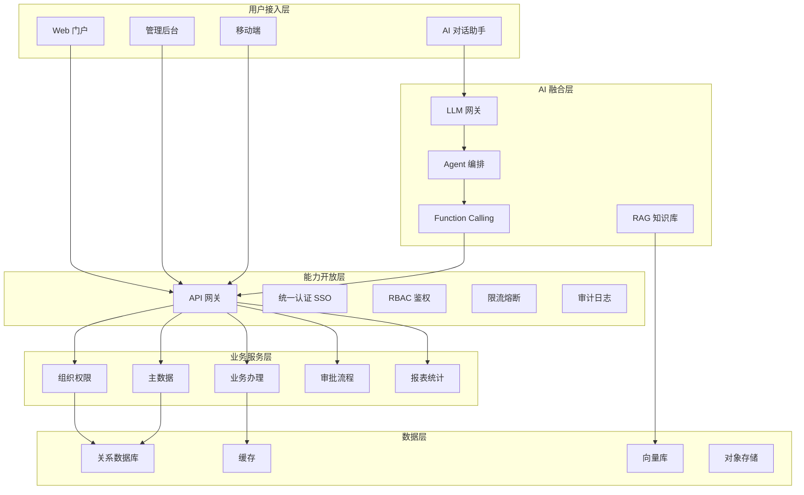
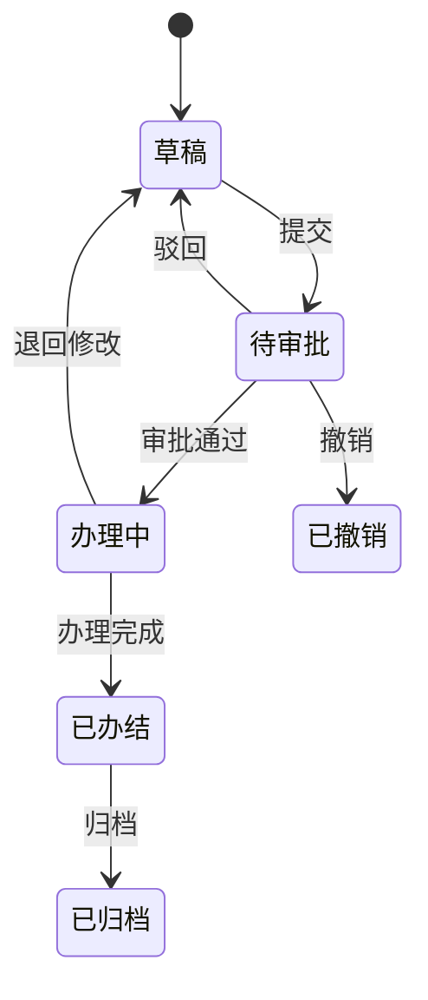
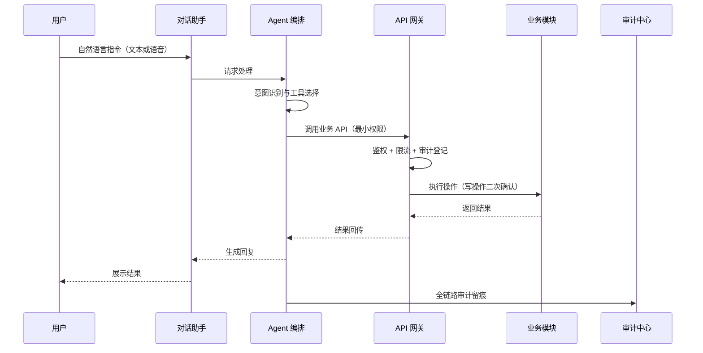

# 企业级管理系统架构与业务处理流程文档（Enterprise Management System Architecture & Business Process）

> **文档编号**：DOC-EP-038-V2.0
> **版本**：V2.0
> **发布日期**：2026-09-12
> **编制组织**：三联盟模式（产品联盟 / 算法联盟 / 开发联盟）
> **版权所有**：© 2026 璇玑 RelGraph · 算子统一系统（OUS）· 三联盟 · MIT License
> **Git 仓库**：<https://github.com/aikjx/mox.git> ｜ 镜像：<https://gitcode.com/aikjx/mox>
> **权威等级**：L2（企业级规范 · 开发联盟主责 · 三联盟会签）
> **来源**：本文档由飞书在线文档《企业级管理系统架构与业务处理流程文档》v2.0 转写归档，内容与源文档一致。

> **事实分级说明**：文中【已确认】为用户声明或本方案已定的事实；【设计规范】为本文档定义、作为开发与维护执行标准的内容；【待确认】为依赖真实环境、需要对照代码库与部署环境核对的项目。未标注内容视为本文档确立的架构基线。

---

## 1. 文档信息

| 项 | 内容 |
|----|------|
| 文档名称 | 企业级管理系统架构与业务处理流程文档 |
| 版本 | v2.0 |
| 编制日期 | 2026-09-11 |
| 文档密级 | 内部 |
| 文档状态 | 正式版（待评审确认） |

---

## 2. 目录

本文档按"目标—架构—规范—流程—能力—保障—验收"组织，各章相对独立，可按需查阅。

| 章节 | 核心内容 |
|------|----------|
| 1 文档信息 | 版本、密级与状态 |
| 2 系统概述与建设目标 | 系统定位、建设目标、术语与缩写 |
| 3 总体架构 | 设计原则、分层架构、关键设计决策、架构演进路线 |
| 4 归一化设计规范 | 数据、接口、编码命名、错误码日志、配置归一化 |
| 5 模块化设计 | 模块划分、模块清单、依赖与通信规则、扩展点 |
| 6 数据架构与数据治理 | 数据分层、生命周期、分级分类与安全、质量与血缘 |
| 7 核心业务处理流程 | 认证鉴权、主数据、单据、审批、事件同步、审计留痕 |
| 8 AI 融合架构与业务处理流程 | AI 总体架构、RAG 问答、Function Calling、语音与流程图、AI 治理与安全、融合路线图、MoA 多智能体编排 |
| 9 企业级非功能设计 | 安全、信创合规、可观测性（SLI/SLO）、性能容量、高可用容灾 |
| 10 运维与发布体系 | CI/CD、版本制品、灰度回滚、应急响应、变更管理 |
| 11 部署架构 | 部署视图、环境划分、发布与回滚 |
| 12 验收标准 | 功能、非功能、安全与合规验收 |
| 13 未决决定与后续事项 | 待确认项与回填路径、AI 融合后续安排 |
| 14 附录 | 接口契约要素、上线检查清单、版本记录 |

---

## 3. 系统概述与建设目标

### 3.1 系统定位

系统是面向【政务 / 企业管理】场景的企业级管理系统【已确认：全维开发完成、企业级、归一化模块化】，承载组织与权限、主数据、业务办理、审批流转、报表统计、审计留痕等核心能力，并通过统一 API 网关对外提供能力开放，支持以独立服务层方式融合 AI 能力（对话问答、知识检索、业务操作、语音驱动、流程与报告生成）。

### 3.2 建设目标

1. 企业级：安全合规、稳定可靠、可观测、可运维，满足信创环境与等保 2.0 三级要求。
2. 归一化：数据、接口、编码、错误、日志、配置全面统一，消除重复实现与口径漂移。
3. 模块化：高内聚、低耦合，模块可独立演进、独立交付、按需扩展。
4. AI 融合：以 API 网关为唯一边界，AI 作为独立服务层接入，可灰度、可回退、全链路审计。

### 3.3 术语与缩写

| 术语 | 全称 | 说明 |
|------|------|------|
| SSO | Single Sign-On | 单点登录，对接统一身份认证 |
| OAuth2 | OAuth 2.0 | 授权协议，令牌签发与校验 |
| RBAC / ABAC | Role / Attribute Based Access Control | 基于角色 / 属性的访问控制 |
| API 网关 | API Gateway | 统一能力出口：鉴权、限流、审计、路由 |
| RAG | Retrieval-Augmented Generation | 检索增强生成，知识库问答 |
| Agent | AI Agent | AI 智能体，编排多步任务与工具调用 |
| Function Calling | Function Calling | 大模型调用注册业务工具的机制 |
| ASR | Automatic Speech Recognition | 语音识别 |
| 信创 | 信息技术应用创新 | 国产化软硬件体系适配要求 |
| 等保 2.0 | 网络安全等级保护 2.0 | 网络安全等级保护标准体系 |

---

## 4. 总体架构

### 4.1 架构设计原则

1. 模块化单体优先：在团队规模与业务复杂度下，模块化单体是默认最优解，不引入不必要的分布式复杂度；只有出现多团队独立交付、独立扩缩容或强混合技术栈诉求时才考虑拆分。
2. 能力开放：一切能力经 API 网关对外，统一鉴权、限流、审计，禁止绕过网关直连服务。
3. AI 解耦：AI 服务独立于核心系统，只通过网关交互，不侵入核心代码，可灰度、可回退。
4. 信创合规：CPU、操作系统、数据库、中间件全链路国产化适配。

### 4.2 分层架构

系统分为五层：用户接入层、能力开放层（API 网关）、业务服务层（模块化单体）、AI 融合层（独立服务）、数据层。AI 对话入口与业务入口共享统一认证与审计。

图 1 文字等价：用户经 Web 门户、管理后台、移动端或 AI 对话助手进入系统；业务入口统一经过能力开放层的 API 网关（完成 SSO 认证、RBAC 鉴权、限流与审计）后路由到业务服务层各模块；业务模块读写数据层；AI 对话入口进入 AI 融合层，经 LLM 网关、Agent 编排，通过 Function Calling 回经 API 网关调用业务能力，RAG 知识库独立接入向量库。AI 不直接访问业务数据，所有调用受网关约束并可审计。

### 4.3 关键设计决策

| 决策项 | 决策 | 理由（why） | 被否方案与后果 |
|--------|------|-------------|----------------|
| 系统形态 | 模块化单体 | 团队规模与业务量下交付最快、事务与部署最简单，模块边界已按业务域收敛 | 微服务：未出现多团队独立交付与独立扩缩容诉求，过早分布式带来运维与一致性成本 |
| 能力出口 | 统一 API 网关 | 集中鉴权、限流、审计，是 AI 融合与第三方开放的前提 | 服务直连：无法统一安全策略与审计，扩展点缺失 |
| AI 接入方式 | 独立服务层 | 不侵入核心代码，模型升级、功能灰度、故障回退互不影响 | 嵌入核心：AI 波动直接冲击业务可用性，升级风险高 |
| 数据一致性 | 业务库单写 + 事件通知 | 业务场景最终一致即可，避免分布式事务的复杂度与性能损失 | 分布式事务：复杂度高、吞吐下降，收益不匹配 |

### 4.4 架构演进路线

系统演进按四个阶段推进，每阶段有独立准入条件，避免超前设计。

| 阶段 | 核心任务 | 准入条件 | 状态 |
|------|----------|----------|------|
| 稳定期 | 业务全流程线上化，模块化单体成熟 | 模块清单稳定、发布流程闭环 | 已完成 |
| 能力开放期 | API 全量开放，统一网关治理，第三方与 AI 接入 | 网关鉴权限流审计齐备 | 进行中 |
| 智能化期 | AI 全场景融合，决策支持与流程自动化 | AI 治理、审计、降级通道就绪 | 规划中 |
| 平台化期 | 能力组件化，多系统复用（按需） | 出现明确多系统复用诉求 | 可选 |

---

## 5. 归一化设计规范

### 5.1 数据归一化

1. 统一主数据：组织、人员、字典、编码由主数据模块统一管理，业务模块只引用主数据标识，不重复维护。
2. 统一编码规范：实体主键、业务单号、字典编码遵循统一规则，全系统唯一且可读。
3. 统一时间与时区：时间统一存储为标准时区，展示层按用户时区转换；时间戳精度统一。
4. 统一金额与单位：金额精度、币种、计量单位全系统一致，禁止各模块自定义口径。

### 5.2 接口归一化

1. 风格统一：RESTful 资源化接口，路径、方法、语义统一。
2. 响应结构统一：统一封装 code、msg、data 三段式响应，错误码全局唯一。
3. 分页与过滤统一：分页、排序、过滤参数命名与行为全系统一致。
4. 幂等统一：所有写接口支持幂等键，重复提交不产生重复业务数据。
5. 版本统一：接口路径携带版本前缀，兼容期内不破坏调用方。

### 5.3 编码与命名规范

| 对象 | 规范 | 示例 |
|------|------|------|
| 模块 | 业务域缩写前缀，统一命名空间 | org、mdm、biz、wf、rpt |
| 数据库表 | 模块前缀 + 业务名，统一小写下划线 | org_user、biz_order |
| 字段 | 统一小写驼峰或下划线，禁止混用 | created_time、status |
| 接口 | 资源复数名词 + 标准动词 | GET /v1/orders、PATCH /v1/orders/{id} |
| 业务单号 | 业务码 + 日期 + 序列，全局唯一 | ORD202609110001 |

### 5.4 错误码与日志规范

| 错误码段 | 含义 | 示例 |
|----------|------|------|
| 10xxx | 系统级错误 | 10001 系统内部错误 |
| 20xxx | 参数与校验错误 | 20001 参数缺失、20002 格式错误 |
| 30xxx | 认证与权限错误 | 30001 未登录、30003 无权限 |
| 40xxx | 业务规则错误 | 40001 状态不允许操作 |
| 50xxx | 外部依赖错误 | 50001 AI 服务不可用 |

日志规范：全链路携带 traceId；日志分级（debug、info、warn、error）；结构化输出；敏感字段统一脱敏；禁止打印令牌、密钥与个人敏感信息。

### 5.5 配置与参数归一化

配置统一由配置中心管理，按环境隔离（开发、测试、预发布、生产）；敏感配置加密存储；运行参数、开关、阈值统一下沉配置中心，禁止硬编码。

---

## 6. 模块化设计

### 6.1 模块划分原则

1. 单一职责：每个模块只承载一个业务域职责。
2. 高内聚低耦合：模块内部内聚实现，模块之间只通过接口或事件交互。
3. 禁止跨层调用：上层只能依赖下层的稳定接口，禁止反向与平级绕过。
4. 依赖收敛：依赖关系只走接口定义，不依赖具体实现，便于替换与测试。

### 6.2 模块清单

| 模块 | 核心职责 | 主要依赖 | 状态 |
|------|----------|----------|------|
| 组织权限模块 | 组织架构、人员、角色权限、SSO 对接 | 主数据、系统管理 | 已交付 |
| 主数据模块 | 基础档案、字典、编码规则统一维护 | 系统管理 | 已交付 |
| 业务办理模块 | 核心业务单据全生命周期办理 | 组织权限、主数据 | 已交付 |
| 审批流程模块 | 审批流定义、流转、代理、超时处理 | 组织权限 | 已交付 |
| 报表统计模块 | 统计口径、报表生成、导出 | 业务办理 | 已交付 |
| 系统管理模块 | 参数、字典、日志、审计、消息通知 | 组织权限 | 已交付 |
| AI 服务模块 | LLM 网关、Agent、RAG、Function Calling | API 网关（只依赖接口） | 已交付 |

> 【待确认】上表模块清单为典型划分，请对照实际代码仓库核对模块名、数量与依赖关系；状态栏为文档基线，实际交付范围以发布记录为准。

### 6.3 模块间依赖与通信规则

1. 同步调用：模块间必须通过对外接口（REST 或 RPC 接口定义）调用，禁止直接依赖内部实现。
2. 异步解耦：跨模块非强一致场景走事件机制（发布、订阅、重试、对账）。
3. 数据隔离：模块只写自有数据表，禁止跨模块直接改表。

### 6.4 扩展点与演进

模块预留标准扩展点：策略扩展（可插拔实现）、事件订阅（第三方与 AI 监听）、配置开关（功能灰度）。模块演进遵循内部重构不影响外部接口的原则，升级可独立发布。

---

## 7. 数据架构与数据治理

### 7.1 数据架构分层

数据按用途三层分离，互不越界：操作数据（业务库，支撑在线事务）、分析数据（报表与统计，支撑查询与报表）、知识数据（向量库与知识库，支撑 AI 检索）。三层之间通过事件或定时任务同步，禁止跨层直写。

### 7.2 数据生命周期管理

1. 采集与录入：统一入口与校验，禁止绕过校验直写。
2. 存储与使用：按数据分级落实加密、脱敏与访问控制。
3. 归档：过期数据按策略归档至低成本存储，保持可检索。
4. 销毁：到期数据按合规要求销毁，留存销毁记录。

### 7.3 数据分级分类与安全

| 级别 | 定义 | 保护要求 |
|------|------|----------|
| 公开 | 可对外公开的信息 | 正常展示，无额外保护 |
| 内部 | 仅内部使用 | 登录可见，禁止外发 |
| 敏感 | 个人与业务敏感信息 | 字段级加密、脱敏展示、权限管控 |
| 机密 | 密钥、凭据、审计等 | 加密存储、最小权限、独立审计 |

### 7.4 数据质量与血缘

主数据与关键业务数据执行完整性、唯一性与口径一致性校验；关键字段变更记录血缘，支持从结果追溯到来源与加工链路；质量问题自动告警并进入整改闭环。

---

## 8. 核心业务处理流程

### 8.1 统一认证与鉴权流程

1. 用户访问任一入口，网关检测未携带有效令牌。
2. 网关重定向至统一认证中心（SSO / OAuth2），完成登录。
3. 认证中心回调系统，网关换取令牌并建立会话。
4. 后续请求携带令牌，网关校验有效性并解析身份。
5. 网关执行 RBAC 鉴权，校验接口级权限。
6. 通过后路由至业务模块；全程写入登录与访问审计。

异常与补偿：令牌过期返回 30001 并引导重新登录；鉴权失败返回 30003；连续失败触发安全告警与限流。

### 8.2 主数据管理流程

主数据变更（新增、修改、失效）发起后：校验唯一性与合规性，进入审批流；审批通过后生效，并通过事件同步至下游业务模块；同步失败自动重试，重试仍失败进入对账队列并告警，保证口径一致。

### 8.3 业务单据办理流程

业务单据遵循统一状态机流转，状态迁移必须经过显式动作，非法迁移被拒绝并记录。

图 2 文字等价：单据从草稿经提交进入待审批；审批驳回回到草稿，审批通过进入办理中；办理中完成即办结，可退回草稿修改；待审批与办理中均可撤销；办结后归档。每个状态迁移记录操作人、时间与原因，写入审计。

### 8.4 审批流程

审批流支持顺序审批、会签（全部通过）、或签（任一通过）、转办、代理、加签与驳回；超时未处理触发提醒与升级；流程定义与实例数据分离，支持流程模板灰度发布。

### 8.5 数据同步与事件流程

事件通道承载跨模块与外部系统同步：发布方保证事件落库与投递；订阅方消费后回执；失败重试有上限并进入死信对账；关键同步提供人工补偿入口。

### 8.6 审计与留痕流程

1. 登录审计：记录登录来源、结果、时间。
2. 操作审计：记录业务操作全量明细（谁、何时、对什么、改了什么、前后值）。
3. 数据变更审计：关键数据表变更留痕，支持追溯。
4. AI 操作审计：AI 发起的所有调用与结果独立留痕，与人工操作同标准可追溯。

---

## 9. AI 融合架构与业务处理流程

### 9.1 AI 融合总体架构

AI 融合层为独立服务，由 LLM 网关（模型路由、密钥治理、用量统计）、Agent 编排、RAG 知识库、Function Calling 四部分组成。AI 层以最小权限服务账号经 API 网关调用业务能力，不直接访问业务数据库；所有调用受网关鉴权、限流与审计约束。

### 9.2 AI 知识问答流程（RAG）

1. 用户提出自然语言问题（文本或语音转文本）。
2. Agent 识别意图，判定属于知识问答类。
3. 检索向量库与知识库，召回相关制度、流程与历史数据片段。
4. 拼装上下文，LLM 生成答案并附引用来源。
5. 输出前执行脱敏与合规校验，敏感内容拒绝或降级答复。

### 9.3 AI 业务操作流程（Function Calling）

图 3 文字等价：用户指令进入对话助手，Agent 完成意图识别与工具选择，经 API 网关（鉴权、限流、审计登记）调用业务模块执行；写操作强制二次确认与幂等；结果逐级回传并生成回复；全过程审计留痕。AI 服务不可用时降级提示并保留人工操作通道。

### 9.4 语音驱动与流程图生成

语音入口经 ASR 转文本后进入同一 Agent 链路；流程图与报告类输出由 Agent 生成结构化描述，再渲染为 Mermaid / LogicFlow 图形或标准文档，供业务人员确认后使用。

### 9.5 AI 治理与安全

1. 权限边界：AI 使用最小权限服务账号，写操作二次确认，越权调用被网关拒绝。
2. 数据安全：输入输出全链路脱敏，敏感数据不出域，模型私有化部署。
3. 审计闭环：AI 调用与人工操作同标准留痕。
4. 降级通道：AI 故障时业务不阻塞，自动降级为人工操作。
5. 灰度与回退：模型切换与功能上线走灰度，异常一键回退。
6. 幻觉与合规防护：高风险输出拒绝或降级，答案附引用来源，合规校验前置。
7. 模型与提示词治理：模型版本统一管理，提示词模板化与版本化，变更走评审。
8. 效果评估：关键场景建立评测集，定期评估准确率、误用率与拒绝率。

### 9.6 AI 融合路线图

AI 融合按业务优先级分三批推进，每批完成评测与治理验收后再进入下一批。

| 批次 | 场景 | 模型能力 | 准入条件 |
|------|------|----------|----------|
| 第一批（P0） | 知识问答、单据查询、常见问题自动应答 | 私有化大模型 + RAG | 知识库就绪，幻觉防护与引用来源通过评审 |
| 第二批（P1） | 单据代填与预填、审批辅助、流程驱动操作 | Function Calling + 审批网关 | 操作审计、二次确认、降级通道验证通过 |
| 第三批（P2） | 经营分析、异常预警、决策建议 | 分析模型 + 数据服务 | 数据血缘与口径校验就绪，建议附依据 |

### 9.7 MoA 多智能体编排架构

为承载完整的人机协同形态，AI 融合在独立服务层之上引入多智能体编排（Multi-Agent Orchestration）层：编排器统一调度多个专职 Agent，每个 Agent 负责一个业务域能力，通过工具调用与现有模块化单体协同，全部调用纳入统一鉴权、审计与限流。

| 层次 | 组成 | 职责与系统映射 |
|------|------|----------------|
| 入口与编排层 | 编排器、会话与任务管理 | 意图理解、任务规划与分配、结果汇总；经统一网关完成鉴权与审计 |
| 专职 Agent 层 | 知识问答、单据、审批、报表分析、数据治理 Agent | 按业务域拆分，调用第 6 章模块服务 API 与 RAG / Function Calling 工具 |
| 工具与连接层 | 统一工具注册表、模型网关 | 对模块服务与外部模型统一封装，工具鉴权、限流、审计一致 |
| 知识与记忆层 | 知识库（RAG）、向量库、会话记忆 | 与第 7 章知识数据层同源，血缘与口径可追溯 |
| 治理与可观测 | AI 治理规则、SLI/SLO 体系 | 全链路留痕、效果评估，异常自动降级人工（对应 9.5、10.3） |

通信原则：跨 Agent 任务流转统一由编排器完成，Agent 之间禁止私连（与 6.3 模块依赖规则同构）；所有调用经统一网关与工具注册表，保证鉴权、审计、限流一致；一次请求至少可回溯到单个 Agent 与工具调用。

落地阶段与 9.6 路线图对齐：P0 上线知识问答 Agent（单 Agent）；P1 上线单据与审批 Agent（多 Agent 编排）；P2 上线报表分析与决策支持 Agent。

---

## 10. 企业级非功能设计

### 10.1 安全设计

安全设计遵循纵深防御原则，从网络、应用、数据、管理四个层面逐层设防，任一单点失效不影响整体防线。

1. 网络层：分区隔离、最小开放、边界防护与入侵检测。
2. 应用层：传输加密、接口防注入防越权防重放、会话与令牌安全管理、登录防爆破。
3. 数据层：敏感字段加密与脱敏、数据分级分类访问控制、备份加密。
4. 管理层：密码策略、权限最小化与定期复核、安全审计、漏洞管理闭环。

密钥与凭据统一由密钥管理服务托管，禁止硬编码与日志输出；第三方与 AI 接入统一走网关安全策略，签署安全接入约定。

### 10.2 信创与合规

全链路适配国产 CPU、国产操作系统、国产数据库与中间件；数据库兼容性（含国产数据库方言与语法差异）已做验证；按等保 2.0 三级要求落实身份鉴别、访问控制、安全审计、入侵防范、数据完整性与保密性等措施，并形成映射清单。【待确认】具体等保测评机构与测评结果。

### 10.3 可观测性

可观测性以日志、指标、链路追踪、告警四件套为基础，并以服务级别指标（SLI）与目标（SLO）驱动运维质量。

| 指标 | 口径 | 建议目标（待确认基线） |
|------|------|------------------------|
| 可用性 | 成功请求 / 总请求 | 核心接口 99.9% |
| 时延 | P95 响应时间 | 核心接口低于 500ms（待确认） |
| 错误率 | 5xx 占比 | 低于 0.1%（待确认） |
| 容量 | 吞吐与资源水位 | 峰值水位低于 70%（待确认） |

告警分级：P0 业务不可用（立即响应）、P1 核心功能受损（15 分钟内响应）、P2 一般异常（当日处理）、P3 提示（持续跟踪）。

### 10.4 性能与容量

性能与容量管理按闭环流程执行：基线校准（压测）→ 监控比对 → 预测规划 → 扩缩容 → 复盘回填。

1. 压测：上线前与重大变更后执行压测，产出 P95、吞吐、并发上限与资源拐点。
2. 监控：生产环境持续采集时延、吞吐、错误率与资源水位。
3. 预测：按业务增长与活动节奏预判容量需求，提前一个周期完成评估。
4. 扩缩容：应用支持水平伸缩；数据库按连接池、慢查询与存储水位管理。
5. 复盘：容量事件后回填基线文档，更新容量模型。

【待确认】P95 时延、吞吐、并发上限、数据库连接与缓存容量基线，以压测报告与生产监控数据回填。

### 10.5 高可用与容灾

高可用按故障影响面分级设计，容灾目标与业务连续性要求匹配。

| 容灾级别 | 适用场景 | 实现与要求 |
|----------|----------|------------|
| 单机高可用 | 常规故障 | 应用多副本、会话可迁移、数据库主备，自动切换 |
| 同城容灾 | 机房级故障 | 双中心部署，数据同步，分钟级切换 |
| 异地容灾 | 区域级灾难（按需） | 异地备份与恢复，RPO 小时级、RTO 天级（待确认） |

备份策略：数据库全量与增量定期备份，备份异地留存；恢复演练每季度至少一次，演练记录归档。【待确认】RPO、RTO 目标值与最近一次恢复演练记录。

---

## 11. 运维与发布体系

### 11.1 CI/CD 流水线

代码提交后自动触发：静态检查与安全扫描 → 单元测试 → 构建制品 → 制品入库（版本唯一、可追溯）→ 环境部署。生产发布必须经过测试与预发布环境验证。

### 11.2 版本与制品管理

采用语义化版本；制品包含代码提交号、构建时间与变更清单，支持任意版本回退；生产环境只部署经审批的版本。

### 11.3 灰度发布与回滚

发布遵循：接口兼容检查 → 金丝雀验证 → 按比例灰度 → 监控确认 → 全量。触发回滚条件：错误率上升、时延劣化、关键业务告警；回滚一键执行且不影响数据一致性。

### 11.4 应急响应

事件按 P0-P3 分级，明确响应时效、oncall 职责与升级路径；处置遵循先止损、后定位、再根治；每次事件输出复盘，更新预案与监控。

### 11.5 变更管理

生产环境所有变更（代码、配置、数据、模型、提示词）统一走变更管理流程。

1. 申请：提交变更内容、影响范围、回滚方案与测试结果。
2. 评审：评估风险与冲突，确定变更窗口与灰度策略。
3. 实施：在变更窗口内执行，同步监控关键指标。
4. 验证与关闭：验证业务正常后关闭变更，记录变更台账。
5. 回滚：验证失败或指标劣化立即按预案回滚，复盘后重新申请。

---

## 12. 部署架构

### 12.1 部署视图

接入层（Web / 管理后台 / 移动端）经负载均衡进入 API 网关；业务服务层与 AI 融合层独立部署、独立扩缩容；数据层（关系库、缓存、向量库、对象存储）按环境隔离部署；生产与内网环境遵循信创与等保要求。

### 12.2 环境划分

开发、测试、预发布、生产四套环境；配置与数据完全隔离；预发布环境用于发布前最终验证。

### 12.3 发布与回滚

发布流程：构建产物可追溯，接口兼容检查，灰度发布（按实例或按比例），监控确认后全量；异常一键回滚到上一版本，回滚不影响数据一致性。

---

## 13. 验收标准

### 13.1 功能验收

模块清单全部交付，业务单据全生命周期状态机闭环，审批、主数据、审计流程按本文档流程走通；AI 问答、AI 操作、语音与流程图生成场景端到端验证通过。

### 13.2 非功能验收

性能基线达标（以压测报告为准）；可观测性四件套可用；发布回滚演练通过；高可用与备份恢复验证通过。

### 13.3 安全与合规验收

安全测试（注入、越权、脱敏、认证）通过；信创环境全链路运行验证通过；等保 2.0 三级整改项闭环；AI 调用全链路审计可查。

---

## 14. 未决决定与后续事项

| 事项 | 类型 | 信息来源（回填方式） | 影响 |
|------|------|----------------------|------|
| 模块清单与依赖关系核对 | 待确认 | 代码仓库：模块目录、依赖声明文件 | 影响文档与代码一致性 |
| 数据库与中间件选型及版本 | 待确认 | 部署清单、项目配置文件 | 影响信创适配记录 |
| 性能基线与容量数据回填 | 待确认 | 压测报告、生产监控（P95、吞吐、并发） | 影响容量规划 |
| RPO、RTO 与恢复演练记录 | 待确认 | 容灾方案、备份与恢复演练记录 | 影响容灾验收 |
| 等保测评与信创认证结果 | 待确认 | 等保测评报告、信创适配认证材料 | 影响合规结论 |
| AI 融合后续阶段安排 | 已规划（见 9.6） | 业务需求评审与优先级排序 | 按业务优先级扩展场景与模型，路线见 9.6 |

> **为什么标记待确认**：本文档编写时未接入实际代码库与部署环境，上表事项均为只能来自真实系统的事实（模块结构、选型版本、压测与测评数据），不虚构不猜测，故留待回填。提供对应信息来源后即可即时更新并归档。

回填路径：由研发负责人对照代码仓库与部署环境逐项回填；全部回填后本文档升级为正式归档版。

---

## 15. 附录

### 15.1 附录 A 接口契约模板

每个对外接口须按以下要素定义（OpenAPI 骨架），接口变更须走评审并更新文档。

| 要素 | 要求 | 必填 |
|------|------|------|
| 路径与方法 | RESTful 资源化路径，动词语义统一 | 是 |
| 版本前缀 | 接口路径携带版本号，兼容期内不破坏调用方 | 是 |
| 权限要求 | 标注所需角色或权限点，网关统一鉴权 | 是 |
| 请求与响应结构 | 统一 code、msg、data 三段式，字段遵循命名规范 | 是 |
| 错误码 | 全局唯一，附错误描述与处理建议 | 是 |
| 幂等性 | 写接口支持幂等键，重复提交不产生重复数据 | 写接口必填 |
| 限流与重试 | 明确限流阈值与调用方重试策略 | 是 |
| 兼容与弃用 | 弃用周期与迁移指引，禁止破坏性变更 | 是 |

### 15.2 附录 B 上线与评审检查清单

- [ ] 模块清单与依赖关系已核对
- [ ] 接口契约与错误码符合归一化规范
- [ ] 安全测试（注入、越权、脱敏、认证）通过
- [ ] 压测基线达标并回填文档
- [ ] 可观测性四件套与告警规则就绪
- [ ] 灰度与回滚演练通过
- [ ] AI 调用审计与降级通道验证通过
- [ ] 信创环境全链路验证通过

### 15.3 附录 C 版本记录

| 版本 | 日期 | 说明 |
|------|------|------|
| v1.0 | 2026-09-11 | 初版：架构基线、归一化与模块化规范、核心流程、AI 融合方案 |
| v2.0 | 2026-09-11 | 企业级最高规格升级：新增数据架构与治理、运维与发布体系、AI 融合路线图、MoA 多智能体编排架构、变更管理、接口契约要素表与附录；深化安全、可观测性、容量与容灾设计；AI 治理与评估补全 |

---

*本文档为活文档，随系统演进持续迭代。任何内容变更须在「附录 C 版本记录」与 `00-INDEX.md` §5 变更记录中留痕。*
