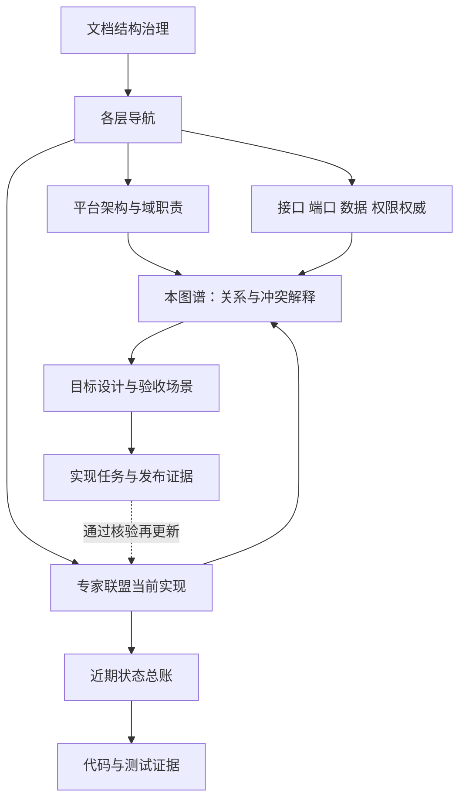
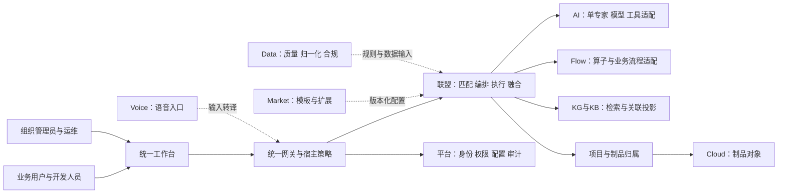
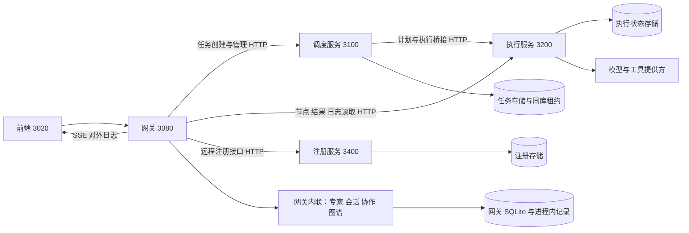
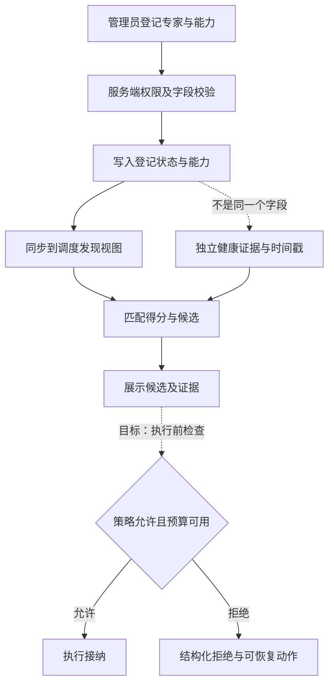
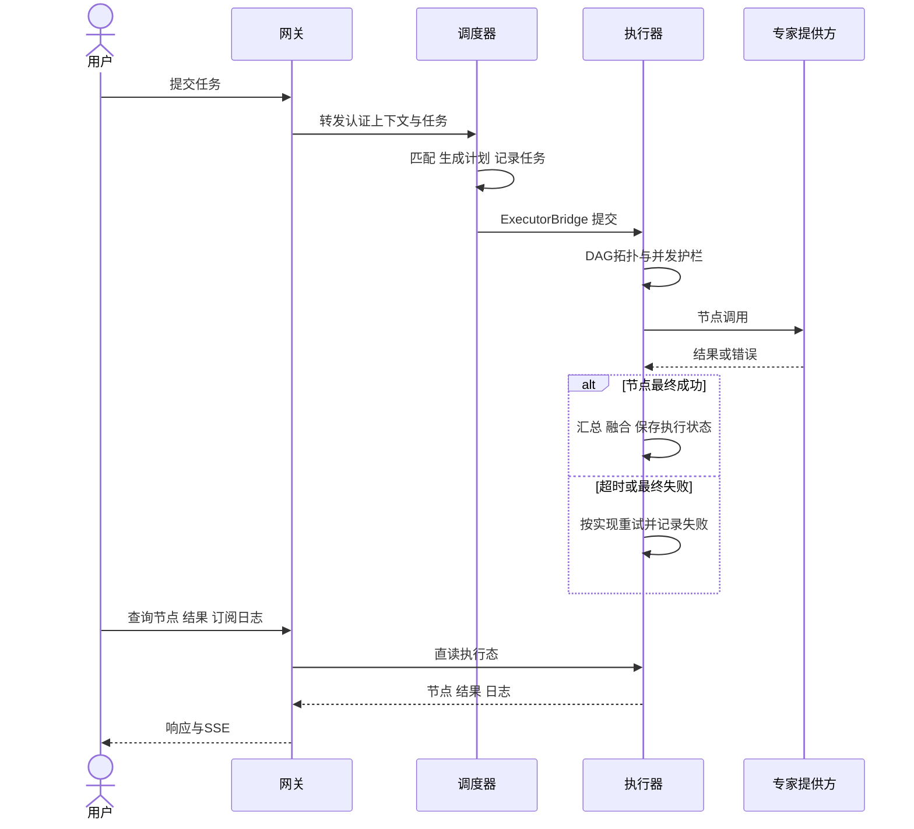
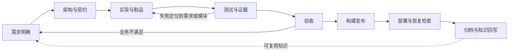
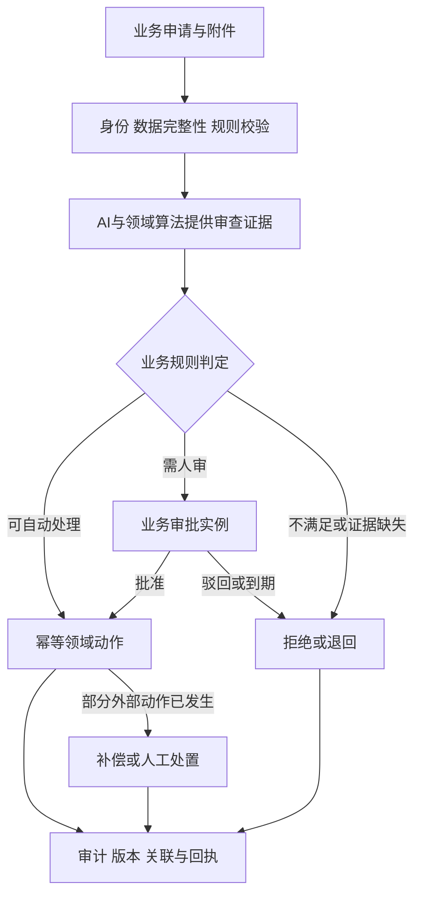
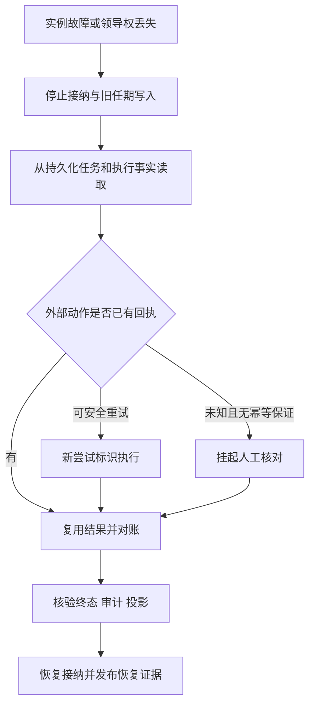

# 17 全 docs 架构与业务流程关联图谱

<a id="scope"></a>
## 1. 范围与证据边界

本轮交付完整文档设计与治理整理：覆盖 `docs/` 全部文件的结构盘点，综合主要架构家族和业务流程，建立专家联盟模块、契约、流程、验收的关联。**全量结构覆盖不等于每份文档都已做语义核验，更不等于所有业务已生产验收。** 不改运行时代码，不变更端口，不迁移数据库，不修改归档。

Graphify 对支持格式检测得到 547 个文件、约 969,261 words，无敏感文件跳过；该工具 word 统计不是中文语义词数。目录文件更多，故使用全文件盘点作为最终分母，而不是只用 Graphify 支持的文件集。生成工具 `scripts/doc/inventory-architecture-docs.py` 逐文件登记 SHA-256、生命周期、原文标题、章节摘要、首段摘录、Mermaid 图源和显式引用。仅提取来源实际出现的引用（EXTRACTED），不推断模块调用关系。

生成证据：`reports/markdown/docs-architecture-corpus.md`（全文件目录、章节主题、图源数）、`reports/data/docs-architecture-corpus.json`（完整标题/图源/引用及行号）。复跑命令：

```powershell
python scripts/doc/inventory-architecture-docs.py --selftest
python scripts/doc/inventory-architecture-docs.py
python scripts/doc/inventory-architecture-docs.py --check
python scripts/gate/check-doc-links.py --selftest
python scripts/gate/check-doc-links.py
```

盘点分类：archive 只读历史；evidence 为过程资料；active-candidate 只表示在活动目录，**不表示已确认权威**。非文本仅记元数据；动态 HTML 绘图和文本框图不计入 Mermaid 数量。章节标题是来源摘录，不改写成已核实结论。

<a id="authority"></a>
## 2. 权威链与冲突裁决

| 问题 | 现行来源 | 边界 |
|---|---|---|
| 文档放哪、怎么引用 | [结构权威](docs/ARCHITECTURE-OF-DOCS.md#3-权威分级与单源ssot) | 本图谱只做关联，不新建治理层级 |
| 平台物理分层、域职责 | [平台归一化架构](docs/architecture/NORMALIZED_ARCHITECTURE.md#2-十二域划分与职责矩阵) | crate 数随 workspace 漂移；数量不能证明完成度 |
| 专家联盟现状 | [当前实现](docs/expert-alliance/CURRENT-ARCHITECTURE.md#一物理代码分布) | 2026-09-24 快照；近期增量按总账和代码证据补充 |
| 最近已修复、仍开放 | [状态总账](docs/expert-alliance/16-decision-and-state-ledger.md#一总账总表核心交付) | 记录完成不自动证明生产压力/恢复/安全验收完成 |
| API | [接口注册表](docs/API-REGISTRY.md#1-总览) | 实现路由为事实源；不得按旧文档发明接口 |
| 端口 | [端口注册表](docs/api/PORT-REGISTRY.md#第2章-快速速查表开发常用) | 示例测试端口不得反写生产事实 |
| 持久化 | [数据库现状](docs/database/DATABASE-ARCHITECTURE.md#1-存储分层总览) | 2026-09-17 全局快照；联盟近期存储再对照 CURRENT 和总账 |
| 权限 | [联盟权限模型](docs/expert-alliance/14-enterprise-permission-model.md#一权限模型总览) | 服务端授权才是安全边界；菜单隐藏仅用于体验 |
| 规范与状态关系 | [验收基线](docs/expert-alliance/15-product-spec-standard.md#一规范定位) | 规范定义应达到什么；最近状态引用总账，不再复制各项结果 |

裁决顺序：先判定问题属于哪种事实，再找该主题来源；来源日期冲突时读具体代码和变更证据。平台“总纲最高权威”的愿景不能覆盖运行时实际协议。没有证据的项标待核，不以篇幅、星级或自称“最佳”裁决。



<a id="families"></a>
## 3. 所有架构家族归一化摘要

这是阅读与职责地图。下表综合架构主题，具体文件与所有子章节由全量盘点枚举；历史/报告仅用于溯源，不与现行设计并列裁决。

| 家族 | 核心设计与输入输出 | 与专家联盟的关联 | 评估与收敛方向 |
|---|---|---|---|
| L0/L1 文档、能力、路线、API | 导航→能力→接口→验收 | 统一发现入口 | `ready`、crate 数、无 TODO 都不足以证明业务闭环；引用证据 |
| 平台六层、领域优先 | foundation/api/proto/core/svc/gateway；SDK 为消费适配 | 联盟按同样逻辑分层 | 区分代码层、产品层、文档层，不能混成一套 L0–L8 |
| 全局 AI 驱动架构 | 对话→意图→工具/流程→结果→沉淀 | 单 Agent 由 ai，多专家协作由 alliance | 对话可生成建议；外部写入和发布仍走宿主策略及产品门禁 |
| meta/COSMIC 元架构 | 元数据、行业包、权限、动态表与流程 | 复用组织、专家模板和配置 | 配置能描述业务差异，不能替代算法、安全与补偿逻辑 |
| 可复用模块装配 | 清单、依赖拓扑、契约主版本、初始化报告 | 联盟 HTTP SDK 可挂载宿主 | 复用 [装配契约](docs/architecture/MOX-MODULE-COMPOSITION-v1.md#模块边界)，初始化成功与持续健康分别验收 |
| 微服务/超大规模 | 运行拓扑、通信、部署、可观测与容量 | scheduler/executor/registry 边界 | 大规模方案为规模目标；拆分由独立扩容/故障隔离证据触发 |
| Rust 企业级指南 | 构建、类型、域模块、API、纯算法与适配 | 编码与依赖约束 | proto 在本域有 DTO/trait，不等于运行 gRPC |
| frontend | 外壳、导航、模块出口、契约、样式令牌 | expert-alliance 模块对接宿主 | 统一交互与状态来源，保留契约边界，不把整页逻辑放组件里 |
| 数据库/mox_sys/DSQL | 事务事实、母版目标模型、动态 SQL、迁移 | 专家/会话/任务/执行态各自持久化 | SQLite 现状与 MySQL/PG 模板并列但分型；禁止把 SQL 模板当实际落库 |
| kg/graph/full-dimensional | 节点边、算法、需求追溯、证据关系 | 能力发现、任务与成果关联 | 交易状态由业务域拥有；图谱为查询/关联投影，非第二调度器 |
| flow/PrimiFlow/算子 | DSL、DAG、业务工作流、沙箱、资源约束 | 任务节点调用可复用执行能力 | 联盟 DAG 与业务审批状态机不同，统一适配而不混用状态 |
| 插件/MCP/商场 | 扩展协议、工具、模板、分发 | 专家作为能力提供方，模板作为配置包 | 发布物需要版本、权限、来源；平台 MCP 存在不证明联盟 MCP 已接线 |
| 企业级与 ADR | 三联盟职责、交付流水线、依赖/网关/可观测/演进决策 | 定义开发联盟的工作方式 | 组织中的开发联盟与运行时专家联盟不是同一聚合 |
| standards/normalization | BP/API/ARC/VAL/TPL 分类和流程标准 | 稳定编号、字典、跨层追踪 | 引用现行事实，不再复制过期端点、阶段数和完成百分比 |
| specifications/tasks | 历史需求包、任务、评审 | 可回溯“当时为何这样做” | 任务清单的打勾不等于本轮已运行验证 |
| working-reports/_verification/_archive | 验证证据与历史快照 | 支撑争议核验 | 日期、环境、代码版本必须伴随结论；归档禁止升格为现行设计 |

主要下钻入口：`docs/architecture/README.md#四领域架构`、`docs/architecture/meta/README.md#文档索引`、`docs/architecture/microservices/README.md#文档导航`、`docs/architecture/frontend/README.md#文档`、`docs/database/README.md#交付物`、`docs/normalization/README.md#1-归一化分类5-类--ssot`。具体标题锚点需要源文件匹配；全量 JSON 同时提供精确行号作为下钻依据。

<a id="layers"></a>
## 4. 分层架构与域关联

### 4.1 产品上下文图（概念归一视图）



箭头表示设计职责依赖，非已逐项核实的网络调用。base/shared/foundation 为横切基础，不另算业务流程入口。模块归属以现有物理目录和契约为准。

### 4.2 联盟运行容器图（现行文档整合）



来源：`docs/expert-alliance/CURRENT-ARCHITECTURE.md#二服务拓扑与端口`、`docs/expert-alliance/13-end-to-end-business-flow.md#一流程总览`。注意 registry 是旁挂服务；本地图形预览、网关内联咨询、远程 DAG 执行是不同路径，不能画成所有请求必过四服务。HTTP/SSE 是联盟现状，平台的其他实时或 gRPC 能力不外推到此路径。

### 4.3 三种“分层”的对应关系

| 视角 | 层次 | 用途 |
|---|---|---|
| 文档治理 | L0–L8 | 来源与生命周期 |
| 代码结构 | foundation/api/proto/core/svc/gateway，SDK 消费适配 | 依赖方向与隔离 |
| 产品操作 | 输入→计划→执行→结果→证据→再利用 | 用户认知和业务闭环 |

归一化统一术语和映射，不强求三个层号相同。逻辑模块不强制成为进程，进程不强制独享数据库实例；每类事实只有一个写入责任方。

<a id="flows"></a>
## 5. 全业务流程目录与统一图集

| 流程 ID | 范围与步骤 | 主责/数据 | 现状来源与限制 |
|---|---|---|---|
| EA-BP-01 | 专家注册→能力→可用性登记→探活/发现 | registry + 网关专家记录 | CURRENT；登记状态不是健康度，主动探测为配置能力 |
| EA-BP-02 | 输入→匹配→计划→调度→DAG→融合→读回 | scheduler/executor | 13；本地预览不能当真实执行回执 |
| EA-BP-03 | 会话→上下文→单/多专家咨询或辩论→记录 | 网关协作与会话 | CURRENT；内联模式与远程任务状态分别建模 |
| EA-BP-04 | 节点/边维护→关联→检索→知识沉淀 | 图谱/KB 投影 | 16 N4 已记 CRUD 完成；前端编辑体验与 GraphRAG 仍需各自验收 |
| EA-BP-05 | 对话需求→架构→实现→测试→验收 | 项目、制品、发布门禁 | BP-INDEX 五阶段 SOP；不是 TaskStatus 五态 |
| EA-BP-06 | AI 审查/算子→条件→人工节点→业务完成 | flow 业务流程 | business-process-flows 的早期实现说明含旧路径与占位；不得全部认作联盟已支持 |
| EA-BP-07 | 行业包装配→数据/规则→业务办理 | meta/DSQL/领域包 | mox_sys 与行业样例为设计/配置资产，未证实部署就绪 |
| EA-BP-08 | 模板/插件发现→审查→注册→调用→撤回 | market/宿主扩展策略 | 扩展能力按协议和版本授权，联盟 MCP 接线单独核验 |
| EA-BP-09 | 需求→架构→开发→验证→发布→运维→归档 | 开发联盟与运维 | EP-1–EP-7；组织交付流程，不是联盟运行模式 |
| EA-BP-10 | 故障→停止/接管→恢复→对账→验证 | 调度/执行/运维 | CURRENT leadership + 部署模板；租约不保证 exactly-once |

### 5.1 注册与可解释发现（现状加目标守卫）



目标守卫是设计建议，不声称当前已实现。可用性登记、健康观测、匹配分数必须分开；修改其中之一不得偷偷重定义另一字段。

### 5.2 远程任务主链（当前整合视图）



调度意图与执行事实需要对账，成功响应不得仅凭网关生成预演文案。故障不切本地数据源（装配契约已明确此语义）。

### 5.3 对话开发五阶段与企业交付七阶段（目标治理关联）



前五块对应产品 SOP；发布/运维/归档展开为 EP 流程，不增加 TaskStatus 枚举。对应 `docs/normalization/BP-INDEX.md#1-统一业务处理流程5-阶段-sop`、`docs/enterprise/37-企业级处理流程规范-V1.0.md#2-企业级处理流程总览`。

### 5.4 企业场景模板（目标业务抽象）



适用于财务核验、入职、采购、请假、合同、数据质量等模板；AI 输出不能单独授予权限或触发未经规则允许的付款等动作。此图不证明所有人工任务/补偿已落地。

### 5.5 运维恢复（目标验收流程）



不能把“恢复进程”写成“业务恢复完成”；外部动作未提供幂等或查询回执时不得盲重放。

<a id="conflicts"></a>
## 6. 本轮可证实的冲突与整理

| ID | 冲突/缺陷 | 处理与状态 |
|---|---|---|
| EA-DOC-01 | 初始链接门禁 43 断链，多个入口指向专家联盟归档前路径 | 更新现行入口、恢复 README 导航；保持归档不改；生成代码目录复跑 |
| EA-DOC-02 | 15 产品标准称 N4/N7/N8 开放，16 总账 2026-09-30 已登记闭环 | 15 修正近期状态；闭环分为后端实现与完整产品验收 |
| EA-DOC-03 | 15 U2 把 `availability=offline` 当 `health.is_healthy=false`，多份文档把备用matcher参数写成主路径 | 分别控制两种输入；主路径默认健康权重0.05/不健康0.2，备用0.15/0.3；主路径仍有其他硬过滤，已同步四份源视图 |
| EA-DOC-04 | platform NORMALIZED 13 alliance crates，CURRENT 16；CODE-CATALOG 原为143 workspace | 计数作为带日期快照，代码目录由生成器更新；不把旧统计强行替换成猜测 |
| EA-DOC-05 | business-process-flows 自称当前，引用旧 crates/frontend 路径和不存在的 architecture §28 | 增加历史边界提示；详细重核登记待办，不将旧说明纳入联盟现状 |
| EA-DOC-06 | BP-INDEX 已列政务样例却写“尚无领域包样例” | 改成样例文档已存在，运行闭环待证据；修正已迁移的流程源路径 |
| EA-DOC-07 | 多套总纲同时声称最高权威，日期与范围不一致 | 按主题/日期/证据裁决；本图谱为关联视图，不抢现状权威 |

归档来源与生产设计并列、同一状态复制到多个表、部署模板被误认为已部署，是持续漂移的根因。处理方式是来源引用、状态按条目登记、生成物可复跑，而不是把所有历史文档逐字重写。

<a id="optimality"></a>
## 7. 是否最优：结论和逐层突破

**现有模块化方向合理，但现有材料不足以证明全局最优或企业级交付已完成。** 四进程混合架构保留独立调度/执行，同时控制交付复杂度；将内联业务立即拆成更多服务，没有容量、故障隔离、团队自治证据支持。优化优先级应由质量场景与实测决定。

| 层 | 应保留 | 优先突破 | 证明改善的验收 |
|---|---|---|---|
| 0 事实 | 单源与归档 | 入口、日期、状态与引用 | 新增引用可解析；生成盘点零漂移；冲突可追到证据 |
| 1 产品 | 对话→结果→证据 | 预览/真实执行、空态、匹配解释 | 用户可辨模式、失败、下一步；核心任务可完成 |
| 2 契约 | DTO/trait/SDK | 写命令、读投影、幂等、版本、错误 | 兼容测试与重复提交/并发写场景 |
| 3 模块 | 逻辑职责划分 | 网关业务抽离但保持路由兼容 | 同一模块可由现有宿主测试，无跨域私表访问 |
| 4 数据 | 按域持久化 | 临时计划/历史的持久化决策及恢复 | 重启与中途断电场景，不重复外部副作用 |
| 5 执行 | DAG并发护栏 | 预算、接纳、重试和人工干预 | 配额/队列有界；重试不放大副作用 |
| 6 运营 | 审计、指标、租约 | 统一事件语义与端到端证据 | 故障定位、恢复演练、审计导出闭环 |
| 7 生态 | 可复用模板与模块清单 | 联盟MCP、版本、离线交付 | 可禁用、可升级、可撤回；私有交付完整自检 |

详细模块契约、质量场景、任务依赖和反例见 `docs/expert-alliance/18-modular-product-design.md#roadmap`。外部方法采用 [C4 多层视图](https://c4model.com/diagrams)、[arc42 的运行/部署/决策/质量/风险视图](https://arc42.org/overview/)，作为文档组织方法，不作为本项目认证或“最佳”证明。
