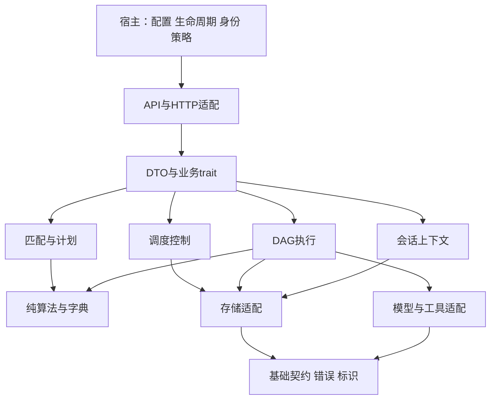
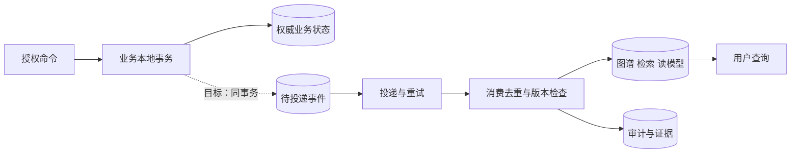
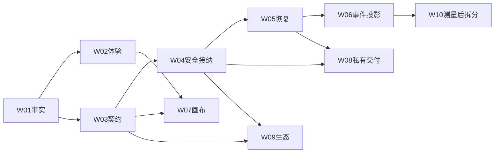

# 18 专家联盟模块化产品设计与分层突破路线

## 1. 产品目标与交付边界

专家联盟帮助用户把一个复杂目标交给合适的专家，形成可执行计划，得到可解释成果，并能追踪失败、证据和成本。产品成功不是“专家很多、流程图复杂”，而是**任务得到正确完成、用户理解结果、异常可恢复、组织敢于复用**。

本文件补充既有 15 验收基线和 16 状态总账：定义模块责任、目标契约、质量场景、可实施任务。组织开发专家联盟负责实现与证据；运行时专家联盟负责多专家协作。二者不共享一套角色枚举或任务状态机。

用户确认本轮为文档设计与治理整理。目标契约、质量指标及拆分建议是可评审方案；没有代码与运行证据，不标为实现完成。现状入口：`docs/expert-alliance/17-docs-architecture-and-flow-atlas.md#authority`。

### 1.1 用户与核心价值

| 用户 | 要完成的事 | 成功回执 |
|---|---|---|
| 业务提出者 | 描述目标、约束、附件，获得成果 | 结果、引用证据、限制与下一步 |
| 项目开发者 | 需求→设计→实现→验证→交付 | 制品版本、关联任务、测试与发布证据 |
| 专家维护者 | 登记能力、模型配置、健康与配额 | 注册有效性、配置版本、调用表现 |
| 组织管理员 | 管理授权、租户、资源与扩展 | 服务端拒绝/允许证据、真实操作者审计 |
| 运维与审计 | 诊断失败、恢复任务、核对数据 | trace、状态历史、恢复回执、审计导出 |

### 1.2 默认用户旅程

默认只展示目标、模式、进度、结果、异常动作。专家得分分项、节点调试、配置、租约、原始日志按需展开。预览持续显示“预览”；模拟产物不得显示“真实执行成功”。结果为空时区分未创建、当前进程无记录、权限不可见、加载失败，不用同一句空态掩盖原因。

## 2. 逻辑模块归一化

下表是责任模型，不是新建 10 个 crate 或 10 个服务的指令。先复用现有模块与清单，沿现有代码边界抽出可测试逻辑。

| ID | 责任与主要输入输出 | 唯一写入责任 | 现有落点/来源 | 不应拥有 |
|---|---|---|---|---|
| EA-M01 接入与宿主 | 认证上下文→授权后命令/查询 | 接入审计、请求上下文 | gateway 中间件、联盟 HTTP SDK | 匹配算法、DAG调度、私表写入 |
| EA-M02 专家目录 | 能力声明→专家记录/发现快照 | 专家记录版本；远程注册同步须指定源 | experts_registry、registry-core/svc | 任务终态、健康与登记字段混写 |
| EA-M03 匹配与计划 | 目标+能力+约束→候选与计划 | 计划版本与依据（目标持久化） | scheduler-core matcher/planner | 直接执行外部动作 |
| EA-M04 调度与控制 | 已接纳计划→任务控制/分配 | 任务控制状态、领导任期 | scheduler/storage/leadership | 伪造节点成功或结果 |
| EA-M05 DAG执行 | 任务计划→节点尝试与执行结果 | 节点/尝试/执行事实 | executor-core dag_engine/state_sink | 覆盖调度意图、绕过授权 |
| EA-M06 咨询与融合 | 专家响应→共识、分歧与证据 | 各路径结果版本与来源 | alliance-core fusion、网关 collaboration | 自创任务状态、把置信度当正确率 |
| EA-M07 会话与项目上下文 | 项目/会话→授权上下文引用 | 会话消息与上下文版本 | experts_session、project 域 | 跨租户原文任意拼接 |
| EA-M08 关系与知识投影 | 来源记录→可检索节点/边/文档 | 本域投影版本与游标 | experts_graph、kg/kb | 反向修改业务交易终态 |
| EA-M09 配置与扩展 | 版本化清单→可调用配置 | 模板/配置版本与启停策略 | config-core、module-core、market | 执行清单内任意代码或不受控 SQL |
| EA-M10 审计与运营 | 运行事件→指标、追踪、证据 | 追加证据与保留策略 | shared observability/audit + 各宿主 | 存明文密钥、以日志代替业务状态 |

专家目录有网关登记和远程 registry 两种现有能力，不能直接假定同库或同一记录。收敛任务首先定义稳定 expert_id、权威写源、同步版本和冲突策略，再迁移，避免两套系统都自称主源。

图表达目标依赖方向，不强迫现有所有 core 为纯函数：纯算法内核不做 IO；持久化、模型调用经适配注入。严禁一个域导入另一个域 svc 内部类型或直接修改私有表。复用 `docs/architecture/MOX-MODULE-COMPOSITION-v1.md#模块边界` 和 `docs/enterprise/29-跨域依赖规则与架构一致性治理-ADR-09.md#2-五条核心依赖规则the-five-rules` 的既有边界约束。

## 3. 契约归一化与数据归属

### 3.1 标识与词汇（目标新增字段不声称现有 DTO 已包含）

| 概念 | 规范语义 | 边界与约束 |
|---|---|---|
| tenant_id/user_id | 来自受信身份与服务端授权 | 客户端请求头不能直接覆盖已认证身份 |
| project_id/session_id | 成果归属与上下文范围 | 使用前验证资源可见性；不以“有ID”代替权限 |
| task_id | 被接纳的逻辑任务 | 重试沿用任务ID；不能每次重连生成新业务任务 |
| plan_version | 不可变执行计划版本 | 执行中编辑生成新版本，经控制策略决定是否采用 |
| node_id/attempt_id | 计划节点与某次执行尝试 | 区分重试和新节点；保存输入摘要和外部回执 |
| request_id/trace_id | 请求幂等追踪与分布式诊断 | 二者不等价；trace变化不能改变幂等语义 |
| schema_version/event_id | 契约版本与事件身份 | 追加字段兼容，删除/重定义须显式版本迁移 |
| availability/health | 人工登记可用性/观测健康 | 两套字段不同证据、不同更新周期 |
| control_status/execution_status | 调度意图/实际执行事实 | 展示可派生统一摘要，但不可丢失差异与滞后 |

状态复用 common-proto 实际 TaskStatus，字典导航在 `docs/expert-alliance/08-normalized-architecture.md#八状态机与枚举字典统一版`。任务阶段、NodeStatus、会话模式、审批状态分别命名，禁止把“WaitingUser”“Retry”等目标业务步骤直接塞进现行 TaskStatus。缺状态表达力时走契约变更，而不是前端暗加枚举。

### 3.2 命令、查询与事件责任

| 契约动作 | 责任模块 | 必需规则 | 错误可恢复性 |
|---|---|---|---|
| 提交任务 | M01→M04 | 参数、授权、计划版本、幂等摘要、资源接纳 | 400补输入；401/403重新授权；429/503按原因重试 |
| 搜索/匹配专家 | M02/M03 | 条件、可见性、能力快照、分数依据 | 无候选是业务结果，不能静默造专家 |
| 派发节点 | M04→M05 | 任务/计划/尝试身份、任期、预算、超时 | 外部动作未知时人工核对，不盲重试 |
| 控制任务 | M04 | 状态前置条件、并发版本、控制回执 | 409刷新状态再决定；取消接纳不等于副作用已撤销 |
| 读取结果 | M01→M05/M06 | 可见性、版本、最终/部分结果区分 | 不把控制completed当结果持久化完成 |
| 订阅日志 | M01→执行日志源 | 身份、任务授权、重连和截断提示 | 当前SSE不自动保证事件持久回放 |
| 修改图谱 | M08 | 资源授权、来源、版本、端点合法性 | 删除节点联动边；重建投影不删交易事实 |
| 发布模板/制品 | M09/项目 | 版本、许可、验证证据、发布授权 | 可撤回/回滚；不得绕过既有发布门禁 |

接口路径只从 `docs/API-REGISTRY.md#1-总览` 和实际 router 引用，本设计不新增一族虚构 REST 路径。HTTP 状态为目标映射要求，实际既有返回值须做兼容性核对后才更改。

### 3.3 目标幂等与事件协议

命令幂等键的作用域为 tenant+命令类型+key：同键同请求摘要返回既有回执；同键不同摘要返回冲突；接纳回执与任务写入同事务。键保留期覆盖客户端重试窗口，并有明确过期语义。外部提供方支持幂等键时贯通；不支持时保留回执和人工对账机制。内部 RPC 重试只处理已确认可安全重复的动作。

事件信封目标字段：event_id、schema_version、tenant_id、aggregate_type/id/version、occurred_at、actor、trace_id、causation_id、payload、evidence_ref。事件名在契约登记后定义，不用本文即刻替换代码枚举。脱敏后记录，不保存令牌和非必需的原文。至少一次投递+消费去重；**不承诺 exactly-once**。

Outbox 是需要可靠跨模块投影时的目标方案，不为纯进程内调用强制增加中间件。先解决任务/计划落盘与对账，再评估是否需要事件流。审计与投影故障的 fail-open/fail-closed 由动作风险明确规定：关键授权和发布必须留可持久证据，允许降级的观测丢失应可见。

### 3.4 数据与迁移约束

交易事实由拥有该聚合的模块写入；图谱/向量/检索可重建。会话原文、任务输入和模型输出有独立保留与脱敏策略；删除来源后传播删除标记，不能只删 UI 卡片。对小规模私有部署保留 SQLite 路径；跨实例共享和写竞争成为实测瓶颈后，再评估 PG/共享存储。

迁移采用增加新字段/结构→双读核对或受控回填→切写→观察→清退旧写。保留迁移版本、校验和、备份与恢复回执；跨服务没有单一事务时逐步迁移，以稳定 ID 关联，不在两个库中创建相互竞争的主任务状态。

## 4. 产品规范与可验证质量场景

沿用 15 六维产品基线。下面的数值是**首轮建议验收目标**，不是性能实测，也不下调既有标准；若既有规范更严格，执行更严格者。最终容量档必须记录硬件、模型、输入规模、样本量、环境和脚本，未建立基线的项不可标绿色。

| ID/级别 | Given–When–Then 场景与指标 | 责任/证据 | 当前判定 |
|---|---|---|---|
| EA-Q01 P0 | 已认证租户A，读取/修改租户B的任务、图谱、日志或附件；所有入口拒绝且无数据泄漏 | M01/M07/M08，正反授权集与审计 | 待跨租户E2E证据；前端按钮不算通过 |
| EA-Q02 P0 | 重复提交同一命令20次、含断线后重发；只接纳一个逻辑任务，同键异输入冲突 | M04，任务/调用/事务证据 | 目标能力待核 |
| EA-Q03 P0 | 在计划写入/节点执行/融合保存时杀进程；恢复后不丢已确认回执、不重复未知副作用 | M04/M05，注入故障与恢复记录 | 不以正常重启或租约测试替代 |
| EA-Q04 P0 | 用户伪造身份头、普通角色修改管理资源；服务端拒绝，记录真实actor、tenant、resource | M01/M10，RBAC正反用例 | N12总账已记后端修复，完整边界仍需运行验证 |
| EA-Q05 P0 | 远程执行服务不可用；明确503/故障原因，页面不生成本地成功结果 | M01/M05，断链E2E | SDK设计已有此边界，发布时运行确认 |
| EA-Q06 P0 | 取消与完成并发、旧leader仍在写；终态合法、拒绝旧版本/任期，已发生副作用有说明 | M04/M05，并发竞争与对账 | 待综合竞态证据 |
| EA-Q07 P1 | N个就绪节点且有效并发上限K>0；执行器实例内在飞≤K，异常/取消后槽归还；禁用上限的配置不得混入生产受限档 | M05，压力与permit生命周期测试 | N8后端护栏已有；集群/每专家/QPS不外推 |
| EA-Q08 P1 | 达到租户/专家预算或队列界限；拒绝/等待有界，429或明确接纳错误，展示恢复条件 | M03/M04/M05，预算与流控记录 | 目标；并发上限不等于QPS限制 |
| EA-Q09 P1 | 1,000专家、10,000历史任务下元数据查询；指定参考机上p95≤500ms，100并发读，排除模型调用 | M02/M04，固定数据/1000次采样与基线 | 建议档，尚无本轮实测；模型延迟单列 |
| EA-Q10 P1 | 日志流断线60秒再连；明确缺口/截断，重复事件去重或标识，最终状态可单独查询 | M01/M05，重连测试 | 重放为目标；现有SSE不等于持久日志流 |
| EA-Q11 P1 | 未经培训完成“输入→提交→结果”；5名代表用户至少4人可独立完成，≤5分钟设置不含模型等待 | M01与前端，录像/观察与失败原因 | 建议首轮可用性目标，非统计性认证 |
| EA-Q12 P1 | 键盘完成关键任务，焦点可见不遮挡，状态有文本；图表可用列表替代；WCAG2.2 AA逐项检查 | 前端模块，自动检查+人工键盘/读屏 | 目标，无障碍范围需按实际页面逐项验收 |
| EA-Q13 P0 | 备份恢复到隔离环境；关键记录和版本可核对，密钥不出现在日志/制品；声明RPO/RTO并实测 | M10/运维，恢复演练、脱敏扫描 | 未声明/未测试则阻断交付，无虚构RPO/RTO |
| EA-Q14 P1 | 单次失败定位到具体任务/节点/尝试/提供方；trace关联日志和指标，值域无无限高基数标签 | M10，端到端失败追踪 | N7文本指标已记修复，不等于全链路追踪完成 |
| EA-Q15 P0 | 发布制品缺门禁证据或hash不一致；发布被拒绝，合法发布有版本与回滚清单 | M09/项目/发布宿主，正反发布用例 | 复用既有发布链，接线待具体场景核验 |
| EA-Q16 P1 | 模型返回错误/互相矛盾的答案；展示分歧与来源，固定评测集比较质量/成本/时延 | M06，评测集、评分准则、原始样本 | 权重/置信度不能充当准确率证据 |

[WCAG 2.2](https://www.w3.org/TR/WCAG22/) 用于可测试的无障碍要求；[OpenTelemetry signals](https://opentelemetry.io/docs/concepts/signals/) 用于日志、指标、追踪的关联方法。这里只采纳方法与验收目标，不宣称已获得标准认证。

### 4.1 完成定义与可追溯链

一个功能闭环至少包含需求、正常及失败流程、责任模块、契约、数据归属、正反验收、真实证据。文档写完只更新 document_ready；code_ready、runtime_verified、release_ready 分别验收。这四项为追踪语义，尚非现有API状态字段。

| 示例需求 | 流程 | 模块 | 契约关注点 | 验收 | 证据归档 |
|---|---|---|---|---|---|
| EA-REQ-01 任务可恢复执行 | EA-BP-02/10 | M04/M05 | task/plan/attempt/任期 | Q02/Q03/Q06 | reports/data 故障记录；reports/markdown结论 |
| EA-REQ-02 专家匹配可解释 | EA-BP-01/02 | M02/M03 | availability/health/score | Q11/Q16 + 15 U2 | 固定输入、得分、用户观察 |
| EA-REQ-03 成果安全复用 | EA-BP-04/05/08 | M07/M08/M09 | 租户/版本/来源/发布门禁 | Q01/Q04/Q15 | 发布回执、来源hash、权限正反样本 |
| EA-REQ-04 私有化可交付 | EA-BP-09/10 | M01/M09/M10 | 配置/备份/恢复/密钥 | Q05/Q13/Q14 | 离线清单、自检、恢复演练 |

“最优”判断在满足P0后比较质量、成本、时延、恢复复杂度与维护成本。采用同一评测集和环境与上一版比较，保留帕累托权衡；没有明确业务目标与基线时，不计算伪精确加权总分。

## 5. 一层层突破：有依赖的落地任务

责任是建议角色，尚无指派个人或交付日期。每个任务独立评审、实施、验收；不根据文档长度估工期。

| 任务 | 依赖 | 交付/责任 | 出口条件与回退 | 本轮状态 |
|---|---|---|---|---|
| EA-W01 事实与导航归一 | 无 | 图谱、盘点、迁移引用/文档维护 | links门禁；盘点可复跑；保留归档 | 文档与工具交付，见验证报告 |
| EA-W02 体验与术语收口 | W01 | 模式、空态、匹配语义/产品前端 | Q11、availability/health独立用例；旧路由兼容 | 设计完成，UI未实施 |
| EA-W03 主源与契约冻结 | W01 | M02–M05主源、标识、状态与错误/后端 | 契约兼容、资源授权；旧客户端适配 | 设计完成，代码未实施 |
| EA-W04 安全与接纳底线 | W03 | 租户、角色、幂等、预算/安全后端 | Q01/Q02/Q04/Q08；默认拒绝越权 | 设计完成，按已有修复增量补证 |
| EA-W05 持久化与恢复 | W03/W04 | 计划/历史决策、尝试回执/后端运维 | Q03/Q06/Q13；迁移可恢复 | 设计完成，未实施 |
| EA-W06 事件与投影 | W05 | 先本地可靠事件，再投影/后端 | Q10/Q14；重建不覆盖交易状态 | 条件性方案，未实施 |
| EA-W07 图谱与画布体验 | W02/W03 | 共用适配、Inspector、增量编辑/前端 | Q01/Q11/Q12，保留列表替代 | 后端CRUD已有记录；UI设计待实施 |
| EA-W08 私有交付产品化 | W04/W05 | 配置校验、离线包、诊断/运维 | Q05/Q13/Q15；恢复演练通过 | 设计完成，交付包未制作 |
| EA-W09 模板与联盟MCP | W03/W04 | 版本化工具/模板协议/生态后端 | 权限、预算、禁用、兼容与审计 | 设计完成，不冒认平台MCP为联盟接线 |
| EA-W10 规模驱动拆分 | W05/W06+瓶颈证据 | 按测量抽离融合/记忆/存储/架构运维 | 独立扩容收益、成本、恢复及契约回归 | 条件触发，未启动 |

## 6. 架构选择与反例

| 选择 | 本轮建议 | 不选择的原因/何时重评 |
|---|---|---|
| 立刻全微服务 vs 现有混合形态 | 保留运行拓扑、先统一逻辑模块 | 缺独立扩容收益证据；出现明确故障隔离或发布自治需求后重评 |
| 一步统一所有数据到目标SQL库 | 保留现状，按聚合迁移 | 模板不是已部署库；不可丢失既有本地数据和回执 |
| 全量事件溯源 vs 状态+必要事件 | 先状态持久化与可靠投影 | 全量溯源提升升级/保留/重放复杂度；审计重建需求证实后扩展 |
| 三套图谱实现 vs 统一协议与体验 | 先共用数据契约、选择一种画布适配 | 不能在未测性能/编辑需求前指定新依赖；只读列表提供替代 |
| 自动重试一切错误 | 只重试可幂等/可核对动作 | 付款、外部写入未知回执会产生重复副作用 |
| 健康度硬过滤替代既有加权 | 匹配保留兼容，执行资格另设策略 | 不把人工offline与观测不健康混为一谈；策略变更版本化 |

ADR 记录见 `docs/enterprise/45-专家联盟模块化归一与证据治理-ADR-17.md#decision`。主要未决点：权威expert_id同步规则、持久化计划版本、各容量档、恢复RPO/RTO、SSE事件保留、敏感原文保留期。已有原则足以推进文档设计；实现开始前须在对应任务明确这些值，不默认为无限预算或永久保存。

## 七、低代码与全维配置接缝

[19配方设计](docs/expert-alliance/19-lowcode-dynamic-configuration.md#recipe)将M01–M10关联到版本化配置；覆盖、安全上限、发布与任务快照统一引用[LC-STD-001](docs/standards/lowcode-dynamic-configuration.md#scope)。逐目录设计按[目录矩阵](docs/normalization/DIRECTORY-ARCHITECTURE-PLAN.md#directories)推进，保持既有质量场景。
