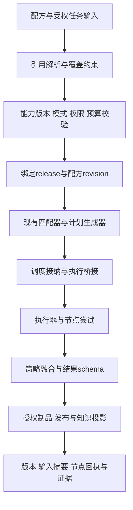

# 19 专家联盟低代码配方与全维动态配置

> EA-LC-19 · V1.0 · 2026-10-01 · 目标设计，延续18的模块与质量场景；现有实现仍见CURRENT和16总账。

## 1. 联盟配方作为版本化业务配置

联盟配方描述“使用哪些能力、按什么模式协作、怎样判断和交付”，引用已有任务/计划/专家/模型能力，不新建第二调度器。配方对象属于LC-D13/14/16，配置信封与生命周期引用 `docs/standards/lowcode-dynamic-configuration.md#model`。

| 配置项 | 可声明内容 | 实际执行owner/边界 |
|---|---|---|
| 需求与输入 | task_type、必填上下文、附件/实体引用 | M01/M07；身份与租户从受信上下文 |
| 专家选择 | domain/capability约束、limit、优先级、实际权重引用 | M02/M03；健康与登记状态分开 |
| 协作与计划 | 已支持模式、任务/节点模板、input/output映射 | M03/M04；不支持节点拒绝，不生成假成功 |
| 模型与提示词 | provider/model/prompt引用、参数档 | AI/配置owner；秘密仅引用 |
| 工具与知识 | 已注册能力ID、检索范围、来源关系 | 适配owner；任务授权与网络范围校验 |
| 结果融合 | 已注册策略、格式schema、分歧保留 | M06；置信度不作为准确率或审批依据 |
| 接纳与预算 | 每任务/专家/租户预算档、超时、队列、重试 | M04/M05/宿主；取安全约束交集 |
| 交付与关联 | 制品类型、项目/会话归属、知识发布意图 | M07/M08/M09；受控发布门禁 |
| 运营与验收 | 观测等级、脱敏、保留、质量样例引用 | M10/开发联盟；不能关停P0门禁 |

先提供“受控业务模板+允许覆盖字段”，再提供完整画布编辑。用户默认只改目标/领域/预算/交付格式，专家权重/节点适配等高级配置按角色披露。

## 2. 执行与版本固定

release、recipe_revision、plan_version、attempt_id分别表达发布、配置、执行计划和尝试；用映射适配现有DTO，不能仅在前端保存几个字段就宣称后端支持快照。任务提交/幂等/计划落盘需要同一接纳证据。

已运行任务不被动态提示词/权重改动悄悄重规划；用户修改配方默认影响新任务。显式重新规划创建新plan_version并保存原因、原结果与副作用边界。暂停/取消仍按实际能力执行，不能把配置动作当作执行回执。

## 3. 配置生效与能力缺口

| 类别 | 已有基础/本轮复核范围 | 本设计需要的补齐 |
|---|---|---|
| 匹配 | 主路径健康项默认权重0.05，健康/不健康评分1.0/0.2；备用路径权重0.15，评分1.0/0.3 | 配方绑定精确权重版本、完整候选过滤解释 |
| 模型配置 | config-core与每专家LLM路由设计/代码基础 | 配方发布包、秘密与能力版本完整绑定需核验 |
| DAG | 已有执行/融合/实例并发护栏 | 配方编译、计划持久快照、配额与恢复证据 |
| 图谱与页面 | 已有CRUD与模块化前端 | 远程页面纯JSON、画布编辑和配方版本联动 |
| 流程与审批 | 平台各引擎有不同能力 | 按适配器能力表接线，不能统一宣称全支持 |
| 发布 | 已有发布治理与制品能力 | 联盟配方配置包的原子版本闭包与回滚 |

表中“基础”不是本轮重新跑E2E的验收结果。具体现状以 `docs/expert-alliance/CURRENT-ARCHITECTURE.md#matching-20261001`、16总账和代码核验裁决。

## 4. 开发联盟的逐目录推进顺序

先完成LC-STD-001与目录矩阵→meta控制面→API契约→配置存储→业务模块装配→页面绑定→联盟配方→发布/恢复。每一步先设计输入输出、复用点、异常路径和验收，再做实施。产品、算法、开发角色分别核业务价值、质量/成本、边界与运行证据；评审记录不伪装为已召集组织会签。

首个闭环选“标准实体表单+规则审查+联盟证据+受控交付”，不同时开发新模型、新审批引擎、新图数据库或通用脚本语言。正常路径与跨租户/重复提交/缺依赖/模型不可用/版本冲突/重启恢复一起验收。

## 5. 质量关联

LC-Q01–12映射18的EA-Q01–16：配置确定性→任务版本可复现；权限/秘密→租户隔离；快照/发布→幂等与恢复；页面配置→可用性/无障碍；预算档→接纳与模型成本。每条配方配至少一项业务正确性评测、一个拒绝路径和一个恢复场景，不用“配置保存成功”充当业务完成。
