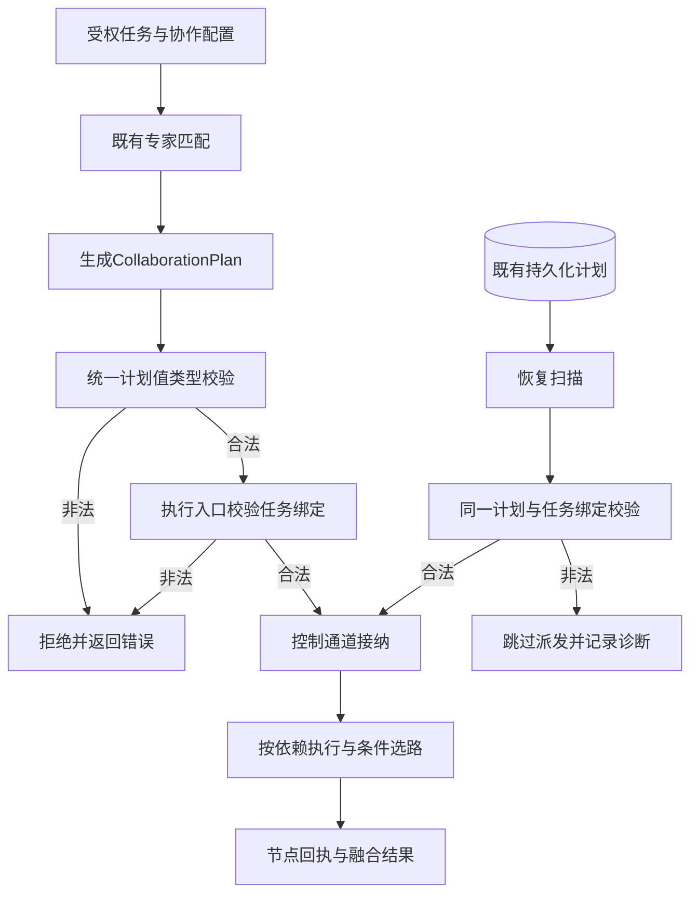

# 20 业务计划与执行流程归一化

> EA-FLOW-20 · V1.0 · 2026-10-01 · owner：联盟协议/调度/执行维护角色。
> 范围：本轮已实现计划契约与执行接纳增量；跨进程部署、真实模型与配置发布不由本文件宣告验收。

## 1. 问题与设计结论

计划是业务协作的执行契约。原先校验主要覆盖依赖存在与环，空计划、错误任务绑定、非法路由或异常融合权重可能进入执行；并行根节点的拓扑顺序还取决于HashMap遍历。配置保存或JSON可解析不能作为业务可执行的证据。

统一方式：沿用CollaborationPlan、Node和PlanDynamicRoute，在既有通用协议的值类型校验中收口规则。计划生成器调用validate；执行接纳和启动恢复调用validate_for_task。调度负责生成与接纳，执行负责节点与结果，存储适配负责持久化，不新增第二套调度引擎、流程DSL或配置微服务。

上游来源：[模块设计](docs/expert-alliance/18-modular-product-design.md#modules)、[低代码配方](docs/expert-alliance/19-lowcode-dynamic-configuration.md#recipe)、[配置发布模型](docs/standards/lowcode-dynamic-configuration.md#lifecycle)。本轮推进EA-W03的计划契约和EA-W05的恢复入口验证，未完成这两项的全部交付。

## 2. 统一业务处理流程

图中计划/执行/恢复校验与既有匹配执行为代码路径；“受权任务”依赖既有身份与资源授权。本次校验不代替租户授权、注册能力检查、预算或发布审批。

动态模式不是任意脚本：使用已有字段路径、六种比较运算符和分支节点ID。分支节点必须在决策节点的依赖后继中，允许串行/分层后继；不能在决策前独立启动。分支选择仍由现有执行器完成，未选分支标Skipped。

## 3. 模块边界与接口

| 模块 | 拥有的行为 | 输出与消费者 |
|---|---|---|
| common-proto | 计划、节点、路由、融合权重的值类型约束；validate/validate_for_task | 统一合法性结果；planner/executor消费 |
| scheduler-core | 专家匹配、七种协作模式规划、生成后校验 | 合法计划与既有执行桥接 |
| alliance-core/dag | 通用拓扑算法、重复依赖拒绝、确定性根节点顺序 | 拓扑顺序与层；独立算法消费者 |
| executor-core | 任务绑定接纳、节点执行、路由、回执/融合、恢复入口 | 执行状态与融合结果 |
| executor-svc | 传输认证、错误映射和存储端口装配 | 既有InvalidPlan映射HTTP 400 |
| state sink | 提供原始计划和任务，维护数据归属 | 恢复输入；不自行定义另一套计划合法性 |

协议不依赖core/svc；没有新增crate、依赖或HTTP端点。JSON字段及旧payload可选字段默认值保持兼容；以前被接受的非法计划会被明确拒绝，这属于行为收紧。

## 4. 校验规则与失败处理

1. 至少一个节点，plan.version为正数；节点/专家ID非空，节点ID唯一。
2. 节点task_id与计划一致，执行/恢复的task_id与计划一致。
3. 依赖存在、不重复、无环；通用DAG算法也拒绝空白/重复节点ID和重复依赖。
4. 融合权重键非空，数值有限且非负；允许空权重沿用已有等权默认。
5. 动态路由仅用于Dynamic模式，决策节点存在且每个决策最多一条规则。
6. 运算符限定eq/neq/gt/gte/lt/lte，字段路径各段非空；分支存在、无重复/交集，并位于决策依赖后继。

生成错误沿用PlanGenerationFailed；新执行非法输入沿用InvalidPlan，入队前返回。恢复遇到非法持久化计划不派发，记录任务和原因，并继续扫描其他任务；不删除或重写原存储。此策略能保留诊断证据，但还需运营侧处理被跳过的任务。

拓扑排序保留声明顺序确定根节点，邻接关系同样按声明顺序构建。同一节点数组与依赖产生相同拓扑与分层；调整节点声明顺序可改变同层顺序。此保证不代表模型输出、并行完成时间或所有融合策略结果可复现。

## 5. 验收与实施边界

契约测试覆盖空计划、零版本、重复ID、错误任务、空专家、重复/缺失依赖、环、负值/非有限权重、未知运算符、非法路径、缺失决策/分支、重复/重叠分支、提前执行分支和重复决策；旧JSON省略动态路由与权重仍通过。

执行测试验证错误任务在入队前被拒绝，恢复中的错误计划不入队且正常计划仍可恢复。集成测试验证Parallel/Sequential/Voting/Hierarchical/Debate/Iterative/Dynamic全部走同一校验与执行入口，节点终态正常、动态兜底未选分支跳过、融合结果存在。节点调用为测试执行器，无真实模型请求。

关联质量场景：LC-Q03/06、EA-Q02/03/06。跨租户授权、故障恢复副作用对账、原子配置发布、release/recipe/plan精确版本闭包、容量基准仍分别验收，不能由上述测试推定完成。

代码来源：common-proto的types.rs、alliance-core的dag.rs、scheduler-core的planner.rs、executor-core的dag_engine.rs；可重复验证结果见reports/data/20261001-flow-implementation-checks.json，交付结论见reports/markdown/20261001-normalized-flow-implementation.md。
