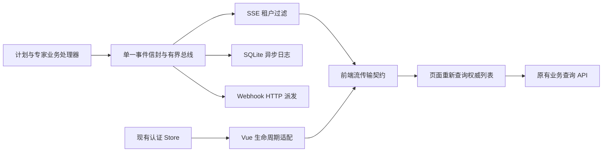
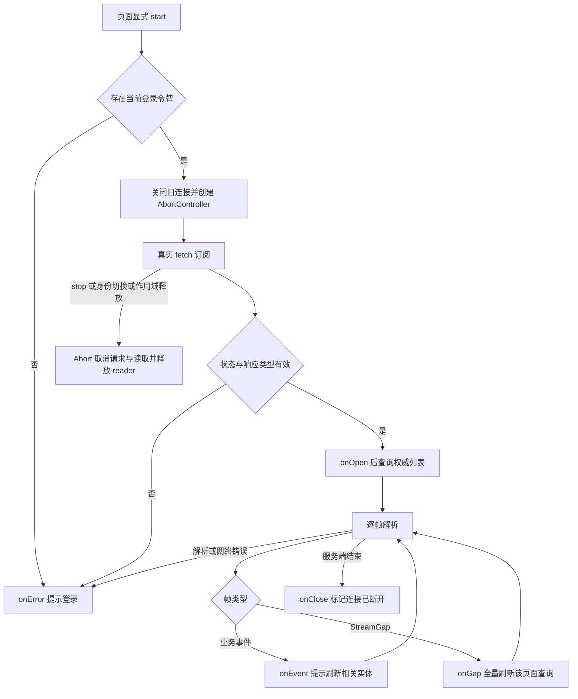

# 专家联盟事件交付与恢复契约

核验日期：2026-10-02。本文是事件订阅主题的增量权威；整体实现仍以 [当前架构](CURRENT-ARCHITECTURE.md) 为准。产品模块与需求编号沿用 [企业功能登记](../modules/enterprise-capabilities/README.md)，不另建一套模块目录。

## 1. 模块边界与单一事实源

| 模块 | 唯一职责 | 权威实现 | 不承担的职责 |
|---|---|---|---|
| 计划、专家业务处理器 | 校验身份、推进业务状态、发布事实事件 | `experts_orchestration.rs` / `experts_registry.rs` | 不以投递成功决定业务成功 |
| 进程内事件总线 | 有界广播同一事件信封 | `experts_events.rs::EventBus` | 无持久队列、跨实例路由或补发保证 |
| SSE 出口 | 认证租户过滤、业务命名帧、缺口通知 | `experts_streams.rs` | 不执行任务、不提供历史重放 |
| 前端传输契约 | Bearer 身份、UTF-8 分帧、资源释放、缺口回调 | `contract/event-stream.js` | 不持有业务列表或生成业务结果 |
| Vue 生命周期适配 | 从现有认证 store 取令牌，身份变化或组件释放时停止 | `composables/useAllianceEventStream.js` | 不自动订阅任何视图 |
| 事件日志消费者 | 异步写 SQLite 可观察轨迹 | `spawn_event_log_consumer` | 不是与业务写入原子提交的 outbox |
| Webhook 派发 | 对内存登记的同租户目标真实 HTTP POST | `spawn_webhook_dispatcher` | 当前没有持久订阅、签名、死信队列或可靠投递保证 |

## 2. 请求与事件契约

入口为 `GET /api/alliance/events/stream`。原生 fetch 使用端点目录中的完整 `/api` 路径；`requestPath()` 为 Axios 去除 `/api` 的相对路径，不能直接用于原生 fetch。必须携带 `Authorization: Bearer <当前令牌>`；缺少身份时前端不发请求，后端认证仍为最终裁决。租户来源为后端认证身份，不接受查询参数租户覆盖。

业务帧字段为 `id: <真实事件ID>`、`event: <类型名>`、`data: <JSON信封>`。类型目前仅 `PlanCreated`、`PlanStatusChanged`、`ExpertRegistered`、`ExpertDisabled`。信封包含 `id/type/source/tenant/occurred_at` 及该类型载荷。`id` 用于关联与排查，不代表支持 `Last-Event-ID` 重放。心跳注释不触发业务回调。

当 broadcast 积压导致缺口，发送 `event: StreamGap` 与 `{"reason":"lagged","action":"refresh"}`；不暴露全局丢弃数量，避免泄漏其他租户事件活动量。前端交给 `onGap`，不得把它解释为业务完成。序列化失败记错误并跳过，不能发送空对象冒充有效业务信封。

前端支持 LF、CRLF、CR、跨网络分块和多行 data；仅去掉字段冒号后的一个协议空格，保留业务文本。单帧上限为 1 Mi 字符，畸形 JSON、无效 UTF-8、错误响应类型和 HTTP 失败关闭连接并调用 `onError`。不生成替代结果。

## 3. 生命周期与业务恢复流程

接口支持 `onEvent/onOpen/onGap/onClose/onError` 和 `start/stop`。重复 start 取消前一连接；旧连接不得回调到新订阅。正常 stop 不当作网络错误。页面应在首次连接和重连时刷新权威列表，收到缺口后再次刷新；状态以查询 API 为准。当前没有自动重连，调用方必须显式管理连接状态、重试退避与用户提示。模块目前尚未由业务视图调用，不标记页面实时刷新已上线。

## 4. 验收要求与未完成项

| ID | 验收要求 | 本轮状态 |
|---|---|---|
| EA-EVT-01 | 完整端点、真实登录令牌、缺少身份不发请求 | 已实现；Node 真实 TCP 验证 |
| EA-EVT-02 | 分帧、中文、空白、多行 data、异常与帧上限确定 | 已实现；纯函数验证 |
| EA-EVT-03 | 重复启动、停止和旧结果隔离 | 已实现；Node 真实 TCP 验证；Vue 身份钩子编译检查 |
| EA-EVT-04 | 同租户事件、真实 ID、明确缺口且不泄漏全局数量 | 已实现；真实 broadcast / SSE body 验证 |
| EA-EVT-05 | 页面刷新、断线可见、退避、恢复后的状态一致 | 待接入视图及真实浏览器验收 |
| EA-EVT-06 | 业务写入与 outbox 原子提交、跨实例消费、去重、重放 | 待开发；现有日志消费者不满足 |
| EA-EVT-07 | Webhook 管理授权、出站目标策略、防重定向与 DNS 重绑定、签名、持久订阅、死信与幂等 | 待开发；现有仅 URL 前缀校验和租户隔离，不满足企业生产门槛 |

优先顺序：先完成 Webhook 授权与出站边界，再接入页面可观察恢复；可靠事件交付基于持久 outbox 单独落地。前端不得拿 SSE 成功证明业务成功、Webhook 成功或外部模型成功。无跨实例、远程 CI 和完整浏览器端到端结论。

本轮证据见 [验证报告](../../reports/markdown/20261002-alliance-event-contract.md)。需求追踪关联 EM-09 执行、EM-10 协作与 EM-26 运维；这些模块整体仍按企业登记中的独立验收项逐项交付。
