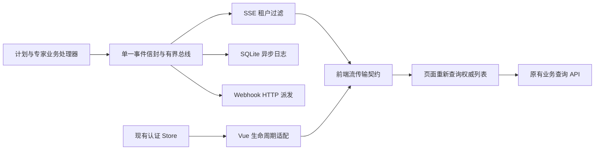
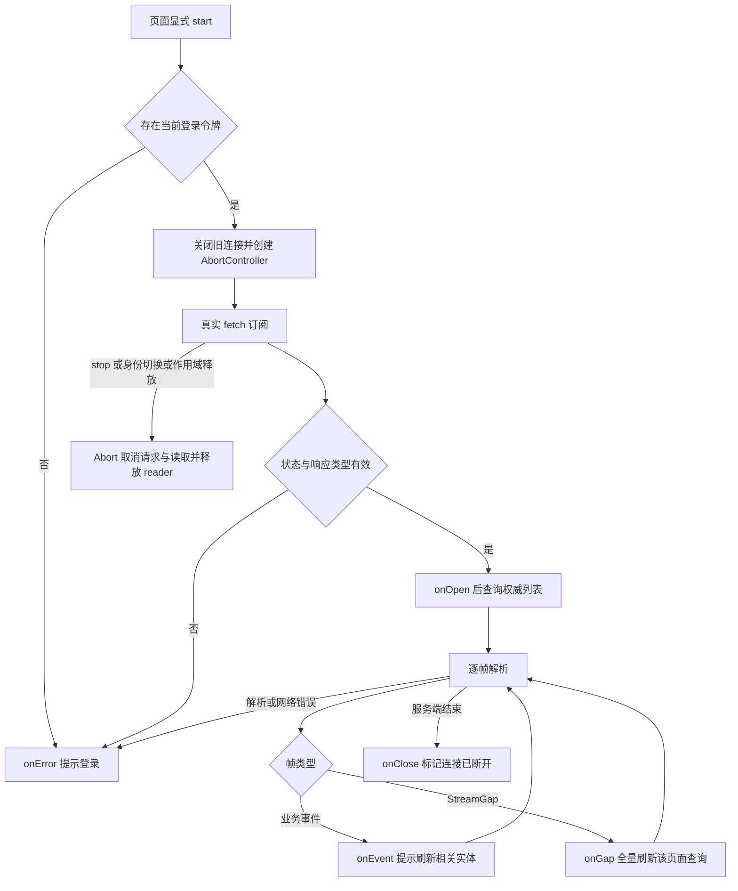
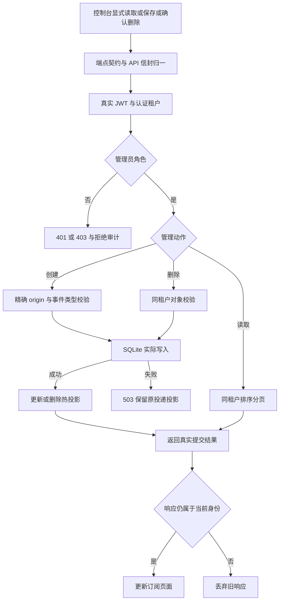

# 专家联盟事件交付与恢复契约

核验日期：2026-10-03。本文是事件订阅主题的增量权威；整体实现仍以 [当前架构](CURRENT-ARCHITECTURE.md) 为准。产品模块与需求编号沿用 [企业功能登记](../modules/enterprise-capabilities/README.md)，不另建一套模块目录。

## 1. 模块边界与单一事实源

| 模块 | 唯一职责 | 权威实现 | 不承担的职责 |
|---|---|---|---|
| 计划、专家业务处理器 | 校验身份、推进业务状态、发布事实事件 | `experts_orchestration.rs` / `experts_registry.rs` | 不以投递成功决定业务成功 |
| 进程内事件总线 | 有界广播同一事件信封 | `experts_events.rs::EventBus` | 无持久队列、跨实例路由或补发保证 |
| SSE 出口 | 认证租户过滤、业务命名帧、缺口通知 | `experts_streams.rs` | 不执行任务、不提供历史重放 |
| 前端传输契约 | Bearer 身份、UTF-8 分帧、资源释放、缺口回调 | `contract/event-stream.js` | 不持有业务列表或生成业务结果 |
| Vue 生命周期适配 | 从现有认证 store 取令牌，身份变化或组件释放时停止 | `composables/useAllianceEventStream.js` | 不自动订阅任何视图 |
| 事件日志消费者 | 异步写 SQLite 可观察轨迹 | `spawn_event_log_consumer` | 不是与业务写入原子提交的 outbox |
| Webhook 管理 | 管理员角色、认证租户、分页查询、SQLite 提交后更新热投影 | `experts_streams.rs` / `EventBus` | 不授予跨租户管理、不以日志代替提交 |
| Webhook 出站策略 | 运维显式授权精确 origin，创建和投递均校验 | `webhook_policy.rs` | 不由租户管理员自行授权出站源、不提供 DNS 地址钉住 |
| Webhook 派发 | 对恢复后的同租户目标真实 HTTP POST，禁止重定向和环境代理 | `spawn_webhook_dispatcher` | 没有签名、死信队列或可靠投递保证 |
| 控制台订阅模块 | 契约端点 → API 严格投影 → 独立 Pinia store → 订阅组件 | `WebhookSubscriptions.vue` / `alliance-webhooks.store.js` | 不自动创建目标、不自动重试创建，不将保存当作送达 |

## 2. 请求与事件契约

入口为 `GET /api/alliance/events/stream`。原生 fetch 使用端点目录中的完整 `/api` 路径；`requestPath()` 为 Axios 去除 `/api` 的相对路径，不能直接用于原生 fetch。必须携带 `Authorization: Bearer <当前令牌>`；缺少身份时前端不发请求，后端认证仍为最终裁决。租户来源为后端认证身份，不接受查询参数租户覆盖。

业务帧字段为 `id: <真实事件ID>`、`event: <类型名>`、`data: <JSON信封>`。类型目前仅 `PlanCreated`、`PlanStatusChanged`、`ExpertRegistered`、`ExpertDisabled`。信封包含 `id/type/source/tenant/occurred_at` 及该类型载荷。`id` 用于关联与排查，不代表支持 `Last-Event-ID` 重放。心跳注释不触发业务回调。

当 broadcast 积压导致缺口，发送 `event: StreamGap` 与 `{"reason":"lagged","action":"refresh"}`；不暴露全局丢弃数量，避免泄漏其他租户事件活动量。前端交给 `onGap`，不得把它解释为业务完成。序列化失败记错误并跳过，不能发送空对象冒充有效业务信封。

前端支持 LF、CRLF、CR、跨网络分块和多行 data；仅去掉字段冒号后的一个协议空格，保留业务文本。单帧上限为 1 Mi 字符，畸形 JSON、无效 UTF-8、错误响应类型和 HTTP 失败关闭连接并调用 `onError`。不生成替代结果。

## 3. 生命周期与业务恢复流程

接口支持 `onEvent/onOpen/onGap/onClose/onError` 和 `start/stop`。重复 start 取消前一连接；旧连接不得回调到新订阅。正常 stop 不当作网络错误。页面应在首次连接和重连时刷新权威列表，收到缺口后再次刷新；状态以查询 API 为准。当前没有自动重连，调用方必须显式管理连接状态、重试退避与用户提示。模块目前尚未由业务视图调用，不标记页面实时刷新已上线。

## 4. 验收要求与未完成项

| ID | 验收要求 | 本轮状态 |
|---|---|---|
| EA-EVT-01 | 完整端点、真实登录令牌、缺少身份不发请求 | 已实现；Node 真实 TCP 验证 |
| EA-EVT-02 | 分帧、中文、空白、多行 data、异常与帧上限确定 | 已实现；纯函数验证 |
| EA-EVT-03 | 重复启动、停止和旧结果隔离 | 已实现；Node 真实 TCP 验证；Vue 身份钩子编译检查 |
| EA-EVT-04 | 同租户事件、真实 ID、明确缺口且不泄漏全局数量 | 已实现；真实 broadcast / SSE body 验证 |
| EA-EVT-05 | 页面刷新、断线可见、退避、恢复后的状态一致 | 待接入视图及真实浏览器验收 |
| EA-EVT-06 | 业务写入与 outbox 原子提交、跨实例消费、去重、重放 | 待开发；现有日志消费者不满足 |
| EA-EVT-07 | Webhook 管理授权、出站目标策略、防重定向与 DNS 重绑定、签名、持久订阅、死信与幂等 | 部分实现：授权、精确 origin、禁重定向、持久提交及控制台已核验；DNS 地址钉住、签名、outbox、死信、幂等仍待开发 |

后续优先顺序：出站 DNS 地址钉住与签名、持久 outbox 和投递幂等，再验证跨实例消费与恢复。前端不得拿 SSE 成功证明业务成功、Webhook 成功或外部模型成功。无跨实例、远程 CI 和完整浏览器端到端结论。

本轮证据见 [验证报告](../../reports/markdown/20261002-alliance-event-contract.md)。需求追踪关联 EM-09 执行、EM-10 协作与 EM-26 运维；这些模块整体仍按企业登记中的独立验收项逐项交付。

## 5. 2026-10-03 Webhook 管理增量与业务流程

三个管理动作共享现有 JWT 身份和 `RbacAction::ManageWebhooks`：GET/POST `/api/alliance/events/webhooks`、DELETE `/api/alliance/events/webhooks/:id`。未认证 401；非 `super_admin/tenant_admin` 角色 403；跨租户删除 404。租户只取认证上下文，超管也不通过请求参数切换租户。拒绝复用现有 RBAC 审计。

创建体为 `{url,event_types}`；URL 上限 2048 字节，HTTP(S)、无用户信息、查询参数或 fragment；过滤值只收四种真实事件，空数组表示全部。出站源配置及部署操作以 [部署模板 §2.6](09-deployment-templates.md#26-网关本地存储附件非联盟专属按需) 为权威。授权按 scheme/host/effective port 精确匹配，拒绝子域和端口漂移；仅创建、投递允许的 origin，由运维环境配置控制，默认拒绝全部。运维可显式授权内部接收源，因此这不是「所有内网地址永久禁止」策略；域名目标仍依赖受信 DNS，未做解析后 IP 钉住。

GET 返回 `{webhooks,total}`，按 `created_at,id` 排序，支持既有 `page/page_size`，默认 20、上限 200。对象 `{id,tenant,url,event_types,created_at}` 由前端严格投影为 `{id,tenantId,url,eventTypes,createdAt}`；格式错误显式失败。列表来自本进程投递投影，不能据此声称跨进程一致性。

状态提交与事件投递是两条流程：SQLite 提交后才变更本进程目标；重建 state 从库恢复合法过滤器。过滤 JSON 损坏时跳过并记录错误，不能退化为空数组而扩大订阅。投递逐事件选取同租户、类型匹配目标，再检查当前 origin 策略，真实 POST；client 禁用重定向和环境代理，5 秒超时，最多两次尝试，中间等待 300ms。删除不会撤销已经取得目标快照或进入网络的请求。启动读库仍有旧 best-effort 路径，不能宣称依赖故障时启动健康已闭环。

控制台通过 `WebhookSubscriptions` 与原任务、调度模块融合；没有额外路由或第二套权限系统。显式读取订阅，保存经真实接口确认后才清空表单，删除需要二次确认。已确认的写入与后续刷新失败分别提示；令牌、租户、用户切换清空地址和待删除确认，旧响应不进入新身份。创建请求丢失响应后仍可能出现提交不确定，需要重新读取核对，当前尚无创建幂等键。

| 验收项 | 实际证据 | 当前边界 |
|---|---|---|
| EA-WH-01 管理授权与租户隔离 | 真实 JWT/TCP，普通用户 403、异租户 404；伪造前端角色仍被服务端拒绝 | 本租户管理员管理，不含个人 ACL |
| EA-WH-02 写失败不假成功 | SQLite INSERT/DELETE 触发器真实报错，503、投影及重载状态不变 | 同进程热投影，不是分布式事务 |
| EA-WH-03 出站源策略 | 未配置、其他端口、凭据、query、fragment、非 HTTP 协议 400；真实 302 接收端不被跟随 | DNS 钉住与签名尚未实现 |
| EA-WH-04 合法过滤与持久恢复 | 实际 A 事件送达，B 租户及不匹配类型不投递；损坏过滤不扩大订阅；删除后重载不恢复 | 无可靠队列、恢复不等于进程崩溃测试 |
| EA-WH-05 前后端融合 | 实际 Pinia/Axios → TCP → Rust → SQLite；切租户迟到响应、CRUD、注销不发请求 | 真实传输链路，尚无完整浏览器交互验收 |

本轮增量证据见 [Webhook 模块报告](../../reports/markdown/20261003-webhook-management.md)。本模块只是 EM-02/EM-10/EM-26 的部分验收，不提升为全模块完成。后续还需创建配额/限流、幂等、独立健康状态及存储 IO 调度，解决当前同步 SQLite 与串行投递在压力下的阻塞。
