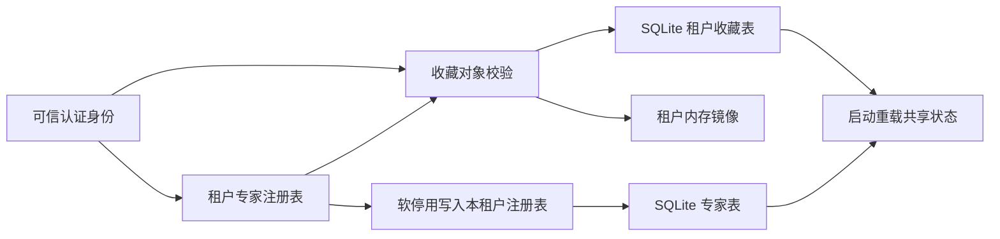
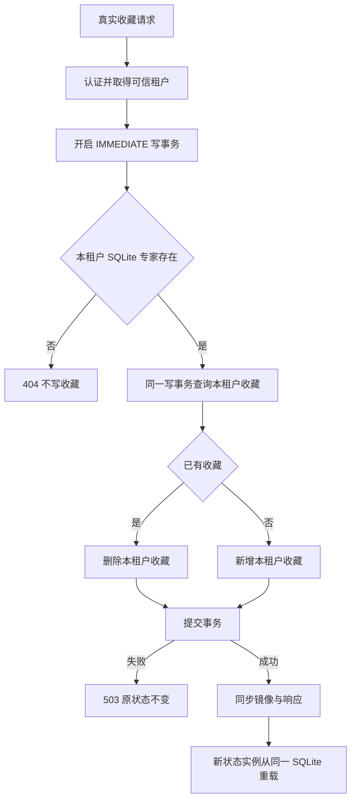
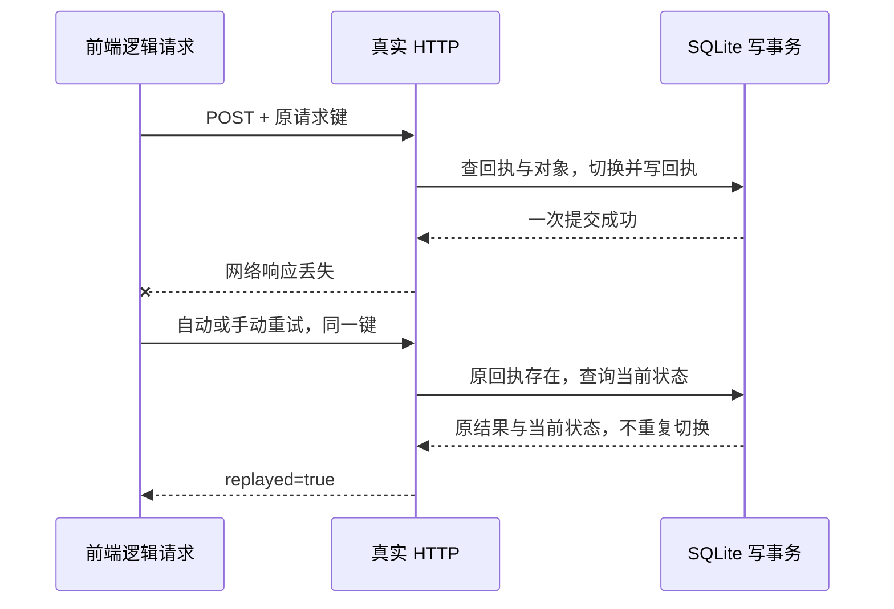
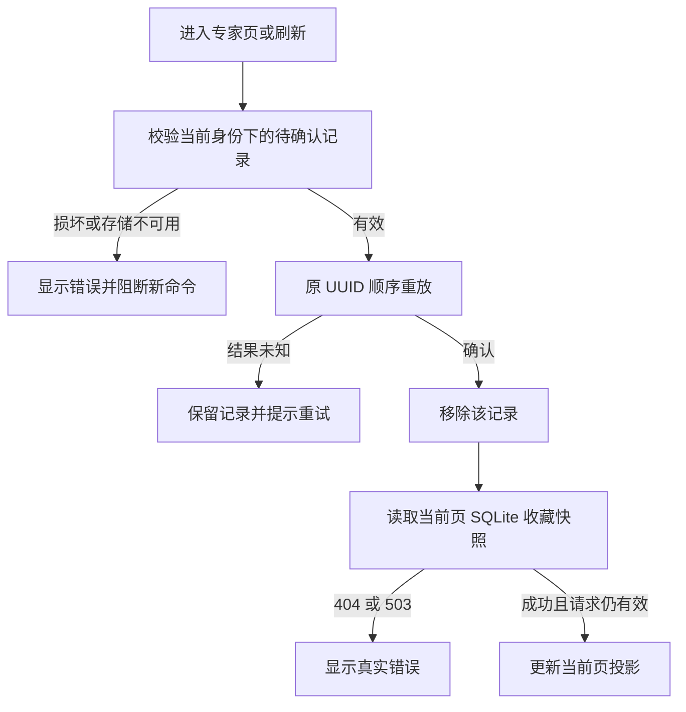

# 专家对象与收藏的租户契约

核验日期：2026-10-03（收藏事务增量；历史证据保留）。此主题沿用 [模块登记](../modules/enterprise-capabilities/README.md) EM-06 专家注册与能力、EM-10 专家协作；总体架构入口为 [CURRENT-ARCHITECTURE](CURRENT-ARCHITECTURE.md)。本文修正旧稿中“收藏是全局内存 HashSet、重启即失”的过期表述。

## 模块与数据权威

| 边界 | 当前职责 | 核验来源 |
|---|---|---|
| 认证中间件 | JWT 身份及冲突租户头检查；匿名请求拒绝 | `auth_middleware`，真实 HTTP 验证 |
| 专家注册模块 | 按租户创建、查询和软停用；跨租户对象返回 404 | `experts_registry.rs` |
| 收藏扩展模块 | 可信租户、后台阻塞工作、提交成功后更新镜像；404/503 显式错误 | `experts_ext.rs::toggle_expert_favorite` |
| 收藏事务仓储 | 本租户 SQLite 对象校验、读取、切换、提交为单一 IMMEDIATE 事务 | `favorite_repository.rs` |
| 共享状态 | 收藏为 `tenant -> HashSet<expert_id>`；同租户共享，并非用户个人收藏 | `ExpertsSharedState.favorites` |
| SQLite | 收藏查询及写穿，启动时重载收藏和专家注册表 | `experts_db.rs` / `ExpertsSharedState::new()` |
| 前端契约 | 反映实际租户参数、持久化路径及准确证据锚点 | `contract/contract.test.js` / `registry.js` |

## 业务流程

`POST /api/experts/:id/favorite` 使用认证身份所属租户。客户端不得通过收藏 ID 或请求头选择其他租户。在 `spawn_blocking` 中开启 SQLite IMMEDIATE 事务，同一事务内校验本租户专家存在、读取收藏、切换并提交；随后更新本实例镜像并返回已提交方向。对象不存在及跨租户均为 404，不写入收藏表。存储打开、锁等待耗尽、语句或提交失败返回 503，镜像保持原值；详细错误只写服务日志。成功响应表示事务已提交，不是 best-effort 尝试。

停用为软删除：同租户专家的 enabled 改为 false 后，写入本租户注册表。跨租户删除返回 404；重载后停用标记仍为 false，其他租户记录不得改变。收藏对象校验仅判断存在，未引入“停用专家收藏一律不可清理”的限制。

## 已验证与仍需开发

| 要求 | 本轮验证 |
|---|---|
| EA-OBJ-01 缺身份与冲突租户头拒绝 | 真实 JWT、TCP 验证 401/403 |
| EA-OBJ-02 外租户与不存在对象不可收藏 | 回归测试先复现 HTTP 200 缺陷，再验证 404；重载验证无非法收藏 |
| EA-OBJ-03 两租户同 ID 收藏互不影响 | 两租户各真实注册同 ID；一方取消，重载后另一方仍保留 |
| EA-OBJ-04 软停用恢复且不修改其他租户 | 真实 DELETE 后重载注册表核对 enabled |
| EA-OBJ-05 前端事实与来源同步 | 120 项原有契约检查恢复通过，不删测试或放宽规则 |

2026-10-03 已完成 EA-OBJ-06 存储失败真实回执与镜像不变、EA-OBJ-07 同一数据库文件上独立连接原子切换。12 个真实独立连接并发验证无丢失更新，真实 SQLite 触发器验证插入/删除失败回滚，真实 HTTP 验证 503。旧的 best-effort upsert/delete 辅助函数保留供旧调用方使用，HTTP 收藏切换已不再调用。

保证范围为共享同一 SQLite 文件的事务写入；不意味着不同主机各自数据库的分布式一致，也没有实际多进程压力或性能 SLO 结论。无请求键的旧 toggle 仍非幂等；带键命令的行为见下节。预约仍使用旧 user_id 与列表语义；完整浏览器、个人偏好和远程 CI 未完成。

验证与剩余项记录于 [本轮报告](../../reports/markdown/20261002-alliance-contract-reconciliation.md)。

事务增量证据见 [2026-10-03 验证报告](../../reports/markdown/20261003-favorite-transactions.md)。

## 幂等回执与客户端恢复（2026-10-03）

EA-OBJ-08：原接口接收可选 `Idempotency-Key`，格式为 1–128 字节 ASCII 字母数字及 `-_.:`。新前端每个逻辑操作创建安全 UUID；同一个尚未确认的操作必须沿用同一键，不能每次重试生成新键。没有键的旧调用保留原 toggle 行为，不宣称重试安全。

SQLite `favorite_request_receipts` 以 `(tenant_id, actor_id, request_key)` 为主键，保存专家 ID、首次结果和提交时间。回执和收藏切换在同一写事务提交。已存在回执则不再修改收藏；同一作用域的键指向其他专家返回 409。其他用户或租户可使用同名键；请求不能自行指定 actor 或 tenant。回执插入失败会回滚收藏切换，键仍可在故障恢复后重试。

| 响应字段 | 含义 |
|---|---|
| favorite / action | 该逻辑请求首次提交时的操作结果，重放保持原值 |
| updated_at | 该逻辑请求首次提交时间，重放保持原值 |
| current_favorite | 此次事务观察到的当前状态，可能已被后续操作改变 |
| replayed | 是否返回已有回执 |

EA-OBJ-09：前端 API 将键放入 HTTP 请求配置，允许 Axios 使用同一配置重试该 POST。归一化层使用 `current_favorite` 更新视图镜像；不能用历史 favorite 覆盖后续操作。store 保存结果未知的尝试，用户再次点击复用原键；明确 4xx 拒绝才释放该尝试。重复点击在途操作不再次发请求。身份切换或退出清空内存尝试与本地投影，旧响应不得回填；持久待确认记录按原租户和用户隔离保留，只有原身份再次进入才恢复。同一已知用户/租户的令牌刷新保留尝试，但丢弃旧连接返回值。

EA-OBJ-08/09 已通过独立 SQLite 连接并发、重开数据库、冲突、回执触发器回滚，以及真实 Pinia/Axios/Rust JWT/SQLite 链路验证。TCP 故障代理转发到生产路由后断开实际连接，未替换业务服务或制造业务成功响应。该验证是 store 与传输联调，不等于真实浏览器 DOM 验收。

历史幂等增量证据见 [幂等联调报告](../../reports/markdown/20261003-favorite-idempotency.md)。刷新恢复增量以下节为准。

## 权威读取与刷新恢复（2026-10-03）

EA-OBJ-10：`POST /api/experts/favorites/query` 为只读批量查询，body 为 `{"expert_ids":["id"]}`。最多 100 条、单 ID 最多 256 UTF-8 字节，空数组返回空集合；超限返回 400。身份来自认证扩展，缺身份返回 401。所有 ID 必须存在于当前租户，任一外租户或不存在对象使整个批次返回 404，不输出部分结果。后台工作线程在同一 SQLite 读事务内复用预编译语句，响应 `items` 保持请求顺序，每项仅有 expert_id/favorite。读取故障返回 503，不能把故障伪装成“未收藏”。不依赖本进程镜像。

EA-OBJ-11：发出收藏命令前，把原 UUID 与 expertId 写入 sessionStorage，按可信用户信息中的租户和用户分别编码为键；不保存令牌、个人档案或已提交收藏状态。最多 100 条、原文最多 100000 字符。重建 store 后恢复记录，读取专家页前顺序重放原请求键；确认后移除记录，再读取本页真实快照。正在执行的用户命令不与恢复并行。列表请求有序号、身份代际与写入版本保护，过期响应不能覆盖新身份或正在变化的收藏。

损坏、重复 ID、非法 UUID、容量超限和浏览器存储不可用均阻断新命令并显示错误，不清空损坏记录后制造新请求键。回执已提交而本地删除失败时保留同一尝试，后续继续幂等确认。退出或换用户只切换命名空间；原身份尚未确认的记录保留，防止返回后误发新切换命令。sessionStorage 保证范围为同一浏览器标签页的刷新恢复；关闭标签页、其他设备和跨标签页协调不在本轮保证内。

本地 Set 和 favoriteCount 仅描述当前已加载页，不是全租户收藏总数；“只看收藏”也过滤当前页。收藏仍为租户共享状态，不是用户个人收藏。API 登记源为 actuator.rs，生成文档与前端端点表同步。真实联调及范围见 [刷新恢复报告](../../reports/markdown/20261003-favorite-recovery.md)。

剩余边界：回执没有自动过期/清理，清理策略必须保留已承诺的幂等窗口；当前不承诺时间窗口或无限容量。显式目标状态 API、全租户收藏分页、跨标签页协调、个人偏好、完整浏览器 DOM 验收与跨主机一致性仍待开发。
