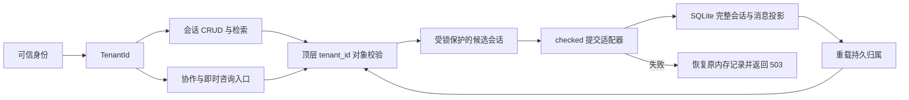
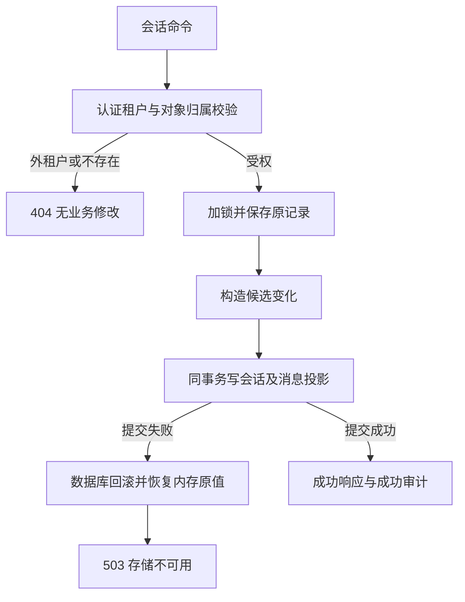

# 专家会话租户隔离与提交契约

2026-10-03。本主题细化 EM-02 可信身份和 EM-10 专家协作的会话接缝；模块登记沿用 [能力目录](../modules/enterprise-capabilities/README.md)。本文为会话对象授权、旧数据归属和成功回执的权威，不从模型调用、路由注册或历史测试总数推断已验收。

## 所有权与模块关系

| 模块 | 责任与权威 |
|---|---|
| 认证中间件 / TenantId | 从可信 UserInfo 解出租户；请求头、metadata、user_id 都不能改变所有权 |
| ExpertSession | 顶层 tenant_id 持久保存所属租户；无标记的历史 JSON 只属于 default |
| experts_session | 创建、列表、统计、详情、修改、删除、追加、相似检索、跨会话检索、导出和归档的对象授权 |
| experts_collaboration / experts_registry | 所有新会话创建入口写入可信租户；复用已有会话前和写锁内均校验所属租户；即时咨询不再只写内存 |
| 提交适配器 | 保持共享状态锁直到 SQLite 提交；失败恢复被修改的单条记录，返回 503 |
| experts_db | sessions.data_json 为完整会话权威，session_messages 为同事务投影；checked 接口传播事务失败 |
| 前端归一化 | 详情和列表统一读取 tenantId；仅展示服务端归属，不将它作为授权凭据 |

## 功能需求与处理流程

| ID | 判据 |
|---|---|
| EA-SES-01 | 普通创建、即时咨询和全部协作创建入口写入认证租户；请求 body 中伪造 tenant_id 或 metadata 不改变归属 |
| EA-SES-02 | 外租户的详情、更新、删除、追加消息、归档、会话内搜索和导出统一 404；不得修改该对象或透露消息 |
| EA-SES-03 | 列表分页分母、会话统计、全域搜索结果及扫描计数、专家概览活跃会话数均只计算当前租户 |
| EA-SES-04 | 历史无租户标记记录仅 default 可见；重载后的 HTTP 授权与重载前相同 |
| EA-SES-05 | 指定已有协作 session_id 时，在真实提供方调用前拒绝外租户对象；等待期间对象改变仍在写锁内复核 |
| EA-SES-06 | 创建、修改、追加、归档、删除或即时咨询的存储失败返回 503；内存恢复原记录，SQLite 会话与消息投影同事务回滚 |
| EA-SES-07 | 极大页码不能触发整数溢出 panic 或环绕回首页；共享分页偏移采用饱和乘法，越界返回空页并保留租户总数 |

读流程先取得可信租户，再过滤对象集合；筛选、分页、统计和搜索只能在该集合内执行。定向出口把外租户与不存在对象折叠为同一 404。旧数据不从标题、metadata 或请求身份猜测租户，避免把历史私密信息分配给碰巧首先读取它的人。

写流程在共享状态互斥锁内保留目标记录的原值，构造候选变化并提交完整会话与消息投影。checked 持久化成功才返回成功并继续成功审计；失败时回滚数据库事务、恢复原记录或移除未提交的新记录，日志记录原因，对客户端返回通用 503。保留单条原值，避免为回滚克隆整个会话集合。旧 best-effort 包装只为兼容旧直接调用保留，HTTP 会话与协作创建入口已走 checked 路径。

## 验证与限制

真实 JWT、TCP、生产路由和临时 SQLite 测试首先复现“外租户详情返回 200 与消息正文”，随后复现“真实事务故障仍返回 200”，再复现“即时咨询未提交仍返回 connected”。修复后验证各出口拒绝、旧数据归属、读分母、故障回滚、即时咨询独立落盘以及重载后的真实 HTTP 读取。提供方未被替换；没有真实 LLM 凭据的成功推理仍未验收。证据见 [模块验证报告](../../reports/markdown/20261003-module-verification.md)。

保证范围是本实例共享状态锁与同一个 SQLite 文件。当前仍是全量会话同步写入，跨进程旧快照覆盖、阻塞 IO、容量/SLO、个人会话权限、user_id/sender 字段语义、命令幂等和搜索复杂度限额尚未完整治理。会话与专家计数不在同一事务；成功审计也没有与业务提交建立持久 outbox。不能据此声明整个会话模块或全平台满足分布式生产标准。
