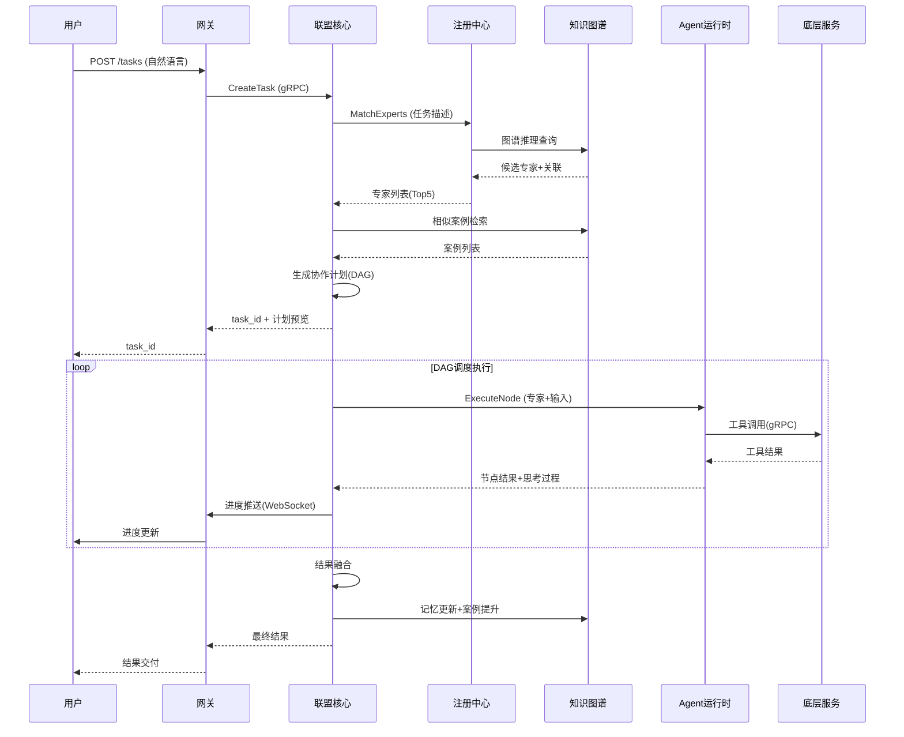

# 03 - 全路径业务流程

> 版本：v2.0 | 日期：2026-08-26 | 状态：企业级草案
>
> 前置：[00-需求分析](./00-requirements.md) | [01-架构设计](./01-architecture.md) | [02-领域模型](./02-domain-model.md)

---

## 一、端到端主流程

### 1.1 任务创建到结果交付（全路径）

```
用户                    网关                  联盟核心               注册中心           Agent运行时          知识图谱         底层服务
 │                       │                     │                      │                 │                   │                │
 │──POST /api/v1/tasks──>│                     │                      │                 │                   │                │
 │  (自然语言描述)        │──认证/限流/租户解析──>│                      │                 │                   │                │
 │                       │                     │                      │                 │                   │                │
 │                       │                     │──1.任务解析(NLP)────>│                 │                   │                │
 │                       │                     │   提取领域/能力/数据   │                 │                   │                │
 │                       │                     │                      │                 │                   │                │
 │                       │                     │──2.专家匹配──────────>│                 │                   │                │
 │                       │                     │   (图谱推理+评分)      │──图谱查询────────────────────────────>│                │
 │                       │                     │<──专家列表(Top N)─────│                 │                   │                │
 │                       │                     │                      │                 │                   │                │
 │                       │                     │──3.案例检索(相似任务)─────────────────────────────────────>│                │
 │                       │                     │<──案例列表+协作模式建议─────────────────────────────────────│                │
 │                       │                     │                      │                 │                   │                │
 │                       │                     │──4.生成协作计划(DAG)   │                 │                   │                │
 │                       │                     │   节点=专家调用         │                 │                   │                │
 │                       │                     │   边=数据依赖           │                 │                   │                │
 │                       │                     │                      │                 │                   │                │
 │<──task_id+计划预览────│<──返回task_id───────│                      │                 │                   │                │
 │                       │                     │                      │                 │                   │                │
 │                       │                     │──5.发布task.created事件(NATS)                                          │
 │                       │                     │                      │                 │                   │                │
 │                       │                     │──6.DAG调度执行────────>│                 │                   │                │
 │                       │                     │   拓扑排序+并行调度     │                 │                   │                │
 │                       │                     │                      │                 │                   │                │
 │                       │                     │──7.节点执行(调用专家)──>│                 │                   │                │
 │                       │                     │                      │──健康检查────────>│                   │                │
 │                       │                     │                      │<──健康状态────────│                   │                │
 │                       │                     │                      │                 │──ReAct循环──────>│                │
 │                       │                     │                      │                 │  理解→规划→执行    │                   │                │
 │                       │                     │                      │                 │  →观察→审核        │──gRPC工具调用──>│
 │                       │                     │                      │                 │                   │                │<──结果──────────│
 │                       │                     │                      │                 │<──节点结果+思考过程│                   │                │
 │                       │                     │<──节点执行完成──────────│                 │                   │                │
 │                       │                     │                      │                 │                   │                │
 │                       │                     │──8.进度推送(WebSocket)                                        │
 │<──进度更新(DAG状态)───│<──实时推送───────────│                      │                 │                   │                │
 │                       │                     │                      │                 │                   │                │
 │                       │                     │──9.依赖检查→调度下一批节点                                           │
 │                       │                     │   (循环7-9直到所有节点完成)                                          │
 │                       │                     │                      │                 │                   │                │
 │                       │                     │──10.结果融合(6种策略)  │                 │                   │                │
 │                       │                     │   投票/加权/拼接/择优/  │                 │                   │                │
 │                       │                     │   辩论/迭代             │                 │                   │                │
 │                       │                     │                      │                 │                   │                │
 │                       │                     │──11.质量评估           │                 │                   │                │
 │                       │                     │   完整性/一致性/准确性   │                 │                   │                │
 │                       │                     │                      │                 │                   │                │
 │                       │                     │──12.协作记忆更新────────────────────────────────────────>│                │
 │                       │                     │   工作记忆归档           │                 │                   │  更新边权重      │
 │                       │                     │   会话记忆更新           │                 │                   │  (频率/成功率)   │
 │                       │                     │   评分≥4→提升为案例      │                 │                   │  创建Case节点    │
 │                       │                     │                      │                 │                   │                │
 │                       │                     │──13.发布task.completed事件                                          │
 │                       │                     │                      │                 │                   │                │
 │<──最终结果────────────│<──返回结果───────────│                      │                 │                   │                │
 │                       │                     │                      │                 │                   │                │
 │──GET /tasks/{id}/result>│                     │                      │                 │                   │                │
 │<──结果+执行详情+导出───│<──返回───────────────│                      │                 │                   │                │
```

### 1.2 流程阶段定义

| 阶段 | 步骤 | 关键操作 | 超时 | 失败处理 |
|------|------|----------|------|----------|
| **P1 接收** | 1 | 认证/限流/租户解析/参数校验 | 1s | 返回4xx错误 |
| **P2 解析** | 2 | NLP任务解析/领域提取/能力识别 | 3s | 降级为关键词匹配 |
| **P3 匹配** | 3-4 | 专家匹配(图谱推理)+案例检索 | 2s | 降级为规则匹配 |
| **P4 计划** | 5 | DAG生成/依赖分析/模式选择 | 3s | 降级为单专家串行 |
| **P5 执行** | 6-9 | DAG调度/节点执行/进度推送 | 任务级超时(默认5min) | 节点重试/替代专家/降级 |
| **P6 融合** | 10 | 多结果融合/质量评估 | 10s | 降级为择优选择 |
| **P7 记忆** | 11-12 | 记忆更新/案例提升/图谱学习 | 5s(异步) | 失败不影响主流程 |
| **P8 交付** | 13 | 结果返回/导出/通知 | 2s | - |

---

## 二、核心子流程

### 2.1 专家匹配子流程

```
输入：任务描述（自然语言+结构化字段）
输出：专家列表（按评分排序，Top N）

┌─────────────────────────────────────────────────────────────┐
│  1. 任务解析                                                  │
│     ├── 提取领域标签（NLP分类 + 关键词匹配）                   │
│     ├── 提取能力需求（从描述中识别操作类型）                    │
│     ├── 识别输入/输出类型                                      │
│     └── 提取约束条件（超时/预算/质量）                          │
└──────────────────────────────┬──────────────────────────────┘
                               │
                               ▼
┌─────────────────────────────────────────────────────────────┐
│  2. 图谱推理（多跳遍历）                                       │
│                                                               │
│  MATCH (d:Domain) WHERE d.name IN $domains                   │
│  MATCH (d)<-[:operates_in]-(e:Expert)                        │
│  WHERE e.status = 'active' AND e.tenant_id IN ($tenant,'system')│
│  MATCH (e)-[:has_capability]->(c:Capability)                 │
│  WHERE c.name IN $required_capabilities                       │
│    AND $input_type IN c.input_types                           │
│  MATCH (c)-[:requires_tool {mandatory:true}]->(t:Tool)      │
│  WHERE t.service_name IN $healthy_services                    │
│                                                               │
│  可选：通过 solved_by 找到历史相似案例中的专家（加分）           │
└──────────────────────────────┬──────────────────────────────┘
                               │
                               ▼
┌─────────────────────────────────────────────────────────────┐
│  3. 综合评分（0-1）                                           │
│                                                               │
│  score = domain_match * 0.25                                 │
│        + capability_match * 0.30                             │
│        + health_status * 0.10                                │
│        + historical_performance * 0.15                       │
│        + collaboration_compatibility * 0.10                  │
│        + priority_bonus * 0.10                               │
│                                                               │
│  其中：                                                        │
│  - domain_match：领域匹配度（匹配数/需求数）                    │
│  - capability_match：能力匹配度（含熟练度加权）                 │
│  - health_status：健康状态（healthy=1, degraded=0.5）        │
│  - historical_performance：历史成功率+平均评分                 │
│  - collaboration_compatibility：与已选专家的协作历史             │
│  - priority_bonus：专家优先级/10                              │
└──────────────────────────────┬──────────────────────────────┘
                               │
                               ▼
┌─────────────────────────────────────────────────────────────┐
│  4. 排序与筛选                                                │
│     ├── 按 score 降序排列                                     │
│     ├── 过滤 score < 0.3 的专家（最低阈值）                    │
│     ├── 去重（同领域只保留Top 2，避免过度集中）                │
│     ├── 限制最大数量（默认5，可配置）                          │
│     └── 返回专家列表（含评分/匹配能力/匹配领域/健康状态）       │
└─────────────────────────────────────────────────────────────┘
```

### 2.2 协作计划生成子流程

```
输入：任务描述 + 匹配专家列表 + 相似案例
输出：CollaborationPlan（DAG）

┌─────────────────────────────────────────────────────────────┐
│  1. 协作模式选择                                              │
│                                                               │
│  if 用户指定模式 → 使用指定模式                                │
│  else if 有相似案例 → 参考案例的模式                          │
│  else → 自动选择：                                            │
│    - 任务可分解为独立子任务 → Parallel                        │
│    - 子任务有严格先后依赖 → Serial                            │
│    - 需要多视角决策 → Debate                                  │
│    - 任务复杂需要协调 → Hierarchical                          │
│    - 质量要求高需要审核 → Iterative                           │
│    - 中间结果不确定 → Dynamic                                 │
└──────────────────────────────┬──────────────────────────────┘
                               │
                               ▼
┌─────────────────────────────────────────────────────────────┐
│  2. 任务分解（生成节点）                                       │
│                                                               │
│  对每个匹配的专家，创建一个 Execute 节点：                     │
│    node_id = "node-{expert_id}-{index}"                      │
│    expert_id = 专家ID                                         │
│    inputs = 上游节点输出引用                                   │
│    outputs = 专家能力对应的输出类型                            │
│    timeout = 专家默认超时 or 任务约束                          │
│    retry_policy = 默认重试策略                                │
│                                                               │
│  特殊节点：                                                    │
│    - 多专家并行 → 添加 Parallel 网关节点 + Join 汇聚节点      │
│    - 需要融合 → 添加 Fusion 节点                              │
│    - 需要人工审核 → 添加 HumanReview 节点                     │
│    - 条件分支 → 添加 Condition 节点                           │
└──────────────────────────────┬──────────────────────────────┘
                               │
                               ▼
┌─────────────────────────────────────────────────────────────┐
│  3. 依赖分析（生成边）                                         │
│                                                               │
│  数据依赖：                                                    │
│    节点A的输出类型 ∈ 节点B的输入类型 → 创建 A→B 边            │
│    data_mapping = JSONPath 映射规则                           │
│                                                               │
│  控制依赖：                                                    │
│    Parallel 网关 → 所有并行分支                               │
│    Join 汇聚 ← 所有并行分支                                   │
│    Condition 节点 → 条件满足的分支                            │
│    Fusion 节点 ← 所有需要融合的上游                           │
│                                                               │
│  循环检测：                                                    │
│    DFS 检测环 → 有环则报错（PlanCycleDetected）              │
└──────────────────────────────┬──────────────────────────────┘
                               │
                               ▼
┌─────────────────────────────────────────────────────────────┐
│  4. 计划验证与优化                                            │
│     ├── 验证所有节点的输入都有上游来源（或为任务输入）         │
│     ├── 验证所有节点都可达（从入口节点出发）                  │
│     ├── 验证无环                                              │
│     ├── 优化：合并可并行的节点到同一Parallel网关              │
│     ├── 优化：调整节点顺序减少关键路径长度                    │
│     └── 估算总执行时间（关键路径之和）                        │
└──────────────────────────────┬──────────────────────────────┘
                               │
                               ▼
┌─────────────────────────────────────────────────────────────┐
│  5. 输出计划                                                  │
│     CollaborationPlan {                                      │
│       plan_id, task_id, mode,                                │
│       nodes: [节点列表],                                      │
│       edges: [边列表],                                        │
│       fusion_strategy: 融合策略,                              │
│       max_iterations: 最大迭代次数,                           │
│       timeout_ms: 总超时,                                     │
│       generated_at, generator: "auto"                        │
│     }                                                         │
└─────────────────────────────────────────────────────────────┘
```

### 2.3 DAG 执行子流程

```
输入：CollaborationPlan
输出：所有节点执行结果 + 最终融合结果

┌─────────────────────────────────────────────────────────────┐
│  1. 初始化                                                    │
│     ├── 所有节点状态设为 Pending                              │
│     ├── 计算每个节点的入度（上游依赖数）                      │
│     ├── 入度=0 的节点设为 Ready（可执行）                    │
│     └── 创建执行上下文（任务级工作记忆）                      │
└──────────────────────────────┬──────────────────────────────┘
                               │
                               ▼
┌─────────────────────────────────────────────────────────────┐
│  2. 调度循环（直到所有节点完成或失败）                         │
│                                                               │
│  while 存在 Ready 节点且未全部完成:                           │
│                                                               │
│    ┌── 2a. 批量获取 Ready 节点 ──────────────────────┐      │
│    │  按优先级排序，限制并发数（默认10）               │      │
│    └──────────────────────┬───────────────────────────┘      │
│                           │                                    │
│                           ▼                                    │
│    ┌── 2b. 并行执行节点 ────────────────────────────┐        │
│    │  对每个 Ready 节点：                              │        │
│    │    1. 状态→Running                               │        │
│    │    2. 收集上游节点输出作为输入                     │        │
│    │    3. 调用 agent-svc 执行专家（gRPC）            │        │
│    │    4. 等待结果（带超时）                          │        │
│    │    5. 成功→状态=Success，存储结果                 │        │
│    │       失败→重试（最多3次，指数退避）              │        │
│    │       重试耗尽→状态=Failed                       │        │
│    └──────────────────────┬───────────────────────────┘        │
│                           │                                    │
│                           ▼                                    │
│    ┌── 2c. 更新依赖 ────────────────────────────────┐        │
│    │  对每个完成的节点：                               │        │
│    │    遍历其下游节点：                               │        │
│    │      下游入度-1                                   │        │
│    │      入度=0 → 状态=Ready                         │        │
│    │      （Condition节点需额外判断条件）              │        │
│    └──────────────────────────────────────────────────┘        │
│                           │                                    │
│                           ▼                                    │
│    ┌── 2d. 进度推送 ────────────────────────────────┐        │
│    │  计算总进度 = 完成节点数/总节点数                 │        │
│    │  通过 WebSocket 推送给前端                        │        │
│    │  发布 task.progress 事件（NATS）                 │        │
│    └──────────────────────────────────────────────────┘        │
└──────────────────────────────┬──────────────────────────────┘
                               │
                               ▼
┌─────────────────────────────────────────────────────────────┐
│  3. 完成判断                                                  │
│                                                               │
│  if 所有节点 Success → 进入结果融合                           │
│  if 存在 Failed 节点:                                         │
│    - 关键路径节点失败 → 任务失败（task.failed）              │
│    - 非关键节点失败 → 降级（跳过该节点，继续执行）            │
│    - 可替代专家 → 自动选择替代专家重试                        │
│  if 任务超时 → 取消未执行节点，已完成节点进入融合             │
│  if 用户取消 → 终止所有运行中节点，任务取消                   │
└─────────────────────────────────────────────────────────────┘
```

### 2.4 专家 Agent 执行子流程（ReAct 循环）

```
输入：节点配置（专家ID+输入+配置）
输出：节点结果（输出+思考过程+指标）

┌─────────────────────────────────────────────────────────────┐
│  1. 理解（Understand）                                        │
│     ├── 解析任务目标（从节点配置+上游输入）                    │
│     ├── 识别可用工具（从专家定义的tools列表）                 │
│     ├── 检索相关知识（图谱查询/语义搜索/历史案例）             │
│     └── 输出：理解摘要 + 可用工具列表 + 相关知识              │
└──────────────────────────────┬──────────────────────────────┘
                               │
                               ▼
┌─────────────────────────────────────────────────────────────┐
│  2. 规划（Plan）                                              │
│     ├── 分解为执行步骤（可能多步）                             │
│     ├── 每步选择工具+参数                                      │
│     ├── 评估步骤间的依赖关系                                   │
│     └── 输出：执行计划（步骤列表）                             │
└──────────────────────────────┬──────────────────────────────┘
                               │
                               ▼
┌─────────────────────────────────────────────────────────────┐
│  3. 执行（Act）— 循环每一步                                   │
│                                                               │
│  for each step in plan:                                       │
│    ├── 选择工具                                                │
│    ├── 构造参数（从输入+上下文提取）                           │
│    ├── 调用工具（gRPC，带超时/重试/熔断）                     │
│    │   ├── AI推理工具 → 调用 ai-inference-sidecar（流式）    │
│    │   ├── 图谱工具 → 调用 mox-graph-svc                     │
│    │   ├── 数据工具 → 调用对应数据服务                        │
│    │   └── 其他工具 → 调用对应微服务                          │
│    ├── 记录工具调用结果                                        │
│    └── 更新工作记忆                                            │
└──────────────────────────────┬──────────────────────────────┘
                               │
                               ▼
┌─────────────────────────────────────────────────────────────┐
│  4. 观察（Observe）                                           │
│     ├── 汇总所有工具调用结果                                   │
│     ├── 检查结果是否满足目标                                   │
│     ├── 识别异常/错误/不完整                                   │
│     └── 输出：观察摘要 + 是否需要调整                          │
└──────────────────────────────┬──────────────────────────────┘
                               │
                               ▼
┌─────────────────────────────────────────────────────────────┐
│  5. 审核（Review）                                            │
│                                                               │
│  if 结果满足目标 AND 质量达标 → 输出最终结果                  │
│  if 结果不满足 AND 未达最大迭代 → 回到规划（调整策略）        │
│  if 达到最大迭代 → 输出当前最佳结果 + 警告                    │
│  if 遇到不可恢复错误 → 返回错误                               │
│                                                               │
│  最大迭代次数：默认3次（可配置）                               │
└──────────────────────────────┬──────────────────────────────┘
                               │
                               ▼
┌─────────────────────────────────────────────────────────────┐
│  6. 输出                                                      │
│     NodeOutput {                                              │
│       outputs: [输出数据],                                    │
│       thoughts: [思考过程（每步的理解/规划/观察）],           │
│       metrics: {工具调用次数/AI调用次数/Token消耗/耗时},     │
│       status: Success/Failed                                  │
│     }                                                         │
└─────────────────────────────────────────────────────────────┘
```

---

## 三、异常处理流程

### 3.1 节点失败处理

```
节点执行失败
    │
    ▼
┌─────────────────────┐
│ 1. 判断错误类型      │
└──────────┬──────────┘
           │
    ┌──────┼──────┬──────────┐
    │      │      │          │
    ▼      ▼      ▼          ▼
  可重试  超时  业务错误   不可恢复
  (网络/  (下游  (参数/    (专家不存在/
   5xx)   超时)  权限)     工具不可用)
    │      │      │          │
    ▼      ▼      ▼          ▼
  指数退避  重试  立即失败   立即失败
  重试≤3次  ≤2次  (不重试)   (不重试)
    │      │      │          │
    └──────┴──────┴──────────┘
              │
              ▼
    ┌─────────────────────┐
    │ 2. 重试耗尽？         │
    └──────────┬──────────┘
           │    │
      否   │    │  是
           ▼    ▼
      继续执行  ┌─────────────────────┐
                │ 3. 是否关键路径节点？ │
                └──────────┬──────────┘
                       │    │
                  是   │    │  否
                       ▼    ▼
                  任务失败  降级跳过
                  (返回    (标记Skipped,
                   错误)    继续下游)
                           │
                           ▼
                  ┌─────────────────────┐
                  │ 4. 是否有替代专家？   │
                  └──────────┬──────────┘
                         │    │
                    是   │    │  否
                         ▼    ▼
                    选择替代  保持跳过
                    专家重试
```

### 3.2 人工干预流程（HITL）

```
任务执行中
    │
    ▼
遇到 HumanReview 节点 或 用户主动暂停
    │
    ▼
任务状态→Paused
    │
    ├── 推送通知（飞书/邮件/站内信）
    ├── 前端展示待审核页面
    │     ├── 当前DAG执行状态
    │     ├── 已完成节点的结果
    │     ├── 待审核节点的输入/建议
    │     └── 操作按钮：通过/拒绝/修改/指定专家/跳过/取消
    │
    ▼
用户操作
    │
    ├── 通过 → 任务恢复（Paused→Running）
    ├── 拒绝 → 节点标记Failed，按失败处理流程
    ├── 修改计划 → 更新DAG，重新调度
    ├── 指定专家 → 替换当前节点的专家，重新执行
    ├── 跳过节点 → 标记Skipped，继续下游
    └── 取消任务 → 终止所有节点，任务Cancelled
```

---

## 四、MCP 调用流程

### 4.1 AI 客户端通过 MCP 调用专家联盟

```
AI客户端(Claude/Cursor)          网关MCP适配层           联盟核心/注册中心/底层服务
      │                              │                              │
      │──1. initialize──────────────>│                              │
      │  (protocolVersion/capabilities)│                              │
      │<──2. 能力协商响应─────────────│                              │
      │   (serverInfo/capabilities)   │                              │
      │                              │                              │
      │──3. tools/list──────────────>│                              │
      │                              │──4. 查工具缓存/自动发现──────>│
      │                              │   (从gRPC反射生成Tool描述)    │
      │                              │<──工具列表────────────────────│
      │<──5. tools/list响应──────────│                              │
      │   (tools: [{name,description,│                              │
      │     inputSchema}])           │                              │
      │                              │                              │
      │──6. tools/call──────────────>│                              │
      │   (name: "graph.create_vertex",│                              │
      │    arguments: {...})         │                              │
      │                              │──7. JSON-RPC→gRPC转码───────>│
      │                              │   (查路由表+参数转换+调用)     │
      │                              │<──gRPC响应────────────────────│
      │                              │                              │
      │                              │──8. 包装为MCP结果────────────>│
      │<──9. tools/call响应──────────│   (content:[{type:text,text}]│
      │   (isError:false)            │    isError:false)            │
      │                              │                              │
      │──10. notifications/initialized>│                             │
      │   (客户端通知初始化完成)       │                              │
```

---

## 五、时序图汇总

### 5.1 正常流程时序（简化）



---

*下一篇：[04-归一化接口设计](./04-api-design.md)*
