# 03 - mox 模块化系统架构业务流程图

> 版本：v3.0 | 日期：2026-08-26
>
> 前置：[01-架构优化分析](docs/expert-alliance/v3/01-architecture-optimization.md) | [02-架构需求矩阵](docs/expert-alliance/v3/02-requirements-matrix.md)

---

## 目录

1. [系统总体架构图](#一系统总体架构图)
2. [端到端主流程](#二端到端主流程)
3. [专家匹配流程](#三专家匹配流程)
4. [协作计划生成流程](#四协作计划生成流程)
5. [DAG执行引擎流程](#五dag执行引擎流程)
6. [Agent ReAct循环流程](#六agent-react循环流程)
7. [结果融合流程](#七结果融合流程)
8. [协作记忆与图谱学习流程](#八协作记忆与图谱学习流程)
9. [异常处理流程](#九异常处理流程)
10. [人工干预流程](#十人工干预流程)
11. [MCP调用流程](#十一mcp调用流程)
12. [多协议网关路由](#十二多协议网关路由)
13. [服务间调用时序图](#十三服务间调用时序图)
14. [知识图谱关联关系图](#十四知识图谱关联关系图)
15. [部署架构图](#十五部署架构图)

---

## 一、系统总体架构图

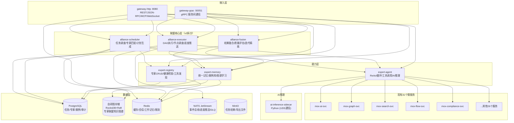

---

## 二、端到端主流程

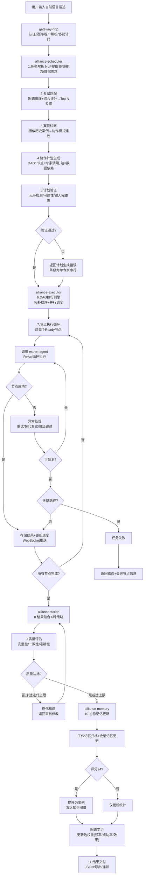

---

## 三、专家匹配流程

```mermaid
flowchart TD
    A["输入: 任务描述"] --> B["1.任务解析"]
    B --> C["提取领域标签<br/>(NLP分类+关键词匹配)"]
    C --> D["提取能力需求<br/>(识别操作类型)"]
    D --> E["识别输入/输出类型"]
    E --> F["提取约束条件<br/>(超时/预算/质量)"]

    F --> G["2.图谱推理查询"]
    G --> H["MATCH (d:Domain)<br/>WHERE d.name IN 领域标签"]
    H --> I["MATCH (d)<-[:operates_in]-(e:Expert)<br/>WHERE e.status=active<br/>AND e.tenant_id IN (当前租户,'system')"]
    I --> J["MATCH (e)-[:has_capability]->(c:Capability)<br/>WHERE c.name IN 能力需求<br/>AND 输入类型 IN c.input_types"]
    J --> K["MATCH (c)-[:requires_tool{mandatory:true}]->(t:Tool)<br/>WHERE t.service_name IN 健康服务"]
    K --> L["可选: MATCH (case:Case)-[:solved_by]->(e)<br/>WHERE case.task_type=当前类型<br/>AND case.rating≥4.0"]

    L --> M["3.综合评分 (0-1)"]
    M --> N["domain_match × 0.25<br/>(领域匹配度)"]
    N --> O["capability_match × 0.30<br/>(能力匹配度+熟练度)"]
    O --> P["health_status × 0.10<br/>(healthy=1, degraded=0.5)"]
    P --> Q["historical_performance × 0.15<br/>(成功率+平均评分)"]
    Q --> R["collaboration_compatibility × 0.10<br/>(与已选专家协作历史)"]
    R --> S["priority_bonus × 0.10<br/>(专家优先级/10)"]
    S --> T["总分 = 各项加权之和"]

    T --> U["4.排序与筛选"]
    U --> V["按 score 降序排列"]
    V --> W["过滤 score<0.3 (最低阈值)"]
    W --> X["去重 (同领域只保留Top 2)"]
    X --> Y["限制最大数量 (默认5)"]
    Y --> Z["输出: 专家列表<br/>(含评分/匹配能力/匹配领域/健康状态)"]
```

---

## 四、协作计划生成流程

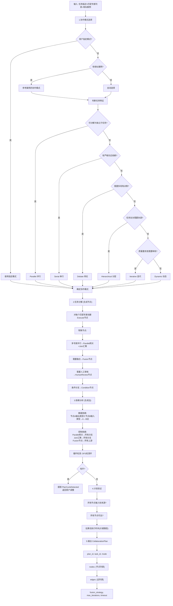

---

## 五、DAG执行引擎流程

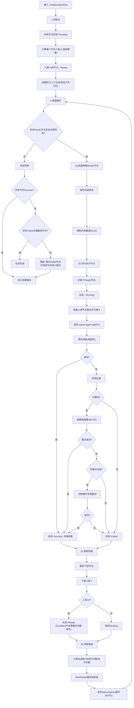

---

## 六、Agent ReAct循环流程

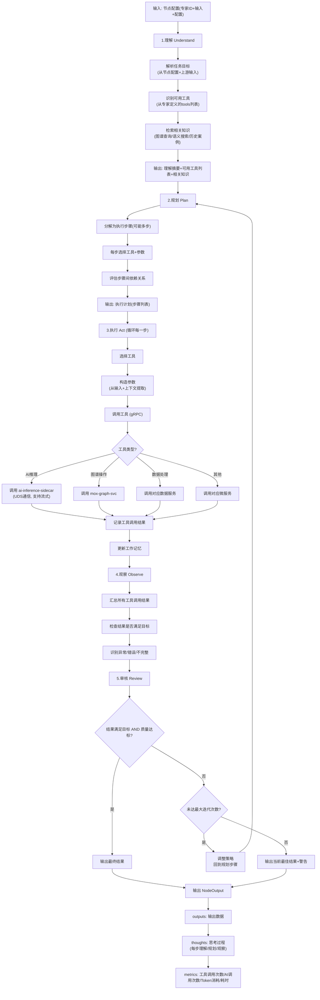

---

## 七、结果融合流程

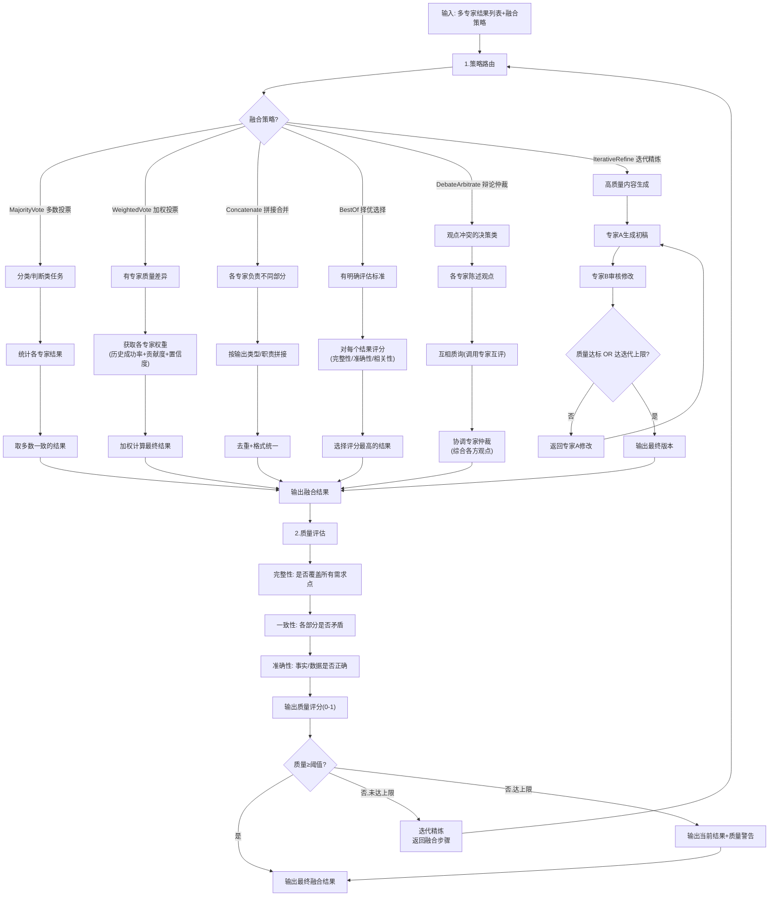

---

## 八、协作记忆与图谱学习流程

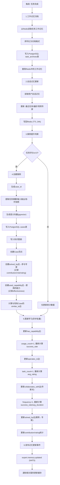

---

## 九、异常处理流程

```mermaid
flowchart TD
    A["节点执行失败"] --> B["1.错误类型判断"]
    B --> C{"错误类型?"}

    C -->|可重试错误<br/>(网络/5xx/超时)| D["2.指数退避重试"]
    D --> E["第1次: 等待100ms"]
    E --> F["第2次: 等待200ms+抖动"]
    F --> G["第3次: 等待400ms+抖动"]
    G --> H{"重试成功?"}
    H -->|是| I["节点Success"]
    H -->|否| J["3.重试耗尽处理"]

    C -->|超时错误| K["2.超时重试(≤2次)"]
    K --> L{"重试成功?"}
    L -->|是| I
    L -->|否| J

    C -->|业务错误<br/>(参数/权限/校验)| M["立即失败(不重试)"]
    M --> J

    C -->|不可恢复错误<br/>(专家不存在/工具不可用)| N["立即失败(不重试)"]
    N --> J

    J --> O["4.替代专家判断"]
    O --> P{"同领域同能力有替代专家<br/>(评分≥0.5)?"}
    P -->|是| Q["5.切换替代专家重试"]
    Q --> R{"成功?"}
    R -->|是| I
    R -->|否| S["6.降级判断"]
    P -->|否| S

    S --> T{"是否关键路径节点?"}
    T -->|否| U["7.降级跳过"]
    U --> V["标记节点Skipped"]
    V --> W["继续执行下游节点<br/>(下游输入用默认值/空值)"]
    W --> X["任务继续(降级完成)"]

    T -->|是| Y["8.任务失败"]
    Y --> Z["标记任务Failed"]
    Z --> AA["记录失败节点+错误信息"]
    AA --> AB["通知用户(WebSocket+推送)"]
    AB --> AC["支持人工重试/干预"]
```

---

## 十、人工干预流程

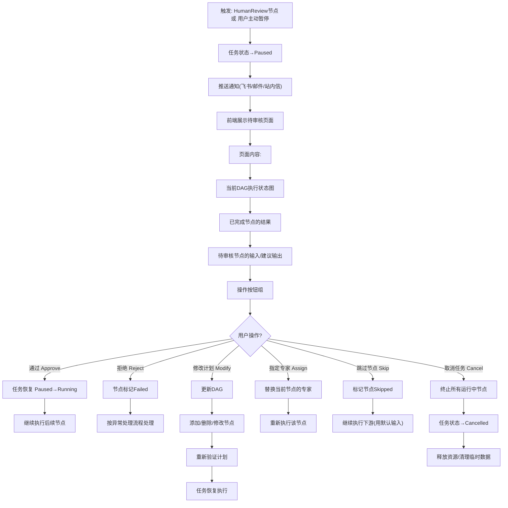

---

## 十一、MCP调用流程

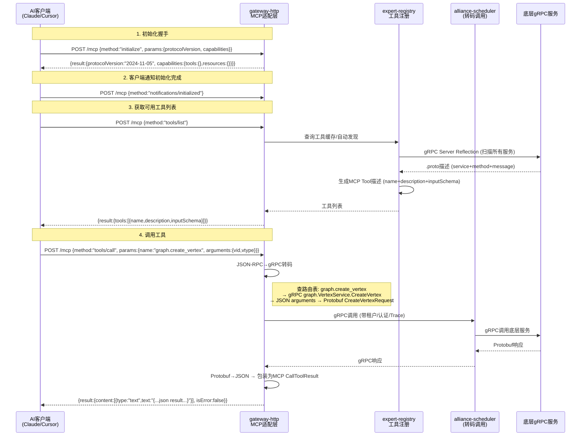

---

## 十二、多协议网关路由

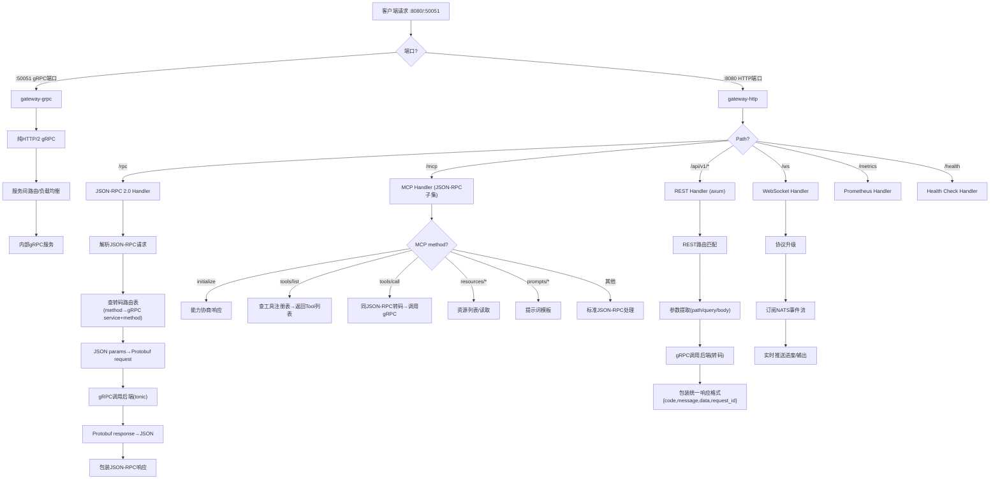

---

## 十三、服务间调用时序图

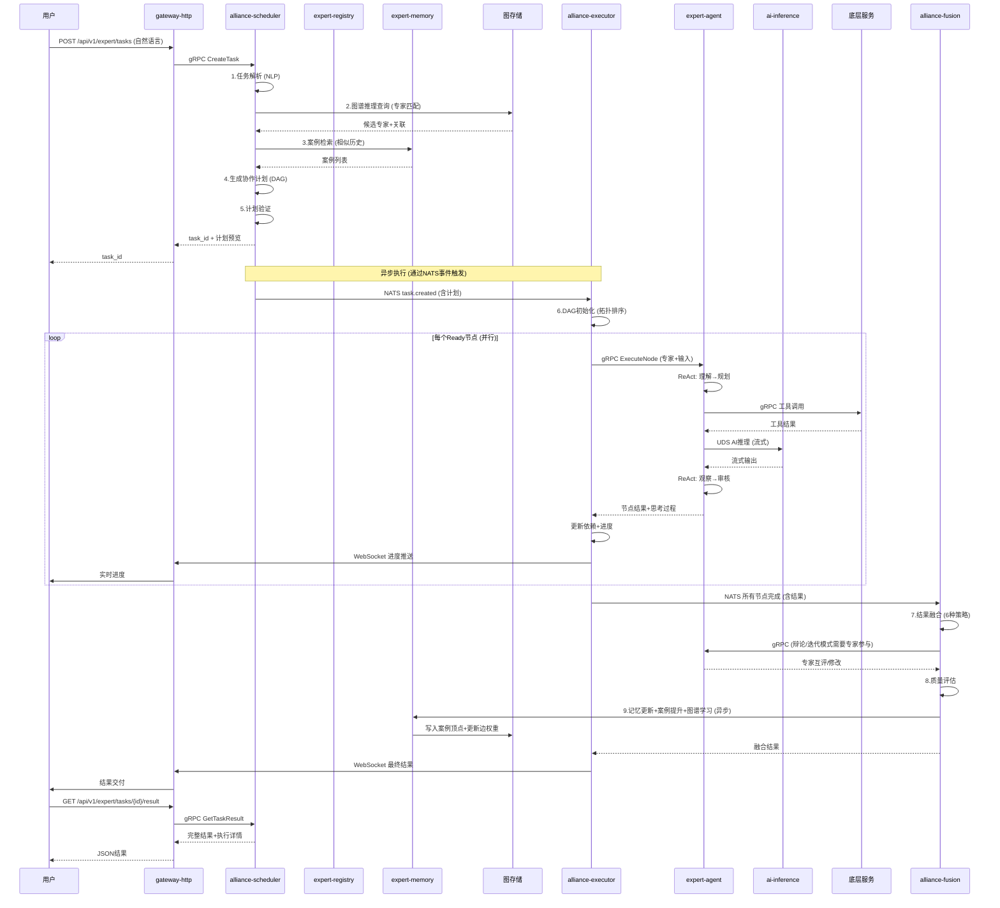

---

## 十四、知识图谱关联关系图

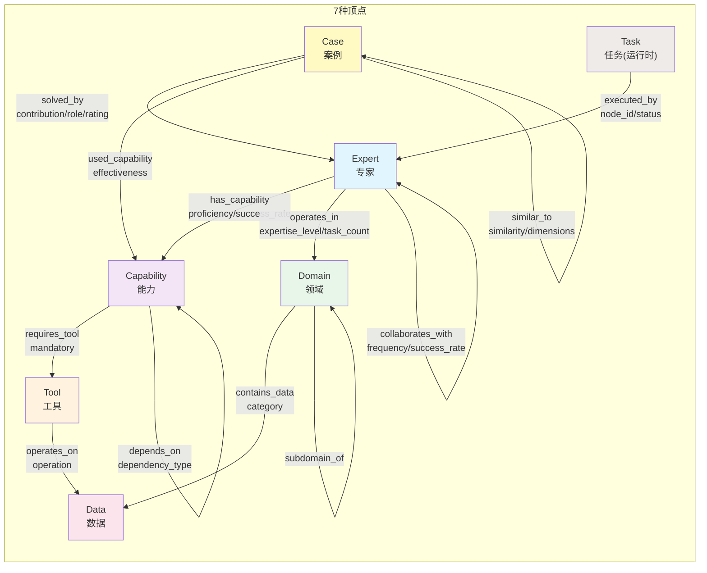

---

## 十五、部署架构图

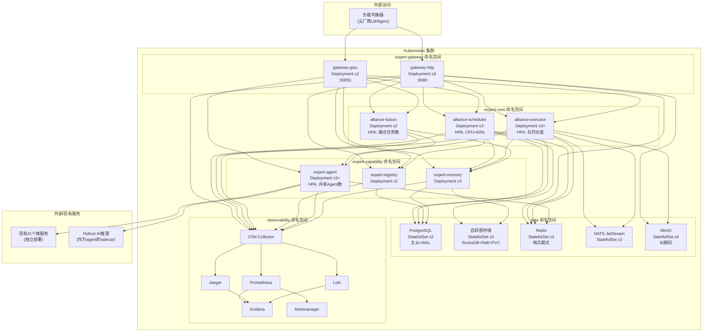

---

## 十六、状态机总图

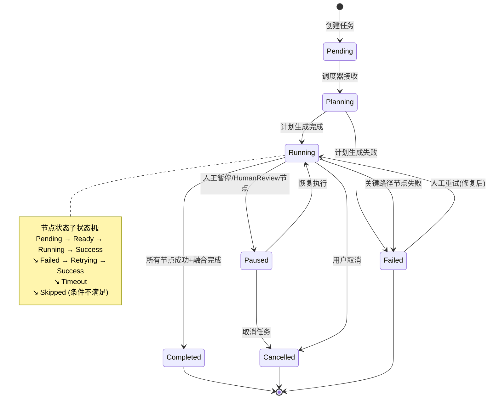

---

*文档导航：[README](docs/expert-alliance/v3/README.md) | [01-架构优化分析](docs/expert-alliance/v3/01-architecture-optimization.md) | [02-架构需求矩阵](docs/expert-alliance/v3/02-requirements-matrix.md) | [03-mox 模块化系统架构业务流程图](docs/expert-alliance/v3/03-business-flow-diagrams.md)*
