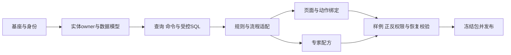

# 低代码模块装配与行业包设计

> LC-MOD-01 · V1.0 · 2026-10-01 · 目标业务装配设计。规范与全维矩阵见 `docs/standards/lowcode-dynamic-configuration.md#dimensions`。

## 1. 可复用单位与最小业务包

业务系统=已装配基座+领域能力+版本化业务配置+必要的注册扩展。基座承担身份/租户/组织/审计/制品/模块生命周期；领域模块拥有交易事实与算法；业务包拥有实体、字典、页面、流程、规则、能力引用和验收样例。业务包不复制IAM、网关、审计或专家执行引擎。

| 构件 | 必需内容 | 责任 |
|---|---|---|
| 包清单 | pack_id、版本、owner、许可、依赖、内容hash | 产品包owner |
| 实体与规则 | entity_ref、字段、字典、规则版本 | owner领域/meta |
| 页面定义 | page_id、实体/查询/命令/组件引用 | frontend适配 |
| 流程定义 | engine_ref、节点能力、映射、异常策略 | flow/业务owner |
| 联盟配方 | 专家能力、模式、匹配/融合引用、预算 | alliance |
| 集成定义 | 连接器引用、目标允许范围、幂等与回执 | connector owner |
| 环境绑定 | 秘密引用、部署档、配置覆盖、迁移引用 | 受控运维 |
| 验收样例 | 输入、期望、失败路径、授权与恢复 | 开发联盟 |

逻辑包布局建议manifest/entities/pages/flows/rules/alliance/fixtures，非强制新建仓库目录。每项引用统一配置对象语义，不在包内重新定义权限schema或模块注册格式。

## 2. 能力复用与装配顺序

部署模块清单负责可用能力，业务包清单负责如何组合，发布包负责选定精确版本。三个清单不同契约，不机械合成巨型JSON。依赖缺失/版本不兼容/环/路由冲突先于初始化拒绝；没有能力实现时不由模板造一个成功占位。

标准CRUD先适配现有meta.codegen/admin-lowcode；DSQL已有条件/结果映射优先复用；非其语言内能力通过领域Operator/flow适配，不能宣称一份流程DSL已被所有引擎支持。复杂专用交互允许注册组件，以维护成本和用户任务比较，不以“零代码比例”决定质量。

## 3. 参考场景：采购申请审查（目标样例）

输入：申请主体、预算、商品/合同附件与审批规则。处理：业务字段校验→受权数据读取→AI/领域规则给出审查证据→按审批规则分流→人工决定或允许的自动命令→回执和知识关联。

实体owner拥有申请与交易状态，alliance只拥有专家任务/证据，审批owner拥有审批实例。页面可配置字段/字典/流程入口，不能以AI结论绕过审批授权。预算不足、附件缺失、模型不可用、审批超时、命令回执未知都返回可定位状态。外部采购/付款是受控能力，不作为本轮已实现前提。

验收：同一包能在两个受权租户安装，数据不串用；改金额阈值产生新release，旧任务仍用原版本；重复命令不产生重复申请/外部操作；包可导出不含秘密；禁用包阻止新任务但按策略处理在途任务。

## 4. 接入、升级和退出

接入先判重→依赖与契约→scope映射→迁移预检→编译预览→样例验证→授权发布。升级比较差异，区分纯值变化、schema变化、业务DDL、扩展代码变化；各自走相应发布/迁移门禁。

退出先停止新引用与接纳→处理在途任务→检查其他包依赖→归档配置与结果→清理投影→保留/删除交易数据按owner政策。禁用模块不等于删表；卸载包不撤销已发通知或已完成交易。

## 5. 与既有文档关联

本目录负责业务复用单位与完整流程，不另立数据库主源或部署模块注册。具体联盟任务主链见 `docs/expert-alliance/13-end-to-end-business-flow.md#一流程总览`；联盟配方见 `docs/expert-alliance/19-lowcode-dynamic-configuration.md#recipe`；政务样例保留在 `docs/normalization/business/BP-GOV-政务审批.md`。旧business-process文档是早期说明，能力是否落地按当前引擎和证据核对。
