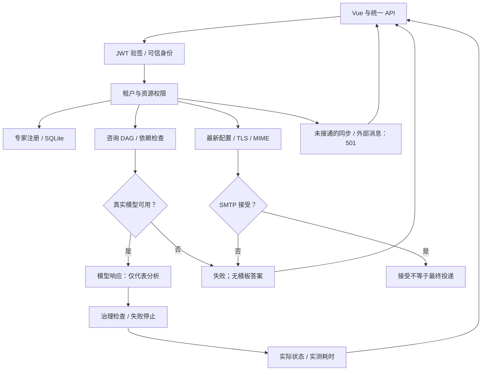

# 平台与前端真实实现及验收台账

> REAL-IMPL-01 · 2026-10-02。范围为 platform 与 frontend-ui。设计、构建成功、拒绝 mock 均不能代替完整功能验收。资源知识详细状态仍以[资源知识台账](./resource-knowledge/IMPLEMENTATION-STATUS.md)为权威。

## 范围与方法

本轮盘点 1,792 个 Rust/Vue/JS/TS 文件、140 个范围内 Cargo 清单，其中 201 个独立测试文件。清单见 `reports/data/20261002-real-platform/scope-inventory.json`。排除 legacy、依赖和运行时目录，不等同于整个 workspace 的 149 个成员。1,676 处关键词命中包含注释、内联测试、算法模拟和未实现说明，**不是 1,676 个确认的生产 mock**；没有关键词也不能证明实现真实。

新增验收使用真实 JWT 签名/认证、TCP HTTP、实际路由和业务状态、真实 OS 连接失败，未注入假业务服务。SMTP 成功投递、LLM 成功推理、OSS 往返尚未验收，本机没有对应凭据。已有单元测试替身不作为集成或 E2E 成功证据，遵循[禁止 Mock 规范](./NO-MOCK-POLICY.md)。

## 模块状态与退出条件

| 模块 | 本轮实际修改/验证 | 尚未完成的验收 |
|---|---|---|
| 认证与租户 | 专家租户从可信 UserInfo 提取；伪造头 403、缺失身份 401；真实双租户专家及会话逐出口隔离与重载通过；[会话契约](../expert-alliance/23-session-isolation-and-commit.md) | 个人会话授权、其他域逐出口核验、组织目录与撤权 |
| 专家咨询 | strict 真实提供方；配置缺失/请求失败明确 failed；生产不调用模板兜底，不保存假成功会话 | 实际推理、工具证据、质量/成本/超时与取消 |
| 专家编排 | 删除固定结论和假耗时；真实咨询 DAG、依赖检查、失败停止、实测耗时；计划/历史/统计按租户筛选；无插件执行器时 available=false | 持久化任务/租约/幂等、崩溃恢复、人工确认、真实检索/执行/验证工具；模型分析不等于外部动作完成 |
| SMTP | lettre TLS/必需 STARTTLS、认证、MIME、CC/BCC/附件；按最新配置发送；阻塞 IO 在线程执行，等待 SMTP 回执，失败进入历史 | 实际接受/投递、持久化队列/历史、密钥引用、租户配置/管理权限与轮换 |
| 消息中心 | 真实 IAM 同租户多收件人投递、逐请求发送授权与停用校验；全批消息/回执/发送人幂等同时提交，独立已读；真实发送页面、冻结幂等重试与实际回执；输入边界、分页统计与重建恢复；[模块契约](./message-center/README.md) | 发送页浏览器全流程、跨页面草稿恢复和发送人对账、按发送人/租户限流与容量、跨主机集群、外部渠道/outbox、灾备 |
| IAM 业务权限 | 真实权限点登记、角色直接权限版本化替换与事务审计；有效权限与消息授权共用策略，移除旧缓存；角色页面真实接口；用户/角色旧入口补管理员及租户保护；[模块契约](./iam/README.md) | 全面管理事务与撤权排序、菜单/数据权限和内存目录迁移、完整浏览器验收、目录分页/SLO及跨主机治理 |
| API Key | 真实管理员/租户事务管理、实际身份、密钥哈希、实时鉴权与撤销；事务分页、状态快照、复合索引；手写及低代码统一真实契约；[凭证契约](./iam/API-KEYS.md) | 动态 scopes 执行、历史明文迁移、轮换/配额、浏览器验收及跨主机吞吐 |
| IAM 安全审计 | 同一读事务内校验真实管理员、可信租户过滤、计数及分页；时区正确排序/过滤与索引；真实只读低代码入口；[审计契约](./iam/AUDIT.md) | 多来源审计归一、保留归档/敏感字段、全链验真、浏览器、深页性能及跨主机治理 |
| 企业健康报告 | 删除全模块固定 ready；实际探测当前用户收件箱，失败 503；其他模块 unverified，enterprise_ready=false | 全域真实依赖探测与生产 readiness/SLO |
| 通知入口 | 旧全局集合停止对外读取；通知路由复用事务消息与 IAM 主源，租户/收件人隔离、停用用户拒绝、全箱未读数与原子全部已读；前端分页/详情、账号切换隔离和失败反馈 | 无归属历史数据迁移、完整浏览器登录验收；旧数据未擅自分配给用户 |
| OA/ERP 同步 | 删除定时器生成的 100/98/2 数量；未接入目标事务与持久化作业时返回 501，不创建任务 | 真实源拉取与目标提交、字段映射、增量游标、删除/权限回执、重试与对账 |
| 专家配置前端 | 专家/算子目录来自 API；新建调用注册接口并校验 created；选中资料来自服务器；模板展开仅为本地预览 | 高级配置 schema、持久化版本/发布/回滚、运行时引用和密钥管理；草稿不等于已发布 |
| 项目进度前端 | 仅显示服务端实际数值；缺失/非法为“未获取”，不推断已完成或填 65% | 实际阶段推进、任务/发布证据驱动、跨请求时序 |
| 知识库/图谱/云盘/OSS | 延续版本、ACL、对象和图投影实现 | 资源知识台账 R2–R7；分开的组件不等于完整业务闭环 |
| 低代码/流程/数据/语音/市场/基础设施 | 纳入文件与候选问题清单 | 本轮未逐接口验收，不宣称全部完成或生产就绪 |

## 真实业务链路

## 验收规则

每项功能必须具备真实契约、可信授权、真实源、执行回执、失败路径、需要的重启恢复、前端状态和关联证据。未配置服务不能回退为成功；模型输出不能冒充工具执行；501 表示尚未完成开发。完整交付要求逐模块闭合退出条件，不能仅靠源码扫描、HTTP 200 或单元测试判定。

浏览器实测前端 3020 可打开登录页并拒绝未认证业务导航；网关 3080 当时未监听，无法完成登录和业务页面联调。未使用假登录或 mock 后端绕过。测试结果权威为 `reports/data/20261002-real-platform/summary.json`。

消息事务与健康报告增量证据独立存放于 `reports/data/20261002-inbox-consistency/`，不覆盖上述历史证据。

IAM 跨用户交付增量契约以[消息中心](message-center/README.md)为主源；真实 HTTP、独立 IAM 连接并发、事务失败与迁移的验证证据存放于 `reports/data/20261002-iam-message-delivery/`，不外推为全系统企业验收。

联盟事件订阅的身份、取消、缺口恢复与生产边界以 [事件交付契约](../expert-alliance/21-event-delivery-contract.md) 为主源；本轮仅修复传输链路，尚未接入页面，Webhook 可靠交付仍待开发。

2026-10-03 收藏增量以 [对象与收藏契约](../expert-alliance/22-expert-object-contract.md) 为主源：事务失败回执、持久幂等回执、批量权威读取、同标签页待确认请求恢复及真实 Pinia/Axios/生产 Rust 路由故障重试已验证；回执清理、跨标签页协调、个人偏好和完整浏览器验收仍待开发，不代表整个专家模块或全平台验收完成。
