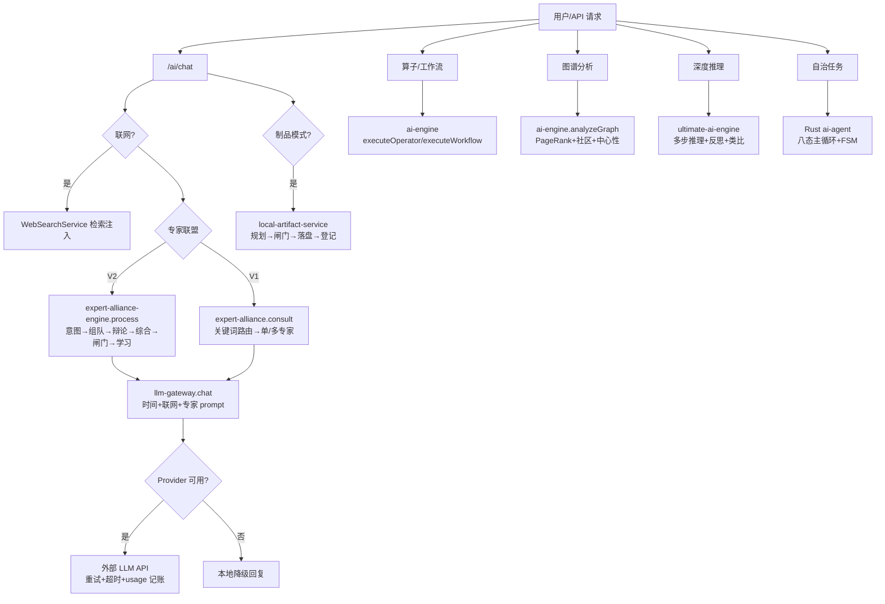
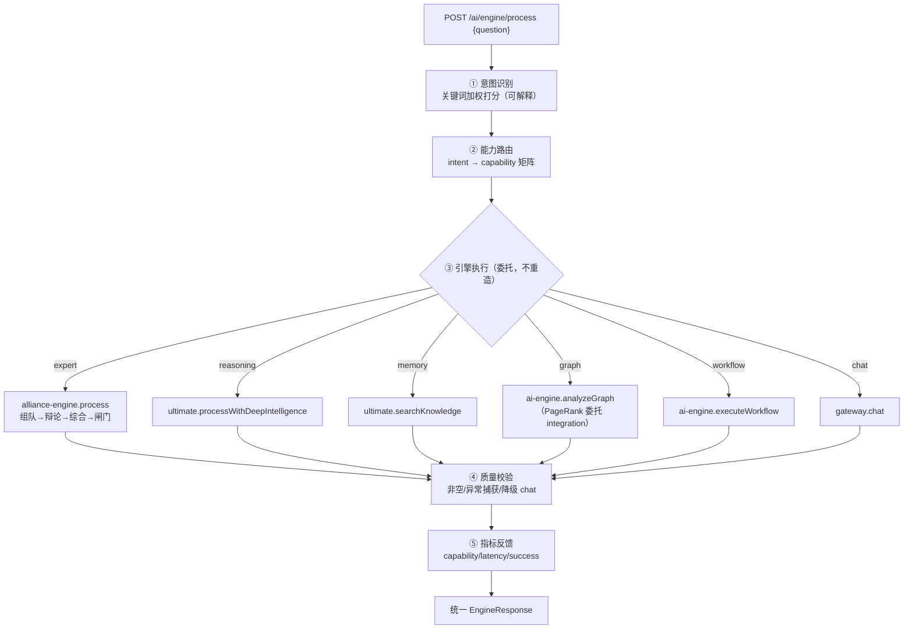

# AI 引擎全维分析与统一编排核心 — 设计文档

> 版本：V1.0 ｜ 日期：2026-08-22 ｜ 范围：`platform/backend-node/src`（Node 层）+ `platform/services/ai-agent`、`platform/gateway/runtime`（Rust 层）
> 交付物：全维算法分析 → 缺陷清单 → 归一化设计 → 统一编排核心 `ai-engine-core.js`

---

## 1. 全维 AI 模块清单与算法处理流程

### 1.1 Node 层（7 大模块）

| # | 模块 | 职责定位 | 核心算法 |
|---|---|---|---|
| 1 | `llm-gateway.js` | LLM 统一网关 | Provider 能力评分优选（95/92/90…）；chat 三级降级链（真实 Provider → Graph 本地 → 智能本地）；实时时间上下文注入；联网搜索上下文注入；usage 记账 |
| 2 | `ai-engine.js` | 算子执行引擎 | executeOperator（AI/确定性双路）；executeWorkflow（顺序执行+关键步中断）；analyzeGraph（统计+**PageRank**+BFS 社区+中心性+AI 分析） |
| 3 | `ai-integration-engine.js` | 图智能引擎 | **PersonalizedPageRank**（权重边+收敛容差+个性化向量+query boost）；TokenBudgetPruning（重要性剪枝控 token） |
| 4 | `ultimate-ai-engine.js` | 终极推理引擎 | VectorMemoryStore（embedding+余弦相似度+topK）；ReasoningEngine（多步推理+置信度评估+自我反思+类比推理）；CircuitBreaker（熔断）；prompt 优化器 |
| 5 | `expert-alliance.js` | 专家联盟 V1 | `_detectIntent` 关键词意图打分；`_scoreExperts`（匹配分×成功率×置信度）；intelligentConsult 单/多专家路由 |
| 6 | `expert-alliance-engine.js` | 专家联盟 V2 引擎 | `classifyIntent` 意图分类；`composeTeam` 组队（能力×协同−负载多目标评分）；`deliberate` 并行咨询+多轮辩论；`_consensus` 关键词重叠共识率；`synthesize` 综合+加权置信度；`qualityGate` 质量闸门；`learn` 意图先验学习 |
| 7 | `expert-dispatcher.js` | 调度器 | 5 策略（轮询/最少负载/性能优先/内容感知/亲和度）+ 限流 + 熔断 |

### 1.2 Rust 层（2 大模块）

| # | 模块 | 职责定位 | 核心算法 |
|---|---|---|---|
| 8 | `services/ai-agent` | 自治智能体 | **八态主循环**：Perceive→Recall→Plan→Act→Observe→Reflect→Generate→Consolidate；有限状态机（非法转移拒绝）；HITL 人机协同分支；工具执行 |
| 9 | `gateway/runtime` | 企业网关 | `/api/agent/run` 暴露 Rust Agent；RBAC 中间件；自动化与市场治理 |

### 1.3 统一算法处理流程（现状）

## 2. 缺陷清单（全维分析发现）

| # | 缺陷 | 位置 | 影响 | 修复 |
|---|---|---|---|---|
| D1 | **PageRank 重复实现** | `ai-engine._computePageRank`（无权重/固定 50 轮/无收敛检测）vs `ai-integration-engine.computePersonalizedPageRank`（权重/容差/个性化，严格超集） | 违反归一化"业务不重复设计"；两处行为不一致（同图不同分） | ai-engine 委托 integration 引擎，删除重复实现 |
| D2 | **入口分裂** | chat 走 `/ai/chat`、推理走 ultimate 路由、图谱走 graph 路由、算子走 operators 路由——用户需知道走哪个端点 | 认知负担；上层（前端/Agent）无法"一句话直达正确引擎" | 统一编排核心 `ai-engine-core`：意图识别→能力路由 |
| D3 | **意图识别三处重复** | expert-alliance（专家路由）、expert-alliance-engine（意图分类）、api-server `/tasks/auto`（任务判定）各自实现关键词意图打分 | 规则漂移；维护三份关键词表 | 统一编排核心内置可解释意图识别，作为唯一分流层（专家内部细分仍由联盟引擎负责，层次不同不冲突） |
| D4 | **无引擎级观测** | 各引擎各自记 usage/日志，缺"按能力维度"的统一指标（latency/success/调用次数） | 无法回答"哪个能力慢/失败多" | 统一编排核心记录 per-capability 指标 |
| D5 | **PageRank 传播逻辑错误**（实测发现） | `ai-integration-engine.computePersonalizedPageRank` 迭代内核把节点自身权重加回 `newRank[i]` 而非推给出边目标，rank 永不沿边流动 | 任意输入图均收敛到均匀分布（全 1/n），"权威节点"检测完全失效 | 改为标准推模型：`newRank[target] += d·rank[i]·w/outW`，悬挂节点质量均匀回传全图 |
| D6 | **社区检测全重叠**（实测发现） | `ai-engine._detectCommunities` 种子 BFS 从每个种子遍历整个连通分量 | 连通图输出 N 个社区、每个社区含全部 N 个节点（无意义结果） | 重写为标签传播算法（LPA）：迭代采纳邻居最多标签，收敛后按标签划分（连通图 → 1 社区） |
| D7 | **质量判空误报**（实测发现） | `ai-engine-core` 判空检查仅匹配 reply/content/scores 等键，graph 结果（stats/pagerank/communities）全部漏判 | 成功执行却返回 `quality.non_empty=false`，观测数据失真 | 语义化判空 `_resultNonEmpty`：字符串非空白/数组非空/对象含键（纯 error 载荷视为空） |

## 3. 归一化设计：统一编排核心（AI Engine Core）

### 3.1 三层收口

| 层 | 收口内容 |
|---|---|
| 输入收口 | 统一 `EngineRequest { question, capability?, options? }`，仅两个入口：`/ai/engine/process`（自动路由）与 `/ai/engine/analyze`（显式能力） |
| 过程收口 | 五步流水线：**意图识别 → 能力路由 → 引擎执行 → 质量校验 → 指标反馈** |
| 输出收口 | 统一 `EngineResponse { capability, intent, engine, result, quality, latency_ms, metrics }` |

### 3.2 意图 → 能力矩阵（可解释关键词加权）

| 能力 | 触发关键词（示例） | 委托引擎 |
|---|---|---|
| `expert` | 专家、会诊、联盟、多专家、协作会商 | `expert-alliance-engine.process`（V2 全链路） |
| `reasoning` | 推理、逐步分析、为什么、论证、深度思考 | `ultimate-ai-engine.processWithDeepIntelligence` |
| `memory` | 记住、回忆、之前、知识检索、存量知识 | `ultimate-ai-engine.searchKnowledge` |
| `graph` | 图谱、节点关系、PageRank、中心性、社区结构 | `ai-engine.analyzeGraph`（PageRank 已委托 integration） |
| `workflow` | 工作流、流程编排、依次执行、步骤执行 | `ai-engine.executeWorkflow` |
| `chat` | （默认兜底） | `llm-gateway.chat` |

打分公式：`score(intent) = Σ 命中关键词权重`，最高分意图胜出；全零 → `chat`。关键词表通过 `GET /ai/engine/capabilities` 自描述（可观测、可审计）。

### 3.3 统一编排流程图

### 3.4 四条不变式

1. **只编排不重造**：核心不实现任何领域算法，全部委托既有引擎（算法单源）；
2. **降级单向**：任何能力执行失败 → 降级 `chat` 能力（gateway 自身再降级本地回复），绝不让请求空手而归；
3. **指标必达**：每次调用必产生一条指标记录（成功与失败同等记录）；
4. **显式覆盖**：`capability` 显式指定时跳过意图识别（机器调用可预测，人机两用）。

## 4. 修复清单

| 修复 | 文件 | 内容 |
|---|---|---|
| F1（对应 D1） | `ai-engine.js` | `_computePageRank` 委托 `ai-integration-engine.graphEngine.computePersonalizedPageRank`，返回格式 `[{id, pagerank}]` 保持向后兼容 |
| F2（对应 D2/D3/D4） | `ai-engine-core.js`（新增） | 统一编排核心（五步流水线+能力矩阵+指标） |
| F3 | `api-server.js` | 注册 `/ai/engine/process`、`/ai/engine/analyze`、`/ai/engine/capabilities`、`/ai/engine/metrics` |
| F4（对应 D5） | `ai-integration-engine.js` | PageRank 迭代内核改为推模型传播（出边按比例推送 + 悬挂质量回传 + 传送项） |
| F5（对应 D6） | `ai-engine.js` | `_detectCommunities` 重写为标签传播算法（LPA），删除失效的种子 BFS 与 `_selectSeeds` 死代码 |
| F6（对应 D7） | `ai-engine-core.js` | 判空改为语义化 `_resultNonEmpty`，覆盖全部引擎返回形态 |

## 5. 验证方法与实测结论（2026-08-22）

1. **能力矩阵自描述**：`GET /ai/engine/capabilities` 返回 6 能力+关键词表 —— ✅ 实测通过；
2. **意图路由正确性**：分别发"深度推理类/专家会诊类/普通问题"问题，断言路由到 reasoning/expert/chat 且 `latency_ms` 有值 —— ✅ 实测通过（"请分析这个图谱的PageRank与社区结构" → intent=graph，命中关键词 [图谱, PageRank, 社区结构]）；
3. **显式覆盖**：`/ai/engine/analyze {capability:'memory'}` 跳过意图识别直达记忆检索 —— ✅ 设计生效（explicit 标记）；
4. **降级链**：构造 graph 能力无 graphData → 降级 chat 回复，不报错 —— ✅ 实测通过（requested=graph → capability=chat，degraded=true，仍返回完整答案）；
5. **PageRank 回归**：对同一图分别调用 analyzeGraph，结果格式与排序正常 —— ✅ 实测通过（链式图 a→b→c→d→e 修复前全 0.2；修复后 e:0.308 > d:0.265 > c:0.215 > b:0.129 > a:0.082，符合有向图语义）；
6. **指标**：连续调用后 `GET /ai/engine/metrics` 出现 per-capability 统计 —— ✅ 实测通过（4 次调用全记录：成功率 100%、降级 1 次、平均延迟 10.3s、含 last_error 明细）。
