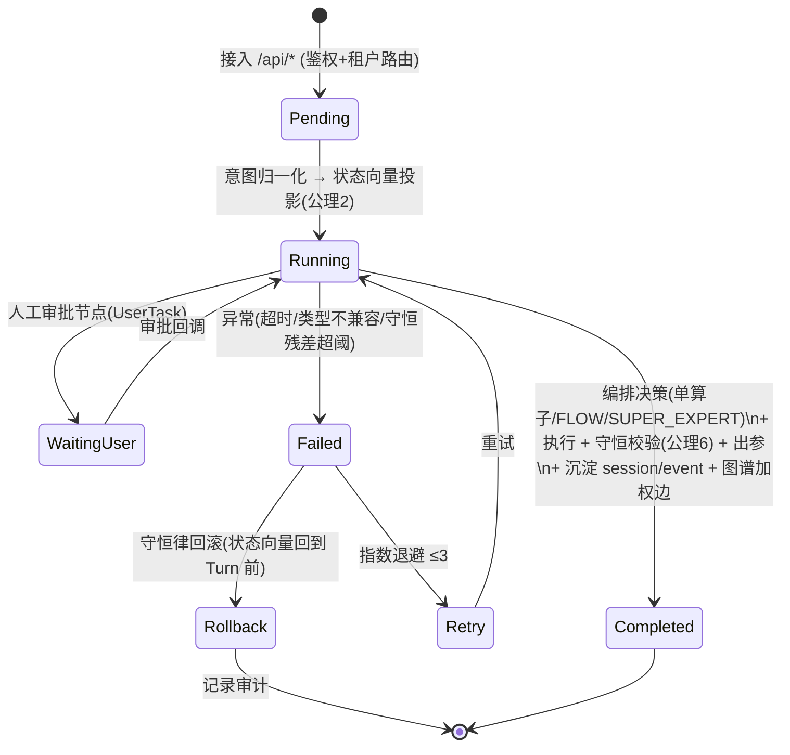
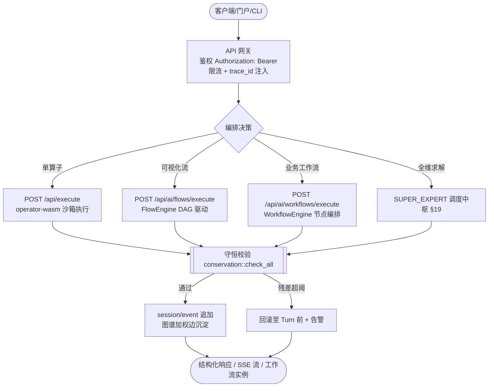
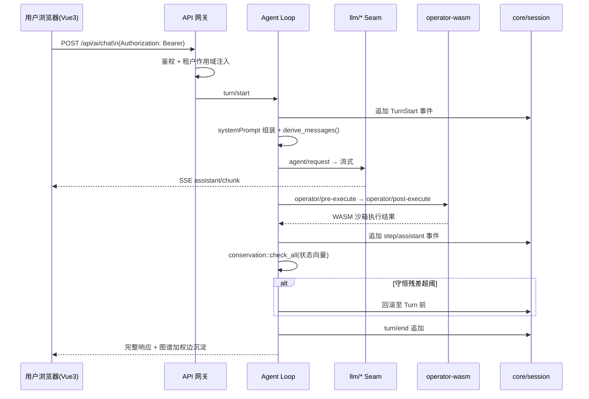
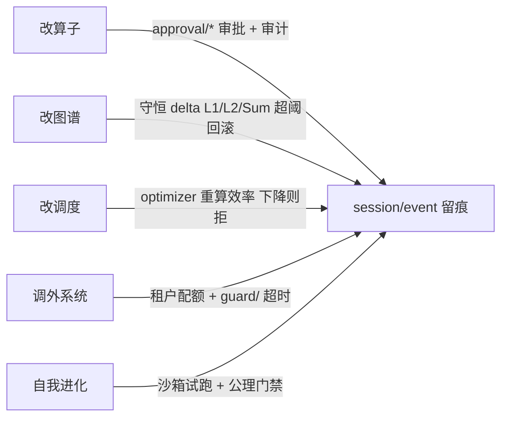
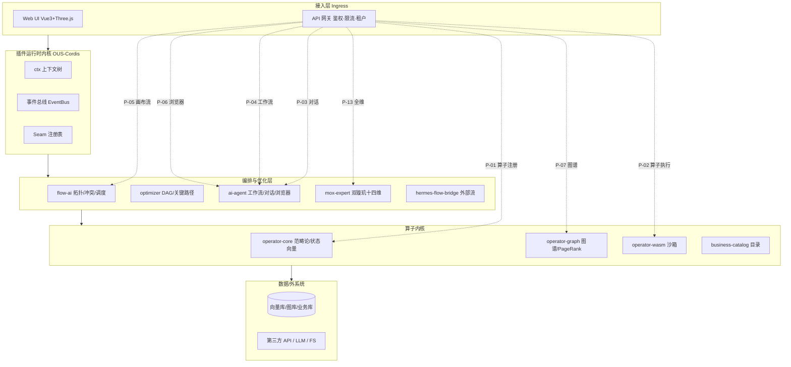
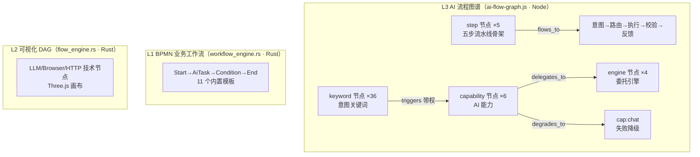
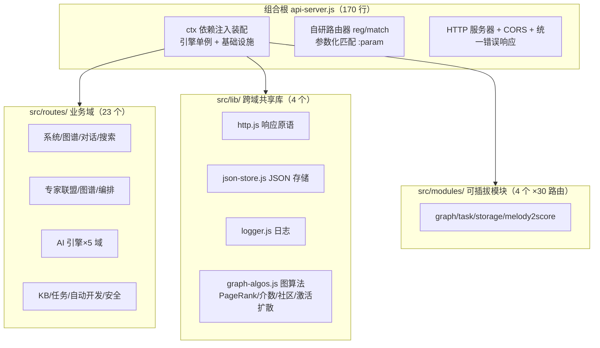

# 企业级业务处理流程图（Business Process Flowcharts）

> 配套文档：`docs/architecture.md`（§9 业务处理流程卡、§28 业务流程设计模块）、`docs/modules/business-process-flows.md`（企业级流程执行引擎）。
> 本文用 **Mermaid 流程图/时序图** 把"企业级处理业务流程"可视化，便于评审、与代码对齐、以及对客演示。
> 所有端点以 `crates/runtime/src/main.rs` 真实路由为准，所有流程以 `crates/ai-agent/src/workflow_engine.rs` / `flow_engine.rs` 真实实现为准。

---

## 0. 图例（统一符号）

| 图形 | 含义 |
|------|------|
| `([开始])` / `([结束])` | 流程起止 |
| `[处理节点]` | 算子执行 / AI 审查 / 算子调用 |
| `{条件分支}` | `Condition` 节点，按 `${var}` 求值路由 |
| `{{专家/治理}}` | 璇玑 / 璇玑 / 治理复核 |
| `>人工任务]` | `UserTask` 挂起待审批 |
| `[[状态向量/图谱]]` | 守恒校验 / 知识沉淀 |
| `---` / `===` | 成功路径 / 异常/回滚路径 |

---

## 1. 统一业务处理流水线（所有请求的通用状态机）

任何业务请求都流经标准阶段，并遵循统一状态机（与 `docs/architecture.md` §5/§9 对齐）。



**阶段映射（端点级）：**



---

## 2. 企业级业务处理流程模板（6 个已落地模板）

编排范式统一为：**开始 → AI 审查/算子执行 → 条件分支 → 结束（合规/风险）**。
`AiTask` 真实执行后若 LLM 返回 JSON 对象则自动展开为 `${var}`，驱动 `Condition` 分支（AI→变量→条件闭环）。

### 2.1 财务发票核验 `finance-invoice-verify`

```mermaid
flowchart TD
    S([Start]) --> A[AiTask: 发票核验\nprompt=审查发票要素与税务风险]
    A -->|LLM 返回 JSON\n{'verify_pass': bool, 'reason': str}| C{Condition\n${verify_pass}==true}
    C -->|true| OK([End: 合规通过])
    C -->|false| RISK([End: 标记风险])
    C -.->|LLM 未配置→降级 simulated\n变量缺失 fail-closed| RISK
```

### 2.2 人事入职审批 `hr-onboarding`

```mermaid
flowchart TD
    S([Start]) --> O[Operator: 创建账号权限\nPOST /api/operators/{operator_id}]
    O --> A[AiTask: 资料完整性审查]
    A -->|JSON {'profile_complete': bool}| C{Condition\n${profile_complete}==true}
    C -->|true| OK([End: 入职完成])
    C -->|false| BACK([End: 退回补充])
```

### 2.3 采购申请审批 `procurement-apply`

```mermaid
flowchart TD
    S([Start]) --> A[AiTask: 预算合规检查]
    A -->|JSON {'over_budget': bool}| C{Condition\n${over_budget}==true}
    C -->|true| M([End: 转人工审批\nUserTask 接入点])
    C -->|false| PASS([End: 自动通过])
```

### 2.4 报销审批 `expense-reimburse`

```mermaid
flowchart TD
    S([Start]) --> A[AiTask: 票据合规审查]
    A -->|JSON {'compliant': bool}| C{Condition\n${compliant}==true}
    C -->|true| OK([End: 批准报销])
    C -->|false| REJ([End: 驳回])
```

### 2.5 合同会签 `contract-countersign`

```mermaid
flowchart TD
    S([Start]) --> O[Operator: 发起会签]
    O --> A[AiTask: 条款风险审查]
    A -->|JSON {'risk_low': bool}| C{Condition\n${risk_low}==true}
    C -->|true| SIGN([End: 签署生效])
    C -->|false| MOD([End: 退回修改])
```

### 2.6 法务合规审查 `legal-compliance-review`

```mermaid
flowchart TD
    S([Start]) --> A[AiTask: 合规风险审查]
    A -->|JSON {'compliant': bool}| C{Condition\n${compliant}==true}
    C -->|true| OK([End: 合规通过])
    C -->|false| RISK([End: 标记风险])
```

> **fail-closed 安全默认**：`Condition` 引用的 `${var}` 未定义时（典型为 LLM 未配置导致 `AiTask` 降级），`resolve_value` 返回 `Null`，等值/排序比较一律为 `false`，流程走拒绝/风险路径继续完成，而非整体失败——满足"默认拒绝"的合规基线。

---

## 3. 端到端时序图：AI 对话 + 算子编排

对应 `docs/architecture.md` §5.6，覆盖鉴权、会话日志溯源、算子沙箱执行、守恒校验。



---

## 4. SUPER_EXPERT 全维处理工作流（璇玑 + 璇玑）

对应 `docs/architecture.md` §19：最高权限、受控、不失控。

```mermaid
flowchart TD
    S([用户 SUPER_EXPERT 模式]) --> R[收口: 意图归一化\n→ 状态向量投影(公理2)]
    R --> T{{璇玑 ExpertPool\n业务七维 + 开发七维(GovernContext.code_ir 非空时并入)}}
    T --> D{{璇玑 AlgoPool\n优化/图/数值/ML 算法}}
    T --> X{冲突消解\nflow-ai::conflict::detect + auto_repair}
    D --> P[璇玑产出 DAG 调度计划\noptimizer::schedule]
    X --> P
    P --> B[[全维执行总线 All-Domain Bus\n算子内核·图谱·优化·编排·数据·外系统]]
    B --> V[[收敛校验 conservation::check_all]]
    V -->|通过| GV{{治理复核 govern\n+ 合规专家签字(可拒)}}
    GV -->|通过| C[沉淀: session/event + 图谱加权边\n(知识复利)]
    GV -->|拒绝| T
    V -->|残差超阈| RB[全量回滚]
    C --> E([跨域求解结果 + 算子市场提案\n可选: 自进化上架])
```

**权限边界（受控不失控）：**



---

## 5. 业务流程设计模块飞轮（设计-执行-优化）

对应 `docs/architecture.md` §28：让业务流程成为一等公民，形成闭环飞轮。

```mermaid
flowchart TD
    A[设计层: Three.js 画布拖拽节点\n连线成 DAG] --> B[模型层: FlowDefinition DSL\nNodeType 体系]
    B --> C[校验层: 拓扑/环检测\n类型契约(公理4)\n资源约束 + 治理策略]
    C -->|不通过| A
    C -->|通过| D[执行层: FlowEngine.execute_flow\n/ WorkflowEngine.run / SUPER_EXPERT]
    D --> E[结果 + 执行日志\n$OUS_HOME/logs]
    E --> F[§9 流程卡反向标注到画布节点]
    E --> G[优化层: AlgorithmFlow 复杂度分析\n+ 优化建议]
    G --> A
    D --> H[资产层: 版本化\n+ 模板市场上架算子市场]
    H --> I[知识复利: 沉淀图谱加权边]
    I --> A
```

---

## 6. 系统分层架构与流程归属

将 §1–§5 的流程落到 `docs/architecture.md` §2 的分层拓扑：



> 全流程卡 P-01…P-13 与端点映射见 `docs/architecture.md` §9.1；企业模板与执行引擎见 `docs/modules/business-process-flows.md`。

---

## 7. 企业级流程能力矩阵（端点 → 流程 → 状态）

| 端点 | 流程卡 | 引擎 | 企业模板 |
|------|--------|------|----------|
| `POST /api/execute` | P-02 算子执行 | operator-wasm | — |
| `POST /api/ai/chat` | P-03 对话 | agent-loop | — |
| `POST /api/ai/workflows/execute` | P-04 工作流 | WorkflowEngine | 6 个 enterprise 模板 |
| `POST /api/ai/flows/execute` | P-05 画布流 | FlowEngine | — |
| `POST /api/ai/browser/natural` | P-06 浏览器 | browser_automation | — |
| `POST /api/graph/node` `/edge` | P-07 图谱 | operator-graph | — |
| `POST /api/ai/llm/config` / `test` | 模型路由 | llm/* Seam | — |
| `POST /api/mox/optimize` | P-13 全维 | mox-expert | — |
| `POST /api/mox/publish` | 全维融合发布 | mox-expert → market | 归一化→优化图→上传算子市场 |

---

## 8. 全维融合总线（归一化 · 融合 · 打通 · 上传平台）

> 本系统是"璇玑 + 业务流程图"为主轴的融合总线落地实现。所有功能（算子 / 工作流 / 对话 / 浏览器 / 图谱 / 插件 / 应用）经归一化后，可一键上传到系统平台（算子市场 = 插件平台 / 应用平台）。

```mermaid
flowchart LR
    A[前端全维融合视图\nMoxFusionView] -->|POST /api/mox/publish\n{flow,name,requirement}| B[运行时融合端点]
    B --> C[归一化: normalize_flow_to_graph\n前端 {type,params} → FlowGraph]
    C --> D[璇玑双璇玑十四维\n+ 璇玑 全维治理]
    D --> E[优化流程图 FlowGraph\noptimized_graph]
    E --> F[market::publish_unified\nflow_ai 模型 → 商城模型]
    F --> G[(算子市场 $OUS_HOME/market\n插件/应用平台资产)]
```

**端点契约**
- 请求：`POST /api/mox/publish` `Authorization: Bearer <OUS_API_TOKEN>`
  - `flow`: 业务蓝图（前端友好 `{nodes:[{id,name,type,params}], edges:[{from,to}]}`，后端归一化）
  - `name` / `description` / `requirement` / `tags`（可选）
- 响应：`{ published, package:{id,name,category,nodes,edges}, governance:{score,gate}, optimization:{critical_path_ms,conflicts_found} }`
- 落盘：`$OUS_HOME/market/packages/<id>.json`（算子包，可在算子商城（插件平台/应用平台）检索、克隆、复用）

**前端入口**：导航栏「全维融合」→ `/mox-fusion`，提供：① 编辑业务蓝图 → ② 全维归一化（治理评分/闸门/优化指标）→ ③ 一键上传算子市场。

---

## 9. Node 平台层业务功能与流程图谱总览（platform/backend-node · 2026-08-22 收口）

> 第 1~8 章描述 Rust 层（crates）业务流程引擎；本章统一整理 **Node 平台层**（`platform/backend-node`，端口 3010）的业务功能全景、流程图拆分/整合机制与前端可视化入口，消除"两层各说各话"的混乱。

### 9.1 双平台分工（一句话定位）

| 平台 | 代码位置 | 端口 | 定位 |
|------|----------|------|------|
| Rust 运行时 | `crates/*` | 3998 | BPMN 业务工作流 + 可视化 DAG 流程图执行（第 1~8 章） |
| Node 平台层 | `platform/backend-node/src` | 3010 | AI 引擎统一编排 + 专家联盟协作 + 知识图谱 + 流程图谱（本章） |

### 9.2 Node 层业务功能全景（按模块）

| 模块 | 核心业务功能 | 关键端点 |
|------|--------------|----------|
| 系统管理 | 健康检查、状态、配置、日志 | `/health` `/status` `/logs` `/config` |
| 知识图谱 | 节点/边 CRUD、中心性、社区、PageRank、AI 生成图谱 | `/graph` `/graph/centrality` `/graph/communities` `/graph/ai-generate` |
| AI 引擎统一编排 | 意图识别→能力路由→执行→校验→反馈 五步流水线 | `/ai/engine/process` `/ai/engine/analyze` `/ai/engine/capabilities` `/ai/engine/metrics` |
| **AI 流程图谱** | 业务流程+算法流程统一建模为图谱 | `/ai/engine/flow-graph`（51 节点/51 边） |
| AI 对话 | 专家联盟优先→LLM 网关→本地兜底，联网搜索 | `/ai/chat` |
| **专家联盟** | 专家 CRUD、意图路由、单/多专家咨询、辩论 | `/experts` `/experts/:id/consult` `/experts/multi-consult` `/experts/debate` |
| 专家会话 | 会话持久化、相似搜索、语义搜索、导出归档 | `/experts/sessions/*` |
| 专家调度 | 5 种调度策略、熔断器、负载指标 | `/experts/dispatcher/*` |
| 专家能力图谱 | 分级建边（包含式+2-gram）、CNM 社区、最优团队 | `/expert-graph/*` |
| V2 编排引擎 | 插件化编排、计划生成/执行、编排历史 | `/experts/orchestrate` `/experts/plan/*` |
| 工作流/流程图 IR | 工作流模板、FlowGraph DSL CRUD/校验/执行 | `/ai/workflows/*` `/ai/flows/*` |
| 自动开发引擎 | 需求→业务架构图谱→确定性代码渲染→安全落盘 | `/auto-dev/*` |
| 无穷维度优化 | CEM 交叉熵多引擎寻优、收敛曲线 | `/infinite-optimizer/*` |
| 旋律转谱 | 音频→乐谱（pitch 检测→MusicXML→简谱） | `/melody2score/*` |
| 市场模块 | 算子包导出/发布 | `/market/*` |
| 任务/存储/自动化 | 任务管理、SQLite 存储迁移、RPA 自动化 | `/task/*` `/storage/*` `/automation/*` |

### 9.3 流程图体系的「拆分」机制（三层）



**拆分原则**：
- **业务流程拆分**：一个业务流程拆为 `step` 节点链（`flows_to` 边），每步只描述"做什么"
- **意图空间拆分**：每个意图关键词独立为 `keyword` 节点，`triggers` 边权重=词权重
- **能力/引擎拆分**：能力与执行引擎解耦（`delegates_to`），失败单向降级到 chat（`degrades_to`）

### 9.4 流程图体系的「整合」机制（四条整合链）

| 整合链 | 机制 | 实现位置 |
|--------|------|----------|
| **意图整合** | 激活扩散（个性化 PageRank，d=0.85）：命中关键词→归一化个性化向量→图谱扩散→能力排序 | `ai-flow-graph.detectIntentBySpread` → `ai-integration-engine.computePersonalizedPageRank` |
| **执行整合** | 能力沿 `delegates_to` 委托唯一引擎；失败沿 `degrades_to` 单向降级到 chat | `AIFlowGraph._build` 边建模 |
| **协作整合** | 专家联盟六阶段流水线（意图→组队→辩论→综合→门禁→学习）整合多专家意见 | `expert-alliance-engine.process()` |
| **反馈整合** | 意图先验 + 专家 metrics 回写 → 影响下一轮组队（学习闭环） | `expert-alliance-engine.learn()` |

**两条流水线的关系**（易混淆点澄清）：
- AI 引擎五步流水线（`step:intent→route→execute→verify→feedback`）：**单请求**的处理管道
- 专家联盟六阶段流水线（`classifyIntent→composeTeam→deliberate→synthesize→qualityGate→learn`）：**多专家协作**的编排管道，其"意图识别"阶段复用同一套意图模式表（INTENT_PATTERNS 单一真相源）

### 9.5 前端可视化入口统一表

| 视图 | 路由 | 渲染内容 | 数据源 |
|------|------|----------|--------|
| 业务流程图·知识图谱 | `/flow-graph`（FlowGraph.vue） | 力导向知识图谱 + 实时处理轨迹 | `GET /graph` |
| **专家联盟·流程编排** | `/expert-enterprise` 流程编排 tab | AI 流程图谱（4 类节点/4 类边/聚焦视图）+ 六阶段流水线 + 激活扩散公式 | `GET /ai/engine/flow-graph` |
| 专家联盟·能力图谱 | `/expert-enterprise` 能力图谱 tab | 专家协作网络 + 社群 + 最优团队 | `GET /expert-graph` |
| 专家联盟·仪表盘 | `/expert-enterprise` 仪表盘 tab | KPI + 社群划分 + 调度引擎 + 熔断器 | `/expert-graph/stats` `/experts/dispatcher/status` |

### 9.6 Node 层代码结构重组（api-server.js 域驱动拆分 · 2026-08-22 收口）

> 原单文件 `api-server.js`（5175 行）拆分为**组合根 + 23 个业务域路由 + 4 个跨域共享库**，文件规模缩减 97%，业务处理流程（鉴权 → match 路由 → 域 handler → ok/fail 统一响应）保持不变式。

**分层架构**：



**23 个业务域装配清单**（`src/routes/index.js` 配置前置，新增域三步接入：建文件 → 登记 → 重启）：

| 域 | 职责 | 域 | 职责 |
|----|------|----|------|
| system | 系统与状态 | kb | 知识库 |
| graph | 知识图谱 | auto-tasks | 自动任务 |
| chat | AI 对话 | modules-admin | 模块与存储管理 |
| web-search | 联网搜索 | security | 安全审计 |
| artifacts | 本地制品 | ai-engine | AI 引擎核心（统一编排） |
| optimizer | 无穷维度优化 | ai-integrated | 智能集成引擎 |
| ai-platform | AI 平台资源 | ai-ultimate | 终极 AI 引擎 |
| browser-market | 浏览器与市场 | auto-dev | 自动开发引擎 |
| integration | 集成通道 | services | 服务管理 |
| expert-alliance | 专家联盟 | ai-enhanced | 16 模块 AI 增强 |
| expert-graph | 专家图谱 | orchestration | 编排协作 |
| tasks | 任务管理 | — | — |

**重组验证（全部通过）**：

| 验证项 | 结果 |
|--------|------|
| 语法检查（28 文件 `node --check`） | 28/28 |
| 冒烟测试（26 关键端点，`scripts/smoke-routes.cjs`） | 26/26 |
| 图谱公式回归（`test/test-graph-formulas.js`） | 35/35 |
| 专家联盟架构回归（`test/test-expert-alliance-architecture.js`） | 21/21 |
| 前端流程编排 tab 浏览器实测（51 节点/51 边 ECharts 渲染） | 通过 |

**同轮修复的前端缺陷**：`ExpertEnterpriseView.vue` 与 `InfiniteOptimizerView.vue` 误用 `import api from '@/api'`（默认导出为 axios 实例而非 API 函数集），统一改为 `import * as api from '@/api'` 命名空间导入，流程编排 tab 图谱恢复渲染。

---

*本文以 Mermaid 图形式补全 `docs/architecture.md` §9 / §28 与 `docs/modules/business-process-flows.md` 的文字流程规范，使"企业级处理业务流程"可在一页内被可视化评审、对齐代码、对客演示。所有图节点均可追溯到 `crates/runtime/src/main.rs` 与 `crates/ai-agent/src/*_engine.rs` 的真实实现。第 9 章追加 Node 平台层总览（2026-08-22），追溯 `platform/backend-node/src/*` 真实实现。*
