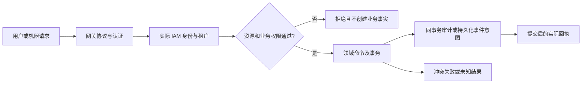
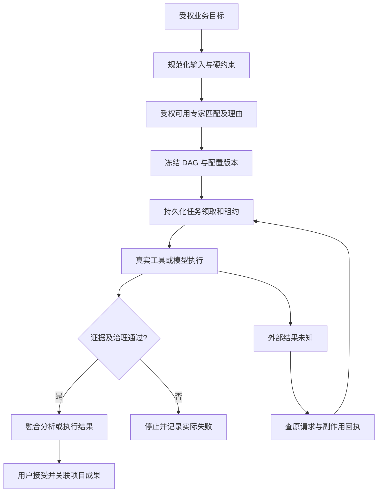
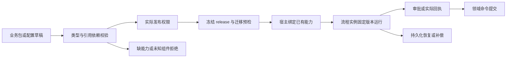
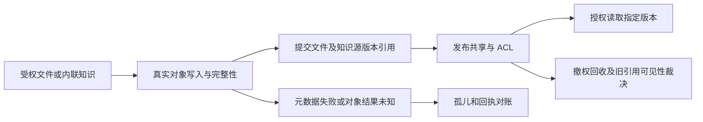
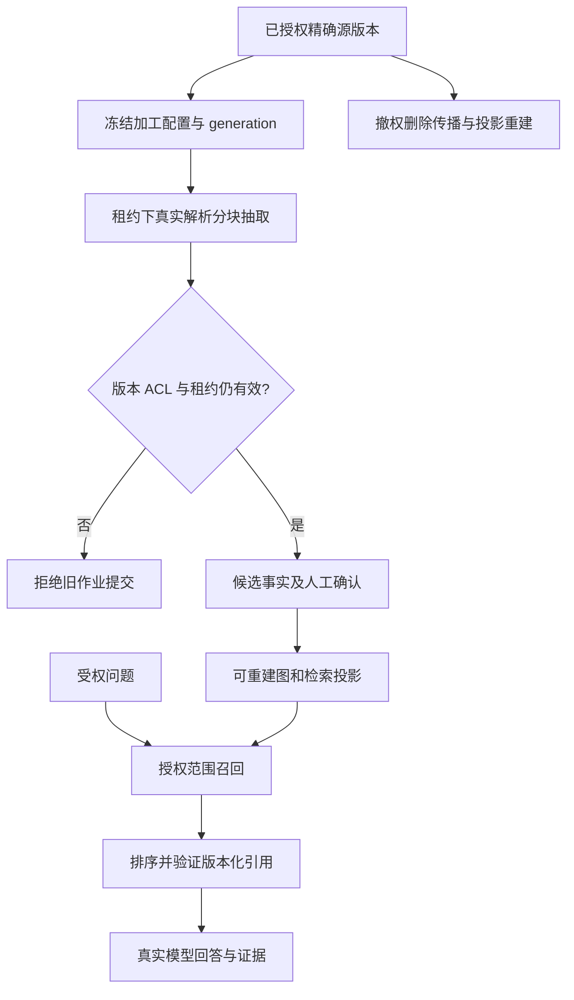
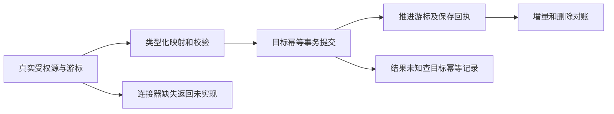
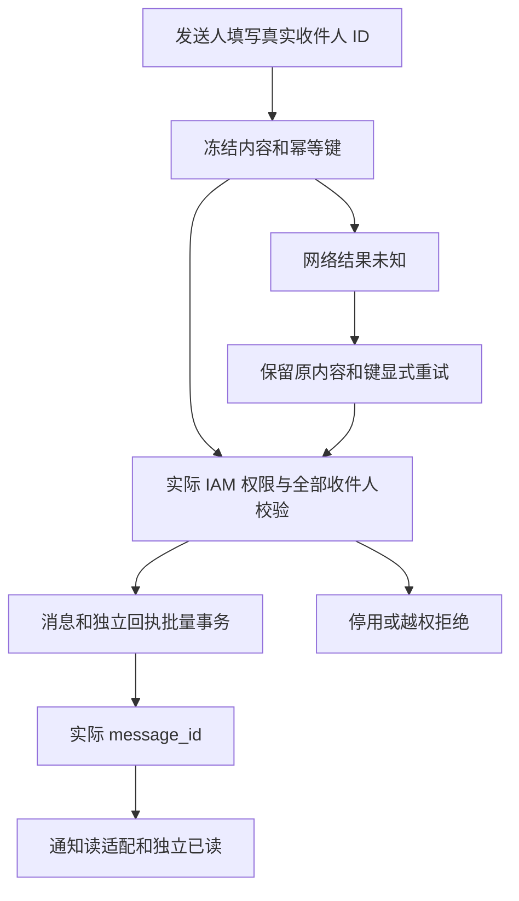
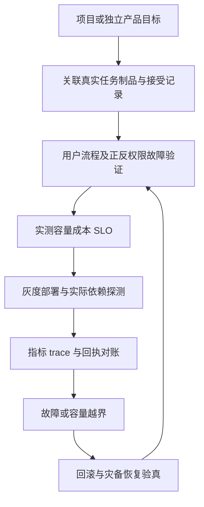

# 跨模块业务主链与异常恢复

> ENT-FLOW-01 · 2026-10-02。以下是统一验收目标，具体已实现段以各模块权威为准；每模块局部流程见 [模块卡](MODULES.md)，前置能力见 [关系图](RELATIONSHIPS.md)。本页不声称所有连线已接通。

## F01 可信请求与受权命令（EM-01–05）

身份只从可信凭证得到；写授权与写入顺序按领域契约实施。冲突返回原版本，未知结果优先查原幂等请求。审计、事务和外部副作用跨存储时采用明确的 outbox/对账边界，不伪造跨库原子提交。[IAM](../iam/README.md)及[凭证](../iam/API-KEYS.md)为本链具体权威。

## F02 专家任务到成果（EM-06–12、23）

咨询分析、任务调度和工具执行不能被一个“完成”布尔值替代。租约过期者不能写终态；预算、审批、取消和真实工具适配是执行前置。详细状态与远程/本地形态见[联盟流程](../../expert-alliance/13-end-to-end-business-flow.md)，未验收工具和提供方保留不可用。

## F03 低代码业务包发布与流程运行（EM-12–14、24）

只配置字段/菜单不等于已具有写权限。禁止远程字符串 eval；未知组件或版本拒绝。回滚新接纳任务的绑定不改变在途任务版本；卸载先检查依赖与在途引用。[业务包装配](../LOWCODE-MODULE-ASSEMBLY.md)、[配置标准](../../standards/lowcode-dynamic-configuration.md)和[工作流 ADR](../../enterprise/33-持久化工作流引擎设计文档-ADR-14.md)维护细节。

## F04 文件到知识源（EM-15–17）

对象拥有字节，文件拥有目录/资源元数据，知识拥有源/内容版本。移动不搬字节；删除策略处理仍被引用的对象。上传完成须记录真实提供方回执与版本绑定。[资源知识数据契约](../../database/RESOURCE-KNOWLEDGE-DATA-CONTRACT.md)和[实际流程](../resource-knowledge/BUSINESS-FLOWS.md)为细节权威。

## F05 加工、图投影与授权回答（EM-18–20）

召回前授权，随后再次核对引用有效性。图与索引为投影，不能自称知识主源；源变更或删除传播需要 generation 和对账。引用缺失时展示证据不足，模型不可用时不返回模板答案。[资源知识台账](../resource-knowledge/IMPLEMENTATION-STATUS.md)记录实际已实现范围。

## F06 数据同步与企业事务（EM-21）

不得在未接通源和目标时生成成功计数。目标提交与游标不在一库时明确重放边界；按真实目标回执判定成功。[平台台账](../REAL-IMPLEMENTATION-STATUS.md)记录当前未完成项。

## F07 消息交付与独立阅读（EM-22）

站内提交不代表邮件或短信投递。未知结果重试不修改收件人/内容；新消息明确新建命令。跨身份切换废弃旧页面回执和草稿，不能撤销已提交服务端消息。授权/事务细节见[消息中心](../message-center/README.md)；外部 outbox 属后续工作。

## F08 产品交付与运营（EM-23–26）

语音/媒体输入单独验证格式、时长、预算、实际制品 ACL 与取消清理；模板/市场包验证来源、许可、依赖和迁移。跨主机运行、恢复演练和外部提供方成功链路要使用真实配置验证。用户满意度与最优性能需要持续测量，不由架构图直接推出。
