# 企业功能模块与逐模块需求

由 `python scripts/registry/enterprise_capabilities.py` 从 registry.json 生成，请勿手改。

需求与逻辑前置关系为目标契约；不表示所有能力已开发、部署或验收。运行现状、细节与证据只引用各模块权威，不复制为第二份状态主源。

返回 [主题入口](README.md) · [登记源](registry.json)

## EM-01 共享基座与契约

优先级：P0。业务域：base / foundation。

事实所有权：统一标识、错误、配置接口、存储与服务运行基元。

代码落点：[platform/foundation](<../../../platform/foundation>) · [platform/shared](<../../../platform/shared>) · [platform/domains/base](<../../../platform/domains/base>) · [platform/domains/foundation](<../../../platform/domains/foundation>)

现状与详细契约：[docs/modules/CODE-CATALOG.md](<../../../docs/modules/CODE-CATALOG.md>)

前置能力：无

### 功能需求与验收

- **EM-01-R01**：标识与错误具有明确类型，不以字符串隐式改变租户或状态。
- **EM-01-R02**：配置与秘密引用分离，缺失依赖明确失败。
- **EM-01-R03**：基础能力测试覆盖重启、并发和实际存储故障。

当前核验边界：代码存在不证明所有调用者已迁入统一契约。

### 模块业务流程（验收目标）

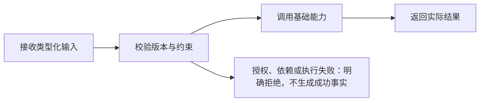

## EM-02 可信身份与业务权限

优先级：P0。业务域：platform。

事实所有权：用户、租户、有效角色与业务权限主源。

代码落点：[platform/domains/platform/core/mox-platform-iam-core](<../../../platform/domains/platform/core/mox-platform-iam-core>) · [platform/gateway/mox-platform-gateway-svc/src/auth.rs](<../../../platform/gateway/mox-platform-gateway-svc/src/auth.rs>)

现状与详细契约：[docs/modules/iam/README.md](<../../../docs/modules/iam/README.md>)

前置能力：EM-01

### 功能需求与验收

- **EM-02-R01**：逐出口从可信身份绑定租户，伪造头或跨租户输入拒绝。
- **EM-02-R02**：权限授予、撤销、继承和循环处理以同一策略执行。
- **EM-02-R03**：管理变更与审计原子提交，旧凭证撤权场景必须验证。

当前核验边界：目录、菜单和数据权限及跨主机撤权尚待全面闭合。

### 模块业务流程（验收目标）

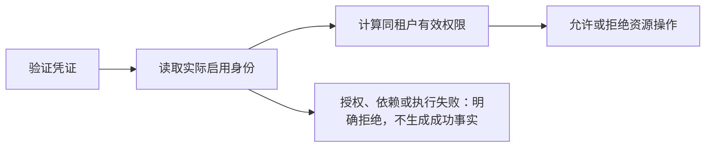

## EM-03 API Key 生命周期

优先级：P0。业务域：platform。

事实所有权：密钥哈希、身份绑定、过期和撤销。

代码落点：[platform/domains/platform/core/mox-platform-iam-core/src/api_keys.rs](<../../../platform/domains/platform/core/mox-platform-iam-core/src/api_keys.rs>)

现状与详细契约：[docs/modules/iam/API-KEYS.md](<../../../docs/modules/iam/API-KEYS.md>)

前置能力：EM-02

### 功能需求与验收

- **EM-03-R01**：只在创建回执展示原始密钥，持久化使用哈希。
- **EM-03-R02**：密钥鉴权校验实际用户、租户、过期和支持的业务范围。
- **EM-03-R03**：轮换、速率与配额须由真实运行策略执行。

当前核验边界：动态 scopes、轮换和跨主机吞吐未全面验收。

### 模块业务流程（验收目标）


## EM-04 安全审计

优先级：P0。业务域：platform。

事实所有权：IAM 审计查询契约及其可见范围。

代码落点：[platform/domains/platform/core/mox-platform-iam-core/src/audit_query.rs](<../../../platform/domains/platform/core/mox-platform-iam-core/src/audit_query.rs>)

现状与详细契约：[docs/modules/iam/AUDIT.md](<../../../docs/modules/iam/AUDIT.md>)

前置能力：EM-02

### 功能需求与验收

- **EM-04-R01**：过滤、排序、分页和计数保持同一可信租户快照。
- **EM-04-R02**：缺失状态保留未知，不补成功码或零耗时。
- **EM-04-R03**：多来源映射、敏感字段、保留恢复与完整性链逐项验收。

当前核验边界：保留归档、自由文本治理和全历史完整性未完成。

### 模块业务流程（验收目标）

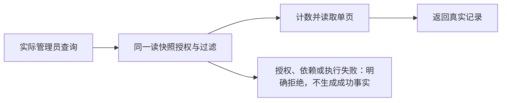

## EM-05 统一网关与宿主

优先级：P0。业务域：platform。

事实所有权：路由装配、协议适配、认证及统一错误出口。

代码落点：[platform/gateway/mox-platform-gateway-svc](<../../../platform/gateway/mox-platform-gateway-svc>)

现状与详细契约：[docs/API-REGISTRY.md](<../../../docs/API-REGISTRY.md>)

前置能力：EM-01、EM-02

### 功能需求与验收

- **EM-05-R01**：静态注册与真实挂载分开统计，端口只引用注册表。
- **EM-05-R02**：领域算法不继续堆入宿主，跨模块经契约调用。
- **EM-05-R03**：未实现能力明确拒绝，健康结果来自实际依赖探测。

当前核验边界：存量内联业务、动态路由普查和全域 readiness 尚待治理。

### 模块业务流程（验收目标）


## EM-06 专家注册与能力目录

优先级：P0。业务域：alliance / ai。

事实所有权：专家身份、能力与可用性登记；不拥有执行结果。

代码落点：[platform/domains/alliance/svc/mox-alliance-registry-svc](<../../../platform/domains/alliance/svc/mox-alliance-registry-svc>) · [platform/gateway/mox-platform-gateway-svc/src/alliance](<../../../platform/gateway/mox-platform-gateway-svc/src/alliance>)

现状与详细契约：[docs/expert-alliance/CURRENT-ARCHITECTURE.md](<../../../docs/expert-alliance/CURRENT-ARCHITECTURE.md>)

前置能力：EM-02、EM-05

### 功能需求与验收

- **EM-06-R01**：区分目录能力与可执行、健康、已部署能力。
- **EM-06-R02**：注册、修改、禁用按租户与权限裁决。
- **EM-06-R03**：运行租约、健康变更及版本引用可追踪。

当前核验边界：不得把种子专家或目录登记解释为真实工具已部署。

### 模块业务流程（验收目标）

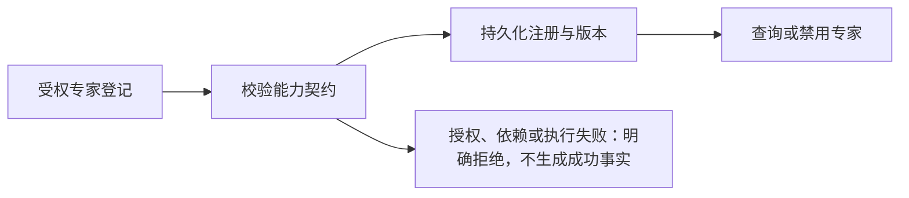

## EM-07 专家匹配与组队

优先级：P1。业务域：alliance。

事实所有权：候选筛选、评分、约束与可解释组队。

代码落点：[platform/domains/alliance/core/mox-alliance-scheduler-core](<../../../platform/domains/alliance/core/mox-alliance-scheduler-core>)

现状与详细契约：[docs/expert-alliance/08-normalized-architecture.md](<../../../docs/expert-alliance/08-normalized-architecture.md>)

前置能力：EM-06

### 功能需求与验收

- **EM-07-R01**：先校验硬约束再评分，不让高分绕过权限与能力限制。
- **EM-07-R02**：评分版本、权重与证据固定，稳定同分排序。
- **EM-07-R03**：无可用专家、预算不足与组合不可行明确返回失败。

当前核验边界：质量最优性需真实样本、基准和消融验证，不能宣称完美算法。

### 模块业务流程（验收目标）

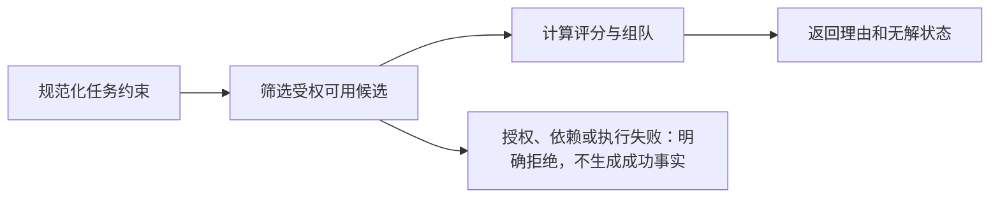

## EM-08 任务调度与状态

优先级：P0。业务域：alliance。

事实所有权：任务接纳、计划、领取、租约及调度状态。

代码落点：[platform/domains/alliance/svc/mox-alliance-scheduler-svc](<../../../platform/domains/alliance/svc/mox-alliance-scheduler-svc>)

现状与详细契约：[docs/expert-alliance/16-decision-and-state-ledger.md](<../../../docs/expert-alliance/16-decision-and-state-ledger.md>)

前置能力：EM-07

### 功能需求与验收

- **EM-08-R01**：任务与幂等键持久化，重复请求不生成第二任务。
- **EM-08-R02**：租约与 fencing 防止过期执行者提交状态。
- **EM-08-R03**：取消、超时、重试、崩溃恢复和跨实例一致性真实验证。

当前核验边界：按既有总账逐项核验，不把同主机多连接外推为跨主机。

### 模块业务流程（验收目标）

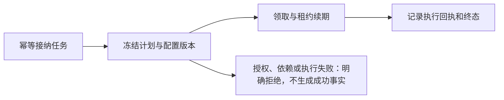

## EM-09 任务执行与工具

优先级：P0。业务域：alliance。

事实所有权：受控工具执行、真实回执、取消与资源预算。

代码落点：[platform/domains/alliance/svc/mox-alliance-executor-svc](<../../../platform/domains/alliance/svc/mox-alliance-executor-svc>)

现状与详细契约：[docs/expert-alliance/13-end-to-end-business-flow.md](<../../../docs/expert-alliance/13-end-to-end-business-flow.md>)

前置能力：EM-08、EM-12

### 功能需求与验收

- **EM-09-R01**：模型文本与工具执行事实分开记录。
- **EM-09-R02**：工具输入、资源访问和外部副作用受权且限额。
- **EM-09-R03**：未知外部结果先对账，不能简单重试声称恰好一次。

当前核验边界：真实工具覆盖、隔离、故障恢复和外部结果对账仍需证据。

### 模块业务流程（验收目标）

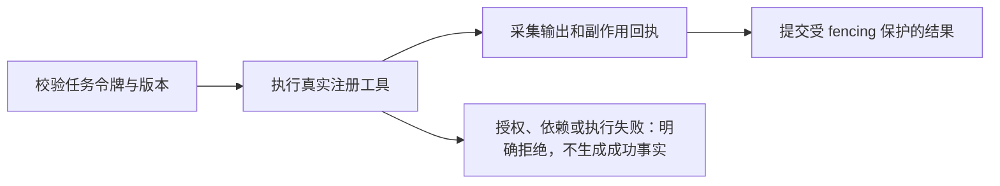

## EM-10 专家协作与结果融合

优先级：P1。业务域：ai / alliance。

事实所有权：咨询 DAG、依赖、分析结果和融合证据。

代码落点：[platform/domains/ai/core/mox-ai-alliance-engine](<../../../platform/domains/ai/core/mox-ai-alliance-engine>)

现状与详细契约：[docs/modules/REAL-IMPLEMENTATION-STATUS.md](<../../../docs/modules/REAL-IMPLEMENTATION-STATUS.md>)

前置能力：EM-07、EM-11

### 功能需求与验收

- **EM-10-R01**：DAG 环、缺依赖和失败传播有确定语义。
- **EM-10-R02**：真实提供方不可用即失败，禁止模板答案冒充推理。
- **EM-10-R03**：融合结果带来源与实测时间，人工决定和外部执行另行授权。

当前核验边界：真实模型质量、成本、取消与工具证据未全面验收。

### 模块业务流程（验收目标）

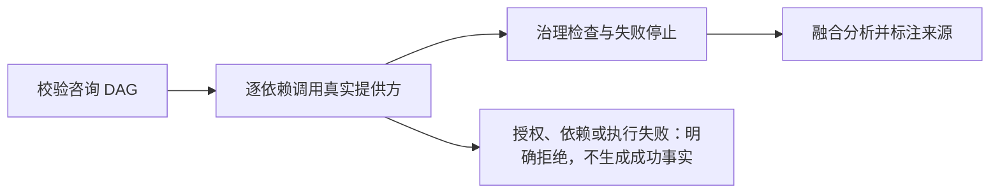

## EM-11 模型提供方

优先级：P0。业务域：ai。

事实所有权：模型协议、秘密引用、限额、真实调用及提供方错误。

代码落点：[platform/domains/ai](<../../../platform/domains/ai>) · [platform/domains/platform/core](<../../../platform/domains/platform/core>)

现状与详细契约：[docs/modules/REAL-IMPLEMENTATION-STATUS.md](<../../../docs/modules/REAL-IMPLEMENTATION-STATUS.md>)

前置能力：EM-02

### 功能需求与验收

- **EM-11-R01**：配置缺失、超时、提供方拒绝不回退假成功。
- **EM-11-R02**：令牌消耗与费用区分估算、实测和未知。
- **EM-11-R03**：密钥不进入页面、日志和导出包，变更有版本及回滚。

当前核验边界：本机缺乏成功推理凭据时只能记录未验收。

### 模块业务流程（验收目标）

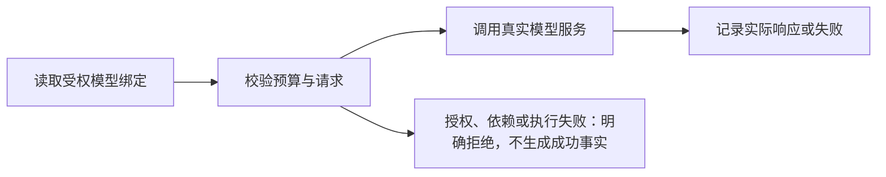

## EM-12 算子与插件运行时

优先级：P0。业务域：flow / platform。

事实所有权：类型化能力、插件生命周期和受控执行接缝。

代码落点：[platform/domains/flow](<../../../platform/domains/flow>) · [platform/domains/platform/core](<../../../platform/domains/platform/core>)

现状与详细契约：[docs/modules/LOWCODE-MODULE-ASSEMBLY.md](<../../../docs/modules/LOWCODE-MODULE-ASSEMBLY.md>)

前置能力：EM-01、EM-02

### 功能需求与验收

- **EM-12-R01**：安装、注册和实际可执行状态分开。
- **EM-12-R02**：未知能力与不兼容类型在执行前拒绝。
- **EM-12-R03**：运行隔离、网络范围、秘密注入和卸载依赖可验证。

当前核验边界：无执行适配器时明确 unavailable，不生成占位结果。

### 模块业务流程（验收目标）

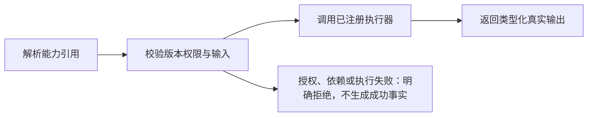

## EM-13 低代码与全维配置

优先级：P1。业务域：platform。

事实所有权：页面定义、受控引用、配置验证、发布与版本。

代码落点：[frontend-ui/src/modules/admin-lowcode](<../../../frontend-ui/src/modules/admin-lowcode>) · [platform/shared/mox-config-core](<../../../platform/shared/mox-config-core>)

现状与详细契约：[docs/standards/lowcode-dynamic-configuration.md](<../../../docs/standards/lowcode-dynamic-configuration.md>)

前置能力：EM-02、EM-12

### 功能需求与验收

- **EM-13-R01**：远程配置仅数据，不 eval 或任意远程 import。
- **EM-13-R02**：任务冻结 release，配置变更不能悄悄改变在途任务。
- **EM-13-R03**：只读模式、身份切换、并发编辑和失败回滚均有证据。

当前核验边界：本地 PageSchema 已存在，不等于远程 JSON 发布链已实现。

### 模块业务流程（验收目标）

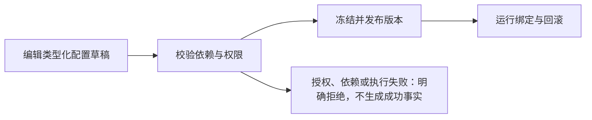

## EM-14 业务工作流

优先级：P1。业务域：flow。

事实所有权：流程实例、审批与命令分流、重试补偿。

代码落点：[platform/domains/flow](<../../../platform/domains/flow>)

现状与详细契约：[docs/enterprise/33-持久化工作流引擎设计文档-ADR-14.md](<../../../docs/enterprise/33-持久化工作流引擎设计文档-ADR-14.md>)

前置能力：EM-12、EM-13

### 功能需求与验收

- **EM-14-R01**：状态推进与作业意图原子记录，重启可继续。
- **EM-14-R02**：人工审批身份、授权和重复决定明确裁决。
- **EM-14-R03**：补偿不是撤销已发生外部事实，未知回执须先对账。

当前核验边界：设计 ADR 与各存量引擎实际语言能力必须逐项对齐。

### 模块业务流程（验收目标）

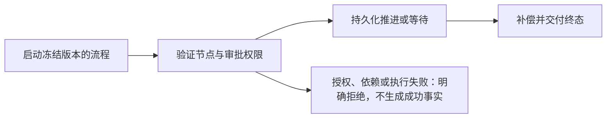

## EM-15 对象存储与 OSS

优先级：P0。业务域：cloud。

事实所有权：对象字节、位置、ETag、提供方适配及完整性。

代码落点：[platform/domains/cloud](<../../../platform/domains/cloud>)

现状与详细契约：[docs/modules/resource-knowledge/IMPLEMENTATION-STATUS.md](<../../../docs/modules/resource-knowledge/IMPLEMENTATION-STATUS.md>)

前置能力：EM-02

### 功能需求与验收

- **EM-15-R01**：真实 PUT HEAD GET RANGE LIST DELETE 与重启验证。
- **EM-15-R02**：ETag、签名和提供方差异来自实测能力矩阵。
- **EM-15-R03**：切换与迁移不丢旧对象，未知写结果可对账。

当前核验边界：历史模拟 HTTP 验证不作为真实 OSS 成功往返。

### 模块业务流程（验收目标）


## EM-16 云盘文件资源

优先级：P1。业务域：cloud。

事实所有权：目录、文件、版本引用、分享与回收。

代码落点：[platform/domains/cloud](<../../../platform/domains/cloud>) · [frontend-ui/src/views](<../../../frontend-ui/src/views>)

现状与详细契约：[docs/modules/resource-knowledge/README.md](<../../../docs/modules/resource-knowledge/README.md>)

前置能力：EM-15

### 功能需求与验收

- **EM-16-R01**：移动只变目录元数据，不重写对象字节。
- **EM-16-R02**：共享撤权、回收恢复与知识源版本引用一致。
- **EM-16-R03**：孤儿对象、元数据失败与配额提交可对账。

当前核验边界：文件、知识、对象三个事实不得合成不可追溯一张大表。

### 模块业务流程（验收目标）

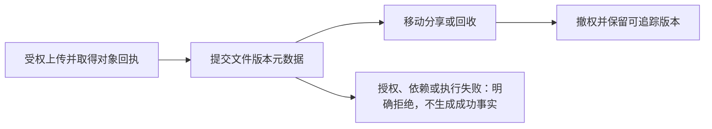

## EM-17 知识目录与版本

优先级：P0。业务域：kb / cloud。

事实所有权：知识空间、文档、源版本、发布与 ACL。

代码落点：[platform/domains/kb](<../../../platform/domains/kb>) · [platform/domains/cloud/core/mox-cloud-kb-core](<../../../platform/domains/cloud/core/mox-cloud-kb-core>)

现状与详细契约：[docs/modules/resource-knowledge/IMPLEMENTATION-STATUS.md](<../../../docs/modules/resource-knowledge/IMPLEMENTATION-STATUS.md>)

前置能力：EM-15

### 功能需求与验收

- **EM-17-R01**：明确唯一可写主源及历史模型迁移映射。
- **EM-17-R02**：内容版本 CAS 与 ACL 检查覆盖所有写路径。
- **EM-17-R03**：分享撤权、删除和旧引用的可见性实际验证。

当前核验边界：跨进程 CAS 与多套历史知识模型迁移仍待完成。

### 模块业务流程（验收目标）

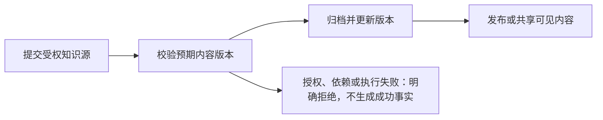

## EM-18 知识加工作业

优先级：P1。业务域：kb / ai。

事实所有权：解析 OCR 分块抽取索引的版本化作业。

代码落点：[platform/domains/kb](<../../../platform/domains/kb>) · [platform/domains/ai](<../../../platform/domains/ai>)

现状与详细契约：[docs/modules/resource-knowledge/IMPLEMENTATION-STATUS.md](<../../../docs/modules/resource-knowledge/IMPLEMENTATION-STATUS.md>)

前置能力：EM-17、EM-11

### 功能需求与验收

- **EM-18-R01**：作业持久化并带源版本、配置版本、generation 与预算。
- **EM-18-R02**：取消或过期作业不能覆盖新版内容或 ACL。
- **EM-18-R03**：真实 OCR 模型与索引失败、重试和重建均可追踪。

当前核验边界：同实例锁内快照比较不能替代跨进程租约。

### 模块业务流程（验收目标）

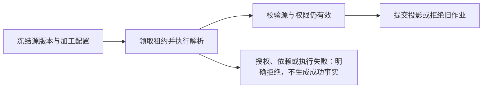

## EM-19 知识图谱与事实治理

优先级：P1。业务域：kg / kb。

事实所有权：实体关系、来源证据、确认状态与图投影。

代码落点：[platform/domains/kg](<../../../platform/domains/kg>)

现状与详细契约：[docs/modules/resource-knowledge/BUSINESS-FLOWS.md](<../../../docs/modules/resource-knowledge/BUSINESS-FLOWS.md>)

前置能力：EM-17、EM-18

### 功能需求与验收

- **EM-19-R01**：图关系保留源版本及证据，不覆盖交易或文件主源。
- **EM-19-R02**：写权限、人工确认和来源删除级联一致。
- **EM-19-R03**：投影可重建且 generation 拒绝旧加工覆盖。

当前核验边界：图算法结果与业务事实准确性分开验收。

### 模块业务流程（验收目标）

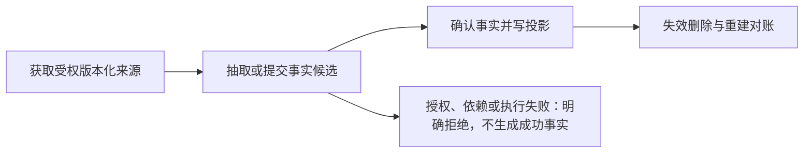

## EM-20 授权检索与 RAG

优先级：P1。业务域：kb / kg / ai。

事实所有权：关键词向量图候选、授权排序及稳定引用。

代码落点：[platform/domains/kb](<../../../platform/domains/kb>) · [platform/domains/kg](<../../../platform/domains/kg>)

现状与详细契约：[docs/modules/resource-knowledge/IMPLEMENTATION-STATUS.md](<../../../docs/modules/resource-knowledge/IMPLEMENTATION-STATUS.md>)

前置能力：EM-17、EM-19、EM-11

### 功能需求与验收

- **EM-20-R01**：候选召回先授权，失效和未发布内容不能进入结果。
- **EM-20-R02**：引用绑定真实文档版本及文本偏移或文件页码。
- **EM-20-R03**：召回率、引用准确性、延迟与成本由真实样本评测。

当前核验边界：文本引用不等于向量、精确 chunk 或模型问答已验收。

### 模块业务流程（验收目标）

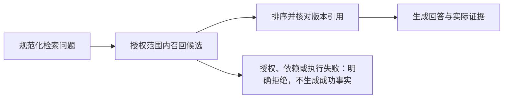

## EM-21 数据目录与企业集成

优先级：P1。业务域：data。

事实所有权：连接器、映射、游标、目标提交与对账。

代码落点：[platform/domains/data](<../../../platform/domains/data>)

现状与详细契约：[docs/modules/REAL-IMPLEMENTATION-STATUS.md](<../../../docs/modules/REAL-IMPLEMENTATION-STATUS.md>)

前置能力：EM-02、EM-14

### 功能需求与验收

- **EM-21-R01**：未接通源和目标时返回未实现，不造同步数量。
- **EM-21-R02**：目标提交与游标推进有明确原子边界及重放策略。
- **EM-21-R03**：权限删除变更、失败重试与差异对账实际验证。

当前核验边界：OA ERP 同步当前未接通完整源目标事务。

### 模块业务流程（验收目标）

```mermaid
flowchart LR
    EM21S1["读取受权真实源"]
    EM21S2["规范化映射与增量游标"]
    EM21S1 --> EM21S2
    EM21S3["提交目标真实事务"]
    EM21S2 --> EM21S3
    EM21S4["保存回执并重试对账"]
    EM21S3 --> EM21S4
    EM21S2 --> EM21F["授权、依赖或执行失败：明确拒绝，不生成成功事实"]
```

## EM-22 消息中心与通知

优先级：P0。业务域：platform。

事实所有权：站内消息、独立收件回执与发送幂等；通知为读适配。

代码落点：[platform/gateway/mox-platform-gateway-svc/src/message_center](<../../../platform/gateway/mox-platform-gateway-svc/src/message_center>) · [frontend-ui/src/components/NotificationCenter.vue](<../../../frontend-ui/src/components/NotificationCenter.vue>) · [frontend-ui/src/modules/message-center](<../../../frontend-ui/src/modules/message-center>)

现状与详细契约：[docs/modules/message-center/README.md](<../../../docs/modules/message-center/README.md>)

前置能力：EM-02

### 功能需求与验收

- **EM-22-R01**：全部收件人事务提交，冲突和存储失败不报成功。
- **EM-22-R02**：前端按实际 message_id 确认，未知网络结果沿原幂等键重试。
- **EM-22-R03**：外部渠道必须 outbox 与真实提供方回执，限流容量和保留可验证。

当前核验边界：跨主机、外部渠道、容量及浏览器完整流程尚待验收。

### 模块业务流程（验收目标）

```mermaid
flowchart LR
    EM22S1["受权发送与幂等请求"]
    EM22S2["真实 IAM 检查全部收件人"]
    EM22S1 --> EM22S2
    EM22S3["事务提交消息与独立回执"]
    EM22S2 --> EM22S3
    EM22S4["读取与标记已读"]
    EM22S3 --> EM22S4
    EM22S2 --> EM22F["授权、依赖或执行失败：明确拒绝，不生成成功事实"]
```

## EM-23 项目与成果交付

优先级：P1。业务域：project。

事实所有权：业务项目、里程碑、成果与交付引用。

代码落点：[platform/domains/project](<../../../platform/domains/project>) · [frontend-ui/src/views/project](<../../../frontend-ui/src/views/project>)

现状与详细契约：[docs/modules/REAL-IMPLEMENTATION-STATUS.md](<../../../docs/modules/REAL-IMPLEMENTATION-STATUS.md>)

前置能力：EM-08、EM-17、EM-22

### 功能需求与验收

- **EM-23-R01**：进度只来自实际阶段与回执，未知不补固定比例。
- **EM-23-R02**：项目归属及资源引用不能绕过领域 ACL。
- **EM-23-R03**：接受、退回与重新交付有版本化决定和审计。

当前核验边界：实际阶段推进与跨请求时序证据尚待补齐。

### 模块业务流程（验收目标）

```mermaid
flowchart LR
    EM23S1["创建受权项目目标"]
    EM23S2["关联任务与资源版本"]
    EM23S1 --> EM23S2
    EM23S3["汇总实际完成证据"]
    EM23S2 --> EM23S3
    EM23S4["交付成果并记录接受"]
    EM23S3 --> EM23S4
    EM23S2 --> EM23F["授权、依赖或执行失败：明确拒绝，不生成成功事实"]
```

## EM-24 市场与模板包

优先级：P2。业务域：market。

事实所有权：业务包与模板清单、版本、依赖及安装引用。

代码落点：[platform/domains/market](<../../../platform/domains/market>)

现状与详细契约：[docs/modules/LOWCODE-MODULE-ASSEMBLY.md](<../../../docs/modules/LOWCODE-MODULE-ASSEMBLY.md>)

前置能力：EM-12、EM-13

### 功能需求与验收

- **EM-24-R01**：模板预览不表示安装发布或执行成功。
- **EM-24-R02**：安装不复制 IAM 存储或重建第二配置规范。
- **EM-24-R03**：升级迁移与退出保留交易事实并检查在途引用。

当前核验边界：真实包发布安装、许可和迁移未逐出口验收。

### 模块业务流程（验收目标）

```mermaid
flowchart LR
    EM24S1["检查包来源与许可"]
    EM24S2["验证依赖和类型引用"]
    EM24S1 --> EM24S2
    EM24S3["受权安装指定版本"]
    EM24S2 --> EM24S3
    EM24S4["升级回滚或退出"]
    EM24S3 --> EM24S4
    EM24S2 --> EM24F["授权、依赖或执行失败：明确拒绝，不生成成功事实"]
```

## EM-25 语音与独立产品

优先级：P2。业务域：voice。

事实所有权：产品级 ASR TTS 媒体处理契约及受权输入输出。

代码落点：[platform/domains/voice](<../../../platform/domains/voice>) · [projects](<../../../projects>)

现状与详细契约：[docs/modules/CODE-CATALOG.md](<../../../docs/modules/CODE-CATALOG.md>)

前置能力：EM-02、EM-11

### 功能需求与验收

- **EM-25-R01**：上传格式大小时长与资源预算受控。
- **EM-25-R02**：真实 ASR TTS 或媒体生成输出可验证，不用预置制品冒充。
- **EM-25-R03**：取消、重试、制品 ACL 和成本有实际运行证据。

当前核验边界：独立项目存在不等于已纳入统一网关和验收。

### 模块业务流程（验收目标）

```mermaid
flowchart LR
    EM25S1["校验媒体权限与格式"]
    EM25S2["调用真实媒体提供方"]
    EM25S1 --> EM25S2
    EM25S3["处理取消与资源清理"]
    EM25S2 --> EM25S3
    EM25S4["返回实际制品及状态"]
    EM25S3 --> EM25S4
    EM25S2 --> EM25F["授权、依赖或执行失败：明确拒绝，不生成成功事实"]
```

## EM-26 运营与分布式交付

优先级：P0。业务域：platform。

事实所有权：依赖探测、trace、容量、灾备、发布和回滚。

代码落点：[platform/gateway/mox-platform-gateway-svc/src/actuator.rs](<../../../platform/gateway/mox-platform-gateway-svc/src/actuator.rs>) · [deploy](<../../../deploy>) · [scripts/startup](<../../../scripts/startup>)

现状与详细契约：[docs/modules/REAL-IMPLEMENTATION-STATUS.md](<../../../docs/modules/REAL-IMPLEMENTATION-STATUS.md>)

前置能力：EM-05、EM-04

### 功能需求与验收

- **EM-26-R01**：readiness 不从静态 ready 标记或 HTTP 200 推断。
- **EM-26-R02**：跨主机故障转移和恢复必须真实部署演练。
- **EM-26-R03**：延迟容量成本安全和升级回滚具有可重复基准。

当前核验边界：当前局部验证不能证明全系统生产或跨主机就绪。

### 模块业务流程（验收目标）

```mermaid
flowchart LR
    EM26S1["探测实际运行依赖"]
    EM26S2["采集 trace 指标与异常"]
    EM26S1 --> EM26S2
    EM26S3["按 SLO 告警和降级"]
    EM26S2 --> EM26S3
    EM26S4["灰度回滚或恢复验真"]
    EM26S3 --> EM26S4
    EM26S2 --> EM26F["授权、依赖或执行失败：明确拒绝，不生成成功事实"]
```
