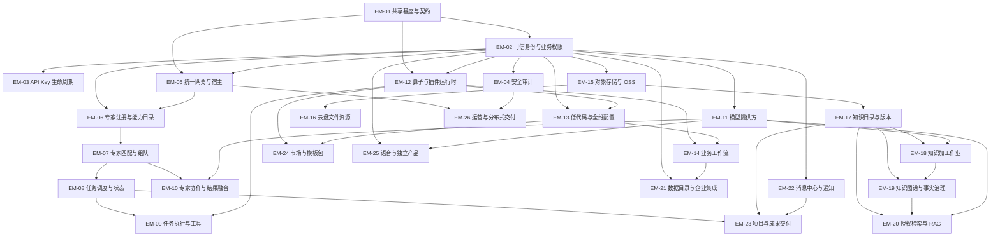

# 模块前置能力与边界关系

由 `python scripts/registry/enterprise_capabilities.py` 从 registry.json 生成，请勿手改。

需求与逻辑前置关系为目标契约；不表示所有能力已开发、部署或验收。运行现状、细节与证据只引用各模块权威，不复制为第二份状态主源。

返回 [主题入口](README.md) · [登记源](registry.json)

箭头表示调用或实施所需的前置能力 → 消费模块；这是逻辑依赖，不能解释为已部署进程或 Cargo 导入。真实代码依赖见 [代码目录](<../../../docs/modules/CODE-CATALOG.md>)。

## 所有权和归一规则

身份和权限只由 IAM 裁决；对象字节、文件元数据、知识版本、图投影、任务状态与消息回执分别归各自模块。跨域传标识、版本和回执，不共享可写内存集合或复制另一套主源。

低代码仅装配已注册能力，不替代业务授权或事务。AI 分析、工具执行、外部接受、用户接受是不同事实；各阶段保留实际状态和证据。

流程中的业务回调与读引用可能双向；不能为满足图形无环而隐藏业务关系。登记的 depends_on 仅是可排序的前置能力图，跨模块业务流程见 [业务主链](BUSINESS-FLOWS.md)。
