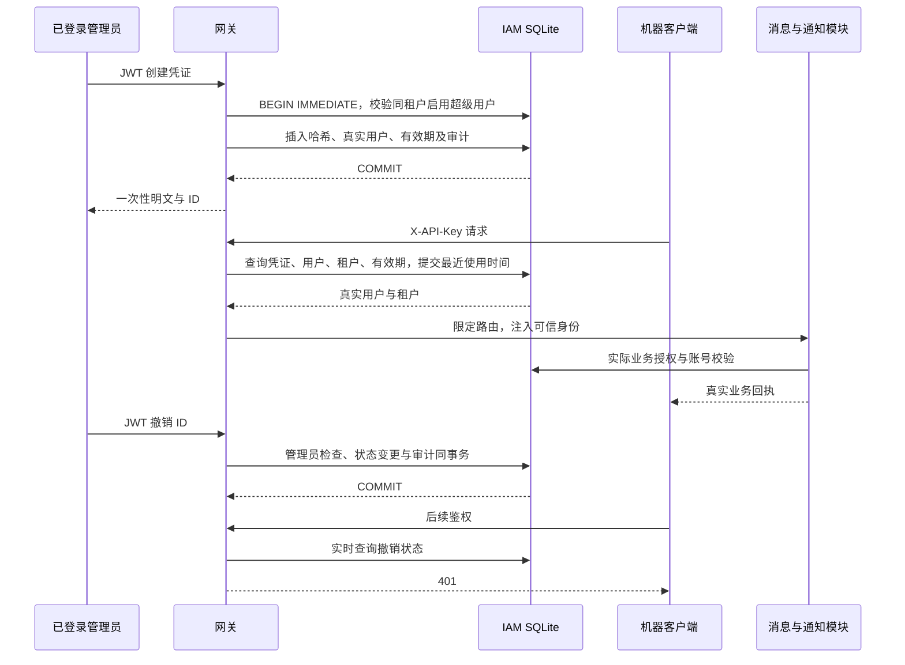

# API Key 生命周期与真实鉴权

> IAM-KEY-01 · 2026-10-02。本文件为凭证增量的权威契约，所属模块见 [IAM](README.md)。

## 边界与流程

IAM core 的 `api_keys` 管理数据库身份、凭证、有效期和审计；网关 `auth` 在线程池执行鉴权并限制流程；`system/security` 提供管理 API；AdminAccess 展示真实回执，不将密钥保存到浏览器存储。

## 管理 API

| 请求 | 契约 |
|---|---|
| GET /api/security/api-keys | page 默认 1，page_size 默认 20、范围 1–100，均为正整数；返回 items/total/page/page_size，不返回明文、摘要或明文前缀 |
| POST /api/security/api-keys | name 必填，1–100 字符且不能全空白；expires_at 为可选未来 RFC3339 时间。未知字段拒绝。绑定当前管理员，不能指定其他用户/租户 |
| DELETE /api/security/api-keys/:id | 只处理当前租户对象；不可见返回 404；重复撤销幂等，不重复追加审计 |
| POST /api/security/validate | 需要真实管理员；正文 api_key；查询仅限当前租户，不修改或透露其他租户身份 |
| GET /api/security/status | 需要真实管理员；不再固定报告 IAM ready 或默认租户 |
| GET /api/security/audit-log | 可信租户事务分页与精确过滤；权威契约见 [IAM 审计](AUDIT.md) |

管理权依据数据库启用租户、启用用户和 is_superuser，JWT 中的 admin 字符串不能授权。创建及撤销在同一写事务内校验身份；审计失败使整个变更回滚。成功回执只在提交后返回。HTTP 401/403/404/400/503 分别表示认证、授权、对象不可见、业务参数和存储错误；类型错误与未知字段为框架 422。

新明文由两枚随机 UUID v4 组成，数据库仅保存 `sha256:<摘要>`。列表与审计不包含明文或摘要，创建回执只展示一次。关闭展示、切换账号/租户、销毁组件清除前端明文；晚到响应不能回写其他账号。创建、撤销及校验关闭自动重试；创建网络结果不确定时刷新核对，明文无法从数据库恢复。

## 机器授权范围

本批固定开放以下流程，**尚未实现任意动态 scopes**。已移除没有执行规则的 read/write/admin 勾选，提交这些字段被拒绝。凭证自身不携带管理员角色。

| 方法 | 完整路径 |
|---|---|
| GET | /api/enterprise/message/messages、/api/enterprise/message/messages/:id、/api/enterprise/message/stats |
| POST | /api/enterprise/message/send、/api/enterprise/message/messages/:id/read |
| GET | /api/notifications、/api/notifications/unread-count |
| PUT | /api/notifications/:id/read、/api/notifications/read-all |

方法和路径同时匹配，其他入口 403；管理接口继续使用 JWT。路由许可不代替消息模块的租户、收件人、启用状态和 message:send 校验。校验接口不返回虚构 read/write 权限。

每次机器鉴权从 IAM 主源读取，不加载内存快照；重建网关仍可使用凭证，另一连接提交撤销后新鉴权失败。查询或最近使用时间提交失败返回 503，不回退内存成功。认证与业务事务为两次提交，撤销不会取消已经认证且正在处理的请求。

## 历史兼容与剩余边界

旧明文行只有实际绑定同租户启用用户、启用租户、未撤销且未到期才可使用；首次有效鉴权在事务内升级哈希。无真实归属不猜测用户；非法有效期和非空旧 scopes 拒绝。重复相同凭证值使身份不唯一时拒绝，不任意选择用户。摘要字符串本身不能作为机器明文通过。

未使用的历史明文及备份仍待批量迁移和轮换；不宣称历史数据全量加密。旧原始仓储 CRUD 和独立内存注册辅助函数不再用于生产 HTTP 鉴权。

凭证分页已实现：数据库作用域过滤、COUNT 与单页读取处于同一事务快照；排序为 created_at DESC、key_id ASC，初始化添加对应复合索引。超过末页返回空 items 并保留真实 total；最大 u32 页号的 offset 用 i64 计算。不再提供旧全量数组响应，外部调用者需要同步迁移。

每行 eligibility 表示基础配置快照：eligible、revoked_or_inactive、unsupported_scope、missing_identity、inactive_user、inactive_tenant、expired、invalid_expiry。过期判断与鉴权共用函数；“基础配置可用”不保证重复凭证唯一性或业务权限。停用租户不能执行管理查询，直接返回 403。

手写 AdminAccess 和低代码 access.page 使用同一分页校验与状态标签工具。低代码不再提交 read/write/admin，创建只使用真实 name、expires_at 和密钥回执。引擎提供可选 identityScope/onIdentityChange，切换身份清空旧行并关闭对话框，旧异步响应、创建回执和确认后的吊销不能跨身份回写；失败时清空旧列表。

OFFSET 分页只保证单次响应快照；跨页期间新增/删除会改变位置，不声明全列表导出一致性，深页成本与吞吐未压测。索引随 init_schema 幂等初始化生效。

仍待完成：动态 scopes 全路由执行、限流/配额、轮换、跨主机数据库、浏览器完整登录验收及 SLO。SQLite 每次鉴权会写最近使用时间，吞吐未压测。状态/凭证校验的管理员检查与后续读取未共用完整命令事务；审计查询已在同一读事务快照完成管理员检查、计数和分页，细节以 [IAM 审计](AUDIT.md) 为准。

真实文件 SQLite、签名 JWT、TCP HTTP 和重建网关证据见 [验证报告](../../../reports/markdown/20261002-api-key-identity.md)，无业务 Mock。

分页及低代码归一增量证据见 [分页验证报告](../../../reports/markdown/20261002-api-key-pagination.md)。
