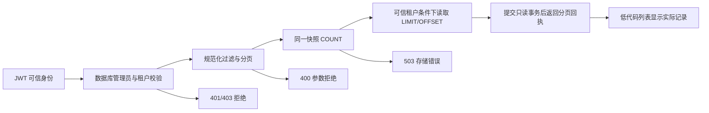

# IAM 安全审计查询

> IAM-AUDIT-01 · 2026-10-02。查询设计权威；审计写入见 [IAM 权限](README.md) 与 [凭证生命周期](API-KEYS.md)。本入口读取真实 audit_log，不合并 sys_operlog、sys_logininfor 或联盟事件流。

## 模块和流程

`iam-core/audit_query` 校验可信租户的启用超级用户、规范化参数，并在同一只读事务快照中计数及查询单页；网关 `system/security` 在线程池执行并返回实际 HTTP 状态；低代码 audit.page 为只读 schema。入口位于 `/admin/iam-audit-lc`，也可在管理审计页选择“IAM 安全审计”。服务端不依据前端角色标签授予管理权。

## API 契约

GET `/api/security/audit-log` 返回 `code:0,data:{items,total,page,page_size}`，替代旧全量数组。外部调用者须同步迁移。

| 参数 | 规则 |
|---|---|
| page | u32 正整数，默认 1；最大值的 offset 用 i64 计算 |
| page_size | 默认 20，范围 1–100 |
| action | 可选、修剪空白、最多 128 字符，精确匹配，不解释为 LIKE/SQL |
| actor | 同上，精确匹配 user_id，不将用户名当作 ID |
| since / until | 可选含时区 RFC3339，包含边界；开始不能晚于结束；空白值视为未指定 |
| tenant_id | 可省略；提供时必须等于可信租户，否则 403 |

COUNT 和单页使用同一个参数化谓词及数据库快照。排序按 `julianday(created_at) DESC,log_id ASC`，使用对应租户/时间/ID 复合表达式索引；初始化幂等添加，不按时间字符串字典序排序。带不同偏移的时间先换算到实际瞬间。SQLite Julian day 具有有限浮点精度，不宣称纳秒区分；同一时间用 log_id 确定顺序。非法历史时间在无时间过滤时排在合法时间之后，在时间范围过滤时不匹配。

返回实际 ID、动作、操作者、资源、HTTP 方法/路径/状态、耗时及时间；不查询或返回 snapshot_before/snapshot_after、prev_hash/curr_hash。未记录的字段保持 null，前端显示“未记录”，不补成功码或零耗时。历史 action_detail 等自由文本仍来自原始写入，敏感信息源端治理尚未完成。

认证缺失 401、非实际管理员或租户冲突 403、无效过滤/分页 400、存储失败 503。无匹配及超出末页返回空 items 和真实 total，不把数据库故障伪装为“暂无记录”。已撤销管理员标志的旧 JWT 后续查询拒绝；撤销提交前已经进入读快照的在途查询可以完成。

## 低代码规范

PageSchema 的 `readOnly:true` 只要求 list 能力，不注册假的 create/update/remove 实现。校验器拒绝表单、声明式写动作和行动作；通用引擎也阻止内置新增、编辑、提交、删除入口。此模式是前端能力约束，不能替代数据库授权。

分页由引擎 pageNum/pageSize 映射到 API page/page_size，使用与凭证页共用的有界响应校验；身份切换及销毁继承请求版本保护。渲染缓存依赖服务端行对象引用，刷新后的状态/日期变化必须重渲，不能只依赖旧 id/name/status 字段。已纠正低代码端点台账中不存在的 `/system/access` 路径。

## 验收与边界

真实文件 SQLite、JWT、TCP 验证 130 条逐页读取、精确过滤/时区边界、不同偏移排序、租户隔离、未记录状态保留、注入字符串按字面匹配、非法参数、超大页号、索引计划、实际存储失败及撤权。证据见 [验证报告](../../../reports/markdown/20261002-iam-audit-query.md)。

仍待完成：真实浏览器全流程、跨页一致性导出、保留/归档、敏感字段治理、审计完整性全链验真、深页与大规模过滤吞吐、跨主机数据库。OFFSET 单页快照不保证多请求期间列表位置不变。旧日志及事件来源未完成全面归一，不宣称全系统审计完备。
