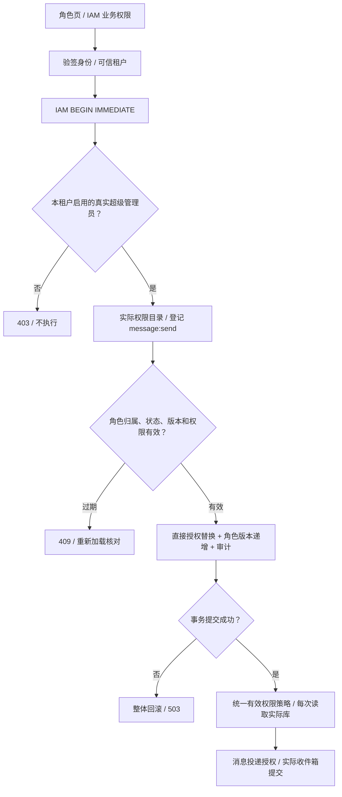

# IAM 业务权限管理

凭证生命周期与机器鉴权的独立权威契约见 [API Key](API-KEYS.md)。
安全审计的分页、过滤、只读低代码入口及验收边界见 [IAM 审计](AUDIT.md)。

> IAM-PERM-01 · 2026-10-02。维护真实业务权限管理与有效权限计算的事实主源；总体能力引用[实现台账](../REAL-IMPLEMENTATION-STATUS.md)，消息交付引用[消息中心](../../README.md)。

## 模块边界

| 层 | 主源与职责 |
|---|---|
| IAM 核心 | [permission_admin.rs](../../../platform/domains/platform/core/mox-platform-iam-core/src/permission_admin.rs)：真实管理员、租户、角色和权限校验；版本检查、授权替换与审计同事务 |
| 有效权限策略 | [permission_policy.rs](../../../platform/domains/platform/core/mox-platform-iam-core/src/permission_policy.rs)：启用租户/用户/角色/权限、角色父链与继承关联、循环去重；get_user_permissions 和消息发送共享策略 |
| 仓储 | [repo.rs](../../../platform/domains/platform/core/mox-platform-iam-core/src/repo.rs)：用户角色绑定先完整校验再事务替换；删除无法跨实例失效的权限内存缓存 |
| HTTP | [iam_permissions.rs](../../../platform/gateway/mox-platform-gateway-svc/src/system/iam_permissions.rs)：可信身份、阻塞线程执行、真实 HTTP 错误及旧入口保护 |
| 前端 | [IamPermissionDialog.vue](../../../frontend-ui/src/components/IamPermissionDialog.vue)：角色页业务权限入口、真实目录与版本读取、事务保存、错误核对与账号切换隔离 |
| 注册 | [API 注册表](../../API-REGISTRY.md)：静态登记不等同于运行验收；融合与独立 IAM 宿主均装配真实路由 |

`iam_permission`、`iam_role_permission`、`iam_user_role` 与 `iam_role.version` 是授权事实主源；`audit_log` 记录本批变更。enterprise/api-permission 的内存目录尚未迁移，不得用其新增权限点代替真实 IAM 授权。本批复用 rusqlite、serde 与 sha2，移除 IAM 核心不再使用的 dashmap 依赖。

## 业务流程

登记权限点不会自动授予普通用户，也不会重新启用已停用的权限点。通过角色直接授权，再通过用户角色绑定关联实际用户；删除直接授权不会移除父角色继承的权限。普通用户的发送能力与系统管理能力是独立权限，不因获得 message:send 成为管理员。

## API 契约

前缀 `/api/system/iam`，所有新端点要求可信身份对应本租户启用的真实超级管理员；不以 JWT 中的 admin 角色代替实际 `is_superuser=1`。

| 方法与路径 | 契约 |
|---|---|
| GET /permissions | 当前租户及 system 的实际权限点，items 包含 id、tenant_id、code、name、status |
| POST /permissions/message-send | 在本租户实际登记 message 资源与 message:send 权限点；既有同编码点返回原 ID，不自动授权或更改状态；新增与审计同事务 |
| GET /roles/:id/permissions | 本租户角色的 version 和直接 permission_ids；非本租户对象 404 |
| PUT /roles/:id/permissions | 必须提供整数 version 及 permission_ids 字符串数组，最多 200 项，去重；未知字段拒绝。只能授予本租户或 system 的启用权限点；角色必须启用 |

PUT 在数据库写锁内重新验证管理员和角色版本；版本过期返回 409，无数据变化。完整替换只修改当前租户该角色的直接关联，角色 version 递增，审计包含操作者及变更前后快照。审计写入失败时授权和版本均回滚。返回成功表示已经提交；客户端关闭自动重试，失败后须重新加载核对，不乐观显示成功。

HTTP 401 为缺少可信身份，403 为管理员或身份作用域不允许，404 为对象不可见，409 为版本冲突，400 为无效状态/权限/版本，503 为实际存储失败。Axum 对类型不符或未知 JSON 字段可返回框架 422。响应不暴露数据库内部错误。

## 旧入口保护与归一范围

`/api/system/user*` 与 `/api/system/role*` 读写入口添加真实管理员及对象租户保护，覆盖角色绑定、角色复制、用户状态和密码重置。查询参数与可信租户冲突返回 403；无参数时注入可信租户，避免默认 T001。非本租户目标返回 404。已撤销超级用户标志的旧 JWT 不能继续管理。

用户角色替换在真实仓储内校验全部目标后一次提交；不存在、停用或跨租户角色拒绝，不会先删除原关联。最多 200 个角色，去重；缺少或混合类型的 roleIds 不再被当作空授权保存。

系统权限与 RBAC 权限查询使用可信当前用户/租户，不接受任意 user_id/tenant_id 覆盖；数据库失败不再伪装空成功。旧 ApiResponse 查询入口仍沿用历史响应封装，错误码须读取正文 code；新管理 API 使用真实 HTTP 状态。

旧用户/角色业务处理仍有各自的事务，入口管理员检查与旧业务写入不是一个共同事务。它们尚未具备新权限替换的完整审计和撤权提交排序保证，后续须迁移到同一核心事务命令。菜单/数据权限遍历与其他管理接口尚未全面归一，本批不声明整个 IAM 已完成安全验收。

## 运行与验证边界

权限缓存已移除，每次有效权限查询使用数据库主源；新权限事务按租户和角色约束作用域。角色继承 UNION 去重终止循环，停用父角色不能提供业务权限；消息模块仍在 IAM 锁保持期间提交收件箱。超级用户自身可以发送站内消息，普通用户必须获得实际 message:send。

审计新增行包含 SHA-256 链接值，但既有审计写入函数仍使用其他口径；没有完成整个历史链的密码学验真、外部锚定或防删除保证。SQLite 仍为同主机实现；未验收跨主机集群、管理吞吐 SLO、权限目录大规模分页、保留和灾备。

前端在账号、令牌、租户和角色切换时清空旧数据，过期请求不能回写。登记权限点时保留尚未保存的选择；保存冲突或失败后禁止继续盲写，要求重新加载。继承权限说明明确，不把勾选列表冒充全部有效授权。

证据和真实测试范围见 [IAM 权限管理验证报告](../../../reports/markdown/20261002-iam-permission-admin.md)。前端构建与真实 HTTP 验证不等同于浏览器完整业务验收。
