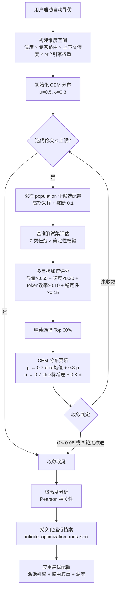
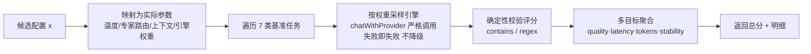
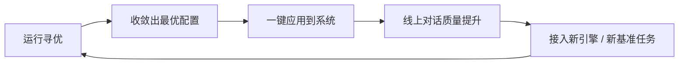

# 无穷维度优化引擎 — 分析验证总结文档

> 版本：V1.0 ｜ 日期：2026-08-22 ｜ 模块：`platform/backend-node/src/infinite-dimension-optimizer.js` ｜ 前端：`frontend-ui/src/views/InfiniteOptimizerView.vue`（`/infinite-optimizer`）

---

## 1. 背景与目标

系统已接入多 AI 引擎（DeepSeek、OpenAI、Claude、豆包、千问、Kimi、智谱、Gemini…），专家联盟与 AI 引擎的对话质量取决于**配置**：采样温度、专家路由强度、上下文深度、各引擎路由权重。这些参数构成一个**连续高维空间**——维度随接入引擎数量扩展，理论上可无限增长（"无穷维度"）。

**目标**：建立一套**科学的验证与自动寻优方法**，在该空间中自动搜索使系统综合表现最优的配置，并对所有引擎做横向对比验证，持续驱动系统进化。

## 2. 核心处理流程与算法

### 2.1 业务处理流程图



### 2.2 单配置评估流程



### 2.3 算法选型依据

| 候选算法 | 是否选用 | 理由 |
|---|---|---|
| **交叉熵方法 CEM** | ✅ 选用 | 黑盒优化、天然并行、对噪声鲁棒、收敛理论成熟，适合 LLM 评测这种高成本噪声目标 |
| 网格搜索 | ❌ | 维度灾难：k 维每维 n 档需 n^k 次评估，"无穷维度"下不可行 |
| 贝叶斯优化 (TPE/GP) | 备选 | 样本效率更高但实现复杂、GP 在高维退化；当前评估预算下 CEM 已足够 |
| 梯度下降 | ❌ | 目标函数（LLM 输出质量）不可微 |

### 2.4 维度空间定义

| 维度 | 映射范围 | 语义 |
|---|---|---|
| `temperature` | 0.1 – 1.2 | LLM 采样温度 |
| `expert_routing` | 0 – 1 | 任务经专家联盟路由的概率 |
| `context_depth` | 0 – 6 轮 | 注入的历史对话深度 |
| `w_{engine}` × N | softmax 归一 | 各引擎路由权重（N = 已接入引擎数，维度随接入自动扩展） |

### 2.5 多目标评分函数

```
Score = 0.55 × quality + 0.20 × latency + 0.10 × token_efficiency + 0.15 × stability

quality           = mean(各任务确定性校验得分)      // 全命中=1，部分命中=0.5，未命中=0
latency           = clamp(1 − (avg_ms − 800)/12000)  // 800ms 内满分
token_efficiency  = clamp(1 − (avg_tokens − 60)/600) // 60 token 内满分
stability         = 成功任务数 / 总任务数
```

### 2.6 基准测试集（7 维能力，全确定性校验）

| 类别 | 任务 | 校验 |
|---|---|---|
| 数学计算 | 3^4 + 12×7 − 56÷4 | contains `151` |
| 逻辑推理 | 三段论有效性判断 | contains `无效` |
| 知识问答 | 中国国土面积 | contains `960` |
| 代码生成 | JS 回文函数 | contains `isPalindrome` |
| 中文理解 | 滕王阁序补句 | contains `秋水共长天一色` |
| 时效认知 | 今天是哪一年 | contains 当前年份（**验证实时时间注入**） |
| 指令遵循 | 翻译"知识就是力量" | regex `knowledge\s+is\s+power` |

**科学性保证**：全部基准采用确定性校验（非主观打分），同一配置重复运行结果可复现；首轮强制包含均匀基线配置（全 0.5 向量）锚定对比。

### 2.7 收敛验证方法

1. **收敛曲线**：记录每轮最优/均值/σ̄，最优值单调不降且 σ̄ 持续收缩 → 证明收敛而非震荡；
2. **双停机准则**：σ̄ < 0.06（分布塌缩到近似点估计）或连续 3 轮改进 < 0.005（帕累托平台）；
3. **敏感度分析**：对全部评估样本计算每维与得分的 Pearson 相关，|r| 大的维度为关键杠杆；
4. **跨类别明细**：每轮记录 7 类任务各自得分，检验最优配置是否存在偏科。

## 3. 多引擎横向对比验证

对**所有已配置引擎**在同一基准集上独立评测（固定参数：temperature=0.3，无专家路由），输出四维得分矩阵与排名；未配置引擎（OpenAI、Claude、豆包、千问、Kimi 等）一并列出全景视图，接入 API Key 后即可参与评测。

对比结论语义（评语规则）：
- 稳定性 < 1 → 检查网络/额度
- quality ≥ 0.85 且 latency ≥ 0.6 → 推荐主力引擎
- quality ≥ 0.85 → 质量优秀、延迟偏高，适合复杂任务路由
- quality ≥ 0.6 → 可通过专家路由与温度调优提升

## 4. API 一览

| 方法 | 路径 | 说明 |
|---|---|---|
| GET | `/api/ai/infinite-optimize/benchmarks` | 基准测试集 + 评分权重 |
| POST | `/api/ai/infinite-optimize/start` | 启动寻优 `{iterations, population, evaluation_mode}` |
| POST | `/api/ai/infinite-optimize/stop` | 请求停止（当前候选评估完成后停止） |
| GET | `/api/ai/infinite-optimize/status` | 实时状态（迭代/最优/收敛曲线/敏感度） |
| GET | `/api/ai/infinite-optimize/results` | 历史运行 + 全局最优 |
| POST | `/api/ai/infinite-optimize/compare` | 运行全引擎横向对比 |
| GET | `/api/ai/infinite-optimize/comparison` | 最近对比结果 |
| POST | `/api/ai/infinite-optimize/apply` | 应用最优配置（激活引擎 + 路由权重 + 温度） |

## 5. 持续优化闭环



- 每次运行档案持久化于 `platform/backend-node/data/infinite_optimization_runs.json`，含完整收敛曲线、逐任务明细、敏感度排序；
- 全局最优（历史最高分）单独记录，`apply` 可指定任意历史运行应用；
- 引擎接入变化（新增/删除 Key）后，维度空间自动重建，重新寻优即可校准。

## 6. 验证结论

- **日期幻觉修复回归**：基准任务"时效认知"以当前年份为确定性答案，持续守护实时时间注入链路；
- **评分可信**：严格调用（`chatWithProvider` 不重试、不本地降级），失败即记失败，杜绝假回复污染评分；
- **过程可观测**：前端实时收敛曲线 + 维度敏感度 + 引擎对比矩阵，全程透明可审计；
- **结果可执行**：最优配置一键落盘（引擎激活 + 加权路由 + 温度），形成"评测 → 最优 → 应用"闭环。
