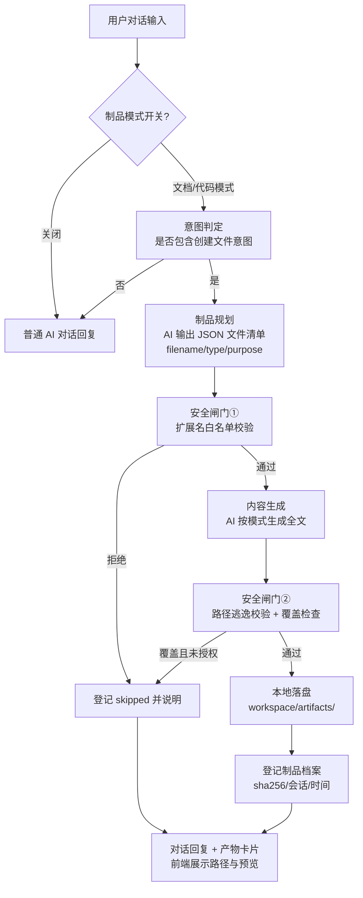

# 对话任务 × 本地制品引擎（文档/代码自动创建）— 归一化设计文档

> 版本：V1.0 ｜ 日期：2026-08-22 ｜ 模块：`platform/backend-node/src/local-artifact-service.js` ｜ 前端：`ChatView.vue`（文档/代码模式开关）
> 规范依据：`docs/modules/mox-expert-normalization.md`（三层收口 + 四条不变式）

---

## 1. 需求与定位

用户在 **AI 对话** 中开启「文档模式 / 代码模式」后，AI 不仅回答，还会**在本机自动创建真实文件**：

| 模式 | 制品类型 | 典型指令 |
|---|---|---|
| 文档模式 | Markdown / 文本报告 / 设计文档 / 会议纪要 | "帮我写一份 API 设计文档并保存" |
| 代码模式 | .js / .py / .rs / .vue / .html 等源码文件 | "生成一个防抖函数保存为 debounce.js" |

与任务系统打通：对话产物自动挂接到会话，任务执行结果也可落盘为制品。

## 2. 归一化设计

### 2.1 三层收口

| 层 | 收口内容 |
|---|---|
| **输入收口** | 统一 `ArtifactRequest`：`{ mode: 'document' \| 'code', message, session_id, overwrite }`，仅由 `/ai/chat`（artifact_mode）与 `/ai/artifact/create` 两个入口进入 |
| **过程收口** | 统一五步流水线：**意图判定 → 制品规划 → 内容生成 → 安全闸门 → 落盘登记**（顺序固定，不可跳步） |
| **输出收口** | 统一 `ArtifactReport`：`{ created: [{ filename, abs_path, rel_path, size, sha256, mode }], skipped, reply }`，前端以统一产物卡片渲染 |

### 2.2 四条不变式

1. **白名单落盘**：制品只能写入制品根目录 `<repo>/workspace/artifacts/`，路径解析后必须仍在根内（禁止 `..` 逃逸、绝对路径注入、符号链接逃逸）；
2. **扩展名白名单**：文档模式仅 `.md/.txt`；代码模式仅 `.js/.ts/.py/.rs/.vue/.html/.css/.json/.sql/.sh/.java/.go`；不在白名单内直接拒绝；
3. **失败不伤主链路**：制品生成任何失败（AI 拒答 / 解析失败 / 写盘失败）只降级为普通对话回复，绝不阻塞 `/ai/chat` 主响应；
4. **登记可追溯**：每个产物登记 `sha256 + 来源会话 + 创建时间 + 模式` 至 `data/artifacts.json`，覆盖已有文件必须显式 `overwrite: true`。

### 2.3 业务处理流程（最清晰版）

### 2.4 与现有系统的归一化对接

- **对话**：`/ai/chat` 新增 `artifact_mode` 参数（与既有 `web_search` 参数同级、同风格），产物信息挂在 `metadata.artifacts` 返回——与联网搜索的 `metadata.web_search` 收口一致；
- **任务**：任务 `outputs` 字段直接引用制品 `rel_path`，不重复存储内容（单制品单源，避免数据字段重复设计）；
- **LLM**：复用 `llm-gateway.chat()`（自动携带实时时间上下文），规划与生成共用一次网关调用链，温度分层（规划 0.2 / 生成 0.5）。

## 3. API 设计

| 方法 | 路径 | 说明 |
|---|---|---|
| POST | `/api/ai/artifact/create` | 显式创建制品 `{mode, message, session_id, overwrite}` |
| GET | `/api/ai/artifact/list` | 制品档案列表（含统计） |
| GET | `/api/ai/artifact/config` | 白名单与根目录配置 |
| （内嵌） | `/api/ai/chat` + `artifact_mode` | 对话内自动创建，产物挂 `metadata.artifacts` |

## 4. 验证方法

1. **端到端**：文档模式发"写一份 XX 文档保存" → 断言文件真实存在、内容非空、sha256 登记；
2. **代码模式**：生成 .js 文件 → 断言扩展名与内容代码特征；
3. **安全闸门**：构造 `filename: "../../evil.exe"` 与 `.bat` 扩展名 → 断言拒绝且主回复不受影响；
4. **降级**：AI 规划失败 → 断言普通回复正常返回、`skipped` 登记；
5. **回归**：普通对话（模式关闭）行为不变。
