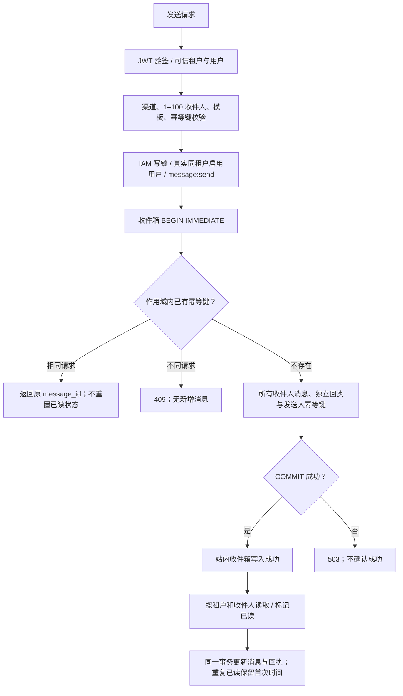

# 消息中心：事务收件箱与交付边界

> MSG-IMPL-01 · 2026-10-02 · 本页维护消息中心的实现、流程与契约。总体状态引用[实现验收台账](../REAL-IMPLEMENTATION-STATUS.md)，禁止 mock 遵循[统一规范](../NO-MOCK-POLICY.md)。

## 模块归属与事实主源

| 层 | 当前实现与职责 |
|---|---|
| 宿主 | [enterprise_features.rs](../../../platform/gateway/mox-platform-gateway-svc/src/enterprise_features.rs) 组装路由；健康接口探测当前用户收件箱数据库，不宣布所有模块可用 |
| HTTP 适配 | [api.rs](../../../platform/gateway/mox-platform-gateway-svc/src/message_center/api.rs)：可信身份、输入校验、模板渲染、分页及错误映射；阻塞数据库操作进入 spawn_blocking |
| 交付授权 | [authorization.rs](../../../platform/gateway/mox-platform-gateway-svc/src/message_center/authorization.rs)：真实 IAM 用户、租户、启用角色和权限逐次校验；授权锁持有至收件箱提交 |
| 数据模型 | [mod.rs](../../../platform/gateway/mox-platform-gateway-svc/src/message_center/mod.rs)：消息、渠道、状态与回执；serde snake_case 是接口值的唯一口径 |
| 持久化 | [repository.rs](../../../platform/gateway/mox-platform-gateway-svc/src/message_center/repository.rs)：消息/回执/幂等标识事务；按租户和收件人读取数据库，无内存消息镜像 |
| 运行配置 | 状态构造时固定 MOX_STORE_DB_PATH；缺省 data/store.db；不提供请求参数切换数据库位置 |

复用已有 rusqlite、sha2 和 store_db_path，不新增消息中间件依赖。旧收件箱仅存在于进程内存，无历史落盘文件可自动恢复。本次没有把其他模块的 collections 投影升级为事务主源。当前业务实现仍位于网关存量模块；领域拆分沿用[模块落位规则](../../README.md)，本次没有声称六层迁移已完成。

## 已实现业务流程

发送成功代表所有收件人站内收件箱事务提交；不代表邮件、短信或外部平台投递。外部渠道和定时发送尚未接通，返回 501，不产生假消息或发送回执。生产宿主已注入实际 IAM；未注入 IAM 的独立构造仍限可信当前用户自收，跨用户返回 501。

## HTTP 契约

网关挂载前缀为 `/api/enterprise/message`；端口以[注册表](../../api/PORT-REGISTRY.md)为准。所有业务操作依赖可信身份，不接收请求提供的 tenant_id/sender_id 覆盖。

| 方法与后缀 | 输入与结果 |
|---|---|
| POST /send | 原 SendMessageRequest；可选 Idempotency-Key 头：1–128 个 ASCII 字母、数字或 `-_.:`；返回已提交的 message_id |
| GET /messages | 默认 limit=50，范围 1–200；offset 为非负 i64；message_type/status 使用 snake_case；total 为作用域与筛选条件下总数，与分页共用读取快照 |
| GET /messages/:id | 非本租户/收件人的 ID 与不存在 ID 均返回 404 |
| POST /messages/:id/read | 消息及回执同步已读；重复调用不修改首次 read_at；无权访问返回 404 |
| GET /stats | SQL 按当前租户与收件人聚合，不下载全箱到内存 |
| GET /channels、/templates | 静态渠道能力与内建模板目录；仅 in_app 可用，模板不存在返回 404 |

幂等范围为 `(可信租户, 发送人, Idempotency-Key)`。跨用户请求先按收件人 ID 排序、去重，再对类型化请求递归排序 JSON 对象键并计算 SHA-256；自收请求保留原收件人数组参与指纹，以兼容旧版重复自收 ID 的重试。相同请求重试返回原 ID，不同内容或收件人集合复用键返回 409。不同发送人/租户可使用同名键。没有提供键的请求仍会各自创建消息，客户端重试须保留原键。幂等记录随消息保留，当前没有清理接口；未来保留策略不能提前删除活跃重试窗口的标识。

400 表示非法渠道/收件人数/分页/幂等键；403 统一表示发送身份、权限或收件人不可用，不披露哪个用户存在；404 表示消息或模板不可见；409 表示幂等冲突；501 表示未实现的交付能力；503 表示存储或阻塞任务失败。响应不泄露数据库路径和内部错误；服务日志记录故障。低代码发布与配置覆盖遵循[统一配置规范](../../standards/lowcode-dynamic-configuration.md)，当前内建模板不具备动态发布/回滚能力。

企业健康接口 `/api/enterprise/health` 是部分能力报告：收件箱数据库可读时 HTTP 200 / partial，失败时 503 / degraded。`enterprise_ready=false`；其他模块标为 unverified，同步标为 sync_not_implemented。该接口不是完整企业系统的 readiness 门禁，存储探测也不能证明 SMTP/LLM/OSS 已交付。

## 事务与部署约束

`inbox_messages` 以 `(tenant, receiver, id)` 为主键，保留旧收件人幂等列及唯一约束以兼容旧库；新行不使用该列。`inbox_dispatch_keys` 以 `(tenant,sender,key)` 唯一约束控制整个投递批次。`inbox_receipts` 外键引用消息；查询在 SQL 中先限制作用域再反序列化。所有消息、回执和幂等占位同时提交；已读更新也在同一事务中。每个收件人得到同一个 message_id 的独立行，receiver_ids 仅含自己，避免向收件人披露其他目标；发送人没有隐含的收件箱访问权。

数据库升级版本 2 在事务内回填旧自收消息的幂等键并记录 `inbox_schema_migrations`。旧消息、回执、已读状态均保留，重复发送仍返回原 ID；迁移失败不继续确认业务成功。迁移标记避免每次读取扫描旧消息。升级后若回退旧程序，不能识别新发送人幂等表，须先停止写入并按备份恢复，不能把旧二进制直接接回继续写。

实际连接配置为 WAL、synchronous=FULL、foreign_keys=ON、busy_timeout=5s。首次并发设置 WAL 遇到 SQLITE_BUSY/LOCKED 时做有界等待；不重放业务事务，其他错误直接失败。FULL 的持久性仍依赖底层文件系统和磁盘。不能直接仅复制运行中的主数据库文件作为完整备份。

**当前支持同主机上的独立连接/服务实例共享文件；尚未实现跨主机分布式数据库。** [SQLite WAL 官方约束](https://www.sqlite.org/wal.html)要求相关进程位于同一主机；不把 WAL 文件放在网络共享盘作为集群方案。本次验证的是服务重建及事务回滚，没有完成断电/主机故障、灾备或跨主机压测。

## 分阶段退出条件

### 通知入口归一（2026-10-02 增量）

`notification.rs` 现在只适配事务收件箱，`/api/notifications` 不再读取没有租户/收件人归属的旧全局集合。旧 `collections.notification.notifications` 和 notifications.json 保留原样，未自动分配给当前用户。历史迁移必须先确定租户、收件人和版本；没有归属的数据不能恢复为所有人可见。

| 兼容通知接口 | 当前契约 |
|---|---|
| GET /api/notifications | page 默认 1；page_size 或 limit 默认 20、范围 1–100；分页溢出返回 400；data 包含 items、total、page、page_size；unread_only=true 只返回 sent |
| GET /api/notifications/unread-count | SQL 统计当前用户完整收件箱，data.total 与 by_type；类别为 task、alert、message，其他消息类型映射为 message；不再返回旧的无归属 latest_notification |
| PUT /api/notifications/:id/read | 与消息接口共用作用域和消息/回执事务；无权访问 404 |
| PUT /api/notifications/read-all | 同一事务更新当前用户全部 sent 消息及回执；任一 SQL 失败或回执数量不一致则回滚；重复调用不修改首次 read_at |

前端 NotificationCenter 复用已有入口，支持分页、全箱未读徽标、完整正文详情与键盘操作；账号/令牌切换清空旧消息，旧请求不能回写当前状态。失败展示错误与重试，不伪造业务数据。批量已读禁用客户端自动重试，避免网络失败后重复操作新到消息。分类筛选仍在当前页进行，分类徽标表示全箱未读数，二者范围不同。

通知归一批次尚未开放跨用户发送；后续 IAM 交付增量见下一节。组织模块仍含示例人员，消息投递直接使用 IAM 主源，不使用示例员工目录。

增量验证见[通知归一报告](../../../reports/markdown/20261002-notification-unification.md)，服务端使用真实 JWT/TCP/SQLite；前端构建不等同于完整浏览器登录验收。

| 阶段 | 实施状态 | 可验证退出条件 |
|---|---|---|
| M1 事务站内箱 | 已实现，专项测试通过 | 重建恢复、12 并发幂等、不同内容 409、回执失败完整回滚、双服务 HTTP 可见、租户与用户越权拒绝、分页、健康实际探测 |
| M2 跨用户交付 | IAM 投递链已实现，运营门禁待补 | 同租户真实用户、发送授权、独立已读、撤权与事务回滚；剩余发送 UI、按租户/发送人速率与容量限制 |
| M3 集群持久化 | 待开发 | 基于现有数据库基础能力提供事务适配，跨主机实例、故障转移、唯一约束和撤权新鲜度；不能用进程锁替代数据库约束 |
| M4 外部渠道 | 待开发 | 发送意图与 outbox 原子提交、租约与 fencing、真实提供方回执、未知投递状态对账、取消/重试/死信；不得把重试等同于外部动作只执行一次 |
| M5 企业运营 | 待验收 | 保留/恢复、版本升级、密钥引用、trace、容量与延迟 SLO、浏览器完整业务链路 |

异步执行的总体设计继续引用[ADR-14](../../enterprise/33-持久化工作流引擎设计文档-ADR-14.md)，配置版本引用[ADR-18](docs/enterprise/46-低代码全维配置控制与运行边界-ADR-18.md#decision)，不在本模块另建一套工作流或配置规范。

## IAM 跨用户交付（2026-10-02 增量）

生产 GatewayState 将实际 IamRepository 注入消息中心，通知适配器共享此状态。每批输入 1–100 个收件人 ID，去重后投递；租户、发送人和所有收件人必须在 IAM 中为 active，同租户校验不接受 JWT 角色列表或请求身份覆盖。自收无需额外发送权限；跨用户要求实际超级用户或启用角色授予启用的 `message:send` 权限。角色父链和继承关联采用 [IAM 统一有效权限策略](../../README.md)，只采纳本租户或 system 的启用角色，循环通过 SQL UNION 去重终止。真实管理员可在角色页“业务权限”登记实际权限点并版本化授权，再绑定用户角色；不会自动给普通用户增加发送权限。enterprise/api-permission 的内存目录尚未迁移，不能据此视为 IAM 授权。

发送、查询、单条和批量已读、未读计数均逐请求读取 IAM，不使用权限缓存。已撤销发送权限的请求即使复用原幂等键也返回 403；停用用户仍持有未过期 JWT 时，不能继续读取或更新消息。权限撤销不会删除收件人已持有的消息；消息保留与删除是独立策略。

授权使用 IAM 数据库 BEGIN IMMEDIATE，按 IAM → 收件箱的固定顺序获取锁，保持至收件箱提交，防止校验后、落盘前被另一 IAM 连接撤权。IAM 事务仅读取，退出时回滚释放锁；业务写入仅发生在收件箱事务，未声称两个数据库分布式提交。IAM 和收件箱必须使用不同 SQLite 文件；相同文件的第二连接会锁等待并失败，当前不支持该部署配置。其他服务必须通过同一 IAM 数据库提交变更，不能靠进程缓存或复制文件实现即时撤权。

当前锁策略牺牲 IAM 写并行度以保证同主机授权与提交顺序；尚无吞吐 SLO 或跨主机新鲜度证明。100 个收件人的单批上限不等于发送速率或长期容量治理，仍需配额、限流、保留与告警。发送页面和完整登录浏览器链路未在本增量验收。验证报告：[IAM 消息交付](../../../reports/markdown/20261002-iam-message-delivery.md)。

## 验收证据

真实文件数据库、生产 JWT 中间件、两个真实 TCP 服务使用生产消息路由；未替换业务服务。数据库拒绝回执写入使用实际 SQLite 触发器制造事务失败。专项证据位于 `reports/data/20261002-inbox-consistency/`，结论见[验证报告](../../../reports/markdown/20261002-inbox-consistency.md)。测试通过范围不外推到所有企业模块。
