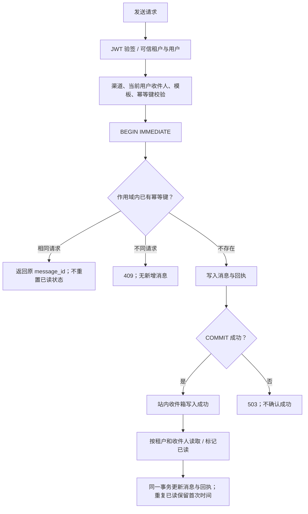

# 消息中心：事务收件箱与交付边界

> MSG-IMPL-01 · 2026-10-02 · 本页维护消息中心的实现、流程与契约。总体状态引用[实现验收台账](docs/modules/REAL-IMPLEMENTATION-STATUS.md)，禁止 mock 遵循[统一规范](docs/modules/NO-MOCK-POLICY.md)。

## 模块归属与事实主源

| 层 | 当前实现与职责 |
|---|---|
| 宿主 | [enterprise_features.rs](../../../platform/gateway/mox-platform-gateway-svc/src/enterprise_features.rs) 组装路由；健康接口探测当前用户收件箱数据库，不宣布所有模块可用 |
| HTTP 适配 | [api.rs](../../../platform/gateway/mox-platform-gateway-svc/src/message_center/api.rs)：可信身份、输入校验、模板渲染、分页及错误映射；阻塞数据库操作进入 spawn_blocking |
| 数据模型 | [mod.rs](../../../platform/gateway/mox-platform-gateway-svc/src/message_center/mod.rs)：消息、渠道、状态与回执；serde snake_case 是接口值的唯一口径 |
| 持久化 | [repository.rs](../../../platform/gateway/mox-platform-gateway-svc/src/message_center/repository.rs)：消息/回执/幂等标识事务；按租户和收件人读取数据库，无内存消息镜像 |
| 运行配置 | 状态构造时固定 MOX_STORE_DB_PATH；缺省 data/store.db；不提供请求参数切换数据库位置 |

复用已有 rusqlite、sha2 和 store_db_path，不新增消息中间件依赖。旧收件箱仅存在于进程内存，无历史落盘文件可自动恢复。本次没有把其他模块的 collections 投影升级为事务主源。当前业务实现仍位于网关存量模块；领域拆分沿用[模块落位规则](docs/modules/README.md)，本次没有声称六层迁移已完成。

## 已实现业务流程

发送成功代表站内收件箱事务提交；不代表邮件、短信或外部平台投递。外部渠道、定时发送与跨用户收件人目录尚未接通，返回 501，不产生假消息或发送回执。

## HTTP 契约

网关挂载前缀为 `/api/enterprise/message`；端口以[注册表](docs/api/PORT-REGISTRY.md)为准。所有业务操作依赖可信身份，不接收请求提供的 tenant_id/sender_id 覆盖。

| 方法与后缀 | 输入与结果 |
|---|---|
| POST /send | 原 SendMessageRequest；可选 Idempotency-Key 头：1–128 个 ASCII 字母、数字或 `-_.:`；返回已提交的 message_id |
| GET /messages | 默认 limit=50，范围 1–200；offset 为非负 i64；message_type/status 使用 snake_case；total 为作用域与筛选条件下总数，与分页共用读取快照 |
| GET /messages/:id | 非本租户/收件人的 ID 与不存在 ID 均返回 404 |
| POST /messages/:id/read | 消息及回执同步已读；重复调用不修改首次 read_at；无权访问返回 404 |
| GET /stats | SQL 按当前租户与收件人聚合，不下载全箱到内存 |
| GET /channels、/templates | 静态渠道能力与内建模板目录；仅 in_app 可用，模板不存在返回 404 |

幂等范围为 `(可信租户, 当前收件人, Idempotency-Key)`。请求指纹对类型化请求递归排序 JSON 对象键后计算 SHA-256；相同请求重试返回原 ID，不同内容复用键返回 409。不同用户/租户可使用同名键。没有提供键的请求仍会各自创建消息，客户端重试须保留原键。幂等记录随消息保留，当前没有清理接口；未来保留策略不能提前删除活跃重试窗口的标识。

400 表示非法渠道/分页/幂等键；404 表示消息或模板不可见；409 表示幂等冲突；501 表示未实现的交付能力；503 表示存储或阻塞任务失败。响应不泄露数据库路径和内部错误；服务日志记录故障。低代码发布与配置覆盖遵循[统一配置规范](docs/standards/lowcode-dynamic-configuration.md)，当前内建模板不具备动态发布/回滚能力。

企业健康接口 `/api/enterprise/health` 是部分能力报告：收件箱数据库可读时 HTTP 200 / partial，失败时 503 / degraded。`enterprise_ready=false`；其他模块标为 unverified，同步标为 sync_not_implemented。该接口不是完整企业系统的 readiness 门禁，存储探测也不能证明 SMTP/LLM/OSS 已交付。

## 事务与部署约束

`inbox_messages` 以 `(tenant, receiver, id)` 为主键，另有作用域幂等唯一约束和时间排序索引。`inbox_receipts` 外键引用消息；查询在 SQL 中先限制作用域再反序列化。消息、回执和幂等占位同时提交；已读更新也在同一事务中。

实际连接配置为 WAL、synchronous=FULL、foreign_keys=ON、busy_timeout=5s。首次并发设置 WAL 遇到 SQLITE_BUSY/LOCKED 时做有界等待；不重放业务事务，其他错误直接失败。FULL 的持久性仍依赖底层文件系统和磁盘。不能直接仅复制运行中的主数据库文件作为完整备份。

**当前支持同主机上的独立连接/服务实例共享文件；尚未实现跨主机分布式数据库。** [SQLite WAL 官方约束](https://www.sqlite.org/wal.html)要求相关进程位于同一主机；不把 WAL 文件放在网络共享盘作为集群方案。本次验证的是服务重建及事务回滚，没有完成断电/主机故障、灾备或跨主机压测。

## 分阶段退出条件

| 阶段 | 实施状态 | 可验证退出条件 |
|---|---|---|
| M1 事务站内箱 | 已实现，专项测试通过 | 重建恢复、12 并发幂等、不同内容 409、回执失败完整回滚、双服务 HTTP 可见、租户与用户越权拒绝、分页、健康实际探测 |
| M2 跨用户交付 | 待开发 | 组织目录校验、收件人权限、独立已读状态、撤权、速率/容量限制和真实通知前端 |
| M3 集群持久化 | 待开发 | 基于现有数据库基础能力提供事务适配，跨主机实例、故障转移、唯一约束和撤权新鲜度；不能用进程锁替代数据库约束 |
| M4 外部渠道 | 待开发 | 发送意图与 outbox 原子提交、租约与 fencing、真实提供方回执、未知投递状态对账、取消/重试/死信；不得把重试等同于外部动作只执行一次 |
| M5 企业运营 | 待验收 | 保留/恢复、版本升级、密钥引用、trace、容量与延迟 SLO、浏览器完整业务链路 |

异步执行的总体设计继续引用[ADR-14](docs/enterprise/33-持久化工作流引擎设计文档-ADR-14.md)，配置版本引用[ADR-18](docs/enterprise/46-低代码全维配置控制与运行边界-ADR-18.md#decision)，不在本模块另建一套工作流或配置规范。

## 验收证据

真实文件数据库、生产 JWT 中间件、两个真实 TCP 服务使用生产消息路由；未替换业务服务。数据库拒绝回执写入使用实际 SQLite 触发器制造事务失败。专项证据位于 `reports/data/20261002-inbox-consistency/`，结论见[验证报告](../../../reports/markdown/20261002-inbox-consistency.md)。测试通过范围不外推到所有企业模块。
