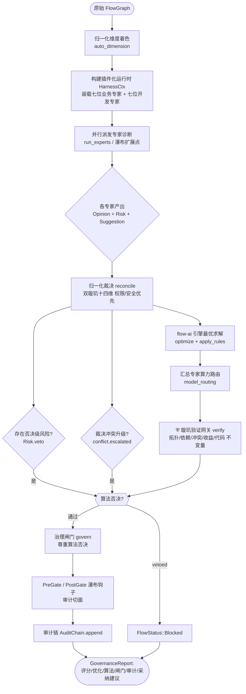
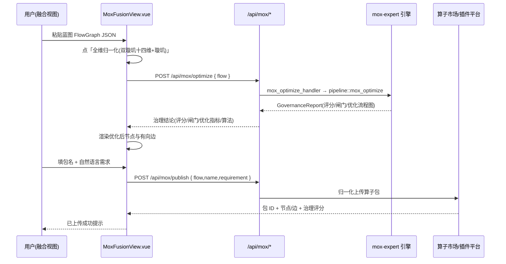
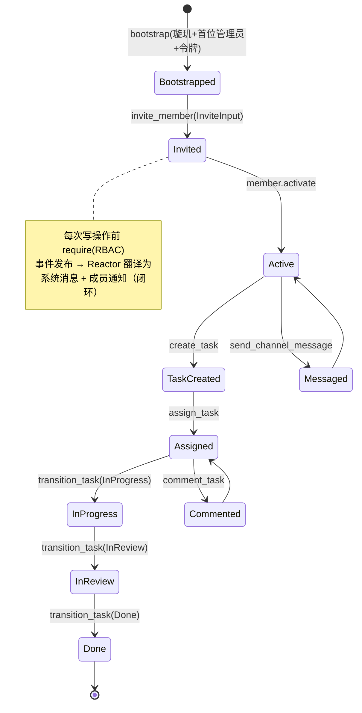

# 璇玑（璇玑）与璇玑融合 业务流程图

> **标题**：璇玑与璇玑融合业务流程图
> **版本**：V1.0
> **权威等级**：🟡参考
> **编号**：EA-DOC-054
> **文档层级**：L4流程标准层
> **最后更新日期**：2026-08-31
> **主责联盟**：开发联盟 R
> **单源声明**：本文档是mox-expert融合业务流程的可视化参考。冲突时以 `docs/standards/expert-alliance-normalization-mode.md` 为准。
>
> 💡 **术语说明**：璇玑/Mox，指同一系统，代码中统一使用 mox- 前缀。

> 配套代码：`crates/mox-expert`（璇玑/璇玑引擎）、`crates/mox-system`（璇玑协作系统）、
> `frontend/src/views/MoxFusionView.vue`（璇玑融合视图）、`crates/runtime/src/main.rs`（HTTP 入口）。
> 本文全部流程以**真实函数与端点**为准，可用 Mermaid 直接渲染。

---

## 0. 图例

| 图形 | 含义 |
|------|------|
| `([开始])` / `([结束])` | 流程起止 |
| `[处理节点]` | 算子执行 / 专家诊断 / 治理裁决 |
| `{条件分支}` | 按置信度 / 优先级 / 否决标志路由 |
| `{{闸门/验证}}` | 璇玑验证网关 / 治理闸门（最高权限） |
| `>人工任务]` | 需人工审批的节点 |
| `[[状态/图谱]]` | 守恒校验 / 审计链 / 知识沉淀 |

---

## 1. 璇玑全维归一化流水线（核心引擎）

入口：`mox_expert::pipeline::mox_optimize(raw: &FlowGraph, ctx: &GovernContext) -> GovernanceReport`
（`crates/mox-expert/src/pipeline.rs:41`）。



**双璇玑十四维**（权限/安全压过性能/成本）：
- 业务七维：`permission` `security` `resource` `data` `algorithm` `business` `observability`
- 开发七维：`architecture` `security_code` `code_quality` `performance` `testing` `documentation` `maintainability`
（定义见 `crates/mox-expert/src/lib.rs` `DIM_PRIORITY` / `DIM_THRESHOLD`）

**关键不变式**：璇玑验证（`verify.rs`）结论为最高权限，治理闸门（`govern.rs`）不可覆盖；
任一阻断级检查失败 → `vetoed=true` → 闸门必须 `Blocked`（记录 `algorithm_veto`）。

---

## 2. 璇玑融合视图端到端流程（传媒融合 / Mox Fusion）

前端：`frontend/src/views/MoxFusionView.vue`；后端入口：`crates/runtime/src/main.rs:502-504`。



三栏对应（`MoxFusionView.vue`）：
1. **业务蓝图（归一化输入）**：FlowGraph JSON（nodes/edges）。
2. **治理结论**：`report.governance.score/gate`、`report.optimization.metric/algorithm`、优化后节点与有向边。
3. **融合上传**：一键归一化上传到算子市场（插件/应用平台）。

---

## 3. 璇玑系统协作闭环（MoxSystem + Reactor）

门面：`crates/mox-system/src/orchestrator.rs`；事件反应器：`Reactor::handle`。



**统一数据流**：`鉴权(require) → 领域动作(服务层) → 事件发布(bus)`；
`Reactor` 订阅 `EventBus`，把 `MemberInvited / TaskCreated / TaskAssigned / TaskStatusChanged` 等
领域事件翻译为系统消息与成员通知，实现「任务变更 → 自动通信」闭环。

---

## 4. 端到端总览（请求级）

```mermaid
flowchart LR
    subgraph FE[前端]
        A1[ChatView/GraphView]
        A2[MoxFusionView 璇玑融合]
    end
    subgraph RT[运行时 runtime/Axum]
        B1[API 网关 鉴权+限流]
        B2[/api/mox/optimize]
        B3[/api/mox/publish]
    end
    subgraph EA[璇玑 璇玑]
        C1[归一化+七专家]
        C2[裁决+flow-ai 求解]
        C3[⛨璇玑验证+治理闸门]
    end
    subgraph AS[璇玑系统]
        D1[成员/任务/权限/通信]
        D2[事件反应器闭环]
    end
    A1 --> B1
    A2 --> B2
    A2 --> B3
    B2 --> C1 --> C2 --> C3
    C3 --> A2
    B3 --> D1
    D1 --> D2 --> D1
```

---

## 5. 与既有文档/端点的对齐校验

| 流程环节 | 真实代码/端点 | 状态 |
|---------|--------------|------|
| 归一化流水线 | `mox_expert::pipeline::mox_optimize` (`pipeline.rs:41`) | ✅ |
| 璇玑最高权限验证 | `verify()` (`verify.rs:43`) | ✅ |
| 治理闸门 | `govern()` (`govern.rs`) | ✅ |
| 融合归一化端点 | `POST /api/mox/optimize` (`runtime/main.rs:503`) | ✅ |
| 融合上传端点 | `POST /api/mox/publish` (`runtime/main.rs:504`) | ✅ |
| 前端三栏视图 | `MoxFusionView.vue` | ✅ |
| 璇玑协作闭环 | `MoxSystem` + `Reactor` (`orchestrator.rs`) | ✅ |

> 结论：璇玑与璇玑融合功能**端到端闭环完整**，流程图与代码实现一致。
> 后续优化方向见《多轮优化记录》。
