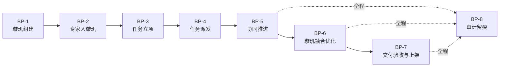
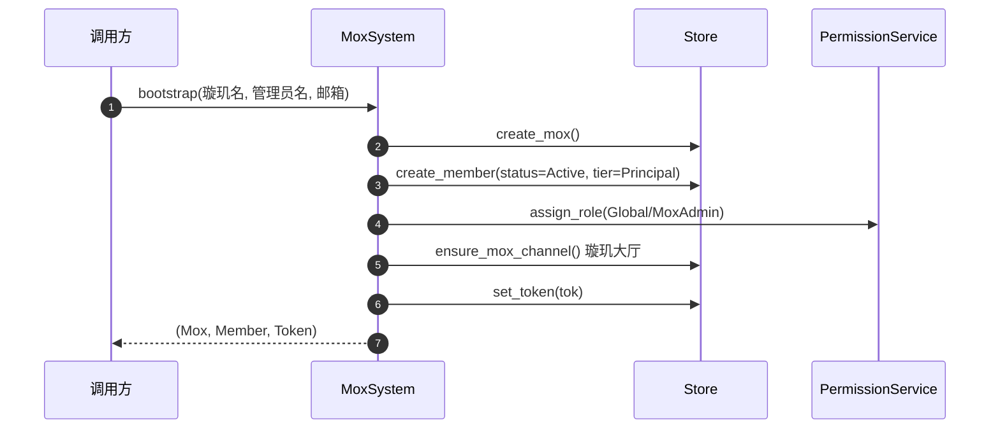
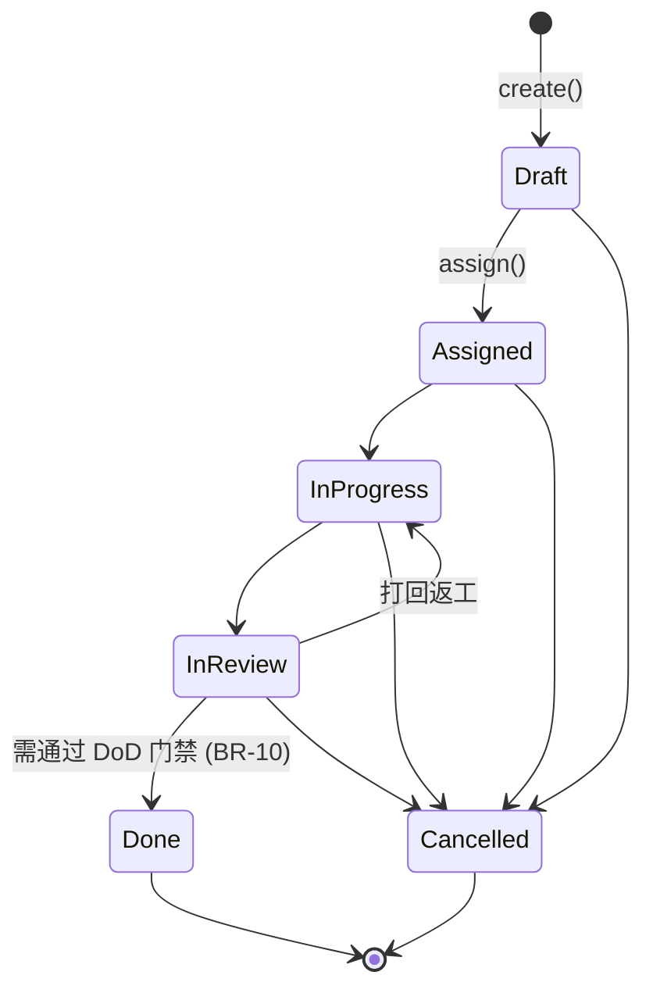
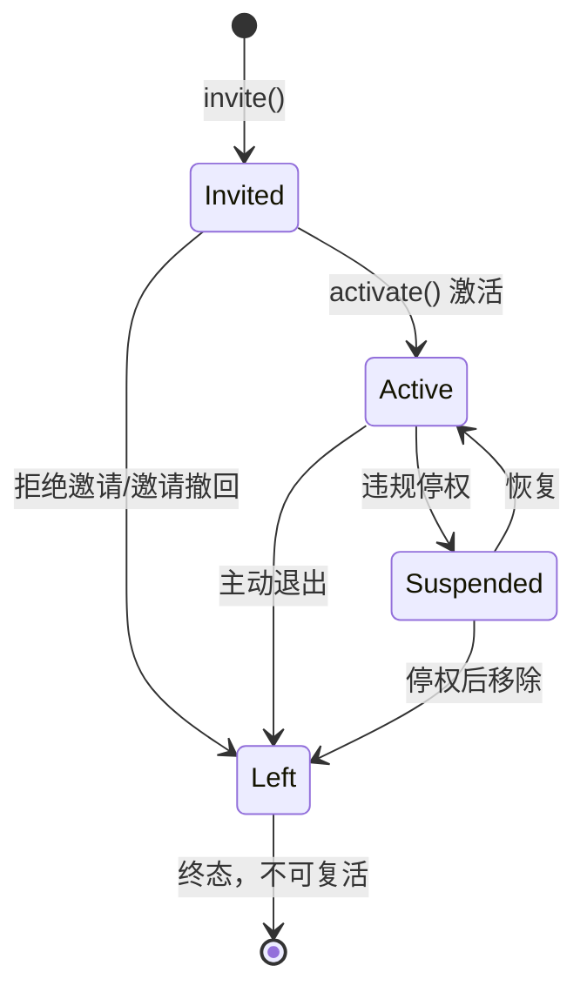

# 璇玑 · 璇玑融合 —— 企业级业务处理流程需求规格

> 文档类型：业务处理流程需求规格（BRD + 领域规则 + 需求追踪矩阵）
> 适用系统：`crates/mox-system`（协作治理域）、`crates/mox-expert`（璇玑融合引擎域）、`frontend/src/views/MoxFusionView.vue`（融合工作台）
> 配套流程图：[`mox-expert-alliance-fusion-flows.md`](./mox-expert-alliance-fusion-flows.md)
> 编写原则：**每条需求必须可验证**——要么映射到真实代码位置，要么标记为 `GAP` 并给出验收断言。

---

## 1. 范围与目标

### 1.1 业务定位

系统承载两条互补的业务主线：

| 主线 | 业务语义 | 承载域 |
|---|---|---|
| **璇玑（协作治理）** | 把跨组织的领域专家组织成受治理的协作体：组建璇玑 → 专家入璇玑 → 任务派发 → 协同推进 → 全程留痕 | `mox-system` |
| **璇玑融合（算子融合）** | 把专家提交的业务流程做归一化、七维专家会诊、冲突消解、治理裁决，产出可复用的优化算子并上架 | `mox-expert` |

两条主线在业务上串联：**璇玑产出「谁来做、做什么、是否通过」的组织决策；璇玑融合产出「怎么做得更快、是否可信」的技术决策。**

### 1.2 本规格解决的核心问题

企业级落地的关键不在功能有无，而在**约束是否闭合**。具体要回答四个问题：

- **谁能做什么**（权限边界是否可越）
- **什么状态能到什么状态**（生命周期是否可绕）
- **什么条件下才算完成**（交付门禁是否可跳）
- **做过什么留了什么痕**（合规审计是否可查）

---

## 2. 参与角色与权限矩阵

### 2.1 角色定义

角色实现见 `crates/mox-system/src/rbac.rs:63`，继承链 `Coordinator → Expert → Member`（见 `rbac.rs:112`）。

| 角色 | 业务职责 | 继承 |
|---|---|---|
| `MoxAdmin` 璇玑管理员 | 璇玑最高治理权：成员管理、任务全权、审计查看 | — |
| `Coordinator` 协调员 | 任务运营与成员邀请，不可暂停/移除成员 | Expert |
| `Expert` 专家 | 承接任务、推进自己被分派的任务、参与协作 | Member |
| `Member` 普通成员 | 受限参与：只读自己相关任务、评论 | — |
| `Auditor` 审计员 | 全局只读 + 审计查看，无任何写权限 | — |

### 2.2 权限矩阵（真实展开，含继承）

`✓` = 直接拥有；`↑` = 经继承获得；`—` = 无。

| 权限 | Admin | Coordinator | Expert | Member | Auditor |
|---|:--:|:--:|:--:|:--:|:--:|
| `task:create` | ✓ | ✓ | — | — | — |
| `task:assign` | ✓ | ✓ | — | — | — |
| `task:edit:all` | ✓ | ✓ | — | — | — |
| `task:edit:own` | — | ↑ | ✓ | — | — |
| `task:view:all` | ✓ | ✓ | — | — | ✓ |
| `task:view:assigned` | — | ↑ | ✓ | ✓ | — |
| `task:comment` | ✓ | ✓ | ✓ | ✓ | — |
| `task:transition:all` | ✓ | ✓ | — | — | — |
| `task:transition:own` | — | ↑ | ✓ | — | — |
| `member:invite` | ✓ | ✓ | — | — | — |
| `member:manage` | ✓ | — | — | — | — |
| `comm:send:mox` | ✓ | ✓ | — | — | — |
| `comm:send:task` | ✓ | ✓ | ✓ | ✓ | — |
| `comm:send:direct` | ✓ | ✓ | ✓ | ✓ | — |
| `audit:view` | ✓ | ✓ | — | — | ✓ |

### 2.3 作用域约束

权限不是全局生效，受 `Scope` 限制（`rbac.rs:137`）：

- `Scope::Global` —— 跨璇玑生效，仅 bootstrap 首位管理员持有（`orchestrator.rs:123`）
- `Scope::Mox(id)` —— 仅在指定璇玑内生效，受邀专家默认获此作用域（`services.rs:51`）
- `Scope::Task(id)` —— 仅对单个任务生效，用于临时授权

**所有权类权限**（`task:edit:own` / `task:view:assigned` / `task:transition:own`）额外要求调用者在 `task.assignees` 中（`rbac.rs:228`）。

> ⚠️ **该设计引入一个隐含前提**：`assignees` 列表的写入必须可信。若分派环节不校验被分派者身份，则「被写入 assignees」等价于「获得该任务的 own 类权限」——形成权限提升路径。见 **BR-07**。

---

## 3. 端到端业务处理流程

### 3.1 流程总览



---

### BP-1 璇玑组建

**业务目标**：创建一个受治理的协作单元，并确立首位责任人。

| 步骤 | 动作 | 实现 |
|---|---|---|
| 1.1 | 创建璇玑实体（多租户隔离单位） | `orchestrator.rs:102` |
| 1.2 | 创建首位管理员，状态直接 `Active`（无需邀请自环） | `orchestrator.rs:109` |
| 1.3 | 授予 `MoxAdmin` 全局角色绑定 | `orchestrator.rs:122` |
| 1.4 | 惰性创建「璇玑大厅」公共频道 | `orchestrator.rs:126` |
| 1.5 | 签发访问令牌 | `orchestrator.rs:128` |

**业务规则**
- **BR-01** 璇玑必须在创建成员/任务之前存在，否则拒绝（`services.rs:31`、`services.rs:209`）。
- **BR-02** bootstrap 是唯一无需鉴权的写入口，其余所有写操作必须先经 `require()`。



---

### BP-2 专家入璇玑

**业务目标**：把外部专家纳入璇玑，赋予最小必要权限，并完成状态激活。

| 步骤 | 动作 | 实现 |
|---|---|---|
| 2.1 | 鉴权：调用者需 `member:invite` @ 该璇玑 | `orchestrator.rs:139` |
| 2.2 | 校验璇玑存在 | `services.rs:31` |
| 2.3 | 创建成员，状态 `Invited` | `services.rs:45` |
| 2.4 | 授予 `Expert` 角色，作用域限本璇玑（最小权限原则） | `services.rs:51` |
| 2.5 | 发布 `MemberInvited` 事件 | `services.rs:53` |
| 2.6 | 反应器：向被邀请人推送通知 + 璇玑大厅播报 | `orchestrator.rs:243` |
| 2.7 | 成员激活：`Invited → Active` | `services.rs:61` |

**业务规则**
- **BR-03** 受邀成员默认角色为 `Expert`，作用域**必须**为 `Scope::Mox`，不得为 `Global`（防止跨璇玑越权）。
- **BR-04** 【`GAP-1`】同一璇玑内同一 email 不得重复产生成员实体。当前 `invite` 无幂等校验，重复调用会生成多个 member。
  - 验收断言：同璇玑同 email 连续 invite 两次，第二次返回 `Conflict` 错误，且 `list_members` 数量不增。
- **BR-05** 成员必须处于 `Active` 才能承接任务（见 BR-07）。

---

### BP-3 任务立项

| 步骤 | 动作 | 实现 |
|---|---|---|
| 3.1 | 鉴权：`task:create` @ 璇玑 | `orchestrator.rs:154` |
| 3.2 | 创建任务，初始状态 `Draft`，无被分派者 | `services.rs:218` |
| 3.3 | 发布 `TaskCreated` → 璇玑大厅播报 | `services.rs:229`、`orchestrator.rs:270` |

**业务规则**
- **BR-06** 任务创建时 `assignees` 必须为空，分派是独立的、需 `task:assign` 权限的动作——立项人不能自带分派。

---

### BP-4 任务派发

**业务目标**：把任务交给合规的、可信的璇玑内专家。

| 步骤 | 动作 | 实现 |
|---|---|---|
| 4.1 | 鉴权：`task:assign` @ 该任务上下文 | `orchestrator.rs:167` |
| 4.2 | 读取任务当前状态 | `services.rs:239` |
| 4.3 | 写入 `assignees`，`Draft` 自动推进为 `Assigned` | `services.rs:252` |
| 4.4 | 被分派者加入任务频道 | `services.rs:259` |
| 4.5 | 发布 `TaskAssigned` → 逐一通知 + 频道系统消息 | `orchestrator.rs:281` |

**业务规则**
- **BR-07** 【`GAP-2` · 安全 P0】被分派者必须**逐一校验**：① 成员存在 ② `member.mox_id == task.mox_id` ③ `member.status == Active`。
  - **风险说明**：`rbac.rs:228` 的所有权判定完全基于 `task.assignees` 成员表。当前 `services.rs:237 assign()` 对 `assignees` **零校验**，因此可写入任意字符串——包括其他璇玑的成员 ID。该成员随后即可凭 `task:transition:own` / `task:edit:own` 操作本不属于其璇玑的任务，构成**跨租户权限提升**。
  - 验收断言：① 分派不存在的成员 → `BadRequest`；② 分派他璇玑成员 → `Forbidden`（跨璇玑）；③ 分派 `Invited`/`Suspended`/`Left` 成员 → `InvalidState`；④ 合法分派后 `assignees` 精确等于入参。
- **BR-08** 分派为**全量覆盖**语义（不是追加），调用方需传完整名单。

---

### BP-5 协同推进

**业务目标**：任务在受控生命周期内推进，每次跃迁产生通信与通知。

| 步骤 | 动作 | 实现 |
|---|---|---|
| 5.1 | 分级鉴权：先试 `task:transition:all`，失败回退 `task:transition:own` | `orchestrator.rs:180` |
| 5.2 | 状态机合法性校验 | `services.rs:277`、`model.rs:76` |
| 5.3 | 写入新状态 + 更新 `updated_at` | `store.rs:111` |
| 5.4 | 发布 `TaskStatusChanged` → 频道系统消息 + 相关人通知 | `orchestrator.rs:312` |
| 5.5 | 评论：写入任务频道 + 双事件 | `services.rs:334` |

**业务规则**
- **BR-09** 任务状态迁移必须遵循状态机（`model.rs:76`），非法迁移返回 `InvalidState`。
- **BR-10** 【`GAP-3` · P0】进入 `Done` 前必须满足交付门禁（Definition of Done）：① 全部子任务 `done == true` ② 全部前置依赖任务已处于 `Done`。当前 `transition()` 无此校验，可跳过未完成的子任务与依赖直接完结。
  - 验收断言：存在未完成子任务时 `→ Done` 返回 `InvalidState`；存在未完成依赖时 `→ Done` 返回 `InvalidState`；两者均满足时通过。
- **BR-11** 【`GAP-4` · P1】任务依赖图必须是 DAG：拒绝自依赖、拒绝成环、拒绝跨璇玑依赖。当前 `add_dependency` 仅去重（`services.rs:322`）。
  - 验收断言：`A→A` 拒绝；`A→B` 后 `B→A` 拒绝；跨璇玑依赖拒绝；合法链路 `A→B→C` 通过。
- **BR-12** 终态（`Done`/`Cancelled`）不可再迁出（`model.rs:78` 的迁移表已隐含保证，需测试固化）。



---

### BP-6 璇玑融合优化

**业务目标**：把专家提交的业务流程交给璇玑引擎做归一化 + 七维会诊 + 治理裁决，产出优化算子。

流程细节与真实端点映射见配套流程图文档 [`mox-expert-alliance-fusion-flows.md`](./mox-expert-alliance-fusion-flows.md)。核心链路：

```
MoxFusionView.vue
  → POST /api/mox/optimize
  → mox_expert::pipeline::mox_optimize()
      → 归一化 IR → 七维专家并行会诊 → 冲突消解 → 治理裁决 → 不变式验证
  → POST /api/mox/publish  → 算子市场
```

**业务规则**
- **BR-13** 治理裁决为**一票否决**语义：任一安全/合规专家给出阻断结论，整体优化不得发布（已由 `govern.rs` 实现，测试 `P1 安全否决` 覆盖）。
- **BR-14** 优化结果必须通过不变式验证（拓扑不变、数据依赖不变、冲突消解、收益可信、代码往返一致）方可发布（`verify.rs`）。
- **BR-15** 优化过程必须可解释：输出剪除的伪依赖数、自动修复的冲突数、加速比与算力压缩比（`bench.rs` 实测均值 2.32×，省时 50%，算力压缩 52.9%）。

---

### BP-7 交付验收与上架

**业务规则**
- **BR-16** 上架前置：任务处于 `Done`（组织验收通过）**且** 融合结果通过不变式验证（技术验收通过）。两者是 `AND` 关系。
- **BR-17** 发布产物必须携带来源追溯信息（璇玑 ID、任务 ID、优化前后指标）。

---

### BP-8 审计留痕（横切）

**业务规则**
- **BR-18** 【`GAP-5` · 合规 P1】鉴权失败必须留痕。`rbac.rs:8` 的文档声明「鉴权失败由编排层统一记录审计事件」，但 `orchestrator.rs:63 require()` 实际只做错误转发，**无任何审计动作**——声明与实现不一致，构成合规缺口。
  - 验收断言：一次被拒的越权调用后，能从审计流中取到一条包含 `member_id` / `permission` / `scope` / `reason` 的拒绝记录。
- **BR-19** 所有领域写操作必须发布领域事件（当前 8 类事件，`event.rs:11`），事件是审计与实时推送的唯一数据源。
- **BR-20** 反应器处理必须幂等（`orchestrator.rs:241` 注释已声明），事件重放不得产生重复副作用。

---

## 4. 领域状态机

### 4.1 任务状态机

已实现且有校验：`model.rs:76 TaskStatus::can_transition`。见 BP-5 的 stateDiagram。

### 4.2 成员状态机

**BR-21** 【`GAP-6` · P0】成员生命周期必须受状态机约束。当前 `MemberStatus`（`model.rs:22`）**只有枚举、没有迁移表**，`MemberService::set_status`（`services.rs:72`）无任何校验——已退出（`Left`）的成员可被直接改回 `Active`「复活」，`Invited` 可跳过激活直达 `Suspended`。与任务状态机的严格校验形成**不对称缺陷**。

要求的合法迁移：



- 验收断言：`Left → Active` 拒绝；`Invited → Suspended` 拒绝；`Active → Active` 幂等或拒绝（明确其一）；`Invited → Active → Suspended → Active → Left` 全链路通过。

---

## 5. 非功能需求

| 编号 | 需求 | 现状 |
|---|---|---|
| **NFR-01** 多租户隔离 | 所有查询按 `mox_id` 过滤；跨璇玑引用一律拒绝 | 查询侧已过滤（`store.rs:52/117/135`）；写入侧存在缺口 → `GAP-2`（BR-07）、`GAP-4`（BR-11） |
| **NFR-02** 最小权限 | 受邀成员仅得 `Expert` @ 单璇玑作用域 | ✅ `services.rs:51` |
| **NFR-03** 存储可替换 | 存储层接口与实现分离，可替换为 SQLite / 分布式 KV | ✅ `store.rs` 已实现「内存热缓存 + SQLite 系统记录（写穿 + 启动重放）」双模（`Store::new` 内存 / `Store::open` 持久化） |
| **NFR-04** 事件驱动解耦 | 领域动作与通信/通知通过事件总线解耦 | ✅ `event.rs`、`orchestrator.rs:239` |
| **NFR-05** 静态质量 | 目标 crate `cargo clippy` 零告警 | ✅ mox-expert / mox-system / flow-ai 均 0 告警 |
| **NFR-06** 测试可回归 | 全量单测/集成测试可一键回归 | ✅ 当前 145 项通过 |
| **NFR-07** 性能可度量 | 融合优化有可复现基准 | ✅ `mox bench`，7 场景实测 |
| **NFR-08** 可观测性 | 关键路径指标（请求/错误/延迟、事件发布、审计记录、活跃成员） | ✅ `metrics.rs`（进程内原子计数 + Prometheus 文本导出）、`server.rs::metrics_handler`（`/api/metrics`）、`metrics_mw`（请求/错误/延迟自动计数）、`orchestrator.rs` 装配 `Arc<Metrics>` 与事件总线共享计数 |
| **NFR-09** 配额与限流 | 璇玑成员数 / 任务数 / 分派人数 / 子任务数 / 依赖深度 / 关注者数上限 + 请求限流 | ✅ 已实现：`ratelimit.rs::RateLimiter`（固定窗口限流）装配并接入 `server.rs:108` 中间件；`config.rs::Quotas` 六维配额全部在服务层强制校验——`invite`(max_members, `services.rs:48`)、`create`(max_tasks, `services.rs:283`)、`assign`(max_assignees, `services.rs:316`)、`add_subtask`(max_subtasks, `services.rs:493`)、`add_dependency`(max_dependency_depth, `services.rs:551`)、新增 `watch`(max_watchers, `services.rs:534`)。关注任务功能 `TaskService::watch` → `orchestrator::watch_task` → `server.rs` `/api/tasks/:id/watch` 已打通。六维配额均有负向边界测试固化（`tests/business_rules.rs::nfr09_*`） |

---

## 6. 需求追踪矩阵

| 需求 | 类别 | 优先级 | 状态 | 位置 / 缺口 |
|---|---|:--:|:--:|---|
| BR-01 璇玑前置存在校验 | 完整性 | P1 | ✅ 已实现 | `services.rs` `invite`/`create` 前置校验 |
| BR-02 写操作统一鉴权 | 安全 | P0 | ✅ 已实现 | `orchestrator.rs::require` |
| BR-03 受邀成员最小权限 | 安全 | P0 | ✅ 已实现 | `services.rs::invite` 授 `Expert@Mox` |
| BR-04 邀请幂等 | 一致性 | P1 | ✅ **本轮实现** | `services.rs::invite` email 唯一（忽略大小写/空格）→ `Conflict` |
| BR-05 仅 Active 可承接任务 | 完整性 | P0 | ✅ **本轮实现** | `model.rs::MemberStatus::can_take_task` + BR-07 |
| BR-06 立项时不得自带分派 | 职责分离 | P1 | ✅ 已实现 | `services.rs::create` 置空 `assignees` |
| BR-07 分派身份三重校验 | **安全** | **P0** | ✅ **本轮实现** | `services.rs::validate_assignees` |
| BR-08 分派全量覆盖语义 | 明确性 | P2 | ✅ 已实现 | `services.rs::assign` |
| BR-09 任务状态机校验 | 完整性 | P0 | ✅ 已实现 | `model.rs::TaskStatus::can_transition` |
| BR-10 完成门禁 DoD | 完整性 | **P0** | ✅ **本轮实现** | `services.rs::check_done_gate` |
| BR-11 依赖图 DAG 约束 | 完整性 | P1 | ✅ **本轮实现** | `services.rs::add_dependency` + `reaches` 环检测 |
| BR-12 终态不可迁出 | 完整性 | P1 | ✅ **本轮固化** | 测试 `br12_terminal_task_status_cannot_transition_out` |
| BR-13 治理一票否决 | 安全 | P0 | ✅ 已实现 | `govern.rs` |
| BR-14 不变式验证 | 正确性 | P0 | ✅ 已实现 | `verify.rs` |
| BR-15 优化可解释 | 可信 | P1 | ✅ 已实现 | `bench.rs` |
| BR-16 双验收才可上架 | 治理 | P1 | ⚠️ 部分 | 技术验收已有，组织验收未联动 → 后续项 |
| BR-17 产物来源追溯 | 合规 | P2 | ⚠️ 部分 | 后续项 |
| BR-18 鉴权失败留痕 | **合规** | P1 | ✅ **本轮实现** | `orchestrator.rs::require` 落审计 + `AuthzDenied` 事件 + `GET /api/audit` |
| BR-19 写操作必发事件 | 可审计 | P0 | ✅ 已实现 | `event.rs`（9 类事件） |
| BR-20 反应器幂等 | 可靠性 | P1 | ✅ 已声明 | `orchestrator.rs::Reactor::handle` |
| BR-21 成员状态机校验 | 完整性 | **P0** | ✅ **本轮实现** | `model.rs::MemberStatus::can_transition` + `services.rs::set_status` |

### 6.1 GAP 实施结果

六项 GAP 按「安全 > 完整性 > 一致性 > 合规」顺序全部完成，每项均有正向 + 负向测试固化。

| GAP | 需求 | 严重度 | 关键实现 | 验收测试 |
|---|---|:--:|---|---|
| `GAP-2` | BR-07 分派身份校验 | 🔴 安全 P0 | `validate_assignees`：不存在→`BadRequest`；跨璇玑→`Forbidden`；非 Active→`InvalidState`；名单重复→`BadRequest` | `br07_assign_validates_assignee_identity` |
| `GAP-6` | BR-21 成员状态机 | 🔴 完整性 P0 | `MemberStatus::can_transition`，`Left` 为终态不可复活；同状态重设幂等 | `br21_member_status_machine_enforced` |
| `GAP-3` | BR-10 完成门禁 | 🔴 完整性 P0 | `check_done_gate`：子任务全完成 ∧ 前置依赖全 `Done` | `br10_done_gate_blocks_incomplete_work` |
| `GAP-4` | BR-11 依赖 DAG | 🟠 完整性 P1 | 拒自依赖 / 直接环 / 间接环 / 跨璇玑依赖；重复依赖幂等 | `br11_dependency_graph_is_dag` |
| `GAP-1` | BR-04 邀请幂等 | 🟠 一致性 P1 | 同璇玑 email 唯一（忽略大小写与首尾空格）→ `Conflict`(409) | `br04_invite_is_idempotent_per_email` |
| `GAP-5` | BR-18 鉴权留痕 | 🟠 合规 P1 | `require()` 落 `AuditRecord` + 发 `AuthzDenied`；**试探式鉴权不落审计**避免噪声；审计查询受 `audit:view` 约束 | `br18_authz_denial_is_audited` |

#### GAP-2 的安全意义

这是本轮唯一的**真实可利用缺陷**，而非风格问题。攻击链：

```
rbac::authorize 的所有权判定 ← 完全依赖 task.assignees
                                      ↑
                        assign() 此前对 assignees 零校验
                                      ↓
        写入他璇玑成员 ID → 该成员获得 task:transition:own / task:edit:own
                                      ↓
                          跨租户操作本不属于其璇玑的任务
```

修复后，`assignees` 成为**可信集合**，所有权类权限的前提得以成立。测试中额外断言了「外部成员始终不在 `assignees` 中，且无法推进任务状态」，直接验证提升路径已被阻断。

#### GAP-5 的设计取舍

审计不能只求「记全」，还要「可用」。`transition_task` 采用**两段式鉴权**：

- 第一段 `TaskTransitionAll` 是**试探**——专家天然不具备该权限，若记审计，每次专家的正常操作都会产生一条假拒绝记录，审计流被噪声淹没；
- 第二段 `TaskTransitionOwn` 是**终局裁决**——此处失败才是真正的越权尝试，必须留痕。

测试 `br18_authz_denial_is_audited` 对这一点做了正反双向断言：越权尝试恰好产生 1 条记录，专家的正常操作产生 0 条。

另外，`AuthzDenied` 事件**不向当事人推送回执**——否则实时通道会变成权限探测的反馈信道，攻击者可借此枚举权限边界。

---

## 7. 验收标准

1. **功能验收**：GAP-1 ~ GAP-6 每项至少一条正向 + 一条负向测试，全部通过。
2. **回归验收**：`cargo test -p mox-system -p mox-expert -p flow-ai` 全绿，无既有用例被破坏。
3. **静态验收**：三个 crate `cargo clippy` 保持零告警。
4. **集成验收**：`cargo check -p runtime` 通过，HTTP 层不被破坏。
5. **性能验收**：`mox bench` 平均加速比不低于既有基线 2.32×。

---

## 8. 变更记录

| 版本 | 说明 |
|---|---|
| v1.0 | 首版：建立角色权限矩阵、8 大业务流程、2 套领域状态机、21 条业务规则、9 条非功能需求、需求追踪矩阵，识别 6 项 GAP 并排序 |
