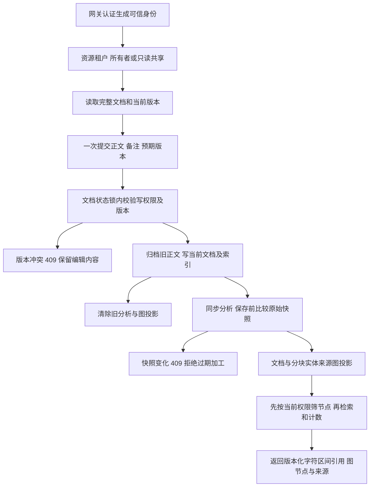
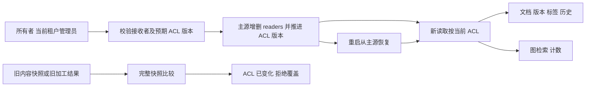
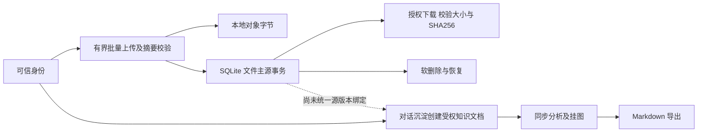
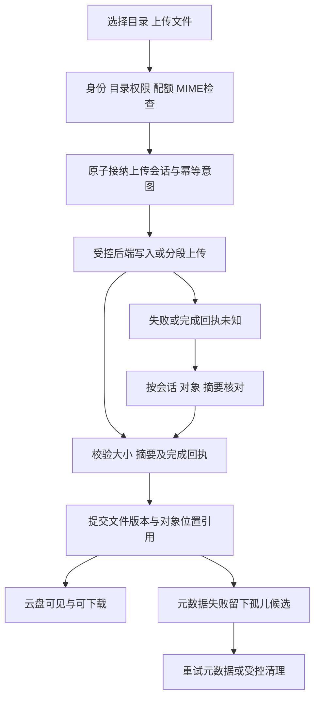
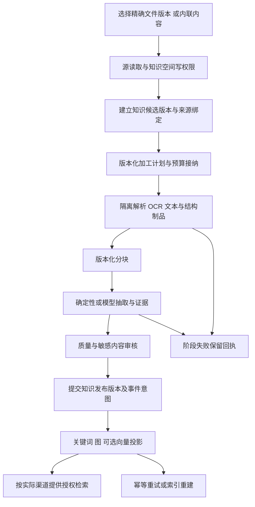

# 资源知识业务流程与失败恢复

> RK-BP-01 · V1.0 · 2026-10-01 · 本文件区分当前实现链路与目标流程；实施状态唯一来源为实施台账，不标全域或生产闭环完成。

## 当前实现链路与失败出口

### A. 知识编辑、加工、版本与检索

未认证/停用身份被网关拒绝，无权与不存在的文档统一 404。只读接收者只能查询，不进入加工或图写入。对象/索引失败返回真实失败，不能声称投影或业务全部成功。当前分析同步，图投影与对象写入没有跨存储事务；持久化加工、发布审核、精确引用、全文/向量/图投影回执仍按目标流程补齐。

### B. 共享、撤权与恢复

共享按文档租户约束；接收者不可写入、转授权或跨租户。撤权不依赖复制到图中的静态角色，后续请求从当前主源重新计算可见范围；已开始请求可能完成。版本回滚仅恢复内容，不能恢复旧授权。目录用户存在性、群组、过期授权、完整安全审计与跨进程 CAS 尚需开发。

### C. 文件与对话：当前边界

文件主源和知识主源不能通过此图推断已经关联。导出不能视为已建立云盘 FileVersion。独立 KB SQLite 与网关 KB 对象主源仍未迁移归一；会话源权限、幂等沉淀任务、导出补偿与源撤权传播仍是明确断点。

### 全链路导航

需求与边界 → [模块能力地图](docs/modules/resource-knowledge/README.md#map) → [模块架构](docs/architecture/RESOURCE-KNOWLEDGE-ARCHITECTURE.md#scope) → [数据所有权](docs/database/RESOURCE-KNOWLEDGE-DATA-CONTRACT.md#ownership) → [API 契约](docs/api/RESOURCE-KNOWLEDGE-CONTRACT.md#operations) → 本文业务处理与失败出口 → [实施状态及证据](docs/modules/resource-knowledge/IMPLEMENTATION-STATUS.md#status) → [全维交付检查](./DELIVERY-MATRIX.md)。状态、验收数字与运行证据仅维护在实施台账和 reports，不在设计图中复制另一份完成率。

## 1. 上传与云盘管理（RK-BP01）

上传成功以对象与元数据均有可核对回执为准。目录移动/重命名只改目录元数据；文件替换产生新版本。现有本地写入/对象读写可复用，持久化目录/会话/版本/权限闭环待开发。浏览器短期上传授权限定对象、大小、MIME与期限，完成由服务端验证。

## 2. 文件/内联内容进入知识空间（RK-BP02）

源版本、解析器、pipeline、ontology和模型固定到作业。换源或模型需要新revision/generation；过期作业不修改当前发布指针。隔离压缩包/宏/脚本/恶意解析及超额文件；解析制品可审计。现有KB分析和GraphLinker提供基础，不能据此宣称OCR、向量发布与授权全链路齐备。

知识发布与投影ready分别显示；允许某渠道未就绪时按明确政策降级，不因一个向量失败阻塞文件可下载，也不因文档保存成功宣称检索ready。

## 3. 挂图、知识问答与专家联盟（RK-BP03）

检索前限定tenant/space与发布策略→关键词/已启用向量/图召回→候选逐资源授权→重排/上下文构建→回答或联盟任务→引用精确document revision、chunk和页码/offset→用户查看来源。无权来源不进入模型、摘要或图统计。

图关系区分extracted/asserted/verified及置信度，人工确认留审核记录。图谱节点映射领域资源但不复制权限为永久事实。联盟只消费受权证据，不将历史引用变成永久访问权。交付制品由受控知识发布操作接纳，避免“RAG输出直接覆盖原知识”的自我强化。

## 4. 对话沉淀（RK-BP04）

复用现有dialogue_sediment的知识创建/分析/挂图/Markdown导出逻辑，目标入口先建立幂等沉淀job。源身份与授权→读取会话版本→知识候选→审核发布→生成Markdown制品→建立云盘FileVersion/来源关系→返回每阶段实际状态。

目标将原会话与Markdown导出视为不同制品，分别记录digest和精确版本；两者不是必须字节相同的重复对象。云盘导出失败只重试导出阶段，不重建一份新知识文档。会话编辑产生新知识revision；删除/撤权按来源依赖传播，保留政策明确前不自动永久保留对话原文。

## 5. 撤权、回收与彻底删除（RK-BP05）

权限变化立即由主源阻止新下载、检索、模型上下文及图扩展→记录投影清理意图→撤销分享/短期凭据按能力处理→更新图/全文/向量/cache。已发内容无法物理撤回，需在产品语义中区分未来访问阻断与已交付副本。

资源回收先标状态并保留版本；恢复重新校验空间与quota。彻底删除检查保留锁/在用版本/知识和共享引用→生成删除manifest→各owner删除/失效与回执→核对引用数后清理对象。失败有可重试job，禁止界面提前显示“全部数据已删除”。

## 6. 提供方启用与迁移（RK-BP06）

配置草稿→schema/endpoint/secret与权限校验→能力矩阵真实往返→发布配置→切指定scope新对象默认→逐对象复制与校验→原子位置引用切换→观察对账→按政策删除旧副本。批次中断从checkpoint继续，旧对象仍可按旧位置读。

探测通过只叫“可达”，不得叫“迁移成功”；迁移需记录对象数量/大小/digest、引用覆盖和失败列表。归档对象读取若需要restore则建立恢复job，不给普通用户假装同步下载。接口与提供方差异见[接口契约](docs/api/RESOURCE-KNOWLEDGE-CONTRACT.md#providers)。

## 7. 首个验收样例

两个受权租户各上传同名设计文档→移动目录→创建知识候选→加工/发布→搜索与图追踪→联盟引用→发布新版本同时让旧作业晚到→撤权→回收/恢复→按保留政策彻底删除。注入对象完成超时、元数据失败、模型不可用、索引失败、进程重启；每个阶段验证不串租户、不重复业务资源、不丢失败回执。

先用本地后端和关键词/图完成样例，再针对真实S3与OSS分别验；不将本地通过视为远程通过。各场景映射[RK-Q01–12](docs/architecture/RESOURCE-KNOWLEDGE-ARCHITECTURE.md#acceptance)，配置验收另引用LC-Q。交付证据放reports，不向本主题目录散落运行日志。
