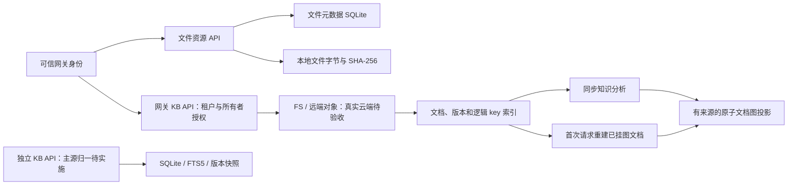
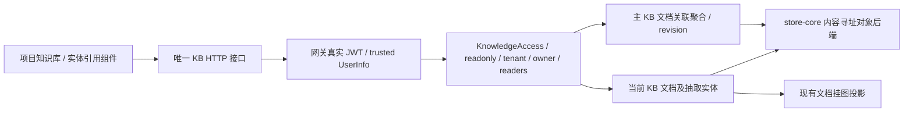
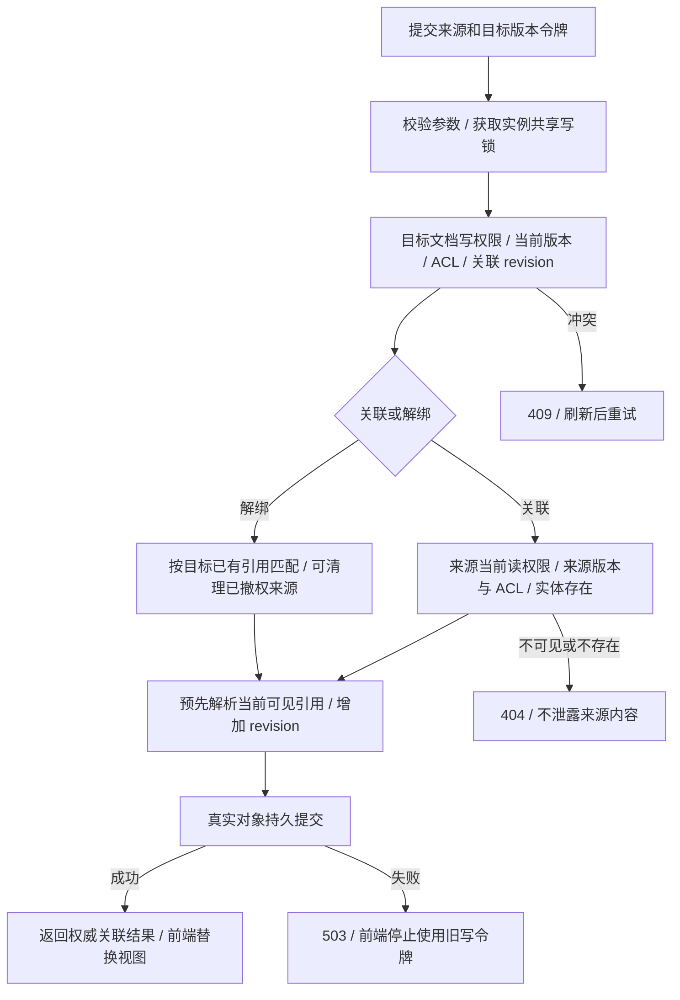

# 资源知识模块实施状态与验收台账

> RK-IMPL-01 · 2026-10-01 · 持续实施。目标是七个逻辑模块全部通过企业验收；当前完成首批持久化、授权、版本、投影与存储适配修复，**没有宣称全部模块或生产上线完成**。

设计入口：[能力地图](docs/modules/resource-knowledge/README.md#map)。目标边界遵循[统一架构](docs/architecture/RESOURCE-KNOWLEDGE-ARCHITECTURE.md#scope)、[数据契约](../../database/RESOURCE-KNOWLEDGE-DATA-CONTRACT.md)与[流程规范](../../architecture/BUSINESS-FLOWS.md)。本台账是实施状态权威源，设计中的状态机与 API 草案不代表当前已实现。

最新集成进展（2026-10-02）：上轮专家联盟租户迁移的编译阻塞已解除，网关 all-targets 检查与 Clippy 通过（仍有存量告警）。专家租户现从可信 UserInfo 提取，伪造头 403、缺失身份 401；真实双租户专家创建/列表/详情隔离通过。本轮真实链路及尚未完成的全域授权，统一见[平台与前端验收台账](../REAL-IMPLEMENTATION-STATUS.md)。原失败证据保留历史日期，不把局部修复计为全系统验收。

## 模块状态

| 模块 | 本次落地及验证 | 尚需完成的企业能力 | 状态 |
|---|---|---|---|
| system-policy | 文件所有端点提取可信身份；列表/详情/统计/下载/删除/恢复统一执行租户与所有者条件；租户管理员仅在自身租户扩权；禁用用户和只读写入拒绝；KB 用户只读共享与撤权、ACL 版本冲突保护 | 其他域授权、组织群组共享、目标用户目录校验、持久化审计、配置发布策略 | 部分实现；不能作为全域多租户验收 |
| object-storage | 对象契约增加逻辑 key 列表；FS 与 S3 实现；统一严格环境配置；S3 签名包含端口、正确路径/查询编码和请求头排序；OSS virtual-hosted；ListObjectsV2 分页/XML 解析及失败传播 | 真实云端签名往返、密钥轮换、STS、提供方能力探测、历史对象位置映射、存储迁移/切换事务、冷存储恢复、容量预算 | 本地/模拟 HTTP 验证；真实 OSS 尚未验收 |
| cloud-drive | SQLite 文件元数据取代内存样例；有界批量上传、批量元数据事务、SHA-256、真实下载、Unicode 附件头、软删除/恢复、重启恢复；未接入远端的提供方 available=false | 层级目录、重命名/移动、文件版本、共享、永久清理/保留、配额、上传会话/续传、崩溃孤儿对象对账、统一对象后端接入 | 文件基础闭环通过；完整云盘未完成 |
| knowledge-catalog | 网关知识文档编辑推进版本、保留上一快照并失效旧分析；独立服务真实列表/更新/历史/软删除、HTTP 错误、SQLite 不可覆盖快照与冲突回滚 | 两套 KB 迁移归一、租户/空间/源版本引用、发布审核、不可变完整版本契约、关联文件入口、元数据模式 | 两套既有实现分别增强；尚未合并主源 |
| knowledge-processing | 本地分析及批量分析错误传播；内容变更后清除旧实体/关系/摘要，必须重新加工；批处理逐项统计失败 | 持久化任务/租约/幂等键、OCR/解析提供方、取消/恢复/预算、旧作业隔离、模型真实能力与质量评测 | 同步基础加工；企业作业引擎未完成 |
| knowledge-graph | StableDiGraph 修复删除后索引错位；统一锁顺序；文档子图原子验证/替换；节点和边记录来源文档/版本；挂图失败不覆盖旧图；KB 节点按可见文档过滤，来源精确匹配；从持久化文档重建投影；反挂图状态落盘 | 发布版本过滤、其他图域租户授权、人工事实确认、跨文档实体归并、图版本/大规模增量、联邦图源统一 | 文档图投影闭环通过；全域图谱未完成 |
| retrieval | SQLite 标签过滤、安全分页及短中文词字面检索；知识变更使旧图投影失效；KB 关键词/图检索按当前授权筛选后排名和计数；撤权后的新请求不可见 | 其他检索域授权、发布版本过滤、真实 embedding/vector/reranker、来源定位、质量/性能评测、撤权缓存失效 | 关键词与基础图检索；企业混合检索未完成 |

## 已落地链路与待归一边界

文件主源接入知识源、独立 KB 迁移、全域授权和统一工作流仍需 R2–R5，不把分开的可用组件视为已经完成整个业务闭环。

## 当前接口与兼容性

- 网关文件接口仍为 `/api/enterprise/files`，元数据新增可空 `sha256`；`md5` 保留兼容字段，新上传不再生成伪 MD5。当前 `normal/deleted` 分别表达可用/回收站，不等于目标设计中的物理删除。生产启动不再注入样例。既有未登记的磁盘字节不自动认领为文件资源。
- 文件上传单请求总内容上限 16 MiB、最多 100 个文件，路由总包体额外预留 64 KiB；同步 SQLite 查询及整文件下载尚未通过并发/大文件性能验收。事务提交前失败会清理本请求已写对象；进程崩溃对账仍待实现。
- 独立 KB 服务为 `/api/v1/kb/documents`、`/:id`、`/:id/versions` 和 `/api/v1/kb/search`。创建要求 `title/content/author`；更新要求 `title/content/expected_version`。版本冲突为 409，不存在为 404，空标题为 400。创建成功为 201。该服务当前不能从请求中的 author 推断资源权限。
- 独立 KB 旧库以非破坏方式新增 `kb_version` 表，只恢复当前已知快照，不伪造未知历史；保存同版本不同完整 payload 返回版本冲突。回滚应建立新版本。网关 KB 与独立 KB 的编号/存储仍不同，不能通过共享数据库名假装已经归一化。
- 网关 KB 响应沿用既有统一协议 `{code,msg,data}`，集成测试已从过期 `success` 字段改为检查真实 `code` 与 HTTP 状态。文档正文/标题编辑自动建下一版本；旧实体和投影失效。版本切换、回滚和重新分析也撤销旧投影。
- `StoreConfig::from_env()` 为知识存储与 cloud-admin SDK 的共享装配入口。FS 不依赖远端配置；S3/MinIO/OSS 必须显式配置 endpoint、bucket 与凭据。配置缺失、未知后端、凭据别名冲突、非法布尔值直接失败，不回退到另一个数据目录。
- 凭据权威变量为 `MOX_S3_ACCESS_KEY_ID` / `MOX_S3_SECRET_ACCESS_KEY`，兼容旧 `MOX_S3_ACCESS_KEY` / `MOX_S3_SECRET_KEY`；两组同时设置必须相同。`MOX_S3_FORCE_PATH_STYLE` 默认 S3/MinIO=true、OSS=false；OSS=true 被拒绝。endpoint 应为区域服务地址，virtual-hosted 由客户端添加 bucket 子域。
- 网关旧 storage-admin 尚未接入统一读写路由。请求切到 S3 即便健康探测成功也返回 409，不能把探测结果报告为切换成功。此处尚未开发的切换流程继续遵循[对象位置与配置边界](../../architecture/RESOURCE-KNOWLEDGE-ARCHITECTURE.md)。
- 对象 `list_keys(prefix)` 的默认实现为明确的“不支持”错误；不能把未知后端返回空数组作为真实列表。FS/S3/InMemory 已提供实现；其他对象装饰器需在启用为知识后端前实现该契约。

## R2 增量：知识资源授权

网关 `/api/kb/*` 已从认证后的 `UserInfo` 生成 `KnowledgeAccess`，请求 body/header 中的 tenant/owner 不参与授权。新文档的 `access` 保存租户与所有者；管理员能力和只读能力仅来自当前可信身份，不写入资源。租户管理员和超级管理员都只在当前租户内扩大可见范围。普通用户可访问自己的文档，只读角色不能触发创建、修改、删除、分析、批处理或挂图。

文档读取、版本、实体、历史、列表、标签、分类、容量估算和文档检索共用文档服务的授权规则。KB 图谱检索与计数先按可见文档的 `source_doc_id` 筛选节点，再筛边和排名；挂图响应只返回该文档的节点与新增数量，不返回全局数量。共享投影始终从完整主源恢复，用户视图不会替换全局恢复状态。对话沉淀创建的新知识文档继承当前认证用户的租户和所有者。

兼容策略：历史 JSON 缺少 `access` 时可以由内部迁移工具读取，但用户路由默认不可见，包括租户管理员。不得自动认领历史数据。`KbState::scoped` 是授权视图；无 scope 的服务和 `build_kb_router_with_state` 是受信内部接口，不能直接暴露给外部网络，网关必须通过 `protected_kb_router` 装配。

本增量只覆盖网关 KB 域及其文档图投影。独立 KB 服务、其他 KG/AI 图谱路由、对话源会话权限、云盘对象权限尚未统一；用户只读分享/撤权见下节；可审计的历史归属迁移、双主源迁移仍未实现，因此 R2 仍未验收完成。当前索引和可见图投影仍全量扫描/重建，不声明大规模吞吐已达标。新增验证证据位于 `reports/data/20261001-knowledge-resource-access/summary.json`。

## R2 增量：只读共享与撤权

网关 KB 已提供用户只读共享、撤权和 ACL 版本冲突保护，接口契约见 [资源知识 API 契约](../../api/RESOURCE-KNOWLEDGE-CONTRACT.md)。当前主源增加 readers 和 acl_revision，旧 JSON 默认无共享、授权版本为 0。接收者身份必须与文档处于同一租户，不能通过共享获得写入或管理权限；超级管理员也不跨租户。普通内容修改、分析与回滚不能修改 ACL；旧副本保存会核对当前 ACL，防止撤权后授权被恢复。

共享读取共用所有文档出口及图谱过滤规则。修改授权在共享文档状态锁内检查 expected_acl_revision，变化才递增版本；重复操作在版本匹配时幂等。撤权提交后的新请求不可见，已经开始的读取可能完成。进程内并发授权只有一个相同预期版本的请求成功，其他返回 409；跨进程 CAS 尚未实现。

当前只包含用户只读授权；目标用户目录校验、群组/编辑/过期分享、完整安全审计、跨进程并发、双主源归一和其他域授权仍待实现，不作为全域企业验收完成。测试与命令证据见 `reports/data/20261001-knowledge-sharing/summary.json`。

## 条件编辑与过期加工保护

编辑页面先获取完整文档，携带 expected_current_version、正文和 version_note 一次更新。服务在文档状态锁内检查当前内容版本，冲突返回 409；一次操作归档旧正文并推进一次版本，避免前端先建版再更新造成双重推进。旧客户端未携带预期版本仍兼容，但不能据此声称用户编辑冲突保护已强制覆盖所有客户端。

分析、批处理、创建版本与回滚保存时比较原始完整文档快照；期间内容、分析或 ACL 已变化时拒绝保存。比较与写入在同一状态实例的文档锁内执行。该保护没有替代持久化作业 generation/租约，也未覆盖其他进程、所有旧内部 save 调用和图投影与对象写入的跨存储原子性。标签聚合以数量降序、名称升序稳定排序。

实际链路、失败出口与剩余断点见 [业务流程](docs/modules/resource-knowledge/BUSINESS-FLOWS.md#implemented)。全维验收仍按 R2–R7 的退出条件逐项产生证据，不能统一标记为已完成。

## 统计 IO 优化与文本引用

统计和标签复用单次当前文档扫描；查询不再重建/写入 KV 派生索引。新摘要保存标签和原始 JSON 字节数，统计直接聚合已授权摘要，不再逐文档 HEAD。该字段计量逻辑文档 JSON，不能解释为物理去重容量、云盘容量或租户配额。写路径继续刷新兼容 KV 索引；读路径从主源读取，缺损/损坏错误不当空库隐藏。

检索新增版本化文本 citation，Unicode 偏移映射回原文字符；同分按 ID 稳定排序，空白/过长查询或 limit 越界返回 400。正文未命中时引用版本化标题，未版本化摘要不作为稳定来源。全文、向量、文件页码、精确 chunk 引用与真实问答引用仍需 R5。

优化测量、权限回归和证据见 `reports/data/20261001-competitive-optimization/`；竞品文档事实与后续设计映射见[竞品参考](./COMPETITIVE-DESIGN.md)。原先全量扫描重复 IO 已减少，但跨进程写入 CAS、增量事务索引、图投影重建成本与大规模性能仍未验收。

## 后续实施顺序与退出条件

### 2026-10-04 R2 实体接口归一增量

实体搜索与文档实体关联/解绑已迁入 `platform/domains/kg/svc/mox-kb-svc/src/handlers.rs`、`entity.rs`。网关移除独立 kb_ext 状态与路由合并；全部 KB 入口经同一 `modules::protected_kb_router`，将真实 JWT UserInfo 转为 KnowledgeAccess。历史 kb_ext.rs 只保留迁移说明，不再创建、加载或写入无归属关系集合。真实网关联调另发现旧适配器二次路由重复携带 axum 路径参数，导致带文档 ID 的接口 500；现重建请求路由元数据，显式保留 trusted UserInfo 与 OriginalUri，method/URI/headers/version/body 不变。未来新增领域所需请求扩展必须显式登记携带，不能沿用上一轮路由内部参数。该增量不等于完整 R2–R7 完成。

**主源与边界。** 抽取实体来自 `kb/docs/{id}.json`；人工引用由同一 KbDocumentService 管理的 `kb/entity-links/{target_id}.json` 聚合保存，revision 与 items 一次对象提交。它是主 KB 的文档关联元数据，不是独立网关实体库；不复制实体正文/名称，不作为 GraphStore 已确认事实。源、目标文档与关联聚合并非跨对象事务：当前共享 mutation 锁只保证同一服务实例内 ACL、文档与关联写操作串行。跨进程 CAS、关联版本历史、删除级联及物理孤儿对账仍待开发。

**接口契约。** 对外仍为 `/api/kb/*`，前端 Axios baseURL 为 `/api`。统一成功信封由 ApiResponse 处理；客户端读实际 data，不拼装成功结果。

| 方法与路径 | 真实行为及限制 |
|---|---|
| GET `/api/kb/entities/search` | q 为实体名称子串（大小写归一），可选 type 精确过滤；q 最多 256 字节，type 最多 64 字节，limit 1–100 默认 20。先授权再筛选和限额，按文档 ID/实体 ID 稳定排序；没有语义向量搜索声明。返回数组，项含 id/name/type/frequency/snippet、source_doc_id/source_version/source_acl_revision |
| GET `/api/kb/documents/:id/entities` | 既有 entities/relations 保持；新增 linked_entities、current_version、acl_revision、links_revision。每次重新检查来源 ACL；来源被撤权/删除、版本变化或实体不再存在则隐藏该引用。linked_entities 不包含未授权来源副本 |
| POST `/api/kb/documents/:id/entities` | 请求必须包含 entity_id/source_doc_id/source_version/source_acl_revision/expected_current_version/expected_acl_revision/expected_links_revision；可选 relation（非空且最多 64 字节，默认 references）。拒绝未知字段，不接受只有 entity_id 的旧请求。目标必须可写，来源必须当前可读；最多 256 条引用 |
| DELETE `/api/kb/documents/:id/entities` | 同样必须提供上述令牌和引用身份；检查目标当前写权限及 revision，允许目标所有者删除曾合法引用但已撤权的来源，不要求重新获得来源读取权 |

记录只保存引用身份、relation 与 created_at。来源版本变化不会把旧指针自动重新解释为新版本实体。修订冲突为 409；不可见/不存在统一 404；非法参数 400、JSON 结构缺失或未知字段 422；真实关联写入存储异常 503。GET 聚合读取沿用主 KB 存储错误 500。当前版本令牌下同一引用/同一 relation 重复关联不增加 revision，旧 revision 仍为 409；这不等于持久幂等键/回执。

这两条关联写 API 显式关闭自动 project_id 注入（http 配置 projectContext=false），以文档 KnowledgeAccess 裁决权限；不得把当前选中项目当作知识库授权。

项目 KnowledgeBasePanel 图谱页签新增 KnowledgeEntityLinks 组件，通过实际 API 搜索、引用、移除和刷新；原整篇文档挂图动作保留。组件按文档 ID/版本/ACL 及身份变化失效旧请求和结果；写失败显示错误并要求刷新，禁止本地 push/猜测成功。只读和所有者最终由服务端裁决。可复用组件和孤儿 useKnowledgeBase composable 都已更新请求契约，不能把组件验收泛化成其他模块或整个登录流程已验收。

**旧数据迁移。** 保留 `kb_ext.entity_relations` 和 `data/kb_entity_relations.json`，不自动赋予租户或认领，未执行生产数据清查。人工迁移映射必须记录 old_record_id、target_document_id、tenant_id、owner_id、source_document_id、source_version、entity_id、relation、审核依据和结果；先备份，再通过目标主 KB 授权写接口逐条迁入，刷新 revision 并回读核验。缺少来源/归属证据的记录保留隔离，不能按字符串 entity_id 猜测。旧客户端升级为携带读接口发出的版本令牌；旧仅 entity_id 写法失败关闭。真实迁移与迁移工具仍是开放工作，不宣称已经完成。

关联搜索仍扫描授权主文档，O(n)；只限定返回项数与片段长度，不宣称大规模容量、最优算法或分布式事务已通过。旧引用清理界面、已撤权引用的无内容删除标识、版本历史、加工队列、真实 OSS 和授权图事实投影仍按后续工作包推进。当前 KbAnalyzer 的专家评分仍是固定默认健康分，不能解释为已咨询专家或真实模型质量；专家注入及去除该不实评分是独立开放缺口。

验收记录及逐项命令位于 `reports/data/20261004-kb-entity-normalization/`，说明见 `reports/markdown/20261004-kb-entity-normalization.md`；运行结果以实际日志和 summary 为准。

| 顺序 | 工作包 | 必须通过的退出条件 |
|---|---|---|
| R2 | 系统授权贯穿 KB/图谱/检索，统一知识主源迁移 | 两租户、两所有者、管理员、共享、撤权、旧数据未归属场景全部失败关闭；迁移映射/备份/重启验证，不出现另一套可写主源 |
| R3 | 文件目录/版本/共享/配额，知识源版本关联 | 移动只改元数据；文件与知识版本映射可追溯；旧引用可读，删除/分享/撤权一致；磁盘崩溃孤儿可对账 |
| R4 | 持久化加工队列与低代码配置发布 | 领取/租约/取消/重试/幂等/预算/补偿覆盖故障注入；任务冻结配置版本；配置校验、灰度与回滚真正改变运行结果 |
| R5 | 图谱事实治理与授权混合检索 | 来源证据、人工确认与删除级联正确；候选召回先授权；失效/未发布版本不进入结果；真实模型质量评测 |
| R6 | OSS 真实适配、对象位置及迁移 | 实际 PUT/HEAD/GET/RANGE/LIST/DELETE/重启验收；签名/STS/权限/ETag差异测试；切换前后旧对象不丢失；能力列表来自探测 |
| R7 | 生产交付 | 完整依赖矩阵、灾备恢复演练、SLO/容量/成本/审计/可观测性、灰度与回滚、统一端到端验收及安全审查 |

“企业级完成”的状态必须由上述退出条件和运行证据产生，不能通过新增目录、静态 capabilities 数组或模拟接口命名获得。图谱替换目前重建内存快照、知识索引仍全量扫描，属于可验证正确性基线；没有最优性能或大规模吞吐声明。

## 验收证据

本轮命令、退出码、耗时、通过/失败/忽略计数及完整日志见 `reports/data/20261001-resource-modules-validation/summary.json`；交付说明见 `reports/markdown/20261001-resource-modules-implementation.md`。测试使用临时目录与内联 HTTP 模拟服务，不触碰生产对象和凭据；未执行真实云端或生产部署验收。

官方协议依据：[OSS S3 兼容性](https://www.alibabacloud.com/help/en/oss/developer-reference/compatibility-with-amazon-s3)、[AWS ListObjectsV2](https://docs.aws.amazon.com/AmazonS3/latest/API/API_ListObjectsV2.html)。
