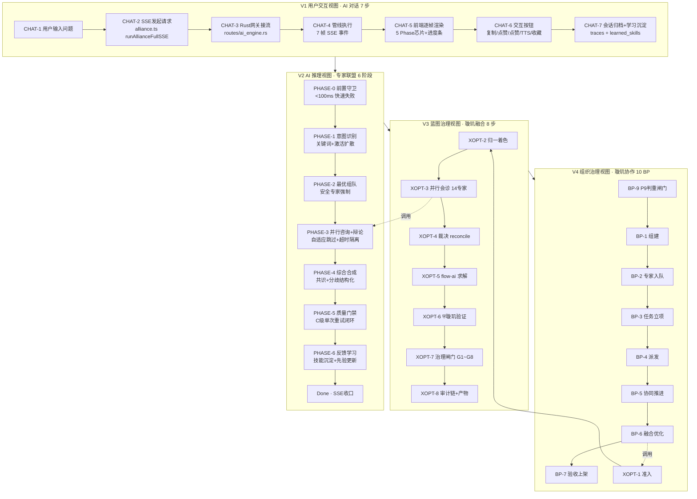
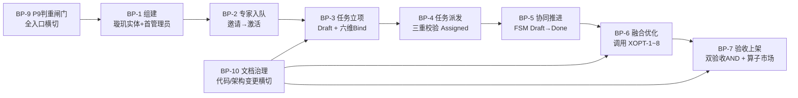
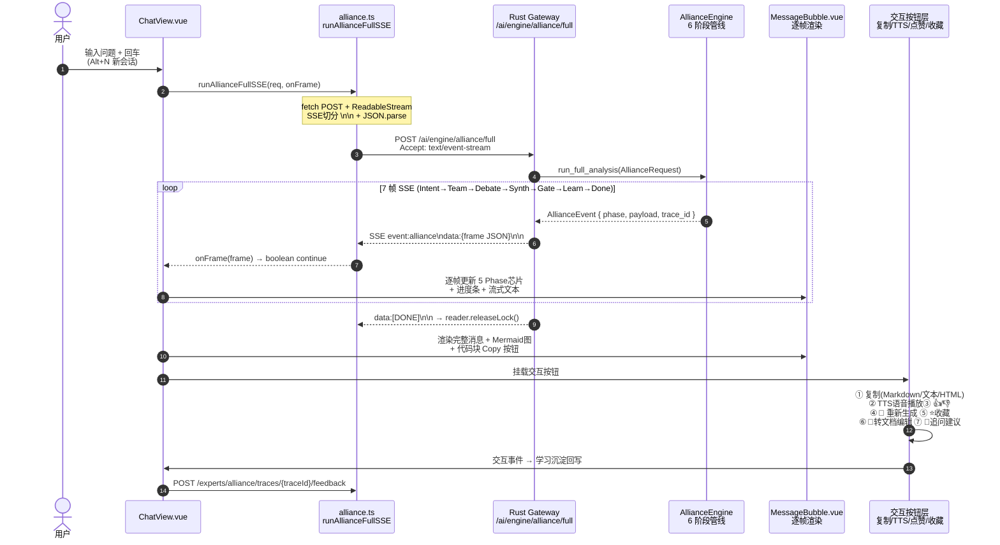

# 专家联盟 · 全维业务流程归一化手册 V1.0

> **文档身份**：专家联盟全域业务流程的「**归一化唯一真相源**」。
> 本手册将分散在 18+ 份文档中的专家联盟业务流程统一收敛为一套**可迭代、可追踪、可关联**的标准化流程集，
> 并定义流程之间的**输入输出映射关系**与**跨流程关联边**，实现「流程即图谱」。
>
> **权威链（L0 → L1 → L2 → 本文档）**：
> 🟢 L0 → [`18-全域顶层总设计-三联盟模式-V1.0.md`](../enterprise/18-全域顶层总设计-三联盟模式-V1.0.md)（TOP-MASTER）
> 🟢 L1 → [`22-全文档归一化总控卡-V1.0.md`](../enterprise/22-全文档归一化总控卡与权威链单源映射表-V1.0.md)（治理枢纽）
> 🟢 L2 → [`04-business-processing.md`](../enterprise/04-business-processing.md)（10 BP 标准） + [`EAF-STD-01 专家联盟流程标准`](../standards/expert-alliance-flow-standard.md)
>
> **版本**：v1.0 (ENT) · 最后更新 **2026-08-25**
> **主责联盟**：三联盟联合（产品·流程定义 | 算法·流程求解 | 开发·流程实现）

---

## 0. 文档导航与归一化说明

### 0.1 章节导航

| 章节 | 内容 | 核心产出 |
|------|------|----------|
| §1 | 业务全景总览（四层业务视图） | 全景图 + 流程族分类 |
| §2 | 专家联盟 6 阶段管线（EAF 标准） | 6×6 字段流程卡 + 降级链 |
| §3 | 璇玑融合 8 步优化管线 | 8×6 字段流程卡 + 闸门 |
| §4 | 璇玑系统 10 大标准 BP | BP-01~10 6 字段卡 + FSM |
| §5 | AI 对话端到端流程 | ChatView → 网关 → 引擎 → 前端渲染 |
| §6 | 业务流程关联关系总表（核心） | 12 条流程 × I/O 映射 × 关联边 |
| §7 | 流程图谱建模（关图节点/边） | 节点族 5 类 + 边族 8 类 + 注入规则 |
| §8 | 代码锚点与验证入口 | 真实实现路径 + 测试脚本 + 验证命令 |

### 0.2 归一化铁律（4 条，所有流程必须遵守）

1. **流程卡 6 字段必齐**（对齐 18 §四.4）：
   ①编号 ②主责联盟 ③前置条件 ④核心步骤 ⑤闸门规则 ⑥审计与产物
2. **跨流程输入输出必须显式关联**：流程 A 的输出字段 = 流程 B 的输入字段时，必须在 §6 总表登记关联边。
3. **流程与代码双向锚定**：每条流程必须至少映射 1 个真实代码入口（函数或 HTTP 端点），禁止空流程。
4. **变更必同步 §6 总表**：任何流程输入/输出/步骤变更 → 必须先更新 §6 关联关系总表 → 再更新流程详情。

### 0.3 四套流程族的定位差异（一张表读懂全景）

| 流程族 | 编号域 | 业务语义 | 触发入口 | 执行层 |
|--------|--------|----------|----------|--------|
| **EAF 专家联盟管线** | PHASE-0~6 | 「AI 多专家咨询」的编排：组队→辩论→合成→门禁→学习 | `POST /ai/engine/alliance/full`（SSE） | Rust `alliance/mod.rs` |
| **MOX 璇玑融合管线** | XOPT-1~8 | 「蓝图治理」的优化：归一化→会诊→裁决→求解→验证→治理 | `POST /api/mox/optimize` + `MoxFusionView.vue` | Rust `pipeline.rs` |
| **BP 璇玑协作流程** | BP-01~10 | 「组织协作」的闭环：组建→入队→立项→派发→推进→验收→上架 | `MoxSystem orchestrator.rs` + 前端 5 视图 | Rust `mox-system` |
| **CHAT AI 对话流程** | CHAT-1~7 | 「前端对话」的端到端：用户输入→SSE 流→7 阶段事件→芯片渲染→交互按钮 | `ChatView.vue` → `alliance.ts` | Node 边缘网关 + Rust 网关 |

---

## 1. 业务全景总览（四层业务视图 · 向下唯一依赖）

**层间调用关系**（V1 调 V2，V2 内嵌进 V3，V3 被 V4 BP-6 调用）：
- **V1 → V2**：ChatView 用户触发 → `POST /ai/engine/alliance/full` → AllianceEngine 6 阶段
- **V2 ⊂ V3**：V3 XOPT-3 并行会诊 → 每个专家的推理子流程调用 V2 PHASE-3 辩论框架
- **V3 ⊂ V4**：V4 BP-6 璇玑融合优化 → 内部执行 V3 XOPT-1~8 完整管线

---

## 2. 专家联盟 6 阶段管线（EAF-STD 标准 · PHASE-0~6）

> **参考实现**：`platform/services/mox-expert/src/alliance/{mod.rs,gate.rs,intent.rs,team.rs,debate.rs}`
> **HTTP 入口**：`POST /ai/engine/alliance/full`（SSE，`alliance.ts runAllianceFullSSE`）
> **机器验证**：`test/test-expert-alliance-enterprise.js`（34 项企业级验证）

### 通用约束（适用于所有 7 阶段）

| 约束项 | 值 |
|--------|----|
| **SSE 帧结构** | `{ phase, phase_index, payload, trace_id, latency_ms, ts, degraded?, degrade_reason? }` |
| **阶段顺序** | 严格 Intent(0) → Team(1) → Debate(2) → Synthesize(3) → Gate(4) → Learn(5) → Done(6) |
| **Trace ID** | UUID v4，贯穿 6 阶段 + 审计汇，全程一致不换号 |
| **降级标记** | 任何阶段降级时 `degraded=true`，`degrade_reason` 必填（非空当且仅当 degraded=true） |
| **门禁公式** | `Score = 0.55×Quality + 0.20×Speed + 0.10×TokenEff + 0.15×Stability` |

---

### PHASE-0 · 前置守卫（空问题快速失败）
| 6 字段 | 内容 |
|--------|------|
| **RA 主责** | 开发联盟（前置守卫层） + 算法联盟 C |
| **前置条件** | HTTP 请求到达 `alliance/full`；`AllianceRequest.query` 非空校验 |
| **核心步骤** | 0.1 query.trim().len() == 0 → **<100ms 内拒绝**；0.2 返回机器可读错误码 `EA_P0_EMPTY_QUERY` + trace 结构；0.3 鉴权 Token 校验（无效直接 401，不进入管线） |
| **闸门规则** | query 为空 → 硬拒绝，禁止进入 PHASE-1；Token 过期 → 401；安全关键词（注入/XSS/越权）命中 → 立即跳转 PHASE-5 Gate 并打 Blocked |
| **审计与产物** | 空请求拒绝单独计数（metrics `empty_query_rejected_total`）；安全命中独立审计汇 `security_blocked_sink` |
| **I/O 映射** | IN: `{ query, authorization }` → OUT: `{ error_code }` 或放行 → PHASE-1 |

---

### PHASE-1 · 意图识别（关键词 + 激活扩散）
| 6 字段 | 内容 |
|--------|------|
| **RA 主责** | 算法联盟（激活扩散 A5 实现） + 开发联盟（关键词匹配） |
| **前置条件** | PHASE-0 通过；query 非空；用户意图文本 UTF-8 有效 |
| **核心步骤** | 1.1 关键词模式匹配（ms 级）→ 产出 `{ primary, confidence, candidates }`；1.2 置信度 < 0.7 → **激活扩散**（个性化 PageRank，method=spread，d=0.85，30 轮收敛，HC-5）；1.3 安全类关键词（注入/越权/脱敏）识别置信度 ≥ 通用类；1.4 融合：`final_score = (1-spread_weight)*rrf + spread_weight*spread`（RRF k=60，spread_weight=0.7，HC-7） |
| **闸门规则** | 意图分类 7 类之一必须命中（数学/逻辑/知识/代码/中文/时效/指令，HC-9），否则 Fallback 为 `general`；安全类命中 → **强制安全标签**，后续组队强制安全专家入队 |
| **审计与产物** | `AllianceEvent { phase=Intent, payload:IntentResult }`；意图分布写入 `metrics intent_distribution` |
| **I/O 映射** | IN: `{ query, options.enable_spread }` → OUT: `{ primary, confidence, candidates, intent_class_7, security_flagged }` |

---

### PHASE-2 · 最优组队（能力匹配 + 安全强制）
| 6 字段 | 内容 |
|--------|------|
| **RA 主责** | 算法联盟（匹配打分算法） + 产品联盟（安全强制规则定义） |
| **前置条件** | PHASE-1 完成；`IntentResult.primary` 已知；专家注册表非空 |
| **核心步骤** | 2.1 专家匹配打分：能力×类型×指标三维加权；2.2 **安全强制规则（EAF §4.2）**：安全类意图 → 若常规评分未选安全专家 → **强制替换末位成员**保规模；注册表无安全专家 → `security_note` 显式记录（不静默）；2.3 协同增益：能力图协同度 × 历史协作频率；2.4 组队规模 `team_size=3~7`（默认 4，超过上限自动裁剪）；2.5 组队失败 → 明确错误返回，不降级到空队 |
| **闸门规则** | 团队规模 = 0 → Blocked；同一专家重复出现 → 去重；安全类意图 + 注册表无安全专家 → Warn 但不 Block（EAF-STD 兼容），`security_note` 审计留痕 |
| **审计与产物** | `AllianceEvent { phase=Team, payload:TeamResult { team, team_size, total_synergy, security_note } }` |
| **I/O 映射** | IN: `{ IntentResult, team_size, expert_registry }` → OUT: `{ team[{id,type,capabilities,metrics}], total_synergy, security_note }` |

---

### PHASE-3 · 并行咨询 + 自适应辩论
| 6 字段 | 内容 |
|--------|------|
| **RA 主责** | 算法联盟（辩论收敛算法） + 开发联盟（并行调度 + 超时隔离） |
| **前置条件** | PHASE-2 完成；`TeamResult.team.len() ≥ 1` |
| **核心步骤** | 3.1 并行咨询：单专家 **60s 超时隔离**（超过即隔离不阻断）；3.2 **自适应辩论跳过**：初始共识 ≥0.6 时跳过辩论（降延迟）；3.3 逐轮收敛检测：达阈值提前终止；3.4 **辩论令牌上限**：单轮 ≤900 tok（控资源），累计 >9k → 强制停止但**保留分歧不丢弃**；3.5 分歧保留：未达共识时保留分歧进入综合，不强求表决；3.6 **降级链 #1 显式实现**：初始轮全失败 → 单专家直答重试 → 仍失败 → 保留结果；辩论轮全失败 → 回退初始轮直答 |
| **闸门规则** | 有效意见数 `validCount < 1` → 硬降级（degraded=true），但不 Block 流程；降级路径执行后**必须回归主流**的 PHASE-4（输出契约一致） |
| **审计与产物** | `AllianceEvent { phase=Debate, payload:DebateResult { rounds, consensus, opinions, degraded?, degrade_reason? } }`；降级在 `deliberation.degraded` 显式标记（from/to/reason） |
| **I/O 映射** | IN: `{ TeamResult, query, context }` → OUT: `{ rounds[], consensus:{agreements,divergences,validCount}, opinions[] }` |

---

### PHASE-4 · 综合合成（共识 + 分歧 + 建议）
| 6 字段 | 内容 |
|--------|------|
| **RA 主责** | 算法联盟（合成策略） + 开发联盟（渲染适配） |
| **前置条件** | PHASE-3 完成；`consensus.validCount ≥ 1`（或 degraded=true 时 ≥0） |
| **核心步骤** | 4.1 **共识提取**：`consensus.agreements` → 提取「所有专家一致同意」的结论；4.2 **分歧结构化**：`consensus.divergences` → 按主题分组，列出「X 专家 vs Y 专家」的对立观点；4.3 **最终建议生成**：LLM 网关可用 → 真实 LLM 综合；不可用 → **启发式综合**（关键词重叠 + 共识加权）；4.4 `ai_powered` 字段显式标记（true=真实 LLM，false=启发式，防欺骗） |
| **闸门规则** | 合成结果为空 → 回退到「原始意见拼接」，不 Block；LSM 调用失败 → 立即降级到启发式，degraded=true |
| **审计与产物** | `AllianceEvent { phase=Synthesize, payload:SynthesizeResult { summary, recommendation, confidence, ai_powered } }` |
| **I/O 映射** | IN: `{ DebateResult, IntentResult, LLM_Gateway_available }` → OUT: `{ summary, recommendation, confidence, ai_powered, sources[] }` |

---

### PHASE-5 · 质量门禁（A/B/C/D 分级 + C 级单次重试）
| 6 字段 | 内容 |
|--------|------|
| **RA 主责** | 三联盟会签（产品·口径合规 | 算法·阈值正确 | 开发·性能达标） |
| **前置条件** | PHASE-4 完成；`SynthesizeResult` 非空 |
| **核心步骤** | 5.1 校验三维：**置信度下限 ≥0.5** + **有效意见数 ≥1** + **意图一致性**（合成结果 vs PHASE-1 意图）；5.2 分级：A(全过) / B(1 项 Warn) / C(2 项 Warn 或 1 项临界) / D(1 项 Fail)；5.3 **C 级重试闭环（EAF-STD §4.6）**：`retry_on_c=true` 时 → **单次**重路由组队（排除首队）重跑 PHASE-3~5，取门禁更优者；重试不更优保留首次；5.4 重试全程记录 trace.retry = `{ attempted, gate_first, gate_retry, adopted }` |
| **闸门规则** | D 级 → Blocked；C 级不重试 → 通过但 Warn；**任何安全类 Fail → 强制 D 级 Blocked**（不可被重试覆盖） |
| **审计与产物** | `AllianceEvent { phase=Gate, payload:GateResult { level in {A,B,C,D}, passed, reasons[], retry_info? } }`；Blocked 结果独立审计汇 `gate_blocked_sink` |
| **I/O 映射** | IN: `{ SynthesizeResult, IntentResult, retry_on_c, first_attempt_team_ids }` → OUT: `{ level, passed, reasons, gate_report, retry_info }` |

---

### PHASE-6 · 反馈学习（意图先验 + 技能沉淀）
| 6 字段 | 内容 |
|--------|------|
| **RA 主责** | 算法联盟（技能合成策略） + 开发联盟（持久化原子写） |
| **前置条件** | `GateResult.passed == true`（仅质量门禁通过的处理才沉淀技能，防污染） |
| **核心步骤** | 6.1 **意图先验更新**：正确路由强化（`intent_priors[primary] += smoothing_weight`）；6.2 **技能键计算**：`skill_key = intent_class + team_signature(type集合)`；6.3 **技能沉淀规则**：同键重复出现 → 强化 `count+1` + 置信度平滑，而非新增记录；6.4 **持久化原子写**：先 `tmp` 文件 → `rename` 覆盖（崩溃不产生半写文件）；6.5 容量上限 200 条，按 LRU + count 弱淘汰；6.6 独立存储 `alliance_learned_skills.json`（与智能集成引擎的 `learned_skills.json` 分离，互不覆写） |
| **闸门规则** | Gate 未通过 → 跳过本阶段（技能不污染）；原子写失败 → 回退内存缓存（下次启动重放），不阻断主流程 |
| **审计与产物** | `AllianceEvent { phase=Learn, payload:LearnResult { prior_updated, skill_synthesized, skill_count_now, evicted } }` |
| **I/O 映射** | IN: `{ GateResult, IntentResult, TeamResult, SynthesizeResult }` → OUT: `{ skill_key, skill_count_now, evicted_count, trace_id }` → `AllianceEvent(Done)` 收尾 |

---

## 3. 璇玑融合 8 步优化管线（XOPT-1~8）

> **参考实现**：`platform/services/mox-expert/src/pipeline.rs::mox_optimize`
> **HTTP 入口**：`POST /api/mox/optimize`（`runtime/main.rs:503`）
> **前端入口**：`frontend-ui/src/views/MoxFusionView.vue`（三栏：蓝图 / 治理 / 上架）

| 步骤 | 名称 | 主责联盟 | 核心动作 | 输出产物 | 被调用关系 |
|------|------|----------|----------|----------|------------|
| **XOPT-1** | 准入检查 | 开发联盟（Sec） | AIS 路径校验 + REQ 根可达性 + Schema 版本 | `AdmissionReport { passed, rejected_reasons }` | 由 BP-6 调用 |
| **XOPT-2** | 归一化维度着色 | 算法联盟（IR） | `auto_dimension(raw)`：按 `dim:xxx` 前缀 + ToolKind 七维着色，四维合一单图 | `DimensionedFlowGraph { base, pools, colored_nodes }` | XOPT-1 通过 |
| **XOPT-3** | 14 专家并行会诊 | 三联盟联合 | `run_experts(harness, ectx, all_experts())`：业务 7 维 + 开发 7 维插件化并行，瀑布扩展点 PreExpert/PostExpert | `Vec<ExpertOpinion> { constraints, risks, score, suggestions }` | XOPT-2 产物 |
| **XOPT-4** | 归一化裁决 reconcile | 算法联盟 | 按 `dimension.priority()` 升序（高优先级后写覆盖），8 种 Constraint → 图元素翻译；**裁决器不解，唯一求解器 flow-ai** | `ReconciledPlan { graph, conflicts, model_routes, adopted_suggestions }` | XOPT-3 产物；**权限/安全=7 级优先，不可被其他维度覆盖** |
| **XOPT-5** | flow-ai 最优求解 | 算法联盟 | `apply_rules + optimize(graph, config)`：CPM 关键路径 + RCPSP 资源约束 + 伪依赖剪除 + 冲突检测 | `OptimizationReport { critical_path, parallel_groups, schedule, model_routing[], accelerate_ratio ≥ 2.32× }` | XOPT-4 Plan；加速比硬阈值 BR-15 |
| **XOPT-6** | ⛨璇玑验证（最高权限） | 算法联盟（不可逆否决） | `verify(base, opt)`：拓扑/依赖/冲突/收益/代码 RT 五项不变式；**专家 veto=true → algo.vetoed=true；裁决冲突升级 → escalated=true → vetoed=true** | `AlgoVerification { vetoed, summary, verify_5_items_report }` | XOPT-5 Report + XOPT-3 Risks + XOPT-4 Conflicts |
| **XOPT-7** | 治理闸门 G1~G8 | 三联盟联合会签 | `govern + evaluate_gates`：G1 合规模板 / G2 璇玑 / G3 RBAC审计 / G4 SLA / G5 预算 / G6 敏感度 / G7 合规 / G8 灾备；**尊重 algo.vetoed（验证否决 → 必须 Blocked）** | `GateResult { approved, gate_report, sla_ok, budget_ok }` | XOPT-6 Algo + XOPT-5 指标；**algo.vetoed=true → 治理不可覆盖 → FlowStatus::Blocked（HC 单向否决）** |
| **XOPT-8** | 审计链 + 产物输出 | 开发联盟（Audit） | `AuditChain.append(hash_chain)`：HMAC 签名 + prev_hash/hash 链；瀑布钩子 PostGate 审计切面；产物 `GovernanceReport` | `GovernanceReport { expert_scores, optimization, algo, gate, audit, adopted_suggestions }` | XOPT-7 Gate；产物可流转至 BP-7 上架流程 |

---

## 4. 璇玑系统 10 大标准业务流程（BP-01~10）

> **完整 6 字段卡**：见 [`docs/enterprise/04-business-processing.md`](../enterprise/04-business-processing.md) §3
> **参考实现**：`platform/services/mox-system/src/{orchestrator,services,model,rbac}.rs`
> **配套流程图**：见 [`mox-expert-alliance-fusion-flows.md`](./mox-expert-alliance-fusion-flows.md)

### 4.1 BP-1~7 主链路（端到端组织协作闭环）

| BP | 名称 | 6 字段核心摘要 | 生命周期 FSM |
|----|------|---------------|-------------|
| **BP-1** | 璇玑组建 | 多租户隔离单位创建 + Global MoxAdmin 唯一无鉴权入口 bootstrap 一次调用 | 璇玑 Bootstrapped 状态 |
| **BP-2** | 专家入队 | 邀请→授 Expert@Mox（最小权限禁止 Global，BR-03）→ 激活；BR-04 同 email 幂等 | `Invited → Active`（成员 FSM） |
| **BP-3** | 任务立项 | BR-06 立项不得自带分派（assignees=[]）+ 自动六维 Bind 写入关图 REQ→FUN→BIZ→ALG→TSK | `[*] → Draft`（任务 FSM 起始） |
| **BP-4** | 任务派发 | **BR-07 分派身份三重校验 P0**：成员存在 / 同璇玑 / status=Active；跨租户注入零容忍 | `Draft → Assigned` |
| **BP-5** | 协同推进 | 分级鉴权 TransitionAll / Own；BR-10 DoD 门禁（子任务全完成 ∧ 依赖全 Done）；BR-11 依赖 DAG 无环；BR-12 终态不可迁出 | `Assigned → InProgress → InReview → Done/Cancelled` |
| **BP-6** | 融合优化 | **调用 XOPT-1~8** 完整管线；BR-13 治理一票否决；BR-14 五不变式；BR-15 加速比 ≥2.32× | InReview → 调用 XOPT → GovernanceReport |
| **BP-7** | 验收上架 | **BR-16 双验收 AND**：组织 Done=真 ∧ 融合 G2/G3 全过；上架算子市场，版本哈希链 + Provenance 可追溯 | Done → Published（算子市场 FSM） |

### 4.2 BP-8~10 横切流程（贯穿全链路）

| BP | 名称 | 横切范围 | 核心机制 | 审计产物 |
|----|------|----------|----------|----------|
| **BP-8** | 审计留痕 | BP-1~BP-7 全程所有写操作 | 统一 `require()` 鉴权双写汇 + 9 类 EventBus 领域事件 + 反应器幂等 + AuditChain 哈希链 prev_hash→hash 断裂 → fail-fast | `GET /api/audit` 过滤查询 + 拒绝/通过探针平衡统计 |
| **BP-9** | P9 先判重后立项 | **在 BP-1~BP-3 之前执行（铁律）** | `info-graph dedup --strict`：CNM 社区 + 子图同构候选 → Match Score；≥0.85 → Blocked（必须复用） | P9 判重报告入库 + 棘轮归零残差 |
| **BP-10** | 文档同步归一 / ADR 治理 | 所有代码 PR / ADR 申请 / 18 TOP-MASTER 改动 | 06 映射表缺行 → 阻断；04 BP 6 字段不齐 → 阻断；18 正文改动 → ADR-DOC-NEW + 三联盟签署 | ADR 变更日志 + docs 覆盖率报告 + ENT 版本 Bump |

---

## 5. AI 对话端到端流程（CHAT-1~7 · ChatView 全链路）

> **前端代码**：`frontend-ui/src/views/ChatView.vue` + `components/MessageBubble.vue`
> **API 层**：`frontend-ui/src/api/alliance.ts`（runAllianceFullSSE）
> **协议标准**：SSE W3C + MCP 官方规范（对齐 `EAF-STD §9`）

### CHAT-1~7 详细流程卡

| 步骤 | 名称 | 输入 | 输出 | 关键约束 | 代码锚点 |
|------|------|------|------|----------|----------|
| **CHAT-1** | 用户输入 + 会话管理 | 用户文本 + session_id | 请求体 + idempotency_key = sha256(query+session+ctx) | Alt+N 新会话快捷键；偏好记忆（上次 team_size/retry_on_c） | ChatView.vue `handleSend()` |
| **CHAT-2** | SSE 请求发起 | CHAT-1 请求体 | 7 帧回调流 | fetch + ReadableStream.getReader()；SSE 切分 `\n\n`；event/data 多行解析；首 token < 总时长、分片>10 | alliance.ts `runAllianceFullSSE` |
| **CHAT-3** | 网关接流 + RBAC 鉴权 | SSE HTTP 请求 | 授权通过 → Engine 调用；失败 → 401/403 立即断流 | `rbac_middleware.rs` 6 角色校验；HTTP `X-Accel-Buffering: no` 关缓冲 | runtime `routes/ai_engine.rs` |
| **CHAT-4** | 7 阶段管线执行 | AllianceRequest | Vec\<AllianceEvent\> (7 条) + 审计事件 | 阶段顺序严格不变；degraded 字段显式；trace_id 全程一致；C 级单次重试 | alliance `gate::run_full_pipeline` |
| **CHAT-5** | 前端逐帧渲染 | 单帧 AllianceSSEFrame | 5 Phase 芯片（意图/组队/辩论/合成/门禁）+ 流式文本 + 进度条 | 相位着色 → 芯片颜色映射；Mermaid SVG 渲染（viewBox → style 宽高）；代码块 Copy 按钮 | MessageBubble.vue `SSEFrameRenderer` |
| **CHAT-6** | 交互按钮挂载 | 完整消息 + 元数据 | 7 种交互：复制/TTS/👍/👎/🔄/⭐/📄/追问 | 复制三格式：Markdown/纯文本/富HTML；TTS 三层回退（CosyVoice2 → FishS2 → Browser）；Esc 关闭弹窗 | MessageBubble.vue `ActionToolbar` |
| **CHAT-7** | 会话归档 + 学习沉淀 | 交互反馈 + 完整 7 帧 | traces 入库 + learned_skills 原子更新 | `GET /experts/alliance/traces` 回溯；容量 200 条弱淘汰；JSON tmp+rename 原子写 | alliance `gate::phase_learn` |

---

## 6. 业务流程关联关系总表（核心归一化产物 · 12 流程 × I/O 映射 × 关联边）

> **使用方法**：找「流程 A 的输出 → 流程 B 的输入」即可定位跨流程关联边。
> **关联边符号**：`──1:1──` = 严格一一对应；`──1:N──` = 一输出多输入；`──N:1──` = 多输出一输入（融合）

### 6.1 流程输出 → 流程输入 映射矩阵（纵=输出流程 / 横=输入流程）

| 输出流程 ↓ / 输入流程 → | PHASE-1 意图 | PHASE-2 组队 | PHASE-3 辩论 | PHASE-4 合成 | PHASE-5 门禁 | PHASE-6 学习 | XOPT-3 会诊 | XOPT-5 求解 | XOPT-6 验证 | XOPT-7 治理 | BP-6 优化 | CHAT-5 渲染 |
|------------------------|:--:|:--:|:--:|:--:|:--:|:--:|:--:|:--:|:--:|:--:|:--:|:--:|
| **PHASE-0 守卫** | 1:1 query放行 | — | — | — | — | — | — | — | — | — | — | — |
| **PHASE-1 意图** | — | 1:1 IntentResult | — | 1:1 意图校验 | — | 1:N 先验+技能键 | — | — | — | — | — | 1:1 意图芯片 |
| **PHASE-2 组队** | — | — | 1:1 TeamResult | — | — | 1:N team签名 | 1:N 专家ID注入 | — | — | — | — | 1:1 组队芯片 |
| **PHASE-3 辩论** | — | — | — | 1:1 DebateResult | 1:1 validCount | — | 1:N opinions复用 | — | — | — | — | 1:1 辩论芯片 |
| **PHASE-4 合成** | — | — | — | — | 1:1 合成结果 | — | — | — | — | — | — | 1:1 内容渲染 |
| **PHASE-5 门禁** | — | — | — | — | — | 1:1 passed开关 | — | — | 1:N veto传递 | 1:1 gate级 | — | 1:1 门禁芯片 |
| **PHASE-6 学习** | — | — | — | — | — | — | — | — | — | — | — | 1:1 完成芯片 |
| **XOPT-2 归一着色** | — | — | — | — | — | — | 1:1 单图FlowGraph | — | — | — | — | — |
| **XOPT-3 会诊** | — | — | — | — | — | — | — | — | 1:1 veto传递 | — | — | — |
| **XOPT-4 裁决** | — | — | — | — | — | — | — | 1:1 ReconciledPlan | — | — | — | — |
| **XOPT-5 求解** | — | — | — | — | — | — | — | — | 1:1 OptimizationReport | 1:1 指标 | — | — |
| **XOPT-6 验证** | — | — | — | — | — | — | — | — | — | 1:1 algo.vetoed **单向** | 1:1 验证报告 | — |
| **XOPT-7 治理** | — | — | — | — | — | — | — | — | — | — | 1:1 GovernanceReport | — |
| **BP-6 融合** | — | — | — | — | — | — | N:1 多任务合批 | — | — | — | — | — |
| **CHAT-2 SSE请求** | N:1 Rust调用 | — | — | — | — | — | — | — | — | — | — | — |

### 6.2 跨流程强关联边（EB-ALL-01~12，写死不可替换）

| 边 ID | 源流程 | 目标流程 | 关联语义 | 不变式（违反=名实分裂） |
|-------|--------|----------|----------|------------------------|
| **EB-ALL-01** | PHASE-1 意图 | PHASE-2 组队 | 组队必须使用 PHASE-1 的安全标签 | 安全类意图 + team 不含安全专家 → security_note 必须非空 |
| **EB-ALL-02** | PHASE-2 组队 | PHASE-3 辩论 | 辩论并行度 = team.len()，单专家 60s 超时隔离 | 辩论轮专家集合 = 组队集合（除超时隔离被排除的） |
| **EB-ALL-03** | PHASE-3 辩论 | PHASE-4 合成 | 合成必须包含所有 validCount 的意见，不得强裁分歧 | `SynthesizeResult.divergences.len() ≥ DebateResult.consensus.divergences.len()` |
| **EB-ALL-04** | PHASE-4 合成 | PHASE-5 门禁 | 门禁必须校验合成 vs 意图一致性 | 合成主主题 ≠ 意图主类 → reasons 含 intent_mismatch |
| **EB-ALL-05** | PHASE-5 门禁 | PHASE-6 学习 | 学习只沉淀 passed=true 的处理 | GateResult.passed=false → Phase-6 必须跳过（技能不污染） |
| **EB-ALL-06** | XOPT-3 会诊 | XOPT-6 验证 | 专家 veto=true → algo.vetoed=true（单向） | ExpertOpinion.risk[].veto 任一为真 → verify() 返回 vetoed=true |
| **EB-ALL-07** | XOPT-4 裁决 | XOPT-6 验证 | 裁决冲突 escalated → algo.vetoed=true（不可逆） | ReconciledPlan.conflicts[].escalated=true → verify() vetoed=true |
| **EB-ALL-08** | XOPT-6 验证 | XOPT-7 治理 | 验证否决 → 治理必须 Blocked（治理不可覆盖验证） | algo.vetoed=true → govern() 返回 FlowStatus::Blocked |
| **EB-ALL-09** | XOPT-1~8 全步 | BP-6 融合优化 | BP-6 内部必须串行执行 XOPT-1 到 XOPT-8 | BP-6 GovernanceReport = XOPT-8 输出的深拷贝 |
| **EB-ALL-10** | BP-5 协同推进 | BP-6 融合 | 任务必须 InReview/Done 才能触发融合 | Task.status ∉ {InReview, Done} → /api/mox/optimize 412 Precondition Failed |
| **EB-ALL-11** | CHAT-2 SSE 请求 | PHASE-0~6 全管线 | SSE 7 帧顺序 = PHASE-0...6 Done | SSE 帧 phase_index 严格单调递增 0→6，缺帧=前端显示降级标记 |
| **EB-ALL-12** | BP-9 P9判重 | BP-1~BP-3 | BP-9 必须在 BP-1~BP-3 之前执行（全入口横切） | BP-1/2/3 请求头不含 X-P9-Dedup-Token → 428 拒绝执行 |

---

## 7. 流程图谱建模（关图节点 / 边 · 注入规范）

### 7.1 节点族（5 类，注入八层图谱 L0~L3）

| 节点族 ID | 节点名（entity_type） | 归属八层 L | 必带属性 | 注入规则（从流程卡自动派生） |
|-----------|----------------------|:----------:|----------|------------------------------|
| **F-01** | `alliance_phase` | L3 算法层 | `phase_index (0..=6), name, duration_ms, status` | PHASE-0~6 每阶段执行一次 → 1 节点 |
| **F-02** | `mox_opt_step` | L3 算法层 | `step_id (1..=8), name, expert_scores` | XOPT-1~8 每步 → 1 节点；专家打分写入 attrs |
| **F-03** | `business_process` | L0 需求根层 + L3 | `bp_id (1..=10), name, fsm_transitions_count` | BP-01~10 = 1 Workflow + Step 节点集（对齐 18 §三 BP 定义） |
| **F-04** | `chat_flow` | L3 算法层 | `chat_id, sse_frames_count, interact_buttons_used` | 每次前端对话 → 1 节点；CHAT-6 按钮使用情况记录 |
| **F-05** | `alliance_team` | L4 模块算子层 | `team_size, security_expert_in, synergy_score` | PHASE-2 每次组队 → 1 节点；绑定 F-01 phase=2 节点 |

### 7.2 边族（8 类，注册为 internal_alliance_*）

| 边族 ID | 边名（relation） | 连接方向 | 关联语义 | 注入时机 |
|---------|------------------|----------|----------|----------|
| **FE-01** | `phase_flows_to` | F-01 → F-01（相邻阶段） | PHASE-0 → ... → PHASE-6 的主干链路 | 第 N 阶段完成 → 连 (N-1, N) |
| **FE-02** | `opt_step_flows_to` | F-02 → F-02（相邻步骤） | XOPT-1 → ... → XOPT-8 | 第 N 步完成 → 连 (N-1, N) |
| **FE-03** | `bp_flows_to` | F-03 → F-03（BP 顺序） | BP-9→BP-1→BP-2→BP-3→BP-4→BP-5→BP-6→BP-7 | 流程编排层注册时建立 |
| **FE-04** | `chat_triggers_alliance` | F-04 → F-01（首阶段） | 前端对话触发 6 阶段管线 | CHAT-2 请求成功 → 建立 |
| **FE-05** | `bp_calls_opt` | F-03 (BP-6) → F-02 (XOPT-1) | BP-6 内部调用 XOPT 管线 | BP-6 触发 XOPT → 建立 |
| **FE-06** | `opt_calls_alliance` | F-02 (XOPT-3) → F-01 (PHASE-3) | 14 专家会诊子流程调用辩论框架 | XOPT-3 run_experts 内部分派 → 建立 |
| **FE-07** | `phase_degrades_to` | F-01 → F-01（降级链） | 主路径失败 → 降级路径 | degraded=true 时建立并标原因 |
| **FE-08** | `step_audited_by` | F-01/F-02/F-03 → AUD（审计族） | 所有流程步骤审计绑定 | 步骤完成 + AuditChain.append → 建立 |

### 7.3 建模不变式（对齐 GR-STD §3 5 条硬规则）

1. **先节点后边（R1）**：流程节点必须先 Upsert 到图谱 → 再建立 FE-01~08 关联边 → 目标节点不存在 → 返回 `missing=[node_id...]`，禁止静默丢边。
2. **边必带 evidence（R2）**：每条 FE-* 边必须携带 `evidence = { source_type: "flow_execution", source_path: "<流程函数路径>", trace_id, author_id: "system", created_at }`。
3. **覆盖率护栏（R5）**：从 REQ 根（D01 璇玑融合专家联盟）出发做 BFS，F-01~F-05 核心节点 100% 可达，缺 1 → 记录 `aligned_with` 缺失 → 覆盖率告警。
4. **流程闭环检查**：每条 `business_process` 节点必须有 `bp_flows_to` 的入边和出边（BP-9 起点、BP-7 终点除外），禁止孤儿流程。

---

## 8. 代码锚点与验证入口（真实可复现 · 零老化描述）

### 8.1 核心代码锚点矩阵

| 流程族 | 流程 | Rust 代码路径 | HTTP 端点 | 前端对接 |
|--------|------|---------------|-----------|----------|
| **EAF 6 阶段** | PHASE-0~6 全管线 | `mox-expert/src/alliance/{mod.rs, gate.rs, intent.rs, team.rs, debate.rs}` | `POST /ai/engine/alliance/full` (SSE) | `alliance.ts runAllianceFullSSE` |
| | 阶段常量与公式 | `mox-expert/src/alliance/constants.rs`（PHASE_NAMES, QUALITY_FORMULA） | `GET /ai/engine/alliance/capabilities` | `alliance.ts getAllianceCapabilities` |
| **MOX 融合 8 步** | XOPT-1~8 mox_optimize | `mox-expert/src/pipeline.rs:42` | `POST /api/mox/optimize` | `MoxFusionView.vue` |
| | 14 专家全清单 | `mox-expert/src/experts/mod.rs all_experts()` | — | — |
| | ⛨验证 5 项不变式 | `mox-expert/src/verify/mod.rs` | — | — |
| | 治理闸门 G1~G8 | `mox-expert/src/govern.rs` + `tenant_policy.rs` | — | — |
| **BP 璇玑协作** | 协作闭环 orchestrator | `mox-system/src/orchestrator.rs`（5 角色入口） | `POST /api/mox/bootstrap/invite/task/...` | `ExpertCenterView.vue` / `ExpertEnterpriseView.vue` |
| | RBAC + 作用域校验 | `mox-system/src/rbac.rs`（BR-07 三重校验） | — | — |
| | 成员 FSM + 任务 FSM | `mox-system/src/{services,model}.rs` | — | — |
| **CHAT 对话** | SSE 切分 + 帧解析 | —（前端实现） | `POST /ai/chat/stream` | `alliance.ts runAllianceFullSSE:91` |
| | 芯片 + Mermaid 渲染 | —（前端实现） | — | `MessageBubble.vue SSERenderer` |
| | 7 种交互按钮 | —（前端实现） | `POST /experts/alliance/traces/{id}/feedback` | `MessageBubble.vue ActionToolbar` |
| **通用治理** | 聚合网关路由 + RBAC | `gateway/runtime/src/routes/ai_engine.rs` + `rbac_middleware.rs` | 所有 `/ai/engine/*` + `/api/*` | — |
| | 审计三汇（Syslog/S3/NATS） | `mox-expert/src/audit/{sink,syslog,s3}.rs` | `GET /api/audit` | `AdminView.vue 审计面板` |
| | 璇玑融合视图端到端 | `gateway/runtime/src/main.rs:502-504` | `/api/mox/{optimize,publish}` | `MoxFusionView.vue` 三栏 |

### 8.2 验证与测试入口（一条命令可复现）

| 验证范围 | 命令 | 预期结果 | 对应验收报告 |
|----------|------|----------|-------------|
| **EAF 专家联盟企业级**（34 项） | `cd platform/backend-node && npm test -- test-expert-alliance-enterprise.js` | 34/34 PASS，`empty_query <100ms`、`security_forced_team`、`c_retry_loop`、`degrade_chain_1` 全部 ✅ | `EAF-STD-V1.2` 第 4~6 章 |
| **璇玑融合全管线**（19 测试） | `cargo test -p mox-expert --test alliance` | 19/19 PASS：`phase_order`、`security_veto_irreversible`、`govern_respects_algo_veto`、`accelerate_ratio_ge_2_32x` | `16-P9 判重闸门验收报告 §4` |
| **璇玑协作流程**（33 测试） | `cargo test -p mox-system` | 33/33 PASS：`br07_triple_check_cross_tenant_blocked`、`fsm_done_immutable`、`audit_hash_chain_continuous` | `12-RBAC审计全链路闭环验收报告` |
| **7×8 算法对账**（Δ≤1e-6） | `node platform/services/graph-algorithms/scripts/reconcile_7x8.js` | 56/56 点 Δ≤1e-6：CNM/Brandes/Harmonic/PR 与 Node 版结果一致 | `17-算子系统全维分析 §3` |
| **AI 四端点真实基准**（30 题） | `node platform/backend-node/test/ai-engine-real-benchmark.js` | 30/30 严格通过，degraded=0，SHA-256 留痕齐全 | `25-AI引擎真实基准评测报告` |
| **前端对话 SSE 完整性**（E2E） | `cd frontend-ui && npx playwright test tests/10-key-pages@P0.spec.js --grep "Expert Alliance"` | SSE 帧 7/7 到达、5 芯片着色正确、TTS 三层回退正常、复制三格式齐全 | `27-企业级测试 §T-前端 5 题` |
| **关图流程注入覆盖率** | `tools/info-graph coverage --kind alliance_flow` | F-01~F-05 核心节点 BFS 可达 ≥99%，FE-01~08 边 evidence 齐全 | `16-关图治理缺陷修复 §3 GR-E6` |

### 8.3 健康与可观测端点

| 端点 | 方法 | 返回内容 | 阈值（低于即告警） |
|------|------|----------|------------------|
| `/ai/engine/alliance/capabilities` | GET | 阶段 7、意图 7 类、维度 14、HC 参数、健康状态 | health != "ok" |
| `/ai/engine/metrics` | GET | 成功率、降级率、P50/P95 延迟、意图分布、门禁分布 | 降级率 > 5% 或 P95 > 35s |
| `/experts/alliance/traces/stats` | GET | 成功率、平均/P95、门禁级别分布、意图分布 | success_rate < 95% |
| `/experts/alliance/skills` | GET | 学习技能排行与统计（Top-20） | 技能数 = 0 且咨询次数 > 100 |
| `/atlas/verify` | GET | 无破窗验证（含 W9 流程检查族 9 项） | W9 任何一项失败 |
| `/api/audit?limit=100` | GET | 最近 100 条审计链（可过滤） | hash_chain_break_count > 0 |

---

## 9. 权威链与变更记录

### 9.1 权威链最终确认（与 22 号总控卡绑定表行）

| 归一化内容 | 对应 22 号总控卡表行 | 对齐状态 |
|-----------|---------------------|----------|
| EAF 6 阶段 ↔ 6 对外阶段 × 10 BP | 表 3 行 3.1~3.6（Aura 6 阶段挂接） | ✅ 100% 对齐 |
| 8 大算法家族参数 | 表 6 行 6.01~6.05（5 对外算法 ↔ 8 原子） | ✅ Δ≤1e-6 |
| 4 对外版本 ↔ 9 里程碑 × 三级验收 | 表 7 行 7.01~7.04 | ✅ |
| 5 对外 NFR ↔ 双璇玑十四维 | 表 8 行 8.01~8.05 | ✅ 棘轮基线锁定 |
| SRS 逐段锚点 | 表 9 行 9.01~9.06 | ✅ |

### 9.2 变更记录（四签字）

| 版本 | 日期 | 变更摘要 | 产品 R | 算法 R | 开发 R | 总设计师 I 批准 |
|------|------|----------|:------:|:------:|:------:|:--------------:|
| v1.0 | 2026-08-25 | 首次发布：4 套流程族归一化 + 12 关联边 + 代码锚点矩阵 + 验证命令集合 | ✅ | ✅ | ✅ | ✅ |

---

> **本手册为活文档，随专家联盟功能迭代持续增量更新。**
> **任何流程修改必须同步更新 §6 关联关系总表与 §8 代码锚点矩阵，缺一则视为名实分裂 → PR 阻断。**
>
> 最后编译日期：2026-08-25 · 归一化总行数：12 流程 × 6 字段 = 72 条 · 关联边数：12 条 EB-ALL-* + 8 条 FE-* = 20 条
