# 架构开发联盟知识库融合设计方案

>
> **标题**：架构开发联盟知识库融合设计方案
> **版本**：V1.0
> **权威等级**：🟡参考
> **编号**：EA-DOC-060
> **文档层级**：L2架构设计层
> **最后更新日期**：2026-08-31
> **主责联盟**：开发联盟 R
> **单源声明**：本文档是架构开发联盟知识库融合架构的参考设计。冲突时以 `docs/enterprise/18-全域顶层总设计-三联盟模式-V1.0.md` 为准。
>
**版本**：V1.0  
> **日期**：2026-08-27  
> **定位**：以"信息关联关系图"为核心的全域知识融合架构，将架构开发联盟的业务、数据、功能、代码四类资产统一建模为可推理、可检索、可演化的活知识库。

---

## 一、概念定义与设计目标

### 1.1 核心概念

**架构开发联盟（Architecture Development Alliance, ADA）**：由多个架构域（业务架构、数据架构、应用架构、技术架构、安全架构）与开发团队（前端、后端、算法、运维、测试）组成的协同体，其产出物包括需求文档、架构设计、接口规范、代码仓库、部署配置、运维知识等异构资产。

**融合知识库（Converged Knowledge Base, CKB）**：不是文档仓库的简单堆砌，而是以**本体（Ontology）**为语义骨架、以**知识图谱**为关联网络、以**向量索引**为语义入口、以**Agent**为消费终端的四层融合体系。知识在其中持续代谢——采集、结构化、关联、检索、推理、反馈、更新形成闭环。

### 1.2 设计目标

| 维度 | 目标 | 衡量指标 |
|------|------|----------|
| **全域覆盖** | 业务/数据/功能/代码四类资产100%纳入 | 资产纳管率 ≥ 95% |
| **深度关联** | 任意资产可通过关系链追溯上下游 | 平均关联度 ≥ 8 条/实体 |
| **语义检索** | 自然语言提问精准命中知识片段 | Top-5 命中率 ≥ 90% |
| **智能推理** | 支持影响分析、链路追踪、缺口识别 | 推理路径可解释率 100% |
| **持续演化** | 知识随代码/文档变更自动更新 | 更新延迟 ≤ 5 分钟 |
| **安全可控** | 权限继承、审计溯源、版本管理 | 越权访问率 = 0 |

### 1.3 设计原则

1. **本体先行**：先定义语义模型（实体类型、关系类型、属性），再灌入数据，避免"先有数据后找关系"的混乱。
2. **关联即价值**：知识的价值不在于单条内容，而在于实体之间的关系网络——这是"信息关联关系图"的核心。
3. **混合检索**：向量检索（语义入口）+ 图谱遍历（确定性推理）+ 全文检索（关键词兜底）三路融合，单一检索模式无法支撑生产级Agent。
4. **知识可代谢**：每条知识有生命周期（创建→验证→应用→归档→废弃），系统自动检测过期知识并触发更新。
5. **人机共养**：AI自动抽取 + 人工审核校准 + 使用反馈强化，三方协同保证知识质量。

---

## 二、总体架构设计

### 2.1 六层分层架构

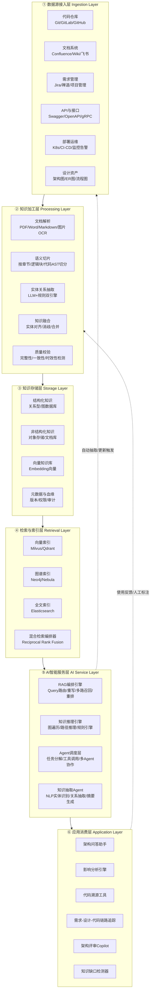

### 2.2 架构说明

- **① 数据源接入层**：6类核心数据源，通过连接器（Connector）统一接入，支持增量同步与事件驱动（Git Webhook、文档更新事件）。
- **② 知识加工层**：将异构原始资产转化为结构化知识，是"从数据到知识"的价值转化核心。
- **③ 知识存储层**：四类存储协同——结构化知识存图谱、非结构化原文存对象存储、语义向量存向量库、元数据血缘存关系库。
- **④ 检索与索引层**：三路索引独立建设，由混合检索编排器统一调度，根据查询类型自动选择最优检索策略。
- **⑤ AI智能服务层**：RAG负责"找得到"，推理引擎负责"推得深"，Agent负责"用得好"，抽取Agent负责"长得快"。
- **⑥ 应用消费层**：面向架构师、开发者、测试、运维等不同角色的场景化应用。

### 2.3 核心数据流

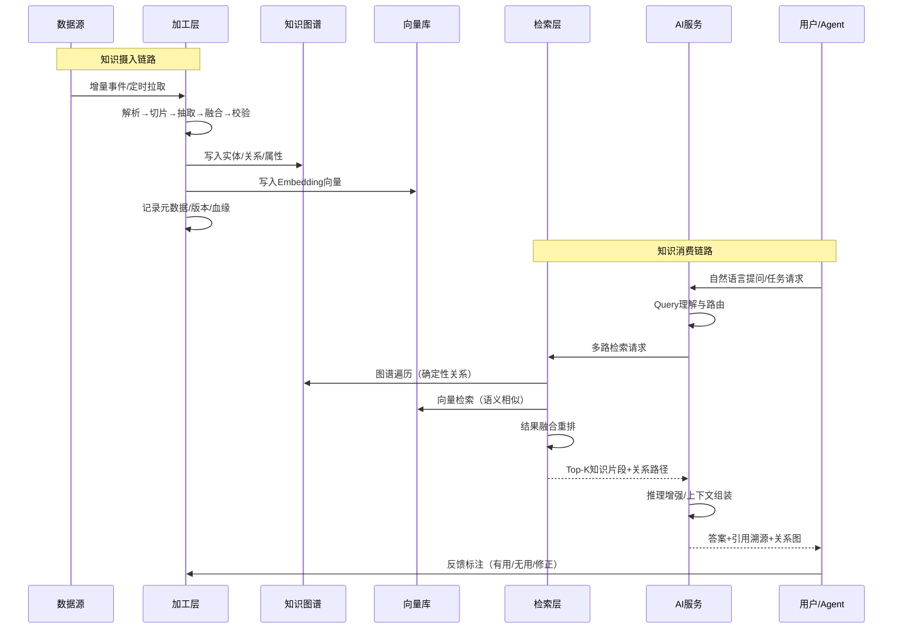

---

## 三、知识建模体系

### 3.1 本体设计（Ontology）

本体是知识库的"宪法"，定义了"有什么类型的事物、它们之间有什么关系、各自有什么属性"。

#### 3.1.1 核心实体类型（8大类、32子类）

| 大类 | 子类 | 说明 |
|------|------|------|
| **业务域** | 业务能力、业务流程、业务规则、业务术语、组织角色 | 描述"做什么" |
| **需求域** | 功能需求、非功能需求、用户故事、验收标准、需求变更 | 描述"要什么" |
| **设计域** | 架构方案、模块设计、接口设计、数据模型、部署架构、设计决策(ADR) | 描述"怎么设计" |
| **应用域** | 应用系统、微服务、前端组件、后端服务、第三方依赖 | 描述"有什么系统" |
| **数据域** | 数据实体、数据表、字段、数据字典、数据流、数据质量规则 | 描述"有什么数据" |
| **代码域** | 代码仓库、代码文件、类/函数、接口实现、算法模型、测试用例 | 描述"代码实现" |
| **运维域** | 部署环境、配置项、监控指标、告警规则、故障事件、运维手册 | 描述"运行状态" |
| **知识域** | 技术方案、最佳实践、踩坑记录、架构原则、规范标准、术语表 | 描述"经验沉淀" |

#### 3.1.2 核心关系类型（12种基础关系 + 派生关系）

| 关系类型 | 语义 | 示例 |
|----------|------|------|
| `contains` | 包含（整体-部分） | 架构方案 contains 模块设计 |
| `implements` | 实现 | 微服务 implements 接口设计 |
| `depends_on` | 依赖 | 服务A depends_on 服务B |
| `calls` | 调用 | 函数A calls 函数B |
| `references` | 引用 | 代码 references 数据表 |
| `satisfies` | 满足 | 功能实现 satisfies 需求 |
| `derived_from` | 衍生自 | 设计方案 derived_from 需求 |
| `produces` | 产生 | 服务 produces 数据实体 |
| `consumes` | 消费 | 服务 consumes API |
| `deployed_on` | 部署于 | 微服务 deployed_on K8s集群 |
| `related_to` | 关联（弱关系） | 技术方案 related_to 踩坑记录 |
| `conflicts_with` | 冲突 | 设计决策A conflicts_with 设计决策B |

**派生关系**：通过规则推理自动生成，如 `transitive_depends_on`（传递依赖）、`impact_scope`（影响范围）、`knowledge_gap`（知识缺口）。

#### 3.1.3 实体属性规范

每个实体至少包含以下**通用属性**：

```json
{
  "id": "全局唯一标识符（UUID/URN）",
  "name": "实体名称",
  "type": "实体类型（来自本体枚举）",
  "description": "自然语言描述",
  "owner": "责任人/团队",
  "status": "状态（草稿/生效/废弃）",
  "version": "版本号",
  "created_at": "创建时间",
  "updated_at": "最后更新时间",
  "source": "来源系统+原始ID",
  "tags": ["标签数组"],
  "confidence": "AI抽取置信度（0-1）",
  "verified": "是否经人工审核（bool）"
}
```

### 3.2 信息关联关系图（核心可视化）

这是整个知识库的"灵魂视图"——以图形化方式展示业务、数据、功能、代码四类资产的全域关联。

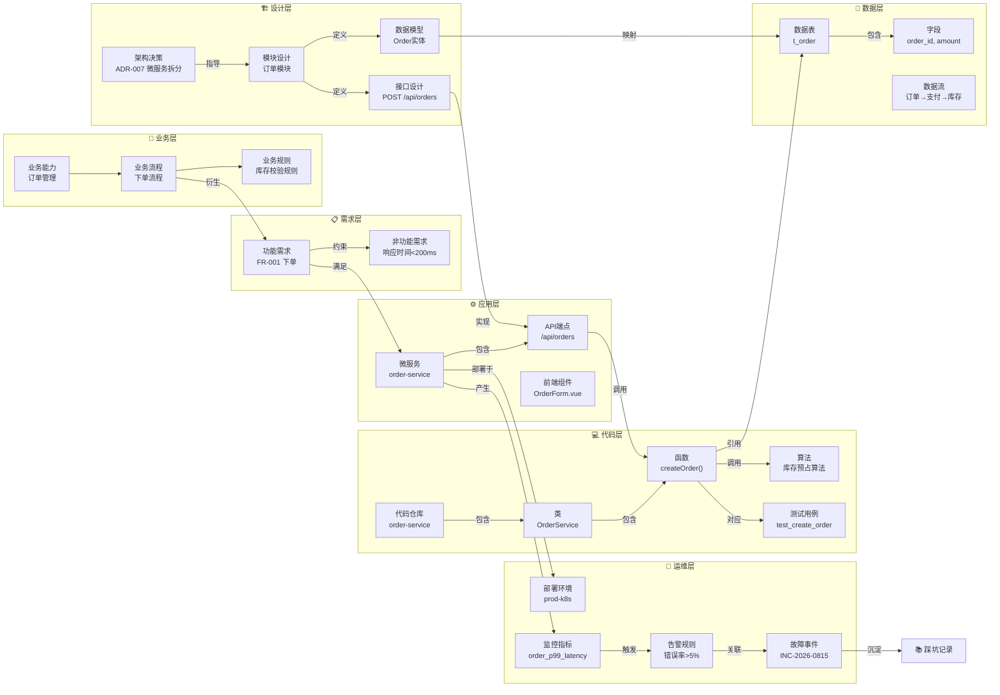

#### 3.2.1 关联关系图的四层价值

1. **可观测**：一图看清"业务需求→架构设计→代码实现→运行状态"的完整链路，任何节点都可追溯上下游。
2. **可推理**：基于关系网络自动推理——改一个字段影响哪些函数？一个服务故障波及哪些业务能力？
3. **可发现**：自动识别知识缺口——有需求但无对应设计？有接口但无测试用例？有故障但无复盘文档？
4. **可演化**：随代码提交、文档更新自动增量更新图谱，保持与真实系统的同步。

### 3.3 知识卡片（Knowledge Card）

每个实体在图谱中对应一张**知识卡片**，是人和Agent都能读写的标准化知识单元：

```yaml
# 知识卡片示例：order-service 微服务
id: "svc-order-001"
type: "微服务"
name: "order-service"
description: "订单核心服务，负责订单创建、查询、状态流转"
owner: "交易架构组"
status: "生效"
version: "v2.3.1"
source: "gitlab://group/order-service"
tags: ["核心服务", "交易域", "高可用"]

# 关联关系
relations:
  implements: ["if-create-order", "if-query-order"]
  depends_on: ["svc-payment", "svc-inventory", "svc-user"]
  deployed_on: ["env-prod-k8s", "env-staging-k8s"]
  produces: ["metric-order-qps", "metric-order-p99"]
  contains: ["api-post-orders", "api-get-orders-id"]

# 关键属性
properties:
  language: "Java 17"
  framework: "Spring Boot 3.2"
  database: "MySQL 8.0 (t_order)"
  replicas: 6
  sla: "99.99%"
  tech_debt_score: 7.2

# 知识片段（向量检索的最小单元）
chunks:
  - id: "chunk-001"
    title: "订单创建流程设计"
    content: "订单创建采用Saga模式...（详细设计说明）"
    embedding_ref: "vec://chunk-001"
    source_doc: "docs/design/order-creation.md"
  - id: "chunk-002"
    title: "库存预占算法说明"
    content: "使用Redis分布式锁+本地缓存两级..."
    embedding_ref: "vec://chunk-002"
    source_code: "src/main/java/.../InventoryService.java"

# 质量指标
quality:
  completeness: 0.85
  freshness: "2026-08-20"
  review_status: "已审核"
  last_reviewed: "2026-08-15"
```

---

## 四、知识采集与加工流水线

### 4.1 六类数据源接入策略

| 数据源 | 接入方式 | 同步频率 | 抽取重点 |
|--------|----------|----------|----------|
| **代码仓库** | Git Clone + Webhook 事件驱动 | 实时（push触发） | AST解析：类/函数/接口/依赖/调用关系；注释提取；README解析 |
| **文档系统** | API拉取 + Webhook | 准实时（5分钟） | 章节切片：按标题层级切分；表格提取；图片OCR；设计图解析 |
| **需求管理** | API拉取 + 状态变更事件 | 准实时 | 需求字段结构化；验收标准提取；需求间依赖关系；变更记录 |
| **API接口** | Swagger/OpenAPI 解析 | 定时（每日）+ 手动触发 | 接口定义结构化；请求/响应模型；接口间调用关系；版本对比 |
| **部署运维** | K8s API + Prometheus + 告警系统 | 实时流 | 部署拓扑；配置项；监控指标关联；故障事件与代码/服务关联 |
| **设计资产** | 文件上传 + 设计工具API | 手动 + 定时 | 架构图元素识别；ER图实体关系提取；流程图节点解析 |

### 4.2 加工流水线（五阶段）

```mermaid
graph LR
    subgraph S1["① 解析 Parsing"]
        P1["格式识别"]
        P2["内容提取"]
        P3["结构化转换"]
    end

    subgraph S2["② 切片 Chunking"]
        C1["语义切片<br/>按章节/逻辑块"]
        C2["代码AST切片<br/>按类/函数/方法"]
        C3["表格切片<br/>按行列语义"]
    end

    subgraph S3["③ 抽取 Extraction"]
        E1["实体识别<br/>LLM NER"]
        E2["关系抽取<br/>LLM RE"]
        E3["属性提取<br/>规则+LLM"]
        E4["摘要生成<br/>关键信息浓缩"]
    end

    subgraph S4["④ 融合 Fusion"]
        F1["实体对齐<br/>同一实体多源合并"]
        F2["消歧<br/>同名异义区分"]
        F3["冲突检测<br/>多源信息矛盾标记"]
    end

    subgraph S5["⑤ 校验 Validation"]
        V1["完整性检查<br/>必填属性/关系"]
        V2["一致性检查<br/>本体约束/关系闭环"]
        V3["时效性检查<br/>过期知识标记"]
        V4["置信度评估<br/>AI抽取质量打分"]
    end

    S1 --> S2 --> S3 --> S4 --> S5
    S5 -->|"通过"| OUT["写入知识图谱+向量库"]
    S5 -->|"不通过"| QUEUE["人工审核队列"]
```

#### 4.2.1 语义切片策略（关键技术点）

传统的"固定长度切分"会破坏语义完整性，必须采用**混合切片策略**：

| 内容类型 | 切片策略 | 切片大小 | 重叠 |
|----------|----------|----------|------|
| 技术文档 | 按章节标题（H1/H2/H3）递归切分，单节过长再按段落切分 | 500-1000 token | 50 token |
| 代码文件 | AST解析，按类/函数/方法为最小切片单元，保留导入和上下文 | 按语法结构 | 包含类定义 |
| API文档 | 按单个接口为切片单元，包含请求/响应/错误码 | 单接口 | - |
| 表格数据 | 按行语义分组，保留表头上下文 | 10-20行/片 | 表头重复 |
| 架构图 | 图注+元素说明为切片，OCR识别图中文字 | 单图+说明 | - |

每个切片必须保留**上下文锚点**：所属文档、章节路径、实体关联、前后切片ID，确保检索后能还原完整语境。

#### 4.2.2 实体关系抽取（双引擎架构）

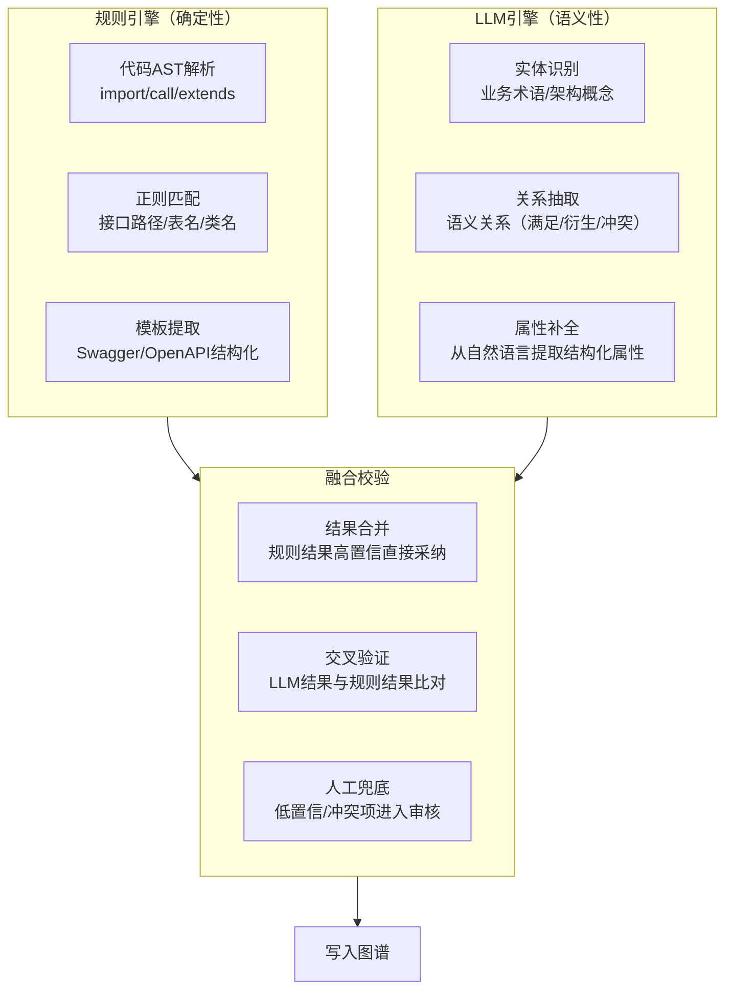

**Prompt工程要点**：
- 抽取Prompt必须包含本体定义（实体类型枚举、关系类型枚举、属性schema），让LLM在约束空间内输出。
- 输出格式强制为JSON，包含实体列表和关系列表，每个关系带置信度。
- Few-shot示例：提供2-3个典型文档的抽取示例，提升准确率。
- 批量处理：长文档分块抽取后做全局实体对齐，避免同一实体被识别为多个。

### 4.3 增量更新与事件驱动

知识库必须是"活"的，而非一次性导入的静态仓库。

**触发机制**：
- **Git Webhook**：代码push/merge触发代码知识增量更新，仅处理变更文件。
- **文档Webhook**：Confluence/飞书文档更新触发对应知识卡片更新。
- **CI/CD事件**：部署成功触发运维知识更新（版本、环境、配置）。
- **告警事件**：Prometheus告警触发故障知识卡片创建/关联。
- **定时全量校验**：每日凌晨执行全量一致性检查，发现漂移自动修复或标记。

**更新策略**：
- 代码变更：AST diff → 仅更新变更的类/函数节点和关系。
- 文档变更：版本对比 → 仅重新切片变更章节，复用未变更切片的向量。
- 关系变更：级联更新 → 一个实体变更自动触发上下游关系的有效性检查。

---

## 五、存储与检索引擎

### 5.1 四类存储协同

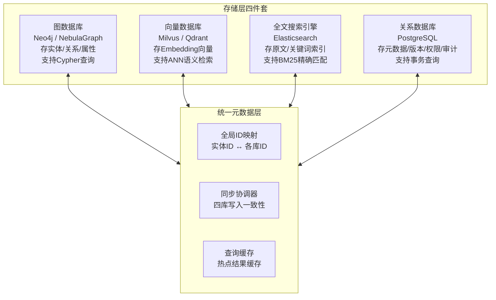

### 5.2 存储选型对比

| 存储类型 | 推荐方案 | 适用场景 | 关键能力 |
|----------|----------|----------|----------|
| 图数据库 | **Neo4j**（中小规模）/ **NebulaGraph**（大规模分布式） | 实体关系存储、图遍历查询、路径推理、影响分析 | Cypher/nGQL查询、多跳遍历、图算法（PageRank/社区发现）、可视化 |
| 向量数据库 | **Milvus**（生产级）/ **Qdrant**（轻量级） | 语义检索、相似文档匹配、RAG召回 | HNSW/IVF索引、标量过滤、多向量字段、分布式扩展 |
| 全文搜索 | **Elasticsearch** | 关键词精确匹配、代码符号搜索、日志检索、过滤聚合 | BM25评分、倒排索引、中文分词、聚合分析 |
| 关系数据库 | **PostgreSQL** | 元数据管理、版本控制、权限、审计、事务 | ACID、JSONB、行级安全、pgvector（可兼做轻量向量库） |

### 5.3 混合检索架构

单一检索模式各有盲区，必须三路融合：

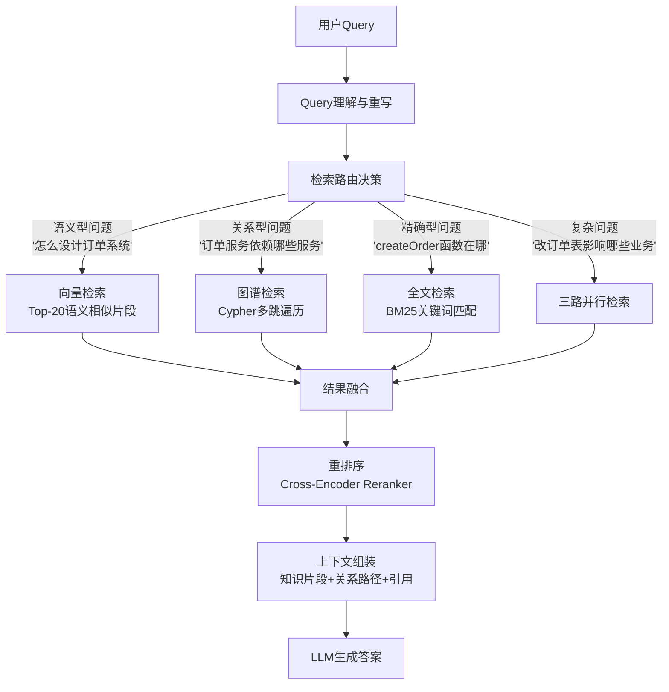

#### 5.3.1 检索路由策略

| Query类型 | 识别特征 | 主检索路径 | 辅助路径 |
|-----------|----------|------------|----------|
| 语义解释型 | "什么是...""怎么理解..." | 向量检索 | 全文检索 |
| 关系查询型 | "依赖哪些""关联什么""影响范围" | 图谱遍历 | 向量检索 |
| 精确定位型 | 包含代码符号/接口路径/表名 | 全文检索 | 图谱检索 |
| 对比分析型 | "区别""对比""优劣" | 向量+图谱 | 全文检索 |
| 故障排查型 | "报错""异常""为什么失败" | 图谱（故障→服务→代码） | 向量（运维手册） |
| 设计决策型 | "为什么这样设计""选型依据" | 图谱（ADR→决策→方案） | 向量（设计文档） |

#### 5.3.2 结果融合算法

采用 **Reciprocal Rank Fusion (RRF)** 算法融合多路结果：

$$
\text{RRFScore}(d) = \sum_{i \in \text{retrievers}} \frac{1}{k + \text{rank}_i(d)}
$$

其中 $k=60$ 为常数，$\text{rank}_i(d)$ 为文档 $d$ 在第 $i$ 路检索中的排名。

融合后再通过 **Cross-Encoder Reranker**（如 bge-reranker-v2-m3）做精排，将Query与候选片段逐对计算相关性得分，取Top-N进入LLM上下文。

---

## 六、AI智能服务层

### 6.1 RAG编排引擎

RAG不是"检索+拼接"那么简单，生产级RAG需要完整的编排能力：

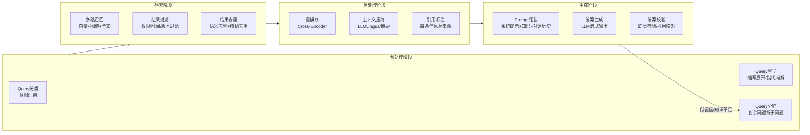

#### 6.1.1 RAG关键能力清单

| 能力 | 说明 | 实现方式 |
|------|------|----------|
| **Query重写** | 将口语化/模糊提问转为精准检索词 | LLM Few-shot + 规则模板 |
| **多跳推理** | 需跨多个知识片段推理的问题 | 子问题分解 → 逐跳检索 → 合并推理 |
| **上下文压缩** | 检索结果过长时压缩关键信息 | LLMLingua / LLM摘要 / 关键句提取 |
| **引用溯源** | 答案中每个事实标注来源 | 生成时绑定片段ID，输出带引用编号 |
| **幻觉检测** | 检测答案是否超出检索知识 | 答案与检索片段做蕴含关系校验 |
| **拒答机制** | 知识不足时明确告知而非编造 | 检索相关性阈值 + LLM自检 |
| **对话记忆** | 多轮对话中保持上下文 | 会话级向量缓存 + 指代消解 |

### 6.2 知识推理引擎

基于知识图谱的确定性推理，是超越传统RAG的核心能力：

| 推理类型 | 说明 | 应用场景 | 实现方式 |
|----------|------|----------|----------|
| **路径推理** | 沿关系链遍历，找到A到B的关联路径 | "需求如何落到代码"链路追踪 | 图遍历算法（BFS/DFS/最短路径） |
| **传递闭包** | 计算传递依赖的完整集合 | "订单服务的全部依赖（含间接）" | 图算法（Transitive Closure） |
| **影响分析** | 从变更点出发，计算所有可能受影响的节点 | "改t_order表影响哪些服务/接口" | 子图扩展 + 关系类型过滤 |
| **缺口检测** | 比对应有关系与实有关系，发现缺失 | "有需求但无对应测试用例" | 规则引擎 + 图模式匹配 |
| **一致性校验** | 检测图谱中的矛盾关系 | "接口版本与代码实现不一致" | 规则推理 + 冲突检测 |
| **社区发现** | 自动发现紧密关联的实体簇 | "识别核心业务域的服务集群" | 图算法（Louvain/Label Propagation） |

### 6.3 Agent调度层

知识库不只是"问答"，更要支撑Agent自主完成复杂任务：

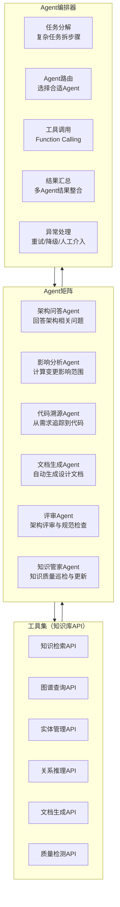

#### 6.3.1 典型Agent工作流示例：需求-代码链路追踪

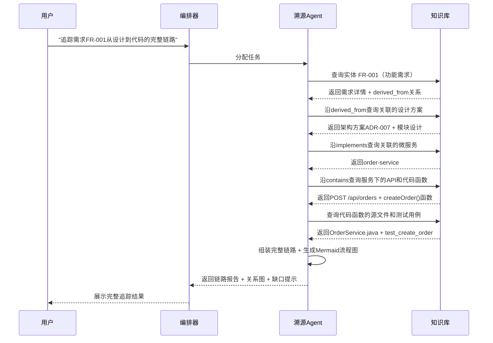

### 6.4 知识抽取Agent

负责从非结构化内容中自动提取结构化知识，持续扩充知识库：

- **文档理解**：读取新上传的设计文档，自动识别其中的架构决策、模块划分、接口定义。
- **代码理解**：分析新提交的代码，自动更新类/函数节点和调用关系。
- **会议纪要提取**：从架构评审会议纪要中提取决策结论和待办事项。
- **故障复盘提取**：从故障复盘文档中提取根因、影响范围、改进措施。

---

## 七、应用场景

### 7.1 六大核心应用场景

| 场景 | 目标用户 | 核心能力 | 价值 |
|------|----------|----------|------|
| **架构智能问答** | 全体研发 | 自然语言提问，精准获取架构知识 | 降低知识查找成本，新人上手周期缩短50% |
| **变更影响分析** | 架构师/开发 | 输入变更点，自动计算全链路影响范围 | 减少变更遗漏，降低线上故障风险 |
| **需求-代码溯源** | 开发/测试/审计 | 从需求追踪到设计、代码、测试的完整链路 | 提升可追溯性，满足合规审计要求 |
| **架构评审Copilot** | 架构师/技术负责人 | 自动检查设计是否符合规范、是否有冲突、是否有知识缺口 | 提升评审效率和质量，减少人为遗漏 |
| **知识缺口检测** | 架构委员会/知识管家 | 自动识别"有需求无设计""有接口无文档""有服务无监控"等缺口 | 推动知识补全，提升整体架构质量 |
| **故障智能排查** | SRE/运维 | 从告警事件自动关联服务、代码、历史故障、运维手册 | 缩短MTTR，提升故障排查效率 |

### 7.2 场景示例：架构评审Copilot工作流

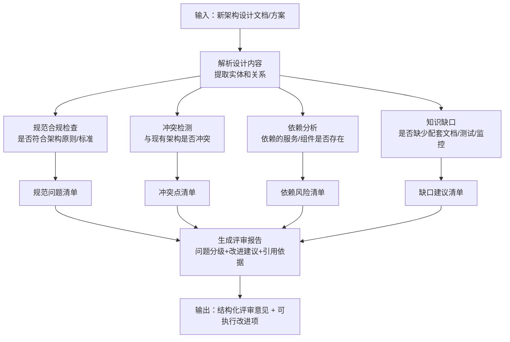

---

## 八、技术选型与开发对接

### 8.1 技术栈总览

| 层级 | 技术选型 | 说明 |
|------|----------|------|
| **图数据库** | Neo4j 5.x（社区版起步，企业版按需） | 成熟稳定，Cypher查询语言生态完善，可视化工具丰富 |
| **向量数据库** | Milvus 2.4+ | 生产级分布式向量数据库，支持多种索引和标量过滤 |
| **全文搜索** | Elasticsearch 8.x | 成熟的全文检索引擎，支持中文分词和聚合分析 |
| **关系数据库** | PostgreSQL 16 | 元数据、版本、权限、审计，支持JSONB和行级安全 |
| **Embedding模型** | bge-large-zh-v1.5 / text-embedding-3-large | 中文效果优秀，支持8192维度，可私有化部署 |
| **Reranker模型** | bge-reranker-v2-m3 | 跨语言重排序，精准度高 |
| **LLM** | 通义千问 / DeepSeek / GPT-4o（按场景选择） | 知识抽取、问答生成、Agent推理，支持私有化部署 |
| **文档解析** | Unstructured / PyPDF / python-docx / PaddleOCR | 多格式文档解析，支持图片OCR |
| **代码解析** | tree-sitter / Language Server Protocol (LSP) | 多语言AST解析，支持Java/Python/Go/JS/TS等 |
| **任务调度** | Apache Airflow / Temporal | 知识加工流水线调度，支持DAG和事件驱动 |
| **消息队列** | Apache Kafka / RabbitMQ | 数据源事件接入，异步处理解耦 |
| **API网关** | FastAPI / Kong | 知识库API统一入口，鉴权、限流、监控 |
| **前端可视化** | React + AntV G6 / D3.js | 知识图谱可视化，支持力导向图、树形图、桑基图 |

### 8.2 核心API设计

知识库对外提供统一的RESTful API，供上层应用和Agent调用：

```
# 知识检索
POST /api/v1/knowledge/search
  Body: { "query": "string", "top_k": 10, "filters": {...}, "mode": "hybrid|vector|graph|fulltext" }
  Response: { "results": [...], "total": int, "query_rewrite": "string" }

# 图谱查询
POST /api/v1/graph/query
  Body: { "cypher": "MATCH (n)-[r]->(m) RETURN n,r,m LIMIT 100" }
  Response: { "nodes": [...], "edges": [...] }

# 实体管理
GET    /api/v1/entities/{id}           # 获取实体详情
POST   /api/v1/entities                 # 创建实体
PUT    /api/v1/entities/{id}            # 更新实体
DELETE /api/v1/entities/{id}            # 删除实体（软删除）

# 关系管理
POST   /api/v1/relations                # 创建关系
DELETE /api/v1/relations/{id}           # 删除关系

# 推理服务
POST /api/v1/reasoning/impact-analysis
  Body: { "entity_id": "string", "relation_types": [...], "max_depth": 3 }
  Response: { "impacted_entities": [...], "paths": [...] }

POST /api/v1/reasoning/lineage-trace
  Body: { "from_type": "需求", "from_id": "FR-001", "to_type": "代码" }
  Response: { "path": [...], "gaps": [...] }

POST /api/v1/reasoning/gap-detection
  Body: { "scope": "全量|业务域|服务", "rules": [...] }
  Response: { "gaps": [...], "statistics": {...} }

# 知识摄入
POST /api/v1/ingestion/documents        # 上传文档进行知识抽取
POST /api/v1/ingestion/code             # 触发代码仓库分析
POST /api/v1/ingestion/url              # 从URL抓取并解析

# Agent问答
POST /api/v1/agent/chat
  Body: { "message": "string", "session_id": "string", "agent_type": "qa|impact|lineage|review" }
  Response: SSE流式输出
```

### 8.3 开发对接指南

#### 8.3.1 新数据源接入步骤

1. **开发连接器（Connector）**：实现标准接口 `SourceConnector`，包含 `fetch()`、`parse()`、`extract_metadata()` 三个方法。
2. **注册数据源**：在管理后台配置数据源类型、连接信息、同步策略。
3. **配置抽取规则**：针对该数据源的内容格式，配置实体识别和关系抽取的Prompt模板。
4. **测试连通性**：执行小规模测试，验证数据解析和知识抽取质量。
5. **上线运行**：开启增量同步，监控处理延迟和错误率。

#### 8.3.2 新应用接入步骤

1. **获取API密钥**：在管理后台创建应用，获取AppKey和AppSecret。
2. **选择接入模式**：
   - **简单问答**：直接调用 `/api/v1/agent/chat`，传入问题即可。
   - **深度集成**：调用检索API、图谱API、推理API，自行组装业务逻辑。
   - **Agent扩展**：基于知识库API开发自定义Agent，注册到Agent调度层。
3. **权限配置**：为应用配置可访问的知识域和操作权限。
4. **联调测试**：在沙箱环境验证检索效果和API稳定性。

---

## 九、治理与运营体系

### 9.1 知识治理组织

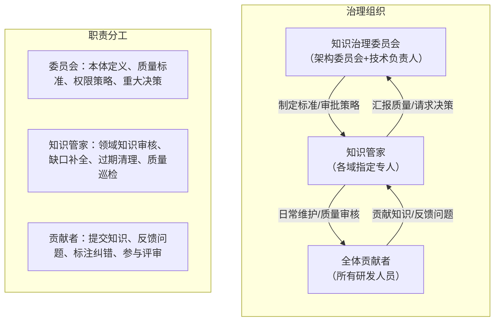

### 9.2 知识质量度量

| 质量维度 | 指标 | 计算方式 | 目标值 |
|----------|------|----------|--------|
| **完整性** | 实体属性完整率 | 有值属性数 / 应有属性总数 | ≥ 90% |
| **完整性** | 关系覆盖率 | 实际关系数 / 预期关系数 | ≥ 85% |
| **准确性** | 人工审核通过率 | 审核通过数 / 审核总数 | ≥ 95% |
| **准确性** | 实体对齐准确率 | 正确对齐数 / 总对齐数 | ≥ 98% |
| **时效性** | 知识新鲜度 | 30天内更新实体占比 | ≥ 80% |
| **时效性** | 更新延迟 | 数据源变更到知识库更新的平均时间 | ≤ 5分钟 |
| **可用性** | 检索命中率 | Top-5包含正确答案的查询占比 | ≥ 90% |
| **可用性** | 问答满意度 | 用户反馈"有用"的占比 | ≥ 85% |
| **安全性** | 越权访问率 | 未授权访问尝试被拦截率 | 100% |

### 9.3 知识生命周期管理

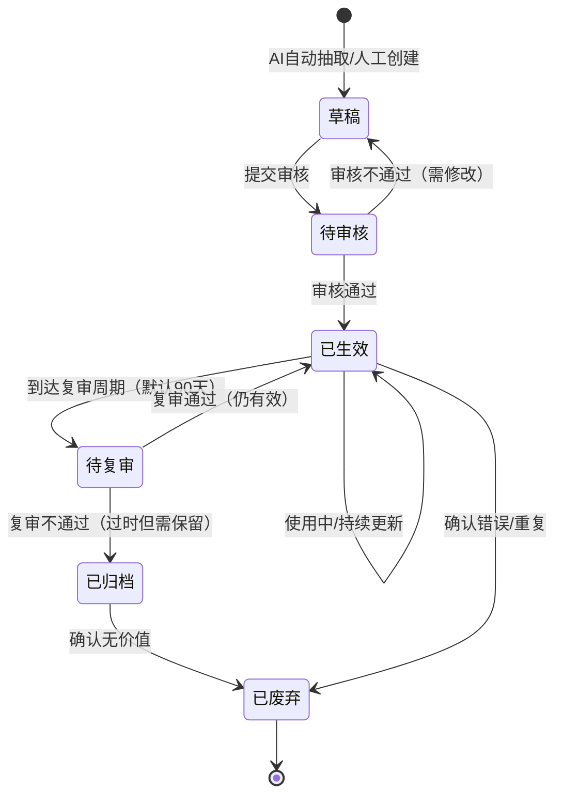

### 9.4 权限与安全

- **三级权限模型**：
  - **知识域级**：按业务域/技术域划分可访问范围。
  - **实体级**：敏感实体（如核心算法、安全配置）需单独授权。
  - **属性级**：部分属性（如负责人联系方式）仅授权角色可见。
- **权限继承**：实体权限继承自所属知识域，关系权限继承自两端实体的交集权限。
- **审计日志**：所有知识访问、修改、导出操作记录审计日志，支持追溯。
- **数据脱敏**：对外提供API时，敏感字段自动脱敏。

---

## 十、实施路线图

### 10.1 四阶段实施计划

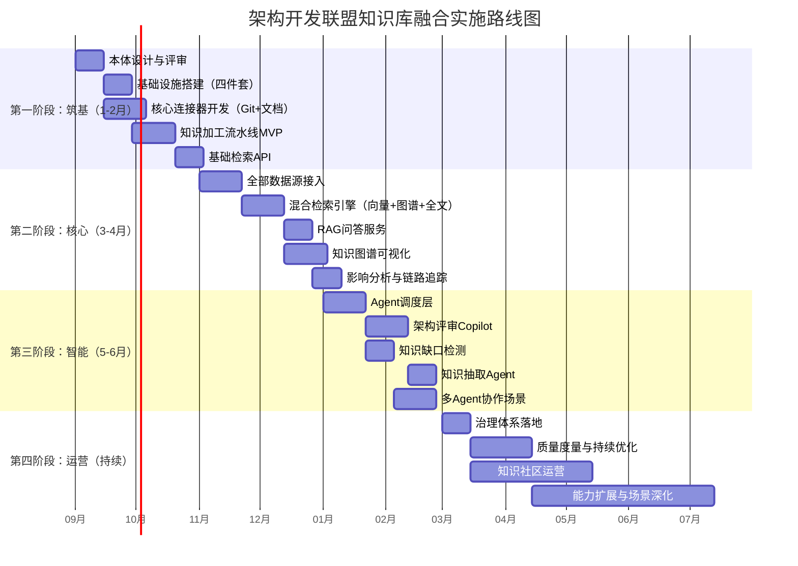

### 10.2 各阶段交付物

| 阶段 | 周期 | 核心交付物 | 验收标准 |
|------|------|------------|----------|
| **筑基** | 第1-2月 | 本体规范文档、基础设施、2个核心连接器、加工流水线MVP、基础检索API | 可完成Git代码+设计文档的知识抽取和基础检索 |
| **核心** | 第3-4月 | 6类数据源全接入、混合检索引擎、RAG问答服务、图谱可视化、影响分析 | 自然语言问答Top-5命中率≥80%，可展示全域关联关系图 |
| **智能** | 第5-6月 | Agent调度层、架构评审Copilot、知识缺口检测、知识抽取Agent | 可自动完成架构评审检查，知识缺口识别准确率≥85% |
| **运营** | 持续 | 治理体系、质量度量看板、知识社区、场景化应用 | 知识活跃率≥60%，用户满意度≥85%，知识更新延迟≤5分钟 |

### 10.3 关键风险与应对

| 风险 | 影响 | 概率 | 应对措施 |
|------|------|------|----------|
| **知识抽取准确率不足** | 图谱质量差，检索结果不可信 | 高 | 双引擎抽取+人工审核闭环，持续优化Prompt，从高价值域开始逐步扩展 |
| **数据源接入复杂** | 实施周期延长 | 中 | 优先接入Git和文档两类核心数据源，其他按需逐步接入，提供标准化连接器框架 |
| **用户 adoption 低** | 知识库沦为"文件坟场" | 高 | 与研发流程深度集成（IDE插件、CI/CD集成、评审流程嵌入），而非独立工具；运营驱动，知识贡献纳入绩效 |
| **知识过时** | 检索到错误信息，信任度下降 | 中 | 事件驱动增量更新+定时全量校验+过期知识自动标记+知识管家定期复审 |
| **权限管理复杂** | 信息泄露风险 | 中 | 三级权限模型+权限继承+审计日志+数据脱敏，从设计之初纳入而非事后补丁 |
| **LLM成本高** | 运营成本不可控 | 中 | 抽取任务用小模型+规则，问答用大模型；缓存高频查询结果；私有化部署降低API成本 |

---

## 十一、总结

### 11.1 方案核心价值

将"架构开发联盟"融合为知识库，本质是完成**三个转变**：

1. **从"文档管理"到"知识网络"**：不再是分散的文档仓库，而是以本体为骨架、以关系为血脉的结构化知识网络。业务、数据、功能、代码四类资产通过"信息关联关系图"全域互联。
2. **从"静态存储"到"活的系统"**：知识持续代谢——自动采集、智能抽取、增量更新、使用反馈、质量演化。知识库与真实系统保持同步，而非过时的档案。
3. **从"人找知识"到"知识找人"**：通过RAG+Agent，知识主动服务于架构评审、变更分析、故障排查、代码溯源等场景，嵌入研发流程，而非等待用户主动检索。

### 11.2 成功关键

- **本体先行**：花足够时间设计和评审本体模型，这是整个知识库的地基。
- **小步快跑**：从1-2个高价值域切入，验证价值后再扩展，避免大而全的失败。
- **流程嵌入**：知识库必须嵌入研发流程（IDE、CI/CD、评审、运维），而非独立的"另一个系统"。
- **人机共养**：AI自动抽取提效，人工审核保质，使用反馈优化，三方协同才能持续健康。
- **治理护航**：从第一天就建立质量标准、权限体系、运营机制，避免沦为"文件坟场"。

---

> **附录**：本方案中所有Mermaid图表可直接渲染为可视化图形，建议在支持Mermaid的Markdown编辑器中查看。信息关联关系图建议结合AntV G6实现交互式可视化，支持节点展开/折叠、关系过滤、路径高亮等操作。
