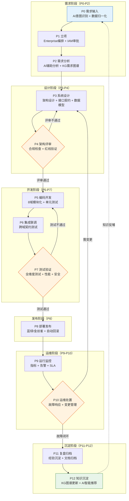
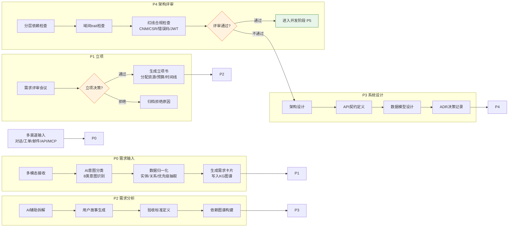
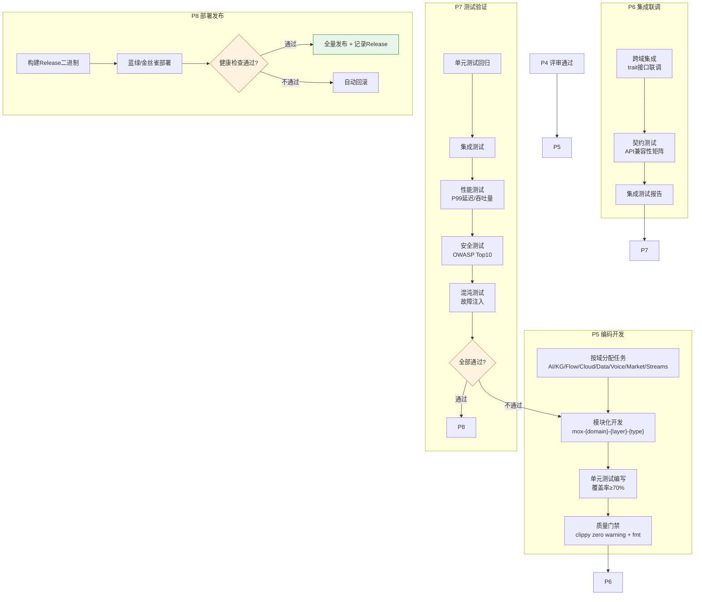
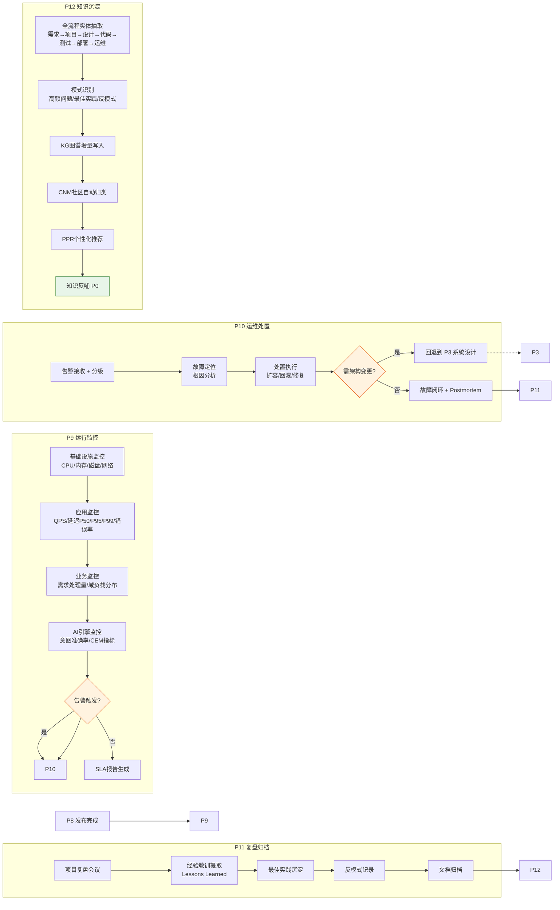
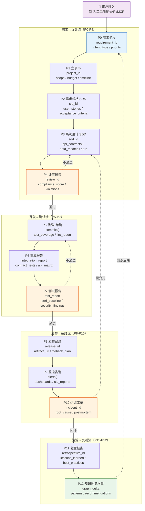

# 02 · P0-P12 全维业务端到端流程图

> **版本**: v1.0 · **日期**: 2026-08-27

## 一、流程总览

本系统覆盖从需求输入到归档评审的 **13 个阶段（P0-P12）** 全维业务流程，每个阶段有明确的输入、输出、负责域和 API 入口。

```
P0 需求输入 → P1 立项 → P2 需求分析 → P3 系统设计 → P4 架构评审
     ↓
P5 编码开发 → P6 集成联调 → P7 测试验证 → P8 部署发布
     ↓
P9 运行监控 → P10 运维处置 → P11 复盘归档 → P12 知识沉淀
```

### Mermaid 可视化主流程图



### P0-P4 需求到设计子流程（含决策回退）



### P5-P8 开发到发布子流程



### P9-P12 运维到知识沉淀子流程



---

## 二、各阶段详解

### P0 · 需求输入（Requirement Intake）

**目标**: 多渠道收集需求，归一化为标准需求卡片

| 维度 | 内容 |
|---|---|
| **输入** | 用户对话 / 工单 / 邮件 / API 调用 / MCP 消息 |
| **输出** | 标准需求卡片（RequirementCard） |
| **负责域** | AI（意图识别）+ Data（归一化） |
| **API 入口** | `POST /ai/engine/process` |
| **关键产物** | `requirement_id`, `intent_type`, `priority`, `raw_content` |

**处理逻辑**:
1. 接收多模态输入（文本/语音/图片）
2. AI 引擎自动意图识别（8 类：需求/缺陷/咨询/操作/审批/查询/报表/配置）
3. 数据归一化：抽取实体、关系、优先级
4. 生成标准需求卡片，写入 KG 图谱

---

### P1 · 立项（Project Initiation）

**目标**: 需求评审、立项决策、资源分配

| 维度 | 内容 |
|---|---|
| **输入** | P0 需求卡片 |
| **输出** | 项目立项书（ProjectCharter） |
| **负责域** | Enterprise（编排）+ IAM（审批） |
| **API 入口** | `POST /enterprise/v1/projects` |
| **关键产物** | `project_id`, `scope`, `budget`, `timeline`, `stakeholders` |

---

### P2 · 需求分析（Requirement Analysis）

**目标**: 需求拆解、用户故事、验收标准

| 维度 | 内容 |
|---|---|
| **输入** | P1 项目立项书 |
| **输出** | 需求规格说明书（SRS） |
| **负责域** | AI（辅助分析）+ KG（需求图谱） |
| **API 入口** | `POST /ai/engine/analyze` |
| **关键产物** | `user_stories[]`, `acceptance_criteria[]`, `dependency_graph` |

---

### P3 · 系统设计（System Design）

**目标**: 架构设计、接口设计、数据模型设计

| 维度 | 内容 |
|---|---|
| **输入** | P2 SRS |
| **输出** | 系统设计文档（SDD） |
| **负责域** | Enterprise（架构）+ KG（设计图谱） |
| **API 入口** | `POST /enterprise/v1/design` |
| **关键产物** | `architecture_diagram`, `api_contracts[]`, `data_models[]`, `adrs[]` |

---

### P4 · 架构评审（Architecture Review）

**目标**: 架构合规性检查、技术决策评审

| 维度 | 内容 |
|---|---|
| **输入** | P3 SDD |
| **输出** | 评审报告（ReviewReport） |
| **负责域** | Enterprise（治理）+ Compliance（合规） |
| **API 入口** | `POST /enterprise/v1/review` |
| **关键产物** | `compliance_score`, `violations[]`, `approvals[]`, `action_items[]` |

**架构红线检查项**:
- [ ] 分层依赖方向正确（无反向依赖）
- [ ] 域间通过 trait 接口通信（无直接 impl 依赖）
- [ ] 社区检测使用 CNM（非 LPA）
- [ ] 图算法 CSR 优化（Pearson ≥ 0.9999）
- [ ] 错误码体系合规（7位企业级）
- [ ] 认证授权全覆盖（JWT + RBAC）

---

### P5 · 编码开发（Coding）

**目标**: 模块化开发、代码生成、质量门禁

| 维度 | 内容 |
|---|---|
| **输入** | P3 SDD + P4 评审通过 |
| **输出** | 可编译代码 + 单元测试 |
| **负责域** | 各业务域（AI/KG/Flow/Cloud/...） |
| **API 入口** | Git Webhook + CI/CD |
| **关键产物** | `crate[]`, `test_coverage`, `lint_report` |

**开发规范**:
- 每个域独立 crate，遵循 `mox-{domain}-{layer}-{type}` 命名
- 强制单元测试覆盖率 ≥ 70%
- clippy zero warning
- cargo fmt 格式化

---

### P6 · 集成联调（Integration）

**目标**: 跨域集成、接口联调、契约测试

| 维度 | 内容 |
|---|---|
| **输入** | P5 各域代码 |
| **输出** | 集成测试报告 |
| **负责域** | Test Harness + Gateway |
| **API 入口** | `POST /test-harness/v1/integration` |
| **关键产物** | `integration_tests[]`, `contract_tests[]`, `api_compatibility_matrix` |

---

### P7 · 测试验证（Testing）

**目标**: 全维度测试、性能测试、安全测试

| 维度 | 内容 |
|---|---|
| **输入** | P6 集成通过 |
| **输出** | 测试报告（TestReport） |
| **负责域** | Test Harness + Compliance |
| **API 入口** | `POST /test-harness/v1/verify` |
| **关键产物** | `unit_coverage`, `integration_pass_rate`, `perf_baseline`, `security_findings[]` |

**测试维度**:
- 单元测试（≥70% 覆盖率）
- 集成测试（跨域契约）
- 性能测试（P99 延迟 / 吞吐量）
- 安全测试（OWASP Top 10）
- 混沌测试（故障注入）

---

### P8 · 部署发布（Deployment）

**目标**: 灰度发布、蓝绿部署、回滚预案

| 维度 | 内容 |
|---|---|
| **输入** | P7 测试通过 |
| **输出** | 发布记录（ReleaseRecord） |
| **负责域** | Enterprise（运维）+ Cloud（基础设施） |
| **API 入口** | `POST /enterprise/v1/deploy` |
| **关键产物** | `release_id`, `artifact_url`, `deploy_strategy`, `rollback_plan` |

**部署策略**:
- 单二进制部署（Rust 编译产物）
- 蓝绿部署 / 金丝雀发布
- 自动回滚（健康检查失败触发）

---

### P9 · 运行监控（Monitoring）

**目标**: 实时监控、告警、SLA 跟踪

| 维度 | 内容 |
|---|---|
| **输入** | P8 上线运行 |
| **输出** | 监控面板 + 告警事件 |
| **负责域** | Observability + Gateway |
| **API 入口** | `GET /metrics`, `GET /health`, `GET /ready` |
| **关键产物** | `dashboards[]`, `alerts[]`, `sla_reports[]` |

**监控指标**:
- 基础设施：CPU / 内存 / 磁盘 / 网络
- 应用：QPS / 延迟 P50/P95/P99 / 错误率
- 业务：需求处理量 / 平均处理时长 / 域负载分布
- AI 引擎：意图识别准确率 / 能力路由成功率 / CEM 指标

---

### P10 · 运维处置（Operations）

**目标**: 故障响应、变更管理、容量规划

| 维度 | 内容 |
|---|---|
| **输入** | P9 告警事件 |
| **输出** | 运维工单（OpsTicket） |
| **负责域** | Enterprise（运维）+ Cloud（基础设施） |
| **API 入口** | `POST /enterprise/v1/ops` |
| **关键产物** | `incident_id`, `root_cause`, `resolution`, `postmortem` |

---

### P11 · 复盘归档（Retrospective）

**目标**: 项目复盘、经验沉淀、文档归档

| 维度 | 内容 |
|---|---|
| **输入** | P10 运维闭环 |
| **输出** | 复盘报告（Retrospective） |
| **负责域** | Enterprise（治理）+ KG（知识沉淀） |
| **API 入口** | `POST /enterprise/v1/retrospective` |
| **关键产物** | `lessons_learned[]`, `best_practices[]`, `anti_patterns[]`, `doc_archive` |

---

### P12 · 知识沉淀（Knowledge Crystallization）

**目标**: 知识图谱更新、模式提取、智能推荐

| 维度 | 内容 |
|---|---|
| **输入** | P11 复盘报告 + 全流程数据 |
| **输出** | 知识图谱增量 + 智能推荐 |
| **负责域** | KG（图谱）+ AI（推荐） |
| **API 入口** | `POST /kg/v1/ingest`, `POST /ai/engine/recommend` |
| **关键产物** | `graph_delta`, `pattern_extractions[]`, `recommendations[]` |

**知识沉淀机制**:
1. 全流程实体/关系抽取（需求→项目→设计→代码→测试→部署→运维）
2. 模式识别：高频问题 / 最佳实践 / 反模式
3. 图谱更新：增量写入 KG，CNM 社区发现自动归类
4. 智能推荐：基于 PPR（个性化 PageRank）推荐相关知识

---

## 三、端到端数据流图

### ASCII 概览

```
┌──────────────────────────────────────────────────────────────────┐
│                         P0-P12 数据流                              │
├──────────────────────────────────────────────────────────────────┤
│                                                                      │
│  [用户输入] ──→ P0 需求卡片 ──→ P1 立项书 ──→ P2 SRS            │
│                                                          │           │
│                                                          ▼           │
│  P12 知识图谱 ←── P11 复盘 ←── P10 运维 ←── P9 监控 ←── P8 发布│
│                                                          │           │
│                                                          ▼           │
│  P4 评审 ←── P3 设计 ←── P2 SRS                                    │
│    │                                                                 │
│    ▼                                                                 │
│  P5 编码 ──→ P6 集成 ──→ P7 测试 ──→ P8 发布                      │
│                                                                      │
└──────────────────────────────────────────────────────────────────┘
```

### Mermaid 端到端数据流（含产物追踪）



---

## 四、API 入口汇总

| 阶段 | API | 方法 | 域 |
|---|---|---|---|
| P0 | `/ai/engine/process` | POST | AI |
| P1 | `/enterprise/v1/projects` | POST | Enterprise |
| P2 | `/ai/engine/analyze` | POST | AI |
| P3 | `/enterprise/v1/design` | POST | Enterprise |
| P4 | `/enterprise/v1/review` | POST | Enterprise |
| P5 | Git Webhook | - | CI/CD |
| P6 | `/test-harness/v1/integration` | POST | Test |
| P7 | `/test-harness/v1/verify` | POST | Test |
| P8 | `/enterprise/v1/deploy` | POST | Enterprise |
| P9 | `/metrics`, `/health`, `/ready` | GET | Observability |
| P10 | `/enterprise/v1/ops` | POST | Enterprise |
| P11 | `/enterprise/v1/retrospective` | POST | Enterprise |
| P12 | `/kg/v1/ingest`, `/ai/engine/recommend` | POST | KG + AI |

---

## 五、关键产物追踪

每个阶段的产物都有唯一 ID，写入 KG 图谱，可通过 `/kg/v1/neighborhood` 查询上下游依赖关系。

```
requirement_id (P0)
  └── project_id (P1)
        └── srs_id (P2)
              └── sdd_id (P3)
                    └── review_id (P4)
                          └── commits[] (P5)
                                └── integration_report (P6)
                                      └── test_report (P7)
                                            └── release_id (P8)
                                                  └── alerts[] (P9)
                                                        └── incidents[] (P10)
                                                              └── retrospective_id (P11)
                                                                    └── graph_delta (P12)
```

---

*详见 [04-api-gateway-routes.md](./04-api-gateway-routes.md) 获取完整 31 域 API 规范。*
