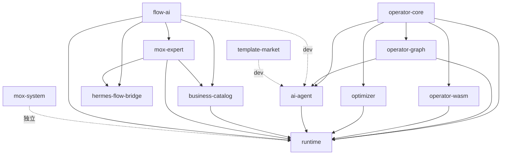
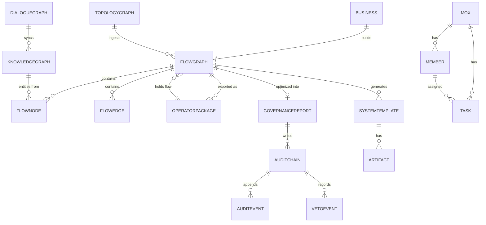

# 算子统一系统（OUS）业务功能规划与架构·数据关系分析

> 配套文档：PT‑Primi 架构规范 V1.0（本仓库 `PT-Primi-架构规范-V1.0-完整版.md`）、README.md、GOVERNANCE_CONSOLE_API_READY_20260816.md
> 分析日期：2026‑08‑16
> 范围（已与用户确认）：内部 12 个 crate + 外部对接（Hermes / LLM SaaS / WASM / 前端 / SQLite / 独立服务）
> “最优”判定口径（已确认）：① 编译+测试全绿 ② 性能基准+覆盖率 ③ 对齐 PT‑Primi 规范合规（守恒残差 ε / 六维绑定 / 可追溯）

---

## 0 文档目的与说明

本文档是 PT‑Primi 规范落地前的**现状盘点 + 规划分析**产物，目标有三：

1. **业务功能规划**：把 OUS 当前已具备和待补齐的业务功能按能力域完整列出；
2. **关联系统架构分析**：理清 12 个 crate 之间、以及 OUS 与外部系统之间的架构职责与边界；
3. **数据关联关系明确**：以 `FlowGraph` 为中枢，绘制跨 crate 的实体关系（ER）与数据流。

> 说明：本文档所有事实均来自对源码的探查（含 `file:line` 引用），不臆造接口。少数能力在代码中“声明但名不副实/未挂载”，已单列在 §2.5 关键架构发现中，作为后续开发清单的输入。

---

## 1 业务功能全景规划

### 1.1 能力域划分

| 能力域 | 主责 crate | 功能概述 | 实现状态 |
| --- | --- | --- | --- |
| 算子内核与执行 | operator-core / operator-wasm | 算子 trait、范畴论组合、高维状态、守恒律、WASM 沙箱 | ✅ 已实现（WASM 热加载名不副实，见 §2.5） |
| 知识图谱 | operator-graph / ai-agent(dialogue_graph) | 加权有向图、PageRank、社区发现、激活传播、推荐、对话自动入图 | ✅ 已实现 |
| 流程图优化 AI | flow-ai | 并行化、关键路径、冲突检测、资源排程、代码生成、κ‑τ 原语、六维关系网 | ✅ 已实现（内核完备） |
| 全维治理 / 璇玑 | mox-expert | 十四维专家并行诊断、归一裁决、璇玑验证网关、RBAC、审计链、治理闸门 | ⚠️ 库已实现，HTTP 服务可独立跑；runtime 路由未挂载（见 §2.5） |
| 业务全景目录 | business-catalog | 7 条业务建模为流程图 + 跨业务六维关系网，运行中持续优化 | ✅ 已实现 |
| AI 智能体 | ai-agent | 对话/NLU、算法归一、资源管理、插件总线、工作流、LLM 网关、浏览器自动化、流程图引擎、需求编译、对话图谱 | ✅ 已实现（浏览器为 HTTP 抓取非真无头，见 §2.5） |
| 算子商城 | runtime(market) | 需求+可编辑流程图算子包，上传/浏览/克隆/版本化/迁移 | ⚠️ 部分：额外路由为死代码（见 §2.5） |
| AI 自动化中枢 | runtime(automation) | 对话→蓝图/代码/测试/RBAC→沙箱实跑→异常自动修复→回写 | ✅ 已实现 |
| 外部流系统桥接 | hermes-flow-bridge | 把内核注入 Hermes Agent Ultra，录制/回放/否决 | ⚠️ 默认镜像桩，未真接 Hermes（见 §2.5） |
| 璇玑系统 | mox-system | 成员/任务/权限/通信，独立 HTTP+WS 服务 | ✅ 已实现（独立二进制） |
| 模板市场（草莓多） | template-market / ai-agent(caomei) | 系统模板发布/复用/评分，自动生成电商 DDL+Vue | ✅ 已实现（孤立资产层，仅 dev 依赖） |
| 可视化拓扑前端 | frontend（PrimiFlow 规格） | 拓扑画布、图谱、自动化、商城、璇玑融合等视图 | ✅ 前端已实现；PrimiFlow 规格为上层产品待开发 |

### 1.2 业务功能清单（按域展开）

**A. 算子内核与执行**
- 算子注册/组合/张量积/对偶（`operator-core::operator.rs:22,89`）
- 高维状态向量运算（`operator-core::state.rs:13`）
- 守恒律校验（L1/L2/求和，`operator-core::conservation.rs:37+`）
- 资源约束跟踪（`operator-core::resource.rs`）
- WASM 插件加载/执行（ABI `operator_apply(i32,i32,i32)->i32`，`operator-wasm/src/lib.rs:62`）

**B. 知识图谱**
- 节点/边增删、邻接/拉普拉斯矩阵（`operator-graph/src/lib.rs:117,172,196`）
- PageRank / 度 / 接近 / 社区中心性（`:266,298,315,392`）
- k 步关联度、激活传播、推荐（`:220,469,515`）
- 对话自动入图 + 统一搜索 + 导入导出（`ai-agent::dialogue_graph`，README §对话自动知识图谱）

**C. 流程图优化 AI（flow-ai）**
- 串行流程自动并行化（RAW/WAR/WAW 冒险，`dataflow.rs:156`）
- 关键路径/总浮动（`critpath.rs:49`）
- 冲突检测与自动修复（`conflict.rs:107,482`）
- RCPSP 资源排程、模型分级路由（`schedule.rs:104,300`）
- 流程⇄代码双向映射（Python + `schema.sql` + `App.vue`，`codegen.rs:77`）
- **κ‑τ 拓扑原语自涌现引擎**（`primitive.rs`，PrimiFlow 内核，见 §4）
- 六维关系拓扑检索/级联影响（`topology.rs`）

**D. 全维治理 / 璇玑（mox-expert）**
- 十四维专家并行诊断（业务7+开发7，`ir.rs:17`）
- 归一化裁决→flow-ai 求解→治理闸门（`pipeline.rs:41`）
- ⛨ 璇玑验证网关（最高权限，vetoed→BLOCK，`verify.rs:27`）
- RBAC、审计链、敏感度 SSOT（`rbac/`、`govern.rs:50`、`sensitivity.rs`）
- 编程流水线 10 步 + 五护栏（`programming.rs`）
- 执行态可视化回放（`executor.rs`）
- Flow YAML 外部化（`flow_loader`）

**E. 业务目录（business-catalog）**
- 内置 6 业务：政务数据归集 / 财务对账 / 智能客服 / ETL / MCP 编排 / 空间光速螺旋（`lib.rs:366`）
- 跨业务六维关系网（`build_topology`，`:379`）

**F. AI 智能体（ai-agent）**
- 多轮对话 + NLU + 算子推荐（`conversation.rs`）
- 算法识别/分析/归一化（`algorithm.rs`）
- 全资源（CPU/内存/GPU/插件/算子/工作流）管理（`resource_manager.rs`）
- 插件总线（pub-sub/p2p/事件，`plugin_bus.rs`）
- BPMN 工作流引擎（`workflow_engine.rs`）
- LLM Gateway（OpenAI/DeepSeek/Qwen/GLM/Ollama，provider 降级，`provider.rs`）
- 浏览器自动化（HTTP 抓取，`browser_automation.rs`）
- 流程图引擎（13 类节点，`flow_engine.rs`）
- 草莓需求编译器（自然语言→蓝图，`requirement_compiler.rs`）

**G. 算子商城 / 自动化中枢 / 模板市场 / 璇玑系统 / 桥接**：接口与能力见 §2.3 与外部对接层。

### 1.3 功能完整度矩阵（规划待办输入）

| 功能 | 状态 | 备注/缺口 |
| --- | --- | --- |
| 治理台 HTTP API（/api/governance/*） | ❌ 未挂载 | runtime 路由注释掉 + feature 门控关闭（§2.5） |
| 商城 import/export/tenant/owner 路由 | ❌ 死代码 | `routes/market.rs::extra_routes` 未挂载（§2.5） |
| WASM 热加载 | ❌ 名不副实 | 仅启动期扫描，无文件监听（§2.5） |
| Hermes 真实对接 | ❌ 未接 | 默认镜像桩，feature=hermes 才真接（§2.5） |
| 浏览器真实无头 | ❌ 名不副实 | 实为 reqwest HTTP 抓取（§2.5） |
| 六维绑定（REQ/FUN/BIZ/ALG/TSK/COD） | ❌ 未实现 | PT‑Primi 核心，见 §4.3 |
| 守恒残差全局闸门 | ⚠️ 局部 | primitive.rs 有 Δ，但未接全局发布闸门 |
| 文档自生成（PT‑DOC 01~10） | ⚠️ 部分 | codegen 生成 schema/App.vue，未接 PT‑Primi 8 文档模板 |

---

## 2 关联系统架构分析

### 2.1 12 crate 职责与依赖

| Crate | 职责 | workspace 依赖 |
| --- | --- | --- |
| operator-core | 数学公理内核（算子/状态/范畴/资源/守恒/单子） | —（叶子） |
| operator-wasm | WASM 插件沙箱 | operator-core |
| operator-graph | 加权有向知识图谱引擎 | operator-core |
| optimizer | DAG 拓扑/关键路径/贪心调度 | operator-core |
| flow-ai | 流程图优化 AI 内核（**含 κ‑τ primitive**） | —（零依赖，四方复用） |
| mox-expert | 璇玑十四维专家+治理 | flow-ai |
| hermes-flow-bridge | Hermes 零侵入注入插件 | flow-ai, mox-expert |
| business-catalog | 7 业务建模+六维关系网 | flow-ai, mox-expert |
| ai-agent | AI 智能体八大能力 | operator-core, operator-graph（prod）；flow-ai, template-market（dev） |
| template-market | 草莓系统模板市场 | —（孤立资产层） |
| runtime | Axum 总入口+商城+自动化+Cordis | operator-core/graph/wasm, optimizer, ai-agent, business-catalog, mox-expert, flow-ai |
| mox-system | 璇玑系统（独立） | —（完全独立） |

**依赖图（mermaid）**



### 2.2 primiflow/ 产品规格层

`primiflow/` 不是 crate，仅含两份 Markdown 规格：
- `SPEC.md`：PrimiFlow MVP 规格（R1-SPEC-v1.0），范式来源 PT‑Primi（κ/τ/Q + 常数 C），正则化算子 `ℛ̂` 计算 `Δ = C² − κ² − τ²`，**明确 MVP 不做全自动代码生成**（仅骨架/桩）。
- `ARCHITECTURE.md`：主架构设计，技术栈规划 Go orchestrator + Python 算子 + React/Cytoscape + PostgreSQL/pgvector，**复用 OUS 能力实现**。

即：PrimiFlow 是 OUS 之上的上层产品，其 κ‑τ 内核已在 `flow-ai/src/primitive.rs` 落地（见 §4）。

### 2.3 外部对接系统

| 外部系统 | 对接方式 | 状态 | 出处 |
| --- | --- | --- | --- |
| Hermes Agent Ultra | hermes-flow-bridge 注入插件（录制/回放/否决） | ⚠️ 默认镜像桩，feature=hermes 真接 | `hermes-flow-bridge/Cargo.toml:27` |
| LLM SaaS（DeepSeek/OpenAI/Qwen/GLM/Ollama） | ai-agent provider（OpenAI 兼容，无 key 降级规则） | ✅ 可配 | `ai-agent/src/provider.rs` |
| WASM 第三方算子 | operator-wasm 沙箱（ABI operator_apply） | ⚠️ plugins/ 当前为空 | `operator-wasm/src/lib.rs` |
| 前端 Vue3 | 经 `/api` 全量对接，axios Bearer 注入 | ✅ | `frontend/src/api/index.js` |
| mox-expert 独立服务 | HTTP /api/optimize /api/ingest（feature=live 推送） | ⚠️ 默认关闭 | `mox-expert/src/server.rs` |
| mox-system 独立服务 | HTTP+WS（/api/members,/tasks,/ws…） | ✅ 独立二进制 | `mox-system/src/server.rs` |
| SQLite（operator_dialogue.db / mox.db） | rusqlite 本地持久化 | ✅ | `ai-agent/dialogue_graph.rs`, `mox-system/store.rs` |
| 审计 Sink（Syslog/S3/Kafka/NATS/RabbitMQ） | mox-expert audit 外部化 | ⚠️ 需额外配置 | `mox-expert/src/lib.rs` |

### 2.4 分层架构映射（对齐 README 全业务流程图）

```
接入层:  frontend(Vue3/Three.js) · REST(/api/*) · WS(仅 mox-system)
运行时:  runtime(Axum) 鉴权/限流/观测/Cordis/MCP/OpenAPI
编排层:  flow-ai(拓扑/DAG/CPM/冲突/排程/codegen) · mox-expert(多专家融合/治理) · ai-agent(工作流/对话)
内核层:  operator-core(公理) · operator-graph(图谱) · operator-wasm(沙箱) · optimizer(DAG)
数据层:  business-catalog · template-market · SQLite · 外部 LLM/DB/消息
旁路:    hermes-flow-bridge(外部注入) · mox-system(独立璇玑)
```

### 2.5 关键架构发现（后续开发清单的硬输入）

1. **runtime 治理路由未挂载**：`handlers/governance.rs` 整组被注释（`runtime/src/lib.rs:16-21`），`routes/governance` 受 `feature="governance"` 门控且 runtime 未定义该 feature（`routes/mod.rs:6-11`）→ 运行时**不提供 /api/governance/\*** 任何端点（含 WS）。
2. **商城死代码**：`routes/market.rs::extra_routes()`（download/export-all/import/tenant/owner）未被 `main.rs` 挂载；前端也未调用。
3. **runtime 主路由无 WebSocket**：`/api/governance/ws` 已定义但未挂载；仅 mox-system 提供 WS。
4. **WASM “热加载”名不副实**：仅启动期 `load_all` 目录扫描，无文件监听/热重载；`plugins/` 为空；宿主不导入任何函数（强沙箱，但未配 wasmer Fuel 计量）。
5. **Hermes 未真接**：默认 `hermes_mirror` 镜像桩，`hermes-agent` 路径依赖被注释。
6. **浏览器自动化非无头**：实为 `reqwest` HTTP 抓取（默认 Bing 搜索+ExtractText），非 Playwright。
7. **template-market 孤立**：仅 ai-agent 的 dev-dependency，生产无引用。
8. **两套公理并存**：operator-core 用范畴论六公理；flow-ai::primitive 用 PT‑Primi κ‑τ（见 §4），二者尚未在“结构生成”层面统一。

---

## 3 数据关联关系明确

### 3.1 核心数据实体一览

| 实体 | 定义位置 | 持久化 | 说明 |
| --- | --- | --- | --- |
| FlowGraph（流程 IR） | flow-ai/src/model.rs:312 | 内存（JSON 序列化） | **跨 crate 中枢实体** |
| FlowNode / FlowEdge | flow-ai/src/model.rs:154,268 | 随 FlowGraph | 流程节点/语义边 |
| Operator / StateVector | operator-core/src/operator.rs:22, state.rs:13 | 内存 | 算子与高维状态 |
| KnowledgeGraph | operator-graph/src/lib.rs:87 | 内存 | 知识图谱 |
| DialogueGraph（SQLite） | ai-agent/src/dialogue_graph.rs | operator_dialogue.db | 对话+图谱落库 |
| OperatorPackage | runtime/src/market.rs:108 | $OUS_HOME/market/packages/<id>.json | 商城算子包 |
| AutomationAsset | runtime/src/automation_asset.rs:35 | 文件 | 自动化资产 |
| Business | business-catalog/src/lib.rs:59 | 内存（build fn） | 业务定义 |
| TopologyGraph | flow-ai/src/topology.rs:160 | 内存 | 六维关系网 |
| GovernanceReport / AuditChain / AuditEvent | mox-expert/src/pipeline.rs:18, govern.rs:50,37 | 内存 + 可选外 Sink | 治理报告/审计链 |
| VetoEvent / ExpertStatus / RbacConfig | runtime/src/handlers/governance.rs:157,200,280 | 内存（未挂载） | 治理台状态 |
| SystemTemplate（DDL+Vue） | template-market/src/lib.rs:68 | templates/*.json | 模板市场资产 |
| Mox 领域模型 | mox-system/src/model.rs | mox.db(SQLite) + 内存 | 成员/任务/通信 |

### 3.2 跨 crate 数据流（以 FlowGraph 为中枢）

```
runtime(AppState.ai_agent)
   │  chat/compile/flow
   ▼
AIAgent ──requirement_compiler──▶ SystemBlueprint
   │  blueprint_to_flow
   ▼
FlowGraph(flow-ai) ◀──────────── 被 5 方共享
   ├──▶ mox-expert::mox_optimize ──▶ GovernanceReport(AuditChain)
   ├──▶ business-catalog::Business::optimize ──▶ TopologyGraph(ingest_flow)
   ├──▶ hermes-flow-bridge::optimize_session ──▶ GateState(否决)
   ├──▶ runtime::automation ──▶ codegen ──▶ Python/schema.sql/App.vue
   └──▶ ai-agent::flow_engine 执行 ──▶ WorkflowResult
operator-core / operator-graph / optimizer 作为底层能力被上述各方调用
```

### 3.3 持久化方式汇总

- **内存**：operator-core、operator-graph、flow-ai、mox-expert（AuditChain 内存哈希链）、runtime 治理台状态。
- **文件 JSON**：market 算子包（`$OUS_HOME/market`）、automation 资产、template-market（`templates/`）。
- **SQLite**：`operator_dialogue.db`（对话+图谱）、`mox.db`（璇玑，write-through）。
- **外部 Sink（可选）**：mox-expert audit → Syslog/S3/Kafka/NATS/RabbitMQ。

### 3.4 实体关系 ER 图（mermaid）



### 3.5 事件 / 消息总线

- `ai-agent::plugin_bus`：进程内 pub-sub/p2p/事件（`plugin_bus.rs:18`）。
- `mox-system::event`：领域事件总线 `EventBus`（`event.rs:80`），写后发布→`Reactor` 翻译为通知（`orchestrator.rs:325`）。
- `mox-expert::executor`：`ExecEvent` 时间轴回放（`executor.rs:33`）。
- `runtime` 治理台：`broadcast::Sender` 双通道（veto/state），但因路由未挂载当前不生效。

---

## 4 PT‑Primi 规范合规差距分析

### 4.1 两套公理体系对照

| 维度 | OUS（operator-core） | PT‑Primi 规范 |
| --- | --- | --- |
| 数学内核 | 范畴论 + 希尔伯特空间 + 单子（六公理） | κ‑τ 拓扑原语 + 守恒恒等式 `C²=κ²+τ²` |
| 结构来源 | 人定义流程图/算子 DAG | 公理自涌现 Loop‑Graph |
| 原语 | Operator / StateVector / Category | Q / κ / τ / C |
| 绑定 | 无六维绑定概念 | REQ/FUN/BIZ/ALG/TSK/COD 六维一一绑定 |

### 4.2 已实现部分（对齐 PT‑Primi）

- **κ‑τ 守恒内核已落地**：`crates/flow-ai/src/primitive.rs` 实现 `PrimiEngine`，含 `Requirement`(Q)、`PrimitiveState`(κ,τ,C)、`generate/validate/regularize`，残差 `Δ = C² − κ² − τ²` 与正则化算子 `ℛ̂`（规范 §3.2 的 Q/κ/τ/C 在此具象化）。
- **六维关系网已存在雏形**：`flow-ai/src/topology.rs` 的 `TopologyGraph`/Entity/Relation 提供跨业务检索与级联影响，可映射为规范的 TraceMatrix 基础。

### 4.3 差距清单（必须补齐以满足“最优=PT‑Primi 合规”）

| 差距 | 规范要求 | 现状 | 影响 |
| --- | --- | --- | --- |
| 六维绑定 | §3.1 A4 / §5 | 无 REQ/FUN/BIZ/ALG/TSK/COD 绑定与 TraceMatrix | 不可全链路追溯 |
| 守恒残差全局闸门 | §3.1 A3 / §9.1 | primitive.rs 有 Δ 但未接发布闸门 | 拓扑可带残差上线 |
| 确定性 seed | §3.4 / §9.3 | Emerge 未强制记录 (G,B,P,seed) | 不可复现 |
| 文档自生成 8 文档 | §8 | codegen 仅生成 schema/App.vue | 缺 PT‑DOC 01~10 与溯源页 |
| 可视化 κ/τ/C 实时值 | §6.3 | 前端画布未接 C²=κ²+τ² 常驻显示 | 不可观测守恒 |
| 五代兼容注入 | §2 / §11.3 | 仅 flow-ai 复用，未显式封装 SUBG- | 历史 Graph 未隔离影响域 |

### 4.4 演进建议（把 OUS 对齐 PT‑Primi）

1. 在 `flow-ai::primitive` 之上建立**六维绑定 Registry**（REQ→FUN→BIZ→ALG→TSK→COD），写入 `TopologyGraph` 并导出 TraceMatrix。
2. 将 `regularize` 的 `Δ` 接入 runtime 发布前**强制闸门**（ε ≤ ε_max 默认 1e‑3 才允许出码）。
3. `PrimiEngine::emerge` 增加 `(G,B,P,seed)` 记录字段，未带 seed 的拓扑标“实验态”禁止进验收。
4. 复用 `codegen` 扩展 PT‑DOC 01~10 生成器，每篇含六维绑定溯源页。
5. 前端画布加 `C²=κ²+τ²` 实时值与守恒环常驻显示；历史 Graph 封装 `SUBG-` 注入并隔离影响域。

---

## 5 测试与最优性验证方案（综合三套标准）

> 本节定义“最优”的判定方法与命令，供下一阶段执行。本文档本身不做全量构建（属后续开发阶段）。

### 5.1 标准一：编译 + 测试全绿（正确性基线）

- 全量构建：`cargo build --workspace`（预期当前**不通过**，因 §2.5 的治理路由注释 + market 破碎代码）。
- 单 crate 构建：`cargo build -p runtime -p flow-ai -p mox-expert`。
- 测试：`cargo test --workspace`；重点：`tests/governance_api.rs`（11 用例）、`template-market` 的 `seed_mall_templates` 断言、各 crate 单元 doctest。
- 验收线：0 编译错误、0 测试失败。当前已知阻塞需在开发阶段先修复（见 §2.5、§6）。

### 5.2 标准二：性能基准 + 覆盖率

- 基准：`cargo bench`（benches/ 目录），针对 flow-ai 并行化/CPM、operator-graph PageRank、optimizer 调度建立基线指标。
- 覆盖率：`cargo tarpaulin`（或 `cargo llvm-cov`），目标核心算法 crate（flow-ai / operator-core / mox-expert）≥ 阈值（建议 70%）。
- 最优判定：关键路径计算耗时、PageRank 迭代收敛、调度延迟均有量化基线且回归不劣化。

### 5.3 标准三：PT‑Primi 合规校验

- 守恒残差：`python3 verify_axioms.py` 现有脚本校验范畴论六公理；**新增** `verify_ptprimi.py` 校验 `C²=κ²+τ²`（κ,τ 取自 `PrimiEngine` 样例涌现），ε ≤ 1e‑3。
- 六维绑定：扫描生成代码含 `// PT-BIND` 注释（规范 §5.3）+ TraceMatrix 可导出且连通至 REQ。
- 可追溯：任一实体能沿绑定链回溯至源头需求（规范 §3.1 A5）。

### 5.4 最优性综合判定矩阵

| 维度 | 指标 | 达标阈值 | 工具 |
| --- | --- | --- | --- |
| 编译/测试 | 错误数/失败数 | 0 / 0 | cargo |
| 性能 | 关键路径/PageRank/调度延迟 | 不劣化基线 | cargo bench |
| 覆盖率 | 核心 crate 行覆盖 | ≥70% | tarpaulin |
| PT‑Primi 守恒 | ε | ≤1e‑3 | verify_ptprimi.py |
| PT‑Primi 绑定 | 六维零孤儿 + 连通 REQ | 100% | 静态扫描 + TraceMatrix |
| PT‑Primi 确定性 | 生产拓扑带 seed | 100% | 配置校验 |

---

## 6 结论与下一步

- **已实现**：算子内核、知识图谱、流程图优化 AI（含 κ‑τ 内核）、璇玑治理库、业务目录、AI 智能体、商城/自动化/模板市场、璇玑系统、前端视图——功能面覆盖极广。
- **关键缺口（规划待办，按优先级）**：
  1. 修复 runtime 编译阻塞（治理路由注释 + market 破碎代码），先达成“编译+测试全绿”（标准一）。
  2. 补齐六维绑定 Registry + 守恒残差全局闸门（对齐 PT‑Primi，标准三）。
  3. 挂载治理台 / 激活 WS / 清理商城死代码 / 真正接入 Hermes / 浏览器无头化（架构完整性，§2.5）。
  4. 建立 benches 基线与覆盖率门禁（标准二）。
  5. 扩展 codegen 生成 PT‑DOC 01~10 + 前端守恒环常驻显示。
- **下一步建议**：以本文 §5 的验证方案为验收闸，进入“全功能开发 + 测试验证”阶段；每完成一项即跑对应标准校验，确保“最优”可被量化证明而非主观判断。

> 本分析文档与 `PT-Primi-架构规范-V1.0-完整版.md` 共同构成落地基线。任何实现须满足规范第 3、9 节硬性约束方为合规。


## 术语表 (Glossary)

> 本文术语以 [docs/GLOSSARY.md](../GLOSSARY.md) 为**唯一基准（Single Source of Truth）**；完整术语见该规范表，以下为高频术语速查。

| 术语 | 含义 |
|------|------|
| **璇玑 (Xuánjī)** | 归一化 IR 驱动的元调度诊断系统（`mox-expert` crate） |
| **关图 / GR-STD** | 信息关联关系图开发规范 V1.0，「一切皆是信息」 |
| **AA-STD** | 璇玑-全维需求业务处理流程图-归一化企业级，融合域需求事实基准 |
| **PT-Primi / PrimiFlow** | 全域拓扑原语架构（κ-τ 调度，守恒律 `C² = κ² + τ²`） |
| **OUS** | operator-unified-system，算子统一系统 |
| **双璇玑十四维** | 业务 7 维 + 开发 7 维并行诊断 |
| **TraceMatrix / 六维绑定** | `REQ→FUN→BIZ→ALG→TSK→COD` 五向绑定可追溯 |
| **⛨ 璇玑验证网关** | 最高权限验证网关，闭环出码/出图前最终裁决 |
